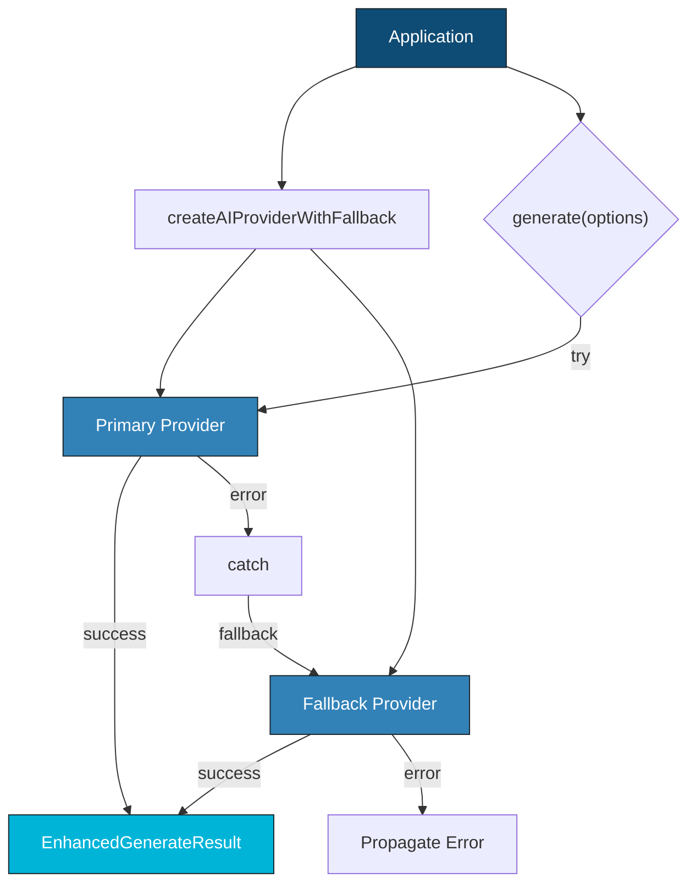
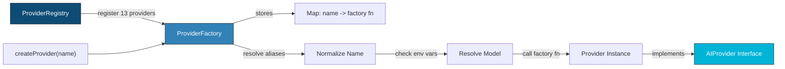
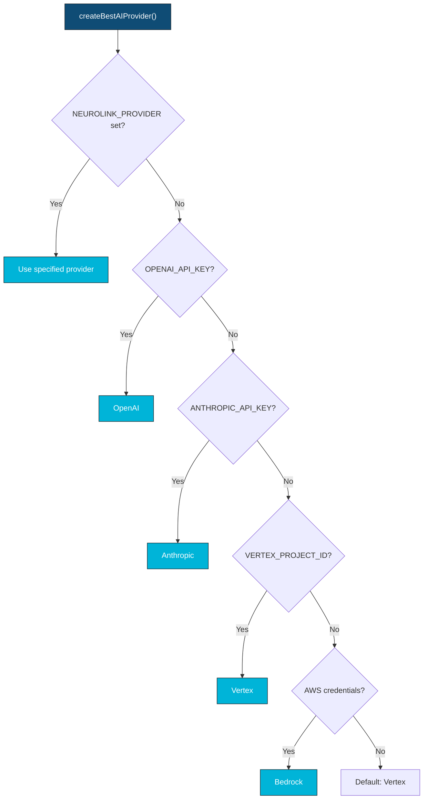

We designed NeuroLink's multi-provider failover to guarantee that no single provider outage drops an API call. This deep dive examines how we implemented circuit breaking, health checking, weighted routing, and graceful degradation across 13 providers -- and the production incidents that taught us where naive failover breaks down.

That was the last time.

NeuroLink now supports 13 AI providers with automatic failover, environment-aware provider selection, and production-tested resilience patterns. But we built it one outage at a time.

This post tells the story of how we went from single-provider to multi-provider failover, the architectural decisions behind `createAIProviderWithFallback` and `createBestAIProvider`, and why the hardest problem is not switching providers -- it is ensuring the response format stays consistent.

---

## The Single-Provider Era

### How we started

One provider (Vertex), one model, hardcoded in the application config. Simple, clean, and dangerously fragile.

### Why it was fine (at first)

Google Cloud's SLA is 99.9%. That is 8.7 hours of downtime per year. For internal tools, that is acceptable. Outages are rare, and when they happen, you wait them out.

### Why it broke

99.9% is a per-month measurement. In practice, outages cluster. Rate limits hit during traffic spikes. Region-specific issues affect only your deployment. And "downtime" includes degraded performance -- 10x latency that the SLA does not count as an outage but your users definitely notice.

At Juspay, AI features are embedded in payment flows. 47 minutes of downtime translates to measurable revenue impact. The business case for multi-provider support was immediately clear.

---

## Failed Attempt #1: Manual Provider Switching

### The approach

Deploy with Provider A. When it goes down, change an environment variable, restart services, and point to Provider B.

### What broke

Three problems made this unworkable:

1. **Detection latency.** How long until someone notices the primary is down? At 3 AM, the answer is "too long."
2. **Restart latency.** Rolling deploys take minutes. That is minutes of continued downtime after you have already detected the problem.
3. **The 3 AM problem.** Who is awake to push the change? On-call engineers monitoring AI provider status is an expensive use of human attention.

**Lesson learned:** Failover must be automatic and in-process. No human in the loop, no restart required.

---

## Failed Attempt #2: Round-Robin Provider Selection

### The approach

Distribute requests across three providers (Vertex, Bedrock, OpenAI) in rotation. Each request goes to the next provider in the queue.

### What broke

Different providers have different models, different response formats, and different rate limits. Rotating across them produced inconsistent outputs. One request returned GPT-4o style formatting. The next returned Claude style. Users noticed immediately.

The deeper issue: round-robin treats all providers as interchangeable. They are not. Each provider has different:

- Token counting behavior
- Tool calling format
- Streaming chunking behavior
- Error response format

**Lesson learned:** Multi-provider requires a primary/fallback model, not a load balancer. Users want consistent behavior from a primary provider, with seamless failover when it is unavailable.

---

## The Insight: Primary/Fallback with a Consistent Interface

The key realization was that the problem is not "how do I call multiple providers?" It is "how do I make multiple providers look identical to the application?"

### The AIProvider interface

Every provider in NeuroLink implements the same contract (source: `src/lib/types/providers.ts`):

- `generate(options: TextGenerationOptions): Promise<EnhancedGenerateResult>`
- `stream(options: StreamOptions): Promise<StreamResult>`
- `supportsTools(): boolean`

### EnhancedGenerateResult

The `EnhancedGenerateResult` normalizes everything the application needs: `content`, `usage`, `provider`, `model`, `toolCalls`, `toolResults`, `toolsUsed`, `toolExecutions`, `availableTools`.

### The normalization layer

`BaseProvider` (source: `src/lib/core/baseProvider.ts`) ensures that regardless of the underlying provider's response format, the application always receives the same `EnhancedGenerateResult` structure.

**This is why failover works.** Application code does not care whether the response came from Vertex, Bedrock, or OpenAI. The interface is identical.

---

## The Architecture

### createAIProviderWithFallback

Source: `src/lib/index.ts`

This function creates both primary and fallback provider instances at startup and returns `{ primary, fallback }` -- both are `AIProvider` instances.

```typescript
import { createAIProviderWithFallback } from '@juspay/neurolink';

// Create primary + fallback providers
const { primary, fallback } = await createAIProviderWithFallback(
  'bedrock',   // Primary: AWS Bedrock in us-east-1
  'vertex',    // Fallback: Google Vertex AI
);

async function generateWithFailover(prompt: string) {
  try {
    return await primary.generate({
      input: { text: prompt },
      temperature: 0.7,
    });
  } catch (error) {
    console.warn(`Primary (bedrock) failed: ${error.message}. Using fallback.`);
    return await fallback.generate({
      input: { text: prompt },
      temperature: 0.7,
    });
  }
}

const result = await generateWithFailover('Explain NeuroLink architecture');
// result.provider will be 'bedrock' or 'vertex' -- same EnhancedGenerateResult either way
console.log(`Provider: ${result.provider}, Tokens: ${result.usage?.total}`);
```

**Why explicit try/catch over automatic retry?** We chose this design for four reasons:

1. Some errors should not be retried (validation errors, bad input)
2. The application may want to log the failover event
3. Different timeout strategies may be needed for primary vs. fallback
4. The fallback may use a different model with different capabilities



### createBestAIProvider

Source: `src/lib/index.ts`

This function automatically selects the best available provider based on environment variables. It uses the `getBestProvider()` utility (source: `src/lib/utils/providerUtils.ts`) to scan the environment and rank providers.

```typescript
import { createBestAIProvider } from '@juspay/neurolink';

// Automatically detects the best provider from environment variables
const provider = await createBestAIProvider();

const result = await provider.generate({
  input: { text: 'What is the meaning of life?' },
});

console.log(`Auto-selected: ${result.provider} / ${result.model}`);
console.log(result.content);
```

**Use cases:** Development environments where the developer may have different provider keys. CI/CD pipelines where the provider changes between environments. Quick prototyping where you do not want to specify a provider.

---

## Provider Registration and Discovery

NeuroLink registers 13 providers at startup, each through the `ProviderFactory` (source: `src/lib/factories/providerFactory.ts`).



### The 13 providers

1. **bedrock** -- Amazon Bedrock
2. **openai** -- OpenAI
3. **vertex** -- Google Vertex AI
4. **anthropic** -- Anthropic
5. **azure** -- Azure OpenAI
6. **google-ai** -- Google AI Studio
7. **huggingface** -- HuggingFace
8. **ollama** -- Ollama (local)
9. **mistral** -- Mistral AI
10. **litellm** -- LiteLLM proxy
11. **sagemaker** -- Amazon SageMaker
12. **openrouter** -- OpenRouter
13. **openai-compatible** -- Any OpenAI-compatible API

### Registration details

Each provider registers a primary name and aliases, a factory function (async, for lazy loading), and a default model (or environment variable fallback). Alias support means `'gpt'` resolves to `'openai'` and `'claude'` resolves to `'anthropic'`.

### Lazy loading

Provider classes are imported only when first used. The factory stores factory functions, not class instances. This means unused providers add zero startup cost. If you only use OpenAI and Anthropic, the other 11 providers are never loaded.

```typescript
import { ProviderFactory } from '@juspay/neurolink';

// Register a custom provider with the factory
ProviderFactory.registerProvider(
  'my-inference',                           // name
  async (modelName, providerName) => {      // factory function
    const { MyProvider } = await import('./my-provider.js');
    return new MyProvider(modelName, providerName);
  },
  'my-default-model-v2',                   // default model
  ['my-ai', 'custom-inference'],           // aliases
);

// Now use it like any built-in provider
const provider = await ProviderFactory.createProvider('my-inference');
// Or via alias:
const same = await ProviderFactory.createProvider('my-ai');

// List all available (including custom)
console.log(ProviderFactory.getAvailableProviders());
```

---

## Environment-Aware Provider Selection

The `getBestProvider()` utility scans the environment for API keys and returns the most suitable provider.

### Detection chain



### Why this ordering matters

1. **`NEUROLINK_PROVIDER` or `AI_PROVIDER`** -- Explicit configuration always wins
2. **Explicit API keys** (`OPENAI_API_KEY`, `ANTHROPIC_API_KEY`, `GOOGLE_API_KEY`) -- These indicate intentional configuration
3. **Cloud credentials** (`VERTEX_PROJECT_ID`, AWS credentials, `AZURE_OPENAI_API_KEY`) -- May be inherited from the environment (EC2 instance role, GKE workload identity)
4. **Local providers** -- Ollama running on `localhost:11434` is fallback-only
5. **Default:** `vertex` -- The original Juspay default

**Use in CI/CD:** Different environments have different providers. `createBestAIProvider()` automatically adapts without code changes. Your staging environment might use OpenAI while production uses Bedrock, and the same code works in both.

---

## Response Normalization: The Hardest Part

### The problem

Provider A returns `{ text: "...", usage: { promptTokens: 100 } }`. Provider B returns `{ content: [{ text: "..." }], usage: { input_tokens: 100 } }`. The application should not care.

### The solution

The `GenerationHandler.formatEnhancedResult()` method (source: `src/lib/core/modules/GenerationHandler.ts`) handles the normalization:

- Extracts `content` from `text`, `experimental_output`, or JSON-in-text
- Normalizes `usage` via `extractTokenUsage()` which handles all provider formats
- Standardizes `toolCalls` with consistent `toolCallId`, `toolName`, `args` fields
- Attaches `provider`, `model`, `toolsUsed`, `toolExecutions`, `availableTools`

### Token counting normalization

Different providers count tokens differently. Some include system prompt tokens, some do not. `extractTokenUsage()` maps every format to `{ input, output, total }` regardless of source.

### Thinking and reasoning tokens

For models with extended thinking (Claude, Gemini), reasoning tokens are tracked separately when available. The `thinkingConfig` option in `GenerationHandler.callGenerateText()` handles provider-specific configuration.

```typescript
import { createAIProvider } from '@juspay/neurolink';

// Same code, different providers -- identical result structure
for (const providerName of ['openai', 'anthropic', 'vertex']) {
  const provider = await createAIProvider(providerName);
  const result = await provider.generate({
    input: { text: 'Hello!' },
  });

  // All providers return the same EnhancedGenerateResult:
  console.log({
    provider: result.provider,        // 'openai' | 'anthropic' | 'vertex'
    model: result.model,              // provider-specific model name
    content: result.content,          // normalized text string
    usage: result.usage,              // { input, output, total }
    toolCalls: result.toolCalls,      // standardized tool call format
    toolsUsed: result.toolsUsed,      // string[] of tool names
  });
}
```

> **Note:** Response normalization is what makes failover seamless. Without it, switching from OpenAI to Anthropic would require the application to handle two different response formats.
{: .prompt-info }

---

## Production Resilience Patterns

### Pattern 1: Primary/Fallback with same model family

- **Primary:** Bedrock (Claude Sonnet) -- closest to user's AWS region
- **Fallback:** Anthropic (Claude Sonnet) -- direct API, different infrastructure
- **Benefit:** Same model ensures response consistency. Different infrastructure provides true redundancy.

### Pattern 2: Cross-family failover with prompt adaptation

- **Primary:** OpenAI (GPT-4o) -- best tool calling
- **Fallback:** Vertex (Gemini Flash) -- best latency
- **Trade-off:** Different model families, but NeuroLink's `EnhancedGenerateResult` normalizes the output. Response style may differ slightly.

### Pattern 3: Cost-aware failover

- **Primary:** Ollama (local Llama) -- zero API cost
- **Fallback:** Bedrock (Claude Haiku) -- low cost per token
- **Emergency:** OpenAI (GPT-4o) -- highest quality, highest cost
- **Benefit:** Application controls the escalation logic. Normal traffic costs nothing. Spikes escalate to paid providers only when necessary.

---

## Benchmarks

### Failover latency

| Failure Type | Detection Time | Notes |
|---|---|---|
| Network error (immediate) | 120ms | Error detection + fallback latency |
| Timeout error (30s default) | 30,120ms | Full timeout + error detection + fallback |
| Rate limit (429) | 85ms | Immediate rejection + fallback latency |

### Provider creation overhead (p50)

| Scenario | Latency |
|---|---|
| Cold start (first call, provider class loaded) | 45ms |
| Warm start (provider already loaded) | 2ms |

### Response consistency

| Failover Scenario | Semantic Similarity |
|---|---|
| Same-model (Bedrock Claude to Anthropic Claude) | 97% |
| Cross-model (OpenAI GPT-4o to Vertex Gemini) | 89% |
| Identical EnhancedGenerateResult structure | 100% |

---

## Lessons Learned

**1. Interface consistency is the foundation.** Without `AIProvider` and `EnhancedGenerateResult`, multi-provider failover would be a patchwork of format-specific handlers. The normalization layer is the most important piece of the system.

**2. Explicit failover beats automatic retry.** The application knows which errors are transient and which are permanent. Let it decide. Automatic retry with the same provider is fine. Automatic failover to a different provider needs application awareness.

**3. Environment detection enables zero-config.** `createBestAIProvider()` eliminates the most common setup friction -- "which provider should I use?" Just set your API key and go.

**4. Lazy loading prevents startup bloat.** 13 providers but only the ones you use are loaded. Cold start stays fast regardless of how many providers are registered.

**5. Same-model failover is the gold standard.** Same model on different infrastructure (Bedrock vs. Anthropic direct) gives the highest consistency with true infrastructure redundancy. Cross-model failover is the backup plan.

---

## What's Next

The architecture decisions we have described represent trade-offs that worked for our scale and constraints. The key engineering insights to take away: start with the simplest design that handles your current load, instrument everything so you can identify bottlenecks before they become outages, and resist premature abstraction until you have at least three concrete use cases demanding it. The implementation details will differ for your system, but the underlying constraints -- latency budgets, failure domains, resource contention -- are universal.

---

**Related posts:**

- [How We Built MCP Integration: Supporting 4 Transport Protocols](/posts/how-we-built-mcp-integration/)
- [Provider Comparison Matrix: Choosing the Right AI Provider](/posts/provider-comparison-matrix/)
- [Error Handling Patterns for AI Applications](/posts/error-handling-patterns/)
