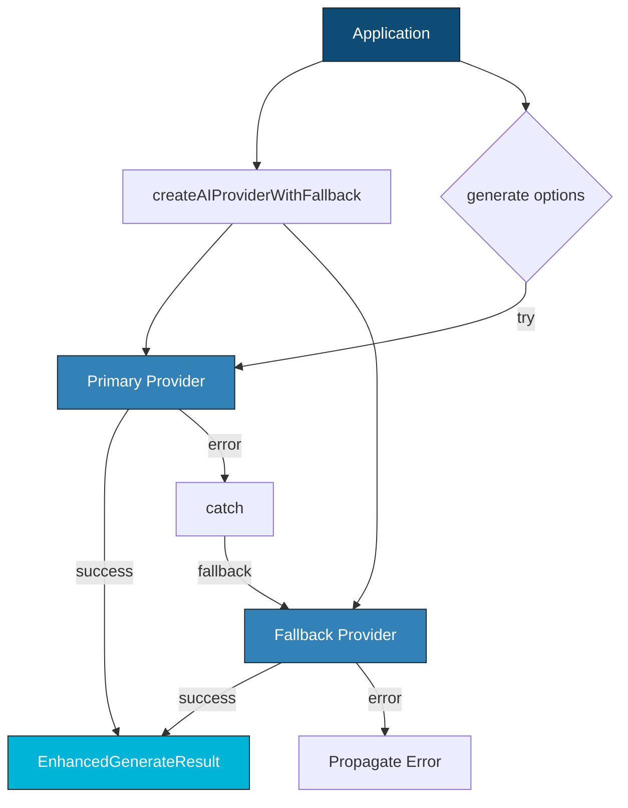
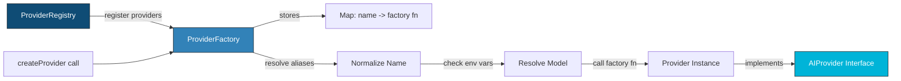
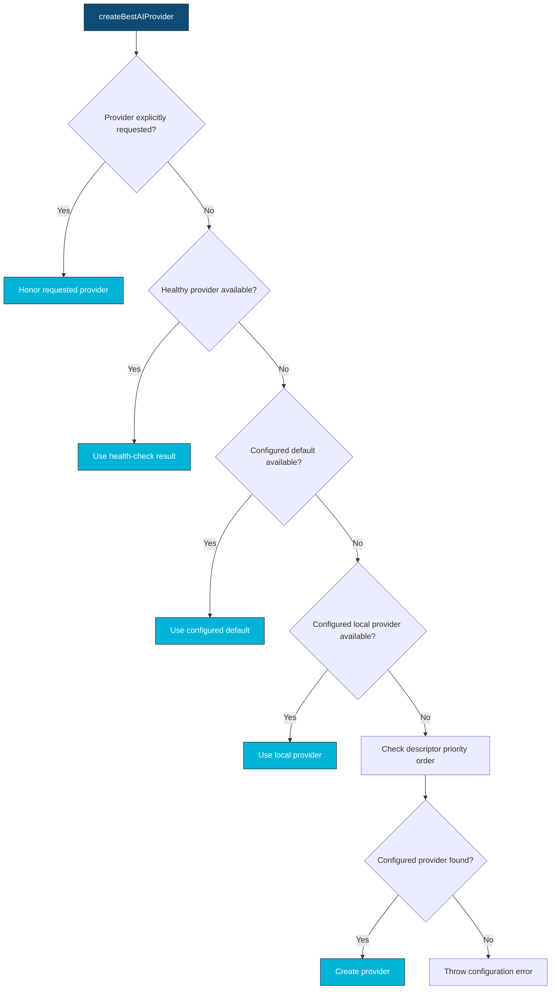

NeuroLink's multi-provider primitives let an application avoid making one vendor its only failure domain. This deep dive examines the implementation of explicit fallback policies, environment-aware selection, retries, and response normalization across a broad provider catalog.

No SDK can guarantee that every request succeeds: a fallback can fail too, and validation or authentication errors usually should surface instead of being hidden. The useful goal is narrower -- keep transient provider failures from becoming application outages when another configured provider can serve the request.

This post explains the roles of `providerFallback`, `createAIProviderWithFallback`, and `createBestAIProvider`, and why switching providers is only half the problem: the application also needs a consistent result shape.

---

## The Single-Provider Era

### A common starting point

Consider an application with one provider (for example, Vertex), one model, and a provider name fixed in configuration. The design is simple, but that provider is also a single failure domain.

### Why it can be acceptable initially

For prototypes and non-critical internal tools, waiting out a rare outage may be a reasonable trade-off. The design has fewer credentials, fewer model-behavior differences, and less operational overhead.

### Where it breaks down

Production failures are not limited to complete provider outages. Rate limits can appear during traffic spikes, credentials or model access can change, regional services can degrade, and latency can rise without a clean availability failure. In a payment-related workflow, even a short interruption can affect users, so a second configured provider can be worth the added operational complexity.

---

## Naive Approach #1: Manual Provider Switching

### The approach

A team might deploy with Provider A, then change an environment variable and restart services when it fails.

### What breaks

Three problems make this unsuitable for availability-sensitive paths:

1. **Detection latency.** The application keeps failing until monitoring or a person notices.
2. **Restart latency.** A rollout adds more delay after detection.
3. **Operational load.** Provider incidents become manual on-call procedures.

**Design implication:** If continuity matters, execute the fallback policy in-process rather than requiring a redeploy.

---

## Naive Approach #2: Round-Robin Provider Selection

### The approach

Another tempting design is to distribute requests across Vertex, Bedrock, and OpenAI in rotation.

### What breaks

Different providers expose different model families, rate limits, and behavioral characteristics. One request may use GPT-5.4 while the next uses Claude, so output style and capabilities can vary even when the result object has the same fields.

The deeper issue is that round-robin treats all providers as interchangeable. They are not. Each provider has different:

- Token counting behavior
- Tool calling format
- Streaming chunking behavior
- Error response format

**Design implication:** Prefer a primary provider with an explicit fallback policy when consistency matters. Load distribution is a separate requirement and should account for model capabilities, not just request count.

---

## The Insight: Primary/Fallback with a Consistent Interface

The key realization was that the problem is not "how do I call multiple providers?" It is "how do I make multiple providers look identical to the application?"

### The AIProvider interface

Every text-generation provider in NeuroLink implements the same core contract (source: `src/lib/types/providers.ts`):

- `generate(options: TextGenerationOptions): Promise<EnhancedGenerateResult | null>`
- `stream(options: StreamOptions): Promise<StreamResult>`
- `supportsTools?(): boolean`

### EnhancedGenerateResult

The `EnhancedGenerateResult` normalizes everything the application needs: `content`, `usage`, `provider`, `model`, `toolCalls`, `toolResults`, `toolsUsed`, `toolExecutions`, `availableTools`.

### The normalization layer

`BaseProvider` (source: `src/lib/core/baseProvider.ts`) ensures that regardless of the underlying provider's response format, the application always receives the same `EnhancedGenerateResult` structure.

**This is why failover works.** Application code does not care whether the response came from Vertex, Bedrock, or OpenAI. The interface is identical.

---

## The Architecture

### Automatic per-call fallback with `providerFallback`

For the high-level `NeuroLink` API, configure a callback that chooses the next provider and model. The callback receives the error and returns `{ provider, model }`, or `null` to let the error bubble. It runs after same-provider retries; a per-call callback overrides the instance-level callback.

```typescript
import { NeuroLink } from '@juspay/neurolink';

const neurolink = new NeuroLink({
  providerFallback: async (error: unknown) => {
    console.warn('Primary provider failed:', error);
    return { provider: 'vertex', model: 'gemini-2.5-flash' };
  },
});

const result = await neurolink.generate({
  input: { text: 'Explain NeuroLink architecture' },
  provider: 'openai',
  model: 'gpt-5.4',
});

console.log(result.content);
```

The callback above intentionally falls back on any non-cancellation error. In a production application, return `null` for errors your policy considers non-recoverable.

### Lower-level provider pair

`createAIProviderWithFallback()` (source: `src/lib/index.ts`) constructs both provider instances and returns `{ primary, fallback }`. It does **not** execute the fallback automatically; the application calls the second provider in its catch path.

```typescript
import { createAIProviderWithFallback } from '@juspay/neurolink';

// Create primary + fallback providers
const { primary, fallback } = await createAIProviderWithFallback(
  'bedrock',   // Primary: AWS Bedrock in us-east-1
  'vertex',    // Fallback: Google Vertex AI
);

async function generateWithFailover(prompt: string) {
  try {
    return await primary.generate({
      input: { text: prompt },
      temperature: 0.7,
    });
  } catch (error) {
    const message = error instanceof Error ? error.message : String(error);
    console.warn(`Primary (bedrock) failed: ${message}. Using fallback.`);
    return await fallback.generate({
      input: { text: prompt },
      temperature: 0.7,
    });
  }
}

const result = await generateWithFailover('Explain NeuroLink architecture');
// result.provider will be 'bedrock' or 'vertex' -- same EnhancedGenerateResult either way
console.log(`Provider: ${result.provider}, Tokens: ${result.usage?.total}`);
```

**Why use the lower-level pair?** Explicit try/catch is useful when the application needs direct control:

1. Some errors should not be retried (validation errors, bad input)
2. The application may want to log the failover event
3. Different timeout strategies may be needed for primary vs. fallback
4. The fallback may use a different model with different capabilities


```mermaid
flowchart TD
    A["Application"] --> B["createAIProviderWithFallback"]
    B --> C["Primary Provider"]
    B --> D["Fallback Provider"]
    A --> E{"generate options"}
    E -->|"try"| C
    C -->|"success"| F["EnhancedGenerateResult"]
    C -->|"error"| G["catch"]
    G -->|"fallback"| D
    D -->|"success"| F
    D -->|"error"| H["Propagate Error"]
    style A fill:#0f4c75,stroke:#1b262c,color:#fff
    style F fill:#00b4d8,stroke:#1b262c,color:#fff
    style C fill:#3282b8,stroke:#1b262c,color:#fff
    style D fill:#3282b8,stroke:#1b262c,color:#fff
```

### createBestAIProvider

Source: `src/lib/index.ts`

This function uses `getBestProvider()` (source: `src/lib/utils/providerUtils.ts`). It honors an explicitly requested provider; otherwise it asks the health checker for a healthy provider, then falls back to configured-provider checks and descriptor priorities. If no configured provider is available, it throws rather than silently choosing an unconfigured default.

```typescript
import { createBestAIProvider } from '@juspay/neurolink';

// Automatically detects the best provider from environment variables
const provider = await createBestAIProvider();

const result = await provider.generate({
  input: { text: 'What is the meaning of life?' },
});

console.log(`Auto-selected: ${result.provider} / ${result.model}`);
console.log(result.content);
```

**Use cases:** Development environments where the developer may have different provider keys. CI/CD pipelines where the provider changes between environments. Quick prototyping where you do not want to specify a provider.

---

## Provider Registration and Discovery

NeuroLink v12 exposes 33 named LLM providers (14 native and 19 JSON-catalog providers), plus a generic OpenAI-compatible adapter. Native providers and catalog entries are registered lazily through `ProviderFactory` and `ProviderRegistry` (source: `src/lib/factories/providerFactory.ts` and `src/lib/factories/providerRegistry.ts`).


```mermaid
flowchart LR
    A["ProviderRegistry"] -->|"register providers"| B["ProviderFactory"]
    B -->|"stores"| C["Map: name -> factory fn"]
    D["createProvider call"] --> B
    B -->|"resolve aliases"| E["Normalize Name"]
    E -->|"check env vars"| F["Resolve Model"]
    F -->|"call factory fn"| G["Provider Instance"]
    G -->|"implements"| H["AIProvider Interface"]
    style A fill:#0f4c75,stroke:#1b262c,color:#fff
    style B fill:#3282b8,stroke:#1b262c,color:#fff
    style H fill:#00b4d8,stroke:#1b262c,color:#fff
```

### Provider groups

- **Direct and cloud providers:** OpenAI, Anthropic, Google AI Studio, Vertex AI, Azure OpenAI, Bedrock, SageMaker, and others.
- **Gateways and local runtimes:** OpenRouter, LiteLLM, Ollama, LM Studio, llama.cpp, and the generic OpenAI-compatible adapter.
- **Catalog-backed providers:** Mistral, DeepSeek, xAI, Groq, Cerebras, Fireworks, Hugging Face, and other OpenAI-compatible services.

Use `ProviderFactory.getAllDescriptors()` when application code needs the canonical built-in provider catalog; `getAvailableProviders()` also includes registered aliases.

### Registration details

Each provider registers a primary name and aliases, a factory function (async, for lazy loading), and a default model (or environment variable fallback). Alias support means `'gpt'` resolves to `'openai'` and `'claude'` resolves to `'anthropic'`.

### Lazy loading

Provider classes are imported only when first used. The factory stores factory functions, not class instances. This means unused native provider implementations are not imported at startup. If you only use OpenAI and Anthropic, unrelated provider clients are not loaded.

```typescript
import { ProviderFactory } from '@juspay/neurolink';

// Register a custom provider with the factory
ProviderFactory.registerProvider(
  'my-inference',                           // name
  async (modelName, providerName) => {      // factory function
    const { MyProvider } = await import('./my-provider.js');
    return new MyProvider(modelName, providerName);
  },
  'my-default-model-v2',                   // default model
  ['my-ai', 'custom-inference'],           // aliases
);

// Now use it like any built-in provider
const provider = await ProviderFactory.createProvider('my-inference');
// Or via alias:
const same = await ProviderFactory.createProvider('my-ai');

// List all available (including custom)
console.log(ProviderFactory.getAvailableProviders());
```

---

## Environment-Aware Provider Selection

The `getBestProvider()` utility scans the environment for API keys and returns the most suitable provider.

### Detection chain


```mermaid
flowchart TD
    A["createBestAIProvider"] --> B{"Provider explicitly requested?"}
    B -->|"Yes"| C["Honor requested provider"]
    B -->|"No"| D{"Healthy provider available?"}
    D -->|"Yes"| E["Use health-check result"]
    D -->|"No"| F{"Configured default available?"}
    F -->|"Yes"| G["Use configured default"]
    F -->|"No"| H{"Configured local provider available?"}
    H -->|"Yes"| I["Use local provider"]
    H -->|"No"| J["Check descriptor priority order"]
    J --> K{"Configured provider found?"}
    K -->|"Yes"| L["Create provider"]
    K -->|"No"| M["Throw configuration error"]
    style A fill:#0f4c75,stroke:#1b262c,color:#fff
    style C fill:#00b4d8,stroke:#1b262c,color:#fff
    style E fill:#00b4d8,stroke:#1b262c,color:#fff
    style G fill:#00b4d8,stroke:#1b262c,color:#fff
    style I fill:#00b4d8,stroke:#1b262c,color:#fff
    style L fill:#00b4d8,stroke:#1b262c,color:#fff
```

### Why this ordering matters

1. **Explicit request:** A provider passed to `createBestAIProvider()` is honored.
2. **Health information:** Without an explicit request, the health checker can select a currently healthy provider.
3. **Configuration:** The legacy fallback checks an available `DEFAULT_PROVIDER`, then a configured local Ollama runtime, then providers ordered by descriptor priority.
4. **Failure is explicit:** If no provider is configured and available, selection throws a configuration error.

**Use in CI/CD:** Different environments can expose different credentials while application code stays the same. Keep the provider decision observable, because auto-selection is an environment-dependent choice rather than a fixed deployment contract.

---

## Response Normalization: The Hardest Part

### The problem

Provider A returns `{ text: "...", usage: { promptTokens: 100 } }`. Provider B returns `{ content: [{ text: "..." }], usage: { input_tokens: 100 } }`. The application should not care.

### The solution

`BaseProvider` and provider-specific clients normalize responses into the shared result types:

- `GenerateResult.content` is the primary text output
- `usage` uses the common `{ input, output, total }` shape
- Tool calls use consistent `toolCallId`, `toolName`, and `args` fields
- Provider and tool metadata are exposed through shared optional result fields

### Token counting normalization

Different providers count tokens differently. Some include system prompt tokens, some do not. `extractTokenUsage()` maps every format to `{ input, output, total }` regardless of source.

### Thinking and reasoning tokens

For models with extended thinking (Claude, Gemini), reasoning tokens are tracked separately when available. The `thinkingConfig` option on `generate()`/`stream()` is translated into provider-specific configuration inside each provider client (e.g., `src/lib/providers/anthropic/client.ts`, `src/lib/providers/googleVertex/client.ts`).

```typescript
import { createAIProvider } from '@juspay/neurolink';

// Same code, different providers -- identical result structure
for (const providerName of ['openai', 'anthropic', 'vertex']) {
  const provider = await createAIProvider(providerName);
  const result = await provider.generate({
    input: { text: 'Hello!' },
  });

  // All providers return the same EnhancedGenerateResult:
  console.log({
    provider: result.provider,        // 'openai' | 'anthropic' | 'vertex'
    model: result.model,              // provider-specific model name
    content: result.content,          // normalized text string
    usage: result.usage,              // { input, output, total }
    toolCalls: result.toolCalls,      // standardized tool call format
    toolsUsed: result.toolsUsed,      // string[] of tool names
  });
}
```

> **Note:** Response normalization is what makes failover seamless. Without it, switching from OpenAI to Anthropic would require the application to handle two different response formats.
{: .prompt-info }

---

## Production Resilience Patterns

### Pattern 1: Primary/Fallback with same model family

- **Primary:** Bedrock (Claude Sonnet) -- closest to user's AWS region
- **Fallback:** Anthropic (Claude Sonnet) -- direct API, different infrastructure
- **Benefit:** Same model ensures response consistency. Different infrastructure provides true redundancy.

### Pattern 2: Cross-family failover with prompt adaptation

- **Primary:** OpenAI (GPT-5.4) -- best tool calling
- **Fallback:** Vertex (Gemini Flash) -- best latency
- **Trade-off:** Different model families, but NeuroLink's `EnhancedGenerateResult` normalizes the output. Response style may differ slightly.

### Pattern 3: Cost-aware failover

- **Primary:** Ollama (local Llama) -- zero API cost
- **Fallback:** Bedrock (Claude Haiku) -- low cost per token
- **Emergency:** OpenAI (GPT-5.4) -- highest quality, highest cost
- **Benefit:** Application controls the escalation logic. Normal traffic costs nothing. Spikes escalate to paid providers only when necessary.

---

## What to Measure

Failover adds work, so measure it in your own environment rather than relying on generic latency numbers.

| Signal | What it reveals |
|---|---|
| Time to classify the primary error | Whether timeout policy dominates recovery time |
| Same-provider retry time | How much latency is spent before cross-provider fallback |
| Fallback provider latency and error rate | Whether the backup is actually independent and healthy |
| Model and provider recorded per result | Which path served each request |
| Evaluation score before and after fallback | Whether cross-model behavior remains acceptable |

Run the same prompt set against the primary and fallback models, and set acceptance thresholds for your application. A shared `EnhancedGenerateResult` shape makes response handling consistent, but it does not guarantee semantically identical answers.

---

## Lessons Learned

**1. Interface consistency is the foundation.** Without `AIProvider` and `EnhancedGenerateResult`, multi-provider failover would be a patchwork of format-specific handlers. The normalization layer is the most important piece of the system.

**2. Retry and fallback solve different problems.** NeuroLink retries the same provider before fallback. Use `providerFallback` or an explicit provider pair to make cross-provider policy visible to the application.

**3. Environment detection reduces setup friction.** `createBestAIProvider()` can select among configured providers, but production deployments should log the selected provider and treat missing configuration as an error.

**4. Lazy registration limits unnecessary loading.** Native provider implementations are dynamically imported when they are needed rather than all at startup.

**5. Same-model failover is the gold standard.** Same model on different infrastructure (Bedrock vs. Anthropic direct) gives the highest consistency with true infrastructure redundancy. Cross-model failover is the backup plan.

---

## What's Next

The architecture decisions described here represent trade-offs that should be validated against your scale and constraints. The key engineering insights to take away: start with the simplest design that handles your current load, instrument everything so you can identify bottlenecks before they become outages, and resist premature abstraction until you have at least three concrete use cases demanding it. The implementation details will differ for your system, but the underlying constraints -- latency budgets, failure domains, resource contention -- are universal.

---

**Related posts:**

- [How We Built MCP Integration: Supporting 4 Transport Protocols](/posts/how-we-built-mcp-integration/)
- [Provider Comparison Matrix: Choosing the Right AI Provider](/posts/provider-comparison-matrix/)
- [Error Handling Patterns for AI Applications](/posts/error-handling-patterns/)
