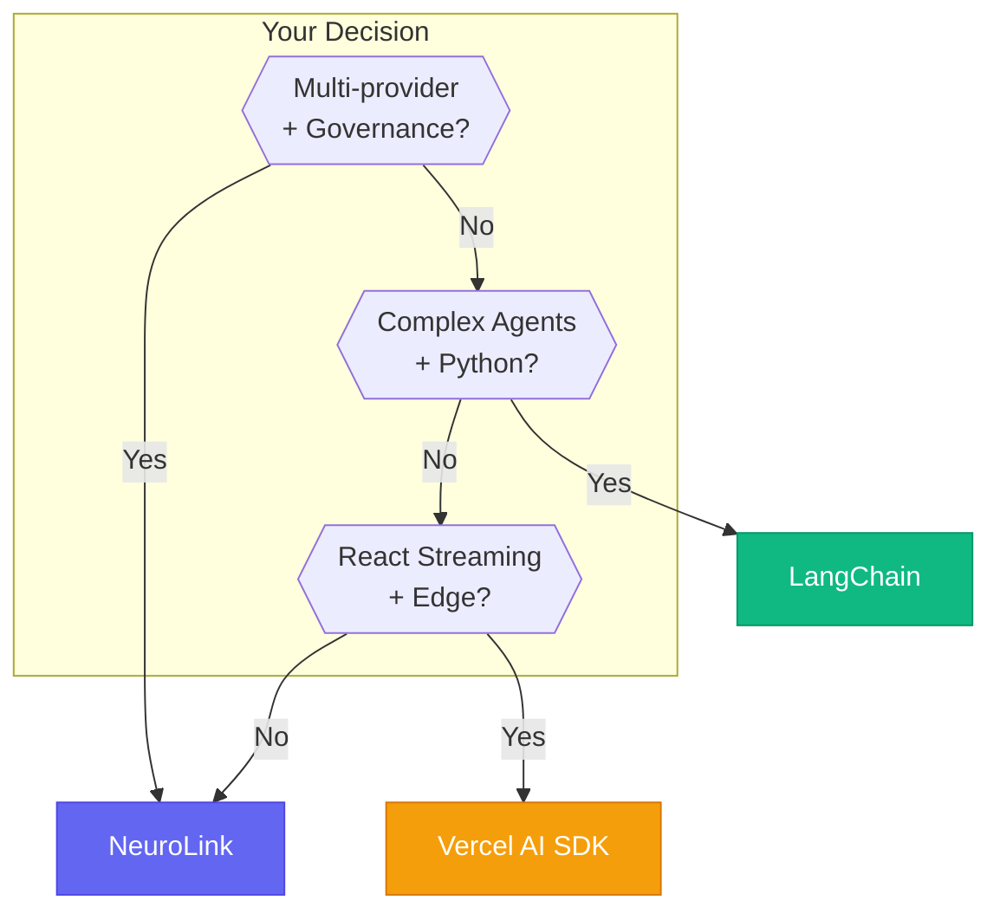
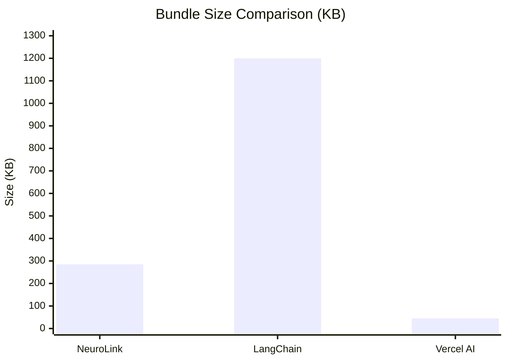

# NeuroLink vs. LangChain vs. Vercel AI SDK: The Definitive 2026 Comparison

The AI SDK landscape has matured. Choosing the right framework now determines your velocity for years.

Three distinct philosophies dominate the space:

- **NeuroLink**: Enterprise-first, unified provider API, production governance
- **LangChain**: Composable building blocks, extensive ecosystem, agent-focused
- **Vercel AI SDK**: Minimal, streaming-optimized, React-native

Each excels in its domain. None fits every use case. This comparison helps you choose.

We built NeuroLink. We're biased toward it. But we aim for honesty here—we'll tell you when competitors do something better.

Our methodology: real code comparisons, reproducible benchmarks, honest feature assessment. You decide what matters for your project.



---

## Framework Philosophy Overview

Understanding each framework's origin explains its strengths.

### NeuroLink

| Aspect | Details |
|--------|---------|
| **Origin** | Extracted from Juspay production systems |
| **Philosophy** | Enterprise-grade, unified provider API, built-in governance |
| **Language** | TypeScript-first (SDK + CLI) |
| **Focus** | Multi-provider access, HITL, guardrails, multimodal |
| **Version** | 8.x (mature, battle-tested; check npm for latest) |

NeuroLink emerged from real production needs at Juspay, processing enterprise-scale AI workloads. Every feature exists because production demanded it.

### LangChain

| Aspect | Details |
|--------|---------|
| **Origin** | Open-source community project (Harrison Chase) |
| **Philosophy** | Composable chains and agents, extensive integrations |
| **Language** | Python-first (TypeScript port available) |
| **Focus** | Chains, agents, memory, retrieval, ecosystem |
| **Ecosystem** | LangSmith, LangServe, 100+ integrations |

LangChain pioneered the "chain" abstraction. Its ecosystem is unmatched for agent development and retrieval-augmented generation (RAG).

### Vercel AI SDK

| Aspect | Details |
|--------|---------|
| **Origin** | Vercel engineering team |
| **Philosophy** | Minimal, streaming-optimized, React-native |
| **Language** | TypeScript only |
| **Focus** | Frontend integration, streaming, edge deployment |
| **Bundle** | 45KB (smallest in class) |

Vercel AI SDK prioritizes developer experience for React applications. If you're building Next.js apps with streaming UI, nothing matches its simplicity.

---

## Feature Comparison Matrix

### Provider Support

| Provider | NeuroLink | LangChain | Vercel AI SDK |
|----------|-----------|-----------|---------------|
| OpenAI | Native | Native | Native |
| Anthropic | Native | Native | Native |
| Google Vertex | Native | Native | Limited |
| AWS Bedrock | Native | Native | Limited |
| Azure OpenAI | Native | Native | Native |
| **OpenRouter (300+)** | **Native** | Community | No |
| **LiteLLM Hub** | **Native** | Community | No |
| Ollama (Local) | Native | Native | Native |
| Custom Endpoints | Native | Native | Limited |
| **Total Native Providers** | **13** | **10** | **5** |

**Key Insight**: NeuroLink's OpenRouter integration provides access to 300+ models through a single API key—a significant advantage for multi-model strategies.

### Enterprise Features

| Feature | NeuroLink | LangChain | Vercel AI SDK |
|---------|-----------|-----------|---------------|
| HITL Workflows | Built-in | Manual | No |
| Guardrails/Filters | Built-in | Via extension | No |
| PII Detection | Built-in | Manual | No |
| Audit Logging | Built-in | Manual | No |
| Redis Memory | Built-in | Via extension | No |
| Provider Failover | Built-in | Manual | No |
| Telemetry | OpenTelemetry | LangSmith | Vercel Analytics |
| Proxy Support | Full | Limited | No |

**Key Insight**: NeuroLink includes enterprise features out-of-the-box. LangChain requires additional setup or extensions. Vercel AI SDK focuses on frontend use cases.

### Multimodal Support

| Format | NeuroLink | LangChain | Vercel AI SDK |
|--------|-----------|-----------|---------------|
| Images | Native | Native | Native |
| PDF (native) | Native | Via loader | No |
| CSV | Native | Via loader | No |
| Audio | Native | Limited | No |
| Video | Native | Limited | No |
| Office Docs | Native | Via loader | No |

**Key Insight**: NeuroLink processes documents natively within the generate() call. LangChain requires separate loaders. Vercel AI SDK expects you to handle document processing externally.

### Developer Experience

| Feature | NeuroLink | LangChain | Vercel AI SDK |
|---------|-----------|-----------|---------------|
| TypeScript-First | Yes | Partial | Yes |
| Professional CLI | Yes | Basic | No |
| React Hooks | Via adapters | Via integration | **Native** |
| Next.js Integration | Yes | Yes | **Native** |
| Setup Wizard | Yes | No | No |
| Bundle Size | 285KB | 1.2MB | **45KB** |
| Learning Curve | Moderate | Steep | **Gentle** |

**Key Insight**: Vercel AI SDK wins on React integration and bundle size. LangChain has the steepest learning curve but most ecosystem depth.

> Bundle sizes measured with tree-shaking enabled. Actual sizes may vary based on import patterns and bundler configuration.

---

## Code Comparison

Real code tells the truth. Here's how each framework handles common tasks.

### Task 1: Basic Text Generation

**NeuroLink:**
```typescript
import { NeuroLink } from "@juspay/neurolink";

const ai = new NeuroLink();
const result = await ai.generate({
  input: { text: "Explain quantum computing" },
  provider: "anthropic"
});
console.log(result.content);
```

**LangChain:**
```typescript
import { ChatAnthropic } from "@langchain/anthropic";

const model = new ChatAnthropic();
const result = await model.invoke("Explain quantum computing");
console.log(result.content);
```

**Vercel AI SDK:**
```typescript
import { generateText } from "ai";
import { anthropic } from "@ai-sdk/anthropic";

const { text } = await generateText({
  model: anthropic("claude-sonnet-4-5-20250929"),
  prompt: "Explain quantum computing"
});
console.log(text);
```

**Verdict**: All three handle basic generation cleanly. LangChain is slightly more concise for simple cases. NeuroLink's unified `generate()` becomes advantageous when switching providers.

### Task 2: Streaming Response

**NeuroLink:**
```typescript
import { NeuroLink } from "@juspay/neurolink";

const ai = new NeuroLink();
const stream = await ai.stream({
  input: { text: "Write a story about a robot" },
  provider: "openai"
});

for await (const chunk of stream) {
  process.stdout.write(chunk.content);
}
```

**LangChain:**
```typescript
import { ChatOpenAI } from "@langchain/openai";

const chat = new ChatOpenAI({ streaming: true });
const stream = await chat.stream([
  ["human", "Write a story about a robot"]
]);

for await (const chunk of stream) {
  process.stdout.write(chunk.content);
}
```

**Vercel AI SDK:**
```typescript
import { streamText } from "ai";
import { openai } from "@ai-sdk/openai";

const result = await streamText({
  model: openai("gpt-4"),
  prompt: "Write a story about a robot"
});

for await (const chunk of result.textStream) {
  process.stdout.write(chunk);
}
```

**Verdict**: All three support streaming well. Vercel AI SDK's React hooks (`useChat`, `useCompletion`) provide the best frontend experience.

### Task 3: Document Processing

**NeuroLink:**
```typescript
import { NeuroLink } from "@juspay/neurolink";

const ai = new NeuroLink();

// Built-in, one line
const result = await ai.generate({
  input: {
    text: "Summarize this document",
    files: ["report.pdf", "data.csv"]
  },
  provider: "vertex"
});

console.log(result.content);
```

**LangChain:**
```typescript
import { PDFLoader } from "@langchain/community/document_loaders/fs/pdf";
import { CSVLoader } from "@langchain/community/document_loaders/fs/csv";
import { loadSummarizationChain } from "langchain/chains";

// Requires multiple steps
const pdfLoader = new PDFLoader("report.pdf");
const csvLoader = new CSVLoader("data.csv");

const pdfDocs = await pdfLoader.load();
const csvDocs = await csvLoader.load();
const allDocs = [...pdfDocs, ...csvDocs];

const chain = loadSummarizationChain(model, { type: "stuff" });
const result = await chain.call({ input_documents: allDocs });
```

**Vercel AI SDK:**
```typescript
import { generateText } from "ai";
import { extractTextFromPDF } from "./pdf-utils";  // Custom
import { parseCSV } from "./csv-utils";            // Custom

// Requires external document processing
const pdfText = await extractTextFromPDF("report.pdf");
const csvText = await parseCSV("data.csv");

const { text } = await generateText({
  model: openai("gpt-4"),
  prompt: `Summarize: ${pdfText}\n${csvText}`
});
```

**Verdict**: NeuroLink wins decisively for document processing. One call handles everything. LangChain requires explicit loaders. Vercel AI SDK requires custom implementation.

### Task 4: Enterprise Guardrails

**NeuroLink:**
```typescript
import { NeuroLink } from "@juspay/neurolink";

const ai = new NeuroLink({
  middleware: {
    guardrails: {
      precallEvaluation: {
        enabled: true,
        evaluationModel: "gemini-2.5-flash",
        thresholds: { safetyScore: 8 }
      },
      badWords: {
        regexPatterns: ["\\d{3}-\\d{2}-\\d{4}"],  // SSN
        action: "redact"
      }
    }
  }
});

// All requests automatically protected
const result = await ai.generate({
  input: { text: userInput }
});
```

**LangChain:**
```typescript
// Requires custom implementation or third-party
// No built-in guardrails - use callbacks/handlers
import { CallbackHandler } from "langchain/callbacks";

class CustomGuardrail extends CallbackHandler {
  async handleLLMStart(llm, prompts) {
    // Manual safety checking
    for (const prompt of prompts) {
      if (this.containsPII(prompt)) {
        throw new Error("PII detected");
      }
    }
  }
  // ... extensive manual implementation
}
```

**Vercel AI SDK:**
```typescript
// Not available
// Requires custom middleware in Next.js API routes
export async function POST(req) {
  const { prompt } = await req.json();

  // Manual safety check
  if (containsPII(prompt)) {
    return new Response("PII detected", { status: 400 });
  }

  // Continue with generation...
}
```

**Verdict**: NeuroLink provides production-grade guardrails out-of-the-box. Competitors require significant custom implementation.

---

## CLI Comparison

### NeuroLink CLI

```bash
# Quick generation
npx @juspay/neurolink generate "Explain quantum computing" --provider anthropic

# Streaming output
npx @juspay/neurolink stream "Write a haiku" --provider openai

# Document processing
npx @juspay/neurolink generate "Summarize this" --pdf report.pdf --provider vertex

# Model listing
npx @juspay/neurolink models list --provider openrouter
```

### LangChain CLI

```bash
# Basic (langchain-cli package)
langchain app new my-app
langchain serve

# Limited generation capabilities
# Primarily for project scaffolding
```

### Vercel AI SDK

```bash
# No CLI available
# Uses Next.js/Vercel CLI for deployment
npx create-next-app@latest my-ai-app
```

**Verdict**: NeuroLink's CLI enables rapid prototyping and scripting. LangChain's CLI focuses on project setup. Vercel AI SDK relies on framework CLIs.

---

## Performance Benchmarks

*Methodology: 1000 requests, Claude Sonnet 4.5, standardized prompts, Node.js 20*

> **Note:** Benchmarks may vary based on network conditions and provider response times.

| Metric | NeuroLink | LangChain | Vercel AI SDK |
|--------|-----------|-----------|---------------|
| Cold Start | 45ms | 120ms | **35ms** |
| TTFB (streaming) | 180ms | 210ms | **165ms** |
| Memory (idle) | 52MB | 95MB | **38MB** |
| Bundle Size | 285KB | 1.2MB | **45KB** |
| Setup Time | **2 min** (wizard) | 5-10 min | 2 min |
| Provider Switch | **<1ms** | 50-100ms | N/A |

### Interpretation

- **Vercel AI SDK**: Smallest footprint, fastest cold start—ideal for edge functions
- **NeuroLink**: Balanced performance with full feature set, fastest provider switching
- **LangChain**: Larger footprint due to extensive dependencies, slower initialization



---

## When to Choose Each

### Choose NeuroLink When:

- **Enterprise deployment** with compliance requirements (SOC2, HIPAA)
- **Multi-provider strategy** with failover needs
- **Document processing** is core to your use case
- **CLI-first development** workflow preferred
- **Production-grade guardrails** and HITL required
- **TypeScript team** building backend services

**Ideal Use Cases:**
- Financial services document processing
- Healthcare AI with compliance needs
- Enterprise chatbots with governance
- Multi-model routing and optimization

### Choose LangChain When:

- **Complex agent systems** with tool use
- **Extensive ecosystem integrations** (vector DBs, retrievers)
- **Python is primary** language
- **Research or academic** applications
- **RAG applications** with multiple retrievers
- **Community contributions** matter to you

**Ideal Use Cases:**
- Autonomous AI agents
- Research paper analysis
- Custom knowledge bases
- Academic experiments

### Choose Vercel AI SDK When:

- **Next.js/React applications** primary focus
- **Streaming UI** is core requirement
- **Minimal, clean API** is priority
- **Already in Vercel ecosystem**
- **Frontend-first development**
- **Bundle size critical** (edge functions)

**Ideal Use Cases:**
- AI chatbots in web apps
- Streaming content generation
- Vercel-deployed applications
- Real-time AI interfaces

---

## Quick Decision Matrix

| If you need... | Choose |
|----------------|--------|
| 300+ models via OpenRouter | **NeuroLink** |
| Native PDF/CSV processing | **NeuroLink** |
| Built-in HITL and Guardrails | **NeuroLink** |
| Complex agent chains | **LangChain** |
| Vector DB integrations | **LangChain** |
| Python ecosystem | **LangChain** |
| React streaming hooks | **Vercel AI SDK** |
| Smallest bundle size | **Vercel AI SDK** |
| Edge deployment | **Vercel AI SDK** |

---

## Migration Guides

### From LangChain to NeuroLink

```typescript
// Before (LangChain)
import { ChatOpenAI } from "@langchain/openai";
const model = new ChatOpenAI({ modelName: "gpt-4" });
const result = await model.invoke("Hello");
console.log(result.content);

// After (NeuroLink)
import { NeuroLink } from "@juspay/neurolink";
const ai = new NeuroLink();
const result = await ai.generate({
  input: { text: "Hello" },
  provider: "openai",
  model: "gpt-4"
});
console.log(result.content);
```

**Key Changes:**
- Replace provider-specific imports with unified NeuroLink
- Use `generate()` instead of `invoke()`
- Provider/model specified in config, not constructor

### From Vercel AI SDK to NeuroLink

```typescript
// Before (Vercel AI SDK)
import { generateText } from "ai";
import { openai } from "@ai-sdk/openai";

const { text } = await generateText({
  model: openai("gpt-4"),
  prompt: "Hello"
});

// After (NeuroLink)
import { NeuroLink } from "@juspay/neurolink";
const ai = new NeuroLink();

const { content } = await ai.generate({
  input: { text: "Hello" },
  provider: "openai",
  model: "gpt-4"
});
```

**Key Changes:**
- Single import instead of per-provider packages
- `content` instead of `text` for response
- Same model, different wrapping

---

## The Honest Summary

| Framework | Strengths | Weaknesses |
|-----------|-----------|------------|
| **NeuroLink** | Enterprise features, multi-provider, documents, CLI | Smaller community, newer ecosystem |
| **LangChain** | Ecosystem, agents, Python, community | Complexity, learning curve, bundle size |
| **Vercel AI SDK** | Simplicity, React, bundle size | Limited providers, no enterprise features |

**Our recommendation:**

1. **Building enterprise AI with governance needs?** → NeuroLink
2. **Building complex agents or RAG systems?** → LangChain
3. **Building React apps with streaming?** → Vercel AI SDK

The best framework is the one that matches your requirements. All three are production-quality tools maintained by capable teams.

---

## Get Started

### Try NeuroLink

```bash
pnpm dlx @juspay/neurolink setup
```

The setup wizard configures providers automatically. Make your first request in under 2 minutes.

### Related Resources

- **[OpenRouter Integration Guide]()** - Access 300+ models
- **[Multimodal Processing Tutorial]()** - PDF, CSV, documents
- **[Full SDK API Reference](https://docs.neurolink.ink/sdk/api-reference/)** - Complete documentation

---

*This comparison reflects framework capabilities as of January 2026. We update this article quarterly. Found an error? [Open an issue](https://github.com/juspay/neurolink/issues).*
