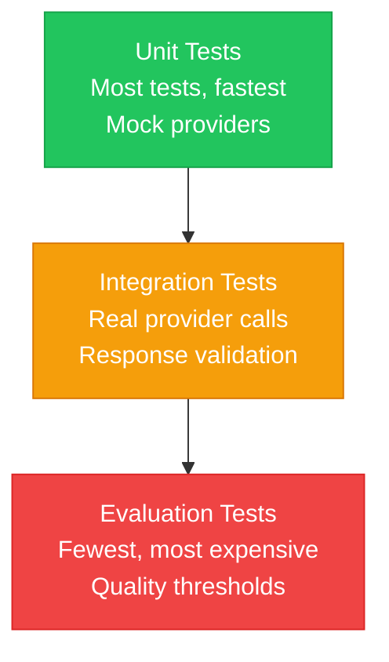

In this guide, you will set up a CI/CD pipeline for AI applications built with NeuroLink. You will configure automated testing with mock providers, implement prompt regression testing, build deployment gates based on model performance metrics, and deploy with confidence using blue-green strategies.

AI application testing requires a fundamentally different approach: evaluate quality, not exact matches. Instead of checking if the response is exactly "Hello, World!", you check if it contains a greeting, is coherent, and meets a quality threshold.

This guide covers how to set up CI/CD pipelines for AI applications built with NeuroLink. We will walk through the three testing layers -- unit tests with mock providers, integration tests with real providers, and evaluation-based quality gates -- and then cover server deployment, environment configuration, health monitoring, and rollback strategies.

---

## Architecture: AI Application CI/CD Pipeline

The pipeline follows the same structure as traditional CI/CD, with AI-specific additions at each stage.


The critical difference from traditional pipelines is the **Evaluation Tests** stage. This is where you gate deployments on AI response quality, not just code correctness.

---

## The Testing Pyramid for AI Apps

AI applications follow a modified testing pyramid. The shape is the same -- more unit tests at the base, fewer expensive tests at the top -- but the nature of each layer is different.



- **Unit tests** run against mock providers, testing your application logic without making API calls. They are fast, free, and deterministic.
- **Integration tests** make real API calls to verify that your application works end-to-end with actual providers. They cost money but catch real issues.
- **Evaluation tests** assess the quality of AI outputs using automated scoring. They are the most expensive but catch regressions in output quality that other tests miss.

---

## Layer 1: Unit Testing with Mock Providers

Unit tests verify your application logic without hitting any AI provider APIs. They are fast, free, and run on every commit.

### Test isolation with ProcessorRegistry

NeuroLink provides `ProcessorRegistry.resetInstance()` to reset singleton state between tests, preventing test pollution.

```typescript
import { ProcessorRegistry } from '@juspay/neurolink';

// Reset singleton between tests
beforeEach(() => {
  ProcessorRegistry.resetInstance();
});

// Test file processing logic without real files
test('processes PDF files correctly', async () => {
  const registry = ProcessorRegistry.getInstance();

  registry.register({
    name: 'mock-pdf',
    priority: 20,
    processor: mockPdfProcessor,
    isSupported: (mime) => mime === 'application/pdf',
  });

  const match = registry.findProcessor('application/pdf', 'test.pdf');
  expect(match).not.toBeNull();
  expect(match?.name).toBe('mock-pdf');
  expect(match?.confidence).toBeGreaterThan(0);
});
```

### What to unit test

- **Tool registration and execution** with mock responses. Verify that your tools are registered correctly, accept the right parameters, and return the expected format.
- **HITL flows** by simulating confirmation events. Test that dangerous actions trigger the approval flow and that rejection is handled gracefully.
- **Middleware chain configuration.** Verify that middleware is applied in the correct order and that each middleware modifies the request or response as expected.
- **Prompt templates** independent of LLM responses. Your prompt construction logic should be deterministic and testable without any AI provider.

> **Note:** Unit tests with mocks should cover the majority of your test suite. They run in milliseconds and cost nothing. Save real API calls for integration and evaluation tests.
{: .prompt-info }

---

## Layer 2: Integration Testing with Real Providers

Integration tests make actual API calls to verify end-to-end behavior. They run in CI with API keys stored as secrets.

```typescript
// Integration test with real provider (run in CI with API keys)
test('generates content with OpenAI', async () => {
  const neurolink = new NeuroLink();

  const result = await neurolink.generate({
    input: { text: 'Say "hello world" and nothing else.' },
    provider: 'openai',
    model: 'gpt-4o-mini', // Use cheapest model for CI
  });

  expect(result.content).toBeTruthy();
  expect(result.content.toLowerCase()).toContain('hello');
  expect(result.usage).toBeDefined();
});
```

### Integration testing best practices

- **Use the cheapest model tier for CI tests.** `gpt-4o-mini` instead of `gpt-4o`, `claude-haiku` instead of `claude-sonnet`. The goal is to verify the integration works, not the model quality.
- **Set strict timeouts.** AI API calls can hang during outages. Use `withTimeout(operation, 30000, error)` to fail fast.
- **Test provider failover.** Temporarily disable one provider (remove the API key) and verify that the fallback provider handles the request.
- **Budget management.** Track CI test costs separately. Tag API calls with a CI identifier so you can monitor and cap spending.

---

## Layer 3: Evaluation-Based Testing

This is the layer that makes AI CI/CD unique. Instead of asserting exact values, you evaluate the quality of AI responses against configurable thresholds.

```typescript
// Quality gate: auto-evaluation must pass
test('report generation meets quality threshold', async () => {
  const neurolink = new NeuroLink();

  // Configure middleware separately
  const middleware = new MiddlewareFactory({
    middlewareConfig: {
      autoEvaluation: {
        enabled: true,
        config: {
          threshold: 7,
          blocking: true,
        },
      },
    },
  });

  const result = await neurolink.generate({
    input: { text: 'Generate a quarterly sales analysis report.' },
    provider: 'anthropic',
    model: 'claude-sonnet-4-5-20250929',
  });

  // Check evaluation scores
  expect(result.evaluationResult?.finalScore).toBeGreaterThanOrEqual(7);
  expect(result.evaluationResult?.isPassing).toBe(true);
});
```

### Setting thresholds

Different content types need different quality thresholds:

| Content Type | Recommended Threshold | Rationale |
|---|---|---|
| Customer-facing text | 8+ | Brand and accuracy matter |
| Internal reports | 7+ | Useful but not customer-visible |
| Code generation | 8+ | Incorrect code is worse than no code |
| Summaries | 7+ | Reasonable accuracy needed |
| Creative content | 6+ | Subjective quality, wider tolerance |

### Tracking evaluation scores over time

Log evaluation scores for each CI run. Plot them over time. A declining trend indicates regression in prompt quality, model behavior changes, or data drift -- even if individual tests still pass.

---

## Environment Configuration

Separate environment configurations ensure NeuroLink behaves appropriately in each deployment stage.

```bash
NEUROLINK_TELEMETRY_ENABLED=false
OPENAI_API_KEY=${CI_OPENAI_API_KEY}  # From CI secrets
ANTHROPIC_API_KEY=${CI_ANTHROPIC_API_KEY}

# .env.staging
NEUROLINK_TELEMETRY_ENABLED=true
OTEL_EXPORTER_OTLP_ENDPOINT=http://jaeger:4317
OTEL_SERVICE_NAME=my-app-staging

# .env.production
NEUROLINK_TELEMETRY_ENABLED=true
OTEL_EXPORTER_OTLP_ENDPOINT=https://otel-collector.prod:4317
OTEL_SERVICE_NAME=my-app-production
```

**Key differences across environments:**

- **CI:** Telemetry disabled (no need to trace test runs), cheapest models, strict timeouts
- **Staging:** Telemetry enabled for debugging, production-equivalent models, health checks
- **Production:** Full telemetry, production models, monitoring and alerting

NeuroLink's config is stored at `~/.neurolink/config.json` locally. In CI, use environment variables instead -- they take precedence over the config file.

Provider auto-detection means you only need to set the API keys. `createBestAIProvider()` picks the best available provider automatically.

---

## Server Deployment

NeuroLink includes built-in server capabilities with health check endpoints designed for container orchestration.

```bash
# Build and deploy NeuroLink HTTP server
neurolink serve --framework hono --port 3000 --cors --rate-limit 100

# Health check endpoint for load balancer
curl http://localhost:3000/api/health
curl http://localhost:3000/api/ready

# Status endpoint for monitoring
neurolink serve status --format json
```

### Docker deployment

```dockerfile
FROM node:20-slim
WORKDIR /app
COPY package*.json ./
RUN npm ci --production
COPY . .
EXPOSE 3000
HEALTHCHECK --interval=30s --timeout=5s --retries=3 \
  CMD curl -f http://localhost:3000/api/health || exit 1
CMD ["node", "node_modules/.bin/neurolink", "serve", "--framework", "hono", "--port", "3000"]
```

### Kubernetes health probes

- **Liveness probe:** `GET /api/health` -- Returns 200 if the server is running. Failure triggers a pod restart.
- **Readiness probe:** `GET /api/ready` -- Returns 200 if the tool registry is loaded and providers are available. Failure removes the pod from the service endpoint.

Rolling updates deploy new pods that must pass both health checks before old pods are terminated. This ensures zero-downtime deployments.

---

## GitHub Actions Example

A complete CI/CD pipeline for AI applications with NeuroLink:

```yaml
name: AI Application CI/CD
on: [push, pull_request]

jobs:
  test:
    runs-on: ubuntu-latest
    steps:
      - uses: actions/checkout@v4
      - uses: actions/setup-node@v4
        with:
          node-version: '20'
      - run: npm ci
      - run: npm run lint
      - run: npm run type-check
      - run: npm run test:unit

      - name: Integration Tests
        env:
          OPENAI_API_KEY: ${{ secrets.OPENAI_API_KEY }}
        run: npm run test:integration
      - name: Evaluation Tests
        env:
          ANTHROPIC_API_KEY: ${{ secrets.ANTHROPIC_API_KEY }}
        run: npm run test:evaluation

```

### Pipeline stages explained

1. **Lint and type check** catch syntax and type errors before any tests run. These are free and fast.
2. **Unit tests** run with mock providers. No API keys needed. No cost.
3. **Integration tests** use real providers with the cheapest models. API keys come from GitHub Secrets.
4. **Evaluation tests** assess output quality. These use more expensive models because quality assessment needs a capable evaluator.

---

## Monitoring Production Deployments

After deployment, verify that the new version performs correctly in production.

```typescript
// After deployment, verify with health metrics
const telemetry = TelemetryService.getInstance();
const health = await telemetry.getHealthMetrics();

// Post-deployment checks
assert(health.errorRate < 1, 'Error rate too high after deployment');
assert(health.averageResponseTime < 3000, 'Response time degraded');
```

### Deployment strategies

- **Canary deployments:** Route 5% of traffic to the new version and compare error rates. If the canary is healthy after 15 minutes, proceed with full rollout.
- **Rollback triggers:** Error rate above 5%, average response time above 5 seconds, or evaluation score drop of more than 1 point.
- **Model version tracking:** Log which model version served each request. When a provider updates their model, you can correlate changes in quality metrics with the model change.

---

## Checklist: AI-Specific CI/CD Considerations

Use this checklist when setting up CI/CD for your AI application:

- [ ] Mock providers for unit tests; real providers for integration
- [ ] Quality evaluation gates, not just pass/fail assertions
- [ ] Cost tracking per CI run (tag API calls with CI identifiers)
- [ ] Model version pinning in production (avoid surprise model updates)
- [ ] Health checks on every deployment (`/api/health`, `/api/ready`)
- [ ] Telemetry enabled in staging and production
- [ ] Secrets management for API keys (never commit keys to source control)
- [ ] Timeout configuration for all AI calls (prevent hanging tests)
- [ ] Evaluation score tracking over time (detect gradual regression)
- [ ] Rollback plan for failed deployments

---

## What's Next

You have completed all the steps in this guide. To continue building on what you have learned:

1. Review the code examples and adapt them for your specific use case
2. Start with the simplest pattern first and add complexity as your requirements grow
3. Monitor performance metrics to validate that each change improves your system
4. Consult the NeuroLink documentation for advanced configuration options

---

**Related posts:**

- [Testing AI Applications: A Complete Guide](/posts/testing-ai-applications/)
- [AI Observability: Monitoring LLM Applications in Production](/posts/monitoring-observability/)
- [Performance Benchmarking Guide for NeuroLink](/posts/performance-benchmarks/)
