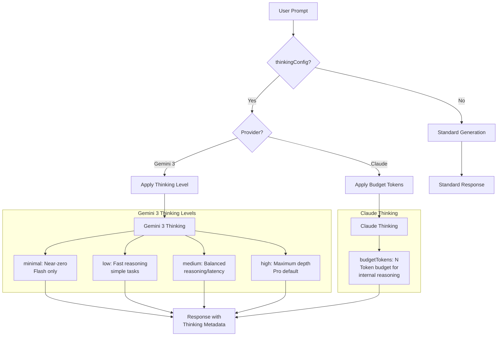

In this guide, you will enable extended thinking (reasoning mode) with Gemini 3 and Claude through NeuroLink. You will configure thinking budgets, stream reasoning tokens alongside responses, and implement patterns that leverage step-by-step reasoning for complex tasks like code generation, mathematical proofs, and multi-step planning.

Extended thinking changes this. It gives models time to "reason through" problems step by step before producing their final response. The model generates internal reasoning tokens that inform the answer but are not part of the output. Think of it as the difference between answering a question off the top of your head versus taking a moment to think it through.

NeuroLink provides a unified `thinkingConfig` API that works across providers:

- **Gemini 3** uses thinking levels: `minimal`, `low`, `medium`, `high`
- **Anthropic Claude** uses a token budget for thinking: set a maximum number of tokens the model can spend on internal reasoning

The trade-off is straightforward: longer thinking produces better answers but increases latency and cost. This guide shows you how to configure and use extended thinking effectively.

---

## How Extended Thinking Works

When you enable extended thinking, the generation pipeline adds a reasoning phase before the final response.



### What happens under the hood

Extended thinking happens internally before the model produces its final response. The model generates internal reasoning tokens -- working through the problem, considering alternatives, checking its logic -- that are not part of the visible output.

Some providers expose these reasoning tokens in the token usage metadata. The `usage` object in the response includes a `reasoning` count that tells you how many tokens were spent on thinking. This is important for cost tracking, since reasoning tokens are billed the same as output tokens.

NeuroLink normalizes the thinking configuration across providers via the `thinkingConfig` option in `GenerateOptions` (source: `src/lib/types/generateTypes.ts`).

---

## Gemini 3 Thinking Levels

Gemini 3 provides four thinking levels that control how deeply the model reasons before responding.

### High thinking level: Maximum depth

```typescript
import { NeuroLink } from '@juspay/neurolink';

const neurolink = new NeuroLink();

// Gemini 3 Pro with maximum reasoning depth
const result = await neurolink.generate({
  input: {
    text: "Prove that the square root of 2 is irrational using proof by contradiction.",
  },
  provider: "google-ai",
  model: "gemini-3-pro-preview",
  thinkingConfig: {
    thinkingLevel: "high",
  },
});

console.log(result.content); // Detailed mathematical proof
console.log(result.usage?.reasoning); // Reasoning tokens used
```

> **Note:** Model names and IDs in code examples reflect versions available at time of writing. Model availability, naming conventions, and pricing change frequently. Always verify current model IDs with your provider's documentation before deploying to production.
{: .prompt-info }

### Thinking level reference

| Level | Reasoning Depth | Latency | Best For | Models |
|---|---|---|---|---|
| `minimal` | Near-zero | Fastest | Simple lookups, formatting | Flash only |
| `low` | Light reasoning | Fast | Classification, simple Q&A | Pro, Flash |
| `medium` | Balanced | Medium | Analysis, summarization | Pro, Flash |
| `high` | Maximum depth | Slowest | Math, code, complex analysis | Pro (default) |

- **Gemini 3 Pro** defaults to `high` thinking level. It is designed for complex reasoning tasks.
- **Gemini 3 Flash** supports all levels including `minimal` for near-instant responses. Flash with `medium` thinking is a cost-performance sweet spot for many applications.

### Minimal and medium examples

```typescript
// Gemini 3 Flash with minimal thinking for fast responses
const quickResult = await neurolink.generate({
  input: { text: "What is the capital of France?" },
  provider: "google-ai",
  model: "gemini-3-flash-preview",
  thinkingConfig: {
    thinkingLevel: "minimal", // Near-instant response
  },
});

// Gemini 3 Flash with medium thinking for balanced tasks
const balancedResult = await neurolink.generate({
  input: { text: "Compare REST and GraphQL architectures" },
  provider: "google-ai",
  model: "gemini-3-flash-preview",
  thinkingConfig: {
    thinkingLevel: "medium",
  },
});
```

> **Note:** The `minimal` thinking level is only available on Gemini 3 Flash. Using `minimal` on Gemini 3 Pro will default to `low`.
{: .prompt-info }

---

## Claude Extended Thinking

Claude takes a different approach to extended thinking. Instead of discrete levels, you set a token budget -- the maximum number of tokens the model can use for internal reasoning.

```typescript
// Claude with budget tokens for extended thinking
const result = await neurolink.generate({
  input: {
    text: "Write a comprehensive analysis of the P vs NP problem and its implications for cryptography.",
  },
  provider: "anthropic",
  model: "claude-3-7-sonnet-20250219",
  thinkingConfig: {
    enabled: true,
    budgetTokens: 10000, // Allow up to 10K tokens for internal reasoning
  },
});

console.log(result.content);
console.log(`Reasoning tokens: ${result.usage?.reasoning}`);
console.log(`Total tokens: ${result.usage?.total}`);
```

### How the budget works

- `budgetTokens` sets the **maximum** tokens the model can use for internal reasoning
- `enabled: true` activates the thinking mode
- The model may use **fewer** tokens than the budget if the problem is simpler than expected
- Higher budget equals deeper reasoning but more expensive calls
- Reasoning tokens count toward your bill at the same rate as output tokens

### Budget token guidelines

| Task Complexity | Recommended Budget | Example |
|---|---|---|
| Simple analysis | 2,000 - 5,000 | Code review, short summaries |
| Medium complexity | 5,000 - 15,000 | Architecture decisions, comparisons |
| Deep reasoning | 15,000 - 30,000 | Mathematical proofs, complex debugging |
| Maximum depth | 30,000+ | Research analysis, novel problem solving |

Start with 5,000 tokens and increase the budget only if the output quality is not sufficient. The model is efficient with its budget -- a 5,000-token budget does not mean the model always uses 5,000 tokens. It will use what it needs and stop.

---

## Unified API: Provider-Agnostic Thinking

NeuroLink handles the provider-specific mapping internally. You specify what kind of thinking you want, and the SDK translates it to the right provider format.

```typescript
// The same thinkingConfig works across providers
// NeuroLink maps it to the right provider-specific format

async function solveWithThinking(
  problem: string,
  provider: "google-ai" | "anthropic",
  model: string
) {
  return neurolink.generate({
    input: { text: problem },
    provider,
    model,
    thinkingConfig: provider === "google-ai"
      ? { thinkingLevel: "high" }
      : { enabled: true, budgetTokens: 15000 },
  });
}

// Use Gemini 3 Pro
const geminiResult = await solveWithThinking(
  "Optimize this algorithm...",
  "google-ai",
  "gemini-3-pro-preview"
);

// Use Claude
const claudeResult = await solveWithThinking(
  "Optimize this algorithm...",
  "anthropic",
  "claude-3-7-sonnet-20250219"
);
```

### thinkingConfig type

The `thinkingConfig` option supports both approaches in a single type:

- `thinkingLevel` -- For Gemini 3 models: `"minimal"`, `"low"`, `"medium"`, `"high"`
- `budgetTokens` + `enabled` -- For Claude models: number of tokens and boolean toggle

Both providers return the same `GenerateResult` structure, with reasoning token usage included in `result.usage?.reasoning`. You can compare results across providers without changing your response handling code.

---

## When to Use Extended Thinking

Extended thinking is powerful but not free. Every reasoning token costs money and adds latency. Use it selectively for problems that genuinely benefit from deeper analysis.

### Decision guide

| Use Case | Thinking Needed? | Recommended Config |
|---|---|---|
| Simple Q&A, lookups | No | No thinkingConfig or `minimal` |
| Content generation | Usually no | Standard generation |
| Code generation | Sometimes | `medium` or budgetTokens: 5000 |
| Bug analysis | Yes | `high` or budgetTokens: 10000 |
| Mathematical proofs | Yes | `high` or budgetTokens: 20000 |
| Architecture design | Yes | `medium` to `high` or budgetTokens: 15000 |
| Data analysis | Sometimes | `medium` or budgetTokens: 5000 |
| Creative writing | Usually no | Standard generation |

### When to enable thinking

- **Multi-step reasoning**: Problems that require working through several logical steps
- **Code debugging**: Finding bugs requires tracing execution paths and considering edge cases
- **Mathematical analysis**: Proofs and calculations benefit significantly from structured reasoning
- **Complex comparisons**: Evaluating trade-offs between multiple options

### When to skip thinking

- **Simple lookups**: "What is the capital of France?" does not need reasoning
- **Creative writing**: Creativity benefits from fluency, not deliberation
- **Formatting and translation**: Mechanical tasks do not improve with thinking
- **Latency-sensitive applications**: High thinking levels can add 5-30 seconds to response time

### Cost considerations

Reasoning tokens count toward your bill. A `high` thinking query on Gemini 3 Pro might use 3,000-10,000 reasoning tokens. A Claude query with `budgetTokens: 20000` might use 5,000-20,000 reasoning tokens. Monitor your usage and tune accordingly.

---

## Monitoring Thinking Usage

Track thinking token usage to optimize the cost-quality balance.

```typescript
const result = await neurolink.generate({
  input: { text: "Complex reasoning task..." },
  provider: "google-ai",
  model: "gemini-3-pro-preview",
  thinkingConfig: { thinkingLevel: "high" },
  enableAnalytics: true,
});

// Token usage breakdown
console.log(`Input tokens: ${result.usage?.input}`);
console.log(`Output tokens: ${result.usage?.output}`);
console.log(`Reasoning tokens: ${result.usage?.reasoning}`);
console.log(`Total tokens: ${result.usage?.total}`);
console.log(`Response time: ${result.responseTime}ms`);
```

### What to monitor

- **Reasoning token usage**: Track how many thinking tokens each query consumes. If reasoning consistently uses the maximum budget, consider increasing it. If it consistently uses very little, consider lowering it.
- **Response time impact**: Compare response times with and without thinking. The latency increase should be justified by quality improvement.
- **Cost per query**: Calculate the cost of reasoning tokens versus standard tokens. Thinking-heavy workloads can be 2-5x more expensive than standard generation.
- **Quality correlation**: Compare evaluation scores for responses with and without thinking. If thinking does not improve quality for a given query type, disable it for that use case.

---

## Best Practices

1. **Start with the lowest thinking level that produces good results.** Do not default to `high` for everything. Test with `medium` first and only increase if quality is insufficient.

2. **Use `minimal` or no thinking for latency-sensitive applications.** Chat interfaces, autocomplete, and real-time features should prioritize speed. Thinking adds seconds to response time.

3. **Monitor reasoning token usage to control costs.** A query that uses 20,000 reasoning tokens but only produces a two-sentence answer is wasting budget.

4. **Gemini 3 Flash with `medium` thinking is the cost-performance sweet spot.** It provides meaningful reasoning at lower latency and cost than Pro with `high`.

5. **Claude's budget approach is more granular.** Start with 5,000 tokens and increase as needed. The model is good at using only what it needs.

6. **Test with and without thinking to measure quality improvement.** Run the same queries both ways and compare evaluation scores. If thinking does not measurably improve quality, skip it.

7. **Consider caching results of expensive thinking operations.** If the same complex question is asked frequently, cache the response and serve it without re-running the expensive thinking process.

---

## What's Next

You have completed all the steps in this guide. To continue building on what you have learned:

1. Review the code examples and adapt them for your specific use case
2. Start with the simplest pattern first and add complexity as your requirements grow
3. Monitor performance metrics to validate that each change improves your system
4. Consult the NeuroLink documentation for advanced configuration options

---

**Related posts:**

- [Mastering Claude with NeuroLink: Complete Anthropic Guide](/posts/anthropic-claude-guide/)
- [Structured Output: JSON Schema Enforcement with NeuroLink](/posts/structured-output-json/)
- [Prompt Engineering with NeuroLink: A Developer's Guide](/posts/prompt-engineering-neurolink/)
