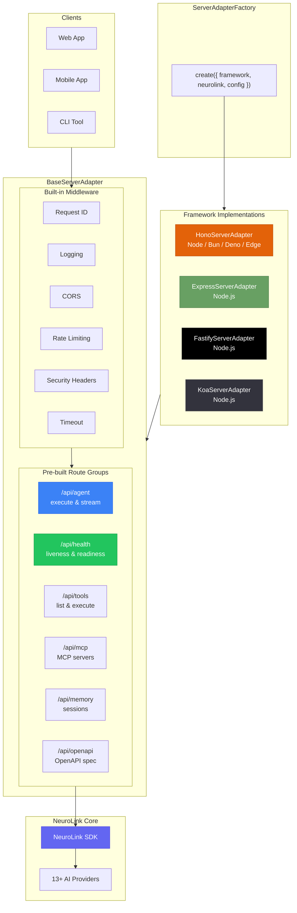
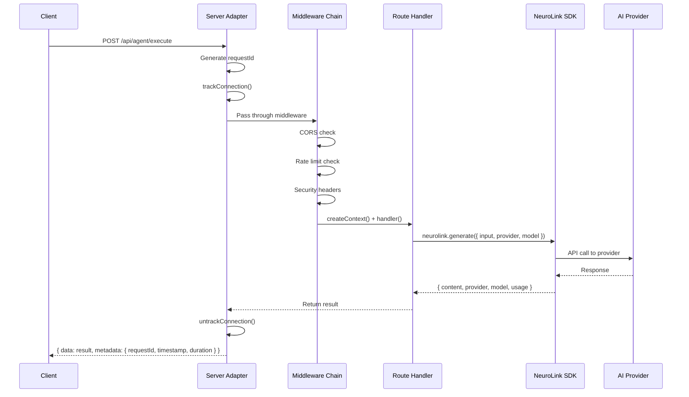
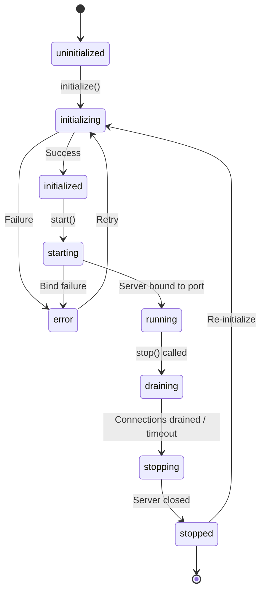

In this guide, you will build AI-powered APIs using NeuroLink's server adapters for Hono, Express, Fastify, and Koa. You will configure each framework, add streaming endpoints, implement middleware for authentication and rate limiting, and deploy a production-ready AI API server.

NeuroLink's server adapters turn your AI into a production HTTP API with minimal code -- and they bring CORS, rate limiting, SSE streaming, graceful shutdown, and OpenAPI documentation out of the box.

The SDK ships four framework-specific adapters: Hono (recommended), Express, Fastify, and Koa. All adapters extend `BaseServerAdapter`, providing a consistent lifecycle and feature set regardless of framework choice. The factory pattern (`ServerAdapterFactory.create()` / `createServer()`) lets you switch frameworks with a single config change.

---

## Architecture Overview

The server adapter system sits between your clients and the NeuroLink SDK, adding HTTP infrastructure around your AI capabilities.



The `BaseServerAdapter` abstract class (source: `src/lib/server/abstract/baseServerAdapter.ts`) defines the adapter contract:

- **Framework methods:** `initializeFramework()`, `registerFrameworkRoute()`, `registerFrameworkMiddleware()`
- **Lifecycle methods:** `start()`, `stop()`, `getFrameworkInstance()`
- **Graceful shutdown:** `stopAcceptingConnections()`, `closeServer()`, `forceCloseConnections()`

Each adapter implements these methods for its framework. The `ServerAdapterFactory` provides convenience methods for creating any adapter.

---


## Quickstart: The Factory Pattern

The simplest way to create a server is the `createServer()` helper function.

```typescript
import { NeuroLink } from '@juspay/neurolink';
import { createServer, registerAllRoutes } from '@juspay/neurolink/server';

const neurolink = new NeuroLink({
  conversationMemory: { enabled: true },
});

// Create server (defaults to Hono)
const server = await createServer(neurolink, {
  framework: 'hono', // 'hono' | 'express' | 'fastify' | 'koa'
  config: {
    port: 3000,
    host: '0.0.0.0',
    basePath: '/api',
    cors: {
      enabled: true,
      origins: ['https://myapp.com'],
      methods: ['GET', 'POST', 'PUT', 'DELETE', 'PATCH', 'OPTIONS'],
      headers: ['Content-Type', 'Authorization', 'X-Request-ID'],
      credentials: false,
      maxAge: 86400,
    },
    rateLimit: {
      enabled: true,
      windowMs: 15 * 60 * 1000, // 15 minutes
      maxRequests: 100,
      message: 'Too many requests, please try again later',
    },
    bodyParser: {
      enabled: true,
      maxSize: '10mb',
    },
    logging: {
      enabled: true,
      level: 'info',
    },
    timeout: 30000,
    enableMetrics: true,
    enableSwagger: true,
  },
});

// Register all pre-built routes
registerAllRoutes(server, '/api', { enableSwagger: true });

// Initialize and start
await server.initialize();
await server.start();
```

After starting, your AI is available as an HTTP API:

| Endpoint | Method | Description |
|---|---|---|
| `/api/agent/execute` | POST | Generate text with AI |
| `/api/agent/stream` | POST | Stream AI response via SSE |
| `/api/agent/providers` | GET | List available AI providers |
| `/api/tools` | GET | List registered tools |
| `/api/tools/:name/execute` | POST | Execute a tool |
| `/api/mcp/servers` | GET | List MCP servers |
| `/api/memory/sessions` | GET | List conversation sessions |
| `/api/health` | GET | Liveness check |
| `/api/ready` | GET | Readiness check |
| `/api/metrics` | GET | Server metrics |
| `/api/openapi.json` | GET | OpenAPI 3.1 spec |

---

## Hono Adapter (Recommended)

Hono is the recommended framework for new projects. It supports multiple runtimes (Node.js, Bun, Deno, Edge), has native TypeScript support, and provides built-in middleware for CORS, security headers, and more.

```typescript
import { NeuroLink } from '@juspay/neurolink';
import { ServerAdapterFactory, registerAllRoutes } from '@juspay/neurolink/server';

const neurolink = new NeuroLink();

const server = await ServerAdapterFactory.createHono(neurolink, {
  port: 3000,
  cors: { enabled: true, origins: ['*'] },
  rateLimit: { enabled: true, windowMs: 60000, maxRequests: 100 },
  enableSwagger: true,
});

registerAllRoutes(server, '/api', { enableSwagger: true });
await server.initialize();
await server.start();

// Access the raw Hono app for custom routes
const app = server.getFrameworkInstance(); // Returns Hono instance
```

**Hono highlights:**

- SSE streaming via `streamSSE()` from `hono/streaming`
- Built-in in-memory rate limiter with periodic cleanup
- Security headers via `hono/secure-headers`
- Supports Node.js (`@hono/node-server`), Bun (`Bun.serve()`), and Deno (`Deno.serve()`)

---

## Express Adapter

For existing Express applications, the Express adapter integrates NeuroLink without changing your framework.

```typescript
import { NeuroLink } from '@juspay/neurolink';
import { ServerAdapterFactory, registerAllRoutes } from '@juspay/neurolink/server';

const neurolink = new NeuroLink();

const server = await ServerAdapterFactory.createExpress(neurolink, {
  port: 3000,
  cors: { enabled: true, origins: ['https://myapp.com'] },
  rateLimit: { enabled: true, windowMs: 60000, maxRequests: 50 },
});

registerAllRoutes(server);
await server.initialize();
await server.start();

// Access the raw Express app
const expressApp = server.getFrameworkInstance();

// Add your own Express routes alongside NeuroLink
expressApp.get('/custom', (req, res) => {
  res.json({ message: 'Custom route works alongside NeuroLink' });
});
```

**Express highlights:**

- Dynamic `import('express')` to avoid bundling Express when not used
- Integrates `cors` and `express-rate-limit` packages via dynamic imports
- Socket tracking for graceful shutdown
- SSE streaming writes directly to `res` with `text/event-stream` content type

---

## Fastify Adapter

Fastify provides excellent performance and built-in schema validation.

```typescript
import { NeuroLink } from '@juspay/neurolink';
import { ServerAdapterFactory, registerAllRoutes } from '@juspay/neurolink/server';

const neurolink = new NeuroLink();

const server = await ServerAdapterFactory.createFastify(neurolink, {
  port: 3000,
  logging: { enabled: true, level: 'info' },
  rateLimit: { enabled: true, windowMs: 60000, maxRequests: 200 },
});

registerAllRoutes(server);
await server.initialize();
await server.start();

// Access the raw Fastify instance
const fastify = server.getFrameworkInstance();
```

**Fastify highlights:**

- Dynamic imports for `fastify`, `@fastify/cors`, `@fastify/rate-limit`
- Uses Fastify's `addHook('preHandler', ...)` for middleware
- Built-in request ID generation
- SSE streaming via `reply.raw` (underlying Node.js response)

---

## Koa Adapter

For minimalist applications that prefer Koa's middleware composition model.

```typescript
import { NeuroLink } from '@juspay/neurolink';
import { ServerAdapterFactory, registerAllRoutes } from '@juspay/neurolink/server';

const neurolink = new NeuroLink();

const server = await ServerAdapterFactory.createKoa(neurolink, {
  port: 3000,
  cors: { enabled: true, origins: ['*'] },
  bodyParser: { enabled: true, jsonLimit: '10mb' },
});

registerAllRoutes(server);
await server.initialize();
await server.start();
```

**Koa highlights:**

- Dynamic imports for `koa`, `@koa/router`, `@koa/cors`, `koa-bodyparser`
- Uses `ctx.state` for request ID and response headers across middleware
- Router mounted via `app.use(router.routes())` and `app.use(router.allowedMethods())`

---

## Pre-built Routes Reference

NeuroLink registers six route groups via `registerAllRoutes()` (source: `src/lib/server/routes/index.ts`).

| Route Group | Factory Function | Endpoints |
|---|---|---|
| **Agent** | `createAgentRoutes(basePath)` | `POST /agent/execute` -- Execute AI generation<br/>`POST /agent/stream` -- Stream AI response (SSE)<br/>`GET /agent/providers` -- List available providers |
| **Tools** | `createToolRoutes(basePath)` | `GET /tools` -- List all tools<br/>`GET /tools/:name` -- Get tool details<br/>`POST /tools/:name/execute` -- Execute a tool |
| **MCP** | `createMCPRoutes(basePath)` | `GET /mcp/servers` -- List MCP servers<br/>`GET /mcp/servers/:name` -- Server details<br/>`GET /mcp/servers/:name/tools` -- Server tools |
| **Memory** | `createMemoryRoutes(basePath)` | `GET /memory/sessions` -- List sessions<br/>`GET /memory/sessions/:sessionId` -- Get session<br/>`DELETE /memory/sessions/:sessionId` -- Delete session |
| **Health** | `createHealthRoutes(basePath)` | `GET /health` -- Liveness<br/>`GET /ready` -- Readiness (checks tool registry)<br/>`GET /metrics` -- Server metrics |
| **OpenAPI** | `createOpenApiRoutes(basePath)` | `GET /openapi.json` -- OpenAPI 3.1 spec |

### Agent execute request body

The `POST /agent/execute` endpoint accepts the following request body (from `AgentExecuteRequest` in `src/lib/server/types.ts`):

```json
{
  "input": "Explain microservices architecture",
  "provider": "openai",
  "model": "gpt-4o",
  "systemPrompt": "You are a senior architect",
  "temperature": 0.7,
  "maxTokens": 1000,
  "tools": ["web_search"],
  "stream": false,
  "sessionId": "user-123-session-1",
  "userId": "user-123"
}
```

---

## Custom Middleware

Add your own middleware to the server for authentication, logging, caching, or any cross-cutting concern.

```typescript
import { NeuroLink } from '@juspay/neurolink';
import {
  createServer,
  registerAllRoutes,
  createAuthMiddleware,
  createCacheMiddleware,
  createRateLimitMiddleware,
} from '@juspay/neurolink/server';

const neurolink = new NeuroLink();
const server = await createServer(neurolink, { framework: 'hono' });

// Register auth middleware
server.registerMiddleware(createAuthMiddleware({
  strategy: 'bearer',
  validate: async (token) => {
    const user = await verifyJWT(token);
    return user ? { id: user.id, email: user.email, roles: user.roles } : null;
  },
}));

// Register custom middleware
server.registerMiddleware({
  name: 'request-logger',
  order: 5,
  paths: ['/api/*'],
  excludePaths: ['/api/health'],
  handler: async (ctx, next) => {
    console.log(`[${ctx.requestId}] ${ctx.method} ${ctx.path}`);
    const result = await next();
    console.log(`[${ctx.requestId}] completed`);
    return result;
  },
});

registerAllRoutes(server);
await server.initialize();
await server.start();
```

The `MiddlewareDefinition` type supports:

- **`name`** -- Identifier for the middleware
- **`order`** -- Execution order (lower runs first)
- **`handler`** -- The middleware function: `(ctx: ServerContext, next: () => Promise<unknown>) => Promise<unknown>`
- **`paths`** -- Glob patterns to match (e.g., `['/api/*']`)
- **`excludePaths`** -- Paths to skip (e.g., `['/api/health']`)

Pre-built middleware available: `createAuthMiddleware()`, `createCacheMiddleware()`, `createRateLimitMiddleware()`, `createCompressionMiddleware()`, `createSecurityHeadersMiddleware()`, `createAbortSignalMiddleware()`, `createDeprecationMiddleware()`, `createRequestValidationMiddleware()`.

---

## Custom Routes

Add your own routes alongside NeuroLink's built-in routes.

```typescript
// Register a custom route
server.registerRoute({
  method: 'POST',
  path: '/api/custom/analyze',
  description: 'Analyze text with custom pipeline',
  tags: ['custom'],
  handler: async (ctx) => {
    const { text, analysisType } = ctx.body as { text: string; analysisType: string };

    const result = await ctx.neurolink.generate({
      input: { text },
      systemPrompt: `Perform ${analysisType} analysis on the following text.`,
    });

    return {
      analysis: result.content,
      provider: result.provider,
      model: result.model,
      usage: result.usage,
    };
  },
});

// Register a route group
server.registerRouteGroup({
  prefix: '/api/v2/agent',
  routes: [
    {
      method: 'POST',
      path: '/api/v2/agent/generate',
      handler: async (ctx) => { /* ... */ },
      description: 'V2 agent generation',
      tags: ['agent', 'v2'],
    },
  ],
  middleware: [
    {
      name: 'v2-auth',
      handler: async (ctx, next) => { /* ... */ return next(); },
    },
  ],
});
```

Custom routes automatically appear in the generated OpenAPI spec.

---

## Request Lifecycle

Every request flows through the same lifecycle regardless of framework.



---

## Graceful Shutdown and Server Lifecycle

The server lifecycle follows a state machine with well-defined transitions.



Configure graceful shutdown to drain in-flight requests before stopping:

```typescript
const server = await createServer(neurolink, {
  framework: 'hono',
  config: {
    port: 3000,
    shutdown: {
      gracefulShutdownTimeoutMs: 30000, // 30s overall shutdown timeout
      drainTimeoutMs: 15000,             // 15s to drain connections
      forceClose: true,                  // Force close if drain times out
    },
  },
});

// Listen for lifecycle events
server.on('started', ({ port, host, timestamp }) => {
  console.log(`Server started on ${host}:${port} at ${timestamp}`);
});

server.on('request', ({ requestId, method, path }) => {
  console.log(`[${requestId}] ${method} ${path}`);
});

server.on('error', ({ requestId, error }) => {
  console.error(`[${requestId}] Error: ${error.message}`);
});

// Graceful shutdown on SIGTERM
process.on('SIGTERM', async () => {
  console.log('Shutting down gracefully...');
  await server.stop(); // Drains connections, then stops
});
```

> **Note:** Connection tracking via `trackConnection()` / `untrackConnection()` ensures in-flight requests complete before the server shuts down. The `drainTimeoutMs` prevents waiting forever for slow requests.
{: .prompt-info }

---

## Framework Comparison

| Feature | Hono | Express | Fastify | Koa |
|---|---|---|---|---|
| TypeScript | Native | Requires `@types` | Native | Requires `@types` |
| Runtimes | Node, Bun, Deno, Edge | Node.js only | Node.js only | Node.js only |
| Performance | Excellent | Good | Excellent | Good |
| CORS | `hono/cors` built-in | `cors` npm package | `@fastify/cors` plugin | `@koa/cors` package |
| Rate Limiting | Built-in (in-memory) | `express-rate-limit` | `@fastify/rate-limit` | Built-in (in-memory) |
| Body Parsing | Built-in | `express.json()` | Built-in | `koa-bodyparser` |
| SSE Streaming | `hono/streaming` `streamSSE()` | Raw `res.write()` | Raw `reply.raw.write()` | Raw `ctx.res.write()` |
| Best For | New projects, edge, multi-runtime | Existing Express apps | High-throughput APIs | Minimalist apps |

---

## What's Next

You have completed all the steps in this guide. To continue building on what you have learned:

1. Review the code examples and adapt them for your specific use case
2. Start with the simplest pattern first and add complexity as your requirements grow
3. Monitor performance metrics to validate that each change improves your system
4. Consult the NeuroLink documentation for advanced configuration options

---

**Related posts:**

- [Getting Started with NeuroLink: Your First AI App in 5 Minutes](/posts/getting-started-first-ai-app/)
- [Configuration Deep-Dive: neurolink.config.ts and Environment Hierarchy](/posts/configuration-deep-dive/)
- [AI Observability: Monitoring LLM Applications in Production](/posts/monitoring-observability/)
