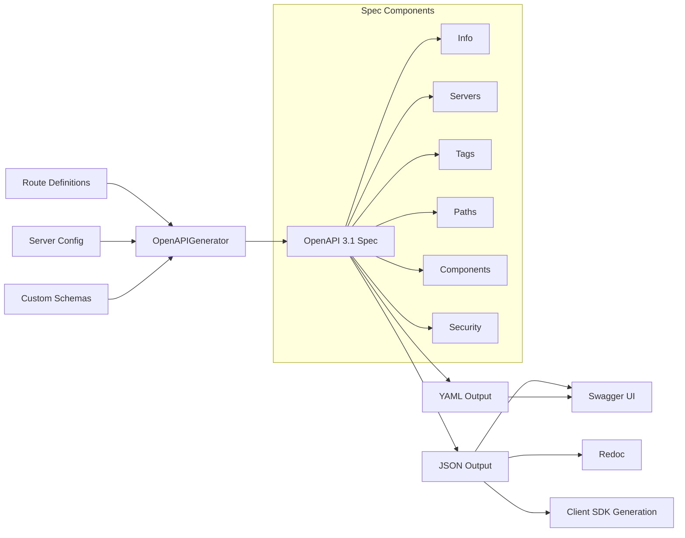

In this guide, you will auto-generate OpenAPI documentation for your NeuroLink AI API. You will configure schema generation, add endpoint descriptions, integrate with Swagger UI, and produce client SDKs from your API specification.

NeuroLink includes an OpenAPI 3.1 specification generator that auto-generates documentation from your route definitions, including request and response schemas, security schemes, and streaming endpoint annotations. The output is ready for Swagger UI, Redoc, or client SDK generation.

This guide covers the full OpenAPI generation workflow: from automatic default endpoint documentation to custom route specs, security schemes, and production integration.

---

## Architecture

The OpenAPI generation system takes route definitions and server configuration as input and produces a complete OpenAPI 3.1 specification.



### Key components

- **`OpenAPIGenerator`** class (source: `src/lib/server/openapi/generator.ts`) accepts config, routes, and custom schemas
- **`OpenAPISpec`** type represents the full OpenAPI 3.1.0 structure: info, servers, tags, paths, components, security
- **Route-to-path conversion** transforms Express-style `:param` to OpenAPI-style `{param}`
- **Built-in templates** provide standard operations for GET, POST, DELETE, and streaming POST endpoints
- **`OpenAPISchemas`** (source: `src/lib/server/openapi/schemas.ts`) defines pre-built schemas for all NeuroLink types

---

## Quick Start

Two methods for generating an OpenAPI spec: the factory function and the generator class.

```typescript
import {
  createOpenAPIGenerator,
  generateOpenAPIFromConfig,
} from '@juspay/neurolink/server';

// Method 1: Factory function
const generator = createOpenAPIGenerator({
  info: {
    title: "My AI API",
    version: "1.0.0",
    description: "AI-powered API built with NeuroLink",
  },
  servers: [
    { url: "https://api.example.com", description: "Production" },
    { url: "http://localhost:3000", description: "Development" },
  ],
  basePath: "/api",
  includeSecurity: true,
});

const spec = generator.generate();
console.log(generator.toJSON()); // Pretty-printed JSON

// Method 2: Generate from server config and routes
const spec2 = generateOpenAPIFromConfig(
  { host: "localhost", port: 3000, basePath: "/api" },
  customRoutes
);
```

The factory function gives you full control over the spec metadata. The config-based function generates a spec from your server adapter configuration automatically.

---

## Default API Endpoints

When no custom routes are registered, NeuroLink generates documentation for its complete default API surface. These are the endpoints created by `registerAllRoutes()`.

| Endpoint | Method | Tag | Description |
|---|---|---|---|
| `/api/agent/execute` | POST | agent | Execute an AI agent |
| `/api/agent/stream` | POST | agent, streaming | Stream agent response (SSE) |
| `/api/agent/providers` | GET | agent | List available providers |
| `/api/tools` | GET | tools | List all tools |
| `/api/tools/{name}` | GET | tools | Get tool details |
| `/api/tools/{name}/execute` | POST | tools | Execute a tool |
| `/api/mcp/servers` | GET | mcp | List MCP servers |
| `/api/mcp/servers/{name}` | GET | mcp | Get server details |
| `/api/mcp/servers/{name}/tools` | GET | mcp, tools | List server tools |
| `/api/memory/sessions` | GET | memory | List conversation sessions |
| `/api/memory/sessions/{sessionId}` | GET | memory | Get session |
| `/api/memory/sessions/{sessionId}` | DELETE | memory | Delete session |
| `/api/health` | GET | health | Health check |
| `/api/ready` | GET | health | Readiness check |
| `/api/metrics` | GET | health | Server metrics |

Each endpoint has proper request and response schemas defined via `OpenAPISchemas`. Streaming endpoints use `text/event-stream` content type. Standard error responses (400, 401, 403, 404, 500) are included automatically for every endpoint.

> **Note:** The default endpoints are generated even without explicit route registration. If you use `registerAllRoutes()`, the OpenAPI spec automatically documents everything.
{: .prompt-info }

---

## Custom Routes

Add your own routes to the OpenAPI spec by defining them with the `RouteDefinition` type.

```typescript
import type { RouteDefinition } from '@juspay/neurolink/server';

const customRoutes: RouteDefinition[] = [
  {
    path: "/api/summarize",
    method: "POST",
    description: "Summarize a document using AI",
    tags: ["summarization"],
    auth: true,
    requestSchema: {
      type: "object",
      properties: {
        text: { type: "string", description: "Text to summarize" },
        maxLength: { type: "number", description: "Max summary length" },
      },
      required: ["text"],
    },
    responseSchema: {
      type: "object",
      properties: {
        summary: { type: "string" },
        wordCount: { type: "number" },
      },
    },
  },
  {
    path: "/api/chat/:sessionId",
    method: "POST",
    description: "Send a chat message",
    tags: ["chat"],
    streaming: { enabled: true },
  },
];

const generator = createOpenAPIGenerator();
generator.addRoutes(customRoutes);
const spec = generator.generate();
```

### Route definition features

- **`requestSchema` and `responseSchema`** are JSON Schema objects that describe the request body and response body
- **Path parameters** are auto-extracted: `:sessionId` becomes `{sessionId}` in the OpenAPI spec
- **Streaming routes** with `streaming: { enabled: true }` get `text/event-stream` response type automatically
- **Auth-required routes** with `auth: true` get security requirements in the spec
- **Tags** organize endpoints in the Swagger UI sidebar

---

## Security Schemes

NeuroLink's OpenAPI generator includes two built-in security schemes.

```typescript
const generator = createOpenAPIGenerator({
  includeSecurity: true, // default: true
});
```

### Built-in schemes

- **Bearer Auth:** `Authorization: Bearer <token>` header. Standard JWT or opaque token authentication.
- **API Key Auth:** `X-API-Key: <key>` header. Simple API key authentication for server-to-server calls.

Routes with `auth: true` get security requirements in the spec. When `includeSecurity` is true, global security applies to all endpoints. The security scheme definitions come from `BearerSecurityScheme` and `ApiKeySecurityScheme` in `src/lib/server/openapi/templates.ts`.

### Custom security

If you use a different authentication scheme, you can add custom security definitions by modifying the generated spec:

```typescript
const spec = generator.generate();
spec.components.securitySchemes['oauth2'] = {
  type: 'oauth2',
  flows: {
    authorizationCode: {
      authorizationUrl: 'https://auth.example.com/authorize',
      tokenUrl: 'https://auth.example.com/token',
      scopes: {
        'read': 'Read access',
        'write': 'Write access',
      },
    },
  },
};
```

---

## Output Formats

The generator supports JSON and YAML output, plus programmatic access to the spec object.

```typescript
// JSON output (default)
const jsonSpec = generator.toJSON();       // Pretty-printed
const jsonCompact = generator.toJSON(false); // Minified

// YAML output
const yamlSpec = generator.toYAML();

// Programmatic access
const spec = generator.generate(); // OpenAPISpec object
console.log(spec.paths);          // Access paths directly
console.log(spec.components);     // Access components
```

- **JSON output** uses `JSON.stringify` with indentation for readability
- **YAML output** uses a built-in converter (`jsonToYaml()`)
- **Programmatic access** returns the raw `OpenAPISpec` object for modification before serialization

> **Note:** For production YAML output, consider using a dedicated YAML library like `js-yaml` for more control over formatting and comments.
{: .prompt-info }

---

## Integration with Server

The most common pattern is to generate the spec from your server adapter configuration and serve it as a JSON endpoint.

```typescript
import { generateOpenAPIFromConfig } from '@juspay/neurolink/server';

// Generate spec from server adapter configuration
const spec = generateOpenAPIFromConfig(
  {
    host: "localhost",
    port: 3000,
    basePath: "/api",
  },
  customRoutes
);

// Serve the spec at /api/docs
app.get("/api/docs/openapi.json", (req, res) => {
  res.json(spec);
});

// Serve Swagger UI
app.get("/api/docs", (req, res) => {
  res.send(`
    <html>
      <head>
        <link rel="stylesheet" href="https://unpkg.com/swagger-ui-dist/swagger-ui.css">
      </head>
      <body>
        <div id="swagger-ui"></div>
        <script src="https://unpkg.com/swagger-ui-dist/swagger-ui-bundle.js"></script>
        <script>
          SwaggerUIBundle({ url: "/api/docs/openapi.json", dom_id: "#swagger-ui" });
        </script>
      </body>
    </html>
  `);
});
```

### Automatic integration

If you use `registerAllRoutes()` with `{ enableSwagger: true }`, the OpenAPI spec is automatically served at `/api/openapi.json`. No additional configuration required.

```typescript
import { createServer, registerAllRoutes } from '@juspay/neurolink/server';

const server = await createServer(neurolink, {
  framework: 'hono',
  config: { port: 3000, enableSwagger: true },
});

registerAllRoutes(server, '/api', { enableSwagger: true });
await server.initialize();
await server.start();

// OpenAPI spec available at: http://localhost:3000/api/openapi.json
```

---

## Advanced: Generator Options

The `createOpenAPIGenerator()` function accepts several configuration options for fine-grained control.

```typescript
const generator = createOpenAPIGenerator({
  info: {
    title: 'My AI API',
    version: '2.0.0',
    description: 'AI-powered API built with NeuroLink',
    contact: {
      name: 'API Support',
      email: 'api@example.com',
    },
    license: {
      name: 'MIT',
    },
  },
  servers: [
    { url: 'https://api.myapp.com', description: 'Production' },
    { url: 'https://staging-api.myapp.com', description: 'Staging' },
    { url: 'http://localhost:3000', description: 'Development' },
  ],
  basePath: '/api',
  includeSecurity: true,
});

generator.addRoutes(server.listRoutes());
const openApiSpec = generator.generate();
const jsonSpec = generator.toJSON(true); // Pretty-printed JSON string
```

### Using the spec for client SDK generation

The generated OpenAPI spec is compatible with client SDK generators like `openapi-generator-cli`, `swagger-codegen`, or `openapi-typescript`. Generate typed API clients for your frontend team:

```bash
npx openapi-generator-cli generate \
  -i http://localhost:3000/api/openapi.json \
  -g typescript-fetch \
  -o ./generated-client
```

This gives your frontend team a fully typed SDK that matches your AI API exactly, with request and response types generated from the spec.

---

## What's Next

You have completed all the steps in this guide. To continue building on what you have learned:

1. Review the code examples and adapt them for your specific use case
2. Start with the simplest pattern first and add complexity as your requirements grow
3. Monitor performance metrics to validate that each change improves your system
4. Consult the NeuroLink documentation for advanced configuration options

---

**Related posts:**

- [Server Adapters: Building AI APIs with Hono, Express, Fastify, or Koa](/posts/server-adapters/)
- [Structured Output: JSON Schema Enforcement with NeuroLink](/posts/structured-output-json/)
- [TypeScript Best Practices for AI Development](/posts/typescript-best-practices/)
