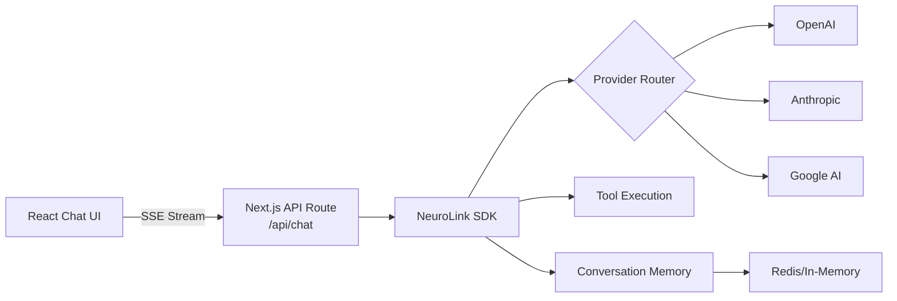
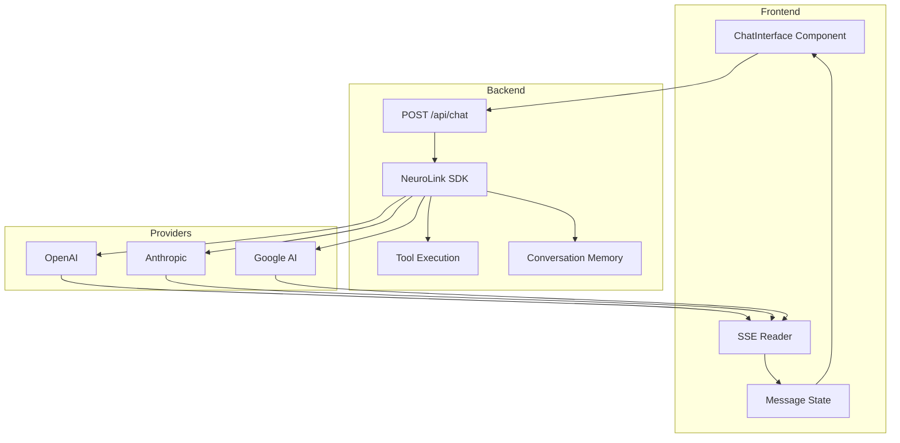

In this guide, you will build a full-stack AI chatbot with Next.js and NeuroLink. You will create the backend API routes, implement streaming responses to the React frontend, add conversation memory, and deploy a production-ready chatbot that supports multiple AI providers.

This tutorial walks through building a complete, production-ready AI chatbot with Next.js and NeuroLink SDK. By the end, you will have:

- A streaming API route that sends tokens as Server-Sent Events
- A React chat interface with real-time text display
- Tool calling for dynamic actions (weather lookups, knowledge base search)
- Conversation memory that persists across page reloads
- Provider switching so users can choose their preferred AI model

The stack is Next.js 14+ App Router, NeuroLink SDK on the backend, and React on the frontend.

---

## Architecture Overview

The chatbot follows a standard client-server architecture with streaming at every layer.



The React frontend sends user messages to a Next.js API route. The API route uses NeuroLink to stream AI responses back as SSE events. The frontend parses these events and updates the chat UI token by token.

---


## Step 1: Project Setup

Create a new Next.js project with TypeScript and Tailwind CSS.

```bash
npx create-next-app@latest ai-chatbot --typescript --tailwind --app
cd ai-chatbot
npm install @juspay/neurolink ai
```

Set up your environment variables:

```bash
OPENAI_API_KEY=sk-...
# Optional: enable conversation memory with Redis
REDIS_URL=redis://localhost:6379
```

> **Note:** You can use any NeuroLink-supported provider. Replace `OPENAI_API_KEY` with your preferred provider's key. NeuroLink supports 13 providers including Anthropic, Google AI, Vertex, Bedrock, and more.
{: .prompt-info }

---


## Step 2: Create the Backend API Route

The API route creates a NeuroLink instance with conversation memory, calls the `stream()` method, and sends chunks back as SSE events.

```typescript
// app/api/chat/route.ts
import { NeuroLink } from "@juspay/neurolink";

const neurolink = new NeuroLink({
  conversationMemory: {
    enabled: true,
  },
});

export async function POST(request: Request) {
  const { message } = await request.json();

  const result = await neurolink.stream({
    input: { text: message },
    provider: "openai",
    model: "gpt-4o",
    temperature: 0.7,
    maxTokens: 2000,
  });

  // Create a ReadableStream for SSE
  const encoder = new TextEncoder();
  const stream = new ReadableStream({
    async start(controller) {
      try {
        for await (const chunk of result.stream) {
          if ("content" in chunk) {
            const data = JSON.stringify({ type: "text", content: chunk.content });
            controller.enqueue(encoder.encode(`data: ${data}\n\n`));
          }
        }
        controller.enqueue(encoder.encode("data: [DONE]\n\n"));
        controller.close();
      } catch (error) {
        controller.error(error);
      }
    },
  });

  return new Response(stream, {
    headers: {
      "Content-Type": "text/event-stream",
      "Cache-Control": "no-cache",
      Connection: "keep-alive",
    },
  });
}
```

### How it works

1. **NeuroLink instance** is created once at module scope with conversation memory enabled. This persists across requests.
2. **`neurolink.stream()`** returns a `StreamResult` with a `stream` property -- an async iterable of `StreamChunk` objects.
3. **Each chunk** has a `type` field. Text chunks (`type: "text"`) contain the generated content. Audio chunks exist for TTS scenarios.
4. **SSE format** requires each event to be `data: <payload>\n\n`. The `[DONE]` sentinel signals stream completion.
5. **Response headers** set the content type to `text/event-stream` and disable caching to prevent proxy buffering.

---

## Step 3: Add Tool Calling

Tools let the chatbot take actions beyond generating text. Define tools with the `tool()` helper from the AI SDK and Zod for parameter validation.

```typescript
// app/api/chat/tools.ts
import { tool } from "ai";
import { z } from "zod";

export const chatTools = {
  getWeather: tool({
    description: "Get current weather for a location",
    parameters: z.object({
      city: z.string().describe("City name"),
    }),
    execute: async ({ city }) => {
      const response = await fetch(
        `https://api.weather.example.com/current?city=${city}`
      );
      return response.json();
    },
  }),

  searchKnowledgeBase: tool({
    description: "Search the knowledge base for product information",
    parameters: z.object({
      query: z.string().describe("Search query"),
    }),
    execute: async ({ query }) => {
      // Integrate with your RAG pipeline
      return { results: [`Result for: ${query}`] };
    },
  }),
};
```

Update the API route to include tools:

```typescript
// Update app/api/chat/route.ts
import { chatTools } from "./tools";

const result = await neurolink.stream({
  input: { text: message },
  provider: "openai",
  model: "gpt-4o",
  tools: chatTools,
  temperature: 0.7,
  maxTokens: 2000,
});
```

When the model decides to call a tool, NeuroLink executes it automatically and feeds the result back to the model. The model then generates a natural language response that incorporates the tool result. From the frontend's perspective, the experience is seamless -- tokens stream in just as they would without tools.

---

## Step 4: Build the React Chat UI

The chat interface is a client component that manages message state, sends messages to the API, and parses the SSE stream.

```typescript
// app/components/ChatInterface.tsx
"use client";
import { useState, useRef, useEffect } from "react";

type Message = {
  role: "user" | "assistant";
  content: string;
};

export default function ChatInterface() {
  const [messages, setMessages] = useState<Message[]>([]);
  const [input, setInput] = useState("");
  const [isStreaming, setIsStreaming] = useState(false);
  const messagesEndRef = useRef<HTMLDivElement>(null);

  // Auto-scroll to bottom when new messages arrive
  useEffect(() => {
    messagesEndRef.current?.scrollIntoView({ behavior: "smooth" });
  }, [messages]);

  async function handleSubmit(e: React.FormEvent) {
    e.preventDefault();
    if (!input.trim() || isStreaming) return;

    const userMessage = input.trim();
    setInput("");
    setMessages((prev) => [...prev, { role: "user", content: userMessage }]);
    setIsStreaming(true);

    // Add empty assistant message for streaming
    setMessages((prev) => [...prev, { role: "assistant", content: "" }]);

    try {
      const response = await fetch("/api/chat", {
        method: "POST",
        headers: { "Content-Type": "application/json" },
        body: JSON.stringify({
          message: userMessage,
        }),
      });

      const reader = response.body!.getReader();
      const decoder = new TextDecoder();
      let buffer = '';

      while (true) {
        const { done, value } = await reader.read();
        if (done) break;

        buffer += decoder.decode(value, { stream: true });
        const parts = buffer.split("\n\n");
        buffer = parts.pop() || ''; // Keep incomplete chunk in buffer

        for (const part of parts) {
          const line = part.trim();
          if (line.startsWith("data: ") && line !== "data: [DONE]") {
            const data = JSON.parse(line.slice(6));
            if (data.type === "text") {
              setMessages((prev) => {
                const updated = [...prev];
                const last = updated[updated.length - 1];
                last.content += data.content;
                return updated;
              });
            }
          }
        }
      }
    } catch (error) {
      console.error("Chat error:", error);
    } finally {
      setIsStreaming(false);
    }
  }

  return (
    <div className="flex flex-col h-screen max-w-2xl mx-auto">
      <div className="flex-1 overflow-y-auto p-4 space-y-4">
        {messages.map((msg, i) => (
          <div
            key={i}
            className={`p-3 rounded-lg ${
              msg.role === "user"
                ? "bg-blue-100 ml-auto max-w-[80%]"
                : "bg-gray-100 mr-auto max-w-[80%]"
            }`}
          >
            {msg.content}
            {msg.role === "assistant" && isStreaming && i === messages.length - 1 && (
              <span className="animate-pulse">|</span>
            )}
          </div>
        ))}
        <div ref={messagesEndRef} />
      </div>
      <form onSubmit={handleSubmit} className="p-4 border-t">
        <div className="flex gap-2">
          <input
            value={input}
            onChange={(e) => setInput(e.target.value)}
            placeholder="Type a message..."
            className="flex-1 p-2 border rounded"
            disabled={isStreaming}
          />
          <button
            type="submit"
            disabled={isStreaming}
            className="px-4 py-2 bg-blue-500 text-white rounded disabled:opacity-50"
          >
            Send
          </button>
        </div>
      </form>
    </div>
  );
}
```

### How the SSE parsing works

1. **`fetch()`** returns a response with a readable body stream
2. **`getReader()`** gives us a `ReadableStreamDefaultReader` for reading chunks
3. **`decoder.decode(value)`** converts binary chunks to text
4. **Line parsing** splits the text by newlines and looks for `data:` prefixed lines
5. **JSON parsing** extracts the content from each SSE event
6. **State update** appends the content to the last assistant message, creating the typing effect

---

## Step 5: Add Conversation Memory

Persist conversation history across page reloads so users can continue conversations where they left off.

```typescript
const neurolink = new NeuroLink({
  conversationMemory: {
    enabled: true,
    redis: {
      url: process.env.REDIS_URL || "redis://localhost:6379",
    },
  },
});

// Conversation history is automatically maintained when conversationMemory is enabled
const result = await neurolink.stream({
  input: { text: "What did I ask you earlier?" },
  provider: "openai",
});
```

With conversation memory enabled:

- Each conversation session is stored in Redis (or in-memory if no Redis is configured)
- The AI automatically receives previous messages as context
- Long conversations are automatically summarized to stay within the model's context window
- Session IDs can be tied to user accounts for multi-user support

> **Note:** In-memory conversation storage works for development but is lost on server restart. Use Redis for production deployments where conversation persistence matters.
{: .prompt-info }

---

## Step 6: Provider Switching in the UI

Let users choose their preferred AI provider and model from the chat interface.

```typescript
// app/api/chat/route.ts - accept provider from client
const { message, provider, model } = await request.json();

const result = await neurolink.stream({
  input: { text: message },
  provider: provider || "openai",
  model: model || "gpt-4o",
  tools: chatTools,
  temperature: 0.7,
  maxTokens: 2000,
});
```

On the frontend, add a provider selector:

```typescript
const providers = [
  { value: "openai", label: "OpenAI GPT-4o", model: "gpt-4o" },
  { value: "anthropic", label: "Claude Sonnet", model: "claude-sonnet-4-5-20250929" },
  { value: "google-ai", label: "Gemini Pro", model: "gemini-2.5-pro" },
];

// In the form, add a select dropdown
<select
  value={selectedProvider}
  onChange={(e) => setSelectedProvider(e.target.value)}
  className="p-2 border rounded"
>
  {providers.map((p) => (
    <option key={p.value} value={p.value}>{p.label}</option>
  ))}
</select>
```

NeuroLink's `EnhancedGenerateResult` normalizes responses across providers, so the frontend does not need to handle provider-specific response formats. The chat UI works identically regardless of which provider is selected.

---

## Step 7: Deploy to Production

### Environment variables

Set API keys in your deployment platform (Vercel, Railway, Docker):

```bash
# Required
OPENAI_API_KEY=sk-...

# Optional: additional providers
ANTHROPIC_API_KEY=sk-ant-...
GOOGLE_API_KEY=AIza...

# Optional: conversation persistence
REDIS_URL=redis://...
```

### Runtime considerations

NeuroLink works with the Node.js runtime. If using Vercel, set the runtime in your API route:

```typescript
export const runtime = 'nodejs'; // Required for NeuroLink
```

### Rate limiting

For production deployments, add rate limiting to prevent abuse:

```typescript
// Simple in-memory rate limiter
const rateLimitMap = new Map<string, { count: number; resetAt: number }>();

function rateLimit(ip: string, limit = 20, windowMs = 60000): boolean {
  const now = Date.now();
  const entry = rateLimitMap.get(ip);

  if (!entry || now > entry.resetAt) {
    rateLimitMap.set(ip, { count: 1, resetAt: now + windowMs });
    return true;
  }

  if (entry.count >= limit) return false;
  entry.count++;
  return true;
}
```

---

## Full Application Architecture

The complete chatbot connects frontend, backend, tools, memory, and providers in a single flow.



---

## What's Next

You have completed all the steps in this guide. To continue building on what you have learned:

1. Review the code examples and adapt them for your specific use case
2. Start with the simplest pattern first and add complexity as your requirements grow
3. Monitor performance metrics to validate that each change improves your system
4. Consult the NeuroLink documentation for advanced configuration options

---

**Related posts:**

- [OpenAPI Generation: Auto-Documenting Your AI API](/posts/openapi-generation/)
- [Conversation Memory: Building Stateful AI Applications](/posts/conversation-memory-guide/)
- [Building AI Agents with NeuroLink: From Chatbot to Autonomous System](/posts/building-ai-agents/)
