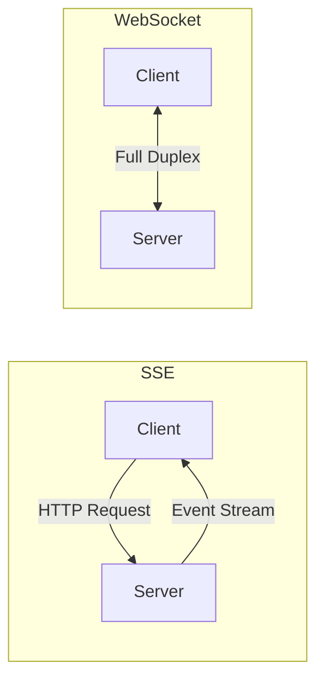
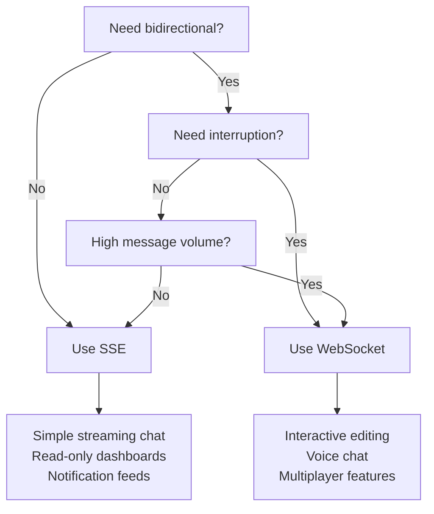

In this guide, you will implement AI streaming in React using both Server-Sent Events (SSE) and WebSockets with NeuroLink. You will build streaming hooks, handle partial token rendering, implement reconnection logic, and choose the right transport for your latency requirements.

Two technologies enable this: Server-Sent Events (SSE) for simple, unidirectional streaming, and WebSockets for bidirectional communication. Both work well with React, but they serve different use cases and come with different trade-offs.

This tutorial builds both implementations from scratch. You will create a reusable `useAIStream` hook for SSE, a `useWebSocketStream` hook for WebSocket, and learn when to choose each approach.

---

## SSE vs WebSocket Comparison

Before building, understand the trade-offs.

| Feature | SSE | WebSocket |
|---|---|---|
| Direction | Server to client only | Bidirectional |
| Protocol | HTTP/1.1 or HTTP/2 | ws:// or wss:// |
| Reconnection | Built-in auto-reconnect | Manual implementation |
| Browser support | All modern browsers | All modern browsers |
| Best for | AI text streaming | Chat with interrupts |
| Complexity | Simple | Moderate |
| Connection limit | 6 per domain (HTTP/1.1) | No practical limit |



**SSE** is the simpler choice. It uses standard HTTP, reconnects automatically, and works through most proxies without configuration. For AI text streaming -- where the server generates text and the client displays it -- SSE is the right default.

**WebSocket** is necessary when the client needs to send messages while receiving a stream. Interrupting a generation mid-stream, sending typing indicators, or implementing voice chat all require bidirectional communication.

---

## Step 1: Backend -- Streaming with NeuroLink

Both SSE and WebSocket implementations share the same backend: NeuroLink's `stream()` method, which returns an async iterable of `StreamChunk` objects.

```typescript
// api/stream/route.ts (Next.js App Router)
import { NeuroLink } from "@juspay/neurolink";

const neurolink = new NeuroLink();

export async function POST(request: Request) {
  const { prompt } = await request.json();

  const result = await neurolink.stream({
    input: { text: prompt },
    provider: "openai",
    model: "gpt-4o",
    temperature: 0.7,
    maxTokens: 2000,
  });

  const encoder = new TextEncoder();

  const readableStream = new ReadableStream({
    async start(controller) {
      for await (const chunk of result.stream) {
        if ("content" in chunk) {
          // SSE format: data: <json>\n\n
          const event = `data: ${JSON.stringify({ content: chunk.content })}\n\n`;
          controller.enqueue(encoder.encode(event));
        }
      }

      // Signal completion
      controller.enqueue(encoder.encode("data: [DONE]\n\n"));
      controller.close();
    },
  });

  return new Response(readableStream, {
    headers: {
      "Content-Type": "text/event-stream",
      "Cache-Control": "no-cache, no-transform",
      Connection: "keep-alive",
    },
  });
}
```

### Key details

- **`result.stream`** is the async iterable from NeuroLink. Each iteration yields a `StreamChunk` (source: `src/lib/types/streamTypes.ts`).
- **`StreamChunk`** is a discriminated union: `type: "text"` for text content, `type: "audio"` for TTS audio data.
- **`Cache-Control: no-cache, no-transform`** prevents proxies from buffering the stream. Without this, some CDNs and reverse proxies will buffer the entire response before sending it to the client.
- **`Connection: keep-alive`** keeps the TCP connection open for the duration of the stream.

---

## Step 2: React SSE Client with useAIStream Hook

The `useAIStream` hook encapsulates SSE parsing, state management, error handling, and cancellation in a reusable React hook.

```typescript
// hooks/useAIStream.ts
import { useState, useCallback, useRef } from "react";

type StreamState = {
  content: string;
  isStreaming: boolean;
  error: string | null;
};

export function useAIStream() {
  const [state, setState] = useState<StreamState>({
    content: "",
    isStreaming: false,
    error: null,
  });
  const abortRef = useRef<AbortController | null>(null);

  const stream = useCallback(async (prompt: string) => {
    // Cancel any existing stream
    abortRef.current?.abort();
    abortRef.current = new AbortController();

    setState({ content: "", isStreaming: true, error: null });

    try {
      const response = await fetch("/api/stream", {
        method: "POST",
        headers: { "Content-Type": "application/json" },
        body: JSON.stringify({ prompt }),
        signal: abortRef.current.signal,
      });

      if (!response.ok) throw new Error(`HTTP ${response.status}`);

      const reader = response.body!.getReader();
      const decoder = new TextDecoder();
      let buffer = "";

      while (true) {
        const { done, value } = await reader.read();
        if (done) break;

        buffer += decoder.decode(value, { stream: true });
        const lines = buffer.split("\n");
        buffer = lines.pop() || ""; // Keep incomplete line in buffer

        for (const line of lines) {
          if (line.startsWith("data: ") && line !== "data: [DONE]") {
            const data = JSON.parse(line.slice(6));
            setState((prev) => ({
              ...prev,
              content: prev.content + data.content,
            }));
          }
        }
      }
    } catch (error) {
      if (error instanceof DOMException && error.name === "AbortError") return;
      setState((prev) => ({
        ...prev,
        error: error instanceof Error ? error.message : "Stream failed",
      }));
    } finally {
      setState((prev) => ({ ...prev, isStreaming: false }));
    }
  }, []);

  const cancel = useCallback(() => {
    abortRef.current?.abort();
    setState((prev) => ({ ...prev, isStreaming: false }));
  }, []);

  return { ...state, stream, cancel };
}
```

### Design decisions

**AbortController for cancellation.** When the user clicks "Stop generating," the `AbortController` cancels the fetch request and the server-side stream. The server receives a connection close event and stops generating tokens.

**Buffer for incomplete lines.** SSE events can be split across multiple read chunks. The buffer collects partial lines and only processes complete lines (those ending with `\n`). The last element of `split("\n")` might be an incomplete line, so it stays in the buffer.

**AbortError filtering.** When we cancel a stream intentionally, the fetch API throws an `AbortError`. We catch and ignore it because it is not a real error -- the user chose to cancel.

---

## Step 3: React Component Using the Hook

A minimal component that uses the `useAIStream` hook.

```typescript
// components/StreamingChat.tsx
"use client";
import { useAIStream } from "../hooks/useAIStream";

export default function StreamingChat() {
  const { content, isStreaming, error, stream, cancel } = useAIStream();

  return (
    <div className="max-w-2xl mx-auto p-4">
      <form
        onSubmit={(e) => {
          e.preventDefault();
          const input = e.currentTarget.elements.namedItem("prompt") as HTMLInputElement;
          stream(input.value);
          input.value = "";
        }}
      >
        <input
          name="prompt"
          placeholder="Ask anything..."
          className="w-full p-2 border rounded"
          disabled={isStreaming}
        />
      </form>

      {isStreaming && (
        <button onClick={cancel} className="mt-2 text-red-500">
          Stop generating
        </button>
      )}

      {error && <p className="text-red-500 mt-2">{error}</p>}

      <div className="mt-4 p-4 bg-gray-50 rounded whitespace-pre-wrap">
        {content || "Response will appear here..."}
        {isStreaming && <span className="animate-pulse">|</span>}
      </div>
    </div>
  );
}
```

The component is clean because all the complexity lives in the hook. The form submits a prompt, the hook streams the response, and the component renders the content with a blinking cursor during streaming.

---

## Step 4: WebSocket Implementation

For bidirectional communication -- where the user can interrupt a stream, send corrections, or interact in real time -- WebSockets are the right choice.

### Backend: WebSocket handler

```typescript
// Backend: WebSocket handler (Express/Hono)
import {
  WebSocketConnectionManager,
  WebSocketMessageRouter,
} from "@juspay/neurolink";

const wsManager = new WebSocketConnectionManager();
const router = new WebSocketMessageRouter();

router.on("chat", async (message, connection) => {
  const neurolink = new NeuroLink();

  const result = await neurolink.stream({
    input: { text: message.payload.prompt },
    provider: "openai",
  });

  for await (const chunk of result.stream) {
    if ("content" in chunk) {
      connection.send(JSON.stringify({
        type: "chunk",
        content: chunk.content,
      }));
    }
  }

  connection.send(JSON.stringify({ type: "done" }));
});
```

NeuroLink provides `WebSocketConnectionManager` for tracking active connections and `WebSocketMessageRouter` for routing messages by type (source: `src/lib/server/index.ts`).

### Frontend: WebSocket React hook

```typescript
// hooks/useWebSocketStream.ts
import { useRef, useState, useCallback, useEffect } from "react";

export function useWebSocketStream(url: string) {
  const ws = useRef<WebSocket | null>(null);
  const [content, setContent] = useState("");
  const [isConnected, setIsConnected] = useState(false);
  const [isStreaming, setIsStreaming] = useState(false);

  useEffect(() => {
    ws.current = new WebSocket(url);
    ws.current.onopen = () => setIsConnected(true);
    ws.current.onclose = () => setIsConnected(false);

    ws.current.onmessage = (event) => {
      const data = JSON.parse(event.data);
      if (data.type === "chunk") {
        setContent((prev) => prev + data.content);
      } else if (data.type === "done") {
        setIsStreaming(false);
      }
    };

    return () => ws.current?.close();
  }, [url]);

  const send = useCallback((prompt: string) => {
    setContent("");
    setIsStreaming(true);
    ws.current?.send(JSON.stringify({ type: "chat", payload: { prompt } }));
  }, []);

  return { content, isConnected, isStreaming, send };
}
```

### Key differences from SSE

- **Persistent connection.** The WebSocket connects once and stays open. No new HTTP request per message.
- **Bidirectional.** The client can send messages at any time, including while receiving a stream. This enables interruption, typing indicators, and real-time corrections.
- **Manual reconnection.** Unlike SSE, WebSockets do not auto-reconnect. You need to implement reconnection logic in the `onclose` handler.
- **No proxy issues.** WebSockets work through most proxies, but some older corporate proxies block the upgrade handshake.

---

## Step 5: Handling Audio Streams

NeuroLink supports TTS audio streaming alongside text. The `StreamChunk` discriminated union (source: `src/lib/types/streamTypes.ts`) includes an `audio` type with `AudioChunk` data.

```typescript
for await (const chunk of result.stream) {
  switch (chunk.type) {
    case "text":
      process.stdout.write(chunk.content);
      break;
    case "audio":
      // chunk.audioChunk has: data (Buffer), sampleRateHz, channels, encoding
      audioBuffer.push(chunk.audioChunk.data);
      break;
  }
}
```

Audio chunks include the raw audio data, sample rate, channel count, and encoding format. On the frontend, you can feed these chunks into a Web Audio API context for real-time playback while text streams in parallel.

---

## Decision Framework: When to Use SSE vs WebSocket

Use this decision tree to choose the right approach for your application.



### Use SSE when

- The AI generates text and the user reads it (unidirectional)
- You want simplicity -- SSE is built on standard HTTP
- You need automatic reconnection (SSE has it built in)
- You are building a read-only streaming dashboard or notification feed
- Your infrastructure uses standard HTTP proxies and load balancers

### Use WebSocket when

- Users need to interrupt AI generation mid-stream
- You are building voice chat with simultaneous send and receive
- High message volume in both directions (collaborative editing)
- You need server-initiated messages outside of a request-response cycle
- You are building multiplayer or real-time collaborative features

> **Note:** For most AI chatbot use cases, SSE is the right choice. WebSockets add complexity (reconnection logic, connection management, proxy compatibility) that is only justified when you need bidirectional communication.
{: .prompt-info }

---

## Performance Tips

### 1. Use AbortController for client-side cancellation

Always provide a way for users to cancel a stream. The `AbortController` signals the server to stop generating, saving tokens and compute.

### 2. Buffer SSE events to reduce React re-renders

Each token triggers a state update and a re-render. For fast models, this can be hundreds of updates per second. Batch updates with `requestAnimationFrame`:

```typescript
const pendingContent = useRef("");
const rafId = useRef<number | null>(null);

function appendContent(newContent: string) {
  pendingContent.current += newContent;

  if (!rafId.current) {
    rafId.current = requestAnimationFrame(() => {
      setState((prev) => ({
        ...prev,
        content: prev.content + pendingContent.current,
      }));
      pendingContent.current = "";
      rafId.current = null;
    });
  }
}
```

This batches all content updates within a single animation frame, reducing re-renders from hundreds per second to 60 per second.

### 3. Set Cache-Control headers to prevent proxy buffering

```typescript
headers: {
  "Content-Type": "text/event-stream",
  "Cache-Control": "no-cache, no-transform",
  "X-Accel-Buffering": "no",  // Nginx
}
```

The `no-transform` directive prevents proxies from compressing or buffering the stream. `X-Accel-Buffering: no` specifically tells Nginx to pass through the stream without buffering.

### 4. Use HTTP/2 to overcome the SSE connection limit

HTTP/1.1 limits browsers to 6 connections per domain. If you have multiple SSE streams, they can exhaust this limit. HTTP/2 multiplexes all streams over a single connection, removing this limitation.

### 5. Implement heartbeat for WebSocket connections

WebSocket connections can be silently dropped by proxies. Send periodic ping messages (every 30 seconds) to keep the connection alive and detect disconnections early.

```typescript
// Server-side heartbeat
setInterval(() => {
  ws.send(JSON.stringify({ type: "ping" }));
}, 30000);
```

---

## What's Next

You have completed all the steps in this guide. To continue building on what you have learned:

1. Review the code examples and adapt them for your specific use case
2. Start with the simplest pattern first and add complexity as your requirements grow
3. Monitor performance metrics to validate that each change improves your system
4. Consult the NeuroLink documentation for advanced configuration options

---

**Related posts:**

- [CI/CD for AI Applications: Testing, Building, and Deploying with Confidence](/posts/cicd-for-ai-applications/)
- [Building a Full-Stack AI Chatbot with Next.js and NeuroLink](/posts/full-stack-ai-chatbot-nextjs-neurolink/)
- [Building AI Agents with NeuroLink: From Chatbot to Autonomous System](/posts/building-ai-agents/)
