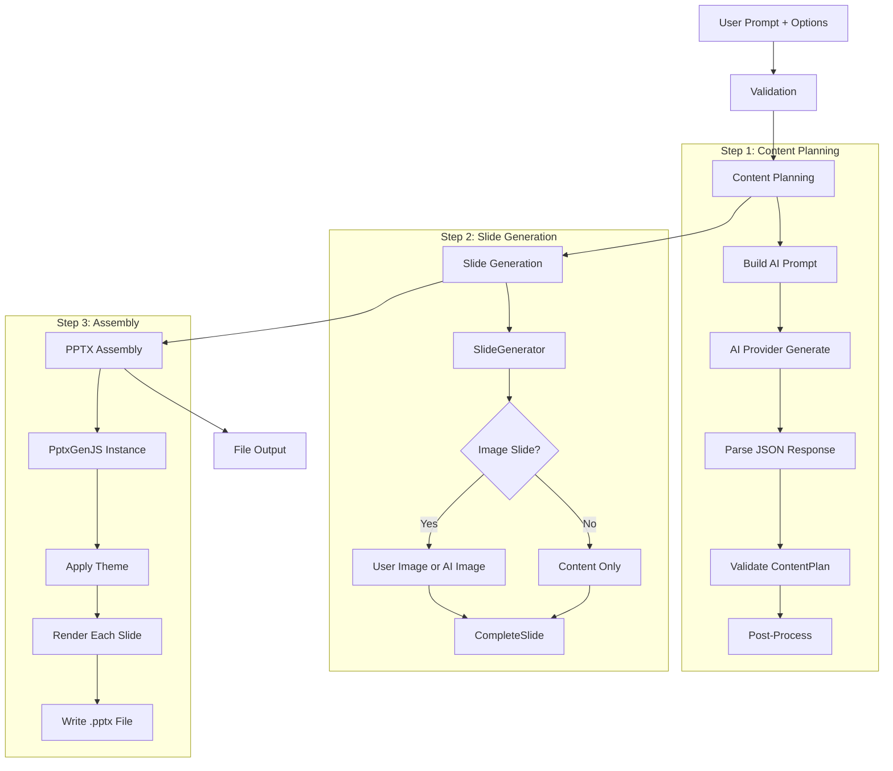

In this guide, you will generate PowerPoint presentations from text prompts using NeuroLink. You will implement slide layout generation, content structuring, theme application, and export to .pptx format -- turning a single paragraph into a complete presentation deck.

NeuroLink's PPT module does exactly that. Give it a text prompt and a handful of configuration options, and it produces a complete `.pptx` file through a four-stage pipeline: validation, content planning (powered by AI), slide generation (with optional AI-generated images), and PPTX assembly. The module supports over 30 slide types, five built-in themes, custom logos, speaker notes, and multiple aspect ratios. Whether you need an executive briefing, a product launch keynote, or a training deck, the same API call handles it all.

In this tutorial, you will learn how the generation pipeline works end to end, how to configure themes and images, and how to handle the edge cases that come with production-grade document generation.

## Architecture: The Generation Pipeline

The presentation generation process follows a structured four-stage pipeline. Each stage has its own timeout protection to ensure that long-running operations do not stall the entire process.



The orchestration is handled by `generatePresentation()` in the presentation orchestrator, which coordinates the full lifecycle. Content planning is delegated to `generateContentPlan()`, which builds an AI prompt and parses the structured JSON response. The `SlideGenerator` class handles individual slide rendering, including image sourcing. Finally, 18+ specialized render functions in the slide renderers module handle the visual layout for each slide type.

Each stage is wrapped with `withTimeout()` to enforce deadline-based execution. If any stage exceeds its allowed time, the pipeline fails gracefully with a clear error indicating which stage timed out.

## Quick Start

Getting a presentation generated requires just a single `generate()` call with the output mode set to `"ppt"`:

```typescript
import { NeuroLink } from '@juspay/neurolink';

const neurolink = new NeuroLink();

const result = await neurolink.generate({
  input: {
    text: "Create a 10-slide presentation about AI in healthcare",
  },
  output: {
    mode: "ppt",
    ppt: {
      pages: 10,
      theme: "modern",
      audience: "executive",
      tone: "professional",
      generateAIImages: true,
      aspectRatio: "16:9",
    },
  },
  provider: "google-ai",
});

console.log(`Presentation saved: ${result.ppt?.filePath}`);
console.log(`Total slides: ${result.ppt?.totalSlides}`);
```

The output mode `"ppt"` triggers the PPT pipeline within the generate function. The result object includes a `filePath` pointing to the generated `.pptx` file, the `totalSlides` count, the `format`, the `provider` and `model` used, and a `metadata` object containing the theme, audience, tone, image model, and file size.

> **Note:** The `provider` field determines which AI model handles content planning. Image generation, when enabled, uses NeuroLink's image generation pipeline separately.
{: .prompt-info }

## Content Planning: How AI Structures Your Deck

The content planning stage is where the AI does the heavy lifting of structuring your presentation. A system prompt guides the AI to produce structured JSON output that maps directly to slide definitions.

The `buildContentPlanningPrompt()` function incorporates several inputs: the topic from your text prompt, the requested number of pages, the target audience, the desired tone, the selected theme, and the model tier. These inputs shape the AI's decisions about content density, vocabulary, and visual balance.

The AI returns a `ContentPlan` object with a clear structure:

```typescript
// ContentPlan structure (simplified)
{
  title: "AI in Healthcare: Transforming Patient Care",
  totalSlides: 10,
  audience: "executive",
  tone: "professional",
  theme: "modern",
  slides: [
    {
      slideNumber: 1,
      type: "title",
      layout: "title-centered",
      title: "AI in Healthcare",
      content: { subtitle: "Transforming Patient Care" },
      imagePrompt: "futuristic hospital with AI visualization",
      speakerNotes: "Welcome everyone..."
    },
    // ... more slides
  ]
}
```

Each `SlideSchema` contains the slide number, type, layout, title, content object, an optional `imagePrompt` for AI image generation, and `speakerNotes` for the presenter.

### Validation and Normalization

The AI's output goes through a rigorous validation pipeline in `validateContentPlan()`:

- **Type validation**: Each slide type is checked against 34 valid types including `title`, `content`, `bullets`, `timeline`, `chart-bar`, `dashboard`, and more.
- **Layout validation**: Layouts are validated against 36 valid options such as `title-centered`, `two-column-equal`, `chart-full`, and others.
- **Bullet normalization**: The pipeline normalizes bullet content from various AI output formats into a consistent structure.
- **Smart inference**: `normalizeSlideWithInference()` can infer the slide type from title keywords. A slide titled "Our Timeline" would automatically get the `timeline` type if the AI did not specify one.
- **Post-processing**: The pipeline ensures the first slide is always a `title` type and the last slide is a `thank-you` type, regardless of what the AI produced.

This multi-layered validation means that even when the AI produces imperfect JSON, the pipeline self-corrects to produce a valid presentation structure.

## Slide Types and Layouts

NeuroLink supports a comprehensive library of slide types organized into logical categories:

| Category | Slide Types | Best For |
|---|---|---|
| **Opening/Closing** | title, section-header, thank-you, closing | First and last slides |
| **Content** | content, agenda, bullets, numbered-list | Text-heavy information slides |
| **Visual** | image-focus, image-left, image-right, full-bleed-image, gallery | Image-centric slides |
| **Layout** | two-column, three-column, split-content | Side-by-side content comparisons |
| **Data** | table, chart-bar, chart-line, chart-pie, chart-area, statistics | Data visualization |
| **Special** | quote, timeline, process-flow, comparison, features, team, icons | Domain-specific layouts |
| **Composite** | dashboard, mixed-content, stats-grid, icon-grid | Multi-zone layouts |

With 34 slide types mapped to 36 layout variants, the automatic layout selection function `getLayoutForType()` picks the best layout for each type. Each type has a dedicated renderer function that handles the precise positioning of text, images, and decorative elements.

> **Note:** You do not need to specify slide types manually. The AI content planner selects appropriate types based on your topic and audience. However, you can influence the outcome by being specific in your prompt, such as "include a timeline slide showing the project phases."
{: .prompt-info }

## AI Image Generation

The PPT module supports two sources for slide images, with a clear priority system:

### User-Provided Images

When you supply images in your input, they take priority over AI generation. Images are cycled across slides that need visual content:

```typescript
// With user-provided images
const result = await neurolink.generate({
  input: {
    text: "Company quarterly review",
    images: [
      Buffer.from(logoBuffer),
      "https://example.com/chart.png",
      "/path/to/photo.jpg",
    ],
  },
  output: {
    mode: "ppt",
    ppt: {
      pages: 8,
      generateAIImages: false, // User images take priority
    },
  },
  provider: "google-ai",
});
```

### AI-Generated Images

When `generateAIImages` is set to `true` and a slide's content plan includes an `imagePrompt`, the pipeline generates images using NeuroLink's image generation capabilities with Gemini image models.

The image generation process includes several safeguards:

- **Prompt enhancement**: `enhanceImagePrompt()` improves the raw image prompt with theme-specific context, ensuring generated images match the presentation's visual style.
- **Concurrency control**: Image generation is limited via `p-limit` with a configurable `MAX_CONCURRENT_IMAGE_GENERATIONS` to avoid overwhelming the provider API.
- **Format validation**: Generated images are checked by inspecting magic bytes for JPEG, PNG, GIF, or WebP format before being embedded in slides.
- **Timeout protection**: Each image generation request has its own `IMAGE_GENERATION_TIMEOUT_MS` deadline.
- **Graceful degradation**: If an image generation fails, the slide is still created with its text content intact. A missing image does not block the entire presentation.

## Themes and Customization

NeuroLink ships with five built-in themes, each defining a complete visual system:

### Built-in Themes

- **modern**: Clean lines, blue accents, contemporary typography
- **corporate**: Professional tones, structured layouts, business-appropriate
- **creative**: Bold colors, dynamic compositions, expressive design
- **minimal**: Maximum whitespace, subtle accents, distraction-free
- **dark**: Dark backgrounds, light text, high-contrast visuals

Each `PresentationTheme` defines colors (primary, secondary, accent, background, text, muted), fonts (heading family, body family, and sizes), and spacing values.

### Aspect Ratios and Logo Support

```typescript
const result = await neurolink.generate({
  input: { text: "Product launch keynote" },
  output: {
    mode: "ppt",
    ppt: {
      theme: "corporate",
      aspectRatio: "16:9",
      logo: {
        data: logoBuffer,
        position: "bottom-right",
        width: 1.2,
        height: 0.5,
        showOn: "all-slides",
      },
    },
  },
  provider: "google-ai",
});
```

Three aspect ratios are supported: `"16:9"` (widescreen, default), `"4:3"` (classic), and `"16:10"` (wide). Each ratio has corresponding `SLIDE_DIMENSIONS` that govern element positioning.

The `LogoConfig` lets you place a logo in any corner (`top-left`, `top-right`, `bottom-left`, `bottom-right`) and control where it appears: on all slides, only on the title slide, or on both the title and closing slides.

### Audience and Tone Guidelines

The pipeline includes `AUDIENCE_GUIDELINES` and `TONE_GUIDELINES` that shape content density and language. An "executive" audience gets higher-level summaries with business impact framing, while a "technical" audience gets detailed specifications and code examples. A "professional" tone yields formal language, while a "casual" tone produces conversational phrasing.

## Error Handling

The PPT module uses a dedicated `PPTError` class with typed error codes for precise failure diagnosis:

| Error Code | Meaning | Common Cause |
|---|---|---|
| `INVALID_AI_RESPONSE` | AI returned content that could not be parsed as JSON | Provider returned markdown instead of JSON |
| `PLANNING_FAILED` | Content planning stage failed entirely | Provider timeout or rate limit |
| `ASSEMBLY_FAILED` | PPTX file assembly failed | Corrupt image data or disk write failure |

The pipeline tracks which stage failed through `getFailureStage(state)`, making it straightforward to diagnose issues in production. Combined with timeout protection at every stage via `withTimeout()`, the system provides clear, actionable error information rather than generic failure messages.

> **Note:** Failed images do not block slide generation. If an AI-generated image fails, the slide is rendered with its text content only. This graceful degradation ensures that a single image generation failure does not prevent you from getting a usable presentation.
{: .prompt-info }

## Putting It All Together: A Complete Example

Here is a more comprehensive example that demonstrates theme customization, logo placement, AI image generation, and result inspection:

```typescript
import { NeuroLink } from '@juspay/neurolink';
import * as fs from 'fs/promises';

const neurolink = new NeuroLink();

async function generateMarketingDeck() {
  const logoBuffer = await fs.readFile('./assets/company-logo.png');

  const result = await neurolink.generate({
    input: {
      text: `Create a 12-slide presentation about our Q4 product launch.
             Cover: market opportunity, product features, competitive advantages,
             go-to-market strategy, pricing, and timeline.`,
    },
    output: {
      mode: "ppt",
      ppt: {
        pages: 12,
        theme: "modern",
        audience: "executive",
        tone: "professional",
        generateAIImages: true,
        aspectRatio: "16:9",
        logo: {
          data: logoBuffer,
          position: "bottom-right",
          width: 1.0,
          height: 0.4,
          showOn: "all-slides",
        },
      },
    },
    provider: "google-ai",
  });

  if (result.ppt) {
    console.log(`File: ${result.ppt.filePath}`);
    console.log(`Slides: ${result.ppt.totalSlides}`);
    console.log(`Format: ${result.ppt.format}`);
    console.log(`Theme: ${result.ppt.metadata?.theme}`);
    console.log(`File size: ${result.ppt.metadata?.fileSize} bytes`);
  }
}

generateMarketingDeck().catch(console.error);
```

This example produces a polished 12-slide executive deck with AI-generated images, a company logo on every slide, and speaker notes for each section. The AI content planner structures the deck to flow logically from market opportunity through pricing and timeline, with appropriate slide types chosen for each section.

## What's Next

You have completed all the steps in this guide. To continue building on what you have learned:

1. Review the code examples and adapt them for your specific use case
2. Start with the simplest pattern first and add complexity as your requirements grow
3. Monitor performance metrics to validate that each change improves your system
4. Consult the NeuroLink documentation for advanced configuration options

---

**Related posts:**

- [Structured Output: JSON Schema Enforcement with NeuroLink](/posts/structured-output-json/)
- [Multimodal Document Processing with NeuroLink](/posts/multimodal-document-processing/)
- [Processing Any Document with AI: 50+ File Types in One SDK](/posts/processing-any-document-50-file-types/)
