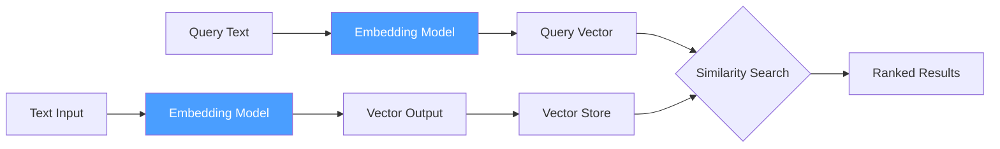
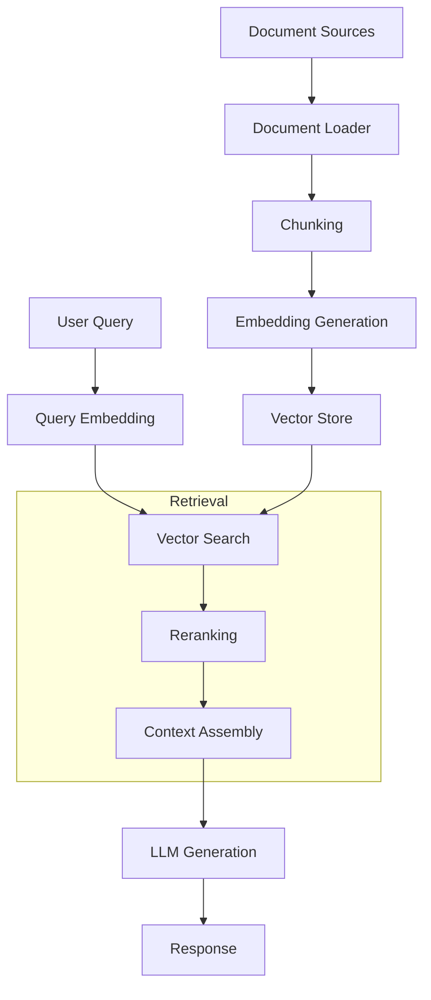

In this guide, you will implement embeddings and vector operations with NeuroLink. You will generate text embeddings, compute similarity scores, build a simple vector search index, and integrate with vector databases for production-scale semantic search.

At their core, embeddings turn text into numerical vectors that capture semantic meaning. Two pieces of text that mean similar things produce vectors that are close together in high-dimensional space, even if they share no words in common. This property makes embeddings the fundamental building block for semantic search, Retrieval-Augmented Generation (RAG) pipelines, document clustering, and recommendation systems.

NeuroLink provides a unified embedding API across providers, including OpenAI's `text-embedding-3-small`, Google AI's `text-embedding-004`, and Vertex AI models. Each provider implements `getDefaultEmbeddingModel()` to expose its best embedding model, so you can switch providers without changing your application logic.

In this tutorial, you will learn how embeddings work, how to generate them through NeuroLink's RAG pipeline, and how to build semantic search systems that retrieve the right information every time.

## How Embeddings Work

The embedding process transforms human-readable text into fixed-dimensional numerical vectors. A sentence like "Machine learning automates pattern recognition" becomes an array of 768 or 1536 floating-point numbers, depending on the model. The magic is that semantically similar sentences produce vectors that are close together in this high-dimensional space.



### Distance Metrics

Three common metrics measure how close two vectors are:

- **Cosine similarity**: Measures the angle between two vectors, producing a value between -1 and 1. A score of 1 means the vectors point in the same direction (maximum similarity). This is the most commonly used metric because it is insensitive to vector magnitude.
- **Dot product**: Measures the projection of one vector onto another. It is useful for normalized vectors and is slightly faster to compute than cosine similarity.
- **Euclidean distance**: Measures the straight-line distance between two points in vector space. Smaller values indicate greater similarity. This metric is sensitive to vector magnitude.

NeuroLink's RAG system uses embeddings for chunked document retrieval, handling the embedding generation, similarity computation, and result ranking internally. The vector query tool performs similarity search against chunked document embeddings, and the hybrid search module combines vector similarity with keyword matching for improved accuracy.


## Generating Embeddings

NeuroLink integrates embedding generation into its RAG pipeline. When you provide document sources and a query, the pipeline automatically chunks the documents, generates embeddings for each chunk, embeds the query, and retrieves the most relevant chunks.

```typescript
import { NeuroLink } from '@juspay/neurolink';

const neurolink = new NeuroLink();

// Generate embeddings via the RAG pipeline
const result = await neurolink.generate({
  input: { text: "What is machine learning?" },
  provider: "google-ai",
  rag: {
    sources: ["./docs/ml-guide.pdf"],
    chunkSize: 500,
    chunkOverlap: 50,
  },
});
```

### Provider-Specific Embedding Models

Different providers offer different embedding models, each with its own characteristics:

| Provider | Model | Dimensions | Selection |
|---|---|---|---|
| **OpenAI** | text-embedding-3-small (default) | 1536 | Via `getDefaultEmbeddingModel()` |
| **OpenAI** | text-embedding-3-large | 3072 | Explicit selection |
| **OpenAI** | text-embedding-ada-002 | 1536 | Legacy support |
| **Google AI** | text-embedding-004 | 768 | Via `getDefaultEmbeddingModel()` |
| **Vertex AI** | text-embedding-004 | 768 | Via `getDefaultEmbeddingModel()` |
| **Vertex AI** | textembedding-gecko | 768 | Enterprise deployments |

Embedding models are selected via `getDefaultEmbeddingModel()` in each provider implementation. The RAG configuration within `GenerateOptions` accepts `sources`, `chunkSize`, `chunkOverlap`, `topK`, and `scoreThreshold` parameters to control the retrieval behavior.

> **Note:** Always use the same embedding model for both document embeddings and query embeddings. Mixing models (for example, embedding documents with OpenAI but querying with Google) produces meaningless similarity scores because the vector spaces are incompatible.
{: .prompt-info }


## The RAG Pipeline: Embeddings in Action

NeuroLink's RAG pipeline handles the full lifecycle from raw documents to AI-generated answers. Understanding each stage helps you tune the pipeline for your specific use case.



### Pipeline Components

The RAG pipeline is organized into four major subsystems:

**Chunking** -- The semantic chunker splits documents into chunks that preserve semantic boundaries. Rather than splitting blindly at a fixed character count, it identifies natural breakpoints like paragraph endings, section headers, and topic shifts. This produces chunks where each one contains a coherent unit of information.

**Retrieval** -- The vector query tool and hybrid search module handle finding the most relevant chunks for a given query. Vector search finds semantically similar content, while keyword matching (BM25) catches exact term matches that embedding models might miss.

**Reranking** -- After initial retrieval, a factory-based reranker module re-scores the results using a more expensive but more accurate model. This two-stage approach (fast retrieval followed by precise reranking) balances speed and accuracy.

**Resilience** -- The circuit breaker and retry handler protect the pipeline from provider outages. If an embedding API goes down, the circuit breaker prevents repeated failed calls, and the retry handler manages exponential backoff for transient failures.

### Advanced RAG Configuration

For more control over retrieval, you can specify detailed RAG parameters:

```typescript
const result = await neurolink.generate({
  input: {
    text: "What are the key findings from the research paper?",
    pdfFiles: ["./research-paper.pdf"],
  },
  provider: "vertex",
  rag: {
    sources: ["./research-paper.pdf", "./supplementary-data.csv"],
    chunkSize: 1000,
    chunkOverlap: 200,
    topK: 5,
    scoreThreshold: 0.7,
  },
});
```

- **chunkSize**: The target size for each document chunk in characters. Larger chunks preserve more context but may dilute relevance for specific queries.
- **chunkOverlap**: The number of characters that overlap between adjacent chunks. This prevents important information from being split across chunk boundaries.
- **topK**: The maximum number of chunks to retrieve. More chunks provide more context but increase token usage and cost.
- **scoreThreshold**: The minimum similarity score (0 to 1) for a chunk to be included. This filters out low-relevance results that would add noise to the context.

## Vector Similarity Operations

Under the hood, NeuroLink's vector query tool performs similarity search against chunked document embeddings. Here is a conceptual breakdown of what happens during retrieval:

```typescript
// Conceptual example of similarity scoring
// NeuroLink handles this internally during RAG retrieval

// The RAG pipeline:
// 1. Chunks source documents
// 2. Embeds each chunk with the provider's embedding model
// 3. Embeds the user query
// 4. Computes similarity scores
// 5. Returns top-K most relevant chunks
// 6. Feeds chunks as context to the LLM
```

The score threshold filtering is particularly important for production systems. Without it, the pipeline would always return `topK` results even if none of them are actually relevant. Setting `scoreThreshold: 0.7` ensures that only genuinely similar content reaches the LLM, preventing hallucinations caused by irrelevant context.

### When Similarity Scores Mislead

Be aware that similarity scores are not absolute measures of relevance. A score of 0.85 from OpenAI's `text-embedding-3-small` does not mean the same thing as 0.85 from Google's `text-embedding-004`. The score distributions differ between models, so you need to calibrate your threshold for each model you use.

A practical approach is to embed a set of known-relevant and known-irrelevant queries against your document set, then choose a threshold that correctly separates the two groups.

## Choosing the Right Embedding Model

The choice of embedding model affects vector dimensions, accuracy, cost, and latency. Here is a comparison to guide your decision:

| Provider | Model | Dimensions | Best For |
|---|---|---|---|
| **OpenAI** | text-embedding-3-small | 1536 | Cost-effective general use |
| **OpenAI** | text-embedding-3-large | 3072 | Maximum accuracy for critical applications |
| **Google** | text-embedding-004 | 768 | Google ecosystem integration |
| **Vertex** | textembedding-gecko | 768 | Enterprise deployments with Vertex AI |

**Key trade-offs:**

- **Dimensions**: Higher dimensions capture more semantic nuance but require more storage and compute for similarity calculations. OpenAI's 3072-dimensional model captures finer distinctions than a 768-dimensional model, but at roughly 4x the storage cost.
- **Provider consistency**: Beyond using the same model for documents and queries, keep your entire pipeline on one provider. Switching embedding providers mid-project means re-embedding your entire document corpus.
- **Cost**: Embedding generation cost scales with input size. For large document sets, the cost difference between models can be significant.

## Best Practices

### Chunk Size Optimization

Chunk size is the single most impactful parameter in your RAG pipeline:

- **Too small** (under 200 characters): Chunks lose context. A question about "the CEO's strategy" might match a chunk containing just "the CEO said" without the actual strategy.
- **Too large** (over 2000 characters): Chunks contain multiple topics, diluting the relevance signal. The right answer is buried among irrelevant sentences.
- **Sweet spot** (500-1000 characters): Most use cases perform best in this range. Start at 500 and increase if you notice that answers lack context.

### Overlap Strategy

Overlap prevents important information from being split across chunk boundaries. A 10-20% overlap (50-200 characters for typical chunk sizes) is a good starting point. Increase overlap for documents where key information spans multiple paragraphs.

### Caching and Performance

For static documents that do not change frequently, cache the generated embeddings to avoid recomputation. Embedding generation has both a monetary cost (API calls) and a latency cost (network round trips). Caching eliminates both for previously processed documents.

### Hybrid Search

Pure vector search can miss results that match on exact terms rather than semantic meaning. For example, a query for "error code NL-4021" would not match well semantically because error codes are arbitrary identifiers. Hybrid search combines vector similarity with BM25 keyword matching to handle both semantic and lexical queries effectively.

### Circuit Breaker Protection

Monitor your embedding pipeline with the circuit breaker pattern. When a provider experiences an outage, the circuit breaker prevents your application from hammering a failing endpoint. The breaker opens after a configurable number of failures and periodically tests whether the provider has recovered.

## What's Next

You have completed all the steps in this guide. To continue building on what you have learned:

1. Review the code examples and adapt them for your specific use case
2. Start with the simplest pattern first and add complexity as your requirements grow
3. Monitor performance metrics to validate that each change improves your system
4. Consult the NeuroLink documentation for advanced configuration options

---

**Related posts:**

- [PowerPoint Generation with AI: From Text Prompt to Complete Presentation](/posts/powerpoint-generation-ai/)
- [Building a RAG Application with TypeScript: Complete Tutorial](/posts/rag-application-typescript-tutorial/)
- [Advanced RAG: 10 Chunking Strategies, Hybrid Search, and Reranking](/posts/advanced-rag/)
