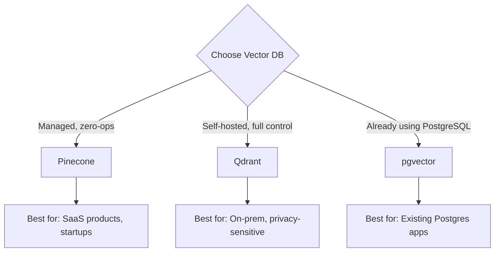
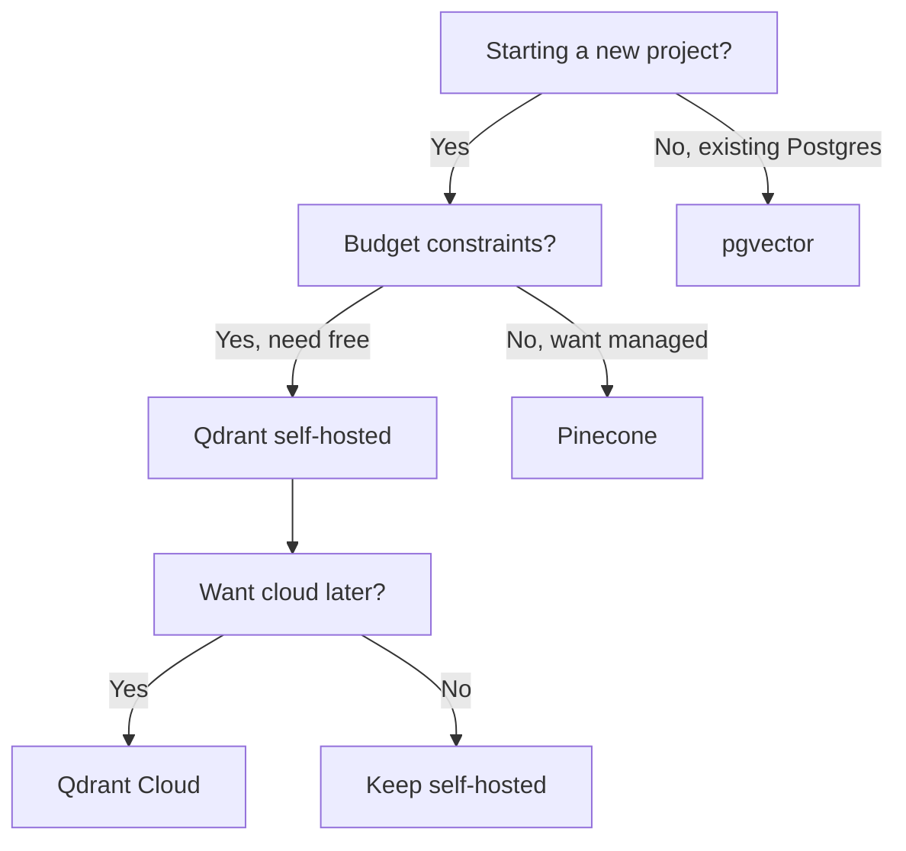

Pinecone, Qdrant, and pgvector represent the vector database landscape, and each approach excels in different scenarios -- but choosing the wrong one can cost you months of migration work. This comparison evaluates all three against NeuroLink integration complexity, query performance, operational overhead, cost at scale, and feature completeness -- with honest assessments of where each option falls short.

Three vector databases dominate the TypeScript ecosystem: Pinecone (fully managed cloud), Qdrant (open-source with optional cloud), and pgvector (a PostgreSQL extension). Each has distinct strengths, and each integrates cleanly with NeuroLink through the `VectorStore` interface.

This guide compares all three on setup, scalability, filtering, and performance. More importantly, it shows you exactly how to implement each one and plug it into NeuroLink's RAG pipeline with working TypeScript code.

## Head-to-Head Comparison

Before diving into implementation, here is how the three options stack up across the features that matter most:

| Feature | Pinecone | Qdrant | pgvector |
|---|---|---|---|
| **Type** | Managed SaaS | Self-hosted or cloud | PostgreSQL extension |
| **Pricing** | Free tier + pay-per-use | Free (self-hosted) or cloud | Free (self-hosted) |
| **Setup** | Minutes (API key) | Docker or cloud | `CREATE EXTENSION vector` |
| **Max dimensions** | 20,000 | Unlimited | 2,000 |
| **Filtering** | Metadata filters | Payload filters | SQL WHERE clauses |
| **Scalability** | Auto-scales | Manual or cloud | Follows PostgreSQL |
| **Best for** | Production SaaS | Self-hosted control | Existing PostgreSQL |
| **TypeScript SDK** | `@pinecone-database/pinecone` | `@qdrant/js-client-rest` | `pgvector` + `pg` |



## The NeuroLink VectorStore Interface

NeuroLink defines a standard `VectorStore` interface that all implementations must follow. This abstraction means your RAG pipeline code stays the same regardless of which database you choose:

```typescript
// NeuroLink's VectorStore interface
interface VectorStore {
  query(params: {
    indexName: string;
    queryVector: number[];
    topK?: number;
    filter?: MetadataFilter;
    includeVectors?: boolean;
  }): Promise<VectorQueryResult[]>;
}
```

Any database adapter implementing this interface works with NeuroLink's RAG pipeline. For development and testing, NeuroLink ships with a built-in `InMemoryVectorStore`:

```typescript
import { InMemoryVectorStore } from "@juspay/neurolink";

// Built-in in-memory store for development
const devStore = new InMemoryVectorStore();
```

The in-memory store is perfect for prototyping and tests. For production, implement the `VectorStore` interface against your chosen database.

## Step 1: Pinecone Integration

Pinecone is the fastest path from zero to production vector search. You get an API key, create an index, and start querying. No infrastructure to manage, no scaling to worry about.

```typescript
import { Pinecone } from "@pinecone-database/pinecone";
import type { VectorStore } from "@juspay/neurolink";
import type { VectorQueryResult, MetadataFilter } from "@juspay/neurolink";

class PineconeVectorStore implements VectorStore {
  private client: Pinecone;

  constructor(apiKey: string) {
    this.client = new Pinecone({ apiKey });
  }

  async query(params: {
    indexName: string;
    queryVector: number[];
    topK?: number;
    filter?: MetadataFilter;
    includeVectors?: boolean;
  }): Promise<VectorQueryResult[]> {
    const index = this.client.index(params.indexName);

    const response = await index.query({
      vector: params.queryVector,
      topK: params.topK || 10,
      filter: params.filter as Record<string, unknown>,
      includeMetadata: true,
      includeValues: params.includeVectors,
    });

    return response.matches.map((match) => ({
      id: match.id,
      score: match.score || 0,
      content: (match.metadata?.content as string) || "",
      metadata: match.metadata || {},
    }));
  }
}

// Usage with NeuroLink RAG pipeline
import { createVectorQueryTool } from "@juspay/neurolink";

const pineconeStore = new PineconeVectorStore(process.env.PINECONE_API_KEY!);

const queryTool = createVectorQueryTool(
  {
    indexName: "knowledge-base",
    embeddingModel: "text-embedding-3-small",
    topK: 10,
    enableFilter: true,
  },
  pineconeStore
);
```

**When to choose Pinecone:**

- You want zero infrastructure management
- Your team is small and cannot dedicate ops resources to database maintenance
- You need auto-scaling for unpredictable workloads
- Budget allows for managed service pricing

> **Note:** Pinecone's free tier includes one index with up to 100K vectors, which is sufficient for prototyping and small applications. Production workloads with millions of vectors require a paid plan.
{: .prompt-info }

## Step 2: Qdrant Integration

Qdrant gives you full control over your vector infrastructure. Run it in Docker for development, deploy on your own servers for production, or use Qdrant Cloud for a managed option. The open-source licensing means no vendor lock-in.

```typescript
import { QdrantClient } from "@qdrant/js-client-rest";
import type { VectorStore, VectorQueryResult, MetadataFilter } from "@juspay/neurolink";

class QdrantVectorStore implements VectorStore {
  private client: QdrantClient;

  constructor(url: string, apiKey?: string) {
    this.client = new QdrantClient({ url, apiKey });
  }

  async query(params: {
    indexName: string;
    queryVector: number[];
    topK?: number;
    filter?: MetadataFilter;
    includeVectors?: boolean;
  }): Promise<VectorQueryResult[]> {
    const results = await this.client.search(params.indexName, {
      vector: params.queryVector,
      limit: params.topK || 10,
      filter: params.filter
        ? { must: Object.entries(params.filter).map(([key, value]) => ({
            key,
            match: { value },
          }))
        }
        : undefined,
      with_payload: true,
      with_vectors: params.includeVectors,
    });

    return results.map((point) => ({
      id: String(point.id),
      score: point.score,
      content: (point.payload?.content as string) || "",
      metadata: (point.payload as Record<string, unknown>) || {},
    }));
  }
}

// Usage
const qdrantStore = new QdrantVectorStore("http://localhost:6333");

const queryTool = createVectorQueryTool(
  {
    indexName: "documents",
    embeddingModel: "text-embedding-3-small",
    topK: 10,
  },
  qdrantStore
);
```

**When to choose Qdrant:**

- Data privacy requirements prohibit sending embeddings to third-party services
- You want full control over indexing parameters and storage configuration
- You need advanced filtering with nested payload conditions
- You prefer open-source with no licensing constraints

## Step 3: pgvector Integration

If you already run PostgreSQL, pgvector adds vector search without introducing a new database. Your embeddings live alongside your application data, queries can join vector search results with relational data, and you use the same backup and monitoring tools.

```typescript
import { Pool } from "pg";
import type { VectorStore, VectorQueryResult, MetadataFilter } from "@juspay/neurolink";

class PgVectorStore implements VectorStore {
  private pool: Pool;

  constructor(connectionString: string) {
    this.pool = new Pool({ connectionString });
  }

  async query(params: {
    indexName: string;
    queryVector: number[];
    topK?: number;
    filter?: MetadataFilter;
    includeVectors?: boolean;
  }): Promise<VectorQueryResult[]> {
    // Validate table name against allowlist
    const ALLOWED_TABLES = ['documents', 'embeddings', 'knowledge_base'];
    if (!ALLOWED_TABLES.includes(params.indexName)) {
      return { success: false, error: `Table not allowed: ${params.indexName}` };
    }

    const vectorStr = `[${params.queryVector.join(",")}]`;
    let sql = `
      SELECT id, content, metadata,
        1 - (embedding <=> $1::vector) as score
      FROM ${params.indexName}
    `;

    const values: unknown[] = [vectorStr];
    const conditions: string[] = [];

    // Apply metadata filters
    if (params.filter) {
      Object.entries(params.filter).forEach(([key, value], i) => {
        const safeKey = key.replace(/[^a-zA-Z0-9_]/g, '');
        conditions.push(`metadata->>'${safeKey}' = $${i + 2}`);
        values.push(value);
      });
    }

    if (conditions.length > 0) {
      sql += ` WHERE ${conditions.join(" AND ")}`;
    }

    const limitIndex = values.length + 1;
    sql += ` ORDER BY embedding <=> $1::vector LIMIT $${limitIndex}`;
    values.push(params.topK || 10);

    const result = await this.pool.query(sql, values);

    return result.rows.map((row) => ({
      id: row.id,
      score: row.score,
      content: row.content,
      metadata: row.metadata || {},
    }));
  }
}

// Setup: CREATE EXTENSION vector;
// CREATE TABLE documents (
//   id TEXT PRIMARY KEY,
//   content TEXT,
//   metadata JSONB,
//   embedding vector(1536)
// );

const pgStore = new PgVectorStore(process.env.DATABASE_URL!);

const queryTool = createVectorQueryTool(
  {
    indexName: "documents",
    embeddingModel: "text-embedding-3-small",
    topK: 10,
    enableFilter: true,
  },
  pgStore
);
```

> **Security:** Table names and JSON keys cannot use parameterized queries (`$1`) in PostgreSQL — they are SQL identifiers, not values. Always validate identifiers against an allowlist or use a library like `pg-format` for escaping. Never interpolate untrusted input directly into SQL.
{: .prompt-warning }

**When to choose pgvector:**

- You already operate PostgreSQL and want to minimize infrastructure sprawl
- Your queries need to join vector results with relational data (users, orders, permissions)
- Your vector count is under 1 million and will stay manageable for PostgreSQL
- You want SQL-based filtering that your team already knows

> **Note:** pgvector's performance degrades faster than Pinecone or Qdrant at high vector counts (above 1M). If you anticipate rapid growth, plan a migration path or start with a dedicated vector database.
{: .prompt-info }

## Using with the Full RAG Pipeline

Once you have implemented the `VectorStore` interface for your chosen database, plugging it into the NeuroLink RAG pipeline takes just a few lines:

```typescript
import { NeuroLink, createVectorQueryTool } from "@juspay/neurolink";

const neurolink = new NeuroLink();

// Create query tool with your chosen vector store
const ragTool = createVectorQueryTool(
  {
    indexName: "knowledge-base",
    embeddingModel: "text-embedding-3-small",
    topK: 5,
    enableFilter: true,
    includeSources: true,
  },
  pineconeStore // or qdrantStore or pgStore
);

// Use in generation
const result = await neurolink.generate({
  input: { text: "What are our API rate limits?" },
  provider: "openai",
  model: "gpt-4o",
  tools: { searchKnowledgeBase: ragTool },
});
```

The `createVectorQueryTool` function wraps your vector store into a tool that the LLM can call during generation. When the LLM determines it needs additional context, it invokes the tool, which performs the vector search, retrieves relevant documents, and feeds them back as context for the final answer.

## Hybrid Search: Combining Vector and Keyword

Pure vector search excels at semantic queries ("What is our refund policy?") but can miss exact-match queries ("error code NL-4021"). Hybrid search combines both approaches:

```typescript
import {
  createHybridSearch,
  InMemoryBM25Index,
  reciprocalRankFusion,
} from "@juspay/neurolink";

const hybridSearch = createHybridSearch({
  vectorStore: pineconeStore,
  bm25Index: new InMemoryBM25Index(),
  fusionMethod: reciprocalRankFusion,
  vectorWeight: 0.7,
  bm25Weight: 0.3,
});

const results = await hybridSearch.search("rate limiting best practices", {
  topK: 10,
});
```

The `reciprocalRankFusion` function merges results from both sources by their rank positions, giving more weight to documents that appear near the top in both result sets. The `vectorWeight` and `bm25Weight` parameters let you tune the balance between semantic and keyword matching for your specific content.

## Performance Benchmarks

Query latency varies significantly across databases as your dataset grows. Here are typical p50 latencies at different scales:

| Vectors | Pinecone | Qdrant | pgvector |
|---|---|---|---|
| 1K | ~5ms | ~3ms | ~2ms |
| 100K | ~10ms | ~8ms | ~15ms |
| 1M | ~15ms | ~12ms | ~50ms |
| 10M | ~20ms | ~25ms | ~200ms |

At small scales (under 100K vectors), all three are fast enough for real-time applications. The differences emerge at scale: Pinecone and Qdrant maintain sub-30ms latency at 10M vectors, while pgvector's latency grows significantly. For most applications, the choice comes down to operational concerns rather than raw performance.

## Decision Framework

If you are still unsure which database fits your project, walk through this decision tree:



**The short version:**

- **Pinecone** if you want the fastest path to production with zero ops burden.
- **Qdrant** if you need self-hosted control, data sovereignty, or want open-source flexibility.
- **pgvector** if you already run PostgreSQL and your vector count stays under 1M.

All three work identically with NeuroLink's `VectorStore` interface, so migrating between them requires changing only the adapter implementation -- your RAG pipeline code stays untouched.

## What's Next

No single option dominates across all criteria. The right choice depends on your specific requirements: team expertise, scale expectations, budget constraints, and integration needs. We have presented the data as objectively as possible -- each tool has genuine strengths that make it the best choice for certain use cases. Test with your actual workloads before committing, because synthetic benchmarks rarely predict real-world performance accurately.

---

**Related posts:**

- [Embeddings and Vector Operations with NeuroLink](/posts/embeddings-vector-operations/)
- [Total Cost of Ownership: NeuroLink vs Direct Provider Integration](/posts/total-cost-of-ownership/)
- [Advanced RAG: 10 Chunking Strategies, Hybrid Search, and Reranking](/posts/advanced-rag/)
