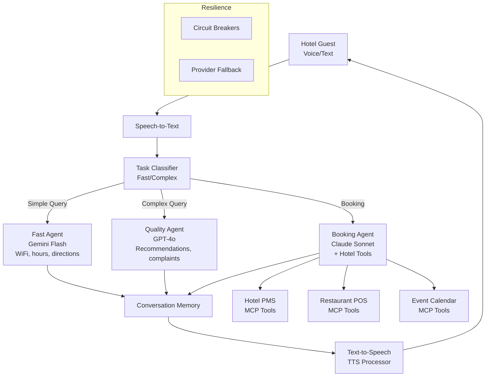

In this guide, you will build a voice-first hotel concierge that uses multi-provider routing to handle guest requests. You will implement speech-to-text input, natural language understanding for hotel services, text-to-speech responses, and intelligent routing that selects the best AI model for each type of guest inquiry.

Building a concierge bot that meets these expectations requires more than a single LLM. Simple factual queries (WiFi password, checkout time) need fast, cheap responses. Complex requests (restaurant recommendations, complaint resolution) need sophisticated reasoning. And booking operations need tool access to interact with hotel systems. No single model excels at all three.

NeuroLink provides the building blocks for a production-grade concierge system: multi-provider routing that matches query complexity to the right model, tool calling for hotel Property Management System (PMS) and Point-of-Sale (POS) integration, conversation memory that maintains guest context across interactions, TTS processing for voice output, and circuit breakers that ensure 24/7 uptime.

In this guide, we build a voice-enabled concierge that routes by query complexity, integrates with hotel backend systems, and supports over 20 languages.

## Concierge Architecture

The architecture uses a task classifier to route each guest query to the most appropriate agent. This is not just about cost savings (though those are significant) -- it is about matching response quality to guest expectations.



The three-agent architecture breaks down as follows:

- **Fast Agent** (Gemini Flash): Handles factual queries that need no reasoning -- WiFi passwords, pool hours, directions to the gym, shuttle schedules. Response time target: under 500ms for cached/simple queries, under 2 seconds for first token via streaming.

> **Note:** LLM API calls typically take 800ms--4000ms for full responses, even for simple queries. The "under 100ms" latency sometimes cited refers only to local processing and routing decisions, not the full LLM round-trip. Use streaming to achieve sub-2-second time-to-first-token, and consider caching frequent factual queries (WiFi passwords, checkout times) for true sub-100ms responses.
{: .prompt-info }

- **Quality Agent** (GPT-4o): Handles queries that require nuance -- restaurant recommendations based on dietary restrictions, resolving complaints, planning itineraries. Response time target: under 2 seconds.
- **Booking Agent** (Claude Sonnet + Tools): Handles transactional requests that interact with hotel systems -- making reservations, ordering room service, scheduling housekeeping, checking billing.

## Multi-Provider Setup with Task-Based Routing

The routing system uses NeuroLink's task classification patterns to determine which agent handles each query:

```typescript
import { AIProviderFactory, ModelConfigurationManager } from '@juspay/neurolink';
import { FAST_PATTERNS, REASONING_PATTERNS } from '@juspay/neurolink';

const modelConfig = ModelConfigurationManager.getInstance();

// Fast agent for simple queries (< 2s first-token via streaming)
const fastAgent = await AIProviderFactory.createProvider(
  "google-ai",
  modelConfig.getModelForTier("google-ai", "fast") // gemini-2.5-flash
);

// Quality agent for complex requests
const qualityAgent = await AIProviderFactory.createProvider(
  "openai",
  modelConfig.getModelForTier("openai", "quality") // gpt-4o
);

// Booking agent with tool support
const bookingAgent = await AIProviderFactory.createProvider(
  "bedrock",
  modelConfig.getModelForTier("bedrock", "balanced") // claude-3-sonnet
);

// Route based on query classification
function classifyQuery(text: string): "fast" | "quality" | "booking" {
  const bookingKeywords = /\b(book|reserve|order|schedule|cancel)\b/i;
  if (bookingKeywords.test(text)) return "booking";

  for (const pattern of REASONING_PATTERNS) {
    if (pattern.test(text)) return "quality";
  }

  for (const pattern of FAST_PATTERNS) {
    if (pattern.test(text)) return "fast";
  }

  return "quality"; // Default to quality for safety
}
```

The `FAST_PATTERNS` from NeuroLink's task classification config match simple queries like "What is the WiFi password?" or "Show me the pool hours." The `REASONING_PATTERNS` match queries requiring analysis, such as "Can you recommend a restaurant for someone with gluten allergies?" or "I have a problem with my room."

The cost impact is substantial. Simple queries processed by Gemini Flash cost approximately $0.000075 per 1K tokens, while complex queries on GPT-4o cost $0.0006 per 1K tokens -- an 8x difference. Since 60-70% of hotel queries are simple factual lookups, task-based routing can cut AI costs by 40-50%.

> **Note:** The classification defaults to "quality" when uncertain. For a guest-facing service, it is always better to over-deliver on response quality than to give a shallow answer to a complex question.
{: .prompt-info }

## Hotel System Integration via MCP Tools

The booking agent needs access to hotel backend systems. NeuroLink's MCP (Model Context Protocol) registry provides a clean abstraction for connecting to Property Management Systems, Point-of-Sale systems, and event calendars:

```typescript
import { MCPRegistry } from '@juspay/neurolink';
import { tool } from "ai";
import { z } from "zod";

const hotelRegistry = new MCPRegistry();

// Register hotel PMS tools
await hotelRegistry.registerServer("hotel-pms", {
  description: "Hotel Property Management System",
  tools: {
    getRoomStatus: {},
    requestRoomService: {},
    checkGuestBilling: {},
    requestHousekeeping: {},
    reportMaintenance: {},
  },
});

// Register restaurant tools
await hotelRegistry.registerServer("restaurant-pos", {
  description: "Restaurant reservation and ordering",
  tools: {
    checkAvailability: {},
    makeReservation: {},
    getMenu: {},
    placeOrder: {},
  },
});
```

For the booking agent, direct tool definitions provide type-safe parameter schemas with Zod validation:

```typescript
// Direct tool definitions for booking agent
const makeReservation = tool({
  description: "Make a restaurant reservation at the hotel",
  parameters: z.object({
    guestName: z.string(),
    restaurant: z.string(),
    date: z.string(),
    time: z.string(),
    partySize: z.number(),
    specialRequests: z.string().optional(),
  }),
  execute: async ({ guestName, restaurant, date, time, partySize, specialRequests }) => {
    const availability = await checkRestaurantAvailability(restaurant, date, time, partySize);
    if (!availability.available) {
      return {
        success: false,
        message: `Sorry, ${restaurant} is fully booked at ${time}. Available slots: ${availability.alternatives.join(", ")}`,
      };
    }
    const reservation = await createReservation(guestName, restaurant, date, time, partySize, specialRequests);
    return { success: true, confirmationNumber: reservation.id, details: reservation };
  },
});
```

The MCP registry allows you to discover available services with `listServers()` and enumerate their tools with `listTools()`. This is particularly useful in hotel chains where different properties may have different PMS vendors -- the concierge code stays the same, only the tool implementations change.

## Conversation Memory for Guest Context

A hotel concierge that forgets what a guest said two minutes ago is useless. NeuroLink's conversation memory system maintains context across interactions, including guest preferences, room information, and ongoing requests:

```typescript
// Guest context persists across interactions
process.env.NEUROLINK_MEMORY_ENABLED = "true";
process.env.NEUROLINK_MEMORY_MAX_SESSIONS = "5000"; // Per hotel
process.env.NEUROLINK_SUMMARIZATION_ENABLED = "true";
process.env.NEUROLINK_TOKEN_THRESHOLD = "50000";

// Guest-specific system prompt
const guestSystemPrompt = `You are a hotel concierge at ${hotelName}.
Guest: ${guestName}, Room: ${roomNumber}, VIP Level: ${vipLevel}.
Preferences: ${guestPreferences}.
Check-in: ${checkInDate}, Check-out: ${checkOutDate}.
You are continuing an ongoing conversation. The previous messages
contain important context including names, preferences shared by the user,
projects, tasks, and topics discussed previously.`;
```

The memory system includes several features critical for hospitality:

- **Session persistence**: Guest preferences persist across sessions. A returning guest who mentioned a shellfish allergy during their last stay gets that context automatically.
- **Token-aware summarization**: When conversation history approaches the context limit (`MEMORY_THRESHOLD_PERCENTAGE = 0.8`), older messages are automatically summarized to make room for new ones.
- **Recent message priority**: `RECENT_MESSAGES_RATIO = 0.3` keeps the most recent requests in full detail while summarizing older interactions. This ensures the concierge always remembers what the guest just asked, even in long conversations.

## TTS for Voice Output

Voice output requires matching the guest's language and adjusting speech parameters for natural delivery:

```typescript
// Multi-language voice support
const voiceConfig = {
  en: { voice: "en-US-Neural2-J", speed: 1.0 },
  es: { voice: "es-ES-Neural2-A", speed: 0.95 },
  ja: { voice: "ja-JP-Neural2-B", speed: 0.9 },
  zh: { voice: "cmn-CN-Neural2-A", speed: 0.9 },
};

// Detect guest language from STT output and respond in same language
const guestLanguage = detectLanguage(transcribedText);
const response = await selectedAgent.generate({
  input: { text: `Respond in ${guestLanguage}: ${transcribedText}` },
});
```

The voice speed adjustments per language are intentional. Japanese and Chinese responses at full speed can feel rushed and unnatural, while slightly slower delivery (0.9x) produces a more polished, professional impression.

NeuroLink's TTS processor handles the conversion from text to speech audio, with support for Neural2 voices that produce natural-sounding output across more than 20 languages.

## 24/7 Availability with Circuit Breakers

For a guest-facing service, downtime is not an option. A guest standing at the front desk at 2 AM expecting an AI concierge response cannot wait for a provider to recover. NeuroLink's circuit breaker system ensures continuous availability:

```typescript
import { CircuitBreakerManager } from '@juspay/neurolink';
import { withRetry, GracefulShutdown } from '@juspay/neurolink';

const cbManager = new CircuitBreakerManager();

const vertexBreaker = cbManager.getBreaker("vertex-concierge", {
  failureThreshold: 3,
  resetTimeout: 15000, // Fast reset for guest-facing service
  operationTimeout: 10000, // 10s max for voice response
});

// Fallback chain: Vertex -> OpenAI -> Bedrock -> static responses
async function getConciergeResponse(query: string) {
  const providers = [
    { agent: fastAgent, breaker: vertexBreaker },
    { agent: qualityAgent, breaker: cbManager.getBreaker("openai-concierge") },
    { agent: bookingAgent, breaker: cbManager.getBreaker("bedrock-concierge") },
  ];

  for (const { agent, breaker } of providers) {
    try {
      return await breaker.execute(() =>
        withRetry(() => agent.generate({ input: { text: query } }), {
          maxAttempts: 2,
          initialDelay: 500,
        })
      );
    } catch { continue; }
  }

  return { content: "I'll connect you with our front desk team right away." };
}
```

Key design decisions for hospitality:

- **Fast reset times** (15 seconds): Hotels cannot wait minutes for a circuit breaker to reset. A 15-second reset means the system quickly recovers from transient provider issues.
- **Short operation timeout** (10 seconds): Voice interactions have strict latency requirements. A response that takes longer than 10 seconds feels broken to a guest.
- **Graceful final fallback**: When all AI providers are down, the system offers to connect the guest with a human staff member rather than returning an error message.

## Monitoring and Guest Satisfaction

Operational visibility is critical for a 24/7 service. The circuit breaker manager provides real-time health data:

```typescript
const health = cbManager.getHealthSummary();
// Track: openBreakers, closedBreakers, halfOpenBreakers, unhealthyBreakers

// Evaluation for guest satisfaction scoring
const satisfaction = await generateEvaluation({
  userQuery: guestRequest,
  aiResponse: conciergeResponse,
  primaryDomain: "hospitality",
});
```

The health summary tracks which circuit breakers are open (failing), closed (healthy), half-open (testing recovery), and unhealthy (degraded performance). This data feeds into hotel operations dashboards, alerting duty managers when the AI concierge needs attention.

Guest satisfaction evaluation uses NeuroLink's evaluation framework with a hospitality-specific domain. This scores each interaction on accuracy, helpfulness, and tone -- the same dimensions hotel chains use for human concierge performance reviews.

## Deployment Considerations

When deploying a voice-first concierge in a hotel environment, consider these operational factors:

**Network resilience**: Hotel WiFi infrastructure can be unreliable. Design the system to handle intermittent connectivity with request queuing and offline fallbacks for common queries (WiFi password, checkout time).

**Multi-property management**: In a hotel chain, each property has different restaurants, amenities, and policies. Use property-specific system prompts and MCP tool configurations while sharing the core concierge logic.

**Compliance**: Guest conversations may contain personal information (room numbers, credit card references, medical needs). Ensure your conversation memory storage meets local data protection requirements, especially GDPR for European properties.

**Staff override**: Hotel management should be able to disable the AI concierge instantly during emergencies or special events. Implement a kill switch that routes all queries to human staff.

## What's Next

You have completed all the steps in this guide. To continue building on what you have learned:

1. Review the code examples and adapt them for your specific use case
2. Start with the simplest pattern first and add complexity as your requirements grow
3. Monitor performance metrics to validate that each change improves your system
4. Consult the NeuroLink documentation for advanced configuration options

---

**Related posts:**

- [Speech-to-Text and Text-to-Speech with NeuroLink](/posts/speech-to-text-neurolink/)
- [Text-to-Speech Integration: Build Voice-Enabled AI Apps with NeuroLink](/posts/tts-integration-guide/)
- [AI Content Localization: Dubbing, Subtitling, and Video Generation](/posts/ai-content-localization-media/)
