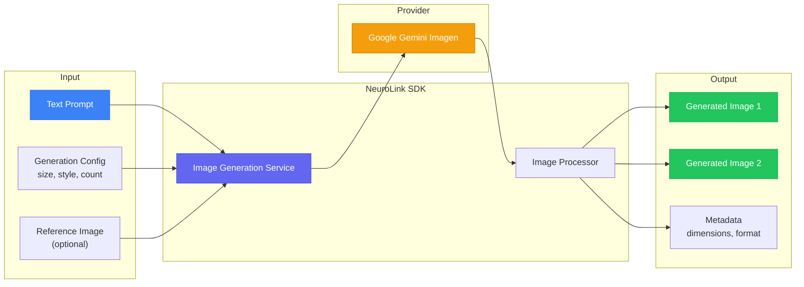

In this guide, you will generate images using NeuroLink's integration with Gemini Imagen and other image generation providers. You will configure image generation parameters, implement prompt engineering for visual content, handle different output formats, and build a batch image generation pipeline.

NeuroLink provides a unified image generation API that lets you generate images from text prompts with the same SDK and patterns you use for text generation. Currently backed by Google Gemini's Imagen models, the API handles prompt-to-image generation, output format handling (base64 and URLs), and integration with your existing TypeScript codebase. The result is a single `generate()` call that produces publication-ready images.

In this tutorial, you will learn how to generate images with various configurations, engineer effective prompts, build a production image pipeline that combines LLM-powered prompt optimization with image generation, and handle errors and safety filters gracefully.

## Architecture Overview

The image generation pipeline follows a straightforward flow from input to output, with NeuroLink handling the provider communication and response processing:



You provide a text prompt, optional configuration, and an optional reference image. NeuroLink routes the request to the Gemini Imagen model via the Vertex AI provider, processes the response, and returns the generated images as base64-encoded data or URLs along with metadata.

## Basic Image Generation

Generating an image requires a single `generate()` call with an image-capable model:

```typescript
import { NeuroLink } from '@juspay/neurolink';

const neurolink = new NeuroLink();

// Generate an image from a text prompt using generate() with an image-capable model
const result = await neurolink.generate({
  input: { text: 'A modern minimalist office workspace with a MacBook, coffee cup, and plant, soft natural lighting, photography style' },
  provider: 'vertex',
  model: 'gemini-2.5-flash-image',
});

// Result contains generated image in imageOutput
if (result.imageOutput?.base64) {
  const fs = await import('fs/promises');
  await fs.writeFile('generated-workspace.png', Buffer.from(result.imageOutput.base64, 'base64'));
  console.log('Image saved');
}
if (result.imageOutput?.url) {
  console.log('Image URL:', result.imageOutput.url);
}
```

The response includes `imageOutput` with either a `base64` field (for direct binary access) or a `url` field (for CDN-hosted results), depending on the provider configuration.

> **Note:** Image generation uses the `vertex` provider with an image-capable model like `gemini-2.5-flash-image`. The same `generate()` method handles both text and image generation -- the model determines the output type.
{: .prompt-info }

## Configuration Options

### Image Size and Aspect Ratio

Control the output dimensions by including size directives in your prompt:

```typescript
// Square image (1:1) -- use generate() with image-capable model
const square = await neurolink.generate({
  input: { text: 'Product icon for a meditation app' },
  provider: 'vertex',
  model: 'gemini-2.5-flash-image',
});

// Landscape (16:9) for blog headers
const landscape = await neurolink.generate({
  input: { text: 'Abstract technology background with flowing data streams, landscape 16:9 format' },
  provider: 'vertex',
  model: 'gemini-2.5-flash-image',
});

// Portrait (9:16) for mobile content
const portrait = await neurolink.generate({
  input: { text: 'Smartphone app mockup showing a fitness dashboard, portrait 9:16 format' },
  provider: 'vertex',
  model: 'gemini-2.5-flash-image',
});
```

### Generating Multiple Variations

When you need several options to choose from, generate variations by making multiple `generate()` calls with slightly different prompts:

```typescript
// Generate variations by making multiple generate() calls
const prompts = [
  'Company logo: abstract neural network symbol, blue and purple gradient, flat design, variation 1',
  'Company logo: abstract neural network symbol, blue and purple gradient, flat design, variation 2',
  'Company logo: abstract neural network symbol, blue and purple gradient, flat design, variation 3',
  'Company logo: abstract neural network symbol, blue and purple gradient, flat design, variation 4',
];

const variations = await Promise.all(
  prompts.map(prompt =>
    neurolink.generate({
      input: { text: prompt },
      provider: 'vertex',
      model: 'gemini-2.5-flash-image',
    })
  )
);

// Save all variations
for (let i = 0; i < variations.length; i++) {
  if (variations[i].imageOutput?.base64) {
    const fs = await import('fs/promises');
    await fs.writeFile(
      `logo-variation-${i + 1}.png`,
      Buffer.from(variations[i].imageOutput.base64, 'base64')
    );
  }
}
```

### Negative Prompts and Style Control

Guide the model away from unwanted styles by including negative directives in your prompt:

```typescript
const result = await neurolink.generate({
  input: { text: 'Professional headshot of a business executive, natural lighting, neutral background. Avoid: cartoon, anime, illustration, low quality, blurry, distorted' },
  provider: 'vertex',
  model: 'gemini-2.5-flash-image',
});
```

The "Avoid:" prefix works as a negative prompt, telling the model what visual characteristics to exclude from the generated image.

## Prompt Engineering for Image Generation

The quality of generated images depends heavily on prompt quality. Here are the techniques that produce the best results:

| Technique | Example | Effect |
|-----------|---------|--------|
| Be specific about style | "watercolor painting style" | Controls artistic style |
| Specify lighting | "soft natural window lighting" | Controls mood and atmosphere |
| Define composition | "close-up, centered, shallow depth of field" | Controls framing and focus |
| Include context | "in a modern office setting" | Grounds the scene |
| Use negative prompts | "Avoid: blurry, low quality" | Prevents unwanted artifacts |
| Reference art styles | "in the style of flat vector illustration" | Matches brand aesthetic |

### Prompt Structure Formula

A well-structured image prompt follows this pattern:

**[Subject] + [Style] + [Lighting] + [Composition] + [Setting] + [Quality modifiers]**

For example: "A software engineer working at a standing desk (subject), photorealistic style (style), warm afternoon sunlight from a window (lighting), medium shot from the side (composition), in a modern tech office with plants (setting), high detail, 4K quality (quality)."

This structured approach produces significantly more consistent and predictable results than vague prompts like "person working at computer."

## Building an Image Generation Pipeline

The most powerful pattern combines LLM-powered prompt optimization with image generation. The LLM generates an optimized, detailed prompt from a high-level description, and then that prompt drives the image generation:

```typescript
import { NeuroLink } from '@juspay/neurolink';

const neurolink = new NeuroLink();

interface BlogPost {
  title: string;
  summary: string;
  style: 'photography' | 'illustration' | 'abstract';
}

async function generateBlogIllustration(post: BlogPost): Promise<Buffer> {
  // Step 1: Use LLM to create an optimized image prompt from the blog post
  const promptResult = await neurolink.generate({
    input: { text: `Create a detailed image generation prompt for a blog post illustration.
Blog title: ${post.title}
Summary: ${post.summary}
Style: ${post.style}
The prompt should be vivid, specific, and optimized for AI image generation.
Return ONLY the image prompt, nothing else.` },
    provider: 'openai',
    model: 'gpt-4o',
    temperature: 0.7,
  });

  // Step 2: Generate the image using generate() with image-capable model
  const imageResult = await neurolink.generate({
    input: { text: promptResult.content },
    provider: 'vertex',
    model: 'gemini-2.5-flash-image',
  });

  if (!imageResult.imageOutput?.base64) {
    throw new Error('No image generated');
  }
  return Buffer.from(imageResult.imageOutput.base64, 'base64');
}

// Usage
const illustration = await generateBlogIllustration({
  title: 'The Future of Multi-Agent AI Systems',
  summary: 'How networks of specialized AI agents will transform enterprise software',
  style: 'abstract',
});
```

This two-stage pipeline consistently produces better images than direct prompts because the LLM expands vague descriptions into detailed, visually specific prompts that the image model can execute precisely.


## Image Editing and Inpainting

Beyond generating images from scratch, image-capable models support several editing workflows:

- **Reference-guided generation**: Provide an existing image as a reference alongside your text prompt to guide the style or composition of the generated image.
- **Inpainting**: Modify specific regions of an existing image while preserving the rest. Useful for product mockups where you want to change the background or replace a logo.
- **Style transfer**: Apply the visual style of one image to the content of another. This helps maintain brand consistency across a series of images.
- **Upscaling**: Enhance the resolution of a generated image for print-quality output.

These workflows use the same `generate()` method with additional input images and descriptive prompts that guide the editing operation.

## Error Handling and Safety

Image generation APIs include content safety filters that reject prompts violating usage policies. Your code should handle these rejections gracefully:

```typescript
try {
  const result = await neurolink.generate({
    input: { text: userProvidedPrompt },
    provider: 'vertex',
    model: 'gemini-2.5-flash-image',
  });
  return result.imageOutput;
} catch (error) {
  if (error.message?.includes('safety') || error.message?.includes('policy')) {
    return { error: 'The requested image could not be generated due to content policy. Please revise your prompt.' };
  }
  throw error;
}
```

### Rate Limiting

Image generation endpoints typically have stricter rate limits than text generation. For batch operations, use concurrency control with `p-limit` to stay within provider limits:

```typescript
import pLimit from 'p-limit';

const limit = pLimit(3); // Max 3 concurrent image generations

const images = await Promise.all(
  prompts.map(prompt =>
    limit(() => neurolink.generate({
      input: { text: prompt },
      provider: 'vertex',
      model: 'gemini-2.5-flash-image',
    }))
  )
);
```

### Retry Patterns

Transient failures (network timeouts, temporary service issues) should be retried with exponential backoff. Permanent failures (safety rejections, invalid prompts) should not:

```typescript
async function generateWithRetry(prompt: string, maxRetries = 3): Promise<Buffer> {
  for (let attempt = 1; attempt <= maxRetries; attempt++) {
    try {
      const result = await neurolink.generate({
        input: { text: prompt },
        provider: 'vertex',
        model: 'gemini-2.5-flash-image',
      });
      if (result.imageOutput?.base64) {
        return Buffer.from(result.imageOutput.base64, 'base64');
      }
      throw new Error('No image in response');
    } catch (error) {
      // Do not retry safety/policy rejections
      if (error.message?.includes('safety') || error.message?.includes('policy')) {
        throw error;
      }
      if (attempt === maxRetries) throw error;
      await new Promise(r => setTimeout(r, 1000 * Math.pow(2, attempt - 1)));
    }
  }
  throw new Error('Max retries exceeded');
}
```

## Cost Management

Image generation is more expensive than text generation. Here are strategies to control costs:

- **Generate fewer variations**: Instead of generating 10 options and picking the best, use the LLM prompt optimization pipeline to get a better prompt, then generate 2-3 targeted variations.
- **Use smaller sizes for previews**: Generate low-resolution previews for review, then regenerate the approved design at full resolution.
- **Cache generated images**: Store generated images by prompt hash. If the same prompt is requested again, serve the cached version.
- **Set budget limits**: Track generation count and cost per user or session. Reject requests that exceed the budget.
- **Batch efficiently**: Schedule non-urgent image generation for off-peak hours when rate limits are less contended.

## Production Integration Patterns

For production deployments, consider these integration patterns:

- **CDN delivery**: Upload generated images to object storage (S3, GCS) and serve through a CDN for fast global delivery.
- **Background job queues**: Use Bull or BullMQ to queue image generation jobs, especially for batch operations that can tolerate latency.
- **Webhook notifications**: For longer-running batch operations, notify the requester via webhook when all images are ready.
- **Thumbnail generation**: Generate multiple sizes from each image for gallery views, social media cards, and responsive layouts.

## What's Next

You have completed all the steps in this guide. To continue building on what you have learned:

1. Review the code examples and adapt them for your specific use case
2. Start with the simplest pattern first and add complexity as your requirements grow
3. Monitor performance metrics to validate that each change improves your system
4. Consult the NeuroLink documentation for advanced configuration options

---

**Related posts:**

- [Multimodal Document Processing with NeuroLink](/posts/multimodal-document-processing/)
- [Text-to-Speech Integration: Build Voice-Enabled AI Apps with NeuroLink](/posts/tts-integration-guide/)
- [Building a Legal Document Analysis System with NeuroLink](/posts/legal-document-analysis-guide/)
