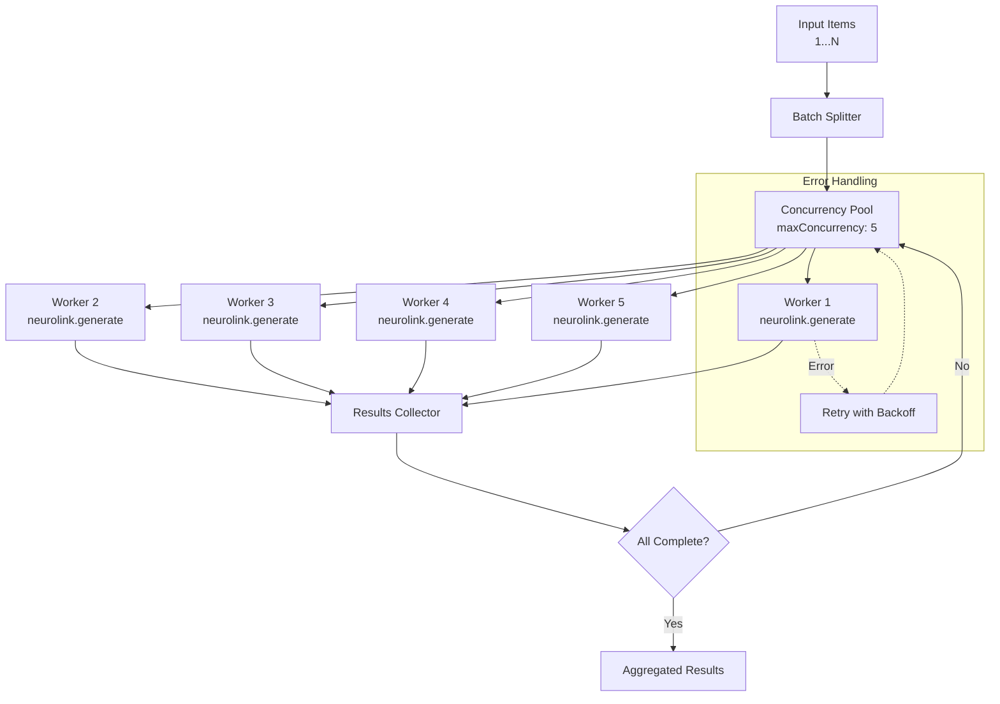

In this guide, you will process thousands of AI requests efficiently using NeuroLink's batch processing patterns. You will implement concurrency-controlled batch execution, progress tracking, error recovery with checkpointing, and cost-optimized model selection for high-volume workloads.

The naive approach -- processing items sequentially -- is painfully slow. A batch of 1,000 items at 2 seconds per request takes over 30 minutes. But the opposite extreme -- launching all 1,000 requests simultaneously -- overwhelms rate limits and produces a cascade of 429 errors.

The solution is controlled concurrency: processing multiple requests in parallel while respecting provider rate limits and isolating errors so a single failure does not bring down the entire batch. NeuroLink's architecture supports this through the `maxConcurrency` configuration in `PerformanceConfig` and the `p-limit` pattern used internally for operations like concurrent image generation.

In this tutorial, you will learn how to build batch processing pipelines that handle thousands of items efficiently, with retry logic, progress tracking, and structured output support.

## Concurrency Architecture

The batch processing pipeline splits input items across a fixed-size concurrency pool, processes them in parallel, and collects results with error isolation:



The key components:

- **Concurrency pool**: `p-limit` controls how many requests run simultaneously. NeuroLink's `PerformanceConfig.maxConcurrency` defaults to 5, but this is tunable based on your provider's rate limits.
- **Error isolation**: Each item is processed independently. A failure on item 47 does not affect items 48 through 1,000.
- **Circuit breaker**: The circuit breaker pattern prevents cascading failures. After a configurable number of consecutive failures, it stops sending requests to a failing provider.
- **Retry handler**: Exponential backoff with configurable `maxAttempts`, `baseDelayMs`, and `maxDelayMs` handles transient failures.


## Basic Batch Pattern

The simplest batch pattern uses `p-limit` for concurrency control with per-item error isolation:

```typescript
import { NeuroLink } from '@juspay/neurolink';
import pLimit from "p-limit";

const neurolink = new NeuroLink();
const limit = pLimit(5); // 5 concurrent requests

const items = [
  "Summarize this article about climate change...",
  "Extract key entities from this legal document...",
  "Translate this marketing copy to Spanish...",
  // ... hundreds more
];

// Process with controlled concurrency
const results = await Promise.all(
  items.map((text, index) =>
    limit(async () => {
      try {
        const result = await neurolink.generate({
          input: { text },
          provider: "google-ai",
          model: "gemini-2.5-flash", // Fast model for batch
          temperature: 0.3, // Lower temperature for consistency
          maxTokens: 500,
        });
        return { index, success: true, content: result.content };
      } catch (error) {
        return { index, success: false, error: (error as Error).message };
      }
    })
  )
);

// Aggregate results
const successful = results.filter((r) => r.success);
const failed = results.filter((r) => !r.success);
console.log(`Completed: ${successful.length}/${results.length}`);
console.log(`Failed: ${failed.length}`);
```

A few important details:

- **Model choice**: Use `gemini-2.5-flash` or `gpt-4o-mini` for batch workloads. These models are 5-10x cheaper than their full-size counterparts and fast enough for most extraction and classification tasks.
- **Temperature**: Set `temperature` to 0.1-0.3 for batch processing. You want consistent, reproducible results across items, not creative variation.
- **maxTokens**: Cap the output length to the minimum required. This reduces cost and prevents the occasional item that triggers a lengthy response from slowing down the batch.
- **Error wrapping**: Each item is wrapped in a try/catch so failures return error objects rather than throwing exceptions that would reject the entire `Promise.all`.

> **Note:** The `p-limit` library is the same concurrency control mechanism NeuroLink uses internally for operations like concurrent image generation in the PPT module. It is battle-tested and lightweight.
{: .prompt-info }


## Advanced: Batch with Retry and Progress

Production batch processing needs retry logic for transient failures and progress tracking for monitoring:

```typescript
import { NeuroLink } from '@juspay/neurolink';
import pLimit from "p-limit";

const neurolink = new NeuroLink();

interface BatchItem {
  id: string;
  text: string;
}

interface BatchResult {
  id: string;
  success: boolean;
  content?: string;
  attempts: number;
  error?: string;
}

async function processBatch(
  items: BatchItem[],
  options: {
    concurrency?: number;
    maxRetries?: number;
    retryDelayMs?: number;
    onProgress?: (completed: number, total: number) => void;
  } = {}
): Promise<BatchResult[]> {
  const {
    concurrency = 5,
    maxRetries = 3,
    retryDelayMs = 1000,
    onProgress,
  } = options;

  const limit = pLimit(concurrency);
  let completed = 0;

  const processItem = async (item: BatchItem): Promise<BatchResult> => {
    for (let attempt = 1; attempt <= maxRetries; attempt++) {
      try {
        const result = await neurolink.generate({
          input: { text: item.text },
          provider: "google-ai",
          model: "gemini-2.5-flash",
          timeout: 30000,
        });

        completed++;
        onProgress?.(completed, items.length);

        return {
          id: item.id,
          success: true,
          content: result.content,
          attempts: attempt,
        };
      } catch (error) {
        if (attempt < maxRetries) {
          // Exponential backoff
          await new Promise((r) =>
            setTimeout(r, retryDelayMs * Math.pow(2, attempt - 1))
          );
          continue;
        }
        completed++;
        onProgress?.(completed, items.length);
        return {
          id: item.id,
          success: false,
          attempts: attempt,
          error: (error as Error).message,
        };
      }
    }
    // Unreachable but satisfies TypeScript
    return { id: item.id, success: false, attempts: maxRetries };
  };

  return Promise.all(
    items.map((item) => limit(() => processItem(item)))
  );
}

// Usage
const results = await processBatch(myItems, {
  concurrency: 10,
  maxRetries: 3,
  onProgress: (done, total) => {
    console.log(`Progress: ${done}/${total} (${Math.round(done/total*100)}%)`);
  },
});
```

The retry logic uses exponential backoff: the first retry waits 1 second, the second waits 2 seconds, the third waits 4 seconds. This gives the provider time to recover from transient issues like rate limiting or temporary service degradation.

The progress callback lets you build real-time monitoring dashboards, log files, or progress bars. In a web application, you could push progress updates to the client via WebSocket or Server-Sent Events.

## Structured Output Batching

When you need consistent, machine-readable output from every batch item, combine batch processing with Zod schemas for structured output:

```typescript
import { z } from "zod";

const SentimentSchema = z.object({
  sentiment: z.enum(["positive", "negative", "neutral"]),
  confidence: z.number().min(0).max(1),
  keywords: z.array(z.string()),
});

// Batch sentiment analysis with structured output
const reviews = ["Great product!", "Terrible service.", "It was okay."];

const sentiments = await Promise.all(
  reviews.map((review) =>
    limit(async () => {
      const result = await neurolink.generate({
        input: { text: `Analyze the sentiment: "${review}"` },
        provider: "google-ai",
        schema: SentimentSchema,
        disableTools: true, // Required for Google with schemas
      });
      return JSON.parse(result.content);
    })
  )
);
```

Structured output ensures every response in your batch follows the same schema. Without it, you might get "The sentiment is positive" from one item and `{"sentiment": "positive", "score": 0.95}` from another. The Zod schema enforces consistency, and validation catches any malformed responses immediately rather than corrupting downstream data.

> **Note:** When using structured output with Google AI provider, set `disableTools: true` to ensure the schema constraint is applied correctly. This is a provider-specific requirement.
{: .prompt-info }

## Cost and Performance Optimization

Batch processing cost scales linearly with item count, so model selection has an outsized impact on total spend:

| Model | Speed | Cost per 1K items | Best For |
|---|---|---|---|
| gemini-2.5-flash | Fast | $ | Simple extraction, classification |
| gpt-4o-mini | Fast | $ | General batch processing |
| gemini-2.5-pro | Medium | $$ | Complex analysis |
| gpt-4o | Medium | $$$ | High-quality generation |
| claude-sonnet-4-20250514 | Medium | $$$ | Nuanced content |

### Optimization Strategies

**Use the cheapest model that meets quality**: Run a sample batch (50-100 items) through multiple models. If `gemini-2.5-flash` produces acceptable results for your use case, there is no reason to pay 10x more for `gpt-4o`.

**Minimize output tokens**: Set `maxTokens` to the minimum needed. A classification task that returns "positive," "negative," or "neutral" does not need a 500-token budget.

**Enable analytics middleware**: Track token usage per batch to identify items that consume disproportionate tokens. These outliers often indicate prompts that need refinement.

**Use timeouts**: Set `timeout` on each request to prevent hung connections from blocking a concurrency slot for minutes. A 30-second timeout is generous for most batch tasks.

**Tune concurrency by provider**: Different providers have different rate limits. OpenAI might tolerate 20 concurrent requests while a Vertex AI endpoint is limited to 5. Start conservative and increase until you see 429 errors, then back off by 20%.

## Error Patterns and Resilience

### Rate Limiting

When you hit rate limits, the provider returns 429 errors. Reduce concurrency or add delays between requests:

```typescript
// Adaptive concurrency: reduce when hitting rate limits
let currentConcurrency = 10;

function handleRateLimitError() {
  currentConcurrency = Math.max(1, Math.floor(currentConcurrency * 0.5));
  console.log(`Rate limited. Reducing concurrency to ${currentConcurrency}`);
}
```

### Circuit Breaker

For long-running batches, a circuit breaker prevents wasting time and money on a provider that is down:

```typescript
// Stop sending requests after N consecutive failures
let consecutiveFailures = 0;
const FAILURE_THRESHOLD = 5;

async function processWithCircuitBreaker(item: BatchItem): Promise<BatchResult> {
  if (consecutiveFailures >= FAILURE_THRESHOLD) {
    return { id: item.id, success: false, attempts: 0, error: "Circuit breaker open" };
  }

  try {
    const result = await neurolink.generate({
      input: { text: item.text },
      provider: "google-ai",
      model: "gemini-2.5-flash",
    });
    consecutiveFailures = 0; // Reset on success
    return { id: item.id, success: true, content: result.content, attempts: 1 };
  } catch (error) {
    consecutiveFailures++;
    return { id: item.id, success: false, attempts: 1, error: (error as Error).message };
  }
}
```

### Dead Letter Queue

Collect failed items for later reprocessing:

```typescript
const deadLetterQueue: BatchItem[] = [];

// After batch completes
const failedResults = results.filter(r => !r.success);
const failedItems = failedResults.map(r =>
  items.find(item => item.id === r.id)!
);
deadLetterQueue.push(...failedItems);

// Reprocess dead letter queue later (perhaps with different provider)
if (deadLetterQueue.length > 0) {
  console.log(`${deadLetterQueue.length} items in dead letter queue for reprocessing`);
  const retryResults = await processBatch(deadLetterQueue, {
    concurrency: 3, // Lower concurrency for retry
    maxRetries: 5,   // More retries
  });
}
```

### Provider Fallback

NeuroLink's `FallbackConfig` enables automatic provider switching when the primary provider fails. For batch workloads, this means a Vertex AI outage automatically reroutes to OpenAI without manual intervention.

## What's Next

You have completed all the steps in this guide. To continue building on what you have learned:

1. Review the code examples and adapt them for your specific use case
2. Start with the simplest pattern first and add complexity as your requirements grow
3. Monitor performance metrics to validate that each change improves your system
4. Consult the NeuroLink documentation for advanced configuration options

---

**Related posts:**

- [Voice-First Hotel Concierge with Multi-Provider Routing](/posts/voice-first-hotel-concierge/)
- [Performance Benchmarking Guide for NeuroLink](/posts/performance-benchmarks/)
- [Structured Output: JSON Schema Enforcement with NeuroLink](/posts/structured-output-json/)
