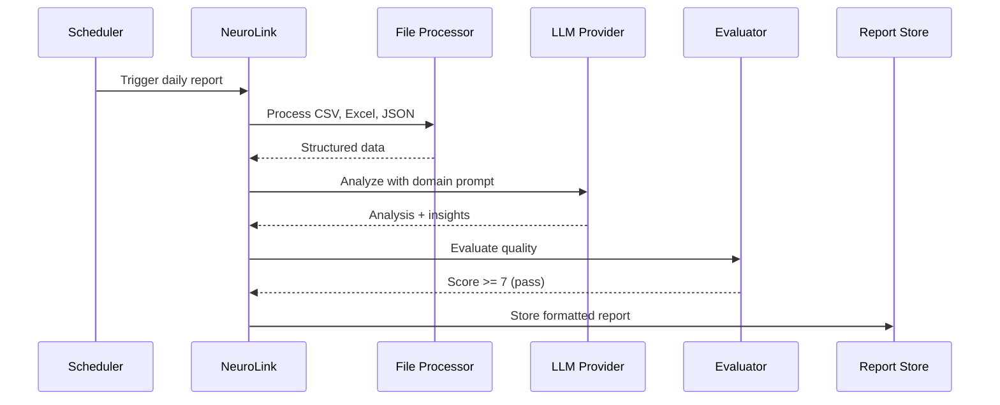

In this guide, you will build an automated business intelligence pipeline that transforms raw data into formatted reports using NeuroLink. You will implement data ingestion, AI-powered analysis, chart generation, and report assembly -- turning CSV files and database queries into executive-ready summaries with a single API call.

NeuroLink provides the building blocks for an end-to-end AI-powered BI pipeline: file processors for ingesting CSV, JSON, Excel, and other tabular formats; RAG chunking for datasets too large for a single context window; LLM generation with domain-specific prompts for analysis; auto-evaluation for report quality assurance; and streaming output for real-time dashboards.

This tutorial walks through building a complete BI pipeline from scratch. By the end, you will have a system that takes raw data files, runs them through AI analysis, and produces quality-evaluated reports -- on a schedule, without human intervention.

## Architecture: AI-Powered BI Pipeline

The pipeline moves data through five stages: ingest, chunk, analyze, evaluate, and output.


Each stage is independent and testable. You can swap the file processor for a different data source, change the LLM provider, or adjust evaluation thresholds without touching the rest of the pipeline.

## Step 1: Ingesting Data with File Processors

NeuroLink's `ProcessorRegistry` handles over 50 file types out of the box. For BI pipelines, the key formats are CSV, Excel, JSON, and XML. The registry automatically selects the right processor based on the file's MIME type.

```typescript
import { getProcessorRegistry } from '@juspay/neurolink';

const registry = getProcessorRegistry();

// Process CSV sales data
const salesData = await registry.processFile({
  id: 'sales-q4',
  name: 'q4-sales.csv',
  mimetype: 'text/csv',
  size: 250000,
  content: csvBuffer,
});

// Process Excel financial report
const financialData = await registry.processFile({
  id: 'financials',
  name: 'annual-financials.xlsx',
  mimetype: 'application/vnd.openxmlformats-officedocument.spreadsheetml.sheet',
  size: 1500000,
  content: excelBuffer,
});

// Process JSON API response
const apiData = await registry.processFile({
  id: 'metrics',
  name: 'metrics.json',
  mimetype: 'application/json',
  size: 80000,
  content: jsonBuffer,
});
```

The processor extracts structured data from each file format and normalizes it into a consistent representation. CSV files become row-column arrays, Excel files are parsed sheet by sheet, and JSON data is traversed and flattened as needed.

> **Note:** For large Excel files with multiple sheets, the processor handles each sheet independently. You can target specific sheets by name or index if you only need a subset of the data.
{: .prompt-info }

### Supported Data Formats

| Format | MIME Type | Best For |
|---|---|---|
| CSV | `text/csv` | Sales data, logs, exports |
| Excel (.xlsx) | `application/vnd.openxmlformats-officedocument.spreadsheetml.sheet` | Financial reports, multi-sheet data |
| JSON | `application/json` | API responses, configuration data |
| XML | `application/xml` | Legacy system exports, feeds |
| TSV | `text/tab-separated-values` | Database exports, research data |

## Step 2: Chunking Large Datasets with RAG

When a dataset exceeds the LLM's context window, you need to split it into manageable chunks. NeuroLink's RAG chunking system handles this with configurable strategies.

```typescript
// For datasets too large for a single LLM context window
// neurolink rag chunk sales-data.csv --strategy recursive --maxSize 2000

import { ChunkerRegistry } from '@juspay/neurolink';

const chunker = ChunkerRegistry.get('recursive');
const chunks = await chunker.chunk(salesDataContent, {
  maxSize: 2000,
  overlap: 200,
  metadata: { source: 'q4-sales.csv', type: 'sales-data' },
});

console.log(`Split into ${chunks.length} chunks for analysis`);
```

The `overlap` parameter ensures that data points near chunk boundaries are not lost. For tabular data, set the overlap to include at least one complete row to avoid splitting a data record across chunks.

### Chunking Strategy Selection

Different data types benefit from different chunking strategies:

- **Recursive**: Best for structured text with natural breakpoints (headers, sections). Use for report documents.
- **Character**: Simple fixed-size chunks. Use for unstructured text.
- **Sentence**: Splits on sentence boundaries. Use for narrative content.
- **Token**: Splits based on token count. Use when you need precise token budget control.

For tabular data like CSV, the recursive strategy with row-aware splitting works best. Set `maxSize` to fit comfortably within your model's context window, leaving room for the system prompt and analysis instructions.

## Step 3: LLM Analysis with Domain Prompts

The analysis step is where AI adds the most value. A well-crafted domain prompt transforms raw numbers into actionable insights.

```typescript
import { NeuroLink } from '@juspay/neurolink';

const neurolink = new NeuroLink();

const analysisResult = await neurolink.generate({
  input: { text: `Analyze this sales data and identify key trends, anomalies, and actionable insights:\n\n${salesData?.data?.content}` },
  provider: 'anthropic',
  model: 'claude-sonnet-4-5-20250929',
  systemPrompt: `You are a senior business analyst. When analyzing data:
1. Identify the top 3 trends with supporting data points
2. Flag any anomalies or outliers
3. Provide actionable recommendations
4. Use specific numbers and percentages
5. Format output as a structured report with sections`,
});
```

The system prompt is critical for analysis quality. Here are domain-specific prompts for common BI scenarios:

### Sales Analysis Prompt

```typescript
const salesAnalysisPrompt = `You are a senior sales analyst. Analyze the provided data and produce:

## Revenue Analysis
- Total revenue and month-over-month growth
- Top performing products/categories
- Revenue concentration risk (% from top 10 customers)

## Trend Identification
- Seasonal patterns
- Growth/decline trajectories
- Leading indicators

## Anomaly Detection
- Unusual spikes or drops (>2 standard deviations)
- Missing data periods
- Data quality issues

## Recommendations
- 3 specific, actionable recommendations
- Each with expected impact and implementation priority

Use specific numbers. Never say "significant increase" -- say "23% increase from $1.2M to $1.5M".`;
```

### Financial Analysis Prompt

```typescript
const financialAnalysisPrompt = `You are a CFO-level financial analyst. Analyze the provided data and produce:

## Financial Health
- Key ratios: current ratio, debt-to-equity, profit margins
- Cash flow analysis
- Working capital position

## Variance Analysis
- Budget vs actual for each line item
- Material variances (>5%) with root cause analysis

## Risk Assessment
- Concentration risks
- Trend-based projections
- Downside scenarios

Format as a board-ready executive summary. Lead with the conclusion, then support with data.`;
```

### Multi-Chunk Analysis

For datasets split across multiple chunks, analyze each chunk independently and then synthesize:

```typescript
async function analyzeMultiChunk(chunks: string[]): Promise<string> {
  // Step 1: Analyze each chunk independently
  const chunkAnalyses = await Promise.all(
    chunks.map((chunk, i) =>
      neurolink.generate({
        input: { text: `Analyze this data segment (${i + 1} of ${chunks.length}):\n\n${chunk}` },
        provider: 'anthropic',
        model: 'claude-sonnet-4-5-20250929',
        systemPrompt: 'You are a data analyst. Identify key metrics, trends, and anomalies in this data segment.',
      })
    )
  );

  // Step 2: Synthesize chunk analyses into a unified report
  const synthesis = await neurolink.generate({
    input: { text: `Synthesize these analyses into a single comprehensive report:\n\n${chunkAnalyses.map((a, i) => `--- Segment ${i + 1} ---\n${a.content}`).join('\n\n')}` },
    provider: 'anthropic',
    model: 'claude-sonnet-4-5-20250929',
    systemPrompt: `You are a senior business analyst. Combine segment analyses into a unified report.
Resolve any contradictions between segments. Identify cross-segment trends.
Produce a single, coherent executive summary.`,
  });

  return synthesis.content;
}
```

## Step 4: Quality Evaluation

AI-generated reports must meet quality standards before distribution. NeuroLink's auto-evaluation middleware scores reports on relevance, accuracy, and completeness.

```typescript
// Enable auto-evaluation to ensure report quality
const neurolink = new NeuroLink();

// Auto-evaluation middleware is configured separately through the MiddlewareFactory:
const evalMiddleware = new MiddlewareFactory({
  middlewareConfig: {
    autoEvaluation: {
      enabled: true,
      config: {
        threshold: 7,
        blocking: true,
      },
    },
  },
});

// The evaluation checks:
// - relevanceScore: Does the report address the data?
// - accuracyScore: Are the numbers and claims correct?
// - completenessScore: Does it cover all key aspects?
// - finalScore: Overall quality (0-10)
```

> **Note:** For financial reports, set the threshold to 8 or higher. Inaccurate financial data can have serious business consequences. For internal dashboards, a threshold of 6-7 is usually sufficient.
{: .prompt-warning }

### Domain-Specific Evaluation Criteria

NeuroLink supports domain-specific evaluation criteria. For analytics, the default criteria are:

- **Accuracy**: Are the numbers correct? Are calculations verifiable?
- **Relevance**: Does the analysis address the business questions?
- **Completeness**: Are all key metrics and dimensions covered?
- **Insight quality**: Are the insights actionable and specific?

For financial reports, you might add:

- **Risk awareness**: Does the report identify potential risks?
- **Compliance**: Does it follow regulatory reporting standards?
- **Timeliness**: Is the data current and the analysis timely?

## Step 5: Streaming Output for Real-Time Dashboards

For dashboards that need to display AI insights as they are generated, use NeuroLink's streaming API:

```typescript
const result = await neurolink.stream({
  input: { text: `Generate a real-time executive summary from: ${latestMetrics}` },
  provider: 'openai',
  model: 'gpt-4o',
});

for await (const chunk of result.stream) {
  if ('content' in chunk) {
    // Push to dashboard websocket
    dashboardSocket.send(chunk.content);
  }
}
```

Streaming is particularly valuable for long-form reports. Instead of waiting 30-60 seconds for a complete analysis, the dashboard can start rendering the executive summary within 1-2 seconds and progressively reveal details as they are generated.

### WebSocket Integration

```typescript
import { WebSocketServer } from 'ws';

const wss = new WebSocketServer({ port: 8080 });

wss.on('connection', (ws) => {
  ws.on('message', async (message) => {
    const { query, dataSource } = JSON.parse(message.toString());

    const data = await loadDataSource(dataSource);
    const result = await neurolink.stream({
      input: { text: `${query}\n\nData:\n${data}` },
      provider: 'openai',
      model: 'gpt-4o',
      systemPrompt: salesAnalysisPrompt,
    });

    for await (const chunk of result.stream) {
      if ('content' in chunk) {
        ws.send(JSON.stringify({ type: 'analysis', content: chunk.content }));
      }
    }

    ws.send(JSON.stringify({ type: 'complete' }));
  });
});
```

## Data Processing Sequence

Here is the full sequence for a scheduled daily report:



## Multi-Source Report Aggregation

Production BI pipelines often combine data from multiple sources. Here is a pattern for ingesting and aggregating multiple data files into a single report:

```typescript
async function generateAggregatedReport(
  dataSources: Array<{ id: string; name: string; buffer: Buffer; mimetype: string }>
): Promise<string> {
  const registry = getProcessorRegistry();

  // Process all data sources in parallel
  const processedData = await Promise.all(
    dataSources.map(source =>
      registry.processFile({
        id: source.id,
        name: source.name,
        mimetype: source.mimetype,
        size: source.buffer.length,
        content: source.buffer,
      })
    )
  );

  // Combine processed data with source labels
  const combinedContext = processedData
    .map((data, i) => `### Source: ${dataSources[i].name}\n${data?.data?.content}`)
    .join('\n\n---\n\n');

  // Generate unified analysis
  const report = await neurolink.generate({
    input: { text: `Analyze the following data from multiple sources and produce a unified report:\n\n${combinedContext}` },
    provider: 'anthropic',
    model: 'claude-sonnet-4-5-20250929',
    systemPrompt: `You are a senior business analyst working with multiple data sources.
Cross-reference data across sources for consistency.
Identify correlations between different datasets.
Produce a unified report with cross-source insights.`,
  });

  return report.content;
}
```

## Template-Based Report Generation

For recurring reports with a consistent structure, use templates with placeholder injection:



```typescript
const reportTemplate = `

## Executive Summary
{{executiveSummary}}

## Key Metrics
{{keyMetrics}}

## Trend Analysis
{{trendAnalysis}}

## Anomalies & Risks
{{anomalies}}

## Recommendations
{{recommendations}}

---
Generated by NeuroLink AI Pipeline | Data as of {{dataDate}}
`;


async function generateTemplatedReport(data: string, template: string): Promise<string> {
  // Generate each section independently for better quality
  const sections = ['executiveSummary', 'keyMetrics', 'trendAnalysis', 'anomalies', 'recommendations'];

  const sectionResults: Record<string, string> = {};

  for (const section of sections) {
    const result = await neurolink.generate({
      input: { text: `Generate the "${section}" section for a business report based on this data:\n\n${data}` },
      provider: 'anthropic',
      model: 'claude-sonnet-4-5-20250929',
      systemPrompt: `Generate only the "${section}" section. Be specific with numbers. Use bullet points for clarity.`,
    });
    sectionResults[section] = result.content;
  }

  // Fill template
  let report = template;
  
  report = report.replace('{{reportTitle}}', 'Q4 Business Review');
  report = report.replace('{{reportDate}}', new Date().toISOString().split('T')[0]);
  report = report.replace('{{dataDate}}', new Date().toISOString().split('T')[0]);

  for (const [key, value] of Object.entries(sectionResults)) {
    report = report.replace(`{{${key}}}`, value);
  }
  

  return report;
}
```

## Production Pipeline Considerations

### Scheduling

Use cron jobs or a queue system to trigger reports on a schedule:

```bash
# Daily report at 6 AM
0 6 * * * node /app/scripts/generate-daily-report.js

# Weekly summary every Monday at 8 AM
0 8 * * 1 node /app/scripts/generate-weekly-summary.js

# Monthly executive report on the 1st at 7 AM
0 7 1 * * node /app/scripts/generate-monthly-report.js
```

### Versioning Reports

Store reports with timestamps and metadata for audit trails:

```typescript
interface StoredReport {
  id: string;
  generatedAt: string;
  dataSourceVersions: Record<string, string>;
  model: string;
  evaluationScore: number;
  content: string;
}
```

### Cost Management

For recurring daily reports, monitor your monthly AI spend:

| Report Type | Frequency | Est. Tokens/Report | Monthly Cost |
|---|---|---|---|
| Daily Dashboard | 30x | 5K | ~$4.50 |
| Weekly Summary | 4x | 15K | ~$1.80 |
| Monthly Executive | 1x | 30K | ~$0.90 |
| Ad-Hoc Analysis | ~20x | 10K | ~$6.00 |
| **Total** | | | **~$13.20/month** |

## What's Next

You have completed all the steps in this guide. To continue building on what you have learned:

1. Review the code examples and adapt them for your specific use case
2. Start with the simplest pattern first and add complexity as your requirements grow
3. Monitor performance metrics to validate that each change improves your system
4. Consult the NeuroLink documentation for advanced configuration options

---

**Related posts:**

- [Structured Output: JSON Schema Enforcement with NeuroLink](/posts/structured-output-json/)
- [Batch Processing: Thousands of AI Responses Efficiently](/posts/batch-processing/)
- [AI Streaming in React: Server-Sent Events and WebSockets](/posts/ai-streaming-react-sse-websockets/)
