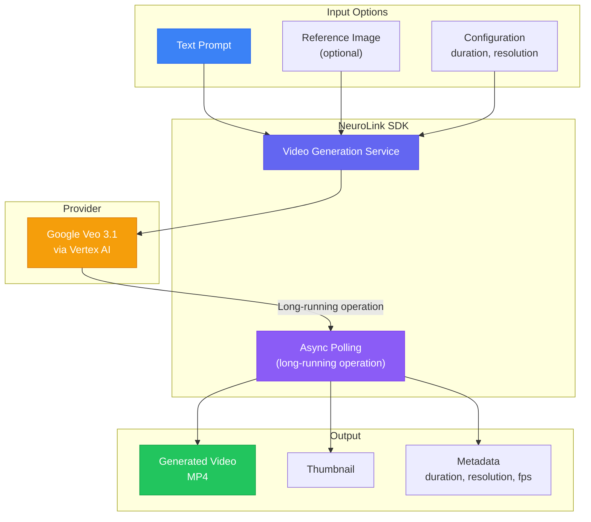

> **Warning:** The video generation APIs shown in this post are based on preview/early-access documentation and may change before general availability. Verify current API availability and parameters with your provider's documentation.
{: .prompt-warning }

In this guide, you will generate videos using Veo 3.1 through NeuroLink's unified API. You will configure video generation parameters, implement prompt engineering for video content, handle asynchronous generation workflows, and build a pipeline that combines text generation with video synthesis.

Video generation is the newest frontier in generative AI, and the use cases are already tangible: product demos without hiring a videographer, marketing content without a production budget, social media clips without an editing suite, educational videos without a studio. The technology is still evolving, but for short-form content (3-8 seconds), the quality is production-ready.

In this tutorial, you will learn how to generate videos from text and reference images, configure duration and aspect ratio for different platforms, handle the asynchronous nature of video generation, and build a complete social media video pipeline.

## Architecture: How Video Generation Works

The critical difference between video generation and text or image generation is that video generation is inherently asynchronous. Generating a 5-second video clip can take anywhere from 30 seconds to several minutes, depending on the complexity of the prompt, the duration, and the resolution.



NeuroLink handles the polling internally. When you call `generate()` with a video output mode, the SDK submits the generation request to Veo 3.1 via Vertex AI, then polls for completion, and returns the finished video once it is ready. Your code awaits a single promise -- the async complexity is hidden.

## Basic Video Generation

Generating a video uses the same `generate()` method with the output mode set to `"video"`:

```typescript
import { NeuroLink } from '@juspay/neurolink';

const neurolink = new NeuroLink();

// Generate a video from a text prompt using generate() with video output mode
const result = await neurolink.generate({
  input: { text: 'A serene mountain lake at sunrise, mist rising from the water, cinematic quality, slow camera pan' },
  provider: 'vertex',
  model: 'veo-3.1',
  output: {
    mode: 'video',
    video: {
      aspectRatio: '16:9',
      durationSeconds: 5,
    },
  },
});

// Save the video
if (result.video) {
  const fs = await import('fs/promises');
  await fs.writeFile('mountain-lake.mp4', Buffer.from(result.video.data, 'base64'));

  console.log('Video generated:');
  console.log('  Duration:', result.video.duration, 'seconds');
  console.log('  Resolution:', result.video.resolution);
  console.log('  Format:', result.video.mimeType);
}
```

The result object includes a `video` property containing the video data as a base64-encoded string, the duration in seconds, the resolution, and the MIME type (typically `video/mp4`).

> **Note:** Video generation can take 30 seconds to several minutes depending on duration and complexity. Plan your application's UX accordingly -- display a loading state, use background job processing, or notify the user when the video is ready.
{: .prompt-info }

## Video Generation from Reference Images

One of the most powerful features is image-to-video generation. Provide a static image and describe how it should animate:

```typescript
// Generate video from a static image (image-to-video)
const fs = await import('fs/promises');
const referenceImage = await fs.readFile('product-photo.png');

const result = await neurolink.generate({
  input: {
    text: 'Slowly rotate the product 360 degrees with soft studio lighting, smooth animation',
    images: [referenceImage],
  },
  provider: 'vertex',
  model: 'veo-3.1',
  output: {
    mode: 'video',
    video: {
      aspectRatio: '1:1',
      durationSeconds: 4,
    },
  },
});

if (result.video) {
  await fs.writeFile('product-rotation.mp4', Buffer.from(result.video.data, 'base64'));
}
```

This is transformative for e-commerce: take your existing product photography and generate spinning product videos, lifestyle context videos, or animated feature highlights without a video production setup.

## Configuration Options

### Duration and Aspect Ratio

Different platforms and use cases demand different video specifications:

```typescript
// Short clip (2-4 seconds) - social media
const shortClip = await neurolink.generate({
  input: { text: 'Colorful abstract particles flowing and merging' },
  provider: 'vertex',
  model: 'veo-3.1',
  output: {
    mode: 'video',
    video: {
      aspectRatio: '9:16',  // Vertical for TikTok/Reels
      durationSeconds: 3,
    },
  },
});

// Longer clip (6-8 seconds) - product demo
const demoClip = await neurolink.generate({
  input: { text: 'Hands typing on a keyboard with code appearing on screen, professional office environment' },
  provider: 'vertex',
  model: 'veo-3.1',
  output: {
    mode: 'video',
    video: {
      aspectRatio: '16:9',
      durationSeconds: 8,
    },
  },
});
```

### Platform-Specific Aspect Ratios

Choose the right aspect ratio for your target platform:

| Aspect Ratio | Use Case | Platform |
|-------------|----------|----------|
| `16:9` | Landscape | YouTube, websites, presentations |
| `9:16` | Portrait | TikTok, Instagram Reels, YouTube Shorts |
| `1:1` | Square | Instagram feed, Twitter/X |
| `4:3` | Classic | Presentations, legacy displays |

## Prompt Engineering for Video

Video prompts differ from image prompts in one critical way: they need to describe **motion**. A static scene description produces a video that looks like a slowly shifting photograph. Effective video prompts include camera movements, subject motion, and temporal progression.

### Motion Descriptors

- **Camera movements**: "slow pan left," "zoom in," "tracking shot," "dolly forward," "aerial descent"
- **Subject motion**: "walking toward camera," "rotating slowly," "flowing liquid," "particles dispersing"
- **Temporal progression**: "starts with X, transitions to Y," "gradually shifts from morning to evening"

### Style and Quality Modifiers

- **Cinematic quality**: "cinematic, film grain, shallow depth of field"
- **Animated**: "3D animated, Pixar style, smooth motion"
- **Documentary**: "documentary style, handheld camera, natural lighting"
- **Abstract**: "abstract motion graphics, geometric shapes, smooth transitions"

### Example: A Well-Structured Video Prompt

```typescript
// Good prompt with motion, style, and camera direction
const result = await neurolink.generate({
  input: {
    text: `Cinematic aerial drone shot slowly descending over a futuristic city at sunset,
    neon lights beginning to glow on skyscrapers, flying cars in the distance,
    warm golden hour lighting transitioning to cool blue twilight, 4K quality`,
  },
  provider: 'vertex',
  model: 'veo-3.1',
  output: {
    mode: 'video',
    video: {
      aspectRatio: '16:9',
      durationSeconds: 6,
    },
  },
});
```

This prompt works well because it specifies: the camera movement (aerial descent), the subject (futuristic city), the timing (sunset transitioning to twilight), the lighting (golden hour to blue), and a quality modifier (4K). Each element gives Veo 3.1 clear guidance on what to generate.

> **Note:** Keep video duration between 3 and 8 seconds for the best quality. Longer durations increase generation time significantly and may produce less coherent motion in the later frames.
{: .prompt-info }

## Handling Async Generation

Since video generation is long-running, you need patterns for handling the wait time in your application:

```typescript
// Option 1: Await completion (blocks until done)
const result = await neurolink.generate({
  input: { text: 'Animated logo reveal with particle effects' },
  provider: 'vertex',
  model: 'veo-3.1',
  output: {
    mode: 'video',
    video: { durationSeconds: 3 },
  },
});

// Option 2: Fire and poll (for web applications)
async function generateVideoAsync(prompt: string): Promise<string> {
  // Start generation
  const operation = await neurolink.generate({
    input: { text: prompt },
    provider: 'vertex',
    model: 'veo-3.1',
    output: {
      mode: 'video',
      video: { durationSeconds: 5 },
    },
  });

  // In a web app, you might store the operation ID and
  // notify the user via webhook when complete
  return operation.video?.data ?? '';
}
```

For production web applications, the best pattern is to queue video generation as a background job:

1. Accept the generation request from the user and return immediately with a job ID.
2. Process the generation in a background worker (using Bull, BullMQ, or similar).
3. Store the completed video in object storage (S3, GCS).
4. Notify the user via WebSocket, Server-Sent Events, or email when the video is ready.

## Building a Video Content Pipeline

Here is a complete example that combines LLM-powered prompt optimization with platform-specific video generation:

```typescript
import { NeuroLink } from '@juspay/neurolink';

const neurolink = new NeuroLink();

interface VideoRequest {
  topic: string;
  platform: 'youtube' | 'tiktok' | 'instagram';
  style: 'cinematic' | 'animated' | 'minimalist';
}

const platformConfig = {
  youtube: { aspectRatio: '16:9', duration: 6 },
  tiktok: { aspectRatio: '9:16', duration: 4 },
  instagram: { aspectRatio: '1:1', duration: 5 },
};

async function generateSocialVideo(request: VideoRequest): Promise<Buffer> {
  const config = platformConfig[request.platform];

  // Step 1: Generate optimized video prompt using LLM
  const promptResult = await neurolink.generate({
    input: { text: `Create a detailed video generation prompt for social media content.
Topic: ${request.topic}
Platform: ${request.platform}
Style: ${request.style}
Duration: ${config.duration} seconds
Include camera movements, lighting, and pacing appropriate for the platform.
Return ONLY the video prompt.` },
    provider: 'openai',
    model: 'gpt-4o',
    temperature: 0.7,
  });

  // Step 2: Generate the video using generate() with video output mode
  const videoResult = await neurolink.generate({
    input: { text: promptResult.content },
    provider: 'vertex',
    model: 'veo-3.1',
    output: {
      mode: 'video',
      video: {
        aspectRatio: config.aspectRatio,
        durationSeconds: config.duration,
      },
    },
  });

  if (!videoResult.video?.data) {
    throw new Error('No video generated');
  }
  return Buffer.from(videoResult.video.data, 'base64');
}

// Usage
const video = await generateSocialVideo({
  topic: 'Launch of our new AI features',
  platform: 'tiktok',
  style: 'animated',
});
```



```mermaid
flowchart LR
    REQ["Content Brief"] --> LLM["LLM<br/>Optimize Prompt"]
    LLM --> VEO["Veo 3.1<br/>Generate Video"]
    VEO --> POST["Post-Process<br/>Transcode"]
    POST --> STORE["Object Storage"]
    STORE --> CDN["CDN Delivery"]
    CDN --> PLATFORMS["YouTube / TikTok / Instagram"]

    style REQ fill:#3b82f6,stroke:#2563eb,color:#fff
    style LLM fill:#6366f1,stroke:#4f46e5,color:#fff
    style VEO fill:#f59e0b,stroke:#d97706,color:#fff
    style POST fill:#10b981,stroke:#059669,color:#fff
    style STORE fill:#8b5cf6,stroke:#7c3aed,color:#fff
    style CDN fill:#22c55e,stroke:#16a34a,color:#fff
```

The two-stage pattern (LLM for prompt optimization, then Veo for generation) produces better videos because GPT-4o understands platform conventions and video composition in ways that improve the raw prompt significantly.

## Error Handling and Limitations

### Timeout Handling

Video generation can exceed default HTTP timeout values. Always set generous timeouts for video operations:

```typescript
try {
  const result = await neurolink.generate({
    input: { text: videoPrompt },
    provider: 'vertex',
    model: 'veo-3.1',
    output: {
      mode: 'video',
      video: { durationSeconds: 8 },
    },
    timeout: 300000, // 5 minutes
  });
} catch (error) {
  if (error.message?.includes('timeout')) {
    console.log('Video generation timed out. Try a shorter duration or simpler prompt.');
  }
}
```

### Content Safety

Video generation APIs include content safety filters similar to image generation. Prompts that violate usage policies are rejected. Handle these rejections gracefully with user-friendly messages rather than raw error dumps.

### Current Limitations

- **Maximum duration**: Current models handle 3-8 seconds reliably. Longer durations are possible but may produce less coherent motion.
- **Resolution**: Output resolution is determined by the model and aspect ratio. Full 4K output may not be available for all configurations.
- **Consistency**: Complex scenes with multiple moving subjects can produce inconsistent motion. Simpler scenes with fewer moving elements produce better results.
- **Generation time**: Longer durations and higher complexity increase wait times linearly.

### Cost Considerations

Video generation is significantly more expensive than image generation. A single 5-second video clip can cost 10-50x what a single image generation costs. Budget carefully and use these cost management strategies:

- Generate short clips (3-4 seconds) for social media where brevity is expected
- Use LLM prompt optimization to reduce the number of generation attempts
- Cache generated videos aggressively -- video content is rarely personalized
- Set per-user or per-project generation limits

## Production Considerations

### Job Queuing

For production deployments, never generate videos synchronously in request handlers. Use a job queue:

```typescript
import { Queue, Worker } from 'bullmq';

const videoQueue = new Queue('video-generation');

// API endpoint: queue the job
app.post('/api/generate-video', async (req, res) => {
  const job = await videoQueue.add('generate', {
    prompt: req.body.prompt,
    platform: req.body.platform,
    userId: req.user.id,
  });
  res.json({ jobId: job.id, status: 'queued' });
});

// Worker: process jobs in background
const worker = new Worker('video-generation', async (job) => {
  const video = await generateSocialVideo(job.data);
  await uploadToStorage(video, `videos/${job.id}.mp4`);
  await notifyUser(job.data.userId, job.id);
});
```

### Storage and Delivery

Generated videos should be stored in object storage (AWS S3, Google Cloud Storage) and served through a CDN. The base64-encoded video data from the API response is a transfer format, not a storage format -- decode it and store the raw MP4 file.

### Progress Notifications

Keep users informed during the generation process. WebSocket connections or Server-Sent Events can push status updates: "Queued," "Generating," "Processing," "Ready."

## What's Next

You have completed all the steps in this guide. To continue building on what you have learned:

1. Review the code examples and adapt them for your specific use case
2. Start with the simplest pattern first and add complexity as your requirements grow
3. Monitor performance metrics to validate that each change improves your system
4. Consult the NeuroLink documentation for advanced configuration options

---

**Related posts:**

- [Image Generation with NeuroLink: Gemini Imagen and Beyond](/posts/image-generation-neurolink/)
- [Multimodal Document Processing with NeuroLink](/posts/multimodal-document-processing/)
- [From Raw Data to Reports: Automating Business Intelligence with AI](/posts/raw-data-to-reports-automating-bi-with-ai/)
