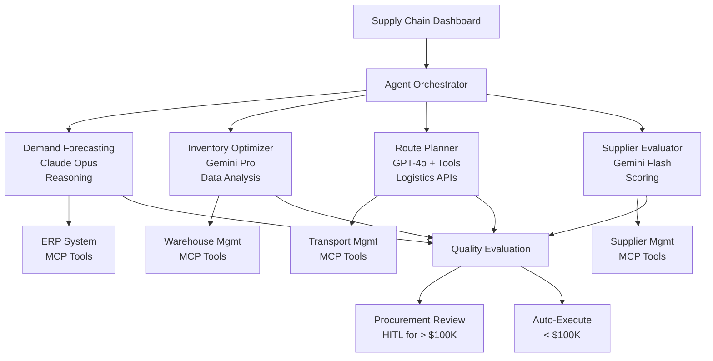

We designed a multi-agent supply chain orchestration system using NeuroLink to coordinate demand forecasting, inventory optimization, logistics routing, and supplier management through specialized AI agents. This deep dive examines the agent communication patterns, conflict resolution strategies, and the trade-offs between centralized and decentralized decision-making in logistics AI.

No single AI model excels at every supply chain task. Demand forecasting requires deep reasoning about trends and seasonality. Route optimization needs real-time tool access to logistics APIs. Inventory management demands data-heavy analysis across warehouse networks. Supplier evaluation needs rapid scoring at scale. Each task has a fundamentally different computational profile.

NeuroLink enables a multi-agent architecture where each supply chain function gets its own specialized agent, powered by the provider and model best suited for that function. Tool calling connects agents to ERP, WMS, and TMS systems. Evaluation scoring ensures forecast quality. Human-in-the-loop (HITL) controls protect high-value procurement decisions. Circuit breakers keep the entire system operational when individual components fail.

In this guide, we build a multi-agent supply chain platform with four specialized agents: demand forecasting, inventory optimization, route planning, and supplier evaluation.

## Supply Chain Agent Architecture

The architecture assigns each supply chain function to a specialized agent, with the orchestrator routing requests to the appropriate agent and evaluation gates ensuring quality:



The four agents and their model rationale:

- **Demand Forecasting** (Claude Opus): Trend analysis and seasonal pattern recognition demand the strongest reasoning capabilities. This is the one function where model quality directly impacts financial outcomes -- a bad forecast means either stockouts or excess inventory.

> **Note:** LLMs excel at interpreting and summarizing data, not at statistical time-series forecasting. For production demand planning, use dedicated forecasting models (ARIMA, Prophet, or ML-based models) and have the LLM agent orchestrate, interpret, and communicate their outputs rather than generating forecasts directly.
{: .prompt-info }

- **Inventory Optimization** (Gemini Pro): Cross-warehouse inventory analysis involves processing large data sets and producing actionable reorder recommendations. Gemini Pro's balanced profile handles data-heavy analysis efficiently.
- **Route Planning** (GPT-4o + Tools): Route optimization requires real-time interaction with logistics APIs to check carrier availability, calculate costs, and evaluate constraints. GPT-4o's strong tool-calling capabilities make it the right choice.
- **Supplier Evaluation** (Gemini Flash): Scoring hundreds of suppliers on delivery performance, quality metrics, and pricing requires speed over depth. Gemini Flash processes high volumes at minimal cost.

## Specialized Agent Configuration

Each agent is created with the appropriate provider and model tier:

```typescript
import { AIProviderFactory, ModelConfigurationManager } from '@juspay/neurolink';

const modelConfig = ModelConfigurationManager.getInstance();

// Demand forecasting - strongest reasoning for trend analysis
const demandAgent = await AIProviderFactory.createProvider(
  "bedrock",
  modelConfig.getModelForTier("bedrock", "quality") // claude-3-opus
);

// Inventory optimization - balanced for data processing
const inventoryAgent = await AIProviderFactory.createProvider(
  "vertex",
  modelConfig.getModelForTier("vertex", "balanced") // gemini-2.5-pro
);

// Route planning - quality model with tool support
const routeAgent = await AIProviderFactory.createProvider(
  "openai",
  modelConfig.getModelForTier("openai", "quality") // gpt-4o
);

// Supplier evaluation - fast model for high-volume scoring
const supplierAgent = await AIProviderFactory.createProvider(
  "google-ai",
  modelConfig.getModelForTier("google-ai", "fast") // gemini-2.5-flash
);

// Provider availability check
const availableProviders = modelConfig.getAvailableProviders();
// Returns ProviderConfiguration[] for providers with valid env vars
```

The `getModelForTier()` method selects the best model for a given provider and performance tier. The `getAvailableProviders()` method returns only providers with valid API keys configured, enabling dynamic agent configuration based on the deployment environment.

The cost implications are significant:

| Agent | Model | Cost per 1K tokens | Justification |
|---|---|---|---|
| Demand Forecasting | claude-3-opus | $0.0015 | Accuracy directly impacts P&L |
| Inventory Optimizer | gemini-2.5-pro | $0.0003 | Complex but routine analysis |
| Route Planner | gpt-4o | $0.0006 | Tool calling reliability critical |
| Supplier Evaluator | gemini-2.5-flash | $0.000075 | High volume, simple scoring |

> **Note:** Supplier scoring at Gemini Flash rates costs 20x less than demand forecasting with Claude Opus. This is the power of multi-agent architecture: each function runs on the most cost-effective model that meets its quality requirements.
{: .prompt-info }

## ERP/WMS/TMS Integration via MCP Tools

Supply chain agents need access to enterprise systems. NeuroLink's MCP (Model Context Protocol) registry provides a clean interface for connecting to these systems:

```typescript
import { MCPRegistry } from '@juspay/neurolink';
import { tool } from "ai";
import { z } from "zod";

const supplyChainRegistry = new MCPRegistry();

// Register ERP tools
await supplyChainRegistry.registerServer("erp-connector", {
  description: "ERP system for sales orders, forecasts, financials",
  tools: {
    getSalesHistory: {},
    getCurrentOrders: {},
    getFinancialData: {},
  },
});

// Register WMS tools
await supplyChainRegistry.registerServer("wms-connector", {
  description: "Warehouse Management System",
  tools: {
    getInventoryLevels: {},
    getStockMovements: {},
    checkReorderPoints: {},
  },
});

// Register TMS tools
await supplyChainRegistry.registerServer("tms-connector", {
  description: "Transportation Management System",
  tools: {
    getAvailableCarriers: {},
    calculateRoute: {},
    getShipmentTracking: {},
    bookShipment: {},
  },
});
```

For the route planning agent, direct tool definitions provide type-safe parameter schemas:

```typescript
// Direct tool definitions for route planning agent
const calculateRoute = tool({
  description: "Calculate optimal shipping route between locations",
  parameters: z.object({
    origin: z.string().describe("Origin warehouse or supplier location"),
    destination: z.string().describe("Destination warehouse or customer"),
    weight: z.number().describe("Shipment weight in kg"),
    priority: z.enum(["standard", "express", "overnight"]),
    constraints: z.object({
      maxCost: z.number().optional(),
      maxTransitDays: z.number().optional(),
      temperatureControlled: z.boolean().optional(),
    }).optional(),
  }),
  execute: async ({ origin, destination, weight, priority, constraints }) => {
    const routes = await tmsClient.calculateRoutes(origin, destination, weight, priority);
    const filtered = constraints
      ? routes.filter(r => (!constraints.maxCost || r.cost <= constraints.maxCost))
      : routes;
    return {
      bestRoute: filtered[0],
      alternatives: filtered.slice(1, 3),
      totalOptions: routes.length,
    };
  },
});
```

The MCP registry provides service discovery with `listServers()` (returning `["erp-connector", "wms-connector", "tms-connector"]`) and tool enumeration with `listTools()`. This is critical in enterprise environments where different facilities may run different ERP vendors.

## Evaluation for Forecast Quality

Demand forecasts drive purchasing decisions worth millions. Before acting on a forecast, evaluate its quality using NeuroLink's evaluation framework:

```typescript
import { generateEvaluation } from '@juspay/neurolink';

// Evaluate demand forecast quality
const forecastEval = await generateEvaluation({
  userQuery: `Generate demand forecast for ${productSKU} for next 12 weeks`,
  aiResponse: JSON.stringify(forecastResult),
  primaryDomain: "supply-chain",
  toolUsage: [
    { toolName: "getSalesHistory", result: salesData },
    { toolName: "getCurrentOrders", result: orderData },
  ],
  conversationHistory: [
    { role: "system", content: `Historical MAPE for this SKU: ${historicalMAPE}%` },
  ],
});

// Domain-specific scores
console.log(`Accuracy: ${forecastEval.accuracy}/10`);
console.log(`Completeness: ${forecastEval.completeness}/10`);
console.log(`Domain Alignment: ${forecastEval.domainAlignment}/10`);
console.log(`Tool Effectiveness: ${forecastEval.toolEffectiveness}/10`);

// Quality gate for procurement decisions
if (forecastEval.overall >= 7 && forecastEval.toolEffectiveness >= 6) {
  // Forecast quality sufficient for automated purchasing
  await triggerPurchaseOrders(forecastResult);
} else {
  // Flag for supply chain analyst review
  await escalateToAnalyst(forecastResult, forecastEval);
}
```

The evaluation framework provides several dimensions of assessment:

- **Accuracy**: Does the forecast align with historical patterns and current trends?
- **Completeness**: Does it cover all requested time periods and relevant factors?
- **Domain Alignment**: Does it use supply chain terminology and methodologies correctly?
- **Tool Effectiveness**: Did the agent make meaningful use of ERP data, or did it ignore the available data and generate a generic forecast?

Setting `primaryDomain: "supply-chain"` activates domain-specific scoring criteria including `domainAlignment` and `terminologyAccuracy`. This ensures the evaluation understands the difference between a good demand forecast and a good generic text response.

The quality gate pattern is critical: forecasts scoring below 7 overall or below 6 on tool effectiveness are automatically escalated to a human analyst. This prevents low-confidence AI forecasts from triggering automated purchase orders.

## HITL for High-Value Procurement

Some supply chain decisions are too consequential for full automation. NeuroLink's HITL (Human-in-the-Loop) manager enforces approval workflows for high-value actions:

```typescript
import { HITLManager } from '@juspay/neurolink';

const procurementHITL = new HITLManager({
  enabled: true,
  dangerousActions: [
    "place-purchase-order",
    "change-supplier",
    "expedite-shipment",
    "adjust-safety-stock",
  ],
  timeout: 86400000, // 24 hours for procurement review
  confirmationMethod: "event",
  allowArgumentModification: true,
  autoApproveOnTimeout: false,
  auditLogging: true,
  customRules: [
    {
      name: "high-value-purchase",
      requiresConfirmation: true,
      condition: (_toolName, args) => {
        const typedArgs = args as { totalCost?: number };
        return typedArgs?.totalCost !== undefined && typedArgs.totalCost > 100000;
      },
      customMessage: "Purchase order exceeds $100K. Procurement manager approval required.",
    },
    {
      name: "new-supplier",
      requiresConfirmation: true,
      condition: (toolName) => toolName === "change-supplier",
      customMessage: "Supplier change requires procurement review.",
    },
  ],
});
```

The HITL configuration implements two critical business rules:

1. **Dollar threshold**: Purchase orders under $100K can be auto-executed (after passing the evaluation quality gate). Orders above $100K require procurement manager approval within 24 hours.
2. **Supplier changes**: Any change to the supplier for a product line always requires human review, regardless of dollar amount. This protects against quality and compliance risks.

The `autoApproveOnTimeout: false` setting means that if no human responds within 24 hours, the action is rejected rather than approved. For procurement decisions, failing safely (doing nothing) is always better than auto-approving a $500K purchase order.

The `auditLogging: true` flag ensures every approval and rejection is logged for compliance. This audit trail is essential for ISO and SOX compliance in regulated supply chains.

> **Note:** The `allowArgumentModification: true` setting lets procurement managers adjust order quantities, delivery dates, or supplier selections before approving. This is more practical than a simple approve/reject binary.
{: .prompt-info }

## Resilience for Critical Supply Chain Operations

Supply chain operations often run 24/7 and cannot tolerate prolonged outages. Each backend system gets its own circuit breaker:

```typescript
import { CircuitBreakerManager, MCPCircuitBreaker } from '@juspay/neurolink';
import { withRetry, RateLimiter } from '@juspay/neurolink';

const cbManager = new CircuitBreakerManager();

// Per-system circuit breakers
const erpBreaker = cbManager.getBreaker("erp", {
  failureThreshold: 5,
  resetTimeout: 60000,
  operationTimeout: 30000,
});

const wmsBreaker = cbManager.getBreaker("wms", {
  failureThreshold: 3,
  resetTimeout: 30000,
});

// Rate limiter for ERP API (typically has strict limits)
const erpLimiter = new RateLimiter(10, 60000); // 10 queries/min

async function queryERP(query: string) {
  await erpLimiter.acquire();
  return erpBreaker.execute(() =>
    withRetry(
      () => supplyChainRegistry.executeTool("getSalesHistory", { query }),
      { maxAttempts: 3, initialDelay: 2000 }
    )
  );
}

// Health monitoring
const health = cbManager.getHealthSummary();
if (health.openBreakers > 0) {
  alertOps(`Supply chain systems degraded: ${health.unhealthyBreakers.join(", ")}`);
}
```

The resilience design has several layers:

- **Per-system circuit breakers**: ERP, WMS, and TMS each get independent circuit breakers. An ERP outage does not disable route planning.
- **Rate limiters**: Enterprise APIs (especially ERPs) often have strict rate limits. The `RateLimiter` prevents exceeding 10 queries per minute to the ERP, avoiding lockouts.
- **Retry with backoff**: Transient failures get 3 retry attempts with exponential backoff starting at 2 seconds.
- **Health monitoring**: `getHealthSummary()` provides real-time visibility into which systems are operational, degraded, or down. This feeds into operations dashboards.

## Middleware for Analytics and Cost Tracking

Tracking costs and performance across four agents and three backend systems requires systematic observability:

```typescript
import { MiddlewareFactory } from '@juspay/neurolink';

const scmMiddleware = new MiddlewareFactory({
  middlewareConfig: {
    analytics: {
      enabled: true,
      config: {
        trackTokenUsage: true,
        trackCost: true,
        trackLatency: true,
      },
    },
    guardrails: {
      enabled: true,
      config: {
        badWords: ["confidential-pricing", "competitor-data"],
      },
    },
  },
});

// Cost tracking per supply chain function
const demandCost = modelConfig.getCostInfo("bedrock", "anthropic.claude-3-opus-20240229-v1:0");
const supplierCost = modelConfig.getCostInfo("google-ai", "gemini-2.5-flash");
```

The analytics middleware tracks token usage, cost, and latency per agent type. This data answers critical questions: How much does demand forecasting cost per SKU? Is route planning latency acceptable for real-time shipment booking? Which agent consumes the most tokens?

The guardrails middleware prevents sensitive data leakage. Keywords like "confidential-pricing" and "competitor-data" are blocked from appearing in agent outputs, protecting proprietary supply chain information.

## Putting It All Together

Here is how the complete system processes a typical supply chain request:

1. **Dashboard request**: "Recommend reorder quantities for SKU-4521 for the next quarter."
2. **Orchestrator**: Routes to the demand forecasting agent (Claude Opus).
3. **Demand agent**: Calls `getSalesHistory` and `getCurrentOrders` via ERP tools, analyzes trends, produces a 12-week forecast.
4. **Evaluation**: Scores the forecast at 8.2/10 overall, 7.5/10 tool effectiveness. Passes the quality gate.
5. **Inventory agent**: Uses the forecast to calculate optimal reorder quantities and safety stock levels across warehouses.
6. **HITL check**: Total procurement value is $180K (above $100K threshold). Paused for procurement manager approval.
7. **Route planning**: Once approved, the route agent calculates optimal shipping routes and books carriers via TMS.
8. **Supplier evaluation**: In parallel, the supplier agent scores the current supplier's recent performance against alternatives.

Each step is protected by circuit breakers, logged by analytics middleware, and auditable through HITL records.

## What's Next

The architecture decisions we have described represent trade-offs that worked for our scale and constraints. The key engineering insights to take away: start with the simplest design that handles your current load, instrument everything so you can identify bottlenecks before they become outages, and resist premature abstraction until you have at least three concrete use cases demanding it. The implementation details will differ for your system, but the underlying constraints -- latency budgets, failure domains, resource contention -- are universal.

---

**Related posts:**

- [Building AI Agents with NeuroLink: From Chatbot to Autonomous System](/posts/building-ai-agents/)
- [How to Build a Multi-Provider AI Agent in TypeScript (Step-by-Step)](/posts/multi-provider-ai-agent-typescript/)
- [AI-Powered Claims Processing: Multi-Agent Workflows for Insurance](/posts/ai-claims-processing-insurance/)
