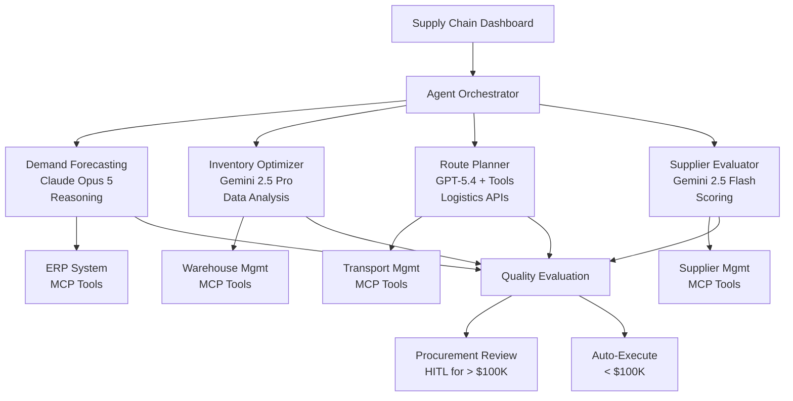

This guide designs a hypothetical multi-agent supply chain system using NeuroLink to coordinate demand forecasting, inventory optimization, logistics routing, and supplier management. It focuses on agent boundaries, tool access, evaluation, and human approval for consequential actions.

No single AI model excels at every supply chain task. Demand forecasting requires deep reasoning about trends and seasonality. Route optimization needs real-time tool access to logistics APIs. Inventory management demands data-heavy analysis across warehouse networks. Supplier evaluation needs rapid scoring at scale. Each task has a fundamentally different computational profile.

NeuroLink enables a multi-agent architecture where each supply chain function gets its own specialized agent, powered by the provider and model best suited for that function. Tool calling connects agents to ERP, WMS, and TMS systems. Evaluation scoring ensures forecast quality. Human-in-the-loop (HITL) controls protect high-value procurement decisions. Circuit breakers keep the entire system operational when individual components fail.

In this guide, we build a multi-agent supply chain platform with four specialized agents: demand forecasting, inventory optimization, route planning, and supplier evaluation.

## Supply Chain Agent Architecture

The architecture assigns each supply chain function to a specialized agent, with the orchestrator routing requests to the appropriate agent and evaluation gates ensuring quality:


```mermaid
flowchart TB
    Dashboard[Supply Chain Dashboard] --> Orchestrator[Agent Orchestrator]

    Orchestrator --> Demand[Demand Forecasting<br/>Claude Opus 5<br/>Reasoning]
    Orchestrator --> Inventory[Inventory Optimizer<br/>Gemini 2.5 Pro<br/>Data Analysis]
    Orchestrator --> Route[Route Planner<br/>GPT-5.4 + Tools<br/>Logistics APIs]
    Orchestrator --> Supplier[Supplier Evaluator<br/>Gemini 2.5 Flash<br/>Scoring]

    Demand --> ERP[ERP System<br/>MCP Tools]
    Inventory --> WMS[Warehouse Mgmt<br/>MCP Tools]
    Route --> TMS[Transport Mgmt<br/>MCP Tools]
    Supplier --> SRM[Supplier Mgmt<br/>MCP Tools]

    Demand --> Eval[Quality Evaluation]
    Inventory --> Eval
    Route --> Eval
    Supplier --> Eval

    Eval --> HITL[Procurement Review<br/>HITL for > $100K]
    Eval --> Auto[Auto-Execute<br/>< $100K]
```

The four agents and their model rationale:

- **Demand Forecasting** (Claude Opus 5): Use a capable reasoning model to interpret statistical forecasts, trends, and seasonal context. Model selection can affect recommendations, but the numerical forecast should come from a dedicated forecasting method.

> **Note:** LLMs excel at interpreting and summarizing data, not at statistical time-series forecasting. For production demand planning, use dedicated forecasting models (ARIMA, Prophet, or ML-based models) and have the LLM agent orchestrate, interpret, and communicate their outputs rather than generating forecasts directly.
{: .prompt-info }

- **Inventory Optimization** (Gemini 2.5 Pro): Cross-warehouse inventory analysis involves processing large data sets and producing actionable reorder recommendations.
- **Route Planning** (GPT-5.4 + Tools): Route optimization requires real-time interaction with logistics APIs to check carrier availability, calculate costs, and evaluate constraints.
- **Supplier Evaluation** (Gemini 2.5 Flash): Repeated structured scoring benefits from a faster model, with validation before results affect procurement.

## Specialized Agent Configuration

Use one `NeuroLink` instance and select the provider and model for each request. This keeps credentials and operational policy centralized while preserving task-specific routing:

```typescript
import { NeuroLink } from "@juspay/neurolink";

const neurolink = new NeuroLink({
  credentials: {
    anthropic: { apiKey: process.env.ANTHROPIC_API_KEY },
    openai: { apiKey: process.env.OPENAI_API_KEY },
    googleAiStudio: { apiKey: process.env.GOOGLE_AI_API_KEY },
  },
});

const agents = {
  demand: { provider: "anthropic", model: "claude-opus-5" },
  inventory: { provider: "google-ai", model: "gemini-2.5-pro" },
  route: { provider: "openai", model: "gpt-5.4" },
  supplier: { provider: "google-ai", model: "gemini-2.5-flash" },
} as const;

async function runAgent(agent: keyof typeof agents, text: string) {
  return neurolink.generate({
    input: { text },
    ...agents[agent],
  });
}
```

Treat the model table as a starting policy, not a benchmark. Validate quality, latency, availability, and current provider pricing with representative workloads before deploying it.

## ERP/WMS/TMS Integration via MCP Tools

Supply chain agents need access to enterprise systems. NeuroLink can connect to standards-compliant MCP servers configured through the CLI:

```bash
neurolink mcp add erp-connector node --args ./servers/erp.js
neurolink mcp add wms-connector node --args ./servers/wms.js
neurolink mcp add tms-connector node --args ./servers/tms.js
neurolink mcp list --status
```

Those commands register executable MCP servers; each server remains responsible for publishing its own tool schemas. For an application-local integration, pass a direct typed tool to `generate()`:

```typescript
// Direct tool definitions for route planning agent
const calculateRoute = tool({
  description: "Calculate optimal shipping route between locations",
  parameters: z.object({
    origin: z.string().describe("Origin warehouse or supplier location"),
    destination: z.string().describe("Destination warehouse or customer"),
    weight: z.number().describe("Shipment weight in kg"),
    priority: z.enum(["standard", "express", "overnight"]),
    constraints: z.object({
      maxCost: z.number().optional(),
      maxTransitDays: z.number().optional(),
      temperatureControlled: z.boolean().optional(),
    }).optional(),
  }),
  execute: async ({ origin, destination, weight, priority, constraints }) => {
    const routes = await tmsClient.calculateRoutes(origin, destination, weight, priority);
    const filtered = constraints
      ? routes.filter(r => (!constraints.maxCost || r.cost <= constraints.maxCost))
      : routes;
    return {
      bestRoute: filtered[0],
      alternatives: filtered.slice(1, 3),
      totalOptions: routes.length,
    };
  },
});
```

Run `neurolink mcp list --status` to inspect configured server connectivity. Keep tool names and schemas stable across ERP vendors so the orchestration layer does not depend on a facility-specific backend.

## Evaluation for Forecast Quality

Demand forecasts drive purchasing decisions worth millions. Before acting on a forecast, evaluate its quality using NeuroLink's evaluation framework:

```typescript
import { NeuroLink } from "@juspay/neurolink";

const neurolink = new NeuroLink();
const forecastEval = await neurolink.evaluate(
  {
    query: `Interpret the 12-week forecast for ${productSKU}`,
    response: JSON.stringify(forecastResult),
    context: [
      JSON.stringify(salesData),
      JSON.stringify(orderData),
      `Historical MAPE: ${historicalMAPE}%`,
    ],
  },
  {
    scorers: ["faithfulness", "answer-relevancy", "hallucination"],
    passThreshold: 0.7,
  },
);

if (forecastEval.passed) {
  await queuePurchaseOrderDraft(forecastResult);
} else {
  await escalateToAnalyst(forecastResult, forecastEval.scores);
}
```

The evaluation result includes per-scorer results, an aggregate `overallScore`, and a `passed` flag. This is an output-quality gate, not a substitute for backtesting the underlying statistical forecast. Compare numerical forecasts against realized demand with forecasting metrics such as MAPE or WAPE before allowing automation.

## HITL for High-Value Procurement

Some supply chain decisions are too consequential for full automation. NeuroLink's HITL (Human-in-the-Loop) manager enforces approval workflows for high-value actions:

```typescript
import { NeuroLink } from "@juspay/neurolink";

const neurolink = new NeuroLink({
  hitl: {
    enabled: true,
    dangerousActions: [
      "place-purchase-order",
      "change-supplier",
      "expedite-shipment",
      "adjust-safety-stock",
    ],
    timeout: 86400000, // 24 hours for procurement review
    confirmationMethod: "event",
    allowArgumentModification: true,
    autoApproveOnTimeout: false,
    auditLogging: true,
    customRules: [
      {
        name: "high-value-purchase",
        requiresConfirmation: true,
        condition: (_toolName, args) => {
          const typedArgs = args as { totalCost?: number };
          return typedArgs?.totalCost !== undefined && typedArgs.totalCost > 100000;
        },
        customMessage: "Purchase order exceeds $100K. Procurement manager approval required.",
      },
      {
        name: "new-supplier",
        requiresConfirmation: true,
        condition: (toolName) => toolName === "change-supplier",
        customMessage: "Supplier change requires procurement review.",
      },
    ],
  },
});
```

The HITL configuration implements two critical business rules:

1. **Dollar threshold**: Purchase orders under $100K can be auto-executed (after passing the evaluation quality gate). Orders above $100K require procurement manager approval within 24 hours.
2. **Supplier changes**: Any change to the supplier for a product line always requires human review, regardless of dollar amount. This protects against quality and compliance risks.

The `autoApproveOnTimeout: false` setting means that if no human responds within 24 hours, the action is rejected rather than approved. For procurement decisions, failing safely (doing nothing) is always better than auto-approving a $500K purchase order.

The `auditLogging: true` flag records approval and rejection events. Your application must still persist, protect, retain, and review those records according to its own control framework.

> **Note:** The `allowArgumentModification: true` setting lets procurement managers adjust order quantities, delivery dates, or supplier selections before approving. This is more practical than a simple approve/reject binary.
{: .prompt-info }

## Resilience for Critical Supply Chain Operations

Supply chain operations often run 24/7 and cannot tolerate prolonged outages. Each backend system gets its own circuit breaker:

```typescript
import {
  CircuitBreakerManager,
  HTTPRateLimiter,
  withRetry,
} from "@juspay/neurolink";

const cbManager = new CircuitBreakerManager();

// Per-system circuit breakers
const erpBreaker = cbManager.getBreaker("erp", {
  failureThreshold: 5,
  resetTimeout: 60000,
  operationTimeout: 30000,
});

const wmsBreaker = cbManager.getBreaker("wms", {
  failureThreshold: 3,
  resetTimeout: 30000,
});

// Rate limiter for ERP API (typically has strict limits)
const erpLimiter = new HTTPRateLimiter({
  requestsPerWindow: 10,
  windowMs: 60000,
  maxBurst: 1,
});

async function queryERP(query: string) {
  await erpLimiter.acquire();
  return erpBreaker.execute(() =>
    withRetry(
      () => fetchSalesHistory(query),
      { maxRetries: 2, baseDelayMs: 2000 }
    )
  );
}

// Health monitoring
const health = cbManager.getHealthSummary();
if (health.openBreakers > 0) {
  alertOps(`Supply chain systems degraded: ${health.unhealthyBreakers.join(", ")}`);
}
```

The resilience design has several layers:

- **Per-system circuit breakers**: ERP, WMS, and TMS each get independent circuit breakers. An ERP outage does not disable route planning.
- **Rate limiters**: Enterprise APIs (especially ERPs) often have strict rate limits. The `HTTPRateLimiter` limits the example to 10 requests per minute to the ERP, avoiding lockouts.
- **Retry with backoff**: Transient failures get up to two retries after the initial attempt, with exponential backoff starting at 2 seconds.
- **Health monitoring**: `getHealthSummary()` provides real-time visibility into which systems are operational, degraded, or down. This feeds into operations dashboards.

## Middleware for Analytics and Cost Tracking

Tracking costs and performance across four agents and three backend systems requires systematic observability:

```typescript
const result = await neurolink.generate({
  input: { text: routePlanningPrompt },
  provider: "openai",
  model: "gpt-5.4",
  middleware: {
    middlewareConfig: {
      analytics: { enabled: true },
      guardrails: {
        enabled: true,
        config: {
          badWords: {
            enabled: true,
            list: ["confidential-pricing", "competitor-data"],
          },
        },
      },
    },
  },
});

console.log(result.analytics?.tokenUsage);
console.log(result.analytics?.requestDuration);
```

Analytics exposes token usage and request duration for each generation. Provider pricing changes independently, so calculate cost from the recorded model and usage against a versioned price table rather than hard-coding rates in orchestration code.

The example guardrail redacts listed terms. It is only a narrow defense: use authorization, data minimization, and output validation for sensitive supply-chain information.

## Putting It All Together

Here is how the complete system processes a typical supply chain request:

1. **Dashboard request**: "Recommend reorder quantities for SKU-4521 for the next quarter."
2. **Orchestrator**: Routes to the demand forecasting agent (Claude Opus 5).
3. **Demand agent**: Calls `getSalesHistory` and `getCurrentOrders` via ERP tools, analyzes trends, produces a 12-week forecast.
4. **Evaluation**: Runs the configured scorers and either passes the aggregate threshold or routes the result to an analyst.
5. **Inventory agent**: Uses the forecast to calculate optimal reorder quantities and safety stock levels across warehouses.
6. **HITL check**: Total procurement value is $180K (above $100K threshold). Paused for procurement manager approval.
7. **Route planning**: Once approved, the route agent calculates optimal shipping routes and books carriers via TMS.
8. **Supplier evaluation**: In parallel, the supplier agent scores the current supplier's recent performance against alternatives.

Each step is protected by circuit breakers, logged by analytics middleware, and auditable through HITL records.

## What's Next

This hypothetical architecture is a starting point, not a production blueprint. Begin with the smallest design that meets your requirements, test it against representative supply-chain data, instrument latency and failures, and keep approval boundaries explicit for actions that create financial or operational commitments.

---

**Related posts:**

- [Building AI Agents with NeuroLink: From Chatbot to Autonomous System](/posts/building-ai-agents/)
- [How to Build a Multi-Provider AI Agent in TypeScript (Step-by-Step)](/posts/multi-provider-ai-agent-typescript/)
- [AI-Powered Claims Processing: Multi-Agent Workflows for Insurance](/posts/ai-claims-processing-insurance/)
