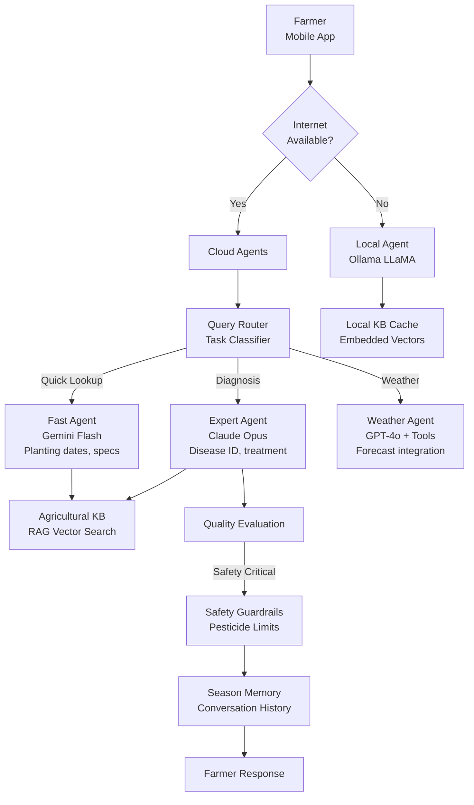

In this guide, you will build an AI farm advisory system using NeuroLink's RAG capabilities. You will ingest agricultural knowledge bases (crop guides, pest management databases, soil science references), implement semantic search for farming queries, and build a conversational interface that provides localized, crop-specific advice to farmers.

Building an AI farm advisory system presents unique challenges that general-purpose chatbots do not face. Rural connectivity is unreliable, so the system must work offline. Agronomic advice is safety-critical -- recommending the wrong pesticide or application rate can destroy a crop, harm livestock, or contaminate water supplies. The knowledge base spans thousands of crops with regional variations and seasonal factors. And farmers need answers in minutes, not hours.

NeuroLink provides the building blocks for this kind of system: multi-provider orchestration for routing queries to the right model, Ollama integration for offline operation, RAG for grounding answers in verified agricultural data, conversation memory for season-long context, evaluation for advice quality, and middleware guardrails for safety.

This post walks through the complete architecture and implementation of an AI farm advisory system.

## Farm Advisory Architecture

The system uses a connectivity-aware routing architecture. When internet is available, queries are routed to cloud models based on complexity. When offline, a local Ollama model provides answers using a cached knowledge base.



The architecture has three key design decisions:

1. **Query routing by complexity**: Simple lookups (planting dates, crop specs) go to fast, cheap models. Diagnostic questions (disease identification, treatment plans) go to expert models. Weather-dependent advice uses tool-calling models that integrate with weather APIs.

2. **Offline fallback**: When the farmer has no internet connection, the system seamlessly falls back to a local Ollama model running on the device or a local edge server. The local model has access to a cached subset of the knowledge base.

3. **Safety-first pipeline**: All diagnostic advice passes through quality evaluation and safety guardrails before reaching the farmer. Banned pesticides are filtered, unsafe dosage recommendations are blocked, and low-confidence diagnoses include referrals to local extension offices.

## Multi-Provider Setup with Offline Fallback

The system uses four different providers, each optimized for a specific type of query:

```typescript
import { AIProviderFactory, ModelConfigurationManager } from '@juspay/neurolink';

const modelConfig = ModelConfigurationManager.getInstance();

// Fast lookup agent - planting calendars, crop specs
const lookupAgent = await AIProviderFactory.createProvider(
  "google-ai",
  modelConfig.getModelForTier("google-ai", "fast") // gemini-2.5-flash
);

// Expert diagnostic agent - disease identification, treatment plans
const expertAgent = await AIProviderFactory.createProvider(
  "bedrock",
  modelConfig.getModelForTier("bedrock", "quality") // claude-3-opus
);

// Weather integration agent - with tool calling
const weatherAgent = await AIProviderFactory.createProvider(
  "openai",
  modelConfig.getModelForTier("openai", "balanced") // gpt-4o
);

// Offline agent - Ollama for rural/disconnected scenarios
const offlineAgent = await AIProviderFactory.createProvider(
  "ollama",
  "llama3.1:8b"
);
```

The Ollama provider is uniquely suited for agricultural use cases in rural areas:

- **No API keys required**: `requiredEnvVars: []` -- no cloud credentials needed on the device
- **Zero marginal cost**: `defaultCost: { input: 0, output: 0 }` -- free local inference after hardware setup
- **Tool-capable models**: Models like `llama3.1`, `mistral`, `hermes3`, and `qwen2.5` support basic tool calling even offline
- **Local operation**: Runs on `http://localhost:11434` with no internet dependency

> **Note:** For offline operation, pre-download the Ollama model and knowledge base vectors to the device before the farmer enters a connectivity dead zone. The `llama3.1:8b` model requires approximately 4.7GB of disk space.
{: .prompt-info }

### Connectivity-Aware Routing

The routing logic detects connectivity and classifies queries to determine the best agent:

```typescript
// Connectivity-aware routing
async function getAdvisory(query: string, hasInternet: boolean) {
  if (!hasInternet) {
    return offlineAgent.generate({
      input: { text: `${localKBContext}\n\nFarmer question: ${query}` },
    });
  }

  // Online: route by query type
  const queryType = classifyQuery(query);
  switch (queryType) {
    case "fast": return lookupAgent.generate({ input: { text: query } });
    case "diagnostic": return expertAgent.generate({ input: { text: query } });
    case "weather": return weatherAgent.generate({ input: { text: query } });
  }
}
```

Query classification uses pattern matching based on NeuroLink's task classification configuration:

- **Fast patterns** (simple lookups): `"What is...?"`, `"When should I...?"`, `"How much...?"` -- these match planting dates, crop specifications, and dosage tables
- **Reasoning patterns** (diagnostic queries): `"analyze"`, `"compare"`, `"evaluate"`, `"diagnose"` -- these require expert-level reasoning about symptoms, soil conditions, or treatment options
- **Weather patterns**: queries mentioning forecast, rain, frost, irrigation, or planting timing

## Agricultural RAG Knowledge Base

The RAG (Retrieval-Augmented Generation) pattern grounds AI responses in verified agricultural data rather than relying on the model's training data. This is critical for farming advice because:

- Crop management practices vary by region and microclimate
- Pesticide regulations change frequently
- New disease strains require updated treatment protocols
- Local soil conditions affect fertilizer recommendations

```typescript
// RAG pattern: retrieve relevant agricultural knowledge, inject as context

async function queryWithRAG(question: string, agent: any) {
  // 1. Retrieve relevant documents from vector search
  const relevantDocs = await vectorSearch(question, {
    collections: ["crop-guides", "pest-database", "soil-maps", "extension-bulletins"],
    topK: 5,
    minScore: 0.7,
  });

  // 2. Build context from retrieved documents
  const context = relevantDocs
    .map(doc => `[Source: ${doc.source}]\n${doc.content}`)
    .join("\n\n");

  // 3. Generate response with RAG context
  const systemPrompt = `You are an agricultural advisor.
Use ONLY the provided knowledge base context to answer.
If the answer is not in the context, say so.
Always include source references.

Knowledge Base Context:
${context}`;

  return agent.generate({
    input: { text: `${systemPrompt}\n\nFarmer question: ${question}` },
  });
}
```

### Knowledge Base Collections

The agricultural knowledge base is organized into four collections:

| Collection | Content | Sources | Update Frequency |
|---|---|---|---|
| `crop-guides` | Planting calendars, growing requirements, harvest timing | USDA, state extension services | Annually |
| `pest-database` | Pest identification, life cycles, treatment options | IPM databases, entomology research | Quarterly |
| `soil-maps` | Soil types, nutrient profiles, amendment recommendations | NRCS surveys, soil testing labs | As tested |
| `extension-bulletins` | Regional advisories, disease alerts, weather impacts | County extension offices | Weekly during season |

### Local Knowledge Base Cache

For offline operation, a subset of the knowledge base is cached locally with embedded vectors:

```typescript
// Pre-cache knowledge base for offline use
async function cacheLocalKB(farmLocation: string, crops: string[]) {
  const relevantDocs = await vectorSearch(
    `farming ${crops.join(', ')} in ${farmLocation}`,
    {
      collections: ['crop-guides', 'pest-database'],
      topK: 100,   // Cache top 100 most relevant documents
      minScore: 0.5,
    }
  );

  // Store locally with embedded vectors
  await localVectorStore.upsert(relevantDocs);
  console.log(`Cached ${relevantDocs.length} documents for offline use`);
}
```

The local cache is refreshed whenever the farmer has connectivity. Priority is given to documents relevant to the farmer's specific crops, location, and current growing season.

## Weather and Sensor Tool Integration

Modern farming benefits from real-time data integration. NeuroLink's MCP tool system connects the advisory AI to weather APIs and IoT soil sensors:

```typescript
import { MCPRegistry } from '@juspay/neurolink';
import { tool } from "ai";
import { z } from "zod";

const farmRegistry = new MCPRegistry();

await farmRegistry.registerServer("weather-service", {
  description: "Weather forecast and historical data",
  tools: { getForecast: {}, getHistorical: {}, getAlerts: {} },
});

await farmRegistry.registerServer("soil-sensors", {
  description: "IoT soil sensor readings",
  tools: { getSoilMoisture: {}, getSoilTemp: {}, getSoilPH: {} },
});

const getWeatherForecast = tool({
  description: "Get weather forecast for farm location",
  parameters: z.object({
    latitude: z.number(),
    longitude: z.number(),
    days: z.number().min(1).max(14),
  }),
  execute: async ({ latitude, longitude, days }) => {
    const forecast = await weatherAPI.getForecast(latitude, longitude, days);
    return {
      location: { lat: latitude, lon: longitude },
      forecast: forecast.daily.map(day => ({
        date: day.date,
        tempHigh: day.tempMax,
        tempLow: day.tempMin,
        precipitation: day.precipMm,
        humidity: day.humidityAvg,
        windSpeed: day.windSpeedMax,
        frostRisk: day.tempMin < 2,
      })),
    };
  },
});
```

The weather tool enables forecast-aware advice. When a farmer asks "Should I spray fungicide this week?", the AI checks the 7-day forecast. If rain is expected within 24 hours, it recommends delaying the application -- saving the farmer the cost of a wasted treatment.

### Soil Sensor Integration

IoT soil sensors provide real-time field conditions for precision recommendations:

```typescript
const getSoilMoisture = tool({
  description: "Get soil moisture readings from field sensors",
  parameters: z.object({
    fieldId: z.string().describe("Field identifier"),
    depth: z.enum(["surface", "root-zone", "deep"]),
  }),
  execute: async ({ fieldId, depth }) => {
    const reading = await sensorAPI.getMoisture(fieldId, depth);
    return {
      fieldId, depth,
      moisture: reading.percentage,
      status: reading.percentage < 20 ? "dry" : reading.percentage > 80 ? "wet" : "optimal",
      lastUpdated: reading.timestamp,
    };
  },
});
```

With soil moisture data, the AI can give specific irrigation recommendations: "Field B root-zone moisture is at 18% (dry). Based on your sandy loam soil and the 5-day forecast showing no rain, irrigate 1.5 inches within the next 48 hours."

## Safety Guardrails for Agronomic Advice

Agricultural AI must never recommend banned substances, unsafe application rates, or practices that could harm people, animals, or the environment. NeuroLink's middleware guardrails enforce these constraints:

```typescript
import { MiddlewareFactory } from '@juspay/neurolink';

const farmMiddleware = new MiddlewareFactory({
  middlewareConfig: {
    guardrails: {
      enabled: true,
      config: {
        badWords: [
          // IMPORTANT: This is a minimal example list. Production systems must
          // integrate with official databases (EPA, EU Pesticide DB, local registries)
          // for comprehensive banned substance checking.
          "ddt", "paraquat", "chlorpyrifos", "endosulfan", "lindane",
          "aldrin", "dieldrin", "heptachlor", "toxaphene", "mirex",
          // Prevent unsafe dosage language
          "unlimited", "as much as possible", "no limit",
        ],
        precallEvaluation: {
          enabled: true, // Block unsafe queries
        },
        modelFilter: {
          enabled: true, // AI-powered safety check for recommendations
        },
      },
    },
    autoEvaluation: {
      enabled: true,
    },
    analytics: {
      enabled: true,
    },
  },
});
```

The safety system operates at three levels:

1. **Keyword filtering (`badWords`)**: Blocks responses that mention banned pesticides like DDT, paraquat, or chlorpyrifos, as well as dangerous language like "unlimited" dosage
2. **Pre-call evaluation (`precallEvaluation`)**: Screens incoming queries to block attempts to bypass safety guidelines
3. **Model-based filtering (`modelFilter`)**: An AI-powered secondary review of the recommendation for safety concerns

> **Critical:** The pesticide ban list above is a minimal example. Real agricultural advisory systems must integrate with authoritative databases (EPA's Pesticide Product Label System, EU Pesticide Database, or local agricultural extension databases) for comprehensive banned substance checking. Brand names, chemical synonyms, and combination products require specialized lookup — keyword filtering alone is insufficient for chemical safety. Always direct users to consult licensed agronomists and official agricultural extension offices before applying any pesticide.
{: .prompt-danger }

## Growing Season Memory

Farming is inherently longitudinal. A conversation in April about planting decisions affects pest management advice in July and harvest timing in October. NeuroLink's conversation memory tracks the full growing season:

```typescript
// Season-long conversation context
process.env.NEUROLINK_MEMORY_ENABLED = "true";
process.env.NEUROLINK_MEMORY_MAX_SESSIONS = "1000";
process.env.NEUROLINK_SUMMARIZATION_ENABLED = "true";
process.env.NEUROLINK_TOKEN_THRESHOLD = "80000";

const seasonPrompt = `You are an agricultural advisor for ${farmName}.
Crops: ${currentCrops.join(", ")}
Location: ${farmLocation}
Soil type: ${soilType}
Growing zone: ${growingZone}
Season stage: ${currentSeasonStage}

You are continuing an ongoing conversation. Previous messages contain
important context including projects, tasks, and topics discussed previously.

Reference previous conversations about this farm when relevant.
Track treatments applied, issues diagnosed, and recommendations given.`;
```

With season memory, the AI knows that:

- The farmer planted Roma tomatoes on March 15th
- A calcium deficiency was diagnosed and amended in April
- Fungicide was applied twice in June
- Blossom end rot was reported in early July (possibly related to the earlier calcium issue)

This context transforms generic advice into farm-specific guidance. Instead of "blossom end rot is often caused by calcium deficiency," the AI can say "Given the calcium deficiency we addressed in April and the inconsistent irrigation pattern from your sensor data, this blossom end rot is likely related to calcium uptake being impaired by moisture stress. Consider more consistent irrigation rather than additional calcium amendment."

## Quality Evaluation for Farm Recommendations

Not all agricultural advice carries the same risk. A planting date recommendation is low-stakes -- the farmer loses a few days if the advice is wrong. A pesticide application recommendation is high-stakes -- the wrong advice can destroy a crop or contaminate a water source.

```typescript
import { generateEvaluation } from '@juspay/neurolink';

const adviceEval = await generateEvaluation({
  userQuery: `My tomatoes have yellow leaves with dark spots. What should I do?`,
  aiResponse: diagnosticResponse,
  primaryDomain: "agriculture",
  toolUsage: [
    { toolName: "getSoilMoisture", result: moistureData },
    { toolName: "getWeatherForecast", result: weatherData },
  ],
  conversationHistory: seasonHistory,
});

if (adviceEval.accuracy < 7) {
  // Add disclaimer for lower confidence
  diagnosticResponse += "\n\nPlease consult your local agricultural extension office to confirm this diagnosis.";
}
```

The evaluation checks:

- **Accuracy**: Is the diagnosis consistent with the symptoms described?
- **Relevance**: Does the recommendation address the specific question?
- **Tool effectiveness**: Were sensor and weather data used meaningfully in the recommendation?
- **Safety**: Does the recommendation follow safe application practices?

Lower-confidence responses automatically include a referral to the local agricultural extension office. The AI assists but does not replace expert human judgment for critical decisions.

## Resilience for Rural Connectivity

Rural internet connections are unreliable. NeuroLink's circuit breaker pattern ensures fast fallback to offline mode rather than long timeouts:

```typescript
import { CircuitBreaker, withRetry } from '@juspay/neurolink';

const cloudBreaker = new CircuitBreaker(2, 10000); // Fast fallback to offline

async function getAdvisoryResilient(query: string) {
  try {
    return await cloudBreaker.execute(() =>
      withRetry(
        () => expertAgent.generate({ input: { text: query } }),
        { maxAttempts: 2, initialDelay: 1000, maxDelay: 5000 }
      )
    );
  } catch {
    // Offline fallback
    return offlineAgent.generate({
      input: { text: `${localKBContext}\n\n${query}` },
    });
  }
}
```

Key design decisions for rural resilience:

- **Low failure threshold (2)**: After just 2 failed cloud requests, the circuit breaker trips and routes all subsequent requests to the offline agent. Farmers cannot wait through multiple timeout cycles.
- **Short reset timeout (10 seconds)**: The circuit breaker tries the cloud again quickly when connectivity returns, so the farmer gets the best available response as soon as the connection is restored.
- **Graceful degradation**: Offline responses are lower quality (smaller model, cached knowledge base) but usable. A partial answer from the local model is better than a timeout error.

## Cost Analysis

AI farm advisory is remarkably cost-effective compared to traditional extension services:

| Component | Cost | Notes |
|---|---|---|
| Cloud queries (average) | ~$0.002/question | Blended across providers |
| Offline queries (Ollama) | $0/question | Local hardware cost only |
| Estimated daily usage | 50 queries/farm | During growing season |
| Monthly cloud cost | ~$3/farm/month | April through October |
| Annual cost per farm | ~$21/farm/year | 7-month growing season |

Compare this to the cost of a single misdiagnosed crop disease ($500-$5,000+ in lost yield) or a single unnecessary pesticide application ($50-$200 per field), and the ROI is overwhelming.

## What's Next

You have completed all the steps in this guide. To continue building on what you have learned:

1. Review the code examples and adapt them for your specific use case
2. Start with the simplest pattern first and add complexity as your requirements grow
3. Monitor performance metrics to validate that each change improves your system
4. Consult the NeuroLink documentation for advanced configuration options

---

**Related posts:**

- [Building RAG Applications with NeuroLink SDK](/posts/rag-implementation/)
- [Advanced RAG: 10 Chunking Strategies, Hybrid Search, and Reranking](/posts/advanced-rag/)
- [AI-Powered Maintenance Knowledge Base for Manufacturing](/posts/ai-maintenance-knowledge-base-manufacturing/)
