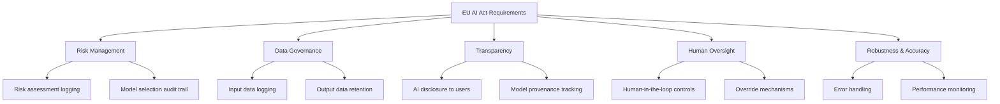
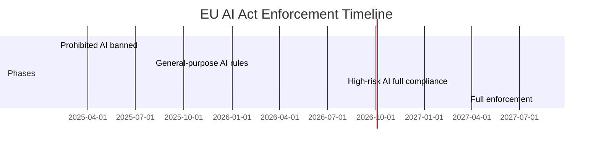

The EU AI Act is the most consequential AI regulation in the world, and it will reshape how every organization deploys AI in European markets. Anyone who treats compliance as an afterthought will face costly retrofits and potential fines. Those that build regulation-ready architectures now -- with risk classification, documentation, and human oversight baked in -- will have a structural advantage as enforcement begins.

For developers, the Act translates into specific technical requirements: audit logging of inputs and outputs, human oversight mechanisms for high-risk decisions, transparency about AI-generated content, guardrails against harmful outputs, and robustness through fallback and evaluation systems. The penalties for non-compliance are severe: up to 35 million euros or 7% of global annual turnover.

This guide maps the Act's requirements to concrete technical implementations using NeuroLink SDK. We cover audit logging with OpenTelemetry, human-in-the-loop controls, transparency metadata, guardrails middleware, fallback for robustness, and data governance patterns. This is a technical implementation guide, not legal advice -- consult your compliance team for regulatory interpretation.

## EU AI Act Technical Requirements Map

> **Important:** The EU AI Act distinguishes between **providers** (who develop or place AI systems on the market) and **deployers** (who use AI systems in a professional capacity). Their obligations differ significantly. Most developers integrating NeuroLink are **deployers**, not providers. Consult the full regulation text and legal counsel to determine your classification and specific obligations.
{: .prompt-warning }

The Act organizes AI systems into risk categories, each with different obligations:

- **Unacceptable risk** (banned): Social scoring, real-time biometric surveillance, manipulation of vulnerable groups.
- **High-risk** (strict requirements): Credit scoring, hiring decisions, medical devices, law enforcement tools.
- **Limited risk** (transparency obligations): Chatbots, content generation, emotion detection.
- **Minimal risk** (no obligations): Spam filters, video game AI, inventory management.

Most developer-facing AI applications fall into the "limited risk" or "high-risk" categories. Here is how the Act's articles map to NeuroLink features:



| Requirement | EU AI Act Article | NeuroLink Feature |
|---|---|---|
| Logging and audit trail | Art. 12 | OpenTelemetry + Langfuse |
| Human oversight | Art. 14 | HITL (Human-in-the-Loop) |
| Transparency | Art. 13 | Provider/model tracking in analytics |
| Accuracy and robustness | Art. 15 | Workflow engine, fallback, evaluation |
| Risk management | Art. 9 | Model routing, guardrails middleware |

## Step 1: Implement Audit Logging with OpenTelemetry

Article 12 requires that high-risk AI systems produce logs that enable tracing of the system's operation. This means logging inputs, outputs, the provider and model used, timestamps, and decision rationale.

NeuroLink integrates with OpenTelemetry for comprehensive distributed tracing:

```typescript
import {
  NeuroLink,
  initializeOpenTelemetry,
  getLangfuseHealthStatus,
} from "@juspay/neurolink";

// Initialize OpenTelemetry for comprehensive audit logging
await initializeOpenTelemetry({
  serviceName: "my-ai-service",
  endpoint: process.env.OTEL_ENDPOINT || "http://localhost:4317",
});

// Check Langfuse health for observability
const langfuseStatus = await getLangfuseHealthStatus();
console.log("Langfuse connected:", langfuseStatus);

const neurolink = new NeuroLink();

// Every generate/stream call is automatically traced
const result = await neurolink.generate({
  input: { text: userQuery },
  provider: "openai",
  model: "gpt-4o",
  // Context for audit trail
  context: {
    userId: "user-123",
    sessionId: "session-456",
    purpose: "customer-support",
    riskLevel: "limited",
  },
});

// Analytics include full audit data
console.log("Provider:", result.provider);
console.log("Model:", result.model);
console.log("Token usage:", result.analytics?.tokenUsage);
console.log("Response time:", result.analytics?.responseTime);
```

Once OpenTelemetry is initialized, every `generate()` and `stream()` call is automatically traced with spans that include the provider, model, input text, output content, token usage, and latency. These traces are exported to your configured endpoint (Jaeger, Grafana Tempo, Langfuse, or any OpenTelemetry-compatible backend).

The `context` object is particularly important for compliance. Including the `userId`, `purpose`, and `riskLevel` in every request creates a queryable audit trail that compliance teams can search by user, by purpose, or by risk category.

> **Note:** Langfuse integration provides a purpose-built LLM observability platform on top of OpenTelemetry. The `getLangfuseHealthStatus()` check ensures your observability pipeline is operational before serving requests -- critical for systems where logging failures would create compliance gaps.
{: .prompt-info }

## Step 2: Human-in-the-Loop Oversight

Article 14 requires that high-risk AI systems include mechanisms for human oversight. Humans must be able to understand the system's capabilities and limitations, monitor its operation, and override or stop its decisions.

NeuroLink's HITL system implements this through tool-level approval workflows:

```typescript
const neurolink = new NeuroLink({
  hitl: {
    enabled: true,
    // Keywords in tool names that trigger HITL confirmation
    dangerousActions: [
      "createTicket",
      "sendEmail",
      "updateDatabase",
      "executePayment",
    ],
    // Advanced custom rules for complex approval scenarios
    customRules: [
      {
        name: 'high-risk-action',
        requiresConfirmation: true,
        condition: (toolName: string, _args: unknown) =>
          ['sendEmail', 'updateDatabase', 'executePayment'].includes(toolName),
        customMessage: 'This action requires human approval before execution',
      },
    ],
  },
});
```

The HITL manager emits events when tools require approval, allowing you to integrate with any approval workflow -- Slack notifications, email approvals, dashboard reviews, or custom internal tools:

```typescript
// Listen for approval requests via the HITLManager
const hitlManager = neurolink.getHITLManager();

hitlManager.on("hitl:confirmation-request", async (event) => {
  const { confirmationId, toolName, arguments: args, timeoutMs } = event.payload;
  console.log(`Tool "${toolName}" requires approval`);
  console.log("Parameters:", args);

  // In production: send to approval queue (Slack, email, dashboard)
  // For now, auto-approve for demonstration
  hitlManager.processUserResponse(confirmationId, {
    approved: true,
    reason: 'Approved via automated compliance check',
  });
});

// Generate with HITL-protected tools
const result = await neurolink.generate({
  input: { text: "Process refund for order #12345" },
  provider: "openai",
  model: "gpt-4o",
  tools: {
    processRefund: tool({
      description: "Process a customer refund",
      parameters: z.object({
        orderId: z.string(),
        amount: z.number(),
        reason: z.string(),
      }),
      execute: async (params) => {
        // This will trigger HITL approval before execution
        return await processRefund(params);
      },
    }),
  },
});
```

For compliance, every approval and rejection is logged with the approver's identity, timestamp, and reason. This creates an auditable record of human oversight that satisfies Article 14's requirements.

## Step 3: Transparency and Model Provenance

Article 13 requires that AI systems be designed to be sufficiently transparent. For limited-risk systems like chatbots, this means users must be informed they are interacting with AI. For all systems, you should track which provider and model generated each response.

```typescript
// Every NeuroLink response includes provenance data
const result = await neurolink.generate({
  input: { text: userQuery },
  provider: "openai",
  model: "gpt-4o",
});

// Build transparency metadata for the response
const transparencyMetadata = {
  generatedByAI: true,
  provider: result.provider,
  model: result.model,
  timestamp: new Date().toISOString(),
  tokenUsage: result.analytics?.tokenUsage,
};

// Include in API response to end users
res.json({
  answer: result.content,
  metadata: transparencyMetadata,
  disclaimer: "This response was generated by an AI system.",
});
```

Key transparency practices:

- **Always disclose AI**: Include a disclaimer in every user-facing response. This is a legal requirement for chatbots and content generation systems under the Act.
- **Track model provenance**: Record which provider and model generated each response. If a model is later found to have issues, you can identify all affected responses.
- **Expose metadata**: Give users access to the generation metadata (model, timestamp) so they can make informed decisions about the content.

## Step 4: Guardrails Middleware

Article 9 requires risk management measures to prevent harmful outputs. NeuroLink's guardrails middleware provides configurable content filtering:

```typescript
import { NeuroLink, MiddlewareFactory } from "@juspay/neurolink";

const neurolink = new NeuroLink();

// Configure middleware for compliance
const middleware = MiddlewareFactory.create({
  presets: ["guardrails", "analytics"],
  guardrails: {
    maxOutputTokens: 4096,
    blockedTopics: ["medical-advice", "legal-advice", "financial-advice"],
    requireDisclaimer: true,
  },
  analytics: {
    trackAllRequests: true,
    includePrompts: true, // Required for audit trail
    includeResponses: true,
  },
});
```

The guardrails middleware enforces output constraints:

- **Blocked topics**: Prevents the AI from providing advice in domains where it could cause harm (medical, legal, financial). The system either refuses the request or adds appropriate disclaimers.
- **Output limits**: Caps response length to prevent runaway generation.
- **Required disclaimers**: Automatically appends compliance disclaimers to responses.
- **Content filtering**: Screens outputs for inappropriate content before delivery to users.

The analytics middleware runs alongside guardrails, logging every request and response with full prompt and completion text. The `includePrompts: true` and `includeResponses: true` settings are essential for Article 12 compliance -- without them, your audit trail is incomplete.

> **Note:** Balance compliance with usability. Overly aggressive content filtering degrades user experience. Work with your compliance team to define blocked topics that are genuinely high-risk for your application, rather than blocking everything that could theoretically be sensitive.
{: .prompt-info }

## Step 5: Robustness with Fallback and Evaluation

Article 15 requires AI systems to achieve appropriate levels of accuracy and robustness. In practice, this means handling provider failures gracefully and verifying output quality:

```typescript
import {
  createAIProviderWithFallback,
  CONSENSUS_3_WORKFLOW,
} from "@juspay/neurolink";

// Fallback for robustness
const { primary, fallback } = await createAIProviderWithFallback(
  "openai",    // Primary
  "anthropic"  // Fallback if primary fails
);

// For critical decisions, use consensus (multiple models agree)
const criticalResult = await neurolink.generate({
  input: { text: "Assess credit risk for application #789" },
  workflowConfig: CONSENSUS_3_WORKFLOW,
});

console.log("Consensus score:", criticalResult.workflow?.metrics?.totalTime);
console.log("Models used:", criticalResult.workflow?.selectedModel);
```

For high-risk applications, the consensus workflow sends the same prompt to three different models and only returns a result when at least two agree. This multi-model verification provides a level of robustness that satisfies Article 15's accuracy requirements.

Provider fallback ensures that a single provider outage does not render your AI system unavailable. If OpenAI is down, the system automatically routes to Anthropic. This availability guarantee is important for systems classified as high-risk, where downtime could have real-world consequences.

## Step 6: Data Governance and Retention

The Act requires appropriate data governance, including data retention policies and privacy protections:

```typescript
// Structure for compliance data retention
interface ComplianceRecord {
  requestId: string;
  timestamp: string;
  userId: string;
  inputHash: string; // Hash for privacy, retain full input in secure store
  outputHash: string;
  provider: string;
  model: string;
  tokenUsage: { prompt: number; completion: number };
  riskCategory: "minimal" | "limited" | "high";
  hitlApproved: boolean;
  toolsUsed: string[];
  responseTimeMs: number;
}

// Log every interaction
async function logComplianceRecord(
  result: GenerateResult,
  context: { userId: string; riskCategory: string }
) {
  const record: ComplianceRecord = {
    requestId: crypto.randomUUID(),
    timestamp: new Date().toISOString(),
    userId: context.userId,
    inputHash: hash(result.input),
    outputHash: hash(result.content),
    provider: result.provider,
    model: result.model,
    tokenUsage: result.analytics?.tokenUsage,
    riskCategory: context.riskCategory as ComplianceRecord["riskCategory"],
    hitlApproved: result.hitlApproved || false,
    toolsUsed: result.toolsUsed || [],
    responseTimeMs: result.analytics?.responseTime || 0,
  };

  await complianceStore.insert(record);
}
```

The data governance pattern stores hashes of inputs and outputs for compliance records (enabling lookup without storing raw personal data in the audit log) while retaining full text in a separate, access-controlled secure store. This satisfies both the Act's logging requirements and GDPR's data minimization principle.

Retention periods should be defined per risk category:

- **High-risk**: Retain records for 10 years after the AI system has been placed on the market or put into service (Article 19(1)).
- **Limited risk**: Retain for 3-5 years depending on jurisdiction.
- **Minimal risk**: Standard business retention policies apply.

## Compliance Checklist

Use this checklist to assess your application's compliance readiness:

- [ ] Classify your AI system's risk level (minimal, limited, high)
- [ ] Enable OpenTelemetry audit logging with appropriate retention
- [ ] Implement HITL for high-risk tool calls and decisions
- [ ] Add AI disclosure to all user-facing responses
- [ ] Track model provenance (provider, model, version) for every generation
- [ ] Set up guardrails middleware for content safety
- [ ] Configure provider fallback for robustness
- [ ] Implement data retention policies per risk category
- [ ] Test output quality with the evaluation framework
- [ ] Document your risk management process
- [ ] Train your team on compliance requirements
- [ ] Schedule regular compliance audits

## Enforcement Timeline

The Act's enforcement phases in over three years. Know which deadlines apply to your system:



- **February 2025**: Prohibited AI practices banned (already in effect).
- **August 2025**: General-purpose AI model rules apply. This affects most LLM-based applications.
- **August 2026**: High-risk AI systems must be fully compliant. This is the critical deadline for credit scoring, hiring tools, medical devices, and similar applications.
- **August 2027**: Full enforcement across all risk categories.

> **Note:** Even if your system is classified as "limited risk" with only transparency obligations, implementing audit logging and human oversight now prepares you for potential reclassification. Risk categories may shift as regulators issue guidance and precedents emerge.
{: .prompt-info }

## Beyond the EU AI Act

The EU AI Act is the first comprehensive AI regulation, but it will not be the last. Canada's AIDA, Brazil's AI framework, and various US state-level regulations are in development. The compliance patterns in this guide -- audit logging, human oversight, transparency, guardrails, and robustness -- are universal. Building them into your application now means you are prepared for any regulatory framework that follows.

## What's Next

The direction is clear, even if the timeline is not. Organizations that invest in these capabilities now -- building the infrastructure, developing the talent, establishing the practices -- will compound their advantage over those that wait. The question is not whether this shift will happen, but whether your team will be leading it or catching up. The tools are available. The patterns are proven. The only remaining variable is execution.

---

**Related posts:**

- [AI Farm Advisory: Agricultural Knowledge Bases with RAG](/posts/ai-farm-advisory-agricultural-rag/)
- [Human-in-the-Loop (HITL) Security Guide for NeuroLink](/posts/hitl-guardrails-guide/)
- [AI Observability: Monitoring LLM Applications in Production](/posts/monitoring-observability/)
