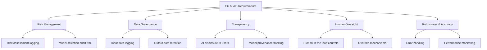
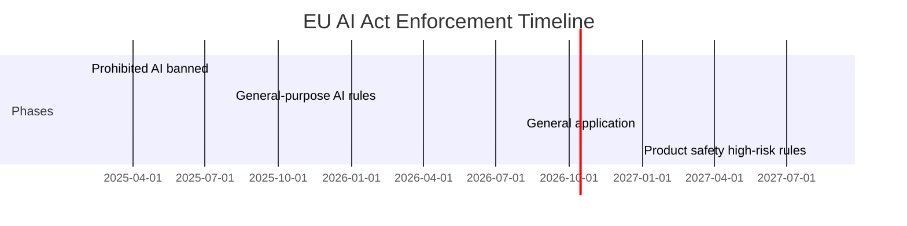

The EU AI Act is the most consequential AI regulation in the world, and it will reshape how every organization deploys AI in European markets. Anyone who treats compliance as an afterthought will face costly retrofits and potential fines. Those that build regulation-ready architectures now -- with risk classification, documentation, and human oversight baked in -- will have a structural advantage as enforcement begins.

For developers, the Act translates into specific technical requirements: audit logging of inputs and outputs, human oversight mechanisms for high-risk decisions, transparency about AI-generated content, guardrails against harmful outputs, and robustness through fallback and evaluation systems. Maximum penalties vary by infringement. Violating a prohibited practice can carry a ceiling of EUR 35 million or 7% of the preceding financial year's worldwide turnover for an undertaking, while other breaches have lower ceilings. The regulation includes separate treatment for SMEs and requires penalties to be assessed case by case.

This guide maps the Act's requirements to concrete technical implementations using NeuroLink SDK. We cover audit logging with OpenTelemetry, human-in-the-loop controls, transparency metadata, guardrails middleware, fallback for robustness, and data governance patterns. This is a technical implementation guide, not legal advice -- consult your compliance team for regulatory interpretation.

## EU AI Act Technical Requirements Map

> **Important:** The EU AI Act distinguishes between **providers** (who develop or place AI systems on the market) and **deployers** (who use AI systems in a professional capacity). Their obligations differ significantly. Most developers integrating NeuroLink are **deployers**, not providers. Consult the full regulation text and legal counsel to determine your classification and specific obligations.
{: .prompt-warning }

The Act organizes AI systems into risk categories, each with different obligations:

- **Unacceptable risk** (banned): Social scoring, real-time biometric surveillance, manipulation of vulnerable groups.
- **High-risk** (strict requirements): Credit scoring, hiring decisions, medical devices, law enforcement tools.
- **Limited risk** (transparency obligations): Chatbots, content generation, emotion detection.
- **Minimal risk** (no obligations): Spam filters, video game AI, inventory management.

Most developer-facing AI applications fall into the "limited risk" or "high-risk" categories. Here is how the Act's articles map to NeuroLink features:


```mermaid
flowchart TD
    A[EU AI Act Requirements] --> B[Risk Management]
    A --> C[Data Governance]
    A --> D[Transparency]
    A --> E[Human Oversight]
    A --> F[Robustness & Accuracy]

    B --> B1[Risk assessment logging]
    B --> B2[Model selection audit trail]
    C --> C1[Input data logging]
    C --> C2[Output data retention]
    D --> D1[AI disclosure to users]
    D --> D2[Model provenance tracking]
    E --> E1[Human-in-the-loop controls]
    E --> E2[Override mechanisms]
    F --> F1[Error handling]
    F --> F2[Performance monitoring]
```

| Requirement | EU AI Act Article | NeuroLink Feature |
|---|---|---|
| Logging and audit trail | Art. 12 | OpenTelemetry + Langfuse |
| Human oversight | Art. 14 | HITL (Human-in-the-Loop) |
| Transparency | Art. 13 | Provider/model tracking in analytics |
| Accuracy and robustness | Art. 15 | Workflow engine, fallback, evaluation |
| Risk management | Art. 9 | Model routing, guardrails middleware |

## Step 1: Implement Audit Logging with OpenTelemetry

Article 12 requires that high-risk AI systems produce logs that enable tracing of the system's operation. This means logging inputs, outputs, the provider and model used, timestamps, and decision rationale.

NeuroLink can initialize OpenTelemetry through constructor configuration. Keep the telemetry endpoint and service identity in configuration rather than hard-coding them:

```typescript
import { NeuroLink } from "@juspay/neurolink";

const neurolink = new NeuroLink({
  observability: {
    openTelemetry: {
      enabled: true,
      endpoint: process.env.OTEL_EXPORTER_OTLP_ENDPOINT,
      serviceName: "my-ai-service",
      serviceVersion: process.env.APP_VERSION,
    },
  },
});

const result = await neurolink.generate({
  input: { text: userQuery },
  provider: "openai",
  model: "gpt-5.4",
  context: {
    userId: "user-123",
    sessionId: "session-456",
    purpose: "customer-support",
    riskLevel: "limited",
  },
});

console.log("Provider:", result.provider);
console.log("Model:", result.model);
console.log("Token usage:", result.usage);
console.log("Response time:", result.responseTime);
```

Telemetry is only one part of an audit design. Define which inputs, outputs, decisions, tool calls, approvals, errors, and model identifiers your use case must retain; apply access controls and redaction; monitor exporter failures; and test that records can be reconstructed. Do not assume enabling tracing automatically satisfies Article 12 or that recording full prompts is always compatible with data-minimization obligations.

## Step 2: Human-in-the-Loop Oversight

Article 14 requires that high-risk AI systems include mechanisms for human oversight. Humans must be able to understand the system's capabilities and limitations, monitor its operation, and override or stop its decisions.

NeuroLink's HITL system can pause selected tool calls and emit a confirmation request. The application must route that request to an authorized reviewer and return the reviewer's decision:

```typescript
import { tool } from "ai";
import { z } from "zod";

const neurolink = new NeuroLink({
  hitl: {
    enabled: true,
    dangerousActions: ["processRefund", "executePayment"],
    autoApproveOnTimeout: false,
    auditLogging: true,
  },
});

neurolink.getEventEmitter().on(
  "hitl:confirmation-request",
  async (event) => {
    const decision = await approvalQueue.request({
      confirmationId: event.payload.confirmationId,
      toolName: event.payload.toolName,
      arguments: event.payload.arguments,
    });

    neurolink.getEventEmitter().emit("hitl:confirmation-response", {
      type: "hitl:confirmation-response",
      payload: {
        confirmationId: event.payload.confirmationId,
        approved: decision.approved,
        reason: decision.reason,
        metadata: {
          timestamp: new Date().toISOString(),
          responseTime: decision.responseTime,
          userId: decision.reviewerId,
        },
      },
    });
  },
);

const result = await neurolink.generate({
  input: { text: "Process refund for order #12345" },
  provider: "openai",
  model: "gpt-5.4",
  tools: {
    processRefund: tool({
      description: "Process a customer refund",
      parameters: z.object({
        orderId: z.string(),
        amount: z.number(),
        reason: z.string(),
      }),
      execute: processRefund,
    }),
  },
});
```

HITL provides a technical pause-and-response mechanism. Compliance still depends on who can approve, what information they receive, whether they can override or stop the system, how automation bias is addressed, and how the application persists the resulting record.

## Step 3: Transparency and Model Provenance

Article 13 requires that AI systems be designed to be sufficiently transparent. For limited-risk systems like chatbots, this means users must be informed they are interacting with AI. For all systems, you should track which provider and model generated each response.

```typescript
// Every NeuroLink response includes provenance data
const result = await neurolink.generate({
  input: { text: userQuery },
  provider: "openai",
  model: "gpt-5.4",
});

// Build transparency metadata for the response
const transparencyMetadata = {
  generatedByAI: true,
  provider: result.provider,
  model: result.model,
  timestamp: new Date().toISOString(),
  tokenUsage: result.analytics?.tokenUsage,
};

// Include in API response to end users
res.json({
  answer: result.content,
  metadata: transparencyMetadata,
  disclaimer: "This response was generated by an AI system.",
});
```

Key transparency practices:

- **Disclose direct AI interaction when required**: Article 50 requires notification unless it is already obvious to a reasonably well-informed, observant, and circumspect person.
- **Mark synthetic content where applicable**: Machine-readable marking and specific disclosure duties apply to generated content, deepfakes, and public-interest text, subject to the regulation's conditions and exceptions.
- **Track model provenance internally**: Record the provider, model, application version, and relevant policy version so affected outputs can be identified later.
- **Design user-facing metadata deliberately**: Expose the information users need without leaking credentials, internal controls, or personal data.

## Step 4: Guardrails Middleware

Article 9 requires a continuous risk-management system for high-risk AI systems. NeuroLink middleware can support some technical controls, but a keyword filter is not a complete risk-management process:

```typescript
const result = await neurolink.generate({
  input: { text: userQuery },
  provider: "openai",
  model: "gpt-5.4",
  maxTokens: 4096,
  middleware: {
    middlewareConfig: {
      guardrails: {
        enabled: true,
        config: {
          badWords: {
            enabled: true,
            list: ["application-specific-blocked-term"],
            replacementText: "[REDACTED]",
          },
          precallEvaluation: {
            enabled: true,
            blockUnsafeRequests: true,
          },
        },
      },
      analytics: { enabled: true },
    },
  },
});
```

Use these controls as one layer alongside authorization, input validation, application-specific policy checks, testing, incident response, and human oversight. Add any required disclosure in the application response rather than assuming middleware inserts a legally sufficient notice. Decide whether prompts and outputs may be retained only after privacy, security, and data-governance review.

## Step 5: Robustness with Fallback and Evaluation

Article 15 requires appropriate accuracy, robustness, and cybersecurity throughout a high-risk system's lifecycle. Provider fallback can improve availability, while evaluation can detect some output-quality problems:

```typescript
let fallbackUsed = false;

const resilientNeuroLink = new NeuroLink({
  providerFallback: async () => {
    if (fallbackUsed) return null;
    fallbackUsed = true;
    return { provider: "anthropic", model: "claude-sonnet-5" };
  },
});

const robustResult = await resilientNeuroLink.generate({
  input: { text: "Summarize the evidence for application #789" },
  provider: "openai",
  model: "gpt-5.4",
});

const quality = await resilientNeuroLink.evaluate(
  {
    query: "Summarize the evidence for application #789",
    response: robustResult.content,
    context: evidenceDocuments,
  },
  {
    scorers: ["faithfulness", "answer-relevancy", "hallucination"],
    passThreshold: 0.8,
  },
);

if (!quality.passed) {
  await sendForHumanReview(robustResult, quality.scores);
}
```

The callback receives one error and returns the next provider/model pair or `null`; it is different from `modelChain`, which preserves the current provider and advances models only for model-access-denied errors unless an explicit fallback callback is also supplied.

Fallback and LLM-based scoring do not demonstrate legal compliance or the accuracy of a consequential decision. Define measurable task-specific accuracy, test foreseeable failure conditions, protect against adversarial inputs, and retain a safe way to stop or override the system.

## Step 6: Data Governance and Retention

The Act requires appropriate data governance, including data retention policies and privacy protections:

```typescript
// Example application-owned audit record
interface ComplianceRecord {
  requestId: string;
  timestamp: string;
  userId: string;
  inputHash: string;
  outputHash: string;
  provider?: string;
  model?: string;
  tokenUsage?: { input: number; output: number; total: number };
  riskCategory: "minimal" | "limited" | "high";
  toolsUsed: string[];
  responseTimeMs?: number;
}

async function logComplianceRecord(
  result: import("@juspay/neurolink/types").GenerateApiResult,
  context: {
    userId: string;
    riskCategory: ComplianceRecord["riskCategory"];
    inputHash: string;
  },
) {
  const record: ComplianceRecord = {
    requestId: crypto.randomUUID(),
    timestamp: new Date().toISOString(),
    userId: context.userId,
    inputHash: context.inputHash,
    outputHash: hash(result.content),
    provider: result.provider,
    model: result.model,
    tokenUsage: result.usage,
    riskCategory: context.riskCategory,
    toolsUsed: result.toolsUsed ?? [],
    responseTimeMs:
      result.responseTime ?? result.analytics?.requestDuration,
  };

  await complianceStore.insert(record);
}
```

This pattern keeps an application-owned record separate from raw content. Hashing can support integrity and lookup, but it does not by itself anonymize personal data or satisfy the AI Act or GDPR.

Article 19 requires providers of high-risk systems to retain automatically generated logs under their control for an appropriate period of at least six months, unless other EU or national law specifies otherwise. The separate ten-year period in Article 18 concerns a defined provider documentation package, not every interaction log. Set retention with legal counsel based on operator role, system category, applicable sector rules, purpose limitation, and data-protection obligations.

## Compliance Checklist

Use this checklist to assess your application's compliance readiness:

- [ ] Classify your AI system's risk level (minimal, limited, high)
- [ ] Enable OpenTelemetry audit logging with appropriate retention
- [ ] Implement HITL for high-risk tool calls and decisions
- [ ] Add AI disclosure to all user-facing responses
- [ ] Track model provenance (provider, model, version) for every generation
- [ ] Set up guardrails middleware for content safety
- [ ] Configure provider fallback for robustness
- [ ] Implement data retention policies per risk category
- [ ] Test output quality with the evaluation framework
- [ ] Document your risk management process
- [ ] Train your team on compliance requirements
- [ ] Schedule regular compliance audits

## Enforcement Timeline

The Act's enforcement phases in over three years. Know which deadlines apply to your system:


```mermaid
gantt
    title EU AI Act Enforcement Timeline
    dateFormat YYYY-MM
    section Phases
    Prohibited AI banned           :done, 2025-02, 2025-02
    General-purpose AI rules       :active, 2025-08, 2025-08
    General application            :2026-08, 2026-08
    Product safety high-risk rules :2027-08, 2027-08
```

- **February 2025**: Prohibited AI practices banned (already in effect).
- **August 2025**: General-purpose AI model rules apply. This affects most LLM-based applications.
- **August 2026**: The regulation generally applies, with exceptions specified in Article 113.
- **August 2027**: Article 6(1) and corresponding obligations apply to certain high-risk systems that are safety components of, or themselves are, products covered by listed EU harmonization legislation.

> **Note:** Even if your system is classified as "limited risk" with only transparency obligations, implementing audit logging and human oversight now prepares you for potential reclassification. Risk categories may shift as regulators issue guidance and precedents emerge.
{: .prompt-info }

## Beyond the EU AI Act

Other jurisdictions and sectors impose different AI, privacy, consumer-protection, safety, and recordkeeping duties. The engineering patterns in this guide -- traceability, human oversight, transparency, risk controls, and resilience -- are useful foundations, but they must be mapped to the specific law, operator role, system classification, and deployment context.

## What's Next

Start by classifying the system and your operator role with qualified counsel. Then translate the applicable duties into testable controls: traceability, documented model and policy versions, effective human oversight, measurable accuracy, incident handling, cybersecurity, and retention. NeuroLink can implement parts of that architecture, but compliance remains a property of the complete sociotechnical system and its operation.

---

**Related posts:**

- [AI Farm Advisory: Agricultural Knowledge Bases with RAG](/posts/ai-farm-advisory-agricultural-rag/)
- [Human-in-the-Loop (HITL) Security Guide for NeuroLink](/posts/hitl-guardrails-guide/)
- [AI Observability: Monitoring LLM Applications in Production](/posts/monitoring-observability/)
