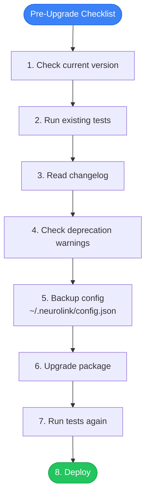

We are excited to have made upgrading between NeuroLink releases as smooth as possible. This guide walks you through every breaking change, deprecated API, and migration step for each major version -- so you can upgrade with confidence and take advantage of new features without disrupting your production systems.

NeuroLink follows semantic versioning (semver): `major.minor.patch`. Patch versions contain bug fixes, minor versions add features without breaking changes, and major versions may include breaking changes that require code updates. This guide covers the complete upgrade process -- from pre-upgrade checklist to post-upgrade verification.

## Pre-Upgrade Checklist

Before upgrading, walk through this checklist to minimize risk:



Each step serves a purpose:

1. **Check current version**: Know your starting point so you can identify which changes apply to you
2. **Run existing tests**: Establish a green baseline. If tests fail before the upgrade, fix them first.
3. **Read changelog**: Understand what changed. Pay attention to breaking changes and deprecation notices.
4. **Check deprecation warnings**: Run your application and look for deprecation warnings in the console. These indicate APIs that will be removed in a future major version.
5. **Backup config**: Your `~/.neurolink/config.json` file contains provider credentials and settings. Back it up.
6. **Upgrade package**: Install the new version.
7. **Run tests again**: Compare test results before and after. Any new failures are upgrade-related.
8. **Deploy**: Roll out to staging first, then production.

## Checking Your Current Version

Before upgrading, confirm which version you are currently running:

```bash
npx neurolink --version

# Check config version
cat ~/.neurolink/config.json | jq '.version'

# Check telemetry service version
# OTEL_SERVICE_VERSION defaults to current SDK version
```

If you are on a very old version, you may need to upgrade incrementally rather than jumping to the latest. Check the changelog for any migration steps required between intermediate versions.

## Upgrading

### Standard Upgrade

```bash
# Upgrade to latest
npm install @juspay/neurolink@latest

# Upgrade to specific version
npm install @juspay/neurolink@3.1.0

# Check for peer dependency issues
npm ls @juspay/neurolink
```

### Verifying the Upgrade

After installation, verify:

```bash
# Confirm new version
npx neurolink --version

# Run TypeScript type checking
npx tsc --noEmit

# Run your test suite
npm test
```

> **Note:** Always upgrade in a branch, not directly on main. This gives you an easy rollback path if the upgrade causes unexpected issues.
{: .prompt-info }

## Configuration Migration

NeuroLink validates configuration on startup using Zod schemas. If your configuration uses deprecated or invalid fields, you will get clear error messages with suggestions.

### Constructor Changes

The NeuroLink constructor accepts a focused set of options. If you are upgrading from an older version, some fields may have moved:

```typescript
// Before: Older config format
const neurolink = new NeuroLink({
  defaultProvider: 'openai',
  model: 'gpt-4',
});

// After: Current config format
const neurolink = new NeuroLink({
  hitl: {
    enabled: true,
    dangerousActions: ['delete', 'deploy'],
  },
  conversationMemory: { enabled: true },
});

// Configure middleware separately via MiddlewareFactory
const middleware = new MiddlewareFactory({
  middlewareConfig: {
    analytics: { enabled: true },
    guardrails: { enabled: true },
  },
});
```

Key changes to note:

- **Provider and model** are now specified per `generate()` call, not in the constructor. This enables per-request provider selection.
- **Middleware** is configured through `MiddlewareFactory`, not the constructor. This separates concerns and allows middleware to be shared across multiple NeuroLink instances.
- **HITL** is configured via the `hitl` constructor field with `dangerousActions` (not `requireApproval`).
- **Observability** is configured via the `observability` constructor field.

### Valid Constructor Fields

The current NeuroLink constructor accepts only these fields:

| Field | Type | Description |
|---|---|---|
| `conversationMemory` | `object` | Enable conversation memory with session management |
| `enableOrchestration` | `boolean` | Enable multi-step orchestration |
| `hitl` | `object` | Human-in-the-loop configuration |
| `toolRegistry` | `object` | Tool registration and management |
| `observability` | `object` | OpenTelemetry and tracing configuration |

If you pass unrecognized fields, NeuroLink's Zod validation will throw an error with a message indicating which field is invalid and suggesting the correct alternative.

## Provider Changes

Provider names are stable across versions. The following provider identifiers have remained consistent:

```typescript
// Provider names remain stable across versions:
// 'openai', 'anthropic', 'bedrock', 'vertex', 'azure',
// 'google-ai', 'huggingface', 'ollama', 'mistral'
```

> **Note:** The provider name for Google's Vertex AI is `"vertex"`, not `"google-vertex"`. This is a common source of confusion when migrating from other SDKs.
{: .prompt-warning }

### Model Name Changes

Model IDs track upstream provider changes. When a provider deprecates a model (like `gpt-4` being replaced by `gpt-4o`), NeuroLink's model resolver can help:

```bash
# Always check available models after upgrading
neurolink models list --provider openai

# Resolve model aliases to current IDs
neurolink models resolve gpt4
```

Use `ModelResolver.resolveModel()` programmatically to handle model alias changes without code updates:

```typescript
import { ModelResolver } from '@juspay/neurolink';

// Resolves aliases to current model IDs
const resolvedModel = ModelResolver.resolveModel('gpt4'); // Returns 'gpt-4o'
```

New providers are added in minor versions, so upgrading to a new minor version may give you access to new providers without any code changes.

## Middleware Migration

The middleware system has been stable since v3.0. The registration pattern uses `MiddlewareFactory`:

```typescript
// Middleware system is stable since v3.0
// Registration pattern:
const factory = new MiddlewareFactory({
  middleware: [customMiddleware],
  middlewareConfig: {
    analytics: { enabled: true },
    guardrails: { enabled: true, config: { badWords: ['secret'] } },
    autoEvaluation: { enabled: false },
  },
  preset: 'default',  // 'default', 'all', 'security'
});
```

### Custom Middleware Interface

If you have written custom middleware, verify it implements the `NeuroLinkMiddleware` interface:

```typescript
// Custom middleware must implement NeuroLinkMiddleware interface:
interface NeuroLinkMiddleware {
  metadata: {
    id: string;
    name: string;
    description: string;
    priority: number;
    defaultEnabled: boolean;
  };
  wrapGenerate?: (params: GenerateParams) => Promise<GenerateResult>;
  wrapStream?: (params: StreamParams) => Promise<StreamResult>;
  transformParams?: (params: Params) => Promise<Params>;
}
```

The interface has been stable across versions. If your custom middleware implements these methods, it will continue to work after upgrading.

### Middleware Presets

NeuroLink offers three middleware presets for common configurations:

| Preset | Includes | Best For |
|---|---|---|
| `default` | Analytics | Most applications |
| `all` | Analytics, guardrails, auto-evaluation | Production with full observability |
| `security` | Guardrails, precall evaluation | Security-sensitive applications |

## ProcessorRegistry Changes

The `ProcessorRegistry` is a singleton. If you are using it directly, always use `getInstance()`:

```typescript
// ProcessorRegistry is a singleton -- reset between tests
import { ProcessorRegistry } from '@juspay/neurolink';

// Always use getInstance(), never construct directly
const registry = ProcessorRegistry.getInstance();

// New processors added in minor versions
// Custom processors remain compatible across versions
// Priority system is stable: lower number = higher priority
```

In test environments, use `resetInstance()` between tests to avoid state leakage:

```typescript
afterEach(() => {
  ProcessorRegistry.resetInstance();
});
```

New file processors are added in minor versions. Custom processors you have registered will continue to work across upgrades because the registration interface is stable.

## HITL Changes

The HITLManager API has been stable since v3.0:

```typescript
// HITLManager API is stable since v3.0
// Key interfaces:
// - HITLConfig: enabled, dangerousActions, timeout, customRules, auditLogging
// - ConfirmationRequest/Result: confirmationId, approved, reason, modifiedArguments
// - HITLStatistics: totalRequests, approvedRequests, rejectedRequests, timedOutRequests

// Custom rules condition signature is stable:
// condition: (toolName: string, args: unknown) => boolean
```

If you are upgrading from an older version that used `requireApproval`, migrate to `dangerousActions`:

```typescript
// Before (deprecated)
const neurolink = new NeuroLink({
  hitl: {
    enabled: true,
    requireApproval: ['deleteUser', 'deployProduction'],
  },
});

// After (current)
const neurolink = new NeuroLink({
  hitl: {
    enabled: true,
    dangerousActions: ['deleteUser', 'deployProduction'],
  },
});
```

## CLI Command Changes

CLI commands are additive across versions -- existing commands remain stable, and new subcommands may be added in minor versions:

```bash
# CLI commands are additive -- existing commands remain stable
# New subcommands may be added in minor versions

# Check available commands
neurolink --help

# Command-specific help
neurolink models --help
neurolink mcp --help
neurolink rag --help
```

If you have scripts that parse CLI output, check the changelog for any output format changes. Structured output (JSON mode) is more stable than human-readable output.

## Telemetry Changes

The telemetry system is backward compatible. New metrics may be added in minor versions, but existing metric names remain stable:

```typescript
// TelemetryService is backward compatible
// New metrics may be added in minor versions
// Existing metric names are stable:
// - ai_requests_total
// - ai_request_duration_ms
// - ai_tokens_used_total
// - ai_provider_errors_total
// - mcp_tool_calls_total

// Environment variables remain stable:
// NEUROLINK_TELEMETRY_ENABLED
// OTEL_EXPORTER_OTLP_ENDPOINT
// OTEL_SERVICE_NAME
// OTEL_SERVICE_VERSION
```

If you have dashboards or alerts based on NeuroLink metrics, they will continue to work after upgrading. New metrics will appear automatically if you are using metric auto-discovery.

## Token Usage Fields

If your code reads token usage from response objects, note the correct field names:

```typescript
// Correct token usage fields
const result = await neurolink.generate({
  input: { text: "Hello" },
  provider: 'openai',
  model: 'gpt-4o',
});

console.log(result.usage.total);   // Total tokens
console.log(result.usage.input);   // Input (prompt) tokens
console.log(result.usage.output);  // Output (completion) tokens

// NOT: result.usage.totalTokens (incorrect)
// NOT: result.usage.promptTokens (incorrect)
```

## Streaming API

If your code uses streaming, verify you are using the correct property name:

```typescript
const result = await neurolink.stream({
  input: { text: "Generate a report" },
  provider: 'openai',
  model: 'gpt-4o',
});

// Correct: use result.stream
for await (const chunk of result.stream) {
  process.stdout.write(chunk.content);
}

// NOT: result.textStream (incorrect)
```

## Troubleshooting Common Upgrade Issues

### TypeScript Errors

After upgrading, run `npx tsc --noEmit` to check for type errors. Common issues:

- **New generic parameters**: Some types may have added generic parameters. Check the changelog for type changes.
- **Stricter null checks**: Newer versions may have stricter null checking. Add null guards where needed.

```bash
# Quick type check
npx tsc --noEmit

# If you see errors, check which types changed
npx tsc --noEmit 2>&1 | grep "error TS"
```

### Config Validation Failures

If NeuroLink fails to start after upgrading with a config validation error:

```bash
# Validate your config
neurolink config show

# Re-initialize config if needed
neurolink config init
```

The `config init` command will create a fresh configuration file. Compare it with your backup to migrate settings.

### Missing Dependencies

Check for peer dependency issues:

```bash
# Check dependency tree
npm ls @juspay/neurolink

# If there are peer dependency warnings
npm install --legacy-peer-deps
```

### Provider Authentication Errors

If credential formats changed between versions:

```bash
# Re-run provider setup
neurolink setup

# Or configure a specific provider
neurolink setup --provider openai
```

## Upgrade Path Summary

| From Version | To Version | Effort | Key Changes |
|---|---|---|---|
| v3.x patch | v3.x patch | 5 minutes | Bug fixes only, no code changes |
| v3.x minor | v3.x minor | 15 minutes | New features, check for deprecation warnings |
| v2.x to v3.x | Major | 30-60 minutes | Config migration, middleware separation |

## What's Next

We built this because our community asked for it, and we are proud of what we have delivered. Try it out, push the boundaries, and tell us what you think. Your feedback directly shapes our roadmap, and the best features in this release started as community suggestions. We cannot wait to see what you build next.

---

**Related posts:**

- [Getting Started with NeuroLink: Your First AI App in 5 Minutes](/posts/getting-started-first-ai-app/)
- [Migrating from LangChain to NeuroLink: A Step-by-Step Guide](/posts/langchain-migration-guide/)
- [Migrating from Vercel AI SDK to NeuroLink](/posts/vercel-ai-migration/)
