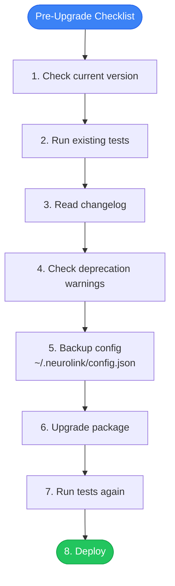

We are excited to have made upgrading between NeuroLink releases as smooth as possible. This guide walks you through every breaking change, deprecated API, and migration step for each major version -- so you can upgrade with confidence and take advantage of new features without disrupting your production systems.

NeuroLink follows semantic versioning (semver): `major.minor.patch`. Patch versions contain bug fixes, minor versions add features without breaking changes, and major versions may include breaking changes that require code updates. This guide covers the complete upgrade process -- from pre-upgrade checklist to post-upgrade verification.

## Pre-Upgrade Checklist

Before upgrading, walk through this checklist to minimize risk:


```mermaid
flowchart TD
    CHECK(["Pre-Upgrade Checklist"]) --> V["1. Check current version"]
    V --> T["2. Run existing tests"]
    T --> B["3. Read changelog"]
    B --> D["4. Check deprecation warnings"]
    D --> BACKUP["5. Backup config<br/>~/.neurolink/config.json"]
    BACKUP --> UPGRADE["6. Upgrade package"]
    UPGRADE --> VERIFY["7. Run tests again"]
    VERIFY --> DEPLOY(["8. Deploy"])

    style CHECK fill:#3b82f6,stroke:#2563eb,color:#fff
    style DEPLOY fill:#22c55e,stroke:#16a34a,color:#fff
```

Each step serves a purpose:

1. **Check current version**: Know your starting point so you can identify which changes apply to you
2. **Run existing tests**: Establish a green baseline. If tests fail before the upgrade, fix them first.
3. **Read changelog**: Understand what changed. Pay attention to breaking changes and deprecation notices.
4. **Check deprecation warnings**: Run your application and look for deprecation warnings in the console. These indicate APIs that will be removed in a future major version.
5. **Backup config**: Your `~/.neurolink/config.json` file contains provider credentials and settings. Back it up.
6. **Upgrade package**: Install the new version.
7. **Run tests again**: Compare test results before and after. Any new failures are upgrade-related.
8. **Deploy**: Roll out to staging first, then production.

## Checking Your Current Version

Before upgrading, confirm which version you are currently running:

```bash
npx neurolink --version

# Check config version
cat ~/.neurolink/config.json | jq '.version'

# Check telemetry service version
# OTEL_SERVICE_VERSION defaults to current SDK version
```

If you are on a very old version, you may need to upgrade incrementally rather than jumping to the latest. Check the changelog for any migration steps required between intermediate versions.

## Upgrading

### Standard Upgrade

```bash
# Upgrade to latest
npm install @juspay/neurolink@latest

# Upgrade to specific version
npm install @juspay/neurolink@12

# Check for peer dependency issues
npm ls @juspay/neurolink
```

### Verifying the Upgrade

After installation, verify:

```bash
# Confirm new version
npx neurolink --version

# Run TypeScript type checking
npx tsc --noEmit

# Run your test suite
npm test
```

> **Note:** Always upgrade in a branch, not directly on main. This gives you an easy rollback path if the upgrade causes unexpected issues.
{: .prompt-info }

## Configuration Migration

NeuroLink validates configuration on startup using Zod schemas. If your configuration uses deprecated or invalid fields, you will get clear error messages with suggestions.

### Constructor Changes

Current NeuroLink configuration separates provider credentials, end-user authentication, observability, HITL, tools, memory, and fallback policy. Provider and model remain per-call fields:

```typescript
// Before: legacy constructor defaults
const neurolink = new NeuroLink({
  defaultProvider: "openai",
  model: "gpt-4",
});

// After: current constructor and request shape
const neurolink = new NeuroLink({
  credentials: {
    openai: { apiKey: process.env.OPENAI_API_KEY },
  },
  conversationMemory: { enabled: true },
  hitl: {
    enabled: true,
    dangerousActions: ["delete", "deploy"],
  },
  observability: {
    openTelemetry: {
      enabled: true,
      endpoint: process.env.OTEL_EXPORTER_OTLP_ENDPOINT,
      serviceName: "my-ai-service",
    },
  },
});

const result = await neurolink.generate({
  input: { text: "Summarize the release notes." },
  provider: "openai",
  model: "gpt-5.4",
});

console.log(result.content);
```

Key changes to note:

- **Provider and model** are specified per `generate()` or `stream()` call.
- **LLM API keys** belong under `credentials`; the `auth` field is for end-user authentication providers such as Auth0, Clerk, JWT, or OAuth2.
- **Input text** belongs under `input: { text }`, not a top-level `prompt` field.
- **Generated text** is returned as `result.content`, not `result.text`.
- **Middleware** can be supplied per call through the `middleware` option.
- **HITL** uses the constructor's `hitl` field and `dangerousActions` list.

### Valid Constructor Fields

The v12 constructor type includes these public fields:

| Field | Purpose |
|---|---|
| `conversationMemory` | Conversation-memory settings |
| `enableOrchestration` | Multi-step orchestration switch |
| `hitl` | Human-in-the-loop configuration |
| `tools` / `toolRegistry` | Tool policy and tool registry |
| `observability` | OpenTelemetry and Langfuse configuration |
| `credentials` | Per-provider LLM credentials |
| `auth` | End-user authentication configuration |
| `providerFallback` / `modelChain` | Fallback policy |
| `mcp`, `artifacts`, `tasks` | MCP enhancements, artifact storage, and task management |

Use TypeScript against the installed release as the final authority; additional fields may be added over time.

## Provider Changes

Use NeuroLink's documented provider IDs and re-check them when crossing a major version. Common current IDs include:

```typescript
// 'openai', 'anthropic', 'bedrock', 'vertex', 'azure',
// 'google-ai', 'huggingface', 'ollama', 'mistral',
// 'openrouter', 'openai-compatible'
```

> **Note:** The provider name for Google's Vertex AI is `"vertex"`, not `"google-vertex"`. This is a common source of confusion when migrating from other SDKs.
{: .prompt-warning }

### Model Name Changes

Model IDs track upstream provider changes. When a provider deprecates a model, inspect the catalog bundled with the upgraded release:

```bash
# Always check available models after upgrading
neurolink models list --provider openai

# Resolve model aliases to current IDs
neurolink models resolve gpt4
```

For application code, prefer explicit model IDs in configuration and update them deliberately after testing. `ModelResolver` is an internal source module rather than a root package export, so do not import it from `@juspay/neurolink`. The CLI resolver can identify aliases and return catalog metadata; after resolving an alias, test the returned provider/model pair for access, latency, tool support, and output quality before changing production configuration.

New providers are added in minor versions, so upgrading to a new minor version may give you access to new providers without any code changes.

## Middleware Migration

The current registration pattern uses `MiddlewareFactory`:

```typescript
// Current registration pattern:
const factory = new MiddlewareFactory({
  middleware: [customMiddleware],
  middlewareConfig: {
    analytics: { enabled: true },
    guardrails: {
      enabled: true,
      config: { badWords: { enabled: true, list: ['secret'] } },
    },
    autoEvaluation: { enabled: false },
  },
  preset: 'default',  // 'default', 'all', or 'security'
});
```

### Custom Middleware Interface

Custom middleware is advanced integration work. Import the published middleware types from `@juspay/neurolink/types`, implement the current `NeuroLinkMiddleware` contract, and let TypeScript report signature changes during an upgrade. Avoid copying an old interface definition into application code because the underlying AI SDK middleware types can evolve.

### Middleware Presets

NeuroLink currently includes these presets:

| Preset | Includes | Best For |
|---|---|---|
| `default` | Analytics | Baseline request metrics |
| `all` | Analytics and guardrails | Enabling all built-in middleware |
| `security` | Guardrails | Security-focused configuration |

## ProcessorRegistry Changes

The `ProcessorRegistry` is a singleton. If you are using it directly, always use `getInstance()`:

```typescript
// ProcessorRegistry is a singleton -- reset between tests
import { ProcessorRegistry } from '@juspay/neurolink/processors';

// Always use getInstance(), never construct directly
const registry = ProcessorRegistry.getInstance();

// Verify custom registrations against the installed processor types
// after every major-version upgrade.
```

In test environments, use `resetInstance()` between tests to avoid state leakage:

```typescript
afterEach(() => {
  ProcessorRegistry.resetInstance();
});
```

New file processors may be added over time. Compile and run tests for each custom registration after upgrading; do not assume an implementation built against an older major version remains source-compatible.

## HITL Changes

The current HITL configuration uses `dangerousActions`, optional `customRules`, a timeout, and audit logging. Confirm the event payload types from your installed release when integrating a reviewer UI.

If you are upgrading from an older version that used `requireApproval`, migrate to `dangerousActions`:

```typescript
// Before (deprecated)
const neurolink = new NeuroLink({
  hitl: {
    enabled: true,
    requireApproval: ['deleteUser', 'deployProduction'],
  },
});

// After (current)
const neurolink = new NeuroLink({
  hitl: {
    enabled: true,
    dangerousActions: ['deleteUser', 'deployProduction'],
  },
});
```

## CLI Command Changes

CLI commands can change across major versions, and minor releases may add subcommands. Re-check help output after every upgrade:

```bash
# Check available commands
neurolink --help

# Command-specific help
neurolink models --help
neurolink mcp --help
neurolink rag --help
```

If you have scripts that parse CLI output, check the changelog for any output format changes. Structured output (JSON mode) is more stable than human-readable output.

## Telemetry Changes

Treat telemetry names, attributes, and exporter behavior as an integration contract that needs regression tests. Before upgrading, capture the metrics and spans your dashboards and alerts depend on. After upgrading, verify them in staging with representative `generate()`, `stream()`, tool-call, error, and fallback paths.

Common environment-based OpenTelemetry settings include `OTEL_EXPORTER_OTLP_ENDPOINT`, `OTEL_SERVICE_NAME`, and `OTEL_SERVICE_VERSION`; constructor `observability.openTelemetry` settings provide the equivalent application-level configuration.

## Token Usage Fields

If your code reads token usage from response objects, note the correct field names:

```typescript
// Correct token usage fields
const result = await neurolink.generate({
  input: { text: "Hello" },
  provider: 'openai',
  model: 'gpt-5.4',
});

console.log(result.usage.total);   // Total tokens
console.log(result.usage.input);   // Input (prompt) tokens
console.log(result.usage.output);  // Output (completion) tokens

// NOT: result.usage.totalTokens (incorrect)
// NOT: result.usage.promptTokens (incorrect)
```

## Streaming API

If your code uses streaming, verify you are using the correct property name:

```typescript
const result = await neurolink.stream({
  input: { text: "Generate a report" },
  provider: 'openai',
  model: 'gpt-5.4',
});

// Correct: use result.stream
for await (const chunk of result.stream) {
  if ("content" in chunk) {
    process.stdout.write(chunk.content);
  }
}

// NOT: result.textStream (incorrect)
```

## Troubleshooting Common Upgrade Issues

### TypeScript Errors

After upgrading, run `npx tsc --noEmit` to check for type errors. Common issues:

- **New generic parameters**: Some types may have added generic parameters. Check the changelog for type changes.
- **Stricter null checks**: Newer versions may have stricter null checking. Add null guards where needed.

```bash
# Quick type check
npx tsc --noEmit

# If you see errors, check which types changed
npx tsc --noEmit 2>&1 | grep "error TS"
```

### Config Validation Failures

If NeuroLink fails to start after upgrading with a config validation error:

```bash
# Validate your config
neurolink config show

# Re-initialize config if needed
neurolink config init
```

The `config init` command will create a fresh configuration file. Compare it with your backup to migrate settings.

### Missing Dependencies

Check for peer dependency issues:

```bash
# Check dependency tree
npm ls @juspay/neurolink

# Inspect the installed tree and resolve the reported version conflict
npm explain @juspay/neurolink
```

### Provider Authentication Errors

If credential formats changed between versions:

```bash
# Re-run provider setup
neurolink setup

# Or configure a specific provider
neurolink setup --provider openai
```

## Upgrade Path Summary

| From Version | To Version | Effort | Key Changes |
|---|---|---|---|
| Patch release | Same major | Low | Run tests and review release notes |
| Minor release | Same major | Low to medium | Test new defaults and deprecations |
| Earlier major | v12 | High | Migrate constructor, request/result shapes, middleware, and public import paths |

## What's Next

A safe migration is evidence-driven: capture a green baseline, upgrade in a branch, let TypeScript expose API mismatches, run integration tests against every configured provider, and compare telemetry before deploying to staging. Keep legacy model IDs only where they are migration sources; use current in-catalog IDs in the final code.

---

**Related posts:**

- [Getting Started with NeuroLink: Your First AI App in 5 Minutes](/posts/getting-started-first-ai-app/)
- [Migrating from LangChain to NeuroLink: A Step-by-Step Guide](/posts/langchain-migration-guide/)
- [Migrating from Vercel AI SDK to NeuroLink](/posts/vercel-ai-migration/)
