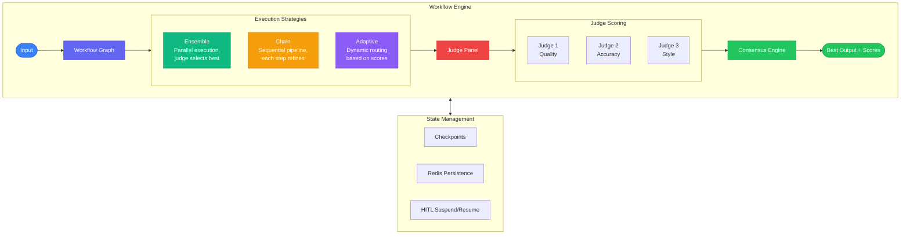
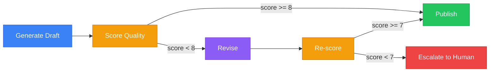

We designed NeuroLink's workflow engine to orchestrate multi-model pipelines where different AI providers handle different stages, and a judge model scores the outputs. This deep dive examines the DAG-based execution model, the scoring and selection algorithms, how we handle partial failures in multi-step workflows, and the cost-quality trade-offs of judge-based consensus.

NeuroLink's workflow engine provides exactly this: a system for orchestrating multiple LLM calls into structured pipelines with judge-based scoring and consensus mechanisms. Instead of one model producing one answer, you can have multiple models produce competing answers, judge panels that evaluate quality, and adaptive routing that escalates to more capable models only when needed.

This deep dive covers the three execution strategies (Ensemble, Chain, Adaptive), multi-judge consensus voting, workflow graph construction, checkpointing for suspend/resume, and production patterns for cost-aware orchestration.

## Workflow Engine Architecture

The workflow engine coordinates multiple models through configurable strategies, with scoring and consensus mechanisms that determine which output to accept:



The three core strategies serve different needs:

- **Ensemble**: Multiple models process the same input in parallel. A judge (or panel) evaluates all outputs and selects the best. Maximum quality, highest cost.
- **Chain**: Sequential pipeline where each step refines the previous output. Draft, critique, revise. Predictable quality improvement, moderate cost.
- **Adaptive**: Dynamic routing based on intermediate scores. Start with a cheap model; escalate to expensive models only if quality is insufficient. Best cost/quality balance.


## Ensemble Strategy: Parallel Execution with Judge Selection

The ensemble strategy sends the same prompt to multiple models simultaneously and uses a judge model to select the best response:

```typescript
import { NeuroLink } from '@juspay/neurolink';

const neurolink = new NeuroLink();

// Ensemble: same prompt to multiple models, judge picks best
async function ensembleGenerate(prompt: string): Promise<{
  bestResponse: string;
  scores: Record<string, number>;
  selectedModel: string;
}> {
  const models = [
    { provider: 'openai', model: 'gpt-4o' },
    { provider: 'anthropic', model: 'claude-sonnet-4-5-20250929' },
    { provider: 'vertex', model: 'gemini-2.5-pro' },
  ];

  // Execute all models in parallel
  const responses = await Promise.all(
    models.map(async (m) => {
      const result = await neurolink.generate({
        input: { text: prompt },
        provider: m.provider,
        model: m.model,
      });
      return { ...m, content: result.content };
    })
  );

  // Judge evaluates all responses
  const judgePrompt = `You are an expert judge. Rate each response on accuracy, completeness,
and clarity (1-10 each). Return JSON with scores.

Question: ${prompt}

${responses.map((r, i) => `Response ${i + 1} (${r.provider}/${r.model}):\n${r.content}`).join('\n\n')}

Return JSON: { "scores": [{"index": 0, "accuracy": N, "completeness": N, "clarity": N, "total": N}, ...], "best_index": N }`;

  const judgeResult = await neurolink.generate({
    input: { text: judgePrompt },
    provider: 'anthropic',
    model: 'claude-sonnet-4-5-20250929',
    temperature: 0,
  });

  const evaluation = JSON.parse(judgeResult.content);
  const bestIdx = evaluation.best_index;

  return {
    bestResponse: responses[bestIdx].content,
    scores: evaluation.scores,
    selectedModel: `${responses[bestIdx].provider}/${responses[bestIdx].model}`,
  };
}
```

**When to use Ensemble**: Content moderation (multiple models must agree before actioning), legal document review (catching errors requires multiple perspectives), and any scenario where a wrong answer has significant consequences.

**Cost consideration**: An ensemble of 3 models plus a judge costs roughly 4x a single model call. For high-stakes decisions, this is a bargain. For routine queries, it is wasteful.

> **Note:** Set `temperature: 0` on the judge model for deterministic, reproducible scoring. Judge consistency is critical -- the same inputs should produce the same quality assessment every time.
{: .prompt-info }


## Chain Strategy: Sequential Refinement

The chain strategy builds quality iteratively. Each step in the pipeline takes the previous step's output and improves it, like an editorial process:

```typescript
// Chain: sequential refinement pipeline
async function chainGenerate(prompt: string): Promise<string> {
  // Step 1: Generate initial draft (creative model)
  const draft = await neurolink.generate({
    input: { text: `Write a comprehensive response: ${prompt}` },
    provider: 'openai',
    model: 'gpt-4o',
    temperature: 0.8,
  });

  // Step 2: Critique the draft (analytical model)
  const critique = await neurolink.generate({
    input: { text: `Critique this draft for accuracy, clarity, and completeness.
List specific improvements needed:\n\n${draft.content}` },
    provider: 'anthropic',
    model: 'claude-sonnet-4-5-20250929',
    temperature: 0.3,
  });

  // Step 3: Revise based on critique
  const revised = await neurolink.generate({
    input: { text: `Revise this draft based on the critique below.
Original: ${draft.content}
Critique: ${critique.content}
Produce an improved version.` },
    provider: 'openai',
    model: 'gpt-4o',
    temperature: 0.5,
  });

  return revised.content;
}
```

The chain pattern works because different models (and different temperatures) excel at different parts of the writing process:

- **Step 1** (high temperature, creative model): Generates a broad, creative initial draft. The high temperature encourages diverse phrasing and ideas.
- **Step 2** (low temperature, analytical model): Applies structured critique. Claude's analytical strengths catch factual errors and logical gaps.
- **Step 3** (medium temperature): Synthesizes the draft and critique into a polished final version.

**When to use Chain**: Content generation (blog posts, reports, documentation), any workflow where iterative refinement improves quality, and situations where you want different specialized models at each stage.

## Adaptive Strategy: Cost-Aware Escalation

The adaptive strategy is the most cost-efficient approach. It starts with the cheapest model and only escalates to more expensive models when the cheap one's output does not meet the quality threshold:

```typescript
// Adaptive: escalate based on quality scores
async function adaptiveGenerate(prompt: string): Promise<string> {
  const modelTiers = [
    { provider: 'openai', model: 'gpt-4o-mini', threshold: 8 },  // Cheap, fast
    { provider: 'openai', model: 'gpt-4o', threshold: 7 },        // Mid-tier
    { provider: 'anthropic', model: 'claude-sonnet-4-5-20250929', threshold: 0 }, // Best, always accept
  ];

  for (const tier of modelTiers) {
    const result = await neurolink.generate({
      input: { text: prompt },
      provider: tier.provider,
      model: tier.model,
    });

    // Score the response
    const score = await scoreResponse(neurolink, prompt, result.content);

    if (score >= tier.threshold) {
      return result.content;
    }

    console.log(`${tier.provider}/${tier.model} scored ${score}, below threshold ${tier.threshold}. Escalating.`);
  }

  throw new Error('All tiers failed to meet quality threshold');
}

async function scoreResponse(neurolink: NeuroLink, question: string, answer: string): Promise<number> {
  const result = await neurolink.generate({
    input: { text: `Rate this answer from 1-10 on accuracy and completeness.
Question: ${question}
Answer: ${answer}
Respond with ONLY a number.` },
    provider: 'openai',
    model: 'gpt-4o-mini',
    temperature: 0,
  });
  return parseInt(result.content.trim(), 10);
}
```

The key insight: most queries (60-80%) are simple enough for `gpt-4o-mini`. Only the difficult ones escalate to `gpt-4o` or `claude-sonnet`. The scoring model (`gpt-4o-mini` at temperature 0) is cheap enough that adding a quality check to every response is affordable.

**Threshold tuning**: Start with thresholds of 8 for the cheapest tier and 7 for the mid tier. Monitor your escalation rate. If more than 40% of requests escalate past the first tier, either lower the threshold or improve your prompts for the cheaper model.

**When to use Adaptive**: Customer support (simple questions answered cheaply, complex ones escalated), data extraction (most documents are straightforward, edge cases get better models), and any high-volume workload where cost matters.

## Multi-Judge Consensus Voting

For the highest-stakes decisions, a single judge is not enough. Multi-judge consensus uses multiple independent judges to evaluate the same output:

### 3-Judge Panel

```typescript
async function threeJudgeConsensus(
  question: string,
  answer: string
): Promise<{ approved: boolean; scores: number[]; average: number }> {
  const judges = [
    { provider: 'openai', model: 'gpt-4o' },
    { provider: 'anthropic', model: 'claude-sonnet-4-5-20250929' },
    { provider: 'vertex', model: 'gemini-2.5-pro' },
  ];

  const judgePrompt = `Rate this answer from 1-10 for accuracy and helpfulness.
Question: ${question}
Answer: ${answer}
Respond with ONLY a number between 1 and 10.`;

  const scores = await Promise.all(
    judges.map(async (j) => {
      const result = await neurolink.generate({
        input: { text: judgePrompt },
        provider: j.provider,
        model: j.model,
        temperature: 0,
      });
      return parseInt(result.content.trim(), 10);
    })
  );

  const average = scores.reduce((a, b) => a + b, 0) / scores.length;
  const approvedCount = scores.filter(s => s >= 7).length;

  return {
    approved: approvedCount >= 2, // Majority must approve
    scores,
    average,
  };
}
```

The 3-judge panel requires majority agreement (2 out of 3 judges scoring 7 or above). By using judges from different providers (OpenAI, Anthropic, Google), you reduce the risk of provider-specific biases affecting the evaluation.

### 5-Judge Panel with Weighted Scoring

For even higher assurance, a 5-judge panel with different scoring criteria provides multi-dimensional quality assessment:

- **Accuracy judge**: Is the information factually correct?
- **Completeness judge**: Does the answer address all parts of the question?
- **Clarity judge**: Is the answer easy to understand?
- **Relevance judge**: Does the answer stay on topic?
- **Safety judge**: Does the answer avoid harmful or misleading content?

Each criterion can be weighted differently based on your use case. A medical information system might weight accuracy at 3x and safety at 2x, while a creative writing assistant might weight clarity and relevance higher.

Confidence intervals based on score variance provide additional signal: if all five judges agree (low variance), confidence is high. If judges disagree significantly (high variance), the answer likely needs human review regardless of the average score.

## Workflow Graph Construction

Complex workflows need conditional branching: if the score is good enough, publish; if not, revise; if revision still fails, escalate to a human:



This workflow graph implements a quality-gated publishing pipeline:

1. **Generate**: Create initial content with a creative model.
2. **Score**: Evaluate quality with a judge model.
3. **Branch**: If the score meets the publish threshold (8+), publish immediately. If not, revise.
4. **Revise**: Use the chain pattern to improve the content.
5. **Re-score**: Evaluate the revised content with a lower threshold (7+).
6. **Escalate**: If revision still does not meet the threshold, route to a human editor.

The lower threshold after revision (7 vs. 8) acknowledges that the revision step already improved the content, so the quality bar can be slightly lower.

## Checkpointing and HITL Suspend/Resume

Long-running workflows need the ability to save state at each step, pause for human review, and resume from any checkpoint:

```typescript
interface WorkflowCheckpoint {
  workflowId: string;
  step: string;
  state: Record<string, unknown>;
  timestamp: Date;
  status: 'completed' | 'pending_review' | 'failed';
}

class CheckpointedWorkflow {
  private checkpoints: WorkflowCheckpoint[] = [];

  async checkpoint(step: string, state: Record<string, unknown>): Promise<void> {
    this.checkpoints.push({
      workflowId: this.id,
      step,
      state,
      timestamp: new Date(),
      status: 'completed',
    });
    // Persist to Redis or database
    await this.store.save(this.id, this.checkpoints);
  }

  async suspendForReview(step: string, state: Record<string, unknown>): Promise<void> {
    this.checkpoints.push({
      workflowId: this.id,
      step,
      state,
      timestamp: new Date(),
      status: 'pending_review',
    });
    await this.store.save(this.id, this.checkpoints);
    // Workflow pauses here until human approves
  }

  async resumeFrom(step: string): Promise<Record<string, unknown>> {
    const checkpoint = this.checkpoints.find(c => c.step === step);
    if (!checkpoint) throw new Error(`Checkpoint not found: ${step}`);
    return checkpoint.state;
  }
}
```

Checkpointing provides three critical capabilities:

- **Recovery**: If the process crashes during step 4 of a 6-step workflow, you can resume from step 4 instead of starting over (and paying for steps 1-3 again).
- **Human review**: Designate specific steps as requiring human approval. The workflow suspends, notifies a reviewer, and resumes when they approve.
- **Auditability**: The checkpoint history is a complete record of every intermediate state, useful for debugging and compliance.

## Redis Persistence for Workflow State

For production workflows, checkpoints should be persisted in Redis for durability across process restarts and distributed execution:

- **Durability**: Redis persistence (RDB or AOF) ensures workflow state survives process crashes.
- **Distribution**: Multiple workers can process different steps of the same workflow by reading shared state from Redis.
- **TTL**: Set TTL on workflow keys to automatically clean up completed or abandoned workflows.
- **Monitoring**: Redis provides built-in tools for monitoring key counts, memory usage, and access patterns.

## Scoring Functions and Confidence Tracking

Beyond simple 1-10 ratings, production scoring functions assess multiple quality dimensions:

- **Faithfulness**: Does the output faithfully represent the input data? Critical for RAG applications.
- **Answer relevance**: Does the output actually answer the question asked? Prevents tangential responses.
- **Context relevance**: Are the retrieved contexts relevant to the query? Measures retrieval quality.
- **Confidence tracking**: Monitor scores over time to detect model degradation. If average scores drop by more than 0.5 points over a week, investigate.

These metrics follow the RAGAS evaluation framework and can be computed automatically for every workflow execution, feeding into quality dashboards that alert you to regressions.

## Cost Optimization in Multi-Model Workflows

Multi-model workflows are inherently more expensive than single-model calls. Here are strategies to manage costs:

- **Adaptive first**: Use the adaptive strategy as your default. Most requests resolve at the cheapest tier.
- **Cache judge results**: If the same input produces the same output, the judge score will be the same. Cache scoring results by content hash.
- **Batch judging**: Instead of judging each response individually, batch multiple responses into a single judge call.
- **Skip judging for low-stakes**: Not every response needs quality verification. Route routine queries directly to a single model.
- **Budget per workflow**: Set a token budget per workflow execution. If the budget is exceeded (due to retries or escalation), fail the workflow rather than running up costs.

## When to Use Workflows vs. Agents vs. Direct Calls

| Scenario | Best Approach | Why |
|----------|--------------|-----|
| Simple Q&A | Direct `generate()` | Single model is sufficient |
| Multi-step task with tools | Agent | Needs tool use and iteration |
| Quality-critical output | Ensemble workflow | Multiple models verify each other |
| Iterative content creation | Chain workflow | Sequential refinement |
| Cost-sensitive with quality needs | Adaptive workflow | Escalate only when needed |
| Team coordination | Multi-agent network | Multiple specialists collaborate |

The decision framework is simple: if a single call is enough, use `generate()`. If the task needs tools and iteration, use an agent. If the output needs verification or multiple perspectives, use a workflow. If the domain needs multiple specialized functions, use multiple agents.

## Production Example: Content Moderation Pipeline

A practical application of the workflow engine: a content moderation pipeline where user-generated content goes through multi-model review:

1. **Fast screening** (Gemini Flash): Quick toxicity check. 95% of benign content passes immediately.
2. **Detailed analysis** (GPT-4o): Content flagged by screening gets deeper analysis for nuance, sarcasm, and context.
3. **3-Judge consensus**: Borderline content goes to a 3-judge panel. Majority vote determines the outcome.
4. **HITL escalation**: Content where judges disagree (high variance) gets routed to a human moderator with the judge scores and reasoning.

This pipeline processes 95% of content at the cost of a single cheap model call, while ensuring that borderline and complex cases get the scrutiny they deserve. The 3-judge consensus provides a defensible, auditable moderation decision for disputed content.

## What's Next

The architecture decisions we have described represent trade-offs that worked for our scale and constraints. The key engineering insights to take away: start with the simplest design that handles your current load, instrument everything so you can identify bottlenecks before they become outages, and resist premature abstraction until you have at least three concrete use cases demanding it. The implementation details will differ for your system, but the underlying constraints -- latency budgets, failure domains, resource contention -- are universal.

---

**Related posts:**

- [Building AI Agents with NeuroLink: From Chatbot to Autonomous System](/posts/building-ai-agents/)
- [Event-Driven AI: Building Reactive Systems with NeuroLink](/posts/event-driven-ai/)
- [The Middleware System: Analytics, Guardrails, and Custom Pipelines](/posts/middleware-system/)
