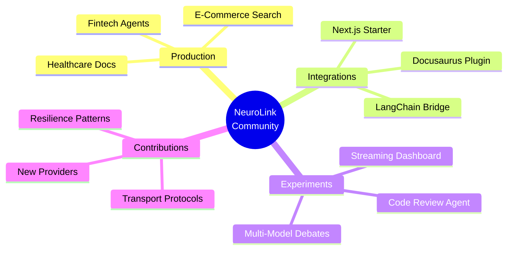

In this guide, you will explore real-world projects built by the NeuroLink community. Each showcase includes the technical architecture, implementation patterns, and lessons learned -- giving you practical inspiration and proven patterns for your own NeuroLink applications.

NeuroLink started as an internal tool at Juspay for unifying AI provider access across their payment platform. Today, it powers AI applications across industries -- e-commerce, healthcare, agriculture, education, and more. What follows is a curated look at what the community has shipped.

## Community Ecosystem



## Production Deployments

These projects demonstrate NeuroLink running in production environments, serving real users at scale.

### Fintech AI Assistant

A payment orchestration company built a customer-facing AI chat assistant using NeuroLink's multi-provider failover to ensure 99.99% uptime. The assistant handles account inquiries, transaction disputes, and payment guidance across multiple channels.

The key architectural decision was using `createAIProviderWithFallback` with Bedrock as the primary provider and Vertex as the fallback. When Bedrock experiences latency spikes or outages, the system automatically fails over to Vertex with zero user-visible disruption. Circuit breakers prevent cascade failures, and the failover logic is transparent to the application layer.

**Key metrics reported by the team:**

| Metric | Value |
|---|---|
| Monthly active conversations | 500K+ |
| Provider failover events | ~12/month |
| Average response time | 1.8 seconds |
| Uptime (12-month rolling) | 99.99% |

The team reported that NeuroLink's provider abstraction saved them approximately 3 months of engineering effort compared to building direct provider integrations with custom failover logic.

### E-Commerce Product Search

A large e-commerce platform built a semantic product search system using NeuroLink's RAG pipeline. Instead of traditional keyword matching, customers can search for products using natural language -- "comfortable running shoes for flat feet under $100" returns relevant results ranked by semantic similarity.

The pipeline processes 500K+ product descriptions using NeuroLink's `MarkdownChunker` and `SemanticMarkdownChunker`. Product data is chunked, embedded, and stored in a vector database. At query time, the RAG pipeline retrieves relevant products, reranks them, and generates a natural language summary of the top results.

The semantic search approach improved click-through rates by an estimated 23% compared to the previous keyword-based system, according to the team's A/B testing data.

### Healthcare Documentation

A healthcare technology company integrated NeuroLink's MCP system to power tool-augmented clinical note generation. Clinicians dictate notes during patient visits, and the AI assistant structures them into standardized clinical documentation -- pulling relevant patient history, lab results, and medication lists through MCP tool calls.

The system uses the stdio transport for HIPAA-compliant local tool execution. All patient data stays on-premise; only de-identified queries are sent to the AI provider. The MCP tool architecture ensures clear boundaries between the AI model and sensitive health data.

## Open-Source Integrations

Community members have built bridges between NeuroLink and popular frameworks, making it easier for new developers to adopt the SDK within their existing stacks.

### NeuroLink + Next.js Starter

A full-stack AI application template that demonstrates NeuroLink's streaming API with React Server Components. The starter includes:

- Server-side streaming with `neurolink.stream()` piped to the client
- React components that render streaming tokens in real-time
- Provider selection UI for comparing responses across models
- Session management with conversation memory

The template has been forked over 200 times on GitHub and serves as the starting point for many community projects.

### NeuroLink + LangChain Bridge

An adapter that lets LangChain users swap in NeuroLink providers without rewriting their chains. The bridge maps LangChain's `BaseLLM` interface to NeuroLink's `BaseProvider` contract, giving LangChain users access to NeuroLink's 13 providers, failover logic, and middleware pipeline.

This is particularly useful for teams that have existing LangChain applications and want to adopt NeuroLink's provider management without a full migration.

### NeuroLink + Docusaurus Plugin

An automated documentation search plugin powered by NeuroLink's RAG pipeline. The plugin indexes Docusaurus documentation at build time, and visitors can ask questions in natural language. The same RAG pipeline architecture that powers NeuroLink's own documentation search is packaged as a reusable plugin.

## Creative Experiments

Some of the most interesting community projects are experiments that push the boundaries of what multi-provider AI can do.

### Multi-Provider Debate Bot

This project uses four different providers simultaneously -- OpenAI, Anthropic, Vertex, and Bedrock -- to generate "debates" between AI models on any topic. Each model argues its position independently, and a fifth model (the "moderator") scores the arguments.

The implementation demonstrates NeuroLink's uniform API surface. The same code creates providers for four different services and generates responses in parallel:

```typescript
import { createAIProvider } from '@juspay/neurolink';

const providers = await Promise.all([
  createAIProvider('openai', 'gpt-4o'),
  createAIProvider('anthropic', 'claude-sonnet-4-5-20250929'),
  createAIProvider('vertex', 'gemini-2.5-flash'),
]);

const topic = 'Should AI systems be open source?';

const responses = await Promise.all(
  providers.map(provider =>
    provider.generate({
      input: { text: `Argue your position on: ${topic}` },
      temperature: 0.8,
    })
  )
);

responses.forEach((r, i) => {
  console.log(`\n--- ${r.provider} (${r.model}) ---`);
  console.log(r.content);
});
```

The debate bot has been used by AI researchers to compare model reasoning styles, identify provider-specific biases, and test prompt sensitivity across models. The creator reported interesting findings: models from different providers consistently emphasize different aspects of the same topic, making the debates genuinely informative rather than repetitive.

### AI Code Review Agent

An MCP-powered agent that reads codebases, runs tests, and provides code review feedback. The agent uses external MCP server integration with `ExternalServerManager` to connect to filesystem tools, git tools, and test runners.

Given a pull request, the agent:

1. Reads the changed files using filesystem MCP tools
2. Analyzes code quality, naming conventions, and potential bugs
3. Runs the existing test suite and reports results
4. Generates a structured review with specific line-level comments

The project demonstrates how MCP enables AI agents to interact with developer tools in a standardized way, without custom tool implementations for each IDE or CI system.

### Streaming Visualization Dashboard

A real-time visualization of streaming token delivery across providers. Built on NeuroLink's `StreamHandler` events, the dashboard shows:

- Token-by-token delivery timing for each provider
- First-token latency comparison
- Throughput (tokens per second) over time
- Visual diff of how different models generate the same content

The visualization revealed interesting patterns: some providers deliver tokens in bursts (10-20 tokens at a time), while others stream more uniformly. Claude tends to "think" longer before starting to stream, then delivers at a steady rate. GPT models start streaming earlier but with more variable inter-token timing.

## Community Contributions

Beyond building projects on NeuroLink, community members have contributed directly to the codebase. Here are some of the most impactful contributions:

### OpenRouter Provider Addition

A community contributor added OpenRouter as a provider, instantly giving NeuroLink access to 300+ models through a single integration. The contribution followed the `BaseProvider` pattern and included full streaming support, tool calling, and error handling.

This was the largest provider contribution from the community, and it demonstrated that the provider abstraction is well-designed enough for external contributors to implement without close guidance from the core team.

### OAuth 2.1 Support for MCP HTTP Transport

A security-focused contributor added OAuth 2.1 with PKCE support for the MCP HTTP transport protocol. This enables secure, token-based authentication for remote MCP servers -- critical for enterprise deployments where MCP tools are hosted as microservices.

The implementation includes PKCE code verification, token refresh, and bearer authentication. It follows the OAuth 2.1 specification closely and was reviewed by the core team's security engineers.

### Circuit Breaker Resilience Patterns

An infrastructure engineer contributed the `MCPCircuitBreaker` with configurable thresholds, bringing production-grade resilience to MCP tool calls. The circuit breaker tracks failure rates per MCP server and automatically stops calling a failing server to prevent cascade failures.

The contribution included comprehensive tests, configurable failure thresholds, and automatic recovery after a cooldown period.

## Community Contribution Flow


## Building a RAG Pipeline with NeuroLink

One of the most popular community use cases is building RAG (Retrieval-Augmented Generation) pipelines. Here is the pattern that many community projects follow:

```typescript
import { RAGPipeline } from '@juspay/neurolink';

const pipeline = new RAGPipeline({
  embeddingModel: { provider: 'openai', modelName: 'text-embedding-3-small' },
  generationModel: { provider: 'openai', modelName: 'gpt-4o-mini' },
  enableHybridSearch: true,
  defaultChunkingStrategy: 'semantic-markdown',
});

await pipeline.initialize();
await pipeline.ingest(['./docs/api.md', './docs/guides.md']);

const response = await pipeline.query('How do I configure streaming?', {
  hybrid: true,
  rerank: true,
  includeSources: true,
});

console.log(response.answer);
console.log('Sources:', response.sources.map(s => s.metadata?.source));
```

The `RAGPipeline` class encapsulates the full pipeline: document ingestion, chunking, embedding, vector storage, retrieval, reranking, and generation. The hybrid search option combines vector similarity with BM25 keyword matching for better retrieval quality.

Community projects have used this pattern for:

- **Documentation search**: Indexing product documentation for natural language Q&A
- **Knowledge management**: Building internal wikis with AI-powered search
- **Customer support**: RAG-powered chatbots grounded in product knowledge bases
- **Research assistants**: Indexing research papers for literature review

## How to Get Featured

We feature community projects in the showcase on a rolling basis. To submit your project:

1. **Submit via GitHub Discussions**: Open a discussion in the "Show and Tell" category with a description of your project
2. **Criteria**: Your project should use NeuroLink in a meaningful way, have a public repository or demo, and include a brief write-up explaining the architecture
3. **Monthly spotlight**: Outstanding projects are featured in the monthly community newsletter

We are especially interested in:

- Production deployments with real-world metrics
- Novel integrations with popular frameworks
- Creative experiments that demonstrate unexpected capabilities
- Contributions to the core codebase

## What's Next

You have completed all the steps in this guide. To continue building on what you have learned:

1. Review the code examples and adapt them for your specific use case
2. Start with the simplest pattern first and add complexity as your requirements grow
3. Monitor performance metrics to validate that each change improves your system
4. Consult the NeuroLink documentation for advanced configuration options

---

**Related posts:**

- [Contributing to NeuroLink: A Complete Guide](/posts/community-contributions/)
- [Getting Started with NeuroLink: Your First AI App in 5 Minutes](/posts/getting-started-first-ai-app/)
- [EU AI Act Compliance: Building Regulation-Ready AI Applications](/posts/eu-ai-act-compliance/)
