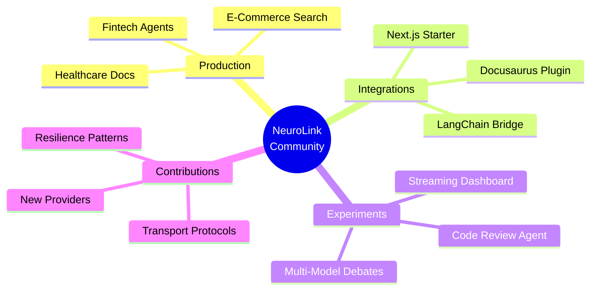

In this guide, you will explore real-world projects built by the NeuroLink community. Each showcase includes the technical architecture, implementation patterns, and lessons learned -- giving you practical inspiration and proven patterns for your own NeuroLink applications.

NeuroLink was built at Juspay to unify AI provider access across their payments infrastructure, and it continues to power internal AI applications there, including Tara, Yama, and Clairvoyance. Beyond Juspay, developers have picked it up for their own projects. What follows is a curated look at patterns the community has explored.

## Community Ecosystem


```mermaid
mindmap
  root((NeuroLink<br/>Community))
    Production
      Fintech Agents
      E-Commerce Search
      Healthcare Docs
    Integrations
      Next.js Starter
      LangChain Bridge
      Docusaurus Plugin
    Experiments
      Multi-Model Debates
      Code Review Agent
      Streaming Dashboard
    Contributions
      New Providers
      Transport Protocols
      Resilience Patterns
```

## Production Deployments

These projects demonstrate NeuroLink running in production environments, serving real users at scale.

### Fintech AI Assistant

A common pattern for payments and fintech teams is a customer-facing AI chat assistant that leans on NeuroLink's multi-provider failover to stay resilient to a single provider's outages. Such an assistant might handle account inquiries, transaction disputes, and payment guidance across multiple channels.

The key architectural decision is using `createAIProviderWithFallback` with Bedrock as the primary provider and Vertex as the fallback. When Bedrock experiences latency spikes or outages, the system automatically fails over to Vertex with minimal user-visible disruption. Circuit breakers prevent cascade failures, and the failover logic stays transparent to the application layer.

### E-Commerce Product Search

Semantic product search is another pattern well suited to NeuroLink's RAG pipeline. Instead of traditional keyword matching, customers can search for products using natural language -- "comfortable running shoes for flat feet under $100" -- and get results ranked by semantic similarity rather than exact keyword overlap.

The pipeline chunks product descriptions with NeuroLink's `MarkdownChunker` or `SemanticMarkdownChunker`, embeds them, and stores them in a vector database. At query time, the RAG pipeline retrieves relevant products, reranks them, and generates a natural language summary of the top results.

Search like this generally handles long-tail, conversational queries better than pure keyword matching, since it captures intent rather than exact term overlap.

### Healthcare Documentation

Tool-augmented clinical note generation is a pattern some teams have explored with NeuroLink's MCP system: clinicians dictate notes during a visit, and an AI assistant structures them into documentation -- pulling relevant patient history, lab results, and medication lists through MCP tool calls.

Using the stdio transport keeps tool execution local rather than routed through a remote server, so only de-identified queries need to reach the AI provider. This kind of MCP tool architecture creates a clear boundary between the AI model and sensitive data, though teams handling regulated health data are responsible for their own compliance review -- NeuroLink itself does not carry a HIPAA certification.

## Open-Source Integrations

Community members have built bridges between NeuroLink and popular frameworks, making it easier for new developers to adopt the SDK within their existing stacks.

### NeuroLink + Next.js Starter

A full-stack AI application template that demonstrates NeuroLink's streaming API with React Server Components. The starter includes:

- Server-side streaming with `neurolink.stream()` piped to the client
- React components that render streaming tokens in real-time
- Provider selection UI for comparing responses across models
- Session management with conversation memory

The template serves as a starting point for community projects that want NeuroLink's streaming API wired into a Next.js app with React Server Components out of the box.

### NeuroLink + LangChain Bridge

An adapter that lets LangChain users swap in NeuroLink providers without rewriting their chains. The bridge maps LangChain's `BaseLLM` interface to NeuroLink's `BaseProvider` contract, giving LangChain users access to NeuroLink's full lineup of LLM providers, failover logic, and middleware pipeline.

This is particularly useful for teams that have existing LangChain applications and want to adopt NeuroLink's provider management without a full migration.

### NeuroLink + Docusaurus Plugin

An automated documentation search plugin powered by NeuroLink's RAG pipeline. The plugin indexes Docusaurus documentation at build time, and visitors can ask questions in natural language. The same RAG pipeline architecture that powers NeuroLink's own documentation search is packaged as a reusable plugin.

## Creative Experiments

Some of the most interesting community projects are experiments that push the boundaries of what multi-provider AI can do.

### Multi-Provider Debate Bot

This project uses several providers simultaneously -- OpenAI, Anthropic, and Vertex, extendable to more -- to generate "debates" between AI models on any topic. Each model argues its position independently.

The implementation demonstrates NeuroLink's uniform API surface. The same code creates providers for multiple services and generates responses in parallel; extending the pattern with one more `generate()` call lets a separate model act as a "moderator" that scores the arguments:

```typescript
import { createAIProvider } from '@juspay/neurolink';

const providers = await Promise.all([
  createAIProvider('openai', 'gpt-5.4'),
  createAIProvider('anthropic', 'claude-sonnet-4-5-20250929'),
  createAIProvider('vertex', 'gemini-2.5-flash'),
]);

const topic = 'Should AI systems be open source?';

const responses = await Promise.all(
  providers.map(provider =>
    provider.generate({
      input: { text: `Argue your position on: ${topic}` },
      temperature: 0.8,
    })
  )
);

responses.forEach((r, i) => {
  console.log(`\n--- ${r.provider} (${r.model}) ---`);
  console.log(r.content);
});
```

A tool like this can help AI researchers compare model reasoning styles, surface provider-specific biases, and test prompt sensitivity across models -- since models from different providers often emphasize different aspects of the same topic, the resulting debates tend to be informative rather than repetitive.

### AI Code Review Agent

Here is a pattern for an MCP-powered agent that reads codebases, runs tests, and provides code review feedback, using external MCP server integration with `ExternalServerManager` to connect to filesystem tools, git tools, and test runners.

Given a pull request, an agent built this way would:

1. Read the changed files using filesystem MCP tools
2. Analyze code quality, naming conventions, and potential bugs
3. Run the existing test suite and report results
4. Generate a structured review with specific line-level comments

This pattern shows how MCP lets AI agents interact with developer tools in a standardized way, without custom tool implementations for each IDE or CI system.

### Streaming Visualization Dashboard

A real-time visualization of streaming token delivery across providers. Built by timestamping the chunks NeuroLink's streaming API (`neurolink.stream()` / `provider.stream()`) yields for each provider, a dashboard like this could show:

- Token-by-token delivery timing for each provider
- First-token latency comparison
- Throughput (tokens per second) over time
- Visual diff of how different models generate the same content

Streaming behavior can vary noticeably across providers -- some tend to deliver tokens in bursts, while others stream more uniformly -- which is exactly the kind of difference a visualization like this is built to surface.

## Community Contributions

Beyond building projects on NeuroLink, the codebase itself has grown a number of capabilities aimed squarely at making community and third-party integration easier. A few worth knowing about:

### OpenRouter Provider Support

NeuroLink includes an OpenRouter provider, giving access to 300+ models from many upstream providers through a single integration. It follows the same `BaseProvider` pattern as every other provider, with full streaming support, tool calling, and error handling -- the same pattern external contributors can follow to add a new provider without deep changes elsewhere in the codebase.

### OAuth 2.1 Support for MCP HTTP Transport

NeuroLink's MCP HTTP transport supports OAuth 2.1 with PKCE, enabling token-based authentication for remote MCP servers -- useful for deployments where MCP tools are hosted as separate services. The implementation covers PKCE code verification, token refresh, and bearer authentication, following the OAuth 2.1 specification.

### Circuit Breaker Resilience Patterns

`MCPCircuitBreaker` brings configurable-threshold circuit breaking to MCP tool calls: it tracks failure rates per MCP server and stops calling a server that is failing, to prevent cascade failures, with automatic recovery after a cooldown period.

## Community Contribution Flow


```mermaid
flowchart LR
    A["Idea / Bug"] --> B["GitHub Issue"]
    B --> C["Fork & Branch"]
    C --> D["Pull Request"]
    D --> E["Code Review"]
    E --> F["Merged"]
    F --> G["Featured in Showcase"]
    style A fill:#0f4c75,stroke:#1b262c,color:#fff
    style D fill:#3282b8,stroke:#1b262c,color:#fff
    style G fill:#00b4d8,stroke:#1b262c,color:#fff
```

## Building a RAG Pipeline with NeuroLink

One of the most popular community use cases is building RAG (Retrieval-Augmented Generation) pipelines. Here is the pattern that many community projects follow:

```typescript
import { RAGPipeline } from '@juspay/neurolink';

const pipeline = new RAGPipeline({
  embeddingModel: { provider: 'openai', modelName: 'text-embedding-3-small' },
  generationModel: { provider: 'openai', modelName: 'gpt-5.4-mini' },
  enableHybridSearch: true,
  defaultChunkingStrategy: 'semantic-markdown',
});

await pipeline.initialize();
await pipeline.ingest(['./docs/api.md', './docs/guides.md']);

const response = await pipeline.query('How do I configure streaming?', {
  hybrid: true,
  rerank: true,
  includeSources: true,
});

console.log(response.answer);
console.log('Sources:', response.sources.map(s => s.metadata?.source));
```

The `RAGPipeline` class encapsulates the full pipeline: document ingestion, chunking, embedding, vector storage, retrieval, reranking, and generation. The hybrid search option combines vector similarity with BM25 keyword matching for better retrieval quality.

Community projects have used this pattern for:

- **Documentation search**: Indexing product documentation for natural language Q&A
- **Knowledge management**: Building internal wikis with AI-powered search
- **Customer support**: RAG-powered chatbots grounded in product knowledge bases
- **Research assistants**: Indexing research papers for literature review

## How to Get Featured

We feature community projects in the showcase on a rolling basis. To submit your project:

1. **Submit via GitHub Discussions**: Open a discussion in the "Show and Tell" category with a description of your project
2. **Criteria**: Your project should use NeuroLink in a meaningful way, have a public repository or demo, and include a brief write-up explaining the architecture
3. **Monthly spotlight**: Outstanding projects are featured in the monthly community newsletter

We are especially interested in:

- Production deployments with real-world metrics
- Novel integrations with popular frameworks
- Creative experiments that demonstrate unexpected capabilities
- Contributions to the core codebase

## What's Next

You have completed all the steps in this guide. To continue building on what you have learned:

1. Review the code examples and adapt them for your specific use case
2. Start with the simplest pattern first and add complexity as your requirements grow
3. Monitor performance metrics to validate that each change improves your system
4. Consult the NeuroLink documentation for advanced configuration options

---

**Related posts:**

- [Contributing to NeuroLink: A Complete Guide](/posts/community-contributions/)
- [Getting Started with NeuroLink: Your First AI App in 5 Minutes](/posts/getting-started-first-ai-app/)
- [EU AI Act Compliance: Building Regulation-Ready AI Applications](/posts/eu-ai-act-compliance/)
