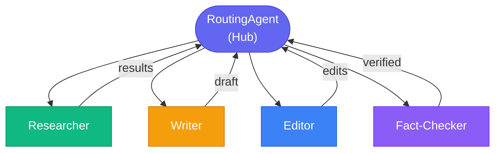
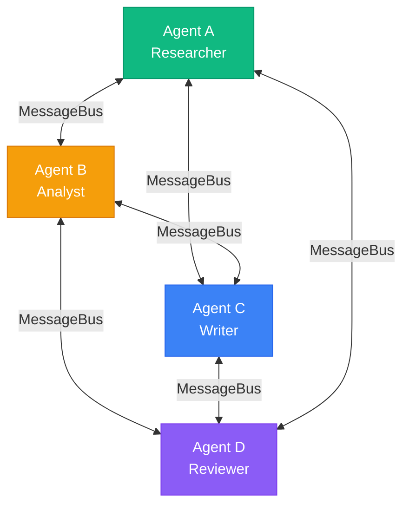
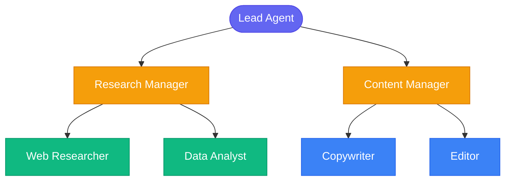
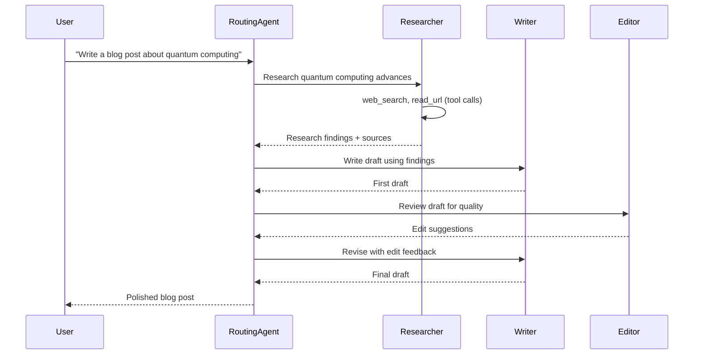

> **Important**: The multi-agent patterns in this post are custom implementation examples, not built-in NeuroLink SDK features. NeuroLink provides the underlying generation and tool-calling primitives (`generate()`, `stream()`, `registerTool()`) that you compose into agent architectures. The `RoutingAgent`, `MessageBus`, and network topologies shown here are patterns you implement in your own code.
{: .prompt-warning }

We designed NeuroLink's multi-agent network system to enable teams of specialized AI agents that collaborate, delegate, and coordinate on complex tasks. This deep dive examines the agent communication protocol, role-based task assignment, shared memory architecture, and the supervision patterns that prevent agent loops and resource exhaustion.

Real-world problems that demand multiple agents are everywhere: complex research pipelines, content creation workflows, customer support escalation systems, and code review processes. The challenge is not building individual agents -- it is coordinating them. How do agents communicate? How does one agent delegate work to another? How do you aggregate results from parallel agent executions?

This post covers NeuroLink's multi-agent orchestration capabilities in depth. You will learn how to choose the right network topology, implement a RoutingAgent for intelligent task delegation, build a MessageBus for inter-agent communication, and wire up a complete research-writer-editor pipeline. We also cover production concerns: monitoring, testing, error handling, and scaling.

> **Note:** This post builds on single-agent patterns covered in the [Building AI Agents](/posts/building-ai-agents/) guide. If you have not built a single agent with NeuroLink yet, start there first.
{: .prompt-info }

## Agent Network Topologies

Before writing code, you need to decide how your agents will be connected. The topology you choose determines communication patterns, latency characteristics, and failure domains. NeuroLink supports three primary topologies.

### Hub-Spoke Topology

In a hub-spoke topology, a central RoutingAgent coordinates all work. Every request flows through the hub, which classifies the task and delegates to the appropriate specialist. Results return to the hub for aggregation.



**Best for**: Clear task delegation, simple workflows where a single coordinator can manage all agents. This is the most common topology and the easiest to reason about. The hub becomes a single point of failure, but also a single point of observability -- you can log every decision the router makes.

### Mesh Topology

In a mesh topology, any agent can communicate with any other agent directly. There is no central coordinator. Agents discover each other through a shared MessageBus and send messages peer-to-peer.



**Best for**: Collaborative brainstorming, peer review scenarios, and workflows where agents need to negotiate or iterate with each other. The mesh gives maximum flexibility but is harder to debug because there is no single point of control.

### Hierarchical Topology

A hierarchical topology introduces manager agents that coordinate sub-teams. The lead agent delegates to managers, who in turn delegate to individual workers. This mirrors how large organizations operate.



**Best for**: Large-scale projects, enterprise workflows with clear domain boundaries. Each manager agent can be tested independently with its sub-team, and the system scales by adding more levels.


## Building an Agent Network

### Defining Specialized Agents

Each agent in a network has a distinct role defined by its system prompt, available tools, and the model that powers it. With NeuroLink, you define agent configurations as plain objects and invoke them through the unified `generate()` API.

```typescript
import { NeuroLink } from '@juspay/neurolink';
import { z } from 'zod';

const neurolink = new NeuroLink();

// Define agent roles with specialized system prompts and tools
const agents = {
  researcher: {
    systemPrompt: `You are a thorough research agent. Search for information, read sources,
and compile detailed findings. Always cite your sources.`,
    tools: ['web_search', 'read_url', 'save_findings'],
    provider: 'anthropic',
    model: 'claude-sonnet-4-5-20250929',
  },
  writer: {
    systemPrompt: `You are a skilled technical writer. Take research findings and produce
clear, engaging content. Follow the provided style guide.`,
    tools: ['get_findings', 'generate_outline', 'write_section'],
    provider: 'openai',
    model: 'gpt-4o',
  },
  editor: {
    systemPrompt: `You are a meticulous editor. Review content for clarity, accuracy,
grammar, and adherence to style guidelines. Provide specific revision suggestions.`,
    tools: ['get_draft', 'submit_edits', 'approve_content'],
    provider: 'anthropic',
    model: 'claude-sonnet-4-5-20250929',
  }
};
```

Notice that each agent uses a different model suited to its role. The researcher uses Claude Sonnet for thorough reasoning, the writer uses GPT-4o for creative generation, and the editor uses Claude Sonnet again for meticulous review. NeuroLink's provider-agnostic API makes this mix-and-match approach seamless.

### The RoutingAgent: Intelligent Task Delegation

The RoutingAgent is the brain of a hub-spoke network. It analyzes incoming requests, classifies them into task categories, and routes them to the appropriate specialist. Here is a straightforward implementation:

```typescript
// The routing agent decides which specialist to invoke
async function routeTask(task: string): Promise<string> {
  // Step 1: Classify the task
  const classification = await neurolink.generate({
    input: { text: `Classify this task into one of: research, writing, editing.
Task: ${task}
Respond with just the category name.` },
    provider: 'openai',
    model: 'gpt-4o',
    temperature: 0,
  });

  const category = classification.content.trim().toLowerCase();
  const agent = agents[category as keyof typeof agents];

  if (!agent) {
    throw new Error(`Unknown task category: ${category}`);
  }

  // Step 2: Execute with the specialized agent
  const result = await neurolink.generate({
    input: { text: task },
    systemPrompt: agent.systemPrompt,
    provider: agent.provider,
    model: agent.model,
  });

  return result.content;
}
```

The classification step uses `temperature: 0` for deterministic routing. The routing model can be a fast, cheap model (like GPT-4o-mini) since classification is a simple task. The actual work gets dispatched to the appropriate specialist model.

> **Note:** For production systems, add validation on the classification result. If the model returns an unexpected category, fall back to a default agent or return an error rather than crashing.
{: .prompt-warning }

## Inter-Agent Communication with MessageBus

When agents need to communicate beyond simple request-response patterns, you need a message bus. The MessageBus enables agents to send messages, broadcast updates, and coordinate asynchronously.

```typescript
// Simple MessageBus implementation for agent communication
interface AgentMessage {
  from: string;
  to: string;
  type: 'request' | 'result' | 'feedback';
  content: string;
  metadata?: Record<string, unknown>;
}

class MessageBus {
  private handlers = new Map<string, ((msg: AgentMessage) => Promise<void>)[]>();

  subscribe(agentId: string, handler: (msg: AgentMessage) => Promise<void>): void {
    const existing = this.handlers.get(agentId) || [];
    existing.push(handler);
    this.handlers.set(agentId, existing);
  }

  async send(message: AgentMessage): Promise<void> {
    const handlers = this.handlers.get(message.to) || [];
    for (const handler of handlers) {
      await handler(message);
    }
  }

  async broadcast(from: string, content: string): Promise<void> {
    for (const [agentId, handlers] of this.handlers) {
      if (agentId !== from) {
        for (const handler of handlers) {
          await handler({ from, to: agentId, type: 'request', content });
        }
      }
    }
  }
}
```

The MessageBus supports three message types: `request` (asking an agent to do work), `result` (returning completed work), and `feedback` (providing revision notes). Each agent subscribes to its own channel, and the bus routes messages to the correct handlers.

This pattern decouples agents from each other. The researcher does not need to know about the writer directly -- it just sends results to the bus, and the orchestrator routes them.

## Complete Example: Research-Writer-Editor Pipeline

Let us wire everything together into a complete pipeline. The flow is:

1. User submits a topic to the RoutingAgent
2. RoutingAgent delegates research to the Researcher
3. Researcher gathers findings and returns them
4. RoutingAgent passes findings to the Writer
5. Writer produces a draft
6. RoutingAgent sends the draft to the Editor
7. Editor provides revision notes
8. Writer revises based on feedback
9. Final polished content returns to the user



Here is the full implementation:

```typescript
import { NeuroLink } from '@juspay/neurolink';

const neurolink = new NeuroLink();

async function runContentPipeline(topic: string): Promise<string> {
  // Step 1: Research
  const research = await neurolink.generate({
    input: { text: `Research the following topic thoroughly. Find recent developments,
key facts, expert opinions, and statistics. Cite all sources.

Topic: ${topic}` },
    systemPrompt: agents.researcher.systemPrompt,
    provider: agents.researcher.provider,
    model: agents.researcher.model,
  });

  console.log('Research complete. Findings length:', research.content.length);

  // Step 2: Write draft
  const draft = await neurolink.generate({
    input: { text: `Using the following research findings, write a compelling blog post.
Include an introduction, 3-5 key sections, and a conclusion.

Research Findings:
${research.content}` },
    systemPrompt: agents.writer.systemPrompt,
    provider: agents.writer.provider,
    model: agents.writer.model,
  });

  console.log('Draft complete. Word count:', draft.content.split(' ').length);

  // Step 3: Editorial review
  const edits = await neurolink.generate({
    input: { text: `Review this blog post draft. Check for:
- Factual accuracy against the research
- Clarity and readability
- Grammar and style
- Missing important points
Provide specific revision suggestions.

Draft:
${draft.content}` },
    systemPrompt: agents.editor.systemPrompt,
    provider: agents.editor.provider,
    model: agents.editor.model,
  });

  // Step 4: Revision
  const finalDraft = await neurolink.generate({
    input: { text: `Revise this blog post based on the editor's feedback.
Apply all suggested changes while maintaining the overall structure.

Original Draft:
${draft.content}

Editor's Feedback:
${edits.content}` },
    systemPrompt: agents.writer.systemPrompt,
    provider: agents.writer.provider,
    model: agents.writer.model,
  });

  return finalDraft.content;
}

// Run the pipeline
const blogPost = await runContentPipeline('quantum computing advances in 2026');
console.log(blogPost);
```

Each step in the pipeline uses the appropriate specialist agent. The research step benefits from Claude Sonnet's thorough reasoning, the writing steps leverage GPT-4o's creative generation, and the editing step uses Claude Sonnet's precision.

## Using Different Models for Different Agents

One of the most powerful advantages of multi-agent networks is cost optimization through strategic model selection. Not every agent needs the most expensive model. Use fast, cheap models for simple tasks and reserve powerful models for complex reasoning.

```typescript
const agentModels = {
  router: { provider: 'openai', model: 'gpt-4o-mini' },        // Fast classification
  researcher: { provider: 'anthropic', model: 'claude-sonnet-4-5-20250929' }, // Thorough reasoning
  writer: { provider: 'openai', model: 'gpt-4o' },              // Creative generation
  factChecker: { provider: 'vertex', model: 'gemini-2.5-pro' }, // Grounded verification
};
```

NeuroLink's unified API makes model switching trivial. You change the `provider` and `model` fields, and everything else stays the same. No code refactoring, no different client libraries, no API format conversions.

Here is a cost comparison for a typical content pipeline processing 100 articles:

| Agent Role | Model | Cost per 1K tokens | Estimated Cost (100 articles) |
|---|---|---|---|
| Router | GPT-4o-mini | $0.00015 | $0.15 |
| Researcher | Claude Sonnet | $0.003 | $6.00 |
| Writer | GPT-4o | $0.0025 | $5.00 |
| Fact-Checker | Gemini 2.5 Pro | $0.00125 | $2.50 |
| **Total** | | | **$13.65** |

Using a single premium model for all roles would cost roughly 3-4x more with no quality improvement in the routing and fact-checking steps.

## Memory for Multi-Agent Systems

Multi-agent systems need careful memory management. There are three memory patterns to consider:

### Shared Context via Message Passing

The simplest approach: pass relevant data explicitly between agents as structured messages. Each agent receives exactly the context it needs.

```typescript
// Pass structured context between agents
const researchContext = {
  topic: 'quantum computing',
  findings: research.content,
  sources: research.metadata?.sources || [],
  timestamp: new Date().toISOString(),
};

const draft = await neurolink.generate({
  input: { text: `Write a blog post using this research context:
${JSON.stringify(researchContext, null, 2)}` },
  provider: 'openai',
  model: 'gpt-4o',
});
```

### Per-Agent Session Memory

Each agent maintains its own conversation history using separate session IDs. This lets agents build up context over multiple interactions without cross-contamination.

```typescript
// Each agent gets its own session for memory
const researchSession = `research-${Date.now()}`;
const writerSession = `writer-${Date.now()}`;

const neurolink = new NeuroLink({
  conversationMemory: { enabled: true },
});

// Researcher builds up context over multiple searches
const r1 = await neurolink.generate({
  input: { text: 'Search for quantum computing breakthroughs' },
  context: { sessionId: researchSession, userId: 'pipeline' },
  provider: 'anthropic',
  model: 'claude-sonnet-4-5-20250929',
});

const r2 = await neurolink.generate({
  input: { text: 'Now find specific applications in healthcare' },
  context: { sessionId: researchSession, userId: 'pipeline' },
  provider: 'anthropic',
  model: 'claude-sonnet-4-5-20250929',
});
```

### Global Shared State

For complex systems, use a shared data store that all agents can read from and write to via tools. This is the most flexible but requires careful access control.

## Error Handling in Agent Networks

When one agent in a chain fails, you need a strategy. Letting the entire pipeline crash on a single agent failure is unacceptable in production.

### Retry with Fallback

If an agent's primary model is unavailable, fall back to an alternative model:

```typescript
async function executeWithFallback(
  task: string,
  primaryConfig: { provider: string; model: string },
  fallbackConfig: { provider: string; model: string },
  systemPrompt: string,
): Promise<string> {
  try {
    const result = await neurolink.generate({
      input: { text: task },
      systemPrompt,
      provider: primaryConfig.provider,
      model: primaryConfig.model,
    });
    return result.content;
  } catch (error) {
    console.warn(`Primary model failed: ${error}. Falling back...`);
    const result = await neurolink.generate({
      input: { text: task },
      systemPrompt,
      provider: fallbackConfig.provider,
      model: fallbackConfig.model,
    });
    return result.content;
  }
}
```

### Timeout Management

Set timeouts for each agent in the chain. A researcher agent might need 30 seconds for web searches, while a classifier should respond in under 5 seconds:

```typescript
async function withTimeout<T>(promise: Promise<T>, ms: number, label: string): Promise<T> {
  const timeout = new Promise<never>((_, reject) =>
    setTimeout(() => reject(new Error(`${label} timed out after ${ms}ms`)), ms)
  );
  return Promise.race([promise, timeout]);
}

// Use per-agent timeouts
const research = await withTimeout(
  neurolink.generate({ input: { text: topic }, provider: 'anthropic', model: 'claude-sonnet-4-5-20250929' }),
  30000,
  'Researcher'
);
```

### Partial Result Handling

If the editor agent fails after the researcher and writer have succeeded, deliver the unedited draft rather than nothing. Partial results are often better than no results:

```typescript
let finalContent: string;

try {
  const edits = await executeAgent('editor', draft.content);
  finalContent = await executeAgent('writer', `Revise: ${edits}`);
} catch {
  console.warn('Editor/revision step failed. Returning unedited draft.');
  finalContent = draft.content;
}
```

## Testing Multi-Agent Systems

Testing multi-agent systems requires a layered approach: unit tests for individual agents, integration tests for agent chains, and end-to-end tests for complete pipelines.

### Unit Testing Individual Agents

Test each agent in isolation with mock tools:

```typescript
import { tool } from 'ai';
import { z } from 'zod';

describe('Research-Writer Pipeline', () => {
  it('produces content with citations', async () => {
    // Define tools using Vercel AI SDK format
    const webSearchTool = tool({
      description: 'Search the web',
      parameters: z.object({ query: z.string() }),
      execute: async () => [
        { title: 'Quantum Computing 2026', snippet: 'Latest advances...', url: 'https://example.com' }
      ]
    });

    const result = await runPipeline('Write about quantum computing');
    expect(result).toContain('quantum');
    expect(result).toContain('source');
  });
});
```

### Testing Routing Logic

The RoutingAgent's classification logic is critical. Test it with edge cases:

```typescript
describe('RoutingAgent', () => {
  it('routes research tasks correctly', async () => {
    const category = await classifyTask('Find recent papers on transformer architectures');
    expect(category).toBe('research');
  });

  it('routes writing tasks correctly', async () => {
    const category = await classifyTask('Write a blog post about our new feature');
    expect(category).toBe('writing');
  });

  it('handles ambiguous tasks', async () => {
    const category = await classifyTask('Improve the documentation');
    expect(['writing', 'editing']).toContain(category);
  });
});
```

### Integration Testing Agent Chains

Test the handoff between agents to verify that output from one agent is valid input for the next:

```typescript
describe('Agent Chain', () => {
  it('passes research findings to writer correctly', async () => {
    const research = await runResearcher('AI safety');
    expect(research).toBeTruthy();

    const draft = await runWriter(research);
    expect(draft.length).toBeGreaterThan(500);
    // Verify the draft references research content
    expect(draft.toLowerCase()).toContain('safety');
  });
});
```

## Production Monitoring for Agent Networks

Multi-agent systems need deeper observability than single-agent applications. You need to track not just individual agent performance but also the interactions between agents.

### Key Metrics to Track

- **Per-agent latency**: How long does each agent take? Identify bottlenecks.
- **Per-agent token usage**: Which agents consume the most tokens? Optimize costly agents.
- **Routing distribution**: What percentage of tasks go to each agent? Detect routing drift.
- **Agent failure rates**: Which agents fail most often? Add fallbacks where needed.
- **Pipeline completion rate**: What percentage of pipelines complete successfully end-to-end?

### OpenTelemetry Integration

Use OpenTelemetry to create traces that span multiple agents:

```typescript
// Enable telemetry for pipeline monitoring
// Set NEUROLINK_TELEMETRY_ENABLED=true
// Set OTEL_EXPORTER_OTLP_ENDPOINT=http://localhost:4317

// TelemetryService tracks per agent:
// - ai_requests_total (counter, with agent_role label)
// - ai_request_duration_ms (histogram)
// - ai_tokens_used_total (counter)
// - ai_provider_errors_total (counter)
```

### Dashboard Design

A production multi-agent dashboard should show:

1. **Pipeline overview**: Success/failure rates for the full pipeline
2. **Agent breakdown**: Latency, cost, and error rate per agent role
3. **Message flow**: Visualization of inter-agent messages
4. **Cost tracker**: Running cost for the current period with budget alerts
5. **Quality scores**: Auto-evaluation scores for final outputs

## What's Next

The architecture decisions we have described represent trade-offs that worked for our scale and constraints. The key engineering insights to take away: start with the simplest design that handles your current load, instrument everything so you can identify bottlenecks before they become outages, and resist premature abstraction until you have at least three concrete use cases demanding it. The implementation details will differ for your system, but the underlying constraints -- latency budgets, failure domains, resource contention -- are universal.

---

**Related posts:**

- [Orchestrating Supply Chain AI: Multi-Agent Logistics](/posts/orchestrating-supply-chain-ai/)
- [The Workflow Engine: Multi-Model Orchestration with Judge Scoring](/posts/workflow-engine/)
- [Function Calling: AI Tool Use Patterns with NeuroLink](/posts/function-calling-patterns/)
