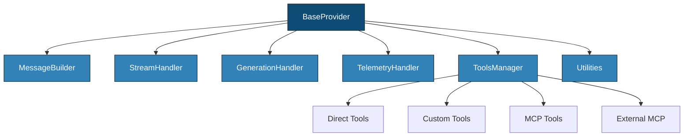
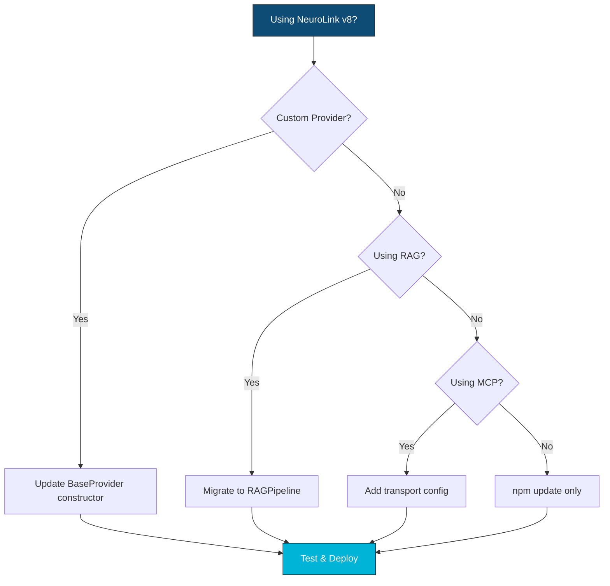

NeuroLink v9.0 is here, and it is our most significant release yet. This post covers every new feature, breaking change, and migration step -- so you can upgrade confidently and start using the new capabilities immediately.

After months of refactoring the internals while maintaining backward compatibility for common use cases, v9 delivers on the promise of a truly extensible AI SDK. Most applications will upgrade in under 30 minutes. This guide covers every headline feature, every breaking change, and step-by-step migration instructions.

## Headline Features

### Modular Core Architecture

The monolithic `BaseProvider` has been decomposed into six focused modules, each with a single responsibility:



| Module | Responsibility | Source Path |
|---|---|---|
| **MessageBuilder** | Message construction and formatting | `src/lib/core/modules/` |
| **StreamHandler** | Stream validation, text stream creation, analytics | `src/lib/core/modules/` |
| **GenerationHandler** | Generation execution, tool extraction, result formatting | `src/lib/core/modules/` |
| **TelemetryHandler** | Observability, tracing, metrics | `src/lib/core/modules/` |
| **ToolsManager** | Tool registration, discovery, execution | `src/lib/core/modules/` |
| **Utilities** | Timeout, middleware, validation | `src/lib/core/modules/` |

**Why this matters**: Each module can be tested, extended, and replaced independently. If you need custom message formatting for a specific provider, you override `MessageBuilder` without touching streaming logic. If you want to add custom telemetry, you extend `TelemetryHandler` without affecting generation. This is the Single Responsibility Principle applied to AI infrastructure.

For most users, this change is invisible -- the `BaseProvider` class still works as before, but now delegates to these focused modules internally. Custom provider authors benefit the most, as they can override specific behaviors without understanding the entire provider lifecycle.

### RAG Pipeline Orchestrator

End-to-end RAG is now available through a single class: `RAGPipeline`. Previously, building a RAG pipeline required manually assembling chunkers, embedders, vector stores, retrievers, and generators. v9 wraps this into a declarative API:

```typescript
import { RAGPipeline } from '@juspay/neurolink';

const pipeline = new RAGPipeline({
  embeddingModel: { provider: 'openai', modelName: 'text-embedding-3-small' },
  generationModel: { provider: 'openai', modelName: 'gpt-4o-mini' },
  enableHybridSearch: true,
  defaultChunkingStrategy: 'semantic-markdown',
});

await pipeline.initialize();
await pipeline.ingest(['./docs/api.md', './docs/guides.md']);

const response = await pipeline.query('How do I use streaming?');
console.log(response.answer);
```

The pipeline includes:

- **10 chunking strategies**: character, recursive, sentence, token, markdown, HTML, JSON, LaTeX, semantic, and semantic-markdown
- **Hybrid search**: Vector similarity combined with BM25 keyword matching, fused via Reciprocal Rank Fusion
- **Graph RAG**: Relationship-aware retrieval for interconnected documents
- **Built-in reranking**: Configurable reranking models for improved retrieval quality

### Four MCP Transport Protocols

MCP (Model Context Protocol) now supports four transport protocols, up from two in v8:

| Transport | Protocol | Best For |
|---|---|---|
| **stdio** | Standard I/O pipes | Local tools, CLI integration |
| **SSE** | Server-Sent Events | Real-time server communication |
| **WebSocket** | WebSocket | Bidirectional, long-lived connections |
| **Streamable HTTP** | HTTP with streaming | Stateless, scalable APIs |

New in v9:

- **OAuth 2.1 with PKCE** support for HTTP transport -- secure, token-based authentication for remote MCP servers
- **Circuit breaker** protection with configurable failure thresholds -- automatic isolation of failing MCP servers
- **Rate limiting** with token bucket algorithm -- prevent overloading external MCP services

### Provider Registry Pattern

The hardcoded provider switch statement has been replaced with a dynamic `ProviderFactory` + `ProviderRegistry` pattern:

- **Dynamic provider registration**: Add new providers at runtime without code changes
- **Aliases**: Register multiple names for the same provider (e.g., `"custom"` and `"my-ai"`)
- **Lazy loading**: Providers are loaded via dynamic imports only when first used
- **13 built-in providers**: Bedrock, OpenAI, Vertex, Anthropic, Azure, Google AI, HuggingFace, Ollama, Mistral, LiteLLM, SageMaker, OpenRouter, OpenAI-Compatible

## Breaking Changes

### Import Path Changes

Most users import from the top-level `@juspay/neurolink` package, and these imports remain stable:

```typescript
// These imports are unchanged in v9
import { NeuroLink } from '@juspay/neurolink';
import { createAIProvider, createAIProviderWithFallback, createBestAIProvider } from '@juspay/neurolink';
```

If you import from internal paths, some have moved:

- `AIProviderFactory` is re-exported from `@juspay/neurolink` (no deep import needed)
- `ProviderFactory` is the new low-level factory; `AIProviderFactory` is the high-level wrapper

> **Note:** If your imports all use `@juspay/neurolink` (the recommended pattern), you likely have zero import changes to make.
{: .prompt-info }

### BaseProvider Constructor Signature

If you have written a custom provider that extends `BaseProvider`, the constructor signature has changed:

```typescript
// v8 constructor
class MyProvider extends BaseProvider {
  constructor(modelName?: string, providerName?: string) {
    super(modelName, providerName);
  }
}

// v9 constructor
class MyProvider extends BaseProvider {
  constructor(
    modelName?: string,
    providerName?: string,
    neurolink?: NeuroLink,
    middleware?: NeuroLinkMiddleware[],
  ) {
    super(modelName, providerName, neurolink, middleware);
  }
}
```

The `neurolink` parameter enables MCP tool integration at the provider level. The `middleware` parameter enables per-provider middleware pipelines. Both parameters are optional -- if you do not use MCP or per-provider middleware, you can ignore them.

### Tool Registration API

`ToolsManager` now handles all tool types: direct, custom, MCP, and external MCP. The main change for users:

```typescript
// v8: getAllTools() was synchronous
const tools = provider.getAllTools();

// v9: getAllTools() is now async
const tools = await provider.getAllTools();
```

The `setupToolExecutor` function signature is unchanged, but the internal implementation now delegates to `ToolsManager`.

### Streaming Result Type

The `StreamResult` type now includes additional metadata:

```typescript
// v9 StreamResult includes provider and model fields
const result = await neurolink.stream({
  input: { text: "Hello" },
  provider: 'openai',
  model: 'gpt-4o',
});

// New fields available
console.log(result.provider); // 'openai'
console.log(result.model);    // 'gpt-4o'

// Stream access is unchanged
for await (const chunk of result.stream) {
  process.stdout.write(chunk.content);
}
```

> **Note:** Remember that the stream property is `result.stream`, not `result.textStream`. This has been consistent since v8 but is worth reiterating.
{: .prompt-warning }

### RAG Module Restructure

Chunkers have moved from function-based to class-based implementations:

```typescript
// v8: Direct function imports
import { recursiveChunker } from '@juspay/neurolink/rag/chunking';

// v9: Factory function (recommended)
import { createChunker } from '@juspay/neurolink';
const chunker = createChunker('recursive');

// v9: Registry access (alternative)
import { ChunkerRegistry } from '@juspay/neurolink';
const chunker = ChunkerRegistry.get('recursive');
```

The `ChunkerRegistry` and `ChunkerFactory` replace direct imports, providing a more consistent and extensible pattern for accessing chunking strategies.

## Step-by-Step Migration

### Migration Decision Tree

Use this decision tree to determine how much migration work you need:



Most users fall into the "npm update only" path -- if you use NeuroLink through the standard `generate()` and `stream()` APIs without custom providers, RAG, or MCP, your upgrade is a single command.

### Step 1: Update Package

```bash
npm install @juspay/neurolink@latest
```

Check the `engines` field: Node.js >= 20.18.1 is required for v9.

```bash
node --version  # Must be >= 20.18.1

# Verify installation
npx neurolink --version
```

### Step 2: Update Provider Imports

If you use top-level exports, no changes are needed:

```typescript
// v8 (still works -- no change required for basic usage)
import { createAIProvider } from '@juspay/neurolink';
const provider = await createAIProvider('openai', 'gpt-4o');
```

If you want to use the new provider registry:

```typescript
// v9 new: Register a custom provider
import { ProviderFactory } from '@juspay/neurolink';

ProviderFactory.registerProvider(
  'my-custom',
  async (modelName) => {
    const { MyCustomProvider } = await import('./my-provider.js');
    return new MyCustomProvider(modelName);
  },
  'my-default-model',
  ['custom', 'my-ai']  // aliases
);

const provider = await ProviderFactory.createProvider('my-custom');
```

### Step 3: Update Custom Providers

If you extend `BaseProvider`, update the constructor:

```typescript
// v8
class MyProvider extends BaseProvider {
  constructor(modelName?: string) {
    super(modelName, 'my-provider');
  }

  async doGenerate(params: any) {
    const tools = this.getAllTools(); // synchronous in v8
    // ...
  }
}

// v9
class MyProvider extends BaseProvider {
  constructor(
    modelName?: string,
    providerName?: string,
    neurolink?: NeuroLink,
    middleware?: NeuroLinkMiddleware[],
  ) {
    super(modelName, providerName ?? 'my-provider', neurolink, middleware);
  }

  async doGenerate(params: any) {
    const tools = await this.getAllTools(); // async in v9
    // ...
  }
}
```

### Step 4: Update RAG Code

The old manual pipeline approach still works, but the new `RAGPipeline` class is recommended:

```typescript
// v8: Manual pipeline assembly
import { MDocument } from '@juspay/neurolink';

const doc = new MDocument('...');
await doc.chunk({ strategy: 'recursive', config: { maxSize: 1000 } });
await doc.embed('openai', 'text-embedding-3-small');
// ... manual vector store, manual query, manual context assembly

// v9: Single RAGPipeline class
import { RAGPipeline } from '@juspay/neurolink';

const pipeline = new RAGPipeline({
  embeddingModel: { provider: 'openai', modelName: 'text-embedding-3-small' },
  generationModel: { provider: 'openai', modelName: 'gpt-4o-mini' },
  enableHybridSearch: true,
});

await pipeline.initialize();
await pipeline.ingest(['./docs/api.md']);
const response = await pipeline.query('How do I use streaming?');
console.log(response.answer);
```

If you use chunkers directly, update the import:

```typescript
// v8
import { recursiveChunker } from '@juspay/neurolink/rag/chunking';

// v9
import { createChunker } from '@juspay/neurolink';
const chunker = createChunker('recursive');
```

### Step 5: Update MCP Configuration

If you use MCP, the new transport types and security features are available:

```typescript
import { MCPClientFactory } from '@juspay/neurolink';

// stdio (unchanged)
const stdioResult = await MCPClientFactory.createClient({
  id: 'file-server',
  transport: 'stdio',
  command: 'npx',
  args: ['-y', '@modelcontextprotocol/server-filesystem'],
});

// NEW: HTTP with OAuth 2.1
const httpResult = await MCPClientFactory.createClient({
  id: 'api-server',
  transport: 'http',
  url: 'https://mcp.example.com/api',
  auth: {
    type: 'oauth2',
    oauth: {
      clientId: process.env.MCP_CLIENT_ID,
      clientSecret: process.env.MCP_CLIENT_SECRET,
      tokenUrl: 'https://auth.example.com/token',
      authorizationUrl: 'https://auth.example.com/authorize',
      scope: 'tools:read tools:execute',
      usePKCE: true,
    },
  },
  retryConfig: { maxAttempts: 3, initialDelay: 1000 },
  rateLimiting: { requestsPerMinute: 60, maxBurst: 10 },
});

// WebSocket: supported via @modelcontextprotocol/sdk transport module
const wsResult = await MCPClientFactory.createClient({
  id: 'realtime-server',
  transport: 'websocket',
  url: 'wss://mcp.example.com/ws',
});
```

## New APIs Quick Reference

| API | Module | Description |
|---|---|---|
| `RAGPipeline` | RAG | End-to-end RAG pipeline with ingest and query |
| `createChunker(strategy)` | RAG | Factory function for creating chunkers |
| `getAvailableStrategies()` | RAG | List all available chunking strategies |
| `MCPClientFactory.createClient()` | MCP | Create MCP clients with transport config |
| `MCPClientFactory.testConnection()` | MCP | Test MCP server connectivity |
| `ProviderFactory.registerProvider()` | Providers | Register custom providers at runtime |
| `ProviderFactory.getAvailableProviders()` | Providers | List all registered providers |
| `ProviderFactory.createProvider()` | Providers | Create provider instances |

## Common Migration Scenarios

### Scenario 1: Basic Generate/Stream User

If you only use `neurolink.generate()` and `neurolink.stream()`:

```bash
# Your entire migration:
npm install @juspay/neurolink@latest
npm test  # Verify nothing broke
```

No code changes required. The `generate()` and `stream()` APIs are fully backward compatible.

### Scenario 2: Custom Provider Author

If you have written a custom provider:

1. Update the constructor to accept `neurolink` and `middleware` parameters
2. Change `getAllTools()` calls to `await getAllTools()`
3. Run your provider's tests
4. Estimated time: 15-30 minutes

### Scenario 3: Heavy RAG User

If you have a complex RAG pipeline:

1. Replace manual chunker imports with `createChunker()` factory
2. Consider migrating to `RAGPipeline` for simpler code
3. Test retrieval quality -- the underlying algorithms are improved
4. Estimated time: 30-60 minutes

### Scenario 4: MCP Power User

If you use MCP extensively:

1. Existing stdio and SSE configurations work unchanged
2. Add new transport configurations for WebSocket or HTTP if needed
3. Consider adding circuit breaker and rate limiting for production resilience
4. Estimated time: 15-30 minutes

## What's Next

We built this because our community asked for it, and we are proud of what we have delivered. Try it out, push the boundaries, and tell us what you think. Your feedback directly shapes our roadmap, and the best features in this release started as community suggestions. We cannot wait to see what you build next.

---

**Related posts:**

- [Version Migration Guide: Upgrading Between NeuroLink Releases](/posts/version-migration-guide/)
- [Built with NeuroLink: Community Showcase](/posts/community-showcase/)
- [NeuroLink 2025: Year in Review and Future Directions](/posts/neurolink-2025-roadmap/)
