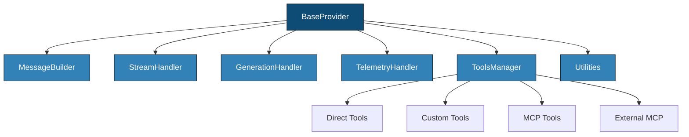
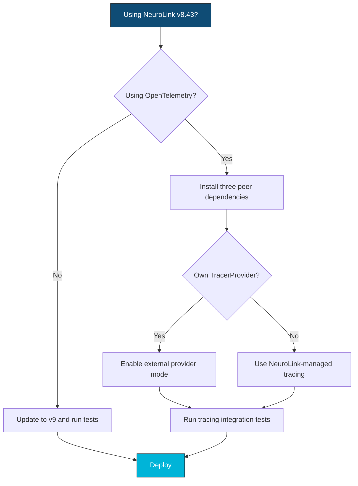

> **Historical release note:** This guide documents the v8-to-v9 transition. NeuroLink is now on v12; current examples below use model IDs and public import paths available in v12, while the migration-source snippets remain labeled as v8 history.
{: .prompt-info }

NeuroLink v9.0 was an observability-focused major release. Its single documented breaking change moved three OpenTelemetry packages to peer dependencies, while its headline feature added support for external tracer providers. The early v9 minor releases then added the RAG and workflow capabilities often associated with the v9 line.

This guide separates the exact v9.0 migration from features that landed in v9.2, v9.3, and v9.4, and from architecture that already existed in v8.43.

## v9 Context and Early-Series Features

### Modular Core Architecture (Already Present in v8)

By v8.43, `BaseProvider` already delegated work to six focused modules, each with a single responsibility:


```mermaid
flowchart TD
    A["BaseProvider"] --> B["MessageBuilder"]
    A --> C["StreamHandler"]
    A --> D["GenerationHandler"]
    A --> E["TelemetryHandler"]
    A --> F["ToolsManager"]
    A --> G["Utilities"]
    F --> H["Direct Tools"]
    F --> I["Custom Tools"]
    F --> J["MCP Tools"]
    F --> K["External MCP"]
    style A fill:#0f4c75,stroke:#1b262c,color:#fff
    style B fill:#3282b8,stroke:#1b262c,color:#fff
    style C fill:#3282b8,stroke:#1b262c,color:#fff
    style D fill:#3282b8,stroke:#1b262c,color:#fff
    style E fill:#3282b8,stroke:#1b262c,color:#fff
    style F fill:#3282b8,stroke:#1b262c,color:#fff
    style G fill:#3282b8,stroke:#1b262c,color:#fff
```

| Module | Responsibility | Source Path |
|---|---|---|
| **MessageBuilder** | Message construction and formatting | `src/lib/core/modules/` |
| **StreamHandler** | Stream validation, text stream creation, analytics | `src/lib/core/modules/` |
| **GenerationHandler** | Generation execution, tool extraction, result formatting | `src/lib/core/modules/` |
| **TelemetryHandler** | Observability, tracing, metrics | `src/lib/core/modules/` |
| **ToolsManager** | Tool registration, discovery, execution | `src/lib/core/modules/` |
| **Utilities** | Timeout, middleware, validation | `src/lib/core/modules/` |

**Why this matters**: The internal responsibilities can be tested and maintained independently. `BaseProvider` delegates to these modules internally; they are not separate public extension points. Custom provider implementations instead supply the documented provider hooks, such as their provider name, default model, AI SDK model, streaming execution, and provider-error formatting.

### RAG Pipeline Orchestrator

End-to-end RAG arrived during the v9 series: v9.2 added automatic RAG options and ten chunking strategies, and v9.3 added the document-processing pipeline. `RAGPipeline` wraps chunking, embedding, storage, retrieval, and generation in a declarative API:

```typescript
import { RAGPipeline } from '@juspay/neurolink';

const pipeline = new RAGPipeline({
  embeddingModel: { provider: 'openai', modelName: 'text-embedding-3-small' },
  generationModel: { provider: 'openai', modelName: 'gpt-5.4-mini' },
  enableHybridSearch: true,
  defaultChunkingStrategy: 'semantic-markdown',
});

await pipeline.initialize();
await pipeline.ingest(['./docs/api.md', './docs/guides.md']);

const response = await pipeline.query('How do I use streaming?');
console.log(response.answer);
```

The pipeline includes:

- **10 chunking strategies**: character, recursive, sentence, token, markdown, HTML, JSON, LaTeX, semantic, and semantic-markdown
- **Hybrid search**: Vector similarity combined with BM25 keyword matching, fused via Reciprocal Rank Fusion
- **Graph RAG**: Relationship-aware retrieval for interconnected documents
- **Built-in reranking**: Configurable reranking models for improved retrieval quality

### Four MCP Transport Protocols (Existing Before v9)

By the end of v8, MCP (Model Context Protocol) already supported the four main transport protocols used by the current SDK:

| Transport | Protocol | Best For |
|---|---|---|
| **stdio** | Standard I/O pipes | Local tools, CLI integration |
| **SSE** | Server-Sent Events | Real-time server communication |
| **WebSocket** | WebSocket | Bidirectional, long-lived connections |
| **Streamable HTTP** | HTTP with streaming | Stateless, scalable APIs |

The HTTP transport, OAuth 2.1 with PKCE, circuit breaking, and token-bucket rate limiting were all present before v9.0; they remain useful context for applications moving through the v9 line, but they were not v9.0 additions.

### Provider Registry Pattern (Existing Before v9)

The dynamic `ProviderFactory` + `ProviderRegistry` pattern was also already established by v8.43:

- **Dynamic provider registration**: Add new providers at runtime without code changes
- **Aliases**: Register multiple names for the same provider (e.g., `"custom"` and `"my-ai"`)
- **Lazy loading**: Providers are loaded via dynamic imports only when first used
- **13 built-in provider entries at v9 launch**: Bedrock, OpenAI, Vertex, Anthropic, Azure, Google AI, HuggingFace, Ollama, Mistral, LiteLLM, SageMaker, OpenRouter, OpenAI-Compatible. The current provider catalog is broader.

## Breaking Changes

### OpenTelemetry Packages Became Peer Dependencies

The actual breaking change in v9.0 was in observability: `@opentelemetry/api`, `@opentelemetry/sdk-trace-node`, and `@opentelemetry/sdk-trace-base` moved to `peerDependencies`. Applications that enable tracing must install them directly:

```bash
npm install @opentelemetry/api @opentelemetry/sdk-trace-node @opentelemetry/sdk-trace-base
```

v9.0 also added support for supplying an external `TracerProvider`, with automatic operation-name detection. Applications that do not use OpenTelemetry could upgrade without changing their `generate()` or `stream()` calls.

### Public Imports Stayed Stable

The recommended top-level imports did not change:

```typescript
import {
  NeuroLink,
  createAIProvider,
  createAIProviderWithFallback,
  createBestAIProvider,
} from '@juspay/neurolink';
```

> **Note:** The v8.43 and v9.0 source trees use the same four-argument `BaseProvider` constructor, `getAllTools()` is already asynchronous in both, and `StreamResult` already contains `provider` and `model` fields in v8.43. Those are not v9 migration steps.
{: .prompt-info }

### RAG Arrived in Later v9 Minors

The RAG APIs were additions later in the v9 series, not part of the v9.0 breaking change. v9.2 introduced automatic RAG options, ten chunking strategies, reranking, and hybrid search; v9.3 added the document-processing pipeline. Use public root exports rather than unexported deep paths:

```typescript
import { ChunkerRegistry, createChunker } from '@juspay/neurolink';

const chunker = await createChunker('recursive');
const registryChunker = ChunkerRegistry.get('recursive');
```

v9.4 then added the workflow engine. Keeping these minor-release boundaries explicit matters when diagnosing an application pinned to a specific v9 version.

## Step-by-Step Migration

### Migration Decision Tree

Use this decision tree to determine how much migration work you need:


```mermaid
flowchart TD
    A["Using NeuroLink v8.43?"] --> B{"Using OpenTelemetry?"}
    B -->|"Yes"| C["Install three peer dependencies"]
    B -->|"No"| D["Update to v9 and run tests"]
    C --> E{"Own TracerProvider?"}
    E -->|"Yes"| F["Enable external provider mode"]
    E -->|"No"| G["Use NeuroLink-managed tracing"]
    F --> H["Run tracing integration tests"]
    G --> H
    D --> I["Deploy"]
    H --> I
    style A fill:#0f4c75,stroke:#1b262c,color:#fff
    style I fill:#00b4d8,stroke:#1b262c,color:#fff
```

Applications that did not use OpenTelemetry generally needed only the package update and their normal test suite. RAG and workflow adoption were optional additions in later v9 minor releases, not mandatory v9.0 migration work.

### Step 1: Update Package

For the supported current release (v12), install the latest package:

```bash
npm install @juspay/neurolink@latest
```

Current releases require Node.js >= 22.0.0. If you specifically need to reproduce the historical v9 environment, pin the v9 major instead of using `latest`.

```bash
node --version  # Must be >= 22.0.0 for the current release

# Verify installation
npx neurolink --version

# Historical v9 only
npm install @juspay/neurolink@9
```

### Step 2: Update Provider Imports

If you use top-level exports, no changes are needed:

```typescript
// v8 (still works -- no change required for basic usage)
import { createAIProvider } from '@juspay/neurolink';
const provider = await createAIProvider('openai', 'gpt-5.4');
```

The provider registry was already available before v9. If you want to register a custom provider, the current root export supports this pattern:

```typescript
// Register a custom provider
import { ProviderFactory } from '@juspay/neurolink';

ProviderFactory.registerProvider(
  'my-custom',
  async (modelName) => {
    const { MyCustomProvider } = await import('./my-provider.js');
    return new MyCustomProvider(modelName);
  },
  'my-default-model',
  ['custom', 'my-ai']  // aliases
);

const provider = await ProviderFactory.createProvider('my-custom');
```

### Step 3: Re-test Custom Providers

v8.43 and v9.0 use the same four-argument `BaseProvider` constructor: model name, provider name, the optional `NeuroLink` instance, and optional middleware factory options. `getAllTools()` is asynchronous in both versions. There is no constructor or sync-to-async rewrite to apply.

Custom provider authors should still run their provider suites after the major update, especially tests for streaming, tool merging, and error formatting. `BaseProvider` is an internal implementation class rather than a public root export, so third-party provider packages should avoid relying on unexported deep imports.

### Step 4: Adopt RAG APIs from the Correct Minor

RAG was not a v8-to-v9.0 migration requirement. If you are moving to v9.3 or later, you can opt into the `RAGPipeline` added during the early v9 minor releases:

```typescript
import { RAGPipeline, createChunker } from '@juspay/neurolink';

const chunker = await createChunker('recursive');

const pipeline = new RAGPipeline({
  embeddingModel: { provider: 'openai', modelName: 'text-embedding-3-small' },
  generationModel: { provider: 'openai', modelName: 'gpt-5.4-mini' },
  enableHybridSearch: true,
});

await pipeline.initialize();
await pipeline.ingest(['./docs/api.md']);
const response = await pipeline.query('How do I use streaming?');
console.log(response.answer);
```

`createChunker()` is asynchronous, and both it and `RAGPipeline` are public root exports. The old `@juspay/neurolink/rag/chunking` path shown in earlier drafts of this guide is not exported and should not be used.

### Step 5: Verify MCP Configuration

MCP transport support did not require a v9.0 rewrite, but this is a useful point to verify the full server configuration shape. `MCPClientFactory.createClient()` expects identity, status, and tool-list fields in addition to transport-specific settings:

```typescript
import { MCPClientFactory } from '@juspay/neurolink';

const mcpClientId = process.env.MCP_CLIENT_ID;
if (!mcpClientId) {
  throw new Error('MCP_CLIENT_ID is required');
}

// stdio (unchanged)
const stdioResult = await MCPClientFactory.createClient({
  id: 'file-server',
  name: 'Filesystem server',
  description: 'Local filesystem tools',
  transport: 'stdio',
  status: 'disconnected',
  tools: [],
  command: 'npx',
  args: ['-y', '@modelcontextprotocol/server-filesystem'],
});

// HTTP with OAuth 2.1
const httpResult = await MCPClientFactory.createClient({
  id: 'api-server',
  name: 'Remote API server',
  description: 'Authenticated remote MCP tools',
  transport: 'http',
  status: 'disconnected',
  tools: [],
  url: 'https://mcp.example.com/api',
  auth: {
    type: 'oauth2',
    oauth: {
      clientId: mcpClientId,
      tokenUrl: 'https://auth.example.com/token',
      authorizationUrl: 'https://auth.example.com/authorize',
      redirectUrl: 'http://localhost:3000/oauth/callback',
      scope: 'tools:read tools:execute',
      usePKCE: true,
    },
  },
  retryConfig: { maxAttempts: 3, initialDelay: 1000 },
  rateLimiting: { requestsPerMinute: 60, maxBurst: 10 },
});

// WebSocket transport
const wsResult = await MCPClientFactory.createClient({
  id: 'realtime-server',
  name: 'Realtime server',
  description: 'Bidirectional remote MCP tools',
  transport: 'websocket',
  status: 'disconnected',
  tools: [],
  url: 'wss://mcp.example.com/ws',
});
```

## v9-Series and Current API Quick Reference

| API | Module | Description |
|---|---|---|
| `RAGPipeline` | RAG | End-to-end RAG pipeline with ingest and query |
| `createChunker(strategy)` | RAG | Factory function for creating chunkers |
| `getAvailableStrategies()` | RAG | List all available chunking strategies |
| `MCPClientFactory.createClient()` | MCP | Create MCP clients with transport config |
| `MCPClientFactory.testConnection()` | MCP | Test MCP server connectivity |
| `ProviderFactory.registerProvider()` | Providers | Register custom providers at runtime |
| `ProviderFactory.getAvailableProviders()` | Providers | List all registered providers |
| `ProviderFactory.createProvider()` | Providers | Create provider instances |

## Common Migration Scenarios

### Scenario 1: Basic Generate/Stream User

If you only use `neurolink.generate()` and `neurolink.stream()`:

```bash
# Historical v8-to-v9 migration:
npm install @juspay/neurolink@9
npm test  # Verify your application against the pinned major
```

For basic `generate()` and `stream()` use, the v8-to-v9 migration required no call-shape changes. Do not substitute `@latest` in this historical command without reviewing the migration notes for every intervening major release.

### Scenario 2: OpenTelemetry User

If your application enables NeuroLink observability:

1. Install the three OpenTelemetry peer dependencies listed above
2. Decide whether NeuroLink or the host application owns the `TracerProvider`
3. When the host owns it, enable external-provider mode and attach NeuroLink's span processors
4. Run an integration test that confirms spans reach your exporter

### Scenario 3: RAG Adopter

If you are upgrading beyond v9.0 and want the RAG features introduced in v9.2 and v9.3:

1. Use public root imports such as `createChunker` and `RAGPipeline`
2. Await `createChunker()`
3. Test retrieval quality and source attribution on a representative corpus
4. Keep the package pinned to at least the minor version that introduced the API you use

### Scenario 4: MCP User

Existing stdio, SSE, WebSocket, and HTTP configuration shapes predate v9.0. Run connection tests after upgrading, but do not treat those transports, OAuth, circuit breaking, or rate limiting as v9.0 migration requirements.

## What's Next

For an application still on v8, migrate to the exact v9 minor you intend to run, apply the OpenTelemetry peer-dependency change, and exercise tracing in integration tests. For a current application, follow the intervening major-version migration notes rather than treating this historical guide as a direct path to v12.

---

**Related posts:**

- [Version Migration Guide: Upgrading Between NeuroLink Releases](/posts/version-migration-guide/)
- [Built with NeuroLink: Community Showcase](/posts/community-showcase/)
- [NeuroLink 2025: Year in Review and Future Directions](/posts/neurolink-2025-roadmap/)
