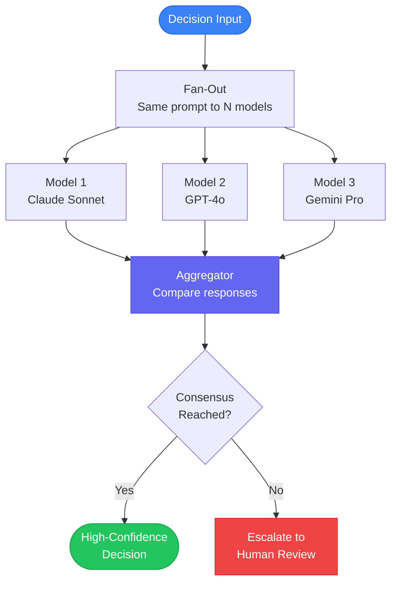
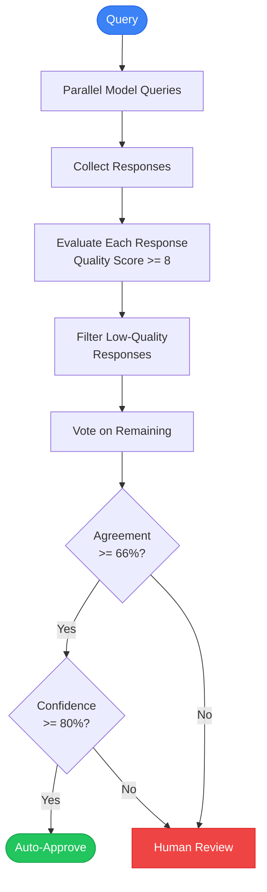

We designed the multi-model consensus system for high-stakes decisions where no single model's output should be trusted alone. This deep dive examines how we query multiple providers in parallel, implement voting and weighted agreement algorithms, detect and handle model disagreement, and determine when human escalation is required.

The consensus pattern is straightforward: query multiple models with the same input, compare their answers, and act only when they agree. When models disagree, escalate to human review. This transforms AI from a single point of failure into a cross-validated decision system.

NeuroLink's provider-agnostic architecture makes this pattern trivial to implement. The same `generate()` API works across every provider, so querying three different models requires changing two configuration fields, not rewriting your integration code.

This post covers the complete multi-model consensus pattern: architecture, voting strategies, disagreement analysis, cost optimization, quality verification, and production deployment.

## Architecture: Multi-Model Consensus Pipeline

The consensus pipeline follows a fan-out/fan-in pattern. A single input is sent to N models in parallel. Their responses are collected, compared, and either auto-approved (on consensus) or escalated (on disagreement).



The key insight is that different models have different failure modes. Claude might hallucinate on numerical reasoning while excelling at nuanced text analysis. GPT-4o might miss edge cases that Gemini catches. By combining their outputs, you get coverage across failure modes.


## Basic Multi-Model Query

The foundation of consensus is querying multiple models with the same structured prompt. NeuroLink's unified API makes this a straightforward `Promise.all()` call:

```typescript
import { NeuroLink } from '@juspay/neurolink';

const neurolink = new NeuroLink();

async function multiModelQuery(prompt: string) {
  const models = [
    { provider: 'anthropic', model: 'claude-sonnet-4-5-20250929' },
    { provider: 'openai', model: 'gpt-4o' },
    { provider: 'google-ai', model: 'gemini-2.5-pro' },
  ];

  const results = await Promise.all(
    models.map(config =>
      neurolink.generate({
        input: { text: prompt },
        provider: config.provider,
        model: config.model,
        systemPrompt: 'Respond with a structured JSON object: { "decision": "yes|no", "confidence": 0-100, "reasoning": "..." }',
      })
    )
  );

  return results.map((r, i) => ({
    model: `${models[i].provider}/${models[i].model}`,
    response: JSON.parse(r.content),
    usage: r.usage,
  }));
}
```

The structured JSON response format is critical. Without it, comparing free-text responses across models becomes an ambiguous natural language comparison problem. By constraining the output to `decision`, `confidence`, and `reasoning` fields, you can programmatically compare responses.

> **Note:** Always include a `reasoning` field in the response schema. When models disagree, the reasoning helps human reviewers understand why -- and it helps you debug and improve your prompts over time.
{: .prompt-info }

## Voting Strategies

Once you have responses from multiple models, you need a strategy for aggregating them into a final decision. The right strategy depends on your risk tolerance and throughput requirements.

### Majority Voting

The simplest strategy: the decision with the most votes wins. If 2 out of 3 models say "yes", the answer is "yes".

```typescript
interface ModelResponse {
  model: string;
  response: { decision: string; confidence: number; reasoning: string };
  usage: { total: number; input: number; output: number };
}

interface ConsensusResult {
  decision: string;
  agreement: number;
  unanimous: boolean;
  responses: ModelResponse[];
}

function majorityVote(responses: ModelResponse[]): ConsensusResult {
  const decisions = responses.map(r => r.response.decision);
  const yesCount = decisions.filter(d => d === 'yes').length;
  const noCount = decisions.filter(d => d === 'no').length;

  return {
    decision: yesCount > noCount ? 'yes' : 'no',
    agreement: Math.max(yesCount, noCount) / decisions.length,
    unanimous: yesCount === decisions.length || noCount === decisions.length,
    responses,
  };
}
```

Majority voting is fast and works well for binary decisions. Its weakness is that it treats all models equally -- a highly confident response from one model carries the same weight as a low-confidence response from another.

### Weighted Voting by Confidence Score

Weight each model's vote by its self-reported confidence. A model that says "yes" with 95% confidence contributes more to the final decision than one that says "yes" with 55% confidence.

```typescript
function weightedVote(responses: ModelResponse[]): ConsensusResult {
  const weightedScores: Record<string, number> = {};

  for (const r of responses) {
    const decision = r.response.decision;
    const weight = r.response.confidence / 100;
    weightedScores[decision] = (weightedScores[decision] || 0) + weight;
  }

  const totalWeight = Object.values(weightedScores).reduce((a, b) => a + b, 0);
  const sortedDecisions = Object.entries(weightedScores)
    .sort(([, a], [, b]) => b - a);

  const [topDecision, topWeight] = sortedDecisions[0];

  return {
    decision: topDecision,
    agreement: topWeight / totalWeight,
    unanimous: sortedDecisions.length === 1,
    responses,
  };
}
```

Weighted voting is better than majority voting for nuanced decisions, but it relies on models accurately self-reporting confidence -- which they do not always do. Calibrate by comparing reported confidence against actual accuracy for your specific domain.

### Unanimous Consensus

The most conservative strategy: all models must agree for the decision to proceed. Any disagreement triggers human escalation.

```typescript
function unanimousVote(responses: ModelResponse[]): ConsensusResult {
  const decisions = new Set(responses.map(r => r.response.decision));
  const isUnanimous = decisions.size === 1;

  return {
    decision: isUnanimous ? responses[0].response.decision : 'escalate',
    agreement: isUnanimous ? 1.0 : 0,
    unanimous: isUnanimous,
    responses,
  };
}
```

Unanimous consensus provides the highest safety but the lowest throughput. Use it for decisions where false positives or false negatives carry severe consequences -- regulatory compliance, safety-critical systems, and irreversible actions.

> **Note:** Choose your voting strategy based on the cost of being wrong. Medical diagnoses need unanimous consensus. Content moderation can use majority voting. Marketing copy classification might not need consensus at all.
{: .prompt-warning }

## Disagreement Analysis

When models disagree, do not just escalate blindly. Analyze the disagreement to provide human reviewers with context and to improve your system over time.

```typescript
interface DisagreementReport {
  type: 'unanimous' | 'disagreement';
  outliers?: string[];
  action: string;
  reasoning?: Array<{
    model: string;
    decision: string;
    reasoning: string;
  }>;
}

function analyzeDisagreement(responses: ModelResponse[]): DisagreementReport {
  const decisions = new Set(responses.map(r => r.response.decision));

  if (decisions.size === 1) {
    return { type: 'unanimous', action: 'proceed' };
  }

  // Identify the outlier
  const decisionCounts = responses.reduce((acc, r) => {
    acc[r.response.decision] = (acc[r.response.decision] || 0) + 1;
    return acc;
  }, {} as Record<string, number>);

  const outliers = responses.filter(
    r => decisionCounts[r.response.decision] === 1
  );

  return {
    type: 'disagreement',
    outliers: outliers.map(o => o.model),
    action: 'escalate_to_human',
    reasoning: responses.map(r => ({
      model: r.model,
      decision: r.response.decision,
      reasoning: r.response.reasoning,
    })),
  };
}
```

The disagreement report tells the human reviewer which model(s) disagree with the majority and why. Over time, you can track which models are most often the outlier -- if one model consistently disagrees and is later proven wrong, you might replace it or reduce its weight.

## Decision Flow with Confidence Thresholds

For production systems, combine voting with confidence thresholds and quality evaluation to create a multi-gate decision flow:



This flow adds two gates beyond simple voting:

1. **Quality gate**: Each response is evaluated independently. Low-quality responses are filtered out before voting, so a hallucinating model does not corrupt the consensus.
2. **Confidence gate**: Even if models agree, the decision is escalated if the average confidence is below 80%. Agreement with low confidence may indicate the question is inherently ambiguous.

## Cost Analysis: Is Multi-Model Worth It?

Querying three models instead of one triples your API costs. Is it worth it? That depends on the cost of being wrong.

| Scenario | Single Model Cost (1K decisions) | 3-Model Consensus (1K decisions) | Cost of One Error |
|---|---|---|---|
| Content Moderation | $5 | $15 | $100 (brand damage) |
| Medical Triage | $10 | $30 | $100,000+ (liability) |
| Financial Trading | $8 | $24 | $50,000+ (bad trade) |
| Code Review | $6 | $18 | $500 (bug fix) |

For high-stakes decisions, the $10-20 premium per thousand decisions is trivial compared to the cost of a single error. For low-stakes decisions, stick with a single model and invest the savings elsewhere.

### Cost Optimization Strategy

Use two cheap models plus one premium model for cost-effective consensus:

```typescript
// Cost-optimized model combination
const models = [
  { provider: 'openai', model: 'gpt-4o-mini' },       // ~$0.15/1M tokens
  { provider: 'google-ai', model: 'gemini-2.5-pro' },  // ~$1.25/1M tokens
  { provider: 'anthropic', model: 'claude-sonnet-4-5-20250929' }, // ~$3.00/1M tokens
];

// Weight the premium model higher in voting
const weights = {
  'openai/gpt-4o-mini': 0.8,
  'google-ai/gemini-2.5-pro': 1.0,
  'anthropic/claude-sonnet-4-5-20250929': 1.5,
};
```

## Quality Verification with Auto-Evaluation

Before including a model's response in the vote, verify its quality using NeuroLink's auto-evaluation middleware:

```typescript
const neurolink = new NeuroLink();

// Auto-evaluation middleware is configured separately through the MiddlewareFactory:
const evalMiddleware = new MiddlewareFactory({
  middlewareConfig: {
    autoEvaluation: {
      enabled: true,
      config: {
        threshold: 8, // Higher threshold for high-stakes
        blocking: true,
      },
    },
  },
});

// Only include responses that pass quality evaluation in the vote
```

Setting a threshold of 8 (out of 10) for high-stakes decisions ensures that only well-reasoned, factual responses contribute to the consensus. Responses scoring below 8 are excluded from the vote, and if too few responses pass, the entire decision is escalated.

## HITL Integration for Disagreements

When models disagree, NeuroLink's Human-in-the-Loop (HITL) system can automatically route the decision to a human reviewer:

```typescript
const neurolink = new NeuroLink({
  hitl: {
    enabled: true,
    dangerousActions: ['final_decision'],
    timeout: 120000, // 2 minutes for complex reviews
    auditLogging: true,
    customRules: [
      {
        name: 'model-disagreement',
        requiresConfirmation: true,
        condition: (toolName, args) => {
          const consensus = (args as { agreement?: number })?.agreement;
          return consensus !== undefined && consensus < 1.0;
        },
        customMessage: 'Models disagree - human review required',
      },
    ],
  },
});
```

The custom rule triggers human review whenever the agreement score falls below 1.0 (i.e., models are not unanimous). The `auditLogging` flag ensures every decision -- both auto-approved and human-reviewed -- is recorded for compliance.

> **Note:** For regulated industries like healthcare and finance, audit logging is not optional. Every consensus decision should be logged with the individual model responses, vote tallies, and final determination.
{: .prompt-warning }

## Real-World Applications

### Healthcare: Diagnostic Support

Multiple models review patient symptoms and diagnostic data independently. If all three agree on a diagnosis, the recommendation proceeds to the clinician with high confidence. If any model disagrees, the case is flagged for specialist review with the disagreement analysis attached.

### Finance: Trade Recommendations

Before executing a trade recommendation, three models independently evaluate the market conditions, risk factors, and expected returns. The trade executes only on unanimous agreement above a confidence threshold. Disagreements trigger a hold for human analyst review.

### Legal: Contract Analysis

Contract clauses are evaluated by multiple models for risk identification. Each model independently flags concerning clauses, and only clauses flagged by all models are auto-highlighted. Clauses flagged by some but not all models are marked for attorney review with each model's reasoning.

### Content Moderation

User content is evaluated by multiple models for policy violations. Unanimous agreement is required to remove content (high bar for censorship), while majority agreement is sufficient to flag content for human review.

## Production Patterns

### Parallel Execution for Latency

Run all model queries in parallel, not sequentially. The total latency equals the slowest model, not the sum of all models:

```typescript
// Good: parallel execution (~3s total, time of slowest model)
const results = await Promise.all(models.map(m => neurolink.generate({ ... })));

// Bad: sequential execution (~9s total, sum of all models)
const results = [];
for (const m of models) {
  results.push(await neurolink.generate({ ... }));
}
```

### Fallback Providers

If one model is unavailable, degrade gracefully by running consensus with the remaining models. Two-model consensus is better than a single-model response:

```typescript
const results = await Promise.allSettled(
  models.map(config =>
    neurolink.generate({ input: { text: prompt }, ...config })
  )
);

const successfulResults = results
  .filter((r): r is PromiseFulfilledResult<any> => r.status === 'fulfilled')
  .map(r => r.value);

if (successfulResults.length < 2) {
  throw new Error('Insufficient models for consensus');
}
```

### Monitoring Consensus Rates

Track your consensus and disagreement rates over time. A declining consensus rate might indicate:

- Prompts that are too ambiguous
- A model that has degraded after a provider update
- Edge cases that need better prompt engineering

## What's Next

The architecture decisions we have described represent trade-offs that worked for our scale and constraints. The key engineering insights to take away: start with the simplest design that handles your current load, instrument everything so you can identify bottlenecks before they become outages, and resist premature abstraction until you have at least three concrete use cases demanding it. The implementation details will differ for your system, but the underlying constraints -- latency budgets, failure domains, resource contention -- are universal.

---

**Related posts:**

- [Multi-Agent Networks: Orchestrating AI Teams with NeuroLink](/posts/multi-agent-networks/)
- [Building AI Agents with NeuroLink: From Chatbot to Autonomous System](/posts/building-ai-agents/)
- [Extended Thinking: Reasoning Modes with Gemini 3 and Claude](/posts/extended-thinking/)
