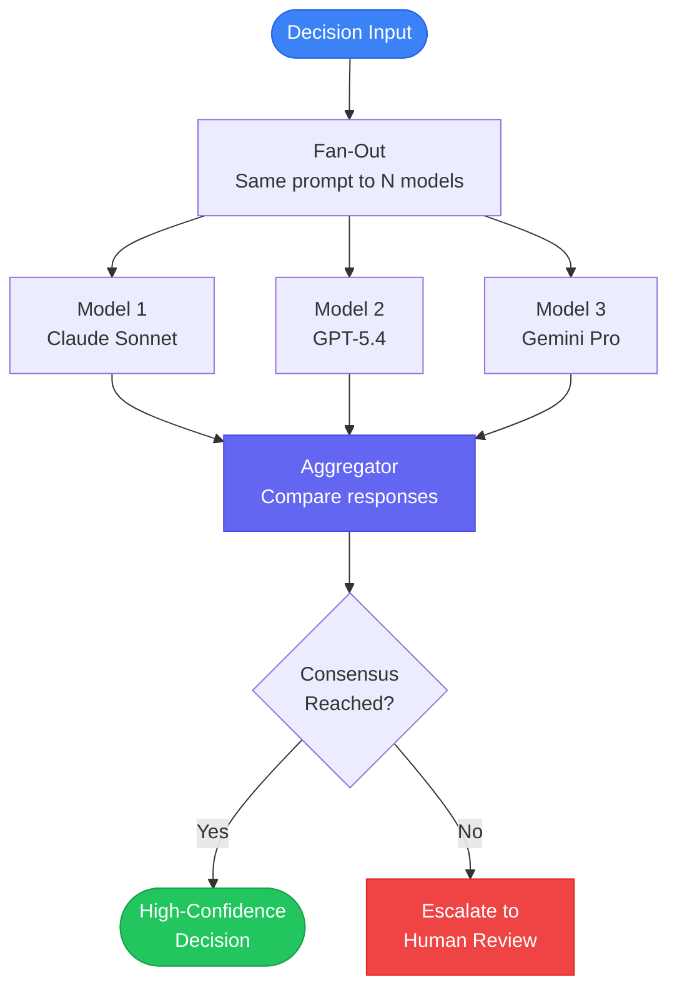
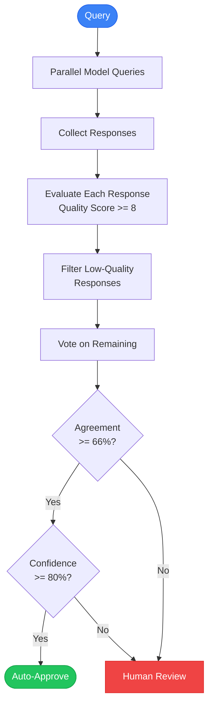

We designed the multi-model consensus system for high-stakes decisions where no single model's output should be trusted alone. This deep dive examines how we query multiple providers in parallel, implement voting and weighted agreement algorithms, detect and handle model disagreement, and determine when human escalation is required.

The consensus pattern is straightforward: query multiple models with the same input, compare their answers, and escalate disagreements to human review. Agreement is useful evidence, not independent validation -- models can share the same blind spots -- so high-stakes actions still need domain-appropriate safeguards.

NeuroLink's provider-agnostic architecture keeps the fan-out implementation consistent across providers. The same `generate()` call shape works across providers, so each request varies mainly by its `provider` and `model` fields.

This post covers the complete multi-model consensus pattern: architecture, voting strategies, disagreement analysis, cost optimization, quality verification, and production deployment.

## Architecture: Multi-Model Consensus Pipeline

The consensus pipeline follows a fan-out/fan-in pattern. A single input is sent to N models in parallel. Their responses are collected, compared, and either auto-approved (on consensus) or escalated (on disagreement).


```mermaid
flowchart TB
    INPUT(["Decision Input"]) --> FAN["Fan-Out<br/>Same prompt to N models"]

    FAN --> M1["Model 1<br/>Claude Sonnet"]
    FAN --> M2["Model 2<br/>GPT-5.4"]
    FAN --> M3["Model 3<br/>Gemini Pro"]

    M1 & M2 & M3 --> AGG["Aggregator<br/>Compare responses"]
    AGG --> VOTE{"Consensus<br/>Reached?"}
    VOTE -->|"Yes"| OUTPUT(["High-Confidence<br/>Decision"])
    VOTE -->|"No"| ESCALATE["Escalate to<br/>Human Review"]

    style INPUT fill:#3b82f6,stroke:#2563eb,color:#fff
    style AGG fill:#6366f1,stroke:#4f46e5,color:#fff
    style OUTPUT fill:#22c55e,stroke:#16a34a,color:#fff
    style ESCALATE fill:#ef4444,stroke:#dc2626,color:#fff
```

The key insight is that different models can have different failure modes. Querying models from separate provider families can expose disagreements that a single-model pipeline would never surface. This is not proof of correctness -- correlated errors are still possible -- but it gives the application an explicit signal for review.


## Basic Multi-Model Query

The foundation of consensus is querying multiple models with the same structured prompt. NeuroLink's unified API makes this a straightforward `Promise.all()` call:

```typescript
import { NeuroLink } from '@juspay/neurolink';
import { z } from 'zod';

const neurolink = new NeuroLink();
const decisionSchema = z.object({
  decision: z.enum(['yes', 'no']),
  confidence: z.number().min(0).max(100),
  reasoning: z.string(),
});

async function multiModelQuery(prompt: string) {
  const models = [
    { provider: 'anthropic', model: 'claude-sonnet-5' },
    { provider: 'openai', model: 'gpt-5.4' },
    { provider: 'google-ai', model: 'gemini-2.5-pro' },
  ];

  return Promise.all(
    models.map(async config => {
      const result = await neurolink.generate({
        input: { text: prompt },
        provider: config.provider,
        model: config.model,
        schema: decisionSchema,
        systemPrompt: 'Decide yes or no, report confidence from 0 to 100, and explain the reasoning.',
      });

      return {
        model: `${config.provider}/${config.model}`,
        response: decisionSchema.parse(result.structuredData),
        usage: result.usage,
      };
    })
  );
}
```

The structured response schema is critical. Without it, comparing free-text responses across models becomes an ambiguous natural language comparison problem. NeuroLink returns the parsed object in `structuredData`; validating it with the same Zod schema avoids hand-parsing model text before comparison.

> **Note:** Always include a `reasoning` field in the response schema. When models disagree, the reasoning helps human reviewers understand why -- and it helps you debug and improve your prompts over time.
{: .prompt-info }

## Voting Strategies

Once you have responses from multiple models, you need a strategy for aggregating them into a final decision. The right strategy depends on your risk tolerance and throughput requirements.

### Majority Voting

The simplest strategy: the decision with the most votes wins. If 2 out of 3 models say "yes", the answer is "yes".

```typescript
interface ModelResponse {
  model: string;
  response: { decision: 'yes' | 'no'; confidence: number; reasoning: string };
  usage?: { total: number; input: number; output: number };
}

interface ConsensusResult {
  decision: string;
  agreement: number;
  unanimous: boolean;
  responses: ModelResponse[];
}

function majorityVote(responses: ModelResponse[]): ConsensusResult {
  if (responses.length === 0) throw new Error('At least one response is required');
  const decisions = responses.map(r => r.response.decision);
  const yesCount = decisions.filter(d => d === 'yes').length;
  const noCount = decisions.filter(d => d === 'no').length;

  return {
    decision: yesCount > noCount ? 'yes' : 'no',
    agreement: Math.max(yesCount, noCount) / decisions.length,
    unanimous: yesCount === decisions.length || noCount === decisions.length,
    responses,
  };
}
```

Majority voting is fast and works well for binary decisions. Its weakness is that it treats all models equally -- a highly confident response from one model carries the same weight as a low-confidence response from another.

### Weighted Voting by Confidence Score

Weight each model's vote by its self-reported confidence. A model that says "yes" with 95% confidence contributes more to the final decision than one that says "yes" with 55% confidence.

```typescript
function weightedVote(responses: ModelResponse[]): ConsensusResult {
  if (responses.length === 0) throw new Error('At least one response is required');
  const weightedScores: Record<string, number> = {};

  for (const r of responses) {
    const decision = r.response.decision;
    const weight = r.response.confidence / 100;
    weightedScores[decision] = (weightedScores[decision] || 0) + weight;
  }

  const totalWeight = Object.values(weightedScores).reduce((a, b) => a + b, 0);
  const sortedDecisions = Object.entries(weightedScores)
    .sort(([, a], [, b]) => b - a);

  const winner = sortedDecisions[0];
  if (!winner) throw new Error('No weighted decision available');
  const [topDecision, topWeight] = winner;

  return {
    decision: topDecision,
    agreement: topWeight / totalWeight,
    unanimous: sortedDecisions.length === 1,
    responses,
  };
}
```

Weighted voting is better than majority voting for nuanced decisions, but it relies on models accurately self-reporting confidence -- which they do not always do. Calibrate by comparing reported confidence against actual accuracy for your specific domain.

### Unanimous Consensus

The most conservative strategy: all models must agree for the decision to proceed. Any disagreement triggers human escalation.

```typescript
function unanimousVote(responses: ModelResponse[]): ConsensusResult {
  const [firstResponse] = responses;
  if (!firstResponse) throw new Error('At least one response is required');
  const decisions = new Set(responses.map(r => r.response.decision));
  const isUnanimous = decisions.size === 1;

  return {
    decision: isUnanimous ? firstResponse.response.decision : 'escalate',
    agreement: isUnanimous ? 1.0 : 0,
    unanimous: isUnanimous,
    responses,
  };
}
```

Unanimous consensus is more conservative than majority voting, but it does not prove correctness: models can share training-data gaps and make correlated errors. Use it only as one signal in workflows where false positives or false negatives carry severe consequences.

> **Note:** Choose your voting strategy based on the cost of being wrong. Medical and other safety-critical decisions still require qualified human review regardless of model agreement. Lower-stakes classification may use majority voting, while marketing copy classification might not need consensus at all.
{: .prompt-warning }

## Disagreement Analysis

When models disagree, do not just escalate blindly. Analyze the disagreement to provide human reviewers with context and to improve your system over time.

```typescript
interface DisagreementReport {
  type: 'unanimous' | 'disagreement';
  outliers?: string[];
  action: string;
  reasoning?: Array<{
    model: string;
    decision: string;
    reasoning: string;
  }>;
}

function analyzeDisagreement(responses: ModelResponse[]): DisagreementReport {
  const decisions = new Set(responses.map(r => r.response.decision));

  if (decisions.size === 1) {
    return { type: 'unanimous', action: 'proceed' };
  }

  // Identify the outlier
  const decisionCounts = responses.reduce((acc, r) => {
    acc[r.response.decision] = (acc[r.response.decision] || 0) + 1;
    return acc;
  }, {} as Record<string, number>);

  const outliers = responses.filter(
    r => decisionCounts[r.response.decision] === 1
  );

  return {
    type: 'disagreement',
    outliers: outliers.map(o => o.model),
    action: 'escalate_to_human',
    reasoning: responses.map(r => ({
      model: r.model,
      decision: r.response.decision,
      reasoning: r.response.reasoning,
    })),
  };
}
```

The disagreement report tells the human reviewer which model(s) disagree with the majority and why. Over time, you can track which models are most often the outlier -- if one model consistently disagrees and is later proven wrong, you might replace it or reduce its weight.

## Decision Flow with Confidence Thresholds

For production systems, combine voting with confidence thresholds and quality evaluation to create a multi-gate decision flow:


```mermaid
flowchart TD
    QUERY(["Query"]) --> PARALLEL["Parallel Model Queries"]
    PARALLEL --> COLLECT["Collect Responses"]
    COLLECT --> EVAL["Evaluate Each Response<br/>Quality Score >= 8"]
    EVAL --> FILTER["Filter Low-Quality<br/>Responses"]
    FILTER --> VOTE["Vote on Remaining"]
    VOTE --> CHECK{"Agreement<br/>>= 66%?"}
    CHECK -->|"Yes"| CONF{"Confidence<br/>>= 80%?"}
    CHECK -->|"No"| HUMAN["Human Review"]
    CONF -->|"Yes"| AUTO(["Auto-Approve"])
    CONF -->|"No"| HUMAN

    style QUERY fill:#3b82f6,stroke:#2563eb,color:#fff
    style AUTO fill:#22c55e,stroke:#16a34a,color:#fff
    style HUMAN fill:#ef4444,stroke:#dc2626,color:#fff
```

This flow adds two gates beyond simple voting:

1. **Quality gate**: Each response is evaluated independently. Low-quality responses are filtered out before voting, so a hallucinating model does not corrupt the consensus.
2. **Confidence gate**: Even if models agree, the decision is escalated if the average confidence is below 80%. Agreement with low confidence may indicate the question is inherently ambiguous.

## Cost Analysis: Is Multi-Model Worth It?

A three-model consensus path makes three billable inference calls before any judge or retry calls. The actual multiplier depends on each model's input/output pricing, response length, cached-token treatment, and how often the workflow escalates.

Estimate the cost from your own traffic rather than relying on a generic table:

```text
consensus cost = sum(model call costs) + evaluation calls + retries + human-review overhead
```

For high-stakes decisions, compare that measured cost with the expected cost and frequency of an incorrect automated action. For low-stakes decisions, a single model with targeted evaluation may be the better trade-off.

### Cost Optimization Strategy

Mixing model tiers can reduce cost relative to using only flagship models:

```typescript
const models = [
  { provider: 'openai', model: 'gpt-5.4-mini' },
  { provider: 'google-ai', model: 'gemini-2.5-pro' },
  { provider: 'anthropic', model: 'claude-sonnet-5' },
];

// Example weights: replace these with values calibrated on labeled data.
const weights = {
  'openai/gpt-5.4-mini': 0.8,
  'google-ai/gemini-2.5-pro': 1.0,
  'anthropic/claude-sonnet-5': 1.5,
};
```

Do not assign a larger weight merely because a model is more expensive. Derive weights from measured accuracy and calibration on your domain's labeled validation set.

## Quality Verification with Auto-Evaluation

Before including a model's response in the vote, verify its quality using NeuroLink's auto-evaluation middleware:

```typescript
import type { EvaluationData } from '@juspay/neurolink';

let evaluation: EvaluationData | undefined;
const result = await neurolink.generate({
  input: { text: prompt },
  provider: 'openai',
  model: 'gpt-5.4',
  middleware: {
    enabledMiddleware: ['autoEvaluation'],
    middlewareConfig: {
      autoEvaluation: {
        enabled: true,
        config: {
          threshold: 8,
          blocking: true,
          onEvaluationComplete: data => {
            evaluation = data;
          },
        },
      },
    },
  },
});

const includeInVote = evaluation !== undefined && evaluation.overall >= 8;
```

The middleware runs evaluation before the call returns in blocking mode and reports scores through `onEvaluationComplete`. The application still decides whether to include `result` in the vote; configuring a threshold does not by itself remove a response from your candidate array.

## HITL Integration for Disagreements

When models disagree, NeuroLink's Human-in-the-Loop (HITL) system can automatically route the decision to a human reviewer:

```typescript
const neurolink = new NeuroLink({
  hitl: {
    enabled: true,
    dangerousActions: ['final_decision'],
    timeout: 120000, // 2 minutes for complex reviews
    auditLogging: true,
    customRules: [
      {
        name: 'model-disagreement',
        requiresConfirmation: true,
        condition: (toolName, args) => {
          const consensus = (args as { agreement?: number })?.agreement;
          return consensus !== undefined && consensus < 1.0;
        },
        customMessage: 'Models disagree - human review required',
      },
    ],
  },
});
```

The `dangerousActions: ['final_decision']` entry alone requires confirmation on every `final_decision` call, regardless of arguments. The custom rule is a separate check -- for any tool call whose arguments include an `agreement` value below 1.0, not only `final_decision`. `auditLogging` records HITL confirmation activity; log the model responses, vote tally, and final application decision separately if your audit requirements call for a complete decision record.

> **Note:** Regulated workflows have domain-specific recordkeeping and review requirements. Treat NeuroLink's HITL audit log as one input to your compliance design, not as a certification or a complete compliance solution.
{: .prompt-warning }

## Real-World Applications

### Healthcare: Diagnostic Support

Multiple models review patient symptoms and diagnostic data independently. If all three agree on a diagnosis, the recommendation proceeds to the clinician with high confidence. If any model disagrees, the case is flagged for specialist review with the disagreement analysis attached.

### Finance: Trade Recommendations

Before executing a trade recommendation, three models independently evaluate the market conditions, risk factors, and expected returns. The trade executes only on unanimous agreement above a confidence threshold. Disagreements trigger a hold for human analyst review.

### Legal: Contract Analysis

Contract clauses are evaluated by multiple models for risk identification. Each model independently flags concerning clauses, and only clauses flagged by all models are auto-highlighted. Clauses flagged by some but not all models are marked for attorney review with each model's reasoning.

### Content Moderation

User content is evaluated by multiple models for policy violations. Unanimous agreement is required to remove content (high bar for censorship), while majority agreement is sufficient to flag content for human review.

## Production Patterns

### Parallel Execution for Latency

Run all model queries in parallel, not sequentially. The total latency equals the slowest model, not the sum of all models:

```typescript
const parallelResults = await Promise.all(
  models.map(({ provider, model }) =>
    neurolink.generate({
      input: { text: prompt },
      provider,
      model,
    })
  )
);
```

Parallel fan-out normally completes near the latency of the slowest successful request rather than the sum of every request's latency. Add timeouts or cancellation so one stalled provider cannot hold the whole consensus open indefinitely.

### Fallback Providers

If one provider is unavailable, `Promise.allSettled()` lets you preserve the successful responses. Enforce a quorum before aggregation, and remember that two models can disagree without a majority:

```typescript
const results = await Promise.allSettled(
  models.map(config =>
    neurolink.generate({ input: { text: prompt }, ...config })
  )
);

const successfulResults = results.flatMap(result =>
  result.status === 'fulfilled' ? [result.value] : []
);

if (successfulResults.length < 2) {
  throw new Error('Insufficient models for the configured quorum');
}
```

When only two responses remain, require agreement or route the decision to review; do not silently treat one of two responses as a majority.

### Monitoring Consensus Rates

Track your consensus and disagreement rates over time. A declining consensus rate might indicate:

- Prompts that are too ambiguous
- A model that has degraded after a provider update
- Edge cases that need better prompt engineering

## What's Next

The architecture decisions we have described represent trade-offs that worked for our scale and constraints. The key engineering insights to take away: start with the simplest design that handles your current load, instrument everything so you can identify bottlenecks before they become outages, and resist premature abstraction until you have at least three concrete use cases demanding it. The implementation details will differ for your system, but the underlying constraints -- latency budgets, failure domains, resource contention -- are universal.

---

**Related posts:**

- [Multi-Agent Networks: Orchestrating AI Teams with NeuroLink](/posts/multi-agent-networks/)
- [Building AI Agents with NeuroLink: From Chatbot to Autonomous System](/posts/building-ai-agents/)
- [Extended Thinking: Reasoning Modes with Gemini 3 and Claude](/posts/extended-thinking/)
