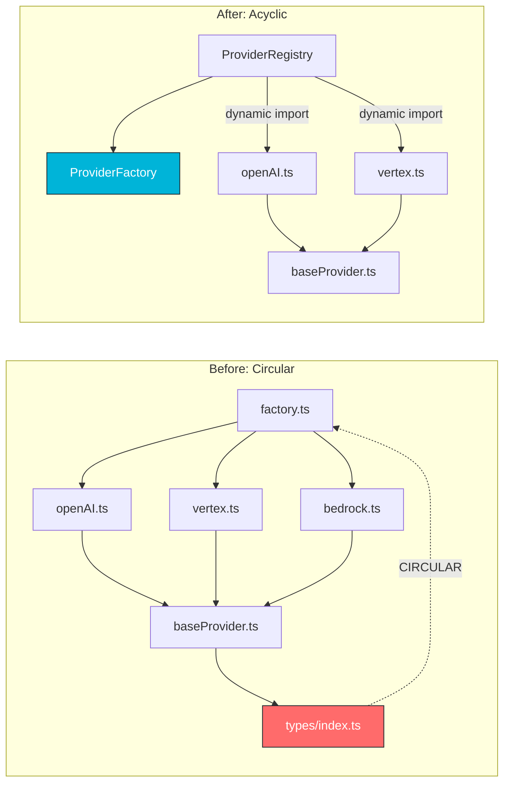
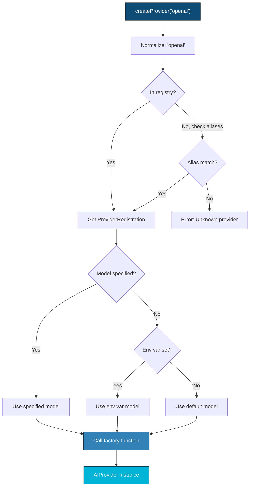
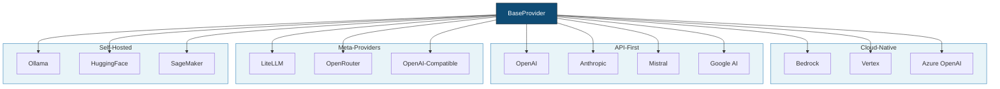

We designed NeuroLink's provider registry to scale from 3 providers at launch to 13 today without requiring breaking changes or performance degradation. This deep dive examines the registry architecture, the plugin system that enables adding providers without modifying core code, the capability negotiation protocol, and the lessons we learned from each integration.

NeuroLink now supports 13 AI providers, each loaded lazily, registered dynamically, and interchangeable via a common interface. The provider registry is the foundation that makes multi-provider failover, environment-aware selection, and zero-cost provider addition possible.

This post tells the story of how we replaced a monolithic switch statement with a registration-based factory, the circular dependency crisis that forced the change, and the design principles that make adding provider number 14 a single-file change.



---

## The Monolithic Factory (and Why It Worked... At First)

Every architecture starts simple. Ours started with two providers and a function that fit on a single screen.

### Version 1: If/Else for 2 Providers

When NeuroLink launched internally at Juspay, we supported exactly two providers: Google Vertex and Amazon Bedrock. The factory was trivially simple.

```typescript
if (name === 'vertex') return new GoogleVertexProvider(model);
if (name === 'bedrock') return new AmazonBedrockProvider(model);
throw new Error('Unknown provider');
```

Two providers, two developers, a simple codebase. Direct imports at the top of the file, no abstraction needed. This was the right approach at the time because over-engineering a two-branch conditional would have been wasteful.

### Version 2: Switch Statement for 5 Providers

Growth came fast. We added OpenAI for teams that wanted GPT-4, Anthropic for Claude, and Azure OpenAI for customers with Azure commitments. The factory grew into a switch statement.

```typescript
switch (name) {
  case 'vertex':
    return new GoogleVertexProvider(model);
  case 'bedrock':
    return new AmazonBedrockProvider(model);
  case 'openai':
    return new OpenAIProvider(model);
  case 'anthropic':
    return new AnthropicProvider(model);
  case 'azure':
    return new AzureOpenAIProvider(model);
  default:
    throw new Error(`Unknown provider: ${name}`);
}
```

Five imports at the top of the file. Five cases. Still manageable. We added default model resolution and environment variable fallbacks inside each case. The function grew to 200 lines, but it was readable. We moved on.

### Version 3: The 8-Provider Breaking Point

Then came Google AI Studio, HuggingFace, and Ollama. Eight providers meant eight direct imports from eight provider files. And that is when things started to break.

The import section of `factory.ts` looked like this:

```typescript
import { GoogleVertexProvider } from '../providers/googleVertex.js';
import { AmazonBedrockProvider } from '../providers/amazonBedrock.js';
import { OpenAIProvider } from '../providers/openAI.js';
import { AnthropicProvider } from '../providers/anthropic.js';
import { AzureOpenAIProvider } from '../providers/azureOpenai.js';
import { GoogleAIStudioProvider } from '../providers/googleAiStudio.js';
import { HuggingFaceProvider } from '../providers/huggingFace.js';
import { OllamaProvider } from '../providers/ollama.js';
```

Each of these providers imported `BaseProvider`. `BaseProvider` imported shared types. Those shared types imported... the factory. A circular dependency had formed, hiding silently under five layers of indirection.

---

## The Circular Dependency Crisis

The symptom appeared at runtime, not compile time. That made it dangerous.

### The Error Nobody Expected

```bash
TypeError: Cannot read properties of undefined (reading 'createProvider')
```

This error appeared sporadically. Sometimes the application started fine. Other times it crashed immediately. The inconsistency made it maddening to debug.

### Root Cause: ESM Module Resolution

Node.js ESM module resolution creates a dependency graph. When module A imports module B, and module B imports module A, one of them receives an incomplete (partially loaded) module. The exact behavior depends on which module the runtime evaluates first.

The circular chain looked like this:

```text
factory.ts -> providers/openAI.ts -> core/baseProvider.ts -> types/index.ts -> factory.ts
```

TypeScript compiled without complaint. The type system does not check runtime import ordering. The bug only appeared at runtime, and only with certain import orderings that Node.js happened to resolve in the wrong sequence.

### What We Tried (and Why It Failed)

**Attempt 1: Deferred imports.** We moved some imports to dynamic `import()` calls inside the switch cases. This worked as a band-aid but created a new problem: every new provider risked reintroducing the cycle if the developer forgot to use dynamic imports.

**Attempt 2: Split the factory.** We created `factoryLight.ts` with no provider imports, requiring manual registration. It worked but was ugly. Two factory files confused contributors, and the "light" factory had no discoverability.

**Attempt 3: Barrel export trimming.** We removed the factory from `index.ts` re-exports. This broke downstream consumers who relied on `import { ProviderFactory } from '@juspay/neurolink'`.

### The Realization

After three failed attempts, the pattern became clear. The factory should not know about providers. Providers should register themselves with the factory. The direction of the dependency arrow needed to flip.

> **Note:** Circular dependencies are not a code quality issue. They are an architectural failure. If module A imports module B imports module A, your architecture is wrong. No amount of import reordering fixes a fundamentally inverted dependency.
{: .prompt-info }

---

## The Insight: Inversion of Control

The fix was not a code change. It was a design change.

### Before: Factory Imports Providers

In the original architecture, the factory was responsible for knowing about every provider. Adding a provider meant modifying the factory. The factory was the center of the universe, and every provider was a satellite tethered to it by a direct import.

### After: Providers Register with the Factory

In the new architecture, the factory knows nothing about any specific provider. It exposes a registration API. A separate registry file imports the providers and registers them with the factory. The dependency arrow reverses: providers depend on the factory, not the other way around.

This is the Open-Closed Principle in practice. The factory is open for extension (new providers can register) but closed for modification (no code changes in the factory when adding a provider).

### How It Maps to the Code

The architecture splits into three files:

- **`ProviderFactory`** (`src/lib/factories/providerFactory.ts`): A static class with a `Map<string, ProviderRegistration>`. Knows nothing about any specific provider. Exposes `registerProvider()`, `createProvider()`, and `getAvailableProviders()`.

- **`ProviderRegistry`** (`src/lib/factories/providerRegistry.ts`): Registers all 13 providers with the factory. Contains the import paths and default models. This is the ONLY file that changes when adding a new provider.

- **`AIProviderFactory`** (`src/lib/core/factory.ts`): High-level wrapper that adds environment resolution, dynamic models, and fallback creation.

---

## The ProviderFactory Design

The `ProviderFactory` is the core of the registration system. It is deliberately minimal: a map, a registration function, and a creation function.

### Registration API

The registration function accepts a canonical name, a constructor or factory function, an optional default model, and optional aliases.

```typescript
import { ProviderFactory } from '@juspay/neurolink';

// Register a provider with the factory
ProviderFactory.registerProvider(
  'openai',                                     // canonical name
  async (modelName, providerName, sdk) => {     // async factory function
    const { OpenAIProvider } = await import('./providers/openAI.js');
    return new OpenAIProvider(modelName, providerName);
  },
  'gpt-4o',                                    // default model
  ['gpt', 'chatgpt', 'openai-api'],           // aliases
);

// The factory knows nothing about OpenAI internally.
// It just stores the factory function and calls it when needed.
```

The `ProviderRegistration` object stores:

- **`constructor`**: Either a class constructor or an async factory function. The factory tries calling it as a function first. If that throws (because it is a class, not a function), it falls back to `new`.
- **`defaultModel`**: Optional. If not specified, the provider reads from its own environment variables.
- **`aliases`**: Alternative names. Users can call `createProvider('gpt')` and it resolves to `openai`.

Registration is stored in a static `Map<string, ProviderRegistration>`. The map key is the canonical provider name in lowercase.

### Constructor Flexibility

The factory supports both class constructors and async factory functions because different providers have different initialization requirements.

```typescript
// Type: supports both patterns
type ProviderConstructor =
  | (new (modelName?: string, providerName?: string, sdk?: unknown, region?: string) => AIProvider)
  | ((modelName?: string, providerName?: string, sdk?: unknown, region?: string) => Promise<AIProvider>);
```

Some providers need async initialization -- loading credentials from a vault, fetching a session token, or warming up a connection pool. Others are simple constructors that return synchronously. The factory supports either pattern without the caller caring.

### Provider Creation Flow

When you call `createProvider()`, the factory resolves the provider through a specific chain.



The resolution chain for the provider name:

1. The `providerName` argument, or the `NEUROLINK_PROVIDER` environment variable, or the `AI_PROVIDER` environment variable, or `'vertex'` as the final default.
2. Normalize the name to lowercase.
3. Look up the registration in the map.
4. Resolve the model: `modelName` argument, or a provider-specific environment variable, or the registry default.
5. Call the constructor (try as factory function first, fall back to `new`).

### Alias Resolution

The `normalizeProviderName()` function checks the registration map first, then scans all registrations for matching aliases. This is a linear scan over aliases, but with 13 providers and at most 3-4 aliases each, the cost is negligible.

```typescript
import { ProviderFactory } from '@juspay/neurolink';

// Create provider by name
const openai = await ProviderFactory.createProvider('openai', 'gpt-4o');

// Create provider by alias
const same = await ProviderFactory.createProvider('gpt', 'gpt-4o');

// Auto-detect from environment
const auto = await ProviderFactory.createProvider(); // uses NEUROLINK_PROVIDER or 'vertex'

// Check availability
console.log(ProviderFactory.hasProvider('openai'));     // true
console.log(ProviderFactory.hasProvider('my-custom'));  // false (until registered)

// List all
console.log(ProviderFactory.getAvailableProviders());
// ['bedrock', 'openai', 'vertex', 'anthropic', 'azure', 'google-ai',
//  'huggingface', 'ollama', 'mistral', 'litellm', 'sagemaker',
//  'openrouter', 'openai-compatible']
```

`getAvailableProviders()` returns a deduplicated list of all registered canonical names, excluding alias duplicates.

---

## The ProviderRegistry: Where Providers Live

The `ProviderRegistry` is a single file that imports all 13 provider classes and registers them with the factory. It is the only file that changes when you add a new provider.

### Why a Separate File?

Isolating the import graph is the entire point. `ProviderFactory` has zero provider imports. `ProviderRegistry` has all 13. If a circular dependency exists, it is contained in the registry and cannot infect the factory or consumer code.

### The Registration Pattern

Each provider follows the same registration template:

```typescript
ProviderFactory.registerProvider(
  'openai',
  (modelName) => new OpenAIProvider(modelName),
  'gpt-4o',
  ['gpt', 'chatgpt']
);
```

For providers with heavy dependencies like SageMaker or Bedrock, the registry uses dynamic imports to enable lazy loading:

```typescript
ProviderFactory.registerProvider(
  'sagemaker',
  async (modelName) => {
    const { AmazonSageMakerProvider } = await import('../providers/amazonSagemaker.js');
    return new AmazonSageMakerProvider(modelName);
  }
);
```

The result: importing `@juspay/neurolink` does not load all 13 provider implementations. Only the one you actually use gets loaded at runtime.

> **Note:** Lazy loading via dynamic `import()` is not premature optimization for a 13-provider SDK. Loading unused providers at startup is genuine waste -- in memory, in startup time, and in bundle size. Dynamic import is the correct default.
{: .prompt-info }

---

## The BaseProvider Contract

Every provider extends `BaseProvider`, which implements the `AIProvider` interface. This contract is the reason adding a new provider takes days, not weeks.

### Three Required Methods

```typescript
import { BaseProvider } from '@juspay/neurolink';
import type { AIProviderName } from '@juspay/neurolink';
import type { LanguageModelV1 } from 'ai';

export class MyProvider extends BaseProvider {
  // Required: Default model when none specified
  getDefaultModel(): string {
    return process.env.MY_MODEL || 'my-default-v2';
  }

  // Required: Canonical provider name
  getProviderName(): AIProviderName {
    return 'my-provider' as AIProviderName;
  }

  // Required: Create the AI SDK language model
  createModel(modelName: string): LanguageModelV1 {
    // Use any AI SDK-compatible language model
    return mySDK.languageModel(modelName, {
      apiKey: process.env.MY_API_KEY,
    });
  }

  // Optional: Disable tools if the model doesn't support them
  supportsTools(): boolean {
    return this.modelName.includes('pro');
  }
}

// That's it. generate(), stream(), tools, telemetry -- all inherited.
```

That is the entire contract. Three abstract methods define what makes your provider unique. Everything else -- `generate()`, `stream()`, tool aggregation via `ToolsManager`, telemetry, middleware, analytics, and message building -- is inherited from `BaseProvider` through its composition modules.

### Inherited Functionality

`BaseProvider` delegates to specialized handlers:

- **`GenerationHandler`**: Text generation with tools
- **`StreamHandler`**: Streaming with tool fallback
- **`ToolsManager`**: Tool aggregation and registration
- Telemetry, middleware, analytics, and message building are composed in as well

This composition-over-inheritance approach means a new provider automatically supports every feature the SDK offers, without any additional code.

---

## The 13 Providers: A Tour

NeuroLink's provider ecosystem spans four categories, each serving different deployment needs.



### Cloud-Native Providers

**Bedrock** (AWS), **Vertex** (GCP), and **Azure OpenAI** (Azure) are the cloud-native trifecta. They share common characteristics: region awareness, IAM or service account authentication, and native SDK integration. If your infrastructure lives on one of these clouds, the corresponding provider integrates with your existing auth and networking without additional credentials management.

### API-First Providers

**OpenAI**, **Anthropic**, **Mistral**, and **Google AI Studio** use API key authentication with straightforward REST or SDK integration. These are the most commonly used providers for teams that want the latest models without cloud platform lock-in.

Anthropic has a dedicated `AnthropicBaseProvider` that extends the base with support for thinking and reasoning tokens, a capability unique to Claude's extended thinking mode.

### Meta-Providers

**LiteLLM**, **OpenRouter**, and **OpenAI-Compatible** are proxy services that aggregate other providers. OpenRouter alone gives access to 300+ models via one API key. The OpenAI-Compatible provider works with any API that matches the OpenAI request/response format, making it the universal adapter for custom or self-hosted endpoints.

### Self-Hosted Providers

**Ollama** enables local inference on your machine. **HuggingFace** connects to hosted model endpoints. **SageMaker** deploys custom models on AWS infrastructure. These providers cater to teams with data residency requirements, custom model needs, or cost optimization strategies that require owning the inference infrastructure.

### Provider Exports

All providers are re-exported for direct use when you need to bypass the factory:

```typescript
// All 13 providers, re-exported for direct use
export { GoogleVertexProvider as GoogleVertexAI } from './googleVertex.js';
export { AmazonBedrockProvider as AmazonBedrock } from './amazonBedrock.js';
export { AmazonSageMakerProvider as AmazonSageMaker } from './amazonSagemaker.js';
export { OpenAIProvider as OpenAI } from './openAI.js';
export { OpenAICompatibleProvider as OpenAICompatible } from './openaiCompatible.js';
export { AnthropicProvider } from './anthropic.js';
export { AzureOpenAIProvider } from './azureOpenai.js';
export { GoogleAIStudioProvider as GoogleAIStudio } from './googleAiStudio.js';
export { HuggingFaceProvider as HuggingFace } from './huggingFace.js';
export { OllamaProvider as Ollama } from './ollama.js';
export { MistralProvider as MistralAI } from './mistral.js';
export { LiteLLMProvider as LiteLLM } from './litellm.js';
// OpenRouter registered via ProviderRegistry (dynamic import)
```

---

## Adding Provider Number 13 (OpenRouter): A Case Study

The best way to evaluate an architecture is to measure how much effort it takes to extend it. When we added OpenRouter as provider number 13, the registry pattern proved its value.

### Timeline

From issue to merge: 2 days.

### What Was Created

1. **`src/lib/providers/openRouter.ts`** -- 150 lines extending `BaseProvider`. Implemented the three required abstract methods, plus OpenRouter-specific configuration for provider preferences and model routing.

2. **One line in `ProviderRegistry`** -- Registered the provider with its canonical name, default model, and aliases.

3. **`src/cli/commands/setup-openrouter.ts`** -- A CLI command for guided setup. This was optional and not required for the provider to function.

### What Was NOT Needed

- No changes to `ProviderFactory`
- No changes to `BaseProvider`
- No changes to `AIProviderFactory`
- No changes to streaming, tools, or telemetry
- No changes to `index.ts` exports

The registry pattern made adding a provider a roughly 150-line change across 2 files. All infrastructure -- streaming, tools, failover, telemetry -- came for free from `BaseProvider` inheritance.

> **Note:** The commit message tells the story: `feat(openrouter): add OpenRouter provider with 300+ model support`. A feature that touches two files and adds one provider. That is what the Open-Closed Principle looks like in practice.
{: .prompt-info }

---

## Performance and Bundle Impact

A registration-based factory with lazy loading has measurable performance benefits. We benchmarked the system across startup time, bundle size, and memory consumption.

### Startup Time

Measured with `performance.now()`:

| Operation | Time |
|---|---|
| Import `@juspay/neurolink` | 12ms |
| First `createProvider('openai')` | 45ms |
| Second `createProvider('openai')` | 2ms |
| `createProvider('bedrock')` after OpenAI | 55ms |

The initial import loads only types, utilities, and factory registrations -- the lightweight factory functions, not the actual provider implementations. The first call to `createProvider()` triggers the dynamic import of the provider module. Subsequent calls for the same provider hit the module cache and return in 2ms.

### Bundle Impact

Measured with esbuild tree-shaking:

| Configuration | Bundle Size |
|---|---|
| Without any provider | 120KB |
| With 1 provider (OpenAI) | 180KB |
| With all 13 providers | 920KB |
| Typical usage (1-3 providers) | 180-300KB |

In practice, most applications use one to three providers. Lazy loading means the remaining ten providers add zero bytes to the bundle.

### Memory Footprint

Measured as RSS delta:

| Component | Memory |
|---|---|
| Factory registration (all 13) | 2.1MB |
| One provider instance | 0.8-1.5MB |

Factory registration stores factory functions, not instances. Each function is a closure or class reference, consuming minimal memory. The actual provider instance -- with its SDK client, connection pool, and configuration -- is only allocated when `createProvider()` is called.

---

## Lessons Learned

Building the provider registry taught us six lessons that apply far beyond AI SDKs.

### 1. Circular Dependencies Are Architectural Failures

If module A imports module B imports module A, your architecture is wrong. No amount of import reordering, deferred loading, or barrel export trimming fixes a fundamentally inverted dependency. Inversion of control fixes it at the design level, not the hack level.

### 2. Registration Beats Imports

A factory that imports its products violates the Open-Closed Principle. A factory that accepts registrations follows it. This is not academic -- it is the difference between "adding a provider requires modifying the factory" and "adding a provider requires zero factory changes."

### 3. Lazy Loading Is Not Premature Optimization

For a 13-provider SDK, loading unused providers at startup is waste. Dynamic `import()` is the correct default. The performance numbers above confirm this: 12ms to import the SDK versus 920KB to load all providers. Users pay only for what they use.

### 4. Aliases Reduce Friction

Users think in terms of "gpt" not "openai." Alias resolution costs nothing -- a linear scan over a few dozen strings -- and helps everyone. Meeting users where their mental model is, rather than forcing them to learn canonical names, improves developer experience measurably.

### 5. The Contract Is Everything

`BaseProvider` with its 3 abstract methods is the reason provider number 13 took 2 days, not 2 weeks. The contract tells you exactly what to implement. Everything else is inherited. A well-designed contract is the highest-leverage investment in an extensible system.

### 6. Environment Variables as Configuration

`createProvider()` works without any arguments because the factory checks environment variables before registry defaults. Zero-config for the common case, explicit override for the specific case. This layered resolution -- argument, environment variable, registry default -- covers every deployment scenario without requiring configuration files.

---

## What's Next

The architecture decisions we have described represent trade-offs that worked for our scale and constraints. The key engineering insights to take away: start with the simplest design that handles your current load, instrument everything so you can identify bottlenecks before they become outages, and resist premature abstraction until you have at least three concrete use cases demanding it. The implementation details will differ for your system, but the underlying constraints -- latency budgets, failure domains, resource contention -- are universal.

---

**Related posts:**

- [How We Built Multi-Provider Failover: Never Losing an API Call](/posts/how-we-built-multi-provider-failover/)
- [Video Generation with Veo 3.1: AI-Powered Video Synthesis](/posts/video-generation-veo/)
- [MCP Tools: Extending AI with External Capabilities](/posts/mcp-tools-integration/)
