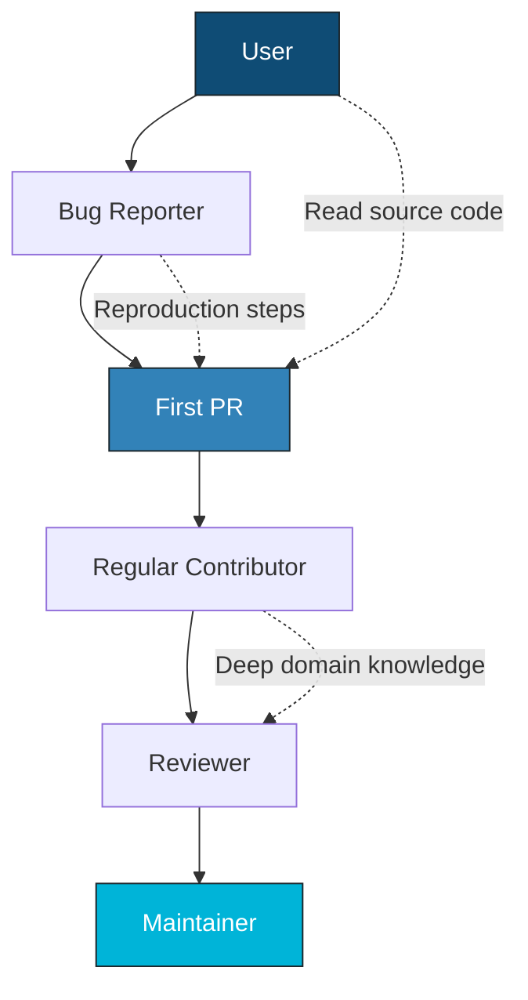
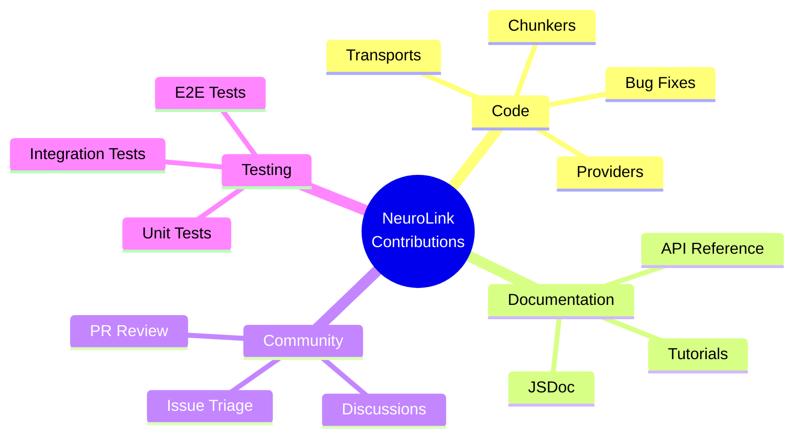

Anyone who thinks open source maintainership is a promotion is wrong -- it is a different job entirely. After two years contributing to NeuroLink and six months as a maintainer, the biggest surprise was how much the role shifts from writing code to making decisions about other people's code. Here is what I wish someone had told me before I accepted the commit bit.

Open-source contribution paths are rarely documented from the inside. Blog posts tell you to "find a good first issue" and "submit a PR," but they skip the messy middle: the failed attempts, the review feedback that stings before it teaches, the slow accumulation of context that eventually makes you the person others ask for help.

This post traces the concrete steps from interested outsider to core maintainer. If you are a developer who wants to contribute to open source but does not know where to start, this is the playbook I wish I had.



---

## The First Contribution (Month 1-2)

### Finding the Project

I discovered NeuroLink while evaluating AI SDKs for a side project. The requirement was straightforward: call different LLM providers through a single interface without rewriting my application layer every time I switched models. Most SDKs locked you into one provider or required substantial glue code for multi-provider support.

NeuroLink's multi-provider abstraction solved the problem directly. One `createProvider()` call, one `generate()` interface, thirteen providers behind the scenes. I started using it, and within a week I hit a bug.

### Filing a Quality Bug Report

The `createAIProviderWithFallback` function was not propagating custom headers to the fallback provider. When the primary provider failed and the SDK fell back to the secondary, my custom headers disappeared.

I filed an issue with detailed reproduction steps: the exact code I ran, the expected behavior, the actual behavior, and the environment details. The maintainers responded within 24 hours. One of them commented: "Great repro. Want to fix it?"

That comment changed my trajectory.

> **Note:** Filing high-quality bug reports is a genuine contribution. Reproduction steps are gold. Many open-source maintainers spend more time reproducing bugs than fixing them. A clear, reproducible issue is often more valuable than a PR without context.
{: .prompt-info }

### The First Pull Request

The fix was 6 lines across `src/lib/index.ts`. The code change itself took 20 minutes. The other 2 hours and 40 minutes went toward understanding the codebase well enough to make those 6 lines correct.

```typescript
// Before: Headers not propagated to fallback provider
export async function createAIProviderWithFallback(
  primaryProvider?: string,
  fallbackProvider?: string,
  modelName?: string,
) {
  return await AIProviderFactory.createProviderWithFallback(
    primaryProvider || 'bedrock',
    fallbackProvider || 'vertex',
    modelName,
  );
}
```

The code review taught me three patterns that define the NeuroLink codebase:

1. **Provider options flow through `UnknownRecord` for flexibility** -- the SDK uses a generic record type so providers can accept arbitrary configuration without the core types knowing about provider-specific fields.
2. **Error handling follows a consistent logger pattern** -- every function that can fail uses the same structured logging approach.
3. **Tests mirror the source tree structure** -- if the source is at `src/lib/providers/openAI.ts`, the test lives at `tests/lib/providers/openAI.test.ts`.

The PR was merged in 3 days. Six lines. Three hours. One lesson: small, well-scoped PRs with tests get reviewed fast.

---

## Building Momentum (Month 3-6)

### Documentation as a Gateway

After the first PR, I looked for more ways to contribute. The lowest-friction path was documentation: fixing typos, improving JSDoc comments, and adding examples to exported functions.

Documentation PRs are underrated. They are low-risk and high-impact. Every typo fix, every clarified parameter description, every added `@example` block makes the SDK more accessible to the next developer. And for the contributor, they are a way to read the codebase systematically without the pressure of getting logic correct.

I submitted roughly a dozen documentation PRs over three months. Each one required reading the function I was documenting, understanding its behavior, and verifying that my description matched the implementation. By the end of this phase, I had read most of the core SDK surface area.

### Adding a Provider: The Gateway Drug

The maintainers suggested I try adding a provider. Contributing the OpenRouter provider (`feat(openrouter): add OpenRouter provider with 300+ model support`) required understanding four systems:

1. **The `BaseProvider` contract**: `generate()`, `stream()`, `supportsTools()` -- the three abstract methods every provider must implement.
2. **The `ProviderFactory` registration pattern**: How providers register themselves with the factory via a canonical name, factory function, default model, and aliases.
3. **How the AI SDK's `LanguageModelV1` interface maps to provider APIs**: Each provider creates a `LanguageModelV1` instance that the Vercel AI SDK uses for generation and streaming.
4. **Error handling and edge cases**: What happens when the provider returns an unexpected response format, when the API key is missing, when the model does not support tools.

```typescript
// Step 1: Create provider class extending BaseProvider
export class OpenRouterProvider extends BaseProvider {
  constructor(modelName?: string, providerName?: AIProviderName) {
    super(modelName || 'openai/gpt-4o', providerName || 'openrouter');
  }

  getDefaultModel(): string {
    return process.env.OPENROUTER_MODEL || 'openai/gpt-4o';
  }

  getProviderName(): AIProviderName {
    return 'openrouter' as AIProviderName;
  }
}

// Step 2: Register in ProviderRegistry
ProviderFactory.registerProvider(
  'openrouter',
  (modelName) => new OpenRouterProvider(modelName),
  'openai/gpt-4o',
  ['open-router', 'or']
);
```

The provider took about a week of evenings. The `BaseProvider` contract made the structure clear. The code review was thorough -- not just "LGTM," but explanations of why certain patterns exist, pointers to related code I should understand, and suggestions for edge cases I had missed.

> **Note:** Providers are the best entry point into understanding an AI SDK. Each provider touches types, streaming, tools, error handling, and configuration. Building one forces you to understand how the SDK works end-to-end.
{: .prompt-info }

### Code Review Culture

The code review culture at NeuroLink taught me as much as reading the source code. Reviews were not gatekeeping exercises. They were collaborative discussions about trade-offs, patterns, and edge cases.

A typical review comment was not "change this" but "here is why we do it this way, and here is the code that depends on this pattern." Maintainers linked to related PRs, explained historical decisions, and pointed to tests that exercised the behavior in question.

This approach taught me the codebase faster than reading it alone ever could. Every PR review was a guided tour of a different corner of the SDK.

---

## Going Deeper (Month 7-12)

### MCP Transport Work

After the provider contribution, I wanted to go deeper. The Model Context Protocol (MCP) integration was actively evolving, and the transport layer needed work.

I contributed WebSocket transport support (extending the MCP SDK's transport module) for MCP, then helped with the HTTP/Streamable HTTP transport. This required understanding systems far more complex than a single provider:

- **The `MCPClientFactory` factory pattern** with its `createTransport` switch for selecting the right transport based on server configuration.
- **Circuit breaker patterns** from `MCPCircuitBreaker`, which manages connection health and prevents cascading failures when an MCP server goes down.
- **OAuth 2.1 flow with PKCE** for the HTTP transport, which authenticates MCP clients against protected servers without exposing secrets.

The MCP work was harder than the provider work. It involved protocol-level concerns, connection lifecycle management, and security flows. But the foundation I built from the provider contribution -- understanding `BaseProvider`, the factory pattern, the testing approach -- transferred directly.

### RAG Chunker Contributions

In parallel, I contributed the `LaTeXChunker` for academic papers. The RAG subsystem follows a registration pattern similar to providers: extend `BaseChunker`, implement the chunking logic, and register in `ChunkerRegistry`.

```typescript
import { ChunkerRegistry } from '@juspay/neurolink';

// Register a custom chunker for a specific content type
chunkerRegistry.registerChunker(
  'latex',
  async () => {
    const { LaTeXChunker } = await import('./chunkers/LaTeXChunker.js');
    return new LaTeXChunker();
  },
  {
    description: 'Splits LaTeX documents by sections and environments',
    defaultConfig: { maxSize: 1000, overlap: 0 },
    supportedOptions: ['maxSize', 'environments', 'splitMathBlocks'],
    useCases: ['Academic papers', 'Scientific documents'],
    aliases: ['tex', 'latex-section'],
  }
);
```

The registration pattern was familiar from the provider work. The actual chunking logic was domain-specific -- parsing LaTeX environments, handling nested sections, preserving math blocks -- but the surrounding infrastructure was identical.

### Architecture Discussions

By month 10, I had contributed to three subsystems: providers, MCP transports, and RAG chunkers. This breadth gave me credibility in architecture discussions.

When the team discussed modular refactoring of `BaseProvider`, I could speak from experience. I had felt the friction of `BaseProvider` doing too many things. My experience adding the OpenRouter provider gave me concrete examples of where the abstraction leaked and where composition would be cleaner than inheritance.

I advocated for the `ToolsManager` extraction -- pulling tool aggregation out of `BaseProvider` and into a dedicated module. The change made provider implementations simpler and tool management independently testable.

Depth in one area (providers) created lateral mobility into related systems (MCP, RAG), which created credibility in architectural conversations. The path was not linear, but each step enabled the next.

---

## Becoming a Maintainer (Month 13-18)

### Triage Responsibilities

Maintainership does not start with a ceremony. It starts with triage.

I began triaging issues: reproducing bugs, asking clarifying questions, labeling PRs, and identifying duplicates. This is the unglamorous backbone of open source. Nobody writes blog posts about the hours spent asking "can you provide your Node.js version and a minimal reproduction?" But it is the work that keeps a project healthy.

Triage taught me what the community needed. Bug reports clustered around provider-specific edge cases. Feature requests centered on new chunkers and transport protocols. Documentation issues were about configuration, not API usage. These patterns informed my contributions.

### Review Access

After several months of consistent triage, I was given write access to review community PRs. The responsibility felt different from contributing. When you contribute, you are responsible for your code. When you review, you are responsible for someone else's experience with the project.

I learned to give the same quality of review I had received: not just approval or rejection, but explanation. Why does this pattern exist? What code depends on this behavior? Here is a test that should be added. Here is an edge case to consider.

Good code review is mentoring disguised as quality assurance.

### Design Review

Participating in the v9 modular architecture design was the milestone that felt most like "maintainership." I advocated for the composition-over-inheritance approach in `BaseProvider` modules, drawing on my experience with all three subsystems.

The design decisions were not about which approach was technically correct -- both inheritance and composition could work. They were about which approach would make it easier for the next contributor to add provider number 14, chunker number 11, or transport number 5. We chose composition because it reduces the surface area a contributor needs to understand.

---

## Areas of Contribution

Open source contribution extends far beyond writing code. The NeuroLink project benefits from work across four distinct areas.



Each area has its own learning curve and its own impact. Code contributions are the most visible, but documentation and triage are often higher-leverage because they multiply the effectiveness of every other contributor.

---

## Advice for New Contributors

Eighteen months of open-source contribution distilled into six actionable recommendations.

### 1. Start with Issues, Not PRs

Filing high-quality bug reports is a contribution. Reproduction steps are gold. A well-written issue with environment details, steps to reproduce, expected behavior, and actual behavior saves maintainers hours of investigation.

Before you write a single line of code, demonstrate that you understand the project well enough to articulate where it falls short. That understanding is more valuable than a premature fix.

### 2. Read the Code Before the Docs

NeuroLink's source code is well-structured. Start at `src/lib/index.ts` and follow the exports. Read the `BaseProvider` class. Read a provider implementation. Read a test file.

Documentation describes intent. Source code describes reality. When the two disagree, the source code wins. Reading source code also builds the mental model you need to contribute effectively.

### 3. Pick a Vertical

Provider? Chunker? Transport? CLI command? Pick one vertical and go deep. Deep knowledge in one area creates credibility and lateral mobility. You cannot meaningfully contribute to architecture discussions without deep experience in at least one subsystem.

### 4. Write Tests

PRs with tests get merged faster. Period.

Tests demonstrate that you understand the expected behavior, not just the implementation. They protect your contribution from being accidentally broken by future changes. And they signal to reviewers that you take quality seriously.

### 5. Join the Conversation

GitHub Discussions, PR review comments, and issue triage are all contributions. Engaging with the community builds relationships, surfaces context that is not in the code, and establishes your presence as someone who cares about the project's direction.

Some of my most valuable learning came from reading other people's PR reviews and understanding why a maintainer suggested a particular approach.

### 6. Be Patient

Open-source maintainers are often volunteers or have full-time jobs. A PR might sit for a week before review. An issue might take days to get triaged. Patience and clarity in communication go a long way.

Follow up politely. Provide additional context when asked. Do not take review feedback personally. Every comment is an opportunity to learn something the reviewer knows that you do not.

> **Note:** Open source is a long game. The skills you build -- reading unfamiliar codebases, communicating technical decisions in writing, navigating distributed collaboration -- compound over years, not weeks.
{: .prompt-info }

---

## The Career Impact

Open-source contribution is a career accelerator in three dimensions.

**Technical depth.** Contributing to an AI SDK forced me to understand streaming protocols, factory patterns, circuit breakers, OAuth flows, and language model interfaces at a level that no tutorial or course could match. Production code is the best teacher because it accounts for edge cases that educational material skips.

**Public portfolio.** Every PR, issue, and review is public. Hiring managers and technical interviewers can see not just what you built, but how you communicate, how you respond to feedback, and how you approach problems. Your contribution history is a portfolio that speaks for itself.

**Professional network.** The people I met through NeuroLink contributions -- maintainers, fellow contributors, users who filed issues -- became part of my professional network. Open source creates connections that cross company boundaries and geographic borders.

---

## What's Next

The direction is clear, even if the timeline is not. Organizations that invest in these capabilities now -- building the infrastructure, developing the talent, establishing the practices -- will compound their advantage over those that wait. The question is not whether this shift will happen, but whether your team will be leading it or catching up. The tools are available. The patterns are proven. The only remaining variable is execution.

---

**Related posts:**

- [How We Scaled to 13 Providers: The Provider Registry Story](/posts/how-we-scaled-provider-registry/)
- [Open Source AI Infrastructure: Why We Open-Sourced NeuroLink](/posts/open-source-neurolink/)
- [Generating 10,000 Descriptions a Day: Cost-Optimized Content Pipelines](/posts/generating-10k-descriptions-cost-optimized-pipelines/)
