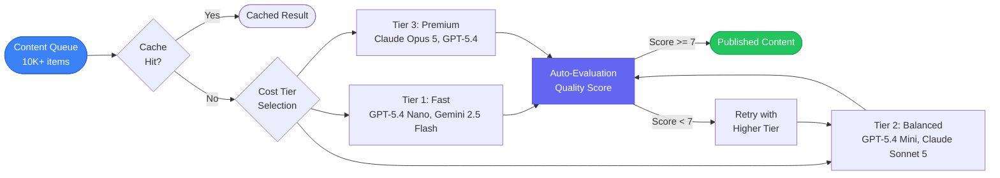
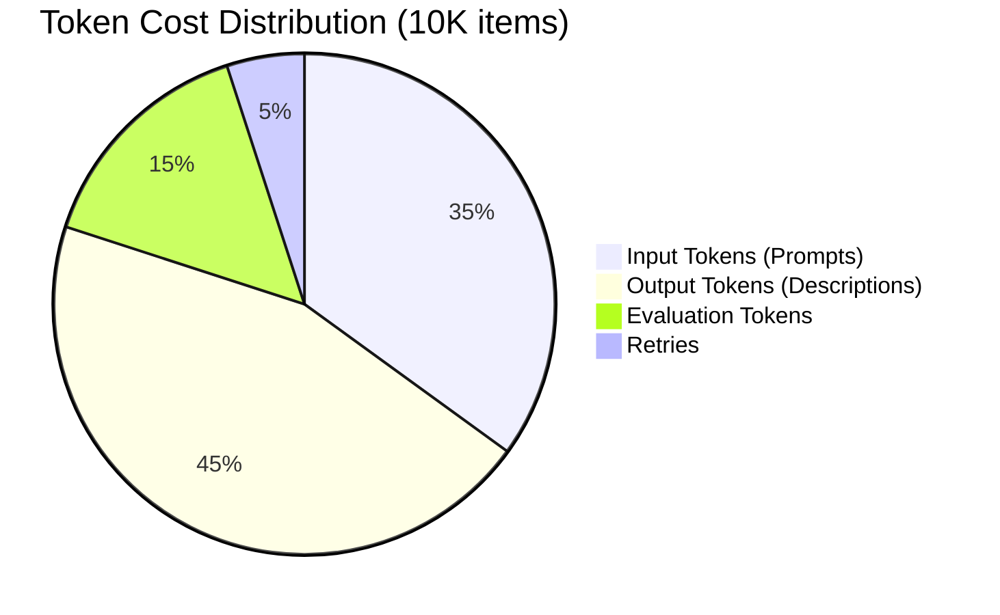

This post designs an illustrative content pipeline for a target of 10,000 product descriptions per day. It examines model tiering (which tasks warrant GPT-5.4 versus Gemini 2.5 Flash), a cache that avoids exact duplicate generations, a quality-scoring gate, and concurrency controls that prevent rate-limit storms. The dollar figures and pass rates in a real deployment depend on current provider pricing, token counts, prompts, and catalog mix.

The business case for high-volume AI content is clear. E-commerce catalogs with thousands of SKUs, real estate platforms with hundreds of new listings daily, job boards with continuous postings, and content localization across multiple markets all need automated content at scale. But brute-force generation fails in three ways: cost explosion from using premium models for simple content, quality variance from inconsistent prompting, and zero observability into what you are spending and why.

NeuroLink's approach combines model registry for cost-aware model selection, tiered generation with automatic quality-based escalation, middleware for spend tracking, and auto-evaluation as a quality gate. This post shows you how to build the complete pipeline.

## Architecture: Cost-Optimized Content Pipeline

The pipeline follows a tiered model with caching and quality gates:


```mermaid
flowchart LR
    INPUT(["Content Queue<br/>10K+ items"]) --> CACHE{"Cache<br/>Hit?"}
    CACHE -->|"Yes"| CACHED(["Cached Result"])
    CACHE -->|"No"| TIER{"Cost Tier<br/>Selection"}

    TIER --> FAST["Tier 1: Fast<br/>GPT-5.4 Nano, Gemini 2.5 Flash"]
    TIER --> BALANCED["Tier 2: Balanced<br/>GPT-5.4 Mini, Claude Sonnet 5"]
    TIER --> PREMIUM["Tier 3: Premium<br/>Claude Opus 5, GPT-5.4"]

    FAST & BALANCED & PREMIUM --> EVAL["Auto-Evaluation<br/>Quality Score"]
    EVAL -->|"Score >= 7"| OUTPUT(["Published Content"])
    EVAL -->|"Score < 7"| RETRY["Retry with<br/>Higher Tier"]
    RETRY --> BALANCED

    style INPUT fill:#3b82f6,stroke:#2563eb,color:#fff
    style EVAL fill:#6366f1,stroke:#4f46e5,color:#fff
    style OUTPUT fill:#22c55e,stroke:#16a34a,color:#fff
```

The key insight: start with the cheapest model that might produce acceptable quality. If it fails the quality gate, retry with a better model. Most items pass on the first tier, so your average cost stays low even though some items require premium models.

## Model Selection: Using the Model Registry for Cost Analysis

NeuroLink's model registry gives you programmatic access to model metadata -- cost per token, context window, quality ratings, and capabilities. Use it to make data-driven model selection decisions.

```typescript
import { NeuroLink } from '@juspay/neurolink';

const neurolink = new NeuroLink();

// Use the models CLI to find cost-effective models
// neurolink models search --use-case creative --max-cost 0.01
// neurolink models best --creative --cost-effective
// neurolink models compare gpt-5.4-mini claude-haiku-4-5-20251001 gemini-2.5-flash
```

A current tiering plan can use these in-catalog models:

| Tier | Model | Provider | Best For |
|---|---|---|---|
| Fast | GPT-5.4 Nano | OpenAI | Short, structurally simple descriptions |
| Fast | Gemini 2.5 Flash | Google AI | High-volume first passes |
| Balanced | GPT-5.4 Mini | OpenAI | Descriptions that need more nuance |
| Balanced | Claude Sonnet 5 | Anthropic | Detailed, structured content |
| Premium | Claude Opus 5 or GPT-5.4 | Anthropic or OpenAI | Items that fail the lower-tier quality gate |

Provider prices change, so calculate rather than hard-code the daily estimate. For each tier, multiply its input and output token totals by the provider's current rates, then add the evaluation and retry costs. The blended total is the sum across tiers:

```text
daily cost = sum(tier input tokens * current input rate
               + tier output tokens * current output rate)
             + evaluation cost
```

Measure the pass rate for your own catalog before setting a budget. A pipeline saves money only when enough items pass on the lower tiers to offset evaluation and retry calls.

## Batching Strategy: Processing Items Efficiently

Processing 10,000 items one at a time wastes time on network overhead. Batching with concurrency control maximizes throughput while respecting rate limits.

```typescript
const neurolink = new NeuroLink();

interface Product {
  id: string;
  name: string;
  category: string;
  attributes: Record<string, string>;
}

interface Description {
  id: string;
  content: string;
  model: string;
  tokensUsed: number;
}

function buildPrompt(item: Product): string {
  return `Write a compelling, SEO-friendly product description for:
Product: ${item.name}
Category: ${item.category}
Attributes: ${JSON.stringify(item.attributes)}

Requirements:
- 150-250 words
- Include key features and benefits
- Use natural language, avoid keyword stuffing
- End with a call to action`;
}

async function generateDescriptions(items: Product[]): Promise<Description[]> {
  const results: Description[] = [];

  // Process in batches of 20 with concurrency control
  for (let i = 0; i < items.length; i += 20) {
    const batch = items.slice(i, i + 20);

    const batchResults = await Promise.all(
      batch.map(item =>
        neurolink.generate({
          input: { text: buildPrompt(item) },
          provider: 'openai',
          model: 'gpt-5.4-mini',
          systemPrompt: 'You are a product copywriter. Write compelling, SEO-friendly descriptions.',
        })
      )
    );

    results.push(...batchResults.map((r, idx) => ({
      id: batch[idx].id,
      content: r.content,
      model: 'gpt-5.4-mini',
      tokensUsed: r.usage.total,
    })));

    // Rate limiting: pause between batches
    await sleep(1000);
  }

  return results;
}

function sleep(ms: number): Promise<void> {
  return new Promise(resolve => setTimeout(resolve, ms));
}
```

> **Note:** The batch size of 20 is a starting point. Tune it based on your provider's rate limits. OpenAI allows higher concurrency than some other providers. Monitor for rate limit errors (429 responses) and back off dynamically.
{: .prompt-info }

### Concurrency Tuning

For maximum throughput, use a concurrency limiter instead of fixed batch sizes:

```typescript
async function processWithConcurrency<T, R>(
  items: T[],
  processor: (item: T) => Promise<R>,
  concurrency: number = 10,
): Promise<R[]> {
  const results: R[] = [];
  const executing = new Set<Promise<void>>();

  for (const item of items) {
    const p = processor(item).then(result => {
      results.push(result);
      executing.delete(p);
    });
    executing.add(p);

    if (executing.size >= concurrency) {
      await Promise.race(executing);
    }
  }

  await Promise.all(executing);
  return results;
}

// Process 10K items with 10 concurrent requests
const descriptions = await processWithConcurrency(
  products,
  (product) => generateSingleDescription(product),
  10,
);
```

## Analytics Middleware: Tracking Cost Per Item

You cannot optimize what you do not measure. NeuroLink's analytics middleware tracks token usage, response time, and provider details for every request.

```typescript
const neurolink = new NeuroLink();

const result = await neurolink.generate({
  input: { text: buildPrompt(product) },
  provider: 'openai',
  model: 'gpt-5.4-mini',
  enableAnalytics: true,
});

// GenerateResult exposes per-request fields directly:
console.log(result.usage);        // input, output, total
console.log(result.responseTime);
console.log(result.provider, result.model);
console.log(result.analytics);
```

Build a cost dashboard from the analytics data:

```typescript
interface CostReport {
  totalItems: number;
  totalTokens: number;
  totalCost: number;
  averageCostPerItem: number;
  tierBreakdown: Record<string, { count: number; cost: number }>;
}

function buildCostReport(
  results: Description[],
  blendedRatesPer1K: Readonly<Record<string, number>>,
): CostReport {
  const tierBreakdown: Record<string, { count: number; cost: number }> = {};
  let totalTokens = 0;
  let totalCost = 0;

  for (const result of results) {
    const costPer1K = blendedRatesPer1K[result.model];
    if (costPer1K === undefined) {
      throw new Error(`Missing current rate for ${result.model}`);
    }
    const cost = (result.tokensUsed / 1000) * costPer1K;

    totalTokens += result.tokensUsed;
    totalCost += cost;

    if (!tierBreakdown[result.model]) {
      tierBreakdown[result.model] = { count: 0, cost: 0 };
    }
    tierBreakdown[result.model].count++;
    tierBreakdown[result.model].cost += cost;
  }

  return {
    totalItems: results.length,
    totalTokens,
    totalCost,
    averageCostPerItem: totalCost / results.length,
    tierBreakdown,
  };
}
```

Set up cost alerts to catch anomalies before they become expensive surprises:

```typescript
function checkCostAlerts(report: CostReport): void {
  const DAILY_BUDGET = 50; // dollars
  const MAX_COST_PER_ITEM = 0.02;

  if (report.totalCost > DAILY_BUDGET) {
    console.error(`ALERT: Daily cost $${report.totalCost.toFixed(2)} exceeds budget $${DAILY_BUDGET}`);
  }

  if (report.averageCostPerItem > MAX_COST_PER_ITEM) {
    console.warn(`WARNING: Average cost per item $${report.averageCostPerItem.toFixed(4)} is high`);
  }
}
```

## Auto-Evaluation: Quality Gates at Scale

Auto-evaluation is the mechanism that makes tiered model selection work. Every generated description is scored for quality. If it passes, it ships. If it fails, it is retried with a better model.

```typescript
const neurolink = new NeuroLink();

const result = await neurolink.generate({
  input: { text: buildPrompt(product) },
  provider: 'openai',
  model: 'gpt-5.4-mini',
  enableEvaluation: true,
  evaluationDomain: 'e-commerce product descriptions',
});

if (result.evaluation && result.evaluation.overall < 7) {
  await logLowQuality(result.evaluation);
}
```

The evaluation result exposes three component scores and an overall score:

- **Relevance**: Does the description address the requested product?
- **Accuracy**: Are the claims factually correct?
- **Completeness**: Does it cover the requested information?
- **Overall**: The combined quality score used by the retry gate

Set different thresholds for different content types. Product descriptions for your homepage might require a score of 8+, while bulk catalog entries might accept a 6+.

> **Note:** Evaluation is an additional model call, so its input and output tokens add to your total cost. Measure that overhead with your evaluator and prompts rather than assuming a fixed percentage.
{: .prompt-warning }

## Token Cost Distribution

Understanding where your tokens go helps you optimize the right part of the pipeline:


```mermaid
pie title Token Cost Distribution (10K items)
    "Input Tokens (Prompts)" : 35
    "Output Tokens (Descriptions)" : 45
    "Evaluation Tokens" : 15
    "Retries" : 5
```

Output tokens are the largest cost driver because they are typically 2-4x more expensive than input tokens. Optimize by:

- Setting a maximum word count in your prompts
- Using concise system prompts (fewer input tokens)
- Caching system prompts when your provider supports it

## Tiered Retry: Escalating to Better Models

The tiered retry pattern is where the real cost savings happen. Start cheap, escalate only when needed:

```typescript
async function generateWithFallback(
  item: Product,
  tier: 'fast' | 'balanced' | 'premium' = 'fast'
): Promise<string> {
  const models = {
    fast: { provider: 'openai', model: 'gpt-5.4-nano' },
    balanced: { provider: 'anthropic', model: 'claude-sonnet-5' },
    premium: { provider: 'anthropic', model: 'claude-opus-5' },
  };

  const config = models[tier];
  const result = await neurolink.generate({
    input: { text: buildPrompt(item) },
    provider: config.provider,
    model: config.model,
    enableEvaluation: true,
    evaluationDomain: 'e-commerce product descriptions',
  });

  // Check quality score
  if (result.evaluation && result.evaluation.overall < 7 && tier !== 'premium') {
    const nextTier = tier === 'fast' ? 'balanced' : 'premium';
    console.log(`Item ${item.id}: Score ${result.evaluation.overall}, escalating to ${nextTier}`);
    return generateWithFallback(item, nextTier);
  }

  return result.content;
}
```

Track the observed distribution across three buckets:

- **Tier 1**: Simple products with clear attributes (shoes, basic electronics, standard apparel)
- **Tier 2**: Products needing nuanced descriptions (luxury goods, technical equipment)
- **Tier 3**: Complex products requiring detailed reasoning (industrial machinery, specialized tools)

The effective cost is weighted toward Tier 1 only if your measured first-pass rate is high. Record the rate by category rather than assuming a universal split.

## Caching: Avoiding Duplicate Generation

If your catalog has similar products -- variations in color, size, or minor attributes -- caching can significantly reduce generation volume.

```typescript
import crypto from 'crypto';

class ContentCache {
  private cache = new Map<string, string>();

  private hashPrompt(prompt: string): string {
    return crypto.createHash('sha256').update(prompt).digest('hex');
  }

  get(prompt: string): string | undefined {
    return this.cache.get(this.hashPrompt(prompt));
  }

  set(prompt: string, content: string): void {
    this.cache.set(this.hashPrompt(prompt), content);
  }

  get size(): number {
    return this.cache.size;
  }
}

const cache = new ContentCache();

async function generateWithCache(item: Product): Promise<string> {
  const prompt = buildPrompt(item);
  const cached = cache.get(prompt);

  if (cached) {
    console.log(`Cache hit for item ${item.id}`);
    return cached;
  }

  const content = await generateWithFallback(item);
  cache.set(prompt, content);
  return content;
}
```

The `Map` above is a simple in-process cache for one worker. NeuroLink also exports an `InMemoryCacheStore` for server response caching, but it does not ship file or Redis cache stores. For a multi-worker production pipeline, adapt your own durable or distributed cache behind the same `get`/`set` boundary.

At a 10% cache hit rate, a 10K-item workload would avoid 1,000 generation calls. Treat that as a sizing example; measure the actual hit rate for your catalog.

## Observability: OpenTelemetry Integration

At scale, you need deep observability into your pipeline's behavior. NeuroLink integrates with OpenTelemetry for metrics and tracing:

```typescript
// Enable telemetry for pipeline monitoring
// Set NEUROLINK_TELEMETRY_ENABLED=true
// Set OTEL_EXPORTER_OTLP_ENDPOINT=http://localhost:4317

// TelemetryService tracks:
// - ai_requests_total (counter)
// - ai_request_duration_ms (histogram)
// - ai_tokens_used_total (counter)
// - ai_provider_errors_total (counter)
```

Key metrics to monitor in your pipeline dashboard:

| Metric | What It Tells You | Alert Threshold |
|---|---|---|
| `ai_requests_total` by tier | Tier distribution drift | Tier 3 > 10% of total |
| `ai_request_duration_ms` p95 | Latency bottlenecks | > 5 seconds |
| `ai_tokens_used_total` daily | Cost tracking | > 150% of budget |
| `ai_provider_errors_total` | Provider health | > 1% error rate |
| Items processed per hour | Pipeline throughput | < 80% of target |

## Cost Optimization Checklist

Before deploying your pipeline, walk through this checklist:

1. **Use the cheapest model that meets quality thresholds.** Do not default to GPT-5.4 for everything. Test GPT-5.4 Mini and Gemini 2.5 Flash first.
2. **Cache aggressively for similar products.** Hash your prompts and skip generation for duplicates.
3. **Batch requests to amortize overhead.** Network latency per request adds up at 10K scale.
4. **Monitor token usage per content type.** Some product categories may need longer descriptions (more tokens) than others.
5. **Set up alerts for cost anomalies.** A prompt change that increases output length by 50% doubles your output token cost.
6. **Use shorter system prompts to reduce input tokens.** Every token in your system prompt is charged on every request.
7. **Run evaluation in non-blocking mode for lower tiers.** Only block on evaluation for Tier 2 and above.
8. **Schedule around measured provider capacity.** Use your latency and rate-limit telemetry to choose processing windows.

## What's Next

The architecture decisions described here are trade-offs to weigh against your own scale and constraints, not a fixed prescription. The key engineering insights to take away: start with the simplest design that handles your current load, instrument everything so you can identify bottlenecks before they become outages, and resist premature abstraction until you have at least three concrete use cases demanding it. The implementation details will differ for your system, but the underlying constraints -- latency budgets, failure domains, resource contention -- are universal.

---

**Related posts:**

- [NeuroLink + Docusaurus: How We Document an AI SDK](/posts/neurolink-docusaurus/)
- [How to Reduce LLM Costs by 60% with Smart Model Routing](/posts/reduce-llm-costs-smart-model-routing/)
- [NeuroLink v9.0 Release: What's New and Migration Guide](/posts/v9-release-migration-guide/)
