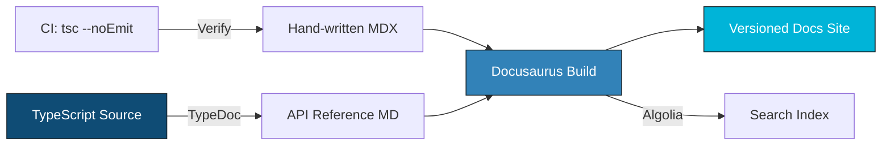
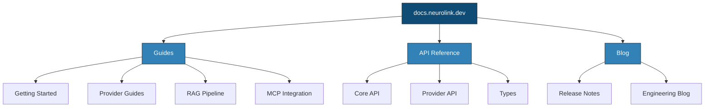

We designed NeuroLink's documentation system on Docusaurus to support 13 providers, hundreds of API methods, and a rapidly evolving SDK -- without the docs falling out of sync with the code. This deep dive examines our documentation architecture, the automated generation pipeline that keeps API references current, the versioning strategy for multi-release support, and the trade-offs we made between comprehensive coverage and maintainability.

Nobody reads documentation for fun. Developers arrive with a specific goal -- configure a provider, set up streaming, understand a type -- and they need the answer fast. Slow docs, stale examples, or missing API reference entries cost you users. Good documentation is the difference between "I adopted this SDK" and "I moved on after 10 minutes."

NeuroLink uses Docusaurus for its developer documentation, combined with TypeDoc for automated API reference and custom plugins for interactive examples. This post explains how we set it up, what we learned, and the patterns that keep 200+ exports documented accurately as the SDK evolves.



---

## Why Docusaurus

We evaluated several documentation platforms before settling on Docusaurus. The decision came down to five factors that matter specifically for SDK documentation.

### React-Based Architecture

Docusaurus is built on React, which means you can embed interactive components directly in your documentation pages. For an AI SDK with 13 providers, this is not a luxury -- it is a necessity. A static table of environment variables cannot show you which variables apply to your chosen provider. A React component can.

We built interactive components for provider selection, code playgrounds, and diff viewers. These components live alongside the documentation content and render as part of the page. No iframes, no external widgets, no loading spinners.

### MDX Support

MDX lets you mix Markdown with JSX. Write your tutorial in Markdown for readability, then drop in a React component where you need interactivity. The transition is seamless for both authors and readers.

```mdx
---
title: Provider Setup
sidebar_position: 2
---

import ProviderSelector from '@site/src/components/ProviderSelector';

Select your AI provider to see configuration instructions:

<ProviderSelector
  providers={['openai', 'anthropic', 'vertex', 'bedrock', 'ollama']}
  defaultProvider="openai"
/>

## Environment Variables

Each provider requires specific environment variables.
The `ProviderSelector` above shows the exact variables needed.
```

This pattern lets us maintain a single page for provider setup instead of 13 separate pages. The interactive component adapts the content to the reader's context.

### Built-In Versioning

SDK documentation has a hard requirement that most documentation platforms handle poorly: versioning. When NeuroLink v9 ships, v8 users still need v8 docs. Docusaurus supports versioned documentation natively, with separate URL paths, sidebars, and search indexes for each version.

### Algolia DocSearch Integration

Full-text search across API reference, guides, and blog content is critical for a 200+ export SDK. Docusaurus integrates with Algolia DocSearch, which indexes every page and provides instant search results with category filtering.

### Community Ecosystem

Docusaurus has a large ecosystem of plugins and themes maintained by an active community. We benefit from community-contributed improvements without maintaining the documentation infrastructure ourselves.

---

## Project Structure

The documentation site follows a deliberate structure that separates concerns.



### Directory Layout

The file system mirrors the information architecture:

- **`/docs/`** -- Guides and tutorials, hand-written in MDX. These are narrative, opinionated, and walk through complete workflows.
- **`/docs/api/`** -- Auto-generated API reference from TypeDoc. These are exhaustive, factual, and programmatically updated.
- **`/docs/providers/`** -- Per-provider setup guides with environment variable tables, authentication instructions, and provider-specific configuration.
- **`/blog/`** -- Release notes and engineering blog posts. Time-stamped content that does not version with the SDK.
- **`docusaurus.config.js`** -- Sidebar configuration, navbar structure, Algolia configuration, and plugin setup.

### The Key Insight: Separation of Written and Generated Content

Hand-written guides and auto-generated API reference live in separate directory trees. This separation prevents merge conflicts when TypeDoc regenerates the API reference on every CI run. A human editing a tutorial page never conflicts with the automated pipeline updating a type definition page.

It also creates clear ownership. Guides are authored and reviewed by humans. API reference is authored by JSDoc annotations in source code and generated by tooling. The update cadence, review process, and quality criteria differ for each.

---

## API Reference from Source Code

The API reference for 200+ exports cannot be maintained by hand. We use a JSDoc-first approach where every exported function, type, and class carries rich annotations that TypeDoc converts into browsable documentation.

### The JSDoc Pattern

Every exported symbol follows a consistent JSDoc template:

```typescript
/**
 * Quick start factory function for creating AI provider instances.
 *
 * Creates a configured AI provider instance ready for immediate use.
 * Supports all 13 providers: OpenAI, Anthropic, Google AI Studio,
 * Google Vertex, AWS Bedrock, AWS SageMaker, Azure OpenAI, Hugging Face,
 * LiteLLM, Mistral, Ollama, OpenAI Compatible, and OpenRouter.
 *
 * @category Factory
 *
 * @param providerName - The AI provider name (e.g., 'bedrock', 'vertex', 'openai')
 * @param modelName - Optional model name to override provider default
 * @returns Promise resolving to configured AI provider instance
 *
 * @example Basic usage
 * ```typescript
 * import { createAIProvider } from '@juspay/neurolink';
 *
 * const provider = await createAIProvider('bedrock');
 * const result = await provider.stream({ input: { text: 'Hello, AI!' } });
 * ```
 *
 * @example With custom model
 * ```typescript
 * const provider = await createAIProvider('vertex', 'gemini-3-flash');
 * ```
 *
 * @see {@link AIProviderFactory.createProvider}
 * @see {@link NeuroLink} for the main SDK class
 * @since 1.0.0
 */
export async function createAIProvider(
  providerName?: string,
  modelName?: string,
) {
  return await AIProviderFactory.createProvider(
    providerName || 'bedrock',
    modelName,
  );
}
```

> **Note:** Model names and IDs in code examples reflect versions available at time of writing. Model availability, naming conventions, and pricing change frequently. Always verify current model IDs with your provider's documentation before deploying to production.
{: .prompt-info }

The key annotations serve specific purposes:

- **`@category`** groups related exports in the generated reference. Factory functions, provider classes, types, and utilities each get their own section.
- **`@param` and `@returns`** provide parameter-level documentation that TypeDoc renders as structured tables.
- **`@example`** blocks appear as copyable code snippets in the generated docs. Multiple examples show different usage patterns.
- **`@see`** creates hyperlinks between related symbols, enabling readers to navigate the API reference by association.
- **`@since`** tracks when a symbol was introduced, helping users on older versions understand what is available to them.

### TypeDoc Integration

TypeDoc runs on CI to generate Markdown files from TypeScript declarations. The process is straightforward in principle but has nuances for a large SDK.

**The re-export challenge.** NeuroLink's `index.ts` re-exports from 15+ internal modules. TypeDoc must follow the re-export chain to capture all documentation. A naive configuration would only document the re-export statements themselves, not the underlying symbols.

**The solution.** A custom TypeDoc plugin resolves re-exports and groups by `@category` tag. The plugin walks the re-export chain, finds the original declaration, extracts the JSDoc, and generates a documentation page at the re-exported path. The result is that `createAIProvider` documented in `src/lib/index.ts` appears under the "Factory" category in the API reference, with all examples, parameters, and cross-references intact.

> **Note:** Treating JSDoc as a first-class deliverable -- not an afterthought -- pays dividends. When every exported symbol has complete JSDoc, the API reference is always up to date because it is generated from the same source code that ships to users.
{: .prompt-info }

---

## The Interactive Provider Selector

Static documentation struggles with multi-provider SDKs. A page that lists environment variables for all 13 providers is overwhelming. A page that shows only the variables for your chosen provider is useful.

### How It Works

The provider selector is a custom React component embedded in MDX pages. When a user selects a provider:

1. The component reads provider metadata from `ProviderFactory.getAvailableProviders()`.
2. It filters the environment variable table to show only the selected provider's variables.
3. It renders a working code example with the selected provider pre-filled.
4. It provides a copy button for the configuration block.

The component is powered by the `AIProviderName` enum and provider metadata that already exists in the SDK. No duplicate data. When a new provider is added to the SDK, it automatically appears in the documentation selector because the selector reads from the same source of truth.

### Why This Matters

Interactive documentation reduces time-to-first-success. A developer evaluating NeuroLink can select their cloud provider, see the exact environment variables they need, copy the configuration, and have a working example in under two minutes. Static documentation would require scrolling past twelve irrelevant provider configurations to find the one that matters.

---

## Versioning Strategy

SDK versioning creates a documentation challenge that most frameworks handle poorly. When v9 introduces breaking changes, v8 users cannot be left with broken documentation.

### Major Version Documentation

Each major version -- v7.x, v8.x, v9.x -- has its own versioned documentation set. The URL structure reflects this:

- `docs.neurolink.dev/docs/` -- Current (latest) version
- `docs.neurolink.dev/docs/8.x/` -- v8 documentation
- `docs.neurolink.dev/docs/7.x/` -- v7 documentation

Docusaurus manages the version snapshots. When we cut a new major version, the current docs are frozen into a versioned directory, and the main docs path begins tracking the new version.

### Migration Guides

Each major version includes a dedicated migration page listing every breaking change with before/after code examples. Migration guides are the most-read pages in versioned documentation because they answer the question every upgrading user has: "what do I need to change?"

### Deprecation Notices

Older documentation pages include inline admonitions pointing to the new API. When a v8 user reads a deprecated function's documentation, they see a notice like:

> **Note:** This function is deprecated in v9. Use `createAIProvider()` instead. See the [v9 Migration Guide](https://docs.neurolink.ink/docs/migration/v9/) for details.
{: .prompt-info }

These notices are added manually during the deprecation process and are part of the deprecation checklist in the contributing guide.

### Automated Deployment

CI deploys versioned docs on release tag push. When a `v9.0.0` tag is pushed, the pipeline:

1. Freezes the current docs into `docs/8.x/`.
2. Generates fresh API reference from the tagged source.
3. Builds and deploys the full documentation site.
4. Updates the Algolia search index.

No manual steps. No opportunity for documentation to drift from the released code.

---

## Code Example Validation

Documentation rot is the silent killer of developer trust. An example that worked with v8.2 but breaks with v8.5 erodes confidence in the entire documentation set.

### The Problem

Code examples in documentation are not compiled or type-checked by default. They are strings in Markdown files. When the SDK API changes -- a parameter is renamed, a return type changes, a function is moved -- the examples silently become incorrect.

Incorrect examples are worse than missing examples because they waste the developer's time. They copy the example, run it, get an error, and then wonder whether the SDK is broken or their setup is wrong.

### The Solution: Compile-Time Verification

A CI step extracts code blocks from MDX files and type-checks them against the current SDK build.

```typescript
// scripts/verify-docs-examples.ts
import { glob } from 'glob';
import { readFile } from 'fs/promises';

const mdxFiles = await glob('docs/**/*.mdx');

for (const file of mdxFiles) {
  const content = await readFile(file, 'utf-8');
  const codeBlocks = content.match(/```typescript\n\/\/ @verify\n([\s\S]*?)```/g);

  if (codeBlocks) {
    for (const block of codeBlocks) {
      // Extract code, write to temp file, run tsc --noEmit
      const code = block.replace(/```typescript\n\/\/ @verify\n/, '').replace(/```$/, '');
      // ... type-check the extracted code
    }
  }
}
```

The `// @verify` pragma is the opt-in mechanism. Not every code example needs verification -- pseudocode, partial snippets, and configuration examples are exempt. But any example that claims to be a working TypeScript snippet gets the `// @verify` tag and is type-checked on every CI run.

### The Result

Zero broken examples in production documentation. When a developer copies a verified example, it compiles. When an API change breaks an example, CI catches it before the documentation is deployed.

The verification script runs in under 30 seconds because it only type-checks the extracted snippets, not the entire documentation build. The cost of correctness is minimal.

> **Note:** If you maintain SDK documentation with code examples, type-check them in CI. The cost is 30 seconds of CI time. The benefit is every example in your documentation actually works.
{: .prompt-info }

---

## Search and Discovery

For a 200+ export SDK, search is not a feature. It is the primary navigation mechanism.

### Algolia DocSearch

Algolia DocSearch indexes all documentation pages including auto-generated API reference. The search experience is instant -- results appear as you type, with highlighted matches and category labels.

The search integration supports:

- **Full-text search** across guides, API reference, and blog content.
- **Faceted filtering** by category: Providers, RAG, MCP, Core.
- **In-page navigation** via auto-generated table of contents from headings.
- **Provider-specific search**: Searching "bedrock streaming" returns both the Bedrock provider guide and the streaming API reference.

### Cross-Linking

Every documentation page is connected to related pages through explicit cross-links. The API reference links to relevant guides. Guides link to the API reference for the functions they use. Blog posts link to both.

This web of links serves two purposes: it helps readers find related content, and it helps the search engine understand the relationships between pages, improving result relevance.

### Discoverability Patterns

We follow three patterns for discoverability:

1. **Task-oriented navigation**: The sidebar is organized by what the user wants to accomplish (Getting Started, Provider Setup, RAG Pipeline) not by the SDK's internal structure (core, factories, providers).

2. **Progressive disclosure**: Overview pages list all options at a glance. Detail pages go deep on one option. A developer scanning the provider overview sees all 13 providers. Clicking one provider takes them to the full setup guide.

3. **Contextual examples**: Every API reference entry includes at least one `@example` block. Every guide includes at least one complete, copy-pasteable code snippet. Developers should never have to imagine what the code looks like.

---

## Lessons Learned

Documenting a 200+ export AI SDK taught us five lessons about documentation engineering.

### 1. Documentation Is a Product

Documentation is not an afterthought. It is a product with users, requirements, and quality metrics. It needs design, testing, and iteration. Treating documentation as a second-class citizen is the fastest way to lose developers who try your SDK and find incomplete guidance.

### 2. Automate What Machines Do Better

Machines are better at keeping API reference in sync with source code. Humans are better at writing tutorials that anticipate confusion and guide the reader through decisions. Automate the former. Invest human effort in the latter.

### 3. Verify Everything

If a code example is in your documentation, it should compile against the current SDK. If an environment variable table is in your documentation, it should match the current configuration schema. Verification is cheap. Broken documentation is expensive.

### 4. Version Early, Version Often

Start versioning documentation from the first major release. Retrofitting versioning onto an existing documentation site is painful and error-prone. Docusaurus makes it easy to set up from the start.

### 5. Interactive Beats Static

For multi-provider SDKs, interactive documentation is not a nice-to-have. It is a necessity. A provider selector that shows relevant configuration is worth more than a comprehensive table that shows everything at once.

---

## What's Next

The architecture decisions we have described represent trade-offs that worked for our scale and constraints. The key engineering insights to take away: start with the simplest design that handles your current load, instrument everything so you can identify bottlenecks before they become outages, and resist premature abstraction until you have at least three concrete use cases demanding it. The implementation details will differ for your system, but the underlying constraints -- latency budgets, failure domains, resource contention -- are universal.

---

**Related posts:**

- [How We Scaled to 13 Providers: The Provider Registry Story](/posts/how-we-scaled-provider-registry/)
- [From Contributor to Maintainer: My Journey with NeuroLink](/posts/contributor-to-maintainer/)
- [When One Model Isn't Enough: Multi-Model Consensus for High-Stakes Decisions](/posts/multi-model-consensus/)
