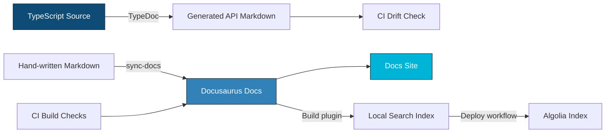
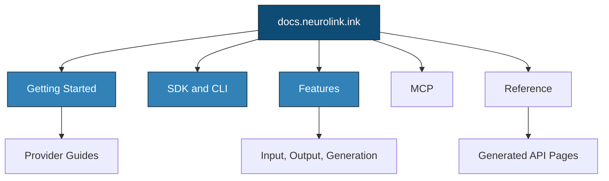

We designed NeuroLink's documentation system on Docusaurus to cover its growing provider catalog, thousands of generated API pages, and a rapidly evolving SDK. This deep dive examines the documentation architecture, the TypeDoc drift gate that keeps the generated reference current, the release-snapshot workflow, and the trade-offs between comprehensive coverage and maintainability.

Nobody reads documentation for fun. Developers arrive with a specific goal -- configure a provider, set up streaming, understand a type -- and they need the answer fast. Slow docs, stale examples, or missing API reference entries cost you users. Good documentation is the difference between "I adopted this SDK" and "I moved on after 10 minutes."

NeuroLink uses Docusaurus for its developer documentation, TypeDoc for the generated API reference, and custom plugins for search indexing, new-doc badges, and social-card images. This post explains how those pieces fit together and how CI checks generated output as the SDK evolves.


```mermaid
flowchart LR
    A["TypeScript Source"] -->|"TypeDoc"| B["Generated API Markdown"]
    B --> H["CI Drift Check"]
    C["Hand-written Markdown"] -->|"sync-docs"| D["Docusaurus Docs"]
    D --> E["Docs Site"]
    D -->|"Build plugin"| F["Local Search Index"]
    F -->|"Deploy workflow"| G["Algolia Index"]
    I["CI Build Checks"] --> D
    style A fill:#0f4c75,stroke:#1b262c,color:#fff
    style D fill:#3282b8,stroke:#1b262c,color:#fff
    style E fill:#00b4d8,stroke:#1b262c,color:#fff
```

---

## Why Docusaurus

We evaluated several documentation platforms before settling on Docusaurus. The decision came down to five factors that matter specifically for SDK documentation.

### React-Based Architecture

Docusaurus is built on React, which means the site can embed interactive components directly in documentation pages. NeuroLink's docs site includes reusable components such as `CodeTabs`, `ProviderModelsTable`, copy-page controls, and a keyboard-accessible search modal. These live alongside the documentation content and render as part of the site without an iframe.

### MDX Support

MDX lets you mix Markdown with JSX. Write your tutorial in Markdown for readability, then drop in a React component where you need interactivity. The transition is seamless for both authors and readers.

```mdx
---
title: Provider Models
sidebar_position: 2
---

import { ProviderModelsTable } from '@site/src/components/ProviderModelsTable';

<ProviderModelsTable
  models={[
    {
      name: 'gpt-5.4',
      provider: 'openai',
      contextWindow: 1050000,
    },
  ]}
/>
```

The component owns the presentation while the page supplies explicit model metadata. That keeps repetitive table markup out of the content without pretending that documentation data updates itself automatically.

### Built-In Versioning

SDK documentation needs release snapshots so readers can match docs to the version they run. Docusaurus provides the snapshot mechanism, and NeuroLink has a release workflow that opens a PR containing a `major.minor` documentation version for published `.0` releases. The mechanism is configured, but `docs-site/versions.json` is currently empty, so the site serves only the `current` documentation set today.

### Algolia with a Local Search Fallback

The docs app uses a custom search interface. When Algolia credentials are configured it queries the `neurolink_docs_v1` index; otherwise it loads the generated `/search-index.json` into MiniSearch in the browser. The deploy workflow builds that index and pushes it to Algolia when the required credentials are available.

### Community Ecosystem

Docusaurus has a large ecosystem of plugins and themes maintained by an active community. We benefit from community-contributed improvements without maintaining the documentation infrastructure ourselves.

---

## Project Structure

The documentation site follows a deliberate structure that separates concerns.


```mermaid
flowchart TD
    A["docs.neurolink.ink"] --> B["Getting Started"]
    A --> C["SDK and CLI"]
    A --> D["Features"]
    A --> E["MCP"]
    A --> F["Reference"]
    B --> G["Provider Guides"]
    D --> H["Input, Output, Generation"]
    F --> I["Generated API Pages"]
    style A fill:#0f4c75,stroke:#1b262c,color:#fff
    style B fill:#3282b8,stroke:#1b262c,color:#fff
    style C fill:#3282b8,stroke:#1b262c,color:#fff
    style D fill:#3282b8,stroke:#1b262c,color:#fff
```

_(Simplified illustration of the site's information architecture — see `sidebars.ts` for the full top-level category list.)_

### Directory Layout

The file system mirrors the build pipeline:

- **`/docs/`** -- Hand-written Markdown plus generated TypeDoc pages under `/docs/api/`.
- **`/docs/getting-started/providers/`** -- Per-provider setup guides with authentication and configuration instructions.
- **`/docs-site/scripts/sync-docs.ts`** -- Transforms the source Markdown into Docusaurus-compatible content and maps legacy paths.
- **`/docs-site/src/`** -- React components, search hooks, theme overrides, and CSS.
- **`/docs-site/docusaurus.config.ts`** -- Site, versioning, theme, sitemap, and plugin configuration.
- **`/docs-site/sidebars.ts`** -- Task-oriented navigation for the generated site.

### The Key Insight: Separation of Written and Generated Content

Hand-written guides and auto-generated API reference live in separate subtrees under `/docs/`. This reduces overlap between narrative edits and TypeDoc output. `sync-docs.ts` stages the source tree for the site, while Docusaurus explicitly excludes `**/api/**` from the published build; the generated API pages remain a separately checked documentation artifact.

It also creates clear ownership. Guides are authored and reviewed by humans. API reference is authored by JSDoc annotations in source code and generated by tooling. CI regenerates `/docs/api/`, formats it, and fails when the checked-in output differs.

---

## API Reference from Source Code

The generated API reference spans thousands of Markdown pages and cannot be maintained by hand. NeuroLink uses a JSDoc-first approach: TypeDoc reads the root entry point, follows public exports, and `typedoc-plugin-markdown` writes the browsable reference under `/docs/api/`.

### The JSDoc Pattern

Every exported symbol follows a consistent JSDoc template:

```typescript
/**
 * Quick start factory function for creating AI provider instances.
 *
 * Creates a configured AI provider instance ready for immediate use.
 * Resolves a registered provider through NeuroLink's provider factory.
 *
 * @category Factory
 *
 * @param providerName - The AI provider name (e.g., 'bedrock', 'vertex', 'openai')
 * @param modelName - Optional model name to override provider default
 * @returns Promise resolving to configured AI provider instance
 *
 * @example Basic usage
 * ```typescript
 * import { createAIProvider } from '@juspay/neurolink';
 *
 * const provider = await createAIProvider('bedrock');
 * const result = await provider.stream({ input: { text: 'Hello, AI!' } });
 * ```
 *
 * @example With custom model
 * ```typescript
 * const provider = await createAIProvider('vertex', 'gemini-3-flash-preview');
 * ```
 *
 * @see {@link AIProviderFactory.createProvider}
 * @see {@link NeuroLink} for the main SDK class
 * @since 1.0.0
 */
export async function createAIProvider(
  providerName?: string,
  modelName?: string,
) {
  return await AIProviderFactory.createProvider(
    providerName || 'bedrock',
    modelName,
  );
}
```

> **Note:** Model names and IDs in code examples reflect versions available at time of writing. Model availability, naming conventions, and pricing change frequently. Always verify current model IDs with your provider's documentation before deploying to production.
{: .prompt-info }

The key annotations serve specific purposes:

- **`@category`** groups related exports in the generated reference. Factory functions, provider classes, types, and utilities each get their own section.
- **`@param` and `@returns`** provide parameter-level documentation that TypeDoc renders as structured tables.
- **`@example`** blocks appear as copyable code snippets in the generated docs. Multiple examples show different usage patterns.
- **`@see`** creates hyperlinks between related symbols, enabling readers to navigate the API reference by association.
- **`@since`** tracks when a symbol was introduced, helping users on older versions understand what is available to them.

### TypeDoc Integration

TypeDoc runs on CI to generate Markdown files from TypeScript declarations. The process is straightforward in principle but has nuances for a large SDK.

**The re-export challenge.** NeuroLink's `index.ts` re-exports from many internal modules. TypeDoc must follow that public surface without exposing private or internal symbols.

**The solution.** `typedoc.json` sets `src/lib/index.ts` as the single entry point, loads `typedoc-plugin-markdown`, excludes private and internal symbols, and enables category grouping. CI runs `pnpm run docs:api`, formats `/docs/api/`, and checks `git status` so newly added, removed, or changed generated pages all count as drift.

> **Note:** Treating JSDoc as a first-class deliverable -- not an afterthought -- pays dividends. When every exported symbol has complete JSDoc, the API reference is always up to date because it is generated from the same source code that ships to users.
{: .prompt-info }

---

## The Search Component

A large documentation site needs one consistent search experience even when its hosted search service is unavailable. NeuroLink solves that in the Docusaurus theme rather than in individual pages.

### How It Works

The custom navbar search component follows two paths:

1. `useAlgoliaSearch` initializes an Algolia client when an application ID and search API key are configured.
2. `useLocalSearch` fetches `/search-index.json` and loads it into MiniSearch as the fallback.
3. The shared modal renders results from either path and supports `Cmd/Ctrl+K` and `/` keyboard shortcuts.
4. A build plugin walks the generated docs, strips Markdown for indexing, and emits stable record IDs based on each URL.

The deployment workflow can then publish the same generated records to the `neurolink_docs_v1` Algolia index. Search remains usable without Algolia because the local index ships with the site.

### Why This Matters

The fallback makes search a property of the built documentation, not a dependency on one hosted service. A failed or unconfigured Algolia integration does not remove search from the site; it changes which index the same interface queries.

---

## Versioning Strategy

SDK versioning creates a documentation challenge: readers need docs that match the package they installed, while authors need a current set that keeps moving.

### Current State

The production URL is `https://docs.neurolink.ink`, with current documentation under `/docs/`. Docusaurus versioning is configured, but `docs-site/versions.json` is currently empty. That means the version menu has no historical snapshot to serve yet; claiming v7, v8, or v9 routes would be inaccurate.

### Release Snapshot Workflow

A dedicated GitHub Actions workflow runs when a release ending in `.0` is published. It:

1. Syncs the source documentation into the Docusaurus site.
2. Converts the release tag to a `major.minor` documentation version.
3. Runs `docusaurus docs:version` when that version is not already listed.
4. Opens a PR containing the versioned docs, sidebar, and updated `versions.json`.

The PR step is intentional: a release event prepares the snapshot, but a maintainer still reviews and merges the generated documentation before it becomes part of the deployed site.

### Migration and Deprecation Guidance

Migration guides and deprecation notices remain hand-written content. The generated API reference can carry JSDoc `@deprecated` metadata, while narrative guides explain the replacement and any behavior changes. Keeping those roles separate lets tooling report the fact of deprecation and humans explain the upgrade path.

### Deployment

The documentation deploy workflow runs on changes to `/docs/` or `/docs-site/` on `main` and `release`, or by manual dispatch. It syncs content, builds the Docusaurus site, uploads the GitHub Pages artifact, and pushes the generated search records to Algolia only when its credentials are configured.

---

## Documentation Validation

Documentation rot is the silent killer of developer trust. A stale API page or broken link makes readers question every other example on the site.

### The Checks That Exist

NeuroLink uses complementary CI checks rather than a single "docs passed" signal:

1. **API reference drift:** the main CI job runs TypeDoc, formats `/docs/api/`, and fails if `git status` shows generated changes.
2. **Site validation:** the documentation PR workflow runs `sync-docs`, validates front matter, type-checks the Docusaurus application, and performs a production build.
3. **Broken links and anchors:** `docusaurus.config.ts` treats these as build errors in production.
4. **Search artifact drift:** a path-filtered workflow rebuilds the site and fails if the committed `docs-site/static/search-index.json` changed.

### The Boundary

These checks validate generated API output, site code, front matter, links, and the search index. They do **not** extract and compile every TypeScript fence in prose. A code sample still needs review against the current public exports and types; the build alone is not proof that the snippet compiles.

> **Note:** Be precise about what a documentation gate measures. A green Docusaurus build catches structural failures, but code examples need their own source-level verification.
{: .prompt-info }

---

## Search and Discovery

For a large guide and reference set, search is not a secondary feature. It is a primary navigation mechanism. The Docusaurus search index intentionally follows the site's exclusions, so the separate `/docs/api/` TypeDoc tree is not indexed as site content.

### One Record Shape, Two Backends

The build-time plugin emits records with a title, URL, heading hierarchy, and stripped text content. The search UI uses the same shape whether results come from Algolia or the local MiniSearch index.

The integration supports:

- **Full-text search** across the pages included in the Docusaurus documentation build.
- **Highlighted matches** for title, content, and heading hierarchy when Algolia is active.
- **Prefix and fuzzy matching** in the local MiniSearch fallback.
- **Keyboard navigation** through the shared search modal.

### Cross-Linking

Guides use explicit cross-links to connect setup, feature, migration, and reference topics. Those links help readers move from an overview to the specific configuration or behavior they need, and the production build fails on broken links or anchors.

### Discoverability Patterns

We follow three patterns for discoverability:

1. **Task-oriented navigation**: The sidebar is organized by what the user wants to accomplish (Getting Started, Provider Setup, RAG Pipeline) not by the SDK's internal structure (core, factories, providers).

2. **Progressive disclosure**: Overview pages list options at a glance. Detail pages go deep on one option. A developer can scan the provider overview and then open the setup guide for the provider they use.

3. **Contextual examples**: Add complete snippets where readers need to see an API in context, and use JSDoc `@example` blocks on important public symbols. Do not claim universal example coverage unless a gate measures it.

---

## Lessons Learned

Maintaining a documentation set with thousands of generated API pages reinforced five lessons about documentation engineering.

### 1. Documentation Is a Product

Documentation is not an afterthought. It is a product with users, requirements, and quality metrics. It needs design, testing, and iteration. Treating documentation as a second-class citizen is the fastest way to lose developers who try your SDK and find incomplete guidance.

### 2. Automate What Machines Do Better

Machines are better at keeping API reference in sync with source code. Humans are better at writing tutorials that anticipate confusion and guide the reader through decisions. Automate the former. Invest human effort in the latter.

### 3. Verify Everything

If a code example claims to be runnable, verify it against the current SDK. If an environment variable table is in your documentation, compare it with the current configuration schema. A site build cannot substitute for those checks. Broken documentation is expensive.

### 4. Version Early, Version Often

Configure documentation snapshots before you need the first historical set. Docusaurus supplies the mechanism, but the release trigger, review path, and deployment policy still need explicit automation.

### 5. Build Resilient Interactions

Interactive documentation should degrade gracefully. NeuroLink's search is useful with Algolia, but it remains available through the local index when hosted search is not configured. The same principle applies to any future provider-aware component: keep the underlying content explicit and accessible.

---

## What's Next

The architecture decisions we have described represent trade-offs that worked for our scale and constraints. The key engineering insights to take away: start with the simplest design that handles your current load, instrument everything so you can identify bottlenecks before they become outages, and resist premature abstraction until you have at least three concrete use cases demanding it. The implementation details will differ for your system, but the underlying constraints -- latency budgets, failure domains, resource contention -- are universal.

---

**Related posts:**

- [How We Scaled to 13 Providers: The Provider Registry Story](/posts/how-we-scaled-provider-registry/)
- [From Contributor to Maintainer: My Journey with NeuroLink](/posts/contributor-to-maintainer/)
- [When One Model Isn't Enough: Multi-Model Consensus for High-Stakes Decisions](/posts/multi-model-consensus/)
