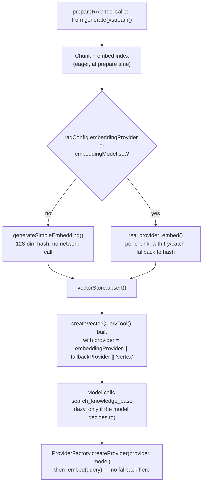

You wire up `generate()` with a handful of Markdown files under `rag: { files }`, let NeuroLink auto-select whatever provider answers the prompt, and ship it. Indexing works, and nothing about the pipeline complains. The model calls `search_knowledge_base` and gets back real snippets from your files. Nothing in your `.env` mentions Google, nothing in your code imports `@google/genai`, and no test ever exercised a code path with the word "vertex" in it.

And yet, buried two calls deep inside `prepareRAGTool`, NeuroLink just spun up a Vertex AI client to embed the query. Not because you asked for Vertex — because you didn't ask for anything, and `ragIntegration.ts` has to pick *something*. The literal fallback is the string `"vertex"`, written twice in the same file, and it is the reason a RAG pipeline that works perfectly in a demo can throw a credentials error the first time it runs somewhere without `GOOGLE_APPLICATION_CREDENTIALS` set.

This post is about that one default: where it lives, why it's there, how a second bug used to hide behind it until an August fix, and what to set explicitly so your retrieval never depends on an environment variable nobody remembers writing down.

## The line the whole post is about

`prepareRAGTool` — the function `generate()` and `stream()` call whenever a request carries a `rag: { files: [...] }` config — builds a search tool for the model at the end of indexing. Deciding which embedding provider that tool should use comes down to one line:

```typescript
// From ragIntegration.ts — building the query tool's config
// 4. Create the search tool
// Determine embedding provider/model for the query tool
const provider = embeddingProvider || fallbackProvider || "vertex";
const model = embeddingModel || "gemini-2.5-flash";

const queryTool = createVectorQueryTool(
  {
    id: toolName,
    description: toolDescription,
    indexName,
    embeddingModel: { provider, modelName: model },
    topK,
    includeSources: true,
  },
  vectorStore,
  ...
);
```

`embeddingProvider` and `embeddingModel` come straight off the `RAGConfig` you passed in — most callers never set them. `fallbackProvider` is the second argument to `prepareRAGTool`, threaded in from wherever `generate()` or `stream()` called it. When both are empty, `provider` resolves to the literal string `"vertex"`, and `model` resolves to `"gemini-2.5-flash"`. Nothing warns you this happened. The tool gets built, the function returns successfully, and the default only becomes visible the moment the model actually calls the tool.

The type definition for `RAGConfig` doesn't help you predict this either:

```typescript
// From src/lib/types/rag.ts
/**
 * Embedding model provider for generating embeddings.
 * Defaults to the same provider used for generation.
 */
embeddingProvider?: string;
```

That comment is accurate exactly when you pinned a `provider` on the `generate()` call. It stops being accurate the moment you let NeuroLink pick the provider for you — which is the common case for anyone using auto-routing, fallback chains, or just not caring which text model answers a given prompt.

## Where `fallbackProvider` actually comes from

`fallbackProvider` isn't a RAG-specific concept — it's whatever text-generation provider the current `generate()`/`stream()` call resolved to, passed down one layer:

```typescript
// From src/lib/neurolink.ts — both generate() and stream() call sites
const ragResult = await prepareRAGTool(
  options.rag,
  options.provider as string | undefined,
);
```

`options.provider` is exactly what you passed to `generate({ provider: ... })`. If you pinned `provider: "openai"`, that string becomes `fallbackProvider`, and your RAG query tool ends up using OpenAI's embedding endpoint by default — no Vertex involved. But if you left `provider` unset, or set it to `"auto"` and let classifier routing or a fallback chain choose the model at request time, `options.provider` is `undefined` at the point `prepareRAGTool` is called, `fallbackProvider` is `undefined`, and the `||` chain falls all the way through to `"vertex"`.

That's the actual trigger condition, stated precisely: **no `rag.embeddingProvider` and no explicitly pinned `provider` on the call.** Auto-routing a request to, say, Anthropic for the actual answer says nothing about which provider embeds the retrieval query — those are two independent decisions, and only one of them is visible in your code.

## Two independent embedding calls, not one

It's worth being precise about *when* this provider gets used, because there are two separate embedding operations inside `prepareRAGTool`, and they don't run at the same time or under the same rules.



The **index** side (embedding every chunk from your files) runs eagerly, inside `_prepareRAGToolInner`, while `prepareRAGTool` is still executing. Whether it uses a real provider at all is gated on `ragConfig.embeddingProvider`/`embeddingModel` alone — `fallbackProvider` has no say here:

```typescript
// From ragIntegration.ts — the indexing decision
const wantProviderEmbeddings = Boolean(embeddingProvider || embeddingModel);
const embedProviderName = embeddingProvider || fallbackProvider || "vertex";
const embedModelName = embeddingModel || "gemini-2.5-flash";
let embedFn = (text: string): Promise<number[]> =>
  Promise.resolve(generateSimpleEmbedding(text, EMBEDDING_DIMENSION));
if (wantProviderEmbeddings) {
  try {
    const { AIProviderFactory } = await import("../core/factory.js");
    const embedderProvider = (await AIProviderFactory.createProvider(
      embedProviderName,
      embedModelName,
    )) as { embed?: (text: string, model?: string) => Promise<number[]> };
    if (typeof embedderProvider.embed === "function") {
      const providerEmbed = embedderProvider.embed.bind(embedderProvider);
      embedFn = (text: string) => providerEmbed(text, embedModelName);
    }
    ...
  } catch (error) {
    logger.warn(
      "[RAG] Failed to create embedding provider; falling back to hash embeddings",
      { error: error instanceof Error ? error.message : String(error) },
    );
  }
}
```

If you never set `ragConfig.embeddingProvider`, `wantProviderEmbeddings` is `false`, and indexing quietly uses `generateSimpleEmbedding` — a deterministic 128-dimension hash, computed locally, with no network call and no credentials needed. That part is cheap and safe by construction.

The **query** side is different in every relevant way. It doesn't run until the model decides to invoke `search_knowledge_base`, it isn't gated on `wantProviderEmbeddings` at all, and it has no fallback:

```typescript
// From src/lib/rag/retrieval/vectorQueryTool.ts — inside the tool's execute()
const embeddingProvider = await ProviderFactory.createProvider(
  embeddingModel.provider,
  embeddingModel.modelName,
);

if (typeof embeddingProvider.embed !== "function") {
  throw new Error(
    `Provider ${embeddingModel.provider} does not support embeddings`,
  );
}

const queryEmbedding = await embeddingProvider.embed(params.query);
```

That whole block sits inside a `try { ... } catch (error) { logger.error(...); throw error; }` — any failure here is logged and rethrown, not absorbed. So the default RAG setup — no `embeddingProvider`, no pinned `provider` — indexes your files for free with a local hash function, and then, the first time the model actually searches, tries to construct a live Vertex AI client and calls `.embed()` on it. If that machine has no Vertex credentials, the tool call fails at exactly the moment a user is waiting on an answer, not at setup time when you could have caught it in a smoke test.

## What "vertex" as a default actually requires

`ProviderFactory.createProvider("vertex", "gemini-2.5-flash")` resolves to `googleVertex/client.ts`, whose `embed()` method needs real Google Cloud plumbing before it can return a vector:

```typescript
// From src/lib/providers/googleVertex/client.ts
process.env.GOOGLE_APPLICATION_CREDENTIALS_NEUROLINK ||
  process.env.GOOGLE_APPLICATION_CREDENTIALS ||
  ...
```

Without a service account credential file (or the equivalent ADC setup) and a resolvable project, that client can't authenticate, and `AIProviderFactory.createProvider` throws before `.embed()` is ever called. On the indexing side, that throw is caught and logged as a warning, and `embedFn` silently reverts to the hash function — you'd only notice via logs. On the query side, inside `vectorQueryTool.ts`, that same throw propagates straight out of the tool call.

This isn't specific to RAG, for what it's worth — it's consistent with how NeuroLink resolves a provider anywhere a name isn't given:

```typescript
// From src/lib/factories/providerFactory.ts
const resolvedProviderName =
  providerName ||
  process.env.NEUROLINK_PROVIDER ||
  process.env.AI_PROVIDER ||
  "vertex";
```

Vertex being the SDK-wide fallback provider is a documented, deliberate choice elsewhere in the codebase. What's specific to RAG — and undocumented — is that this same fallback applies to the *embedding* provider independently of whichever text-generation provider actually answers the user's question, and that indexing and querying can silently disagree about whether a real provider is even in the picture at all.

## The bug that used to sit right behind this default

Before an August 26 fix (`c55ef9bea`), even explicitly configuring `rag.embeddingProvider` didn't get you a consistent embedding space — because until then, the indexing side ignored `embeddingProvider`/`embeddingModel` entirely and *always* used the hash function, no matter what you configured:

```typescript
// Before c55ef9bea — from the original Feb 8 introduction (e59541962)
const items = allChunks.map((chunk, i) => ({
  id: `rag-chunk-${i}`,
  vector: generateSimpleEmbedding(chunk.text, EMBEDDING_DIMENSION),
  metadata: { text: chunk.text, ...chunk.metadata },
}));
```

Meanwhile `createVectorQueryTool`'s query path — the code shown above in `vectorQueryTool.ts` — has called a real provider's `.embed()` since the feature first shipped. So for five and a half months, setting `rag.embeddingProvider` did nothing for indexing but changed which provider embedded your *queries*. The index lived in a 128-dimension hash space built from character frequency and word hashing; the query lived in whatever dimensionality the configured provider's embedding model produced (768, 1536, or whatever else). Comparing a query vector against index vectors from an unrelated space doesn't degrade gracefully — it just makes cosine similarity meaningless, silently, because both sides return numbers.

The commit that fixed it makes the failure mode explicit in its own comment:

```typescript
// From ragIntegration.ts, added in c55ef9bea
// When the caller configured an embedding provider/model, embed BOTH the
// index chunks and (below) the queries through that provider — previously
// those config fields had no runtime effect and retrieval always used the
// deterministic hash embedding, which is a lexical fingerprint rather than
// a semantic space. Index and query must share one embedding space, so the
// provider path replaces the hash path wholesale; any provider failure
// falls back to the hash for both sides.
```

That last clause matters: the fix also made the failure mode *symmetric*. If the configured provider fails partway through embedding your chunks, the whole index — not just the failed chunk — falls back to the hash function, and `embedFn` itself is reassigned so later queries against that same prepared tool would need the same fallback to stay consistent:

```typescript
// From ragIntegration.ts — added in c55ef9bea
let chunkVectors: number[][];
try {
  chunkVectors = await Promise.all(
    allChunks.map((chunk) => embedFn(chunk.text)),
  );
} catch (error) {
  // One failed chunk must not leave a mixed-space index — flip the whole
  // index AND all queries back to the hash space together.
  logger.warn(
    "[RAG] Provider embedding failed mid-index; falling back to hash embeddings for index and queries",
    { error: error instanceof Error ? error.message : String(error) },
  );
  embedFn = (text: string) =>
    Promise.resolve(generateSimpleEmbedding(text, EMBEDDING_DIMENSION));
  chunkVectors = allChunks.map((chunk) =>
    generateSimpleEmbedding(chunk.text, EMBEDDING_DIMENSION),
  );
}
```

That fixes the *configured* case. It does not touch the fully-default case this post opened with — no `embeddingProvider` set at all — because that path was never routed through `embedFn` for indexing in the first place; it goes through the separate `provider`/`model` variables that feed `createVectorQueryTool` directly, and those still resolve to `"vertex"` unconditionally when nothing else is set.

## A default that doesn't even match Vertex's own default

There's a second, smaller mismatch worth knowing about if you ever do let the Vertex default kick in. `ragIntegration.ts` falls back to `embeddingModel || "gemini-2.5-flash"` — a model name chosen because it's NeuroLink's general-purpose Vertex default, used the same way elsewhere for text generation. But Vertex's own `embed()` method has a different idea of what an embedding model should be called:

```typescript
// From src/lib/providers/googleVertex/client.ts
/**
 * Generate an embedding for `text` using Vertex via @google/genai.
 */
async embed(
  input: string | EmbedInput,
  modelName?: string,
): Promise<number[]> {
  ...
  const embeddingModelName =
    modelName || this.getDefaultEmbeddingModel() || "text-embedding-004";
  ...
  const result = await client.models.embedContent({
    model: embeddingModelName,
    contents: [text],
  });
```

`text-embedding-004` is what this method falls back to only when it receives no `modelName` at all. But `ragIntegration.ts` always passes one — `"gemini-2.5-flash"` — because its own fallback runs first. `gemini-2.5-flash` is a generative chat model name, not one of Vertex's embedding model IDs; it's simply never the value this function's own internal default would have chosen. Two defaults, defined independently, in two different files, quietly disagreeing about what the right embedding model name is when nobody specifies one.

## No CLI flag reaches this

The CLI surface for RAG is narrower than the SDK's `RAGConfig`. The Feb 8 commit that introduced `prepareRAGTool` added exactly these flags:

```bash
neurolink generate "your prompt" \
  --rag-files ./docs/*.md \
  --rag-strategy markdown \
  --rag-chunk-size 800 \
  --rag-chunk-overlap 150 \
  --rag-top-k 5
```

There is no `--rag-embedding-provider` or `--rag-embedding-model`. If you're driving RAG from the CLI rather than the SDK directly, there's currently no flag that lets you override the embedding provider at all — you either accept whatever `fallbackProvider` resolves to (the provider you passed with `--provider`, if any) or you fall through to `"vertex"`. The only way to set `rag.embeddingProvider` explicitly today is the programmatic `RAGConfig` object.

## Making the default explicit

The fix, once you know where to look, is one field. Pin `embeddingProvider` (and, ideally, `embeddingModel`) on every `rag` config that matters, independent of whatever `provider` you pass for generation:

```typescript
import { NeuroLink } from "@juspay/neurolink";

const neurolink = new NeuroLink({
  credentials: {
    openai: { apiKey: process.env.OPENAI_API_KEY },
  },
});

// provider is left unset here — auto-routing picks whichever text model
// answers the prompt. Without the block below, retrieval would silently
// depend on the vertex default instead of anything configured above.
const result = await neurolink.generate({
  input: { text: "What does our refund policy say about digital goods?" },
  rag: {
    files: ["./docs/policies/refunds.md"],
    embeddingProvider: "openai",
    embeddingModel: "text-embedding-3-small",
  },
});
```

With `embeddingProvider` set, three things change at once: `wantProviderEmbeddings` becomes `true` so indexing actually uses a real embedding model instead of the hash function, the `provider`/`model` pair feeding `createVectorQueryTool` resolves to your explicit values instead of falling through to `fallbackProvider` or `"vertex"`, and — since both sides now go through the same configured provider — index and query land in the same embedding space by construction, the exact property the August fix was restoring for the configured case.

If Vertex genuinely is your intended embedding provider, the fix is the same shape — just make the choice on purpose instead of by omission:

```typescript
const result = await neurolink.generate({
  input: { text: "What does our refund policy say about digital goods?" },
  rag: {
    files: ["./docs/policies/refunds.md"],
    embeddingProvider: "vertex",
    embeddingModel: "text-embedding-004",
  },
});
```

Either way, the config now says what actually happens, and a missing credential fails loudly in a place you can catch in CI, rather than lazily, the first time a user's question triggers the search tool in production.

## What to check before you rely on RAG defaults

| Question | How to check | Why it matters |
| --- | --- | --- |
| Did I set `rag.embeddingProvider`? | Read your `RAGConfig` literal | If not, indexing uses the free local hash function |
| Did I pin `provider` on the `generate()`/`stream()` call? | Read the call site | If not, `fallbackProvider` is `undefined` at the point `prepareRAGTool` runs |
| If both are unset, is Vertex actually reachable? | `GOOGLE_APPLICATION_CREDENTIALS` (or `_NEUROLINK` variant) set, project resolvable | The query tool will try to construct a Vertex client the first time the model searches |
| Are index and query using the same provider? | Compare what `wantProviderEmbeddings` resolves to against `embeddingModel.provider` on the tool config | A mismatch here silently returns bad rankings, not an error |
| Am I driving RAG from the CLI? | Check for `--rag-embedding-provider` | It doesn't exist yet — the SDK's `RAGConfig` is the only way to set this today |

---

**Related posts:**

- [Embeddings and Vector Operations with NeuroLink](/posts/embeddings-vector-operations/)
- [Vector Database Guide: Pinecone vs Qdrant vs pgvector with NeuroLink](/posts/vector-database-guide/)
- [How We Built the RAG Pipeline: 10 Chunking Strategies and Why](/posts/how-we-built-rag-pipeline/)
