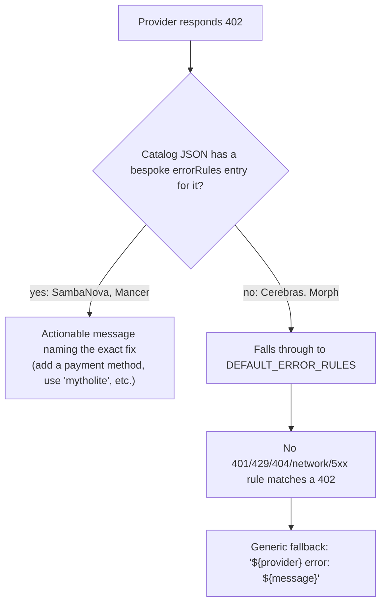

Most people reading a setup wizard's "🆓 Free Tier Starter Pack" recommendation assume it means the same thing for every provider in the list. NeuroLink's own interactive `setup --list` wizard puts Google AI Studio and Hugging Face side by side under exactly that label. One of them gives you 1,500 requests a day before you see a single charge. The other gives you a small monthly credit balance that, once spent, returns an HTTP `402` until you add a card. Both are accurately called "free tier." Neither behaves like the other.

That gap between the label and the mechanism is the whole subject here. This isn't a single feature that shipped on one date — it's the accreted, sometimes contradictory picture that emerges when you read NeuroLink's own provider catalog, docs, and error-handling code side by side: `src/cli/commands/setup.ts`'s hardcoded `PROVIDERS` array, the per-provider guides under `docs/getting-started/providers/`, the Tier-2 catalog JSON files under `src/lib/providers/catalog/`, and the shared error classifier in `src/lib/utils/errorClassifier.ts`. None of it is marketing copy written for this post — it's the actual strings the CLI prints and the actual rules the SDK runs when a provider says no.

## The four things "free" turns out to mean

Before getting into any single provider, it's worth laying out what "free tier" actually maps to across NeuroLink's catalog, because the differences aren't cosmetic — they change what happens the moment you exceed them.

| What "free" means | Example provider | What actually happens at the edge |
| --- | --- | --- |
| A real, generous, ongoing allowance | Google AI Studio | Requests throttle at the RPM/RPD ceiling; nothing is billed |
| A one-time credit balance that runs out | Hugging Face | `402` once the balance hits zero — this is a trial, not a tier |
| A gate you have to unlock with a card, not money | Morph, Cerebras | Rate-limited to a trickle (or blocked outright) until a payment method is on file, even though no charge occurs |
| A single carved-out model, not the catalog | Mancer, OpenRouter's `:free` models | Every other model in the same provider 402s or 404s |

None of these four are wrong to call "free." They're just not the same shape of free, and NeuroLink's own documentation — written by people who had to debug each provider's actual behavior — is where the differences are on record.

## Myth: no free-tier badge just means "pay-per-use"

The natural assumption is that a provider without a free tier behaves like a metered utility: you use it, you get billed, nothing weird happens. Two providers in NeuroLink's Tier-2 catalog contradict that outright.

SambaNova's provider guide is blunt about it, dated from a live probe rather than vendor marketing copy:

> "⚠️ Billing (probed live 2026-08-27): new accounts have no free allowance — every call returns 402 PAYMENT_METHOD_REQUIRED (balance_units: 0) until a payment method is added and credits are purchased."

That's not a rate limit softening into a wall. It's a wall from the first call, on a brand-new account, with a status code and an error body that spells out exactly why: `balance_units: 0`. NeuroLink's catalog entry for SambaNova (`src/lib/providers/catalog/sambanova.json`) encodes this as an explicit bespoke error rule:

```json
{
  "status": 402,
  "pattern": "PAYMENT_METHOD_REQUIRED|balance_units",
  "class": "provider",
  "message": "SambaNova account has no credits (new accounts have no free allowance). Add a payment method and purchase credits at https://cloud.sambanova.ai/plans/billing"
}
```

Cerebras has the same shape of problem, worded slightly differently. Its provider guide's troubleshooting section, under the heading "402 payment_required on every call," says: "The account has no balance. Cerebras has no keyless free tier: open Billing → Credits → ADD CREDITS in the console, choose 'Start with limited free credits', and save a payment card — the $5 promo credit activates with no charge. Skipping the claim step during onboarding ('SKIP TO CONSOLE') leaves the balance at $0.00."

Read that carefully: Cerebras does offer a $5 free credit. It is still, by the doc's own phrasing, "no keyless free tier" — the credit only activates once a payment card is saved, and the default onboarding path (the "SKIP TO CONSOLE" button) skips the step that claims it. A developer who follows the path of least resistance through Cerebras's own signup flow ends up with a $0.00 balance and a provider NeuroLink's catalog calls "free."

## Myth: a provider's free tier covers its whole model catalog

Even once you accept that some providers gate access behind a card, it's easy to assume the free access, once unlocked, applies uniformly across every model that provider serves. Two providers in NeuroLink's catalog make that explicitly false.

Mancer's catalog entry carries a bespoke error rule for exactly this case:

```json
{
  "status": 402,
  "pattern": "requires paid credits",
  "class": "provider",
  "message": "Mancer model '{model}' requires paid credits; with a zero balance only the free model 'mytholite' works. Add credits at https://mancer.tech/dashboard or see https://mancer.tech/pricing."
}
```

Mancer's provider guide confirms the same thing in prose: "Without credits only the free model 'mytholite' answers; every other model returns 402 until you add credits." Mancer lists ten models in NeuroLink's roster. Exactly one of them is free. Calling any of the other nine "using Mancer's free tier" is a category error the provider's own API will correct with a `402` and NeuroLink's catalog will turn into an actionable message naming the one model that actually works.

OpenRouter runs the same pattern at a larger scale, just with better-known branding. Its free access isn't a tier at all — it's a naming convention. NeuroLink's own setup wizard prints this as a worked example when a developer runs the OpenRouter setup flow:

```typescript
logger.always(
  chalk.cyan(
    '  neurolink generate "Hello!" --provider openrouter --model google/gemini-2.0-flash-exp:free',
  ),
);
// ...
logger.always("  • google/gemini-2.0-flash-exp:free - Free tier");
```

The `:free` suffix is not decorative — it's how OpenRouter routes the request to a specifically zero-cost variant of a model. Drop the suffix and request the same base model, and you're on OpenRouter's metered path. NeuroLink's own OpenRouter provider guide lists three of these by name — `google/gemini-2.0-flash-exp:free`, `meta-llama/llama-3.1-8b-instruct:free`, `microsoft/phi-3-medium-128k-instruct:free` — out of the 300+ models OpenRouter otherwise exposes through the same API. "OpenRouter has a free tier" is true of a specific, named handful of model IDs, not of OpenRouter.

## Myth: free tier is a rate limit, not a runway

This is the most consequential mix-up, because it changes what "monitoring your usage" should mean. A rate limit resets — wait a minute, try again. A runway doesn't reset; you either top it up or you're done.

Google AI Studio genuinely is a rate limit. NeuroLink's provider guide for it documents concrete, current numbers rather than a vague "generous":

| Resource | Free Tier Limit | Notes |
| --- | --- | --- |
| Requests per Minute (RPM) | 15 RPM | Per API key |
| Tokens per Minute (TPM) | 1M TPM | Combined input + output |
| Requests per Day (RPD) | 1,500 RPD | Rolling 24-hour window |
| Concurrent Requests | 15 | Max simultaneous requests |

Hit any of these and the next request throttles or 429s. Wait, and it opens back up. Nothing about your account changes; there's no balance to exhaust.

Hugging Face's free access is structurally different, and its own docs are explicit that it's a balance, not a limiter: "Free accounts get a small monthly credit for Inference Providers, with no card required. Once it is spent, requests return `402` until you buy pre-paid credits or subscribe to PRO." That's a runway with a fixed length. NeuroLink's provider guide for Hugging Face even recommends the correct mitigation pattern for a runway rather than a rate limit — falling forward to a different provider instead of backing off and retrying the same one:

```typescript
// Rate limit friendly approach
const ai = new NeuroLink({
  providers: [
    { name: "huggingface", priority: 1 }, // Free tier first
    { name: "google-ai", priority: 2 }, // Fallback to Google AI
  ],
});
```

Retrying a spent Hugging Face credit balance with exponential backoff — the standard fix for a 429 — does nothing. The credits aren't coming back until the billing cycle turns over or a card is added. A priority-ordered fallback list is the only pattern in the two docs that actually addresses a runway running out mid-session.

## Myth: free tier gives you the same product, just throttled

The assumption here is that the free and paid paths through a provider are functionally identical — same context window, same output ceiling, same everything — and the only difference is how often you're allowed to ask. Cerebras's provider guide documents a case where that's false at the model-capability level, not just the request-rate level:

> "Context window: 65K tokens on the free tier, 131K on paid tiers (both models). NeuroLink budgets context against the 65K free-tier floor — the account tier isn't knowable from the key, and compacting early on a paid tier is safe while overrunning a 65K window is not."

That second sentence is the interesting part. NeuroLink doesn't ask Cerebras which tier an API key belongs to — there's no endpoint for that — so it can't conditionally allow the larger 131K window for accounts that have actually paid. Instead it makes the conservative choice for every account: budget against the smaller number, always. A paid Cerebras account gets its context compacted somewhat earlier than it strictly needs to, in exchange for a free-tier account never silently exceeding a window its plan doesn't actually have. The max output ceiling follows the same split — 32K on the free tier versus 40K paid — documented in the same Key Facts block, though NeuroLink's context budgeting specifically targets the smaller of the two input-side numbers, since that's the one where overrunning it produces provider-side errors rather than merely truncated output.

Morph runs a lighter version of the same "free isn't the same product" pattern, gated on account setup rather than a hard capability cut: "Billing: free-with-card — a payment method must be on file; until one is added, calls are rate-limited to 5 requests/minute." Its troubleshooting table names the exact symptom and exact fix: "Stuck at 5 requests/minute → No payment method on file yet → Add a card in the Morph dashboard to lift the limit." Five requests a minute is a usable trickle for testing a single call shape. It is not a tier anyone would build a production integration against, and Morph's own docs don't pretend otherwise.

## Myth: "Anthropic has a free tier" — two unrelated meanings of "free" under one name

This is the one worth being most careful about, because NeuroLink's own documentation is internally inconsistent on it, and untangling the inconsistency is more useful than repeating either half of it uncritically.

Start with what the setup wizard actually says. `src/cli/commands/setup.ts`'s `PROVIDERS` array lists Anthropic Claude with:

```typescript
{
  id: "anthropic",
  name: "Anthropic Claude",
  cost: "Pay-per-use",
  pricing: "$3-$15 per 1M tokens",
  // ...
},
```

No "free tier" language anywhere in that entry — contrast it with Google AI Studio two entries above it, whose `pricing` field literally reads `"Free tier → $7 per 1M tokens"`. The wizard's own author didn't consider Anthropic's API key path to have a free tier worth mentioning, and per NeuroLink's provider guide for Anthropic, that's correct: there's no keyless or free allowance on `ANTHROPIC_API_KEY` access.

And yet, `docs/cookbook/rate-limit-handling.md` — a different doc, written to demonstrate a generic rate-limiting pattern — opens with: "Anthropic: 50 requests/min (free tier)." That line is inaccurate as written for API-key access, and it's worth naming as an inconsistency in NeuroLink's own docs rather than smoothing it over: the cookbook's illustrative numbers were never meant as authoritative per-provider pricing, and this is exactly the kind of stale, unsourced claim this post is arguing you shouldn't take at face value from any doc — including this SDK's own.

What the cookbook's line is actually gesturing at, whether the person who wrote it knew it or not, is a completely different "free" that does genuinely exist for Anthropic models — just not through an API key. `src/lib/types/subscription.ts` defines `ClaudeSubscriptionTier` as `"free" | "pro" | "max" | "max_5" | "max_20" | "api"`. The `"free"` value refers to a claude.ai consumer account reached through OAuth login, not `ANTHROPIC_API_KEY`. NeuroLink's Claude Subscription guide lays out the distinction as two separate access methods with separate rate-limit shapes:

| Tier | Access Method | Rate Limits | Best For |
| --- | --- | --- | --- |
| Free | claude.ai account | Limited messages | Exploration, personal use |
| Pro | OAuth + claude.ai | 5x Free tier | Professional use, higher volume |
| Max | OAuth + claude.ai | Unlimited | Heavy production |
| API | API Key | Pay-per-token | Production systems |

And the "free" row isn't just rate-limited — it's model-restricted. `src/lib/models/anthropicModels.ts` defines `MODEL_TIER_ACCESS`, and the free entry is narrow:

```typescript
export const MODEL_TIER_ACCESS: Record<ClaudeSubscriptionTier, string[]> = {
  // Free tier: Basic/older Haiku models only
  free: [AnthropicModel.CLAUDE_3_HAIKU, AnthropicModel.CLAUDE_3_5_HAIKU],
  // ...
  max: ["*"], // All models
};
```

A NeuroLink call authenticated through a free claude.ai OAuth session can only reach Claude 3 Haiku and Claude 3.5 Haiku — not Sonnet, not Opus, regardless of what model name the caller requests. `AnthropicProvider`'s constructor enforces this before the request ever goes out: if the target model isn't in the tier's allow-list, it silently substitutes `getRecommendedModelForTier(subscriptionTier)` and logs a warning rather than erroring.

There's a genuinely interesting wrinkle in how that tier gets determined at all. `detectSubscriptionTier()` in `src/lib/providers/anthropic/client.ts` only has three ways to learn the tier: an explicit `ANTHROPIC_SUBSCRIPTION_TIER` environment variable, an OAuth token's `scopes` array (checked for `"max_20"`, `"max_5"`, `"max"` in that order), or — failing both — a hardcoded default:

```typescript
// If using OAuth, default to 'pro' (most common subscription tier)
if (oauthToken) {
  let detectedTier: ClaudeSubscriptionTier = "pro";
  if (scopes.includes("max_20")) {
    detectedTier = "max_20";
  } else if (scopes.includes("max_5")) {
    detectedTier = "max_5";
  } else if (scopes.includes("max")) {
    detectedTier = "max";
  }
  return detectedTier;
}
```

Notice what's missing: there is no scope check that returns `"free"`. If an OAuth token exists but its scopes don't match any of the three `max*` checks, this function assumes `"pro"`, not `"free"`. The real detection of an actually-free claude.ai account happens elsewhere entirely — in `src/cli/commands/auth.ts`'s `detectSubscriptionTierAndEmail()`, which hits Anthropic's own `/v1/me` endpoint at login time and reads a `subscription` field from the response, then persists it as `subscriptionTier` on the stored token. `client.ts`'s `detectSubscriptionTier()` only falls back to the scope-guessing logic above when that persisted value is unavailable — and when it does fall back, ambiguity resolves toward more model access, not less. A token NeuroLink can't confidently classify is treated as `"pro"` rather than `"free"`.

## What NeuroLink's error handling actually does about all of this

Every one of the 402 scenarios above eventually reduces to the same question: does a raw provider error get translated into a message that tells you what to do, or does it fall through to something generic? The answer, on inspection, isn't uniform even across providers whose docs describe near-identical 402 situations.



`src/lib/utils/errorClassifier.ts` defines `DEFAULT_ERROR_RULES`, the shared rule table every Tier-2 catalog provider gets spread in after its own bespoke rules. It covers exactly five categories: 401 (authentication), 429 (rate limit), 404 (model not found), network errors, and 5xx (server error). There is no 402 rule in that shared table at all. A `402` only gets a specific, actionable classification if the individual provider's catalog JSON defines one itself.

Checking the actual catalog files: `sambanova.json` and `mancer.json` both carry a bespoke 402 rule, quoted above, matching their docs' own troubleshooting sections almost verbatim. `cerebras.json` and `morph.json` do not — despite both providers' prose docs describing a 402 scenario in explicit detail ("402 payment_required on every call" for Cerebras; the 5-req/min-until-a-card-is-added gate for Morph). For those two, a live 402 falls through every rule in `DEFAULT_ERROR_RULES`, matches none of them, and lands in `classifyProviderError`'s final fallback: a generic `ProviderError` reading `"${provider} error: ${message}"` — no mention of a payment method, no link to the billing page, nothing beyond what the raw provider response already said.

The one provider with genuinely custom 402 handling that predates this shared mechanism entirely is Replicate, which hand-rolls its own `formatProviderError()` rather than using the catalog JSON path:

```typescript
if (
  message.includes("402") ||
  message.toLowerCase().includes("insufficient credit")
) {
  return new NeuroLinkError({
    code: ERROR_CODES.PROVIDER_QUOTA_EXCEEDED,
    message:
      "Replicate insufficient credit. Top up at https://replicate.com/account/billing — most image/music models require a paid balance.",
    category: ErrorCategory.RESOURCE,
    severity: ErrorSeverity.HIGH,
    retriable: false,
    context: { provider: "replicate" },
    originalError,
  });
}
```

So the honest summary is: NeuroLink does not track anyone's remaining free-tier balance, does not poll any provider's billing API, and does not warn before a limit is hit. What it does have is a patchwork of after-the-fact translations — some providers get a message that names the exact fix, some get whatever the raw HTTP body happened to say, and which bucket a given provider falls into is a property of whether someone wrote a catalog `errorRules` entry for it, not a property of how severe or common that provider's 402 actually is.

## What to actually check before you build on a "free tier"

Given everything above, "does this provider have a free tier" is the wrong first question — it's true often enough to be useless as a filter. The questions worth asking, each answerable from something NeuroLink's own catalog or docs already state for a given provider:

- **Is the free access a renewing allowance or a one-time balance?** Google AI Studio's RPM/RPD numbers reset; Hugging Face's monthly credit does not come back until spent credits are replaced.
- **Does unlocking it require a card, even at $0 charged?** Cerebras and Morph both gate their free access behind a saved payment method, and both have a documented default path (skipping a claim step, or simply not adding a card yet) that leaves you rate-limited or balance-less without your knowing it was optional.
- **Does the free access cover the whole model catalog, or one specific model/suffix?** Mancer's free access is one model, `mytholite`. OpenRouter's is a fixed handful of `:free`-suffixed IDs, not the 300+ models the provider otherwise serves.
- **Does the free tier reduce capability, not just rate?** Cerebras halves the usable context window (65K vs. 131K) and output ceiling (32K vs. 40K) on its free tier — NeuroLink's own context budgeting has to plan around the smaller number by default, because there's no way to ask the API which one applies to a given key.
- **If this provider name is shared between an API and a consumer subscription, which one are you actually using?** "Anthropic" the API (`ANTHROPIC_API_KEY`) has no free tier per NeuroLink's own setup wizard. "Claude" the claude.ai subscription has a genuinely free tier, reached only through OAuth, restricted to Haiku-family models, and NeuroLink's own tier-detection code defaults to assuming you're on the paid `pro` tier rather than `free` whenever it can't tell the two apart.
- **If it runs out, will NeuroLink tell you why?** Only if the provider's catalog JSON carries a bespoke `errorRules` entry for that status code — check the file under `src/lib/providers/catalog/` directly rather than assuming symmetry between providers whose docs read similarly.

None of these are exotic to check. They're sitting in the same repository as the SDK you're already importing, in files with names that describe exactly what they do. The myth isn't that free tiers don't exist — most of them genuinely do. The myth is that the word "free" is doing enough work on its own to tell you what happens next.

---

**Related posts:**

- [The silent Vertex default in your RAG pipeline](/posts/the-silent-vertex-default-in-your-rag-pipeline/)
- [Provider Comparison Matrix: Choosing the Right AI Provider](/posts/provider-comparison-matrix/)
- [How to Reduce LLM Costs by 60% with Smart Model Routing](/posts/reduce-llm-costs-smart-model-routing/)
