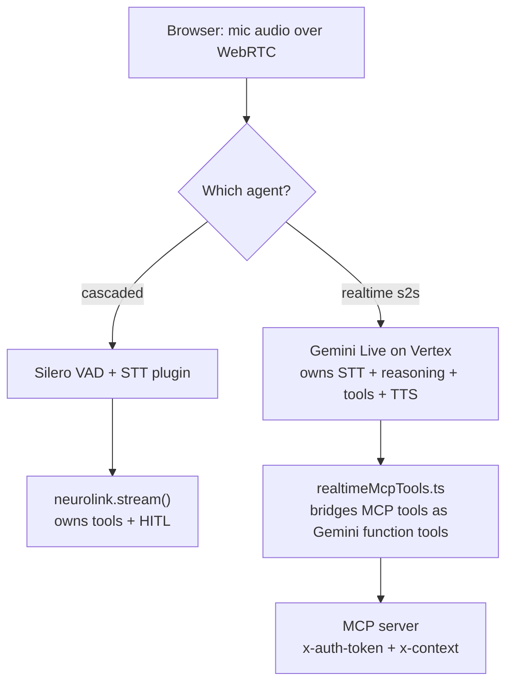

A customer says "cancel my last order" to a voice agent, and somewhere behind that sentence a tool call is about to run against a real order in a real merchant's system. Nobody typed a confirmation dialog. Nobody clicked "yes, I'm sure." The only thing standing between a spoken sentence and a destructive API call is whatever the system designed into that path in advance — because by the time the words are transcribed, there is no browser form to fall back on.

We went looking for the commit that shipped "voice security" in NeuroLink's LiveKit integration. There isn't one. Grepping the release log and CHANGELOG for anything voice-related touching security, auth, tokens, sanitization, injection or CVEs turns up nothing, and that is the correct result, not a gap in our search: two commits shipped the voice agent itself — `26fdac5f7` (2026-06-11), the initial LiveKit WebRTC integration, and `ad7601783` (2026-06-17), which added the speech-to-speech realtime mode — and neither is billed as a security fix. What exists instead is a handful of ordinary engineering decisions, made while building two different voice agents, that happen to be the mechanism this post is about. This is an inventory of those decisions as they exist in the source today, not a changelog entry for a single ship date.

## Two agents, two trust models

NeuroLink ships two LiveKit voice agents, and they hand tool-calling authority to two different places, which matters for anyone reasoning about where the guardrails live.

The **cascaded agent** (`voiceAgent.ts`, from `26fdac5f7`) chains Silero VAD, an STT plugin and a TTS plugin around NeuroLink itself. Every turn calls `neurolink.stream()`, and tool execution happens inside that call — NeuroLink's existing tool-calling loop and its existing HITL manager both apply unchanged. Nothing new was built for tool safety here; the voice transport sits on top of a text pipeline that already had these guarantees.

The **realtime agent** (`realtimeVoiceAgent.ts`, from `ad7601783`) is architecturally different. Gemini Live (over Vertex) does speech-to-text, reasoning, tool selection and text-to-speech in one model, over one WebSocket. NeuroLink is not in that loop — there is no `neurolink.stream()` call to inherit safety from. So the tool-calling contract had to be rebuilt for this path specifically: `realtimeMcpTools.ts` connects directly to an MCP server and registers its tools as Gemini function tools, and a parallel HITL bridge (`realtimeEventBridge.ts`) re-implements the confirmation round-trip that the cascaded path got for free.



Everything below is grounded in the source for both paths, named by file and function.

## The join token: bounded, not identity-scoped

The first trust boundary a caller crosses is getting into the room at all. `mintJoinToken` in `src/lib/voice/livekit/tokens.ts` signs a LiveKit JWT locally — no network call, no room pre-creation, the room auto-creates on first join:

```typescript
export async function mintJoinToken(req: LiveKitTokenRequest): Promise<string> {
  const { AccessToken } = await import("livekit-server-sdk");

  const token = new AccessToken(req.apiKey, req.apiSecret, {
    identity: req.identity,
    ttl: resolveTtlSeconds(req.ttlSeconds),
  });

  token.addGrant({
    roomJoin: true,
    room: req.room,
    canPublish: true,
    canSubscribe: true,
  });

  return token.toJwt();
}
```

The part worth reading closely is `resolveTtlSeconds`, not the token minting itself:

```typescript
const DEFAULT_TTL_SECONDS = 600;
const MAX_TTL_SECONDS = 3600;

function resolveTtlSeconds(ttlSeconds?: number): number {
  if (
    ttlSeconds === undefined ||
    !Number.isFinite(ttlSeconds) ||
    ttlSeconds <= 0
  ) {
    return DEFAULT_TTL_SECONDS;
  }
  return Math.min(Math.floor(ttlSeconds), MAX_TTL_SECONDS);
}
```

A caller can request a shorter TTL, but never a longer one than the one-hour ceiling — the function clamps up, never accepts up. The comment in `tokens.ts` states the reasoning plainly: "A join token only needs to live long enough for the participant to connect, so capping it keeps token-expiry controls meaningful even if a caller requests a very large `ttlSeconds`." That is a narrow, honest claim. It bounds *how long* a leaked token stays useful. It does not bound *what* the token authorizes — the grant is `roomJoin` plus unconditional `canPublish: true, canSubscribe: true` for the named room, with no per-participant permission tiers in this function's shape. Anyone holding a valid token for a room can publish and subscribe audio in it for up to an hour. The token endpoint that calls `mintJoinToken` is host-application code — NeuroLink's docs describe it as "a plain HTTP endpoint in the host application that mints a LiveKit join token... for an authenticated user" — so identity verification (is this really the user they claim to be) happens before this function is ever called, not inside it. `mintJoinToken` bounds a token's lifetime; it is not where you'd look for authentication.

## Room metadata: the handoff from HTTP auth to a worker process

Once a caller is in the room, the LiveKit Agents runtime dispatches a Job — a separate child process — to handle that call. That process has no HTTP request to read a session from; its only per-call context is the room's `metadata` string, which the manager (a Lighthouse `/start` endpoint, per the source comments) wrote when it pre-created the room.

`roomContext.ts` treats that metadata as exactly what it is: untrusted input that happens to have crossed a trust boundary already, not a value to `JSON.parse` and cast.

```typescript
/** Shape the manager writes into room metadata. `mcpContext` is opaque here. */
const roomMetadataSchema = z.object({
  authToken: z.string().optional(),
  mcpContext: z.unknown().optional(),
});

function decodeBase64Json(encoded: string): unknown {
  try {
    return JSON.parse(Buffer.from(encoded, "base64").toString("utf-8"));
  } catch (error) {
    logger.error(
      `[RealtimeVoiceAgent] room metadata is not valid base64 JSON: ${String(error)}`,
    );
    return undefined;
  }
}

export function readCallContextFromRoom(
  roomMetadata: string | undefined,
): LiveKitRoomCallContext {
  const empty: LiveKitRoomCallContext = { authToken: "", xContext: "" };
  if (!roomMetadata) {
    logger.warn(
      "[RealtimeVoiceAgent] room has no metadata — MCP auth/context unavailable.",
    );
    return empty;
  }
  const decoded = roomMetadataSchema.safeParse(decodeBase64Json(roomMetadata));
  if (!decoded.success) {
    logger.error(
      `[RealtimeVoiceAgent] room metadata has unexpected shape: ${decoded.error.message}`,
    );
    return empty;
  }
  const { authToken, mcpContext } = decoded.data;
  const xContext =
    mcpContext === undefined || mcpContext === null
      ? ""
      : Buffer.from(JSON.stringify(mcpContext), "utf-8").toString("base64");
  return { authToken: authToken ?? "", xContext };
}
```

The type this returns, `LiveKitRoomCallContext`, documents `authToken` in its own field comment as "Lighthouse access JWT used as `x-auth-token` to the MCP server." So the actual authentication artifact is not minted by the voice agent at all — it is a JWT issued upstream by Lighthouse, embedded in room metadata by the manager, decoded here, and forwarded downstream unchanged. The voice agent's job in this step is narrower than "authenticate the user": it is "don't corrupt or misparse the credential in transit," which is exactly what a zod `safeParse` over a bare cast buys you. A malformed or tampered metadata string degrades to `{ authToken: "", xContext: "" }` — an empty, not-trusted context — rather than throwing or silently trusting a partially-decoded shape.

Two failure paths are worth naming explicitly, because they read as inconsistent until you see the reasoning: room metadata that decodes to a schema mismatch is logged as an **error**, and the tool client, when it's invoked with an empty `xContext`, is logged as a **warning** ("running-without-tools") rather than blocked outright. NeuroLink does not treat "no MCP context configured" as a security failure — the source comment on `authToken` calls out explicitly that it "may be empty (demo/guest, where the MCP server gates on the context's `demoMode`)." A voice call with no tool context is a valid, supported configuration, not a rejected one; a voice call with *malformed* tool context is the case that gets flagged.

## What crosses the wire to the MCP server, and who scopes it

Neither the cascaded nor the realtime agent decides what an authenticated caller is allowed to do — that decision is delegated entirely to the MCP server on the other end of the connection. The realtime path's `buildRealtimeMcpTools` in `realtimeMcpTools.ts` states this in its own doc comment: "The server already scopes the tool list by `x-context`, so no client-side filtering is needed." The voice agent's contribution is forwarding the two headers it was handed, unmodified:

```typescript
const transport = new StreamableHTTPClientTransport(new URL(mcpUrl), {
  requestInit: {
    headers: { "x-auth-token": authToken, "x-context": xContext },
  },
});
```

That's worth sitting with: NeuroLink's voice layer does not implement an authorization model of its own for tool access. It is a faithful transport for whatever authorization the MCP server already enforces via those two headers, which are themselves just the values `readCallContextFromRoom` decoded out of the Lighthouse-issued room metadata. The security property of the whole chain — can this caller invoke this tool — lives entirely at the MCP server, several hops away from the code this post is about. A reader auditing "does the voice agent authorize tool calls" would be asking the wrong layer; the honest answer is that it deliberately doesn't, by design, and says so in a comment.

Results coming back from that MCP server are not trusted blindly either. `mcpResultToText` decodes the response with a schema before rendering any of it to the model:

```typescript
const toolResultSchema = z.object({
  isError: z.boolean().optional(),
  content: z
    .array(
      z.object({ type: z.string().optional(), text: z.string().optional() }),
    )
    .optional(),
});

export function mcpResultToText(result: unknown): string {
  const decoded = toolResultSchema.safeParse(result);
  if (!decoded.success) {
    return "Tool returned no content.";
  }
  const text = (decoded.data.content ?? [])
    .map((part) => (part.type === "text" && part.text ? part.text : ""))
    .filter(Boolean)
    .join("\n")
    .trim();
  if (decoded.data.isError) {
    return `Tool error: ${text || "unknown error"}`;
  }
  return text || "Tool returned no content.";
}
```

Only `text` content parts survive; image and resource content kinds are dropped by construction, because the code only ever reads `part.type === "text"`. A response shaped nothing like the expected schema degrades to the string "Tool returned no content." rather than throwing or forwarding an unparsed object into the conversation. There is also a hard per-call timeout — `DEFAULT_TOOL_TIMEOUT_MS = 30_000`, passed as the MCP SDK's own `RequestOptions.timeout` — with a comment explaining why the number matters here specifically: "a realtime voice user is waiting in silence while a tool runs... a call that has not returned in 30s has already failed as far as the conversation is concerned." That is an availability property riding along with the auth work, not a separate feature.

## HITL: the last gate, and what happens if nobody answers

Any MCP tool the realtime agent registers whose annotation sets `destructiveHint === true` is wrapped in a human-in-the-loop confirmation before it runs:

```typescript
const requiresConfirmation = mcpTool.annotations?.destructiveHint === true;

const handler = llm.tool({
  description: mcpTool.description ?? mcpTool.name,
  parameters,
  execute: async (args: Record<string, unknown>) => {
    if (requiresConfirmation) {
      const approved = await requestConfirmation(mcpTool.name, args ?? {});
      if (!approved) {
        return buildHitlDeclineMessage(mcpTool.name);
      }
    }
    // ... call the tool
  },
});
```

`requestConfirmation` is implemented in `realtimeEventBridge.ts`, and the interesting design decision is what happens when the human never responds. The prompt is published over the room's data channel and the promise it returns is bound to both an incoming control message and a timer:

```typescript
const DEFAULT_HITL_TIMEOUT_MS = 45_000;

return new Promise<boolean>((resolve) => {
  const timer = setTimeout(() => {
    pendingHitl.delete(confirmationId);
    logger.warn("realtime.bridge.hitlTimeout", {
      toolName,
      confirmationId,
      timeoutMs: hitlTimeoutMs,
    });
    resolve(false);
  }, hitlTimeoutMs);
  pendingHitl.set(confirmationId, (approved) => {
    clearTimeout(timer);
    resolve(approved);
  });
});
```

A silent 45 seconds resolves to `false` — declined, not approved. This is a fail-closed default: on a dropped connection, a distracted user, or a browser tab that never renders the confirmation UI, the destructive tool simply does not run. The `dispose()` method on the same bridge applies the identical rule at shutdown — every still-pending confirmation is resolved `false` before the map is cleared, so a call that ends mid-confirmation can't leave a tool call ambiguously "still waiting" in some other part of the system.

The inbound control message that can *accept* a request is itself schema-validated before it's trusted, the same pattern as the room metadata:

```typescript
const hitlControlMessageSchema = z.object({
  action: z.enum(["hitl:accept", "hitl:reject"]),
  confirmationId: z.string(),
});
```

An unmatched `confirmationId` — one that doesn't correspond to a currently pending request — is logged as `realtime.bridge.controlUnmatched` and dropped. There's no path from an arbitrary or replayed control message to approving a tool call it wasn't issued for.

One more detail in the decline path is worth calling out because it's a correctness choice with a security flavor: `buildHitlDeclineMessage` deliberately scopes the rejection to *this* attempt, not to the tool generally —

```typescript
function buildHitlDeclineMessage(toolName: string): string {
  return (
    `The user reviewed the request to run "${toolName}" and chose to reject it, ` +
    `so it was NOT executed this time. Do not run it right now. ... ` +
    `this rejection applies only to this request, not to all future requests.`
  );
}
```

The comment above it explains why: an earlier "never retry" wording made the model refuse the tool permanently, even when the user later asked for it again in the same conversation. A confirmation gate that's too sticky produces its own failure mode — a tool the user actually wants, permanently blocked by a stale decline.

The cascaded agent does not reimplement any of this. Its `eventBridge.ts` forwards NeuroLink's own `hitl:confirmation-request` / `hitl:confirmation-response` events over the room's data channel — the HITL manager making the accept/reject decision is the same one NeuroLink's text pipeline already has. The realtime agent needed its own copy specifically because it sits outside `neurolink.stream()` altogether.

## Vertex credentials: written to disk, scoped to the process, deleted on exit

The realtime agent's model — Gemini Live on Vertex — authenticates over Application Default Credentials, not an API key, and `vertexAuth.ts` exists to make that true even when the deployment only has split `GOOGLE_AUTH_*` env fields rather than a credentials file already on disk:

```typescript
export function ensureVertexAdc(): void {
  if (process.env.GOOGLE_APPLICATION_CREDENTIALS) {
    return;
  }
  const clientEmail = process.env.GOOGLE_AUTH_CLIENT_EMAIL;
  const rawPrivateKey = process.env.GOOGLE_AUTH_PRIVATE_KEY;
  if (!clientEmail || !rawPrivateKey) {
    logger.warn(
      "[RealtimeVoiceAgent] No GOOGLE_APPLICATION_CREDENTIALS and no GOOGLE_AUTH_* fields — Vertex auth will rely on ambient ADC.",
    );
    return;
  }
  const credentials = { /* ...assembled from GOOGLE_AUTH_* env vars... */ };
  const credentialsDir = mkdtempSync(path.join(os.tmpdir(), "vertex-adc-"));
  const credentialsPath = path.join(credentialsDir, "adc.json");
  writeFileSync(credentialsPath, JSON.stringify(credentials), {
    mode: 0o600,
    flag: "wx",
  });
  process.on("exit", () => {
    rmSync(credentialsDir, { recursive: true, force: true });
  });
  process.env.GOOGLE_APPLICATION_CREDENTIALS = credentialsPath;
}
```

Three choices in this function are all doing security work, not just plumbing. `mkdtempSync` gives each job process its own randomly-named temp directory rather than a fixed, predictable path — this runs once per Job, and LiveKit dispatches one Job per call in its own child process, so a leaked or guessed path in one call's directory doesn't hand you another call's credentials. `mode: 0o600` restricts the file to the owning user, and `flag: "wx"` fails rather than silently overwriting if something unexpected already exists at that path. And the cleanup is registered on the Node `exit` event specifically, not left for the OS's temp-directory garbage collection to eventually get around to — the private key touches disk for exactly the lifetime of the process that needs it.

The companion function, `clearGeminiApiKeyEnv`, exists for a narrower reason that's worth stating precisely rather than rounding up to "extra security": the code comment says `@google/genai` 1.52+ will use a Gemini Developer API key for the realtime WebSocket auth even when `vertexai: true` is set, and Vertex rejects that at the handshake. Clearing `GOOGLE_API_KEY`, `GOOGLE_AI_API_KEY` and `GEMINI_API_KEY` from the process environment is there to force the SDK onto the ADC path this integration actually wants — it is a correctness fix for a library quirk that happens to also mean no stray API key sits in this process's environment for the realtime call. Read the comment as describing what it actually says: a routing fix with a side benefit, not a hardening measure billed as one.

## What this does not do

It's worth being as precise about the boundaries as the source itself is, rather than letting "here's a pile of mechanisms" imply more coverage than exists.

**Voice audio itself is not addressed by any of the code above.** Everything in this post concerns tokens, metadata, tool calls and credentials — not the WebRTC media path. Encryption, codec-level protections and transport security for the audio stream are LiveKit's responsibility as the WebRTC platform, and NeuroLink's source in this area does not configure or override that layer, so this post does not make claims about it.

**A join token is a capability, not an identity check.** `mintJoinToken` clamps how long a token lives; it does not verify who is asking for one. That verification is the host application's job, upstream of the call into this function — NeuroLink's own docs describe the token endpoint as something the host application builds "for an authenticated user," which is a precondition this code assumes rather than enforces.

**Tool authorization is delegated, not implemented.** `buildRealtimeMcpTools`'s own comment says the MCP server scopes the tool list by `x-context`; the voice agent forwards `x-auth-token` and `x-context` unmodified and does no filtering of its own. If you're auditing what a given caller can invoke via voice, the answer lives at the MCP server, not in this integration.

**HITL only covers tools an MCP server annotates `destructiveHint: true`.** A tool that omits or misdeclares that annotation runs without a confirmation prompt in the realtime path. The gate is only as good as the annotation feeding it.

**None of this is a compliance certification.** Nothing in the source claims SOC 2, HIPAA or any other formal attestation for the voice path, and this post doesn't either — it describes what the code does, not what a compliance program would need to say about it.

## Reading this as a checklist, not a review

If you're integrating either voice agent and want to know where to look before shipping, the mechanisms above map onto four questions with source-grounded answers:

- **How long can a leaked join token be used?** Up to `MAX_TTL_SECONDS` (3600s / one hour) regardless of what the caller requests — `resolveTtlSeconds` in `tokens.ts`.
- **What happens if room metadata is corrupted or tampered with in transit?** It decodes to an empty, untrusted context (`{ authToken: "", xContext: "" }`) rather than throwing or partially trusting it — `readCallContextFromRoom` in `roomContext.ts`.
- **What happens if a destructive tool's confirmation prompt never gets answered?** It's declined after `VOICE_HITL_TIMEOUT_MS` (default 45s), fail-closed — `requestConfirmation` in `realtimeEventBridge.ts`.
- **How long does a Vertex service-account private key sit on disk?** For the lifetime of the job process that needed it, in a per-call temp directory, mode `0o600`, removed on `exit` — `ensureVertexAdc` in `vertexAuth.ts`.

None of these four answers came from a security audit or a dedicated hardening pass — they're implementation choices embedded in the commits that shipped the features themselves. That's consistent with there being no single "voice security" commit to point to: the guarantees are load-bearing parts of `26fdac5f7` and `ad7601783`, not a layer added afterward.

---

**Related posts:**

- [AI Application Security Checklist: OWASP Top 10 for LLM Applications](/posts/ai-security-checklist-owasp-top-10-llm/)
- [Human-in-the-Loop (HITL) Security Guide for NeuroLink](/posts/hitl-guardrails-guide/)
- [Voice-First Hotel Concierge with Multi-Provider Routing](/posts/voice-first-hotel-concierge/)
