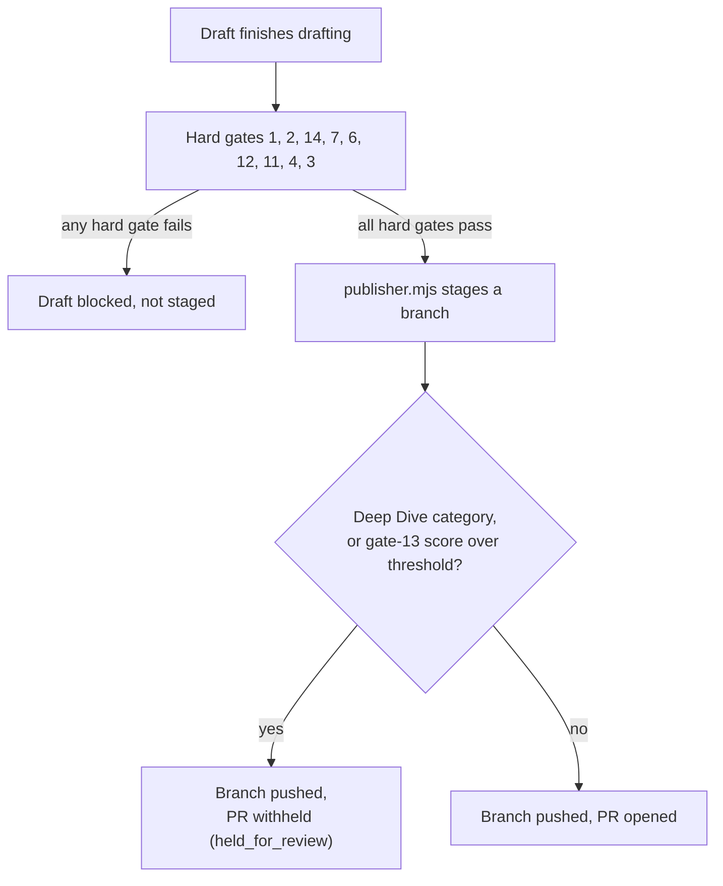
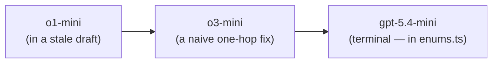

On 2026-07-17, a draft about switching AI providers at runtime cleared every gate that existed at the time and still didn't ship. It sat as a pushed-but-PR-less branch for a little over two months, caught by a hold mechanism built into how the content factory reviews technical posts before they merge. When it finally got a second look, on 2026-09-26, one line inside a fenced code sample was importing a package — `@neurolink/sdk` — that has never existed on npm. Nothing about the SDK had changed in that window; the draft just hadn't been checked for the one class of mistake nothing was watching for yet. What follows is not a standing system with its own run history — it's a real, coded hold path, a gate that was missing and got built in response to this exact miss, and a one-time audit that used a hand-verified fact sheet and a model-currency map to bring one held draft back up to date before it shipped.

## A draft that sat for two months

The factory's publisher script, `publisher.mjs`, does not merge anything on its own. Given a finished draft, it copies the file into a local checkout of the blog repo, then inspects the working tree before touching git at all: anything that changed outside the three files the publisher itself expects — the post, `tools/blog-visuals/src/data/tone-assignments.json`, and the post's hero image directory — is logged as "unexpected" and deliberately left out of `git add`, rather than aborting the run. Stale drift from some earlier, unrelated pass is noted, not swept up. Only once that check passes does the script create a branch and commit. What happens after that commit depends on the mode it's run in: a plain run stages the branch locally and stops; `--review` or `--live` pushes the branch and, in the ordinary case, opens a pull request with `gh pr create`.

"Ordinary case" is doing real work in that sentence, because there's a second path.

## What counts as drift, and what doesn't

That working-tree inspection is worth a moment on its own, because it's a second, smaller kind of "hold" that has nothing to do with `held_for_review` and is easy to conflate with it. It isn't checking the draft's content at all — it's checking whether the local blog checkout the publisher is about to commit into is clean.

The three paths it expects to see changed are narrow and specific: the new post file itself, the shared `tools/blog-visuals/src/data/tone-assignments.json` that records which tone each post was written for, and the hero-image directory for that one post. Anything else — a leftover edit from a previous manual pass, a stray file some other tool touched, a half-finished change nobody committed — gets logged as unexpected and is left out of `git add` rather than silently folded into the new commit. The run doesn't abort over it, and it doesn't try to guess whether the drift is safe; it just refuses to claim credit for changes it didn't make.

That distinction matters for reading this post honestly. A held branch and an unexpected-file warning can both show up in the same publisher run, but they're answering different questions: one is "should a human check this draft's claims before it goes out," the other is "is this checkout in the state the script thinks it's in." Neither one is evidence for the other.

## The hold that's automatic: `held_for_review`

Before opening a PR, `publisher.mjs` checks two things about the draft it just staged. First, whether the front matter's `categories` block contains `Deep Dive`. Second, whether that draft has a call-graph-claims scorecard — the advisory gate that surfaces every "X calls Y" / "returns `Type`" claim in a deep technical post so a human can check it against source — and if so, whether that scorecard's claim score clears a threshold:

```javascript
const isDeepDive = !!fmBlock && /(^|\n)\s*-\s*Deep Dive\b/i.test(fmBlock[1]);

let callGraphScore = 0;
// … read data/factory/scorecards/<draft>-gate13-call-graph-claims.json …
callGraphScore = JSON.parse(readFileSync(scPath, 'utf8'))?.detail?.claim_score || 0;

const withholdPr = isDeepDive || callGraphScore > Number(process.env.CALL_GRAPH_CLAIM_THRESHOLD || 6);
```

If either condition is true, the branch still gets pushed to the remote, but the script stops short of `gh pr create`. It writes `held_for_review: true` and a `held_reason` into its own report instead, and prints the branch name along with the exact command a human needs to run once they've checked the call-graph claims by hand:

```text
[publisher] HELD (Deep Dive category) — branch pushed, PR withheld for human review: <branch-name>
```

The report also writes out the exact next step, so the hold isn't a dead end: something to the effect of "branch pushed, PR withheld for human review — verify the call-graph claims (gate-13 scorecard) against source, then open it," followed by the literal `gh pr create` invocation a human needs to run once they've done that check. The topic still gets marked published in the factory's own tracking the moment the branch exists, specifically so a withheld Deep Dive doesn't cause the planner to draft the same topic again while it's waiting on review.

This is the one part of "hold" in this factory that is genuinely automated and repeatable: every Deep Dive post, and every post whose call-graph-claims score is dense enough, gets a pushed branch and no PR until a person opens one. It exists because deep technical posts make claims about what calls what inside the codebase, and those claims are exactly the kind of thing that reads as plausible and can still be wrong.

| Question | `held_for_review` (gate-13 / Deep Dive path) | The two-month gap on the July draft |
| --- | --- | --- |
| Coded and repeatable? | Yes — checked on every draft, every run | Not on the record — only its outcome is documented |
| What triggers it? | `Deep Dive` category, or a call-graph-claims score over a threshold | Unknown; the only surviving note says the draft was "held" |
| What clears it? | A human verifies the call-graph claims, then runs `gh pr create` | A human rewrote the stale content once gate 14 exposed it |

## What actually held the July draft

That automated path is not, as far as the record shows, what held the 2026-07-17 draft. The only trace of why it sat is a comment left when the gate that eventually caught its problem was added, on 2026-09-26, to `gate-runner.mjs`:

> Gate 14 — import specifiers (deterministic). Added 2026-09-26 after a held post imported the non-existent `@neurolink/sdk`; symbol-grounding never reads fenced code, so nothing caught it.

That's the full extent of what's documented: the draft had a bad import, and nothing in the pipeline at the time was positioned to catch it. It doesn't say who held it, or whether "held" here means the same coded `held_for_review` path described above, a plain unpushed local branch, or a person simply deciding not to merge it. Being honest about that gap matters more than guessing at a tidier story. What is documented, and checkable, is the fix that followed.

## A queue that explains something else

It's tempting to reach for the factory's topic planner, `planner.mjs`, as the explanation for the two-month gap, and worth being precise about why that reach doesn't actually hold up. The planner is a different stage entirely: it rescores every candidate topic, picks the next one worth drafting, and writes that single choice to a queue file — it decides what gets *written next*, not what happens to a branch that's already been written and pushed. It does have its own notion of something getting set aside: a topic that racks up enough consecutive gate failures gets quarantined and logged as "cooling down" rather than retried immediately, so a chronically broken topic can't starve the rest of the queue. That's a real, coded hold — just not the one that applies here. The held provider-switching draft wasn't stuck because the planner wouldn't pick a new topic; it was already drafted, already staged, and simply hadn't been reopened. Conflating the two would make for a tidier story about one system doing all the holding, at the cost of being wrong about which mechanism actually did it.

## The gate that didn't exist yet

Before 2026-09-26, the closest thing to a check on code correctness was gate 2, symbol-grounding: every backticked identifier in a draft's prose gets verified against the real repository. That gate is thorough about prose. It has one blind spot — it never opens a fenced code block. A sentence that says "call `NeuroLink.generate()`" gets checked. A ```javascript fence three lines later that imports `@neurolink/sdk` does not, because nothing in that fence is backticked inline prose; it's already inside its own block.

Gate 14, `import-specifiers.mjs`, closes exactly that gap. It walks every fenced code block in a draft, extracts anything that looks like an `import`, `require`, or install-command specifier, and classifies it:

```javascript
function classify(specifier, kind, matchers) {
  if (LOCAL_PATH.test(specifier) || !/neurolink/i.test(specifier)) return null;
  if (specifier === PACKAGE_NAME) return null;
  if (kind === 'import' && specifier.startsWith(`${PACKAGE_NAME}/`)) {
    const sub = specifier.slice(PACKAGE_NAME.length + 1);
    if (matchers.some((mt) => mt.re.test(sub))) return null;
    return `subpath "${sub}" is not in ${PACKAGE_NAME}'s exports map`;
  }
  return `package "${specifier}" does not exist — NeuroLink is published as ${PACKAGE_NAME}`;
}
```

Anything that isn't a relative or aliased local path and doesn't mention "neurolink" is ignored — the gate isn't trying to validate every `zod` or `express` import a draft happens to show. Anything that does mention "neurolink" has to be exactly `@juspay/neurolink`, or one of its declared subpaths. The list of valid subpaths isn't hardcoded either: the gate reads `package.json`'s `exports` map straight from `origin/release` on every run, so a subpath that gets removed from the SDK can't keep passing just because a stale local checkout still has it.



Symbol-grounding still runs first and still does its job on prose. Gate 14 doesn't replace it; it covers the one surface symbol-grounding structurally can't reach.

## This isn't the first gate born from a miss

Gate 14 fits a pattern that shows up more than once in `gate-runner.mjs`'s own comments, and it's worth naming because it says something about how this pipeline actually evolves — not by anticipating every failure mode in advance, but by watching something slip through and then closing that specific gap.

Gate 12, markdownlint, was added on 2026-05-29 after a post about ten ESLint rules passed every local gate and then failed the blog's own CI anyway, on markdownlint rules `MD022`, `MD031`, and `MD040`. The local gates — `verify_all` and `audit_posts` — had never actually run markdownlint; they checked other things and assumed formatting was covered elsewhere. It wasn't. Gate 12 now mirrors the blog's `validate.yml` CI step directly, using the same `markdownlint-cli` version and the same `.markdownlint.json` config, so a draft either matches CI's own linter locally or it doesn't get staged at all.

Gate 11, narrative-opening, and the promotion of gates 3 and 4 from advisory to hard, trace back to a single incident on 2026-05-26: a pull request, referred to in the code only as "PR #10," shipped writing the gate-runner comments describe as "soulless garbage." The advisory rubric gates had actually flagged it — a mean score of 6.76 on the multi-LLM rubric and 8.79 on tone-fit — but because those gates were advisory at the time, a low score didn't block anything, and the post shipped anyway. The response was twofold: gate 11 was added as a new, deterministic check that every post must name a real component in its opening region and avoid corporate-brochure phrasing anywhere in the body, calibrated against the existing corpus so that 92% of already-published posts pass it; and gates 3 and 4 were promoted to hard gates with a raised threshold, so the same rubric that caught PR #10's voice problems can now actually stop a post rather than just note it.

The shape repeats: something ships, or nearly ships, with a defect a specific gate would have caught if that gate existed; a gate gets written or promoted; the next draft with the same defect gets stopped before a human has to notice it by hand. Gate 14 is that pattern applied to a held draft's fake import instead of a shipped post's formatting or voice.

## Building a fact sheet instead of trusting memory

Catching a bad package name is a narrow, deterministic check. Making sure the rest of a two-month-old draft's technical claims are still true is not something a regex can do, so the 2026-09-26/27 audit that reopened the held draft started by building a reference document instead: a fact sheet, verified line by line against `origin/release` of the NeuroLink repository, with instructions for how to re-verify anything not already on it — read the source directly, don't trust the working tree, and don't trust `package.json`'s own `version` field, which the sheet notes still said `11.x` while the actual release had moved to v12.27.x.

The fact sheet is organized around exactly the kind of thing that goes stale in a held draft: the package and its import subpaths, the shape of the constructor and its calls, how `providerFallback` and `modelChain` actually behave, and a "Counts" section with an explicit instruction never to invent a number that isn't already listed — for example, the SDK's provider count is written as "33 named LLM providers (14 native + 19 JSON-catalog) + a generic OpenAI-compatible adapter," with a specific warning against rounding that up to "41 LLM providers" (41 is the count across every provider category — LLM, embedding, image/video, decision — combined, not LLM providers alone). That kind of precision is the whole point of writing the sheet down instead of relying on memory: a fact half-remembered from six months ago is exactly the failure mode a held draft is exposed to.

A few other entries on the sheet exist specifically because a plausible-sounding but wrong version of them is easy to write from memory: `generate()` and `stream()` take `input: { text }`, and there is no top-level `prompt` field on `GenerateOptions` even though most code samples elsewhere in AI tooling use that name; `provider` and `model` are separate fields, and a compound string like `'openai/gpt-4o'` is never parsed; a `GenerateResult`'s primary output is `content`, not `text`; and provider IDs accept a small set of documented aliases (`google`, `gemini`, `google-ai`, `googleAiStudio` all resolve to the same provider), which matters for a code sample that's trying to look idiomatic rather than technically correct. None of these are the kind of thing gate 2's symbol-grounding would catch on its own — they're not wrong identifiers, they're right identifiers used the wrong way — which is exactly why a held draft needs a document written for humans to read, not just gates written for machines to run.

## Chains, not single hops

Model names age out even faster than package names. The audit's second reference document, a model-currency map, exists to fix stale model IDs in code samples — and it exists in two forms for a reason that's worth walking through.

The raw map records, per provider, which model ID is current for each tier (top-of-line, balanced, fast, and so on), verified with an exact, case-sensitive string match against the enum values in the SDK's own `src/lib/constants/enums.ts`, pinned to a specific commit of `origin/release` — not a fuzzy or substring match, which the map's own verification notes call out explicitly as a source of false confidence. That raw map is enough to catch an obviously wrong id. It is not enough on its own to fix a draft that's aged through more than one generation of a model family, because a naive single-hop replacement can swap a stale id for another id that is itself already stale by the time anyone reads it.

The normalized copy exists specifically to resolve that case. It walks each replacement until it lands on a name that is actually current — for example, one of its recorded chains resolves `o1-mini` through `o3-mini` to the terminal, currently-cataloged `gpt-5.4-mini`:



A single-hop fix would have stopped at `o3-mini` and looked correct at the time it was applied, while quietly reintroducing the exact problem the audit was trying to close. The normalized map's own rule states this directly: every replacement has to be terminal — never itself a stale key — and has to exist in the SDK's real enums, with one documented exception for OpenAI's embedding model IDs, which aren't typed enum members in the SDK's catalog at all and have to stay as raw strings.

## Two months is nothing next to a partner platform's lag

The o1-mini chain is a small, contained example of drift inside one provider's own catalog. The normalized map's notes describe a larger version of the same problem across providers, which is worth walking through because it's the reason a held draft's model IDs can't be trusted just because they compiled six months ago.

| Provider surface | What the map records |
| --- | --- |
| OpenAI (direct) | Catalog tops out at the GPT-5.4 family. The map's own notes flag that OpenAI's live docs already reference a GPT-5.6 generation as a replacement for models being shut down October 23, 2026 — not yet in the SDK's catalog, so `gpt-5.4` is used as the current in-catalog top-of-line id rather than a name the SDK doesn't recognize yet. |
| Anthropic (direct) | Catalog's newest block is Claude 5 (`claude-opus-5`, `claude-sonnet-5`, `claude-fable-5`). The map notes live Anthropic docs already show point releases ahead of that — `claude-opus-5-5` and `claude-fable-5-1` — that aren't in the SDK catalog yet either, so the bare `claude-opus-5` / `claude-fable-5` names are used for the same reason. |
| Claude on Vertex | Tops out at the 4.6 generation in the SDK's catalog — a full major generation behind the direct Anthropic catalog above it, consistent with Anthropic's own documented policy that partner platforms set independent rollout and retirement schedules from the direct API. |
| Claude on Bedrock | Also tops out at 4.6, the same one-generation lag as Vertex and for the same reason. The catalog's own id strings for that generation are inconsistent by design — `anthropic.claude-opus-4-6-v1` keeps a trailing `-v1`, `anthropic.claude-sonnet-4-6` has no version suffix at all, while every 4.5-and-older Bedrock Claude id keeps the fuller `…-v1:0` suffix. The map is explicit that these are literal, copy-exactly modelId strings a rewrite must not "clean up" into a consistent pattern. |
| Gemini (AI Studio) | The map flags a timing mismatch directly: the catalog marks `GEMINI_2_0_FLASH` as `@deprecated`, "retiring June 1, 2026," but live Google docs already listed Gemini 2.0 Flash and Flash-Lite as fully shut down by the time the map was built — ahead of the catalog's own stated date. The map's guidance is to treat that id as already retired, not "retiring soon." |

Reading down that table, the pattern isn't "one stale id in one code sample." It's that a code sample's model IDs can be stale relative to the SDK's own catalog, and the SDK's catalog can itself be stale relative to what a provider's live docs say, in either direction — sometimes the catalog is ahead of what's safe to recommend, sometimes it's behind what a provider has already shipped, and sometimes its own naming is simply irregular on purpose. A fact sheet or a currency map that only checks one of those layers would still get a held draft partway wrong.

## The exceptions a map alone can't hold

Not every provider fits the same shape, and the normalized map keeps an explicit exceptions list for the cases where a flat lookup would be actively wrong rather than merely imprecise:

- Azure's model enum contains an entry, `GPT_5_TURBO = 'gpt-5-turbo'`, that the SDK's own catalog comment flags as not real — "Turbo" was GPT-3.5/GPT-4-era naming that was never carried into the GPT-5 generation on Azure. A code sample can't be "fixed" toward a model that doesn't exist.
- Azure's own GPT-3.5 id has no dot (`gpt-35-turbo`), while direct OpenAI's does (`gpt-3.5-turbo`); the two are easy to conflate and the map calls out explicitly not to cross-apply a fix meant for one provider onto the other.
- Anthropic's published deprecation dates apply only to surfaces Anthropic operates directly — the direct API, Claude on AWS's own platform surface, Microsoft Foundry. They don't apply to Claude hosted on Bedrock or Vertex, which run independent, typically later retirement schedules; the map notes Bedrock and Vertex still lag a full model generation behind the direct Anthropic catalog for exactly that reason.
- An old Ollama model tag isn't "shut down" the way a hosted API id can be, because the weights stay downloadable — the map's guidance is to describe an aged tag as "no longer the recommended default," never as broken or retired.
- DeepSeek's `deepseek-chat` and `deepseek-reasoner` are marked superseded at medium confidence only, inferred from a shorter current pricing-page listing rather than an explicit `@deprecated` tag in the SDK's own catalog or a public shutdown announcement — the map is explicit that this is an inference, not a confirmed fact, and treats it accordingly.

None of that is the kind of thing a script can resolve automatically. It's the reason the audit produced a document meant to be read, with sourcing and confidence levels attached to each claim, rather than a lookup table meant to be applied blindly.

## Other things the sheet pins down

The provider count and the fallback semantics aren't the only entries on the fact sheet, and it's worth listing a few more to show the discipline is applied evenly rather than only where this particular held draft happened to need it:

- CLI command shapes, verified rather than remembered: `neurolink evaluate run … --scorers <list>`, `neurolink proxy setup|install|status`, `neurolink mcp add <name> <command>`.
- MCP: any server can be added via `neurolink mcp add`, with nine one-command configs — filesystem, github, postgres, sqlite, brave, puppeteer, git, memory, bitbucket — over four transports: stdio, sse, websocket, and http.
- Vector stores: in-memory, plus Pinecone, pgvector, and Chroma adapters.
- Workflow patterns: four of them — `ensemble`, `chain`, `adaptive`, `custom`.
- Evaluation and observability surfaces, counted rather than estimated: 14 eval scorers, 10 RAG chunking strategies, 9 observability exporters, 6 TTS providers plus 4 STT providers, and over 260 recognized file extensions for document ingestion.

None of those specific entries needed to be applied to the provider-switching draft. They're on the sheet for the same reason the provider count is: the next held draft that needs rewriting shouldn't have to start this verification over from nothing, and it shouldn't have to trust that a number cited from memory six months ago is still the right one.

## Putting it back together

With the fact sheet and the normalized currency map in hand, the held draft was rewritten and, on 2026-09-27, shipped as "Provider switching at runtime: providerFallback callbacks and modelChain arrays." The archived copy of that rewrite kept in the factory's own records is not byte-for-byte identical to what actually merged — its description was still generic placeholder text, and its opening paragraph still framed the outage in the first person ("At Juspay, we saw…") and named a specific provider by name as the one that failed, where the version that shipped generalized both. Editing continued after the audit's own pass, which is worth noting precisely because it's a small, honest reminder that "rewritten with a verified fact sheet" and "ready to ship" aren't automatically the same milestone.

What the fact sheet and currency map did fix, concretely, checks out against the source they were built from: the package import is `@juspay/neurolink`; the constructor takes provider credentials under `credentials`, not `auth`, because `auth` configures end-user identity providers, a separate concern entirely; `modelChain` retries other models on the *same* provider and only advances automatically on a model-access-denied error, while `providerFallback` is the callback that can hand back a different provider entirely, in response to essentially any failure short of a genuine caller cancellation; and every model id in the shipped code samples — `gpt-5.4`, `gpt-5.4-mini`, `claude-sonnet-5`, `claude-opus-5`, `gemini-2.5-flash` — is a current, in-catalog id per the normalized map, not a name that happened to still compile.

## Before and after: what changed in the room

The factory's own archived copy of the rewrite makes it possible to see exactly what a fact-and-currency pass changes versus what further, ordinary editing changes afterward — and the two are not the same kind of edit. The archived copy's opening line reads:

> "At Juspay, we saw a single provider's brief outage on a Friday night take down a critical user-facing feature. The model was fine, but an authentication token rotation at Anthropic failed, and every call to Claude started returning 401s. Our system had no mechanism to automatically switch to OpenAI or Google. We built NeuroLink's fallback primitives, `modelChain` and `providerFallback`, to solve this permanently."

What shipped reads:

> "Picture a Friday night: one provider's authentication-token rotation fails, and every call to that provider starts returning 401s. The model is fine, but with no mechanism to switch to another provider automatically, a user-facing feature goes down with it."

Both versions describe the same failure mode, and neither one is factually wrong — the fact sheet and currency map weren't fixing this paragraph. The difference is voice and specificity: first person "we" and a named incident at a named provider, versus a generalized scenario that doesn't tie the SDK's design to one company's one bad night. That kind of edit is a normal editorial pass, not a fact-repair, and it's worth separating the two explicitly. A hold-and-rewrite pass fixes what's become false. It doesn't automatically produce a publish-ready draft in the same motion — something between the archived audit copy, dated with the original 2026-07-17 filename, and the post that actually merged on 2026-09-27 kept revising the framing even after the facts were already correct.

## Why the audit trail lives next to the sources, not next to the post

All three artifacts from this pass — the fact sheet, both versions of the model-currency map, and the archived copy of the rewritten draft — were committed together, in the marketing repository that plans and drafts posts, not in the blog repository where the finished post actually lives. That's a small structural choice with a real consequence: the blog repo ends up with exactly one artifact, the published Markdown file with no trace of what it took to get there, while the marketing repo keeps the reasoning — which enum was read, at which commit, with which verification method, and which claims were explicitly marked as inferred rather than confirmed. A reader of the shipped post never needs any of that. A future pass auditing the *next* stale draft does, and having it committed rather than kept in someone's head is the difference between redoing this verification from scratch and being able to check whether the old sheet is still current before writing a new one.

## What this pipeline is not

It would be easy to read all of the above as a standing system: drafts get held, staleness gets detected, a rewrite gets triggered, and the loop closes automatically. That's not what exists. It's worth being direct about the gap between the title of this post and the mechanism behind it:

- There is no scheduled job that scans held or published drafts for stale facts. The factory's `watchers` directory holds `changelog.mjs` and `commits.mjs` — scripts that watch the SDK's changelog and commit history for new topics to write about, which is upstream work, not a downstream check on facts already written into a draft that's sitting idle.
- There is no `rewrite.mjs`. The fact sheet and the model-currency map are reference documents that a person (or an agent working under one) reads and applies by hand. Nothing in `scripts/factory` regenerates a stale draft on its own.
- The automated `held_for_review` path in `publisher.mjs` and the two-month hold on the July draft are two different things that happen to share a word. One withholds a PR because a post is Deep Dive or call-graph-dense, so a human checks its claims before it goes out. The other, going by the only record of it, was a plain miss — a gate that didn't exist yet — and the "hold" was however long it took someone to notice.
- This has, on the record, happened once. The fact sheet and the normalized currency map were built for one audit and applied to one held draft. Calling that a pipeline with a track record would overstate it; calling it a repeatable pattern that a second pass could reuse — the documents, the method of resolving a chain instead of a single hop, the discipline of sourcing and confidence levels — is closer to what actually exists today.

## If you're holding drafts of your own

A few things from this one pass generalize past NeuroLink's specific gates:

1. A check that reads backticked prose is not a check on fenced code. If your review process generates or grades code samples, make sure something actually opens the fence — gate 14 exists precisely because gate 2 structurally couldn't.
2. Record a verification method and a source next to every fact you write down, not just the fact itself. "Exact case-sensitive match against the enum value, pinned to a commit" is a stronger claim than "checked the docs," and it's the difference between a fact sheet someone can re-verify and one they have to trust.
3. Resolve chains before trusting a single replacement. A one-hop fix on a name that's aged through two generations doesn't remove the staleness — it just moves it one hop further down the line, where it's harder to notice.
4. Keep "why we're not merging this yet" separate from "why this went stale while we waited." They can compound, but they're different risks with different fixes: one is a review gate, the other is elapsed time against a moving target.
5. Write down what a single pass actually proved, and resist describing it as more architecture than it is. A fact sheet, a currency map, and one rewritten draft are real, checkable artifacts. A standing "pipeline" is a claim about repetition that those three files, on their own, don't back up yet.
6. Keep the sourcing document next to the pipeline that produces drafts, not next to the output those drafts turn into. The published post doesn't need to carry its own audit trail; the next draft that needs re-verification does.
7. When two things share a name — "held" as an automated PR-withhold versus "held" as a two-month-old branch nobody reopened — say so explicitly instead of letting the word do the work of implying they're the same mechanism.

---

**Related posts:**

- [Prompt Versioning and Management: Treating Prompts as Code](/posts/prompt-versioning-management/)
- [Model Evaluation and Scoring: RAGAS-Style Quality Assessment](/posts/model-evaluation-scoring/)
- [How We Built Multi-Provider Failover: Never Losing an API Call](/posts/how-we-built-multi-provider-failover/)
