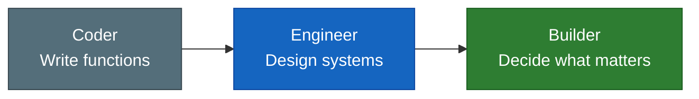
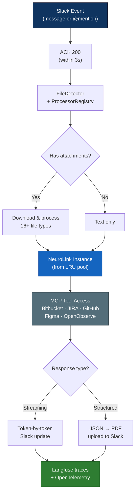
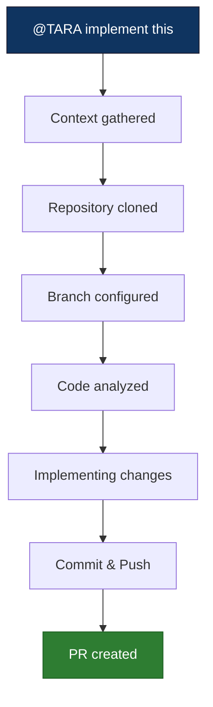

We're excited to introduce TARA — Threaded AI Resource Agent. Two engineers built this coding agent in their spare time. It doubled our PR throughput. Here is the story of how she changed the way we build software.

## The 13-Minute Bug Fix

Last week, Sarthak from Marketing dropped a screenshot into a Slack thread — a typo in the UI. Sachin tagged @TARA. Thirteen minutes later: bug identified at the exact file and line (`src/routes/(app)/ai/v2/+page.svelte`, line 849, two issues — missing space in "amatter", missing period), JIRA ticket BZ-47215 created, fix implemented, pull request #3847 created. Released to production the same day. No IDE opened. No ticket reassigned.


That is not a demo. That happened at 8:55 on a Tuesday morning.

| Metric | Result |
|--------|--------|
| Collaborative threads | 400+ |
| PR throughput | 2x (from ~25/week to ~50) |
| Go-live timelines | 40–60% faster |

## One Year Ago

One year ago, we sat in a room with multiple engineering teams and asked a question: what if engineering was less about typing code, and more about the creative pursuit of solving problems?

We created a playbook. We shared it across teams. We made a YouTube video. The thesis was simple: discussions, debates, and planning become the primary work. Implementation gets offloaded.

Today, that thesis has a name.

**TARA** — Threaded AI Resource Agent. The name means "Star" in Hindi (तारा) — a guiding light that helps navigate through darkness. She lives in Slack, where work already happens. No new tools. No context-switching. 50+ integrated tools across JIRA, Bitbucket, GitHub, Figma, and Slack. 16+ file types understood — PDFs, images, code, spreadsheets, docs.


## Coder, Engineer, Builder

There is a difference between writing a function and deciding which function to write. Between debugging a race condition and understanding why the architecture allows it. Between implementing a feature and knowing which feature matters.

That progression — Coder to Engineer to Builder — is the shift we are living through. The value moves upstream: to thinking, designing, deciding. Tara handles the rest.



## The Stories

Those are the capabilities. Here is what they look like at 8:55 on a Tuesday morning.

### The Async Planning Loop

Sai needed Google Ads campaign creation for the Lighthouse repo. He tagged Tara. She reviewed the codebase, found 13 existing tools but no campaign creation capability, and built a plan.


Yaswanth reviewed it. Spotted an issue: "Why is this in the multi modal server?" Tara corrected.

Yaswanth came back: "Update the existing PR. Remove the stubs. Do actual implementation. Ping me when done."


Task Complete. PR #4477 created. Eighty-seven messages. Multiple people. Fully asynchronous. Nobody waited for anybody.

This is how building works now. A PM starts a conversation. An engineer reviews. Another engineer directs. Tara implements. The thread is the workspace.

### The 13-Minute Bug Fix (Expanded)

Back to Sarthak's screenshot. Tara did not just find a typo. She extracted the bug from an image, identified the exact file and line in a codebase she had never seen in that thread before, created a JIRA ticket with full context, and shipped a fix — all in 13 minutes.

Not a suggestion. A diagnosis. With receipts.

### Race Condition Detective

Nayni suspected a race condition between the frontend Nimble service (`/analytics/tracker`) and Vayu's `checkOrderStatusAndTriggerExternalTracker`. She described the symptoms in a Slack thread.

Tara came back: **"CRITICAL RACE CONDITION CONFIRMED."**


The root cause: a Redis check-then-set deduplication gap — the window between checking if an event was already sent and marking it as sent was wide enough for duplicate Facebook CAPI events to slip through. Tara named the specific functions, traced the execution flow, and generated a full root cause analysis PDF: "Race Condition Analysis: Duplicate Facebook CAPI Events."

Not a suggestion. A diagnosis. With receipts.

### Instant Expertise

Vinay asked what `enablePartialPaymentSurchargeDisplay` and `addSurchargeToPartialPaymentRemainder` actually do. Sixty seconds later: a PDF report with full context, code references, and business logic explained.


Sai asked about UTM parameter extraction for Breeze orders. Twenty-six replies deep — an ongoing technical collaboration that ended in a comprehensive analysis PDF.


## Under the Hood

Every Slack message to Tara triggers a pipeline that spans multiple systems. Understanding this architecture explains why she can do what she does — and why she does it without leaving Slack.

Tara is built on Slack Bolt, the NeuroLink SDK, Vertex AI, Redis, and PostgreSQL. When a message arrives, Slack's 3-second ACK deadline is a hard constraint. Tara handles this with an `unhandledRequestHandler` that returns 200 immediately, then processes the request asynchronously and posts the response when ready. Response latency ranges from 6.9 seconds for simple questions to 70.3 seconds for complex multi-tool operations.

Each Slack thread gets its own isolated NeuroLink instance drawn from an LRU pool of up to 100 concurrent sessions. Conversation memory is backed by Redis with a per-thread key prefix. This means Tara remembers everything you said earlier in a thread — but threads are fully isolated from each other.



For streaming responses, Tara uses `neurolink.stream()` to push tokens to Slack progressively — you see the answer forming in real time, just like a human typing. For structured analysis, she uses `neurolink.generate()` to produce JSON that gets rendered into a downloadable PDF report.

Long-running operations like auto-generating thread titles and syncing conversation state to PostgreSQL run on a BullMQ task queue. This keeps the main response path fast while ensuring nothing is lost.

Here is how a per-thread NeuroLink instance is configured:

```typescript
import { NeuroLink } from "@juspay/neurolink";

const neurolink = new NeuroLink({
  defaultProvider: "vertex",
  memory: {
    type: "redis",
    prefix: `thread:${sessionId}:`,
  },
  observability: {
    langfuse: { enabled: true },
  },
});
```

And this is the streaming loop that powers every conversational response:

```typescript
for await (const token of neurolink.stream({
  prompt: userMessage,
  files: attachedFiles,
  tools: { ...mcpTools },
  memory: { enabled: true },
})) {
  accumulated += token;
  await slackClient.chat.update({
    channel,
    ts: responseTs,
    text: accumulated,
  });
}
```

Every request is traced end-to-end through OpenTelemetry and Langfuse, with `userId`, `sessionId`, and `conversationId` context automatically attached. When something goes wrong, we can trace a single Slack message through the entire pipeline — from event ingestion to tool calls to the final response.

## The MCP Tool Ecosystem

Tara's power comes from the tools she can reach. Through NeuroLink's MCP (Model Context Protocol) integration, she has access to five server connections that cover the full engineering workflow:

| MCP Server | What Tara Can Do |
|------------|-----------------|
| Bitbucket Server | Review PRs, search code, read file content, compare diffs, manage branches |
| JIRA | Create and update tickets, search issues, query project metadata |
| GitHub | Access repository data, read files, search across organizations |
| Figma | Inspect design files, extract component specifications |
| OpenObserve | Query traces, search logs, retrieve production metrics |

This is not a static list of API calls. Tara decides which tools to invoke based on the conversation context. Ask her to "fix the checkout bug from BZ-47215" and she will pull the JIRA ticket, search Bitbucket for the relevant code, read the file, implement the fix, and create a PR — chaining tools together autonomously.

File processing deserves special mention. The `FileDetector` and `ProcessorRegistry` system handles 16+ file types: PDFs, images (screenshots, diagrams), source code in any language, CSV and Excel spreadsheets, Word documents, and more. Every file is downloaded and processed locally before being sent to the AI — unsupported formats return a helpful error message rather than a silent failure.

## The Coding Agent

When you say "implement this," here is what happens:

She clones the repo. She studies your team's coding patterns from recent PRs — not generic code, but code that looks like your team wrote it. She reads JIRA tickets for context. She implements, verifies, commits, pushes, and creates a pull request. You get real-time progress updates right in Slack.


You move on to the next problem. She pings you when it is done.



The coding agent is not a wrapper around a code completion model. It is a multi-step autonomous loop. It gathers context from the thread, the JIRA ticket, and the codebase. It reads your team's recent PRs to learn local conventions — naming patterns, test structures, import styles. It creates a branch, makes changes across multiple files if needed, runs verification, and opens a PR with a description that explains what was changed and why.

Every stage of the process posts a status update back to the Slack thread. You see "Context gathered," "Repository cloned," "Branch configured," "Code analyzed," "Implementing changes," and finally the PR link. If something fails, Tara tells you what went wrong and asks for guidance instead of silently producing broken code.

## Those Numbers Come From a Tool That Did Not Exist Six Months Ago

Built by Sachin Sharma and Parth Dogra. In their spare time. Sachin works with diverse engineering groups — freshers, interns, experienced engineers — and saw firsthand how much time went to repetitive implementation. Parth was simultaneously building new features for the Euler dashboard. They built Tara in pockets of time: first version in September 2025, the coding agent in December, the remaining capabilities in January and February 2026.

The timeline tells a story about what happens when you build on the right foundation. NeuroLink's SDK, MCP tool ecosystem, and observability stack meant that Sachin and Parth did not have to build an AI infrastructure from scratch. They built an engineering workflow on top of one that already existed. Redis-backed memory, streaming responses, multi-provider failover, Langfuse tracing — all inherited from NeuroLink. They focused entirely on the Slack integration, the tool orchestration, and the coding agent loop.

This is Phase 0. Multiple capabilities are already in the pipeline. Some are further along than you would think.

And there is one more thing about how Tara was built that we are not ready to share yet.

## Get Started

Tag **@TARA** in any Slack channel or thread. That is it. Share a screenshot, paste a JIRA link, describe what you need. She will take it from there.

Here are the five things you can try right now:

1. **Ask a codebase question** — "What does the `processPayment` function in Euler do?"
2. **Debug from a screenshot** — paste a UI bug screenshot and ask Tara to find the issue
3. **Create a JIRA ticket** — describe a bug or feature request and ask Tara to file it
4. **Request a code change** — "Implement the changes from BZ-47300 in the Lighthouse repo"
5. **Get a PDF analysis** — "Analyze the architecture of the notification service and send me a report"

Questions? Head to **#tara-dev** or experiment in **#tara-playground**. Or reach out to Sachin or Parth directly.

> **Build what matters.**
{: .prompt-tip }

---

**Related posts:**

- [Welcome to the NeuroLink Blog](/posts/welcome-to-neurolink-blog/)
