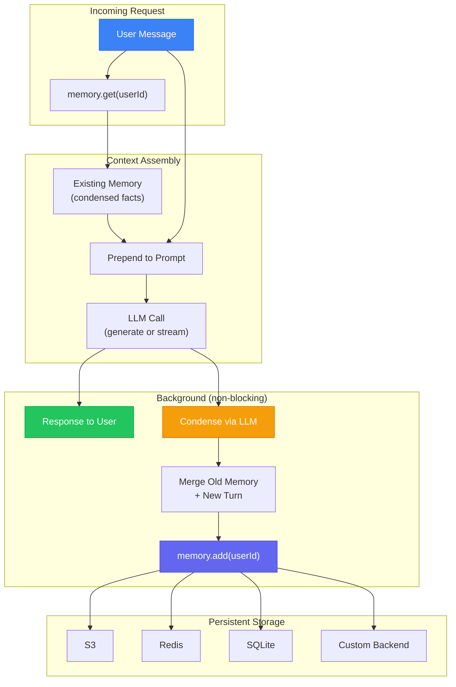
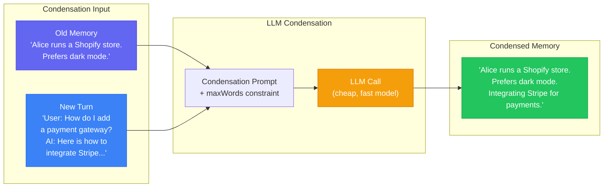
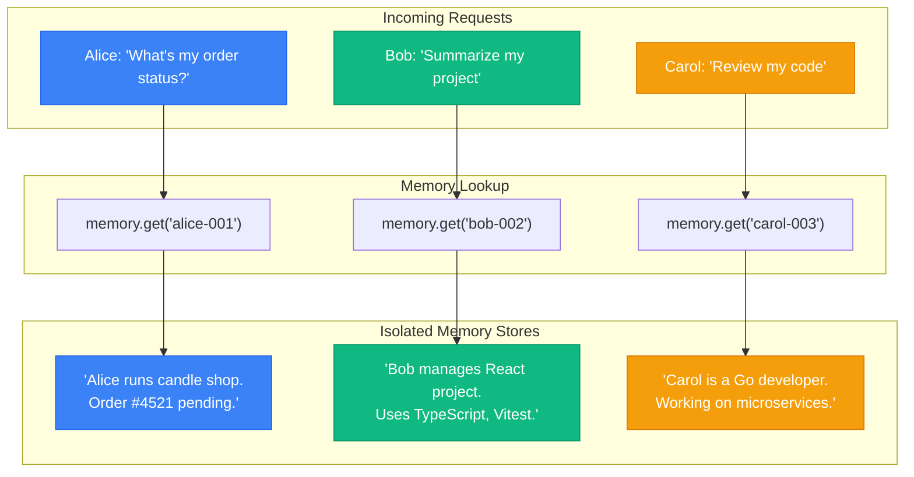

LLMs are stateless. Every API call starts from zero -- no recollection of who the user is, what they said five minutes ago, or what they decided last Tuesday. Your users expect continuity. They expect an AI that remembers their name, their preferences, and the decision they made three conversations ago. The gap between expectation and reality is where Hippocampus lives.

NeuroLink's Hippocampus memory system, powered by the `@juspay/hippocampus` SDK, gives every user a persistent, condensed memory that survives server restarts, session boundaries, and conversation resets. Instead of storing raw chat history (which bloats context windows and burns tokens), Hippocampus uses an LLM to condense each conversation into a compact summary of durable facts. The result is a memory system that gets smarter with every interaction while staying within a configurable word budget.

## Why Memory Matters for Production AI

Statelessness is fine for one-shot queries. It breaks down the moment your application needs continuity.

Consider these real-world scenarios where stateless AI fails:

**Customer support**: A user contacts your support bot three times about the same billing issue. Each time, they re-explain their account number, the charge in question, and the resolution they were promised. The bot treats every conversation as a first contact.

**Personal assistants**: A developer asks an AI to help with their React project on Monday, their deployment pipeline on Wednesday, and a TypeScript refactoring on Friday. The AI never builds a mental model of the developer's tech stack, coding style, or project architecture.

**Enterprise workflows**: An analyst uses an AI to process quarterly reports. The AI never learns that the analyst always wants data broken down by region first, prefers tables over prose, and needs compliance disclaimers appended to financial summaries.

The common thread is that valuable information exists across conversations that could dramatically improve response quality -- but stateless systems discard it after every session.

Session-based conversation memory (tracking recent turns within a single session) solves part of this. But session memory is ephemeral. It dies when the session ends. Hippocampus solves the rest: durable, cross-session, per-user memory that persists indefinitely.

## The Hippocampus Architecture

The name is deliberate. In neuroscience, the hippocampus is the brain region responsible for consolidating short-term experiences into long-term memory. It does not store raw sensory data -- it extracts and encodes the important patterns and facts, discarding the noise.

NeuroLink's Hippocampus does the same thing for AI conversations. Instead of storing every message verbatim, it uses an LLM to distill each conversation into a condensed summary of durable facts. The condensed memory is then stored in a persistent backend and retrieved at the start of every future conversation.



The architecture has four stages, and three of them happen automatically:

1. **Retrieve**: Before the LLM call, `memory.get(userId)` fetches the user's condensed memory from the storage backend. This is a single key lookup -- fast and predictable.

2. **Inject**: The condensed memory is prepended to the user's prompt as context. The LLM sees it as background knowledge about the user.

3. **Generate**: The LLM processes the enhanced prompt normally. From its perspective, it simply has additional context about who this user is and what they care about.

4. **Store**: After the response completes, `memory.add(userId, content)` runs in the background via `setImmediate()`. The SDK sends the old memory plus the new conversation turn to an LLM, which produces a new condensed summary. This is non-blocking -- the user gets their response immediately.

The key architectural decision is that storage happens asynchronously. The user never waits for memory condensation. If condensation fails (LLM timeout, storage error), the generate/stream call succeeds normally -- memory is best-effort, not a hard dependency.

## How LLM-Powered Condensation Works

The condensation step is where Hippocampus differs from every other memory system. Most memory implementations take one of two approaches: store everything (expensive, context-heavy) or store nothing across sessions (cheap, amnesiac). Hippocampus takes a third path: use an LLM to decide what is worth remembering.

Here is the condensation flow:



The condensation prompt receives three inputs:

- **Old memory**: The user's existing condensed memory (may be empty for first-time users)
- **New content**: The latest conversation turn formatted as `"User: ...\nAssistant: ..."`
- **Max words**: The configured word budget (default: 50 words)

The LLM merges old facts with new information, drops anything that is transient or already covered, and produces a new summary within the word limit. Over time, the memory evolves -- new facts replace outdated ones, and the most durable information persists.

The default condensation prompt is built into the `@juspay/hippocampus` SDK, but you can override it:

```typescript
import { NeuroLink } from '@juspay/neurolink';

const neurolink = new NeuroLink({
  conversationMemory: {
    enabled: true,
    memory: {
      enabled: true,
      storage: { type: 's3', bucket: 'my-memory-bucket' },
      neurolink: { provider: 'google-ai', model: 'gemini-2.5-flash' },
      maxWords: 100,
      prompt: `You are a memory engine. Merge the old memory with new facts
into a summary of at most {{MAX_WORDS}} words. Preserve names, preferences,
technical details, and decisions. Drop greetings and small talk.

OLD_MEMORY:
{{OLD_MEMORY}}

NEW_CONTENT:
{{NEW_CONTENT}}

Condensed memory:`,
    },
  },
});
```

Three template variables are available in custom prompts:

| Variable | Replaced With |
|-------------|---------------|
| `{{OLD_MEMORY}}` | The user's existing condensed memory |
| `{{NEW_CONTENT}}` | The new conversation turn |
| `{{MAX_WORDS}}` | The configured `maxWords` value |

The choice of condensation model matters. You want a fast, cheap model for this task -- condensation is simpler than the main conversation. We recommend `gemini-2.5-flash` or `gpt-4o-mini`. The condensation LLM can be a completely different provider and model than your main conversation LLM.

## Storage Backends

Hippocampus supports four storage backends. Each user's memory is a single text blob keyed by `userId` -- there are no complex schemas, no vector embeddings, no indexing. This simplicity is intentional: condensed memory is small (50-200 words), and key-value lookup is all you need.

### Backend Comparison

| Backend | Best For | Latency | Durability | Scaling |
|---------|----------|---------|------------|---------|
| **S3** | Production, archival | ~50-100ms | Extremely high | Unlimited |
| **Redis** | Low-latency production | ~1-5ms | Configurable (AOF/RDB) | Cluster-capable |
| **SQLite** | Local development | ~1ms | File-based | Single process |
| **Custom** | Existing infrastructure | Varies | You control | You control |

### S3 Storage (Recommended for Production)

S3 provides the highest durability -- 99.999999999% (eleven nines). Each user's memory is stored as a single object at `{prefix}{userId}`. For most applications, this is the right default.

```typescript
import { NeuroLink } from '@juspay/neurolink';

const neurolink = new NeuroLink({
  conversationMemory: {
    enabled: true,
    memory: {
      enabled: true,
      storage: {
        type: 's3',
        bucket: 'my-memory-bucket',
        prefix: 'memory/condensed/',
      },
      neurolink: {
        provider: 'google-ai',
        model: 'gemini-2.5-flash',
      },
      maxWords: 50,
    },
  },
});
```

S3 latency (50-100ms for GET/PUT) is acceptable because memory retrieval happens once per request and storage happens in the background. The actual LLM call dominates request latency by an order of magnitude.

### Redis Storage

Redis gives you sub-5ms reads, which matters for latency-sensitive applications. Configure AOF (Append-Only File) persistence if you need durability across Redis restarts.

```typescript
import { NeuroLink } from '@juspay/neurolink';

const neurolink = new NeuroLink({
  conversationMemory: {
    enabled: true,
    memory: {
      enabled: true,
      storage: {
        type: 'redis',
        url: 'redis://localhost:6379',
      },
      neurolink: {
        provider: 'openai',
        model: 'gpt-4o-mini',
      },
    },
  },
});
```

Redis is also the backend for NeuroLink's `RedisConversationMemoryManager`, which handles session-based conversation history. Using Redis for both session memory and Hippocampus condensed memory keeps your infrastructure simple -- one Redis cluster for all memory operations.

### SQLite Storage (Development)

SQLite is the zero-infrastructure option. Point it at a file path and it creates the database automatically. Use this for local development and testing.

```typescript
import { NeuroLink } from '@juspay/neurolink';

const neurolink = new NeuroLink({
  conversationMemory: {
    enabled: true,
    memory: {
      enabled: true,
      storage: {
        type: 'sqlite',
        path: './memory.db',
      },
      neurolink: {
        provider: 'google-ai',
        model: 'gemini-2.5-flash',
      },
    },
  },
});
```

SQLite requires the `better-sqlite3` optional peer dependency:

```bash
pnpm add better-sqlite3
```

### Custom Storage

When you have existing infrastructure -- a Postgres database, a DynamoDB table, a custom API -- use the custom backend. You provide three callbacks and Hippocampus delegates all storage operations to your code.

```typescript
import { NeuroLink } from '@juspay/neurolink';

const neurolink = new NeuroLink({
  conversationMemory: {
    enabled: true,
    memory: {
      enabled: true,
      storage: {
        type: 'custom',
        onGet: async (ownerId: string) => {
          // Retrieve memory from your storage
          const row = await db.query(
            'SELECT memory FROM user_memory WHERE user_id = $1',
            [ownerId]
          );
          return row?.memory ?? null;
        },
        onSet: async (ownerId: string, memory: string) => {
          // Upsert condensed memory
          await db.query(
            `INSERT INTO user_memory (user_id, memory, updated_at)
             VALUES ($1, $2, NOW())
             ON CONFLICT (user_id) DO UPDATE SET memory = $2, updated_at = NOW()`,
            [ownerId, memory]
          );
        },
        onDelete: async (ownerId: string) => {
          await db.query(
            'DELETE FROM user_memory WHERE user_id = $1',
            [ownerId]
          );
        },
      },
      neurolink: {
        provider: 'google-ai',
        model: 'gemini-2.5-flash',
      },
    },
  },
});
```

The three callbacks (`onGet`, `onSet`, `onDelete`) are required. An optional `onClose` callback handles cleanup when the SDK shuts down.

## Quick Start: Five Lines to Persistent Memory

Here is the minimal configuration to add persistent, per-user memory to any NeuroLink application:

```typescript
import { NeuroLink } from '@juspay/neurolink';

const neurolink = new NeuroLink({
  conversationMemory: {
    enabled: true,
    memory: {
      enabled: true,
      storage: { type: 'redis', url: 'redis://localhost:6379' },
      neurolink: { provider: 'google-ai', model: 'gemini-2.5-flash' },
    },
  },
});

// First conversation
const r1 = await neurolink.generate({
  input: { text: 'My name is Alice and I run a Shopify store selling handmade candles.' },
  context: { userId: 'user-alice-001' },
  provider: 'openai',
  model: 'gpt-4o',
});

// Hours later, new session -- the AI remembers
const r2 = await neurolink.generate({
  input: { text: 'What do I sell?' },
  context: { userId: 'user-alice-001' },
  provider: 'openai',
  model: 'gpt-4o',
});
// Response: "You sell handmade candles on your Shopify store."
```

That is it. No schema migrations, no vector databases, no embedding pipelines. The `userId` in `context` is the only thing that connects conversations across sessions.

## Per-User Isolation

Multi-tenant memory isolation is built into the architecture. Every memory operation is keyed by `userId`. There is no global memory, no shared state, no cross-contamination.



In multi-tenant SaaS applications, use composite user IDs to ensure complete isolation between tenants:

```typescript
// Tenant-scoped user IDs prevent cross-tenant memory leaks
const tenantUserId = `tenant_${tenantId}_user_${userId}`;

await neurolink.generate({
  input: { text: 'What were my last preferences?' },
  context: { userId: tenantUserId }, // e.g., "tenant_acme_user_123"
  provider: 'anthropic',
  model: 'claude-sonnet-4-5-20250929',
});
```

For memory to activate on any call, three conditions must be met:

1. `memory.enabled` is `true` in the configuration
2. `context.userId` is provided in the generate/stream call
3. The response has non-empty content (for the storage step)

If `userId` is missing, the call proceeds normally without memory -- no error, no warning. This makes it safe to add memory configuration globally and only activate it for authenticated users.

## Memory Retrieval Tools

Beyond automatic memory injection, NeuroLink provides a `retrieve_context` tool that LLMs can call to search through conversation history. This tool is created by the `createMemoryRetrievalTools()` factory and bound to the `RedisConversationMemoryManager`.

The tool supports three modes of access:

```typescript
import { createMemoryRetrievalTools } from '@juspay/neurolink';

// The tool is automatically registered when Redis memory is configured
// The LLM can call it to:

// 1. Retrieve recent messages by role
// retrieve_context({ sessionId: "sess-123", role: "tool_result", lastN: 5 })

// 2. Search conversation history with regex
// retrieve_context({ sessionId: "sess-123", search: "payment.*failed" })

// 3. Paginate through large tool outputs
// retrieve_context({ sessionId: "sess-123", messageId: "msg-456", offset: 50000, limit: 50000 })
```

The retrieval tool has built-in safety limits: a default character limit of 50,000 per retrieval, a hard maximum of 200,000 characters, a 200-character limit on regex patterns (to prevent ReDoS attacks), and a maximum of 50 search matches per query. These limits prevent an LLM from accidentally consuming its entire context window with a single tool call.

Every retrieval operation is instrumented with OpenTelemetry spans, so you can monitor retrieval latency, frequency, and error rates in your observability stack.

## Production Patterns

### Memory Budgets

The `maxWords` setting controls how much information Hippocampus retains per user. This is the single most important tuning parameter.

| Use Case | Recommended maxWords | Rationale |
|----------|---------------------|-----------|
| Chatbot with basic personalization | 50 (default) | Name, preferences, key facts |
| Customer support agent | 100-150 | Account details, issue history, resolution promises |
| Project assistant | 200-300 | Tech stack, codebase structure, team context |
| Enterprise analyst | 300-500 | Domain knowledge, reporting preferences, compliance requirements |

Higher word budgets mean more context for the LLM but also more tokens consumed on every request. A 50-word memory adds roughly 70 tokens to each call. A 300-word memory adds roughly 400 tokens. At scale, this adds up.

```typescript
// Production config with tuned memory budget
const neurolink = new NeuroLink({
  conversationMemory: {
    enabled: true,
    memory: {
      enabled: true,
      storage: {
        type: 's3',
        bucket: process.env.MEMORY_BUCKET,
        prefix: `memory/${process.env.NODE_ENV}/`,
      },
      neurolink: {
        provider: 'google-ai',
        model: 'gemini-2.5-flash',
      },
      maxWords: 150, // Tuned for customer support use case
    },
  },
});
```

### TTL and Cleanup

Hippocampus itself does not enforce TTLs -- memory persists until explicitly deleted. For compliance or cost reasons, you may need to expire memory after a certain period.

With Redis, use Redis's built-in TTL mechanism:

```typescript
// Set TTL on memory keys via custom storage wrapping Redis
const neurolink = new NeuroLink({
  conversationMemory: {
    enabled: true,
    memory: {
      enabled: true,
      storage: {
        type: 'custom',
        onGet: async (ownerId) => {
          return await redis.get(`memory:${ownerId}`);
        },
        onSet: async (ownerId, memory) => {
          // 90-day TTL for GDPR compliance
          await redis.set(`memory:${ownerId}`, memory, 'EX', 90 * 24 * 60 * 60);
        },
        onDelete: async (ownerId) => {
          await redis.del(`memory:${ownerId}`);
        },
      },
      neurolink: { provider: 'google-ai', model: 'gemini-2.5-flash' },
    },
  },
});
```

With S3, implement a lifecycle policy on the bucket or run a scheduled cleanup job.

### Error Handling and Crash Safety

The `@juspay/hippocampus` SDK is designed to never crash the host application. Every public method (`get()`, `add()`, `delete()`, `close()`) is wrapped in try-catch:

- `get()` returns `null` on error -- the conversation proceeds without memory context
- `add()` silently fails on error -- the user's response is unaffected
- Storage initialization errors disable memory entirely rather than throwing
- Retrieval has a 3-second timeout; storage has a 10-second timeout (includes LLM condensation)

This means your application's availability is never gated on memory availability. Memory is an enhancement, not a dependency.

```typescript
// The SDK handles all error cases internally
// You never need to wrap memory operations in try-catch

const result = await neurolink.generate({
  input: { text: 'What do you know about me?' },
  context: { userId: 'user-123' },
  provider: 'openai',
  model: 'gpt-4o',
});

// If Redis is down: call succeeds, just without memory context
// If condensation LLM fails: call succeeds, memory update is skipped
// If S3 write fails: call succeeds, old memory persists
```

### Monitoring Memory Health

Use the `HC_LOG_LEVEL` environment variable to control Hippocampus logging:

```bash
# Debug mode for development -- logs every get/add/delete operation
HC_LOG_LEVEL=debug

# Production -- only warnings and errors
HC_LOG_LEVEL=warn
```

Key metrics to monitor in production:

- **Memory retrieval latency**: Should be under 100ms for Redis, under 200ms for S3
- **Condensation success rate**: If the condensation LLM is failing frequently, your memory is not updating
- **Memory size distribution**: If user memories are consistently hitting the maxWords limit, consider increasing the budget
- **Storage backend health**: Standard Redis/S3 monitoring applies

## Hippocampus vs Session Memory vs Mem0

NeuroLink offers three layers of memory, each solving a different problem:

| Layer | Scope | Persistence | Storage | Use Case |
|-------|-------|-------------|---------|----------|
| **Session Memory** | Within a session | Ephemeral | In-memory or Redis | Multi-turn conversations |
| **Hippocampus** | Across sessions | Durable | S3, Redis, SQLite, Custom | Per-user personalization |
| **Mem0** | Across sessions | Durable | Mem0 Cloud (vector) | Semantic search over memories |

**Session Memory** tracks the raw conversation history within a single session. It is the context window management layer -- it knows what was said in the last 10 messages. When the session ends, it is gone.

**Hippocampus** distills conversation history into condensed facts that persist across sessions. It answers the question: "What do I know about this user?" It is fast (key-value lookup), cheap (50-200 words per user), and deterministic (same key always returns the same memory).

**Mem0** provides semantic memory with vector-based retrieval. It answers the question: "What have I discussed with this user that is relevant to this specific query?" It is more powerful but adds latency (vector search) and cost (Mem0 Cloud subscription).

For most production applications, start with session memory plus Hippocampus. Add Mem0 if you need semantic search over conversation history -- for example, an enterprise assistant that needs to recall specific technical decisions from weeks ago.

## Type System and Exports

NeuroLink re-exports the Hippocampus types for use in host applications:

```typescript
import type { Memory, CustomStorageConfig } from '@juspay/neurolink';

// Memory = HippocampusConfig & { enabled?: boolean }
// CustomStorageConfig = { type: 'custom', onGet, onSet, onDelete, onClose? }

// Full configuration type
const memoryConfig: Memory = {
  enabled: true,
  storage: {
    type: 's3',
    bucket: 'my-bucket',
    prefix: 'memory/',
  },
  neurolink: {
    provider: 'google-ai',
    model: 'gemini-2.5-flash',
  },
  maxWords: 100,
};
```

The `HippocampusConfig` type is the source of truth for all configuration options. The `Memory` type simply extends it with the `enabled` flag that NeuroLink uses to decide whether to initialize the memory subsystem.

## What Is Next

Hippocampus solves the "what do I know about this user" problem. There are several directions we are exploring for future releases:

**Cross-conversation learning**: Today, each user has an independent memory. We are investigating patterns where memories from one user's interactions can inform responses to similar users (with proper anonymization and consent).

**Memory sharing between agents**: In multi-agent architectures, agents currently do not share memory. A research agent that discovers a user's preferred citation style cannot pass that knowledge to a writing agent. We are designing inter-agent memory protocols that maintain isolation boundaries while enabling controlled knowledge transfer.

**Hierarchical memory**: A single condensed summary works well up to 200-300 words. Beyond that, we are exploring hierarchical structures -- a short summary for quick context, a medium summary for deeper personalization, and a detailed archive for rare but important lookups.

**Memory observability dashboard**: Today, memory health is monitored through logs and OpenTelemetry spans. We are building a dedicated dashboard that shows memory utilization per user, condensation success rates, and storage costs.

The core insight behind Hippocampus -- that LLM-powered condensation can replace raw storage for most memory use cases -- has proven remarkably effective in production. It keeps context windows lean, costs low, and user experience high. If your AI application has returning users, Hippocampus is the simplest path to making it feel like it actually knows them.

---

**Related posts:**

- [Conversation Memory: Building Stateful AI Applications](/posts/conversation-memory-guide/)
- [Context Compaction: Managing Long Conversations Without Losing Information](/posts/context-compaction/)
- [Meet Tara: From Slack Thread to Merged PR](/posts/meet-tara-from-slack-thread-to-merged-pr/)
