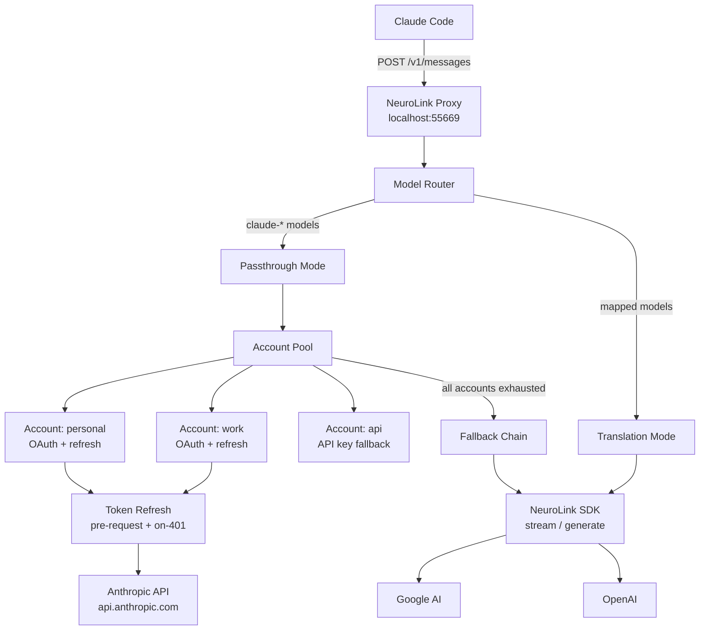
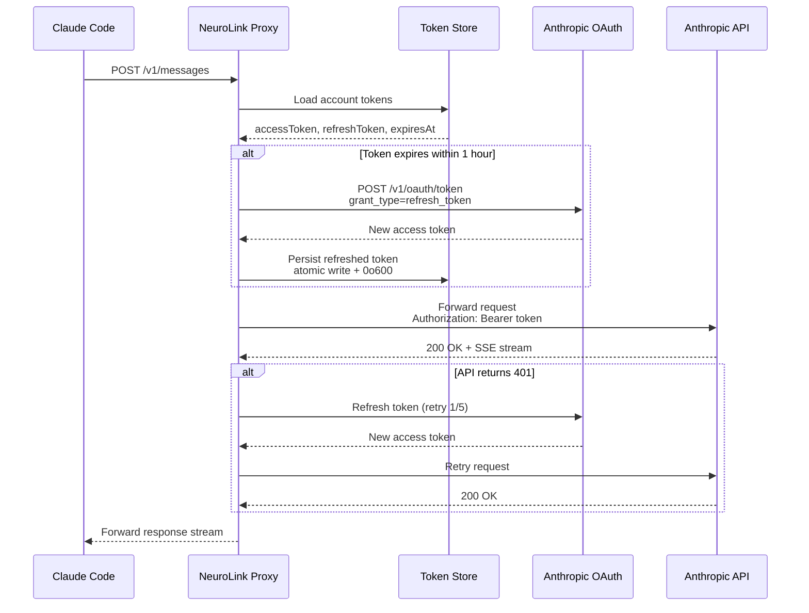
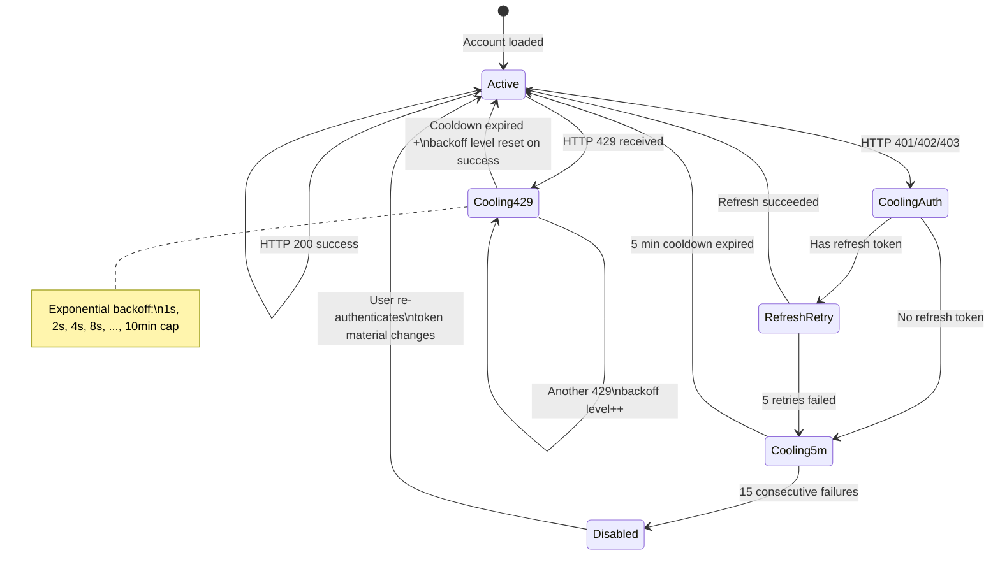
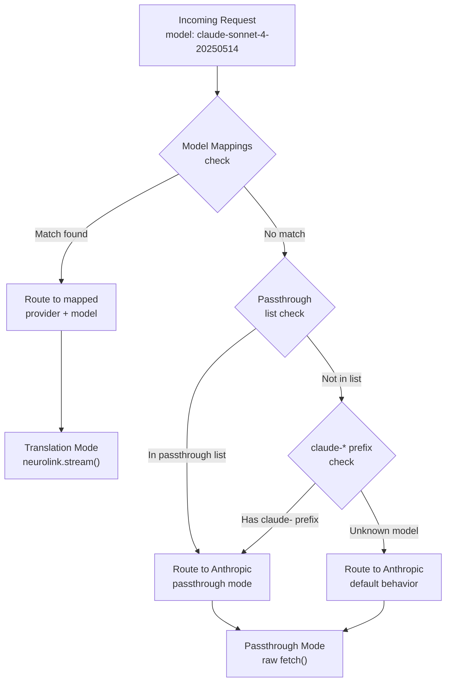

A single Anthropic API key hits rate limits fast. When your entire engineering organization depends on Claude Code for daily work -- code review, architecture exploration, bug triage -- one key is a bottleneck, and two keys managed manually is a headache. At Juspay, we had 30+ engineers hitting Claude simultaneously. The math did not work.

So we built a proxy. NeuroLink's Claude Proxy sits between Claude Code and the Anthropic API, pooling multiple accounts with automatic OAuth token refresh, exponential-backoff failover on rate limits, and a fallback chain to alternative providers when every Claude account is exhausted. This post traces the architecture from request ingestion to response delivery, with the actual TypeScript that powers it.

## The Scaling Problem

Claude Code supports one Anthropic account at a time. That constraint creates three failure modes at scale:

1. **Rate-limit walls.** Anthropic enforces per-account rate limits on both 5-hour and 7-day rolling windows. A single Max subscription runs dry within hours during an intense coding sprint. You wait, or you switch accounts manually.

2. **Token expiry during sessions.** OAuth tokens expire. If the token dies mid-conversation, Claude Code stops working. You re-authenticate manually, losing context.

3. **Single point of failure.** One account, one billing relationship, one set of credentials. If anything goes wrong with that account -- billing issue, credential rotation, service disruption -- everyone is blocked.

The naive solution is "just add more API keys and retry." That breaks for OAuth-authenticated accounts (Pro/Max subscriptions), where tokens expire, refresh tokens can fail, and different subscription tiers grant access to different models. You need a system that understands account health, token lifecycle, and subscription capabilities.

```typescript
// The problem: manual account switching
// This is what engineers were doing before the proxy
const accounts = [
  { key: process.env.ANTHROPIC_KEY_1, label: "personal" },
  { key: process.env.ANTHROPIC_KEY_2, label: "work" },
];

// Which account is rate-limited? Which token expired?
// Which one has Max subscription for Opus access?
// Nobody knows. Everyone is frustrated.
```

## Architecture Overview

The proxy is a local HTTP server built on Hono that intercepts all Claude Code traffic via the `ANTHROPIC_BASE_URL` environment variable. It operates in two modes depending on the target provider.



**Passthrough mode** (Claude to Claude): The request body is forwarded byte-for-byte to `api.anthropic.com`. No parsing, no format conversion, no lossy transformation. Only the authentication headers change. This preserves multi-turn conversation history, thinking blocks, cache control, tool definitions, and every beta feature Claude Code sends -- exactly as sent.

**Translation mode** (Claude to other provider): When model routing directs a request to a non-Anthropic provider, the proxy parses the Claude Messages API request into NeuroLink's internal format, calls `neurolink.stream()`, and serializes the result back into Claude-compatible SSE events.

Why passthrough? Claude Code sends complex bodies -- interleaved tool use/result blocks, thinking blocks with budget configuration, context management betas, system prompts with cache control, image blocks, and tool definitions with nested JSON schemas. Parsing this into an intermediate format and re-serializing is lossy. Passthrough preserves byte-level fidelity.

## The OAuth 2.0 Token Lifecycle

Every OAuth account in the pool has an access token that expires. The proxy uses a reactive two-layer refresh strategy -- no background timers, no polling threads. Tokens are refreshed on demand.



**Layer 1 -- Pre-request check.** Before every request, the proxy checks whether the token expires within the next hour. If so, it refreshes inline before sending the request. This prevents the vast majority of expired-token failures.

**Layer 2 -- On-401 retry.** If Anthropic returns a 401 despite the pre-request check (clock skew, token revocation, race condition), the proxy refreshes the token and retries up to 5 times. If all retries fail, the account enters a 5-minute cooldown and the proxy moves to the next account.

```typescript
// Token refresh logic from tokenRefresh.ts
import { TokenStore } from "@juspay/neurolink/auth";

const REFRESH_BUFFER_MS = 60 * 60 * 1000; // 1 hour
const MAX_AUTH_RETRIES = 5;
const MAX_CONSECUTIVE_REFRESH_FAILURES = 15;

function needsRefresh(expiresAt: number): boolean {
  return expiresAt <= Date.now() + REFRESH_BUFFER_MS;
}

async function refreshToken(
  refreshToken: string,
  accountLabel: string,
): Promise<{ accessToken: string; expiresAt: number }> {
  // Primary endpoint
  const primaryUrl = "https://api.anthropic.com/v1/oauth/token";
  // Fallback endpoint (heavier Cloudflare, but always works)
  const fallbackUrl = "https://console.anthropic.com/v1/oauth/token";

  const body = JSON.stringify({
    grant_type: "refresh_token",
    refresh_token: refreshToken,
    client_id: "9d1c250a-e61b-44d9-88ed-5944d1962f5e",
  });

  try {
    const res = await fetch(primaryUrl, {
      method: "POST",
      headers: { "Content-Type": "application/json" },
      body,
    });
    if (res.ok) return await res.json();
    // Fall through to fallback
  } catch {
    // Network error on primary, try fallback
  }

  const res = await fetch(fallbackUrl, {
    method: "POST",
    headers: { "Content-Type": "application/json" },
    body,
  });
  if (!res.ok) throw new Error(`Refresh failed: ${res.status}`);
  return await res.json();
}
```

Refreshed tokens are persisted atomically -- write to a `.tmp` file, then rename -- with `0o600` permissions. This prevents partial writes from corrupting the credential store if the process crashes mid-write.

After 15 consecutive refresh failures across requests, the account is permanently disabled until the user re-authenticates via `neurolink auth login`. This prevents a broken account from consuming retry budget on every request indefinitely.

## Account Pool Management

Accounts are discovered on every request (not cached across requests) from three sources in priority order:

1. **TokenStore compound keys** (`anthropic:personal`, `anthropic:work`) -- from `neurolink auth login --add --label`
2. **Legacy credentials file** (`~/.neurolink/anthropic-credentials.json`) -- only if no compound keys exist
3. **Environment variable** (`ANTHROPIC_API_KEY`) -- only if no other accounts exist

This priority ordering means OAuth accounts always take precedence. API keys are a last resort, used only when no OAuth accounts have been configured.

```typescript
// Account pool loading from claudeProxyRoutes.ts
import { TokenStore } from "@juspay/neurolink/auth";

interface ProxyAccount {
  label: string;
  type: "oauth" | "api_key";
  accessToken: string;
  refreshToken?: string;
  expiresAt?: number;
}

async function loadAccounts(tokenStore: TokenStore): Promise<ProxyAccount[]> {
  const accounts: ProxyAccount[] = [];

  // Priority 1: TokenStore compound keys
  const providers = await tokenStore.listProviders();
  const anthropicKeys = providers.filter((k) => k.startsWith("anthropic:"));

  for (const key of anthropicKeys) {
    const tokens = await tokenStore.loadTokens(key);
    if (tokens && !(await tokenStore.isDisabled(key))) {
      accounts.push({
        label: key.replace("anthropic:", ""),
        type: "oauth",
        accessToken: tokens.accessToken,
        refreshToken: tokens.refreshToken,
        expiresAt: tokens.expiresAt,
      });
    }
  }

  // Priority 2: Legacy credentials (only if no compound keys)
  if (accounts.length === 0) {
    const legacyCreds = await loadLegacyCredentials();
    if (legacyCreds) {
      accounts.push({
        label: "legacy",
        type: "oauth",
        accessToken: legacyCreds.oauth.accessToken,
        refreshToken: legacyCreds.oauth.refreshToken,
        expiresAt: legacyCreds.oauth.expiresAt,
      });
    }
  }

  // Priority 3: Environment variable (only if no OAuth accounts)
  if (accounts.length === 0 && process.env.ANTHROPIC_API_KEY) {
    accounts.push({
      label: "env",
      type: "api_key",
      accessToken: process.env.ANTHROPIC_API_KEY,
    });
  }

  return accounts;
}
```

### Adding Accounts to the Pool

Each `neurolink auth login --add --label <name>` creates a separate entry in the TokenStore:

```bash
# Account 1: personal Claude Max subscription
neurolink auth login anthropic --method oauth --add --label personal

# Account 2: work Claude Max subscription
neurolink auth login anthropic --method oauth --add --label work

# Account 3: API key for fallback
neurolink auth login anthropic --method api-key --add --label api

# Verify the pool
neurolink auth list
```

The `neurolink auth list` command shows each account's status, email address (resolved via OAuth token exchange), token expiry, and per-account quota utilization across 5-hour and 7-day windows.

### Runtime Account State

Each account carries in-memory runtime state that tracks its health:

```typescript
// Runtime state per account from claudeProxyRoutes.ts
interface RuntimeAccountState {
  coolingUntil?: number;               // Timestamp when cooldown expires
  backoffLevel: number;                // Exponential backoff level (resets on success)
  consecutiveRefreshFailures: number;  // Cumulative refresh failures
  permanentlyDisabled: boolean;        // Disabled until re-authentication
  lastToken?: string;                  // Last known access token
  lastRefreshToken?: string;           // Last known refresh token
}
```

When an account's token material changes -- for example, the user re-authenticates -- all runtime state resets automatically. A permanently disabled account is re-enabled without manual intervention.

## Rate-Limit Failover

When an account hits a 429, the proxy does not wait. It applies exponential backoff to that account and immediately tries the next one. The backoff formula:

```text
cooldownMs = min(baseCooldown * 2^level, 10 minutes)
```

Where `baseCooldown` is the `Retry-After` header value from Anthropic (or 1 second if absent), and `level` increments on each consecutive 429 for that account. The level resets to zero on any successful request.



The proxy classifies every upstream error and applies a different strategy:

```typescript
// Error classification from claudeProxyRoutes.ts
function isTransientHttpFailure(status: number, errBody: string): boolean {
  // Standard server errors
  if ([408, 500, 502, 503, 504].includes(status)) return true;
  // Cloudflare errors
  if (status >= 520 && status <= 526) return true;
  if (status === 529) return true;
  // Cloudflare 520 wrapped in 400/api_error
  if (status === 400) {
    const isApiError = errBody.includes('"api_error"');
    const isOverloaded = errBody.includes('"overloaded_error"');
    const isCloudflare =
      errBody.includes("<!doctype html") ||
      errBody.includes("error code 520") ||
      errBody.includes("cloudflare");
    return isOverloaded || (isApiError && isCloudflare);
  }
  return false;
}

function isInvalidRequestError(status: number, errBody: string): boolean {
  if (status === 422) return true;
  return errBody.includes('"invalid_request_error"');
}
```

The key insight: **not all errors deserve retries.** A 422 (invalid request) is a client bug -- retrying with a different account produces the same error. A 404 (model not available) is account-specific but not transient. Only rate limits (429), auth failures (401), and transient server errors (5xx) trigger account rotation.

| Status Code | Cooldown | Behavior |
|---|---|---|
| 429 | Exponential backoff (1s to 10 min) | Try next account |
| 401/402/403 | 5 minutes (after refresh retries) | Try next account |
| 404 | None | Return error immediately |
| 400/422 (invalid request) | None | Return error immediately |
| 5xx / Cloudflare | None | Rotate immediately |
| Network error | None | Rotate immediately |

## The Model Router

Not every request needs to go to Anthropic. The Model Router resolves incoming model names against a configurable set of rules before the proxy decides which path to take.



Configuration lives in `~/.neurolink/proxy-config.yaml`:

```yaml
# ~/.neurolink/proxy-config.yaml
version: 1

routing:
  strategy: fill-first

  # Remap specific models to other providers
  model-mappings:
    - from: claude-3-haiku-20240307
      to: gemini-2.5-flash
      provider: google-ai

  # These always go directly to Anthropic
  passthrough-models:
    - claude-opus-4-20250514
    - claude-sonnet-4-5-20250929

  # When all Claude accounts are exhausted
  fallback-chain:
    - provider: google-ai
      model: gemini-2.5-pro
    - provider: openai
      model: gpt-4o
```

This configuration routes Haiku requests to Gemini Flash (cheaper), ensures Opus and Sonnet 4.5 always use Anthropic directly, and falls back through Gemini Pro then GPT-4o when all Claude accounts are rate-limited.

## Fallback Chain Execution

When every account in the pool is cooling or disabled, the proxy walks the fallback chain. Each fallback entry uses NeuroLink's `stream()` pipeline in translation mode:

```typescript
// Fallback chain execution from claudeProxyRoutes.ts
import { NeuroLink } from "@juspay/neurolink";

async function executeFallbackChain(
  neurolink: NeuroLink,
  fallbackChain: Array<{ provider: string; model: string }>,
  parsedRequest: ParsedClaudeRequest,
): Promise<Response | null> {
  for (const fallback of fallbackChain) {
    try {
      const result = await neurolink.stream({
        input: { text: parsedRequest.prompt },
        provider: fallback.provider,
        model: fallback.model,
        system: parsedRequest.systemPrompt,
        tools: parsedRequest.tools,
        conversationMessages: parsedRequest.messages,
        maxSteps: 1, // Prevent multi-step agent loops
      });

      // Serialize back to Claude SSE format
      const sseStream = new ClaudeStreamSerializer(result);
      return new Response(sseStream.readable, {
        headers: { "content-type": "text/event-stream" },
      });
    } catch (error) {
      // This fallback failed, try the next one
      continue;
    }
  }

  return null; // All fallbacks exhausted
}
```

The `maxSteps: 1` limit is deliberate. The proxy should not run a multi-step agent loop -- that is Claude Code's responsibility. The fallback provider sees the full request context (tools, thinking configuration, conversation history) and produces a single response.

## Streaming Architecture

Streaming requests follow different paths depending on the mode.

**Passthrough streaming** pipes the upstream `ReadableStream` directly to Claude Code. The proxy performs a bootstrap retry: it reads the first chunk to verify it is non-empty. If the first chunk is empty (indicating a failed stream), the proxy cancels and tries the next account.

```typescript
// Bootstrap retry for streaming from claudeProxyRoutes.ts
async function streamWithBootstrapRetry(
  response: Response,
): Promise<ReadableStream | null> {
  const reader = response.body!.getReader();
  const { value: firstChunk, done } = await reader.read();

  // Empty stream = failed connection, retry with next account
  if (done || !firstChunk || firstChunk.length === 0) {
    reader.cancel();
    return null;
  }

  // Valid stream: create a new ReadableStream that starts with firstChunk
  return new ReadableStream({
    start(controller) {
      controller.enqueue(firstChunk);
    },
    async pull(controller) {
      const { value, done } = await reader.read();
      if (done) {
        controller.close();
      } else {
        controller.enqueue(value);
      }
    },
  });
}
```

The body bytes are never parsed or modified in passthrough mode. Claude Code receives exactly what Anthropic sent, including rate-limit headers (`anthropic-ratelimit-requests-remaining`, `anthropic-ratelimit-tokens-remaining`).

**Translation streaming** converts NeuroLink stream chunks into Claude-compatible SSE events using `ClaudeStreamSerializer`. It emits the standard Claude event sequence: `message_start`, `content_block_start`, `content_block_delta`, `content_block_stop`, `message_delta`, `message_stop`. SSE keep-alive comments (`: keep-alive`) are emitted every 15 seconds during idle periods to prevent connection timeouts.

## Request Logging and Usage Tracking

Every request through the proxy is logged to `~/.neurolink/logs/proxy-YYYY-MM-DD.jsonl` in JSONL format with `0o600` permissions:

```typescript
// Request logging from requestLogger.ts
interface ProxyLogEntry {
  timestamp: string;
  requestId: string;
  method: string;
  path: string;
  model: string;
  stream: boolean;
  toolCount: number;
  accountLabel: string;
  responseStatus: number;
  responseTimeMs: number;
  tokenUsage?: {
    inputTokens: number;
    outputTokens: number;
  };
  error?: string;
}

// Separate debug logs with full request/response bodies
// Written to ~/.neurolink/logs/proxy-debug-YYYY-MM-DD.jsonl
interface ProxyDebugEntry extends ProxyLogEntry {
  requestHeaders: Record<string, string>;  // Sensitive values redacted
  requestBodySummary: {
    model: string;
    maxTokens: number;
    messageCount: number;
    toolCount: number;
    thinkingConfig?: string;
  };
  responseHeaders: Record<string, string>;
  responseBodyPreview?: string;  // First 2000 chars on errors
}
```

In-memory per-account statistics track request counts, success rates, error counts, rate-limit hits, current backoff levels, and cooling state. These are accessible via the `/status` endpoint and `neurolink proxy status`:

```bash
# Check per-account statistics
neurolink proxy status

# Machine-readable output for monitoring integration
neurolink proxy status --format json
```

### Log Rotation

Log files are automatically cleaned up at startup and hourly:

- Files older than 7 days are deleted
- If remaining files exceed 500 MB total, the oldest are deleted first
- Cleanup is non-fatal -- if it fails, the proxy continues operating

No external cron jobs, no logrotate configuration, no manual intervention.

## Security: Credential Masking and Request Cloaking

The proxy handles sensitive credentials throughout the request lifecycle. Several security measures are in place.

**Header redaction in logs.** Request headers are redacted before logging -- `authorization` and `x-api-key` values are truncated or masked. You can safely ship log files to a centralized logging system without leaking credentials.

**Atomic credential persistence.** Token writes use a write-to-temp-then-rename pattern with `0o600` permissions. This prevents partial writes and ensures only the current user can read the credential file.

**Token Store obfuscation.** The `~/.neurolink/tokens.json` file uses XOR obfuscation with a machine-derived key. Not encryption (it is local-only security), but it prevents casual credential exposure from `cat` commands or file browsing.

**OAuth cloaking pipeline.** For OAuth-authenticated requests, the proxy applies transformations to ensure compatibility with Anthropic's OAuth-specific requirements:

```typescript
// Cloaking pipeline configuration from proxyConfig.ts
interface CloakingConfig {
  mode: "auto" | "always" | "never";
  plugins: {
    headerScrubber: boolean;        // Remove proxy-revealing headers
    sessionIdentity: boolean;       // Consistent session IDs per account
    systemPromptInjector: boolean;  // Required billing/agent context
    wordObfuscator: {
      enabled: boolean;
      words: string[];              // Words to obfuscate
    };
  };
}

// Default cloaking mode: auto
// - OAuth accounts: cloaking applied (required for API compatibility)
// - API key accounts: cloaking skipped (not needed)
```

The cloaking pipeline runs plugins in order: `HeaderScrubber` removes proxy-revealing headers, `SessionIdentity` generates consistent fake session identifiers per account (cached with 1-hour TTL), `SystemPromptInjector` adds the required billing and agent context blocks, and `WordObfuscator` applies zero-width character insertion on configurable terms.

## Configuration Walkthrough: Zero to Production

Here is the complete path from nothing to a running multi-account proxy.

### Step 1: Authenticate accounts

```bash
# First account -- opens browser for Anthropic OAuth
neurolink auth login anthropic --method oauth --add --label personal

# Second account
neurolink auth login anthropic --method oauth --add --label work

# Verify both are authenticated
neurolink auth list
```

### Step 2: Create the proxy config

```yaml
# ~/.neurolink/proxy-config.yaml
version: 1

accounts:
  anthropic:
    - name: personal
      apiKey: "${ANTHROPIC_KEY_PERSONAL}"
      weight: 1
    - name: work
      apiKey: "${ANTHROPIC_KEY_WORK}"
      weight: 2

routing:
  strategy: fill-first
  fallback-chain:
    - provider: google-ai
      model: gemini-2.5-flash
    - provider: openai
      model: gpt-4o

cloaking:
  mode: auto
  plugins:
    headerScrubber: true
    sessionIdentity: true
```

The config file supports `${VAR_NAME}` and `${VAR_NAME:-default}` syntax for environment variable interpolation. Plaintext API keys in the config file trigger a warning -- use environment variable references instead.

### Step 3: Start the proxy

```bash
# One-command setup: login + install as launchd service + configure Claude Code
neurolink proxy setup

# Or start manually in the foreground
neurolink proxy start --debug

# Or install as a persistent macOS service (auto-restarts on crash/reboot)
neurolink proxy install
```

The proxy automatically writes to `~/.claude/settings.json`:

```json
{
  "env": {
    "ANTHROPIC_BASE_URL": "http://127.0.0.1:55669",
    "ENABLE_TOOL_SEARCH": "true"
  }
}
```

When the proxy stops, it removes these entries. If the proxy crashes without a clean shutdown, the fail-open guard (a detached background process) detects the unhealthy endpoint and reverts the settings automatically.

### Step 4: Verify

```bash
# Health check
curl http://127.0.0.1:55669/health

# Detailed status with per-account stats
curl http://127.0.0.1:55669/status

# Restart Claude Code to pick up ANTHROPIC_BASE_URL
# Then use Claude Code normally -- it routes through the proxy transparently
```

## The Fail-Open Guard

A dead proxy is worse than no proxy. If the proxy crashes and Claude Code still has `ANTHROPIC_BASE_URL` pointed at it, every request fails. The fail-open guard prevents this.

On startup, the proxy spawns a detached child process that monitors the `/health` endpoint every second. If either the parent process exits or the health endpoint fails 5 consecutive checks, the guard:

1. Removes `ANTHROPIC_BASE_URL` from `~/.claude/settings.json` (only if the URL matches the expected proxy URL -- it will not clobber a different proxy)
2. Clears the proxy state file if the recorded PID is no longer running

Claude Code falls back to direct Anthropic API access automatically. No stuck state, no manual cleanup.

## Troubleshooting

### All accounts rate-limited

Check cooldown status and add more accounts:

```bash
# View current account states
neurolink proxy status --format json

# Add another account to increase aggregate throughput
neurolink auth login anthropic --method oauth --add --label extra

# Clean up disabled accounts
neurolink auth cleanup
```

### Token refresh failures

If you see `refresh failed` in the logs, the OAuth refresh token itself may be expired:

```bash
# Force a manual refresh
neurolink auth refresh anthropic

# If that fails, re-authenticate entirely
neurolink auth login anthropic --method oauth

# Re-enable a disabled account after re-authentication
neurolink auth enable anthropic:work
```

### Claude Code not connecting through proxy

Verify the chain: proxy running, settings configured, Claude Code restarted.

```bash
# Is the proxy running?
neurolink proxy status

# Is ANTHROPIC_BASE_URL set?
cat ~/.claude/settings.json

# If settings are missing, run setup again
neurolink proxy setup
```

### Account not rotating on 429

This is expected behavior. The proxy uses fill-first routing by design -- it keeps using one account until rate-limited, then switches. Fill-first maximizes Anthropic's prompt caching (tied to account/session) and fully uses each account's rate-limit window before moving on.

Enable debug logging to see rotation in action:

```bash
NEUROLINK_LOG_LEVEL=debug neurolink proxy start
# Watch for:
# [proxy] <- 429 account=personal backoff-level=1 cooldown=2s
# [proxy] -> account=work (oauth)
```

## What We Shipped

The Claude Proxy is a production system running at Juspay today. It pools multiple Anthropic accounts behind a single transparent endpoint, refreshes OAuth tokens before they expire, fails over across accounts on rate limits with exponential backoff, falls back to alternative providers when every Claude account is exhausted, and cleans up after itself if it crashes.

The design decisions are deliberate: passthrough mode preserves byte-level fidelity for Claude-to-Claude traffic. Fill-first routing maximizes prompt cache hit rates. Reactive (not background) token refresh avoids polling overhead. The fail-open guard prevents stuck states.

If you are running Claude Code at scale, the math is simple: one account is not enough. The proxy makes N accounts behave like one, with the reliability characteristics you need for production.

---

**Related posts:**

- [Mastering Claude with NeuroLink: Complete Anthropic Guide](/posts/anthropic-claude-guide/)
- [Multi-Provider Failover: Never Lose an API Call](/posts/provider-failover-patterns/)
- [Hippocampus: Persistent Memory That Learns Across Conversations](/posts/hippocampus-persistent-memory/)
