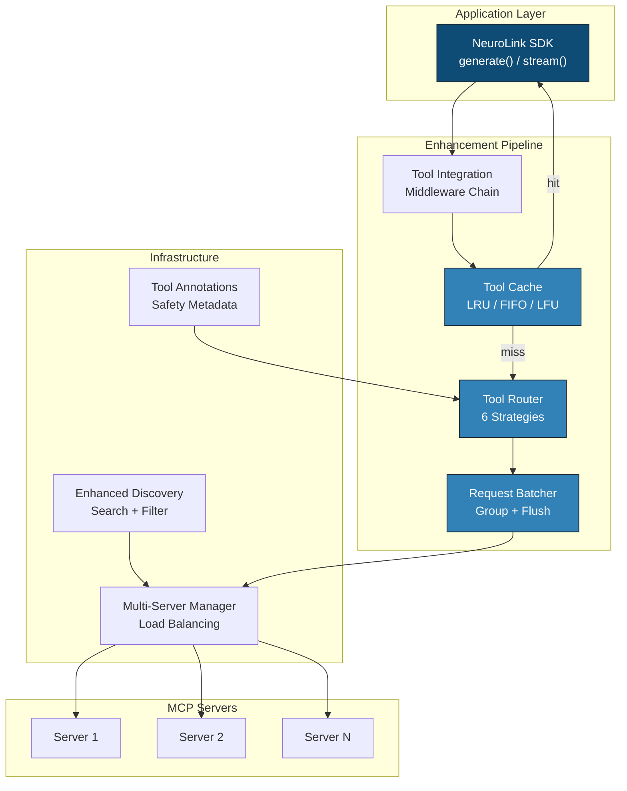
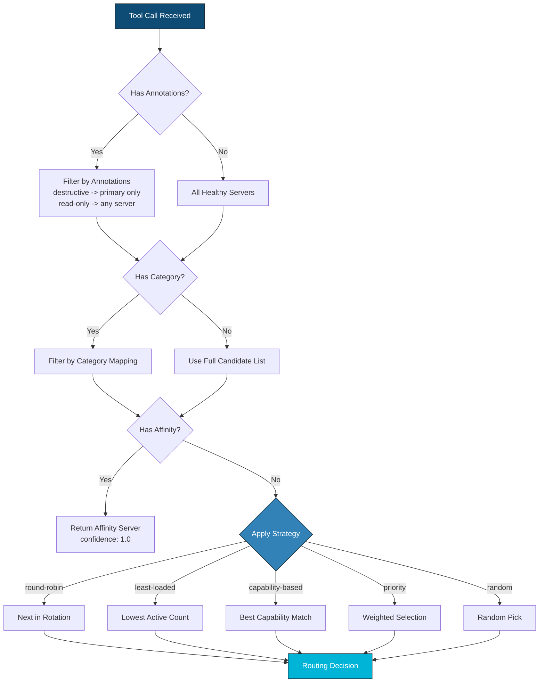
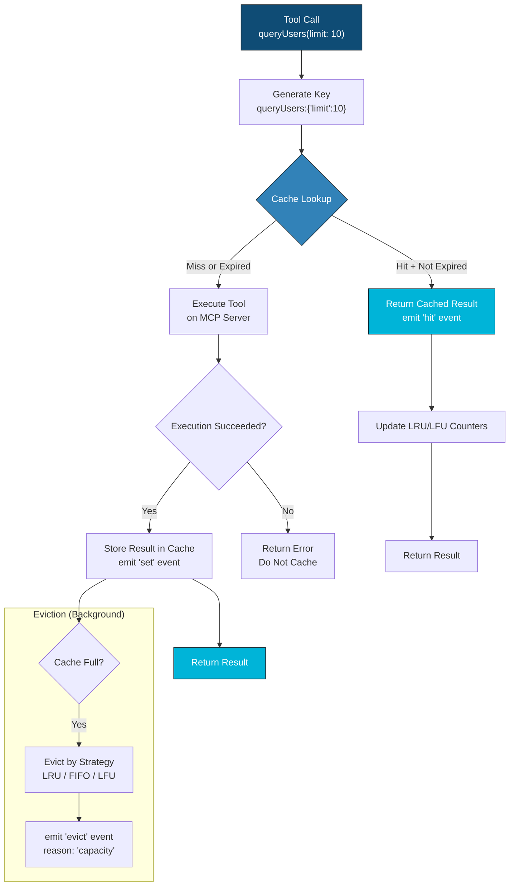
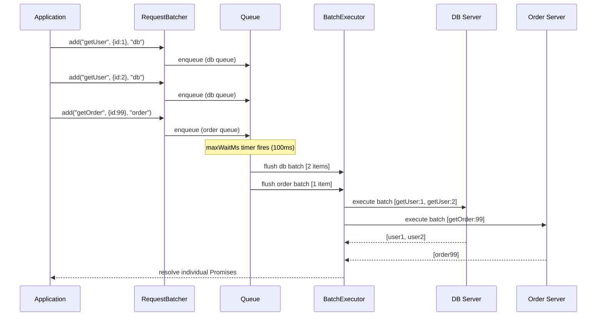
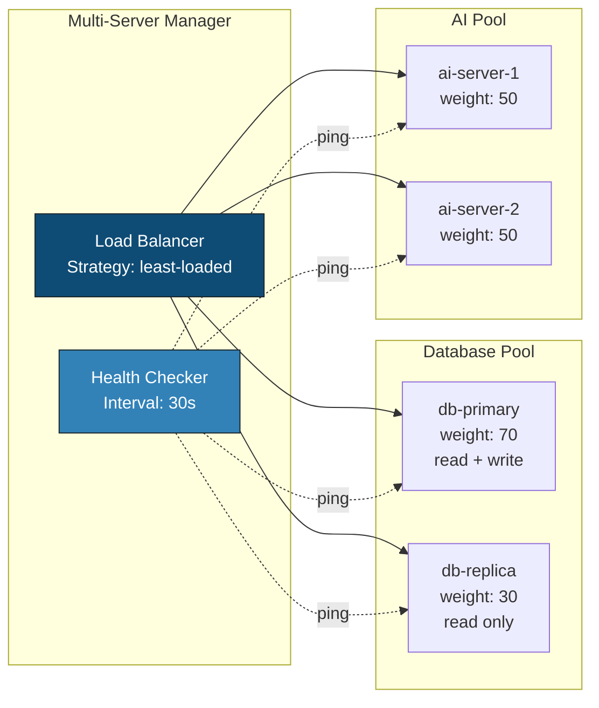

Raw MCP gives you a protocol. NeuroLink gives you a production platform. By the end of this tutorial, you will have configured intelligent tool routing across multiple servers, eliminated redundant tool calls with result caching, and reduced API roundtrips by batching requests -- all using composable modules that snap together like building blocks.

NeuroLink ships 14 MCP enhancement modules since v9.16.0. Each module solves one operational challenge. Together, they turn a standards-compliant MCP client into an enterprise-grade tool execution engine. This post teaches you how to use the three most impactful modules -- Tool Router, Tool Cache, and Request Batcher -- along with the annotation, integration, and multi-server layers that tie everything together.

## The Production Gap

MCP defines how AI models discover and invoke external tools. It does not define what happens between the model's tool call and the server that executes it. That gap is where production systems fail.

**No routing intelligence.** If you have two database servers -- a primary and a replica -- vanilla MCP has no way to send read-only queries to the replica while routing writes to the primary. Every call hits the same server.

**No result caching.** A model that calls `getUser(id: 123)` three times in one conversation makes three identical network roundtrips. The result does not change between calls, but MCP has no caching layer.

**No request batching.** When a model issues five `getUserById` calls in parallel, each one is an independent network request. There is no mechanism to group them into a single batch operation.

**No failure isolation.** When one MCP server goes down, there is no circuit breaker, no failover, and no way to route traffic to a healthy replica. The model waits for a timeout on every call.

NeuroLink's MCP enhancements fill every one of these gaps.

## The 14 Modules at a Glance

Here is the complete module inventory. Each module is independently usable -- you do not need all 14 to benefit from any one.

| Module | What It Does |
|---|---|
| **Tool Router** | Routes tool calls across servers with 6 strategies |
| **Tool Cache** | Caches results with LRU, FIFO, and LFU eviction |
| **Request Batcher** | Groups tool calls into batches for throughput |
| **Tool Annotations** | Infers safety metadata (read-only, destructive, idempotent) |
| **Tool Converter** | Converts between NeuroLink and MCP tool formats |
| **Tool Integration** | Middleware chain for confirmation, retry, timeout |
| **Enhanced Discovery** | Advanced search and filtering across servers |
| **Elicitation Protocol** | Interactive user input mid-execution (HITL) |
| **Multi-Server Manager** | Load balancing and failover across server groups |
| **MCP Server Base** | Abstract base class for custom MCP servers |
| **Agent Exposure** | Expose agents and workflows as MCP tools |
| **Server Capabilities** | Resource and prompt management per MCP spec |
| **MCP Registry Client** | Discover servers from registries and catalogs |
| **SDK Integration** | Declarative config wires enhancements into generate/stream |

The following diagram shows how these modules compose in the request path:



The flow is: **middleware chain** processes every tool call first (logging, confirmation, validation), then the **cache** checks for a stored result. On a miss, the **router** selects the best server, the **batcher** groups the request, and the **multi-server manager** handles the actual execution with failover.

## Tool Router Deep-Dive

The `ToolRouter` distributes tool calls across multiple MCP servers based on configurable strategies. It extends `EventEmitter` and tracks server health, load, and session affinity in real time.

### Setting Up the Router

```typescript
import { ToolRouter, type ToolRouterConfig } from '@juspay/neurolink';

const router = new ToolRouter({
  strategy: 'least-loaded',
  enableAffinity: true,
  categoryMapping: {
    database: ['db-primary', 'db-replica'],
    'file-system': ['fs-server'],
    ai: ['ai-server-1', 'ai-server-2'],
  },
  serverWeights: [
    { serverId: 'db-primary', weight: 80, capabilities: ['database', 'write'] },
    { serverId: 'db-replica', weight: 20, capabilities: ['database', 'read'] },
  ],
  fallbackStrategy: 'round-robin',
  maxRetries: 3,
  healthCheckInterval: 30000,
  affinityTtl: 30 * 60 * 1000,
});

// Register servers with their capabilities
router.registerServer('db-primary', ['database', 'write']);
router.registerServer('db-replica', ['database', 'read']);
router.registerServer('fs-server', ['file-system']);
```

### Strategy 1: Round-Robin

The simplest strategy. Distributes calls evenly across all healthy servers in rotation. Confidence: 0.8.

```typescript
const router = new ToolRouter({ strategy: 'round-robin' });

router.registerServer('server-a', ['general']);
router.registerServer('server-b', ['general']);
router.registerServer('server-c', ['general']);

// Calls rotate: server-a -> server-b -> server-c -> server-a -> ...
const decision1 = router.route({ name: 'fetchData', category: 'general' });
const decision2 = router.route({ name: 'fetchData', category: 'general' });
const decision3 = router.route({ name: 'fetchData', category: 'general' });
```

Use round-robin when all servers are equivalent and you want uniform distribution. It does not account for server load or capability differences.

### Strategy 2: Least-Loaded

Routes to the server with the fewest active connections. Confidence: 0.9. This is the default strategy.

```typescript
const router = new ToolRouter({ strategy: 'least-loaded' });

router.registerServer('db-1', ['database']);
router.registerServer('db-2', ['database']);

// Track load manually: increment on start, decrement on end
router.updateServerLoad('db-1', +1); // db-1 now has 1 active
router.updateServerLoad('db-1', +1); // db-1 now has 2 active

const decision = router.route({ name: 'queryUsers', category: 'database' });
// decision.serverId === 'db-2' (0 active connections)

// After request completes, release the load
router.updateServerLoad('db-2', -1);
```

Use least-loaded when servers have different processing speeds or when some requests are long-running.

### Strategy 3: Capability-Based

Scores servers by how well their declared capabilities match the tool's requirements. Confidence varies based on match quality.

```typescript
const router = new ToolRouter({ strategy: 'capability-based' });

router.registerServer('db-primary', ['database', 'write', 'transactions']);
router.registerServer('db-replica', ['database', 'read']);
router.registerServer('search-server', ['search', 'full-text']);

// Route a write operation -- only db-primary has 'write' capability
const candidates = router.routeByCapability(
  { name: 'updateUser' },
  ['database', 'write'],
);
// candidates includes only db-primary

// Route a read -- both database servers qualify
const readCandidates = router.routeByCapability(
  { name: 'queryUsers' },
  ['database', 'read'],
);
// readCandidates includes db-primary and db-replica
```

Use capability-based routing when different servers expose different tool sets or when you need to enforce read/write separation.

### Strategy 4: Affinity (Session Sticky)

Maintains session or user consistency by routing all requests from the same session to the same server. Confidence: 1.0 (when affinity exists).

```typescript
const router = new ToolRouter({
  strategy: 'affinity',
  enableAffinity: true,
  affinityTtl: 30 * 60 * 1000, // 30-minute TTL
});

router.registerServer('session-server-1', ['stateful']);
router.registerServer('session-server-2', ['stateful']);

// First call establishes affinity
const decision1 = router.route(
  { name: 'getSession', category: 'stateful' },
  { sessionId: 'user-abc-session' },
);
// decision1.serverId might be 'session-server-1'

// Subsequent calls with the same sessionId go to the same server
const decision2 = router.route(
  { name: 'updateSession', category: 'stateful' },
  { sessionId: 'user-abc-session' },
);
// decision2.serverId === 'session-server-1' (affinity preserved)

// Manual affinity management
router.setAffinity('user-xyz', 'session-server-2');
router.clearAffinity('user-abc-session');
```

Use affinity when MCP servers maintain in-memory state (conversation history, database transactions, file handles) that must remain consistent across a session.

### Strategy 5: Priority (Weighted)

Routes by server weight -- higher weight means more traffic. Confidence varies with weight ratio.

```typescript
const router = new ToolRouter({
  strategy: 'priority',
  serverWeights: [
    { serverId: 'primary', weight: 80, capabilities: ['database'] },
    { serverId: 'secondary', weight: 20, capabilities: ['database'] },
  ],
});

router.registerServer('primary', ['database']);
router.registerServer('secondary', ['database']);

// ~80% of calls go to primary, ~20% to secondary
for (let i = 0; i < 100; i++) {
  const d = router.route({ name: 'query', category: 'database' });
  // d.serverId distribution roughly matches weights
}
```

Use priority routing for canary deployments, gradual rollouts, or when servers have different hardware capacities.

### Strategy 6: Random

Random selection for simple load distribution. Confidence: 0.5.

```typescript
const router = new ToolRouter({ strategy: 'random' });

router.registerServer('worker-1', ['compute']);
router.registerServer('worker-2', ['compute']);
router.registerServer('worker-3', ['compute']);

// Each call randomly selects a server
const decision = router.route({ name: 'processData', category: 'compute' });
```

Use random routing when you need the simplest possible distribution and do not care about load awareness or session consistency.

### Annotation-Based Routing

The router automatically considers tool annotations when selecting servers. This is orthogonal to the strategy -- it narrows the candidate list before the strategy selects:

```typescript
// Destructive tools are routed only to high-weight primary servers
const candidates = router.routeByAnnotation({
  name: 'deleteUser',
  annotations: { destructiveHint: true },
});
// Returns only servers with weight >= 50

// Read-only tools can go to any healthy server
const readCandidates = router.routeByAnnotation({
  name: 'listUsers',
  annotations: { readOnlyHint: true },
});
// Returns all healthy servers
```

Here is the routing decision flow:



### Router Events

The router emits typed events for observability:

```typescript
router.on('routeDecision', ({ toolName, decision }) => {
  console.log(`${toolName} -> ${decision.serverId} (${decision.strategy})`);
});

router.on('healthUpdate', ({ serverId, healthy }) => {
  console.log(`Server ${serverId} is now ${healthy ? 'healthy' : 'unhealthy'}`);
});

router.on('routeFailed', ({ toolName, error, attemptedServers }) => {
  console.error(`Routing failed for ${toolName}: ${error.message}`);
  console.error(`Attempted servers: ${attemptedServers.join(', ')}`);
});
```

## Result Caching

The `ToolCache` eliminates redundant tool calls by storing results with configurable TTL and eviction strategies. When a model calls the same tool with the same arguments multiple times in a conversation, only the first call actually executes -- the rest return cached results in microseconds.

### Cache Strategies

| Strategy | Eviction Rule | Best For |
|---|---|---|
| `lru` | Evicts least recently accessed | General use, temporal locality |
| `fifo` | Evicts oldest entries first | Streaming data, time-sensitive results |
| `lfu` | Evicts least frequently used | Stable workloads, popular items |

### Configuration and Usage

```typescript
import { ToolCache, type CacheConfig } from '@juspay/neurolink';

const cache = new ToolCache<unknown>({
  ttl: 5 * 60 * 1000,       // 5-minute default TTL
  maxSize: 1000,             // Maximum entries before eviction
  strategy: 'lru',           // Eviction strategy
  enableAutoCleanup: true,   // Periodic cleanup of expired entries
  cleanupInterval: 60000,    // Cleanup every 60 seconds
  namespace: 'my-app',       // Optional namespace prefix
});

// Basic set/get
cache.set('getUserById:123', { id: 123, name: 'Alice' });
const user = cache.get('getUserById:123'); // => { id: 123, name: 'Alice' }

// Cache-aside pattern (recommended)
const result = await cache.getOrSet(
  'getUserById:456',
  async () => {
    return await fetchUser(456); // Only called on cache miss
  },
  30000, // Optional: custom TTL for this entry
);
```

The `getOrSet` method is the recommended pattern. It atomically checks the cache and executes the function only on a miss. This eliminates race conditions where two concurrent calls both miss the cache and execute the same operation.

### Key Generation

Use `ToolCache.generateKey()` to create deterministic cache keys from tool name and arguments:

```typescript
// Deterministic key from tool name + arguments
const key = ToolCache.generateKey('queryDatabase', {
  table: 'users',
  limit: 10,
});
// => "queryDatabase:{"limit":10,"table":"users"}"
// Arguments are sorted by key for consistency

// Use in the cache-aside pattern
const result = await cache.getOrSet(
  ToolCache.generateKey('queryDatabase', { table: 'users', limit: 10 }),
  async () => executeQuery('users', 10),
);
```

### Pattern-Based Invalidation

When a mutation occurs, invalidate related cache entries using glob patterns:

```typescript
// Invalidate all user cache entries after a user update
cache.invalidate('getUserById:*');

// Invalidate entries for a specific table
cache.invalidate('queryDatabase:*users*');

// Invalidate everything
cache.clear();
```

### ToolResultCache

For convenience, `ToolResultCache` wraps `ToolCache` with automatic key generation:

```typescript
import { ToolResultCache } from '@juspay/neurolink';

const resultCache = new ToolResultCache({
  ttl: 120000,
  strategy: 'lfu',
});

// Cache tool results directly -- no manual key generation
resultCache.cacheResult('getUserById', { id: 123 }, { name: 'Alice' });
const cached = resultCache.getCachedResult('getUserById', { id: 123 });

// Invalidate all results for a specific tool
resultCache.invalidateTool('getUserById');
```

### Cache Events and Statistics

Monitor cache performance in real time:

```typescript
// Listen for cache events
cache.on('hit', ({ key }) => metrics.increment('cache.hit'));
cache.on('miss', ({ key }) => metrics.increment('cache.miss'));
cache.on('evict', ({ key, reason }) => {
  metrics.increment(`cache.evict.${reason}`);
});

// Get performance statistics
const stats = cache.getStats();
console.log(`Hit rate: ${(stats.hitRate * 100).toFixed(1)}%`);
console.log(`Size: ${stats.size}/${stats.maxSize}`);
console.log(`Evictions: ${stats.evictions}`);
// => Hit rate: 84.0%
// => Size: 47/1000
// => Evictions: 3
```

The following diagram shows the caching flow:



## Request Batching

The `RequestBatcher` groups tool calls that arrive within a time window and executes them together. Instead of five individual network requests, you get one batch operation -- reducing connection overhead and enabling server-side optimizations like batch SQL queries.

### Configuration

```typescript
import { RequestBatcher, type BatchConfig } from '@juspay/neurolink';

const batcher = new RequestBatcher<ToolResult>({
  maxBatchSize: 10,         // Flush when 10 requests queue up
  maxWaitMs: 100,           // Or after 100ms, whichever comes first
  enableParallel: true,     // Execute batch items in parallel
  maxConcurrentBatches: 5,  // Maximum batches in flight
  groupByServer: true,      // Group requests by server ID
});
```

Two triggers flush the batch: **size** (reaching `maxBatchSize`) and **timeout** (reaching `maxWaitMs`). Whichever fires first wins. The `groupByServer` option creates separate queues per server, so requests for different servers are batched independently.

### Setting Up the Executor

The executor receives an array of requests and returns an array of results in the same order:

```typescript
batcher.setExecutor(async (requests) => {
  return Promise.all(
    requests.map(async (r) => {
      try {
        const result = await executeToolCall(r.tool, r.args, r.serverId);
        return { success: true as const, result };
      } catch (error) {
        return { success: false as const, error };
      }
    }),
  );
});
```

### Adding Requests

Requests are added individually but executed in batches. Each `add()` returns a Promise that resolves when its batch completes:

```typescript
// These three calls are batched into a single execution
const [result1, result2, result3] = await Promise.all([
  batcher.add('getUserById', { id: 1 }, 'db-server'),
  batcher.add('getUserById', { id: 2 }, 'db-server'),
  batcher.add('getOrder', { orderId: 99 }, 'order-server'),
]);

// With groupByServer: true, the first two go in one batch (same server)
// and the third goes in a separate batch (different server)
```

### ToolCallBatcher

For MCP-specific batching, `ToolCallBatcher` provides a higher-level wrapper:

```typescript
import { ToolCallBatcher } from '@juspay/neurolink';

const toolBatcher = new ToolCallBatcher({
  maxBatchSize: 5,
  maxWaitMs: 50,
});

toolBatcher.setToolExecutor(async (tool, args, serverId) => {
  return await mcpClient.callTool(tool, args);
});

// Execute individual tool calls -- batched automatically
const result = await toolBatcher.execute('readFile', { path: '/data.json' });
```

### Batching Pipeline



### Batcher Events

```typescript
batcher.on('batchStarted', ({ batchId, size }) => {
  console.log(`Batch ${batchId} started with ${size} requests`);
});

batcher.on('batchCompleted', ({ batchId, results }) => {
  const successes = results.filter((r) => r.success).length;
  console.log(`Batch ${batchId}: ${successes}/${results.length} succeeded`);
});

batcher.on('flushTriggered', ({ reason, queueSize }) => {
  console.log(`Flush triggered by ${reason}, queue size: ${queueSize}`);
});
```

### Lifecycle Management

```typescript
// Manual flush -- force-execute all queued requests now
await batcher.flush();

// Drain -- flush and wait for all active batches to complete (30s timeout)
await batcher.drain();

// Check status
console.log(`Pending: ${batcher.queueSize}`);
console.log(`Active batches: ${batcher.activeBatchCount}`);
console.log(`Idle: ${batcher.isIdle}`);

// Clean up -- rejects all pending requests and stops timers
batcher.destroy();
```

## Tool Annotations

Annotations are safety metadata that travel with every tool. They tell the router, cache, and middleware how to handle the tool without requiring manual configuration per tool.

### Automatic Inference

The `inferAnnotations` function analyzes tool names and descriptions to assign hints:

```typescript
import {
  createAnnotatedTool,
  inferAnnotations,
  getToolSafetyLevel,
  requiresConfirmation,
  isSafeToRetry,
} from '@juspay/neurolink';

// Annotations are inferred from the name and description
const readTool = createAnnotatedTool({
  name: 'getUserById',
  description: 'Fetch user details from the database',
  inputSchema: {
    type: 'object',
    properties: { id: { type: 'string' } },
  },
  execute: async (params) => ({ name: 'Alice' }),
});
// Inferred: { readOnlyHint: true, idempotentHint: true, complexity: "simple" }

const deleteTool = createAnnotatedTool({
  name: 'deleteUser',
  description: 'Permanently delete a user account',
  inputSchema: {
    type: 'object',
    properties: { userId: { type: 'string' } },
  },
  execute: async (params) => ({ deleted: true }),
});
// Inferred: { destructiveHint: true, requiresConfirmation: true, complexity: "simple" }

// Query safety
getToolSafetyLevel(readTool);           // => "safe"
getToolSafetyLevel(deleteTool);         // => "dangerous"
requiresConfirmation(deleteTool);       // => true
isSafeToRetry(readTool);               // => true
isSafeToRetry(deleteTool);             // => false
```

### Inference Heuristics

| Pattern in Name/Description | Inferred Annotation |
|---|---|
| `get`, `list`, `read`, `fetch`, `query`, `search`, `find` | `readOnlyHint: true` |
| `delete`, `remove`, `drop`, `destroy`, `clear`, `purge` | `destructiveHint: true` |
| `set`, `update`, `put`, `upsert`, `replace` | `idempotentHint: true` |
| `analyze`, `process`, `generate` | `complexity: "complex"` |

### Annotation Fields

| Field | Type | Effect on Pipeline |
|---|---|---|
| `readOnlyHint` | `boolean` | Cached by default; routed to any server |
| `destructiveHint` | `boolean` | Requires confirmation; routed to primary only |
| `idempotentHint` | `boolean` | Safe to retry on failure; prefer caching servers |
| `requiresConfirmation` | `boolean` | Triggers confirmation middleware |
| `estimatedDuration` | `number` | Timeout middleware uses this for limits |
| `costHint` | `number` | Cost-aware routing considers this |
| `securityLevel` | `string` | `"public"`, `"internal"`, or `"restricted"` |

### Validation and Merging

```typescript
import { validateAnnotations, mergeAnnotations } from '@juspay/neurolink';

// Detect conflicting annotations
const errors = validateAnnotations({
  readOnlyHint: true,
  destructiveHint: true, // Conflict!
});
// => ["Tool cannot be both readOnly and destructive - these are conflicting hints"]

// Merge annotation sets (arrays like tags are merged, not overwritten)
const merged = mergeAnnotations(
  { readOnlyHint: true, tags: ['data'] },
  { idempotentHint: true, tags: ['safe'] },
);
// => { readOnlyHint: true, idempotentHint: true, tags: ["data", "safe"] }
```

## Multi-Server Management

The `MultiServerManager` coordinates multiple MCP servers with load balancing, failover, and unified tool discovery. It sits below the router and handles the actual server selection.

### Server Groups

Group related servers for coordinated load balancing:

```typescript
import { MultiServerManager } from '@juspay/neurolink';

const manager = new MultiServerManager({
  defaultStrategy: 'least-loaded',
  healthAwareRouting: true,
  healthCheckInterval: 30000,
  maxFailoverRetries: 3,
  autoNamespace: true,
  namespaceSeparator: '.',
  conflictResolution: 'first-wins',
});

// Add servers
manager.addServer({
  id: 'db-primary',
  name: 'DB Primary',
  status: 'connected',
  tools: [
    { name: 'queryUsers', description: 'Query users table' },
    { name: 'updateUser', description: 'Update user record' },
  ],
});

manager.addServer({
  id: 'db-replica',
  name: 'DB Replica',
  status: 'connected',
  tools: [
    { name: 'queryUsers', description: 'Query users table' },
  ],
});

// Create a server group with weighted load balancing
manager.createGroup({
  id: 'database-pool',
  name: 'Database Servers',
  servers: ['db-primary', 'db-replica'],
  strategy: 'least-loaded',
  healthAware: true,
  weights: [
    { serverId: 'db-primary', weight: 70, priority: 0 },
    { serverId: 'db-replica', weight: 30, priority: 1 },
  ],
});

// Select a server for a tool call
const selection = manager.selectServer('queryUsers', 'database-pool');
console.log(`Routing to: ${selection?.serverId}`);
```

### Unified Tool Discovery

When tools exist on multiple servers, the manager provides a unified view:

```typescript
// Get unified tool list across all servers
const tools = manager.getUnifiedTools();
for (const tool of tools) {
  console.log(`${tool.name} -- available on ${tool.servers.length} server(s)`);
  if (tool.hasConflict) {
    console.log('  WARNING: Tool name conflict across servers');
  }
}

// Get namespaced tools (server.toolName format)
const nsTools = manager.getNamespacedTools();
// => [{ fullName: "db-primary.queryUsers", toolName: "queryUsers", ... }]
```

### Request Metrics

Track per-server performance for informed routing decisions:

```typescript
// Track request lifecycle
manager.requestStarted('db-primary');
// ... execute request ...
manager.requestCompleted('db-primary', 150, true); // 150ms, success

// Query metrics
const metrics = manager.getServerMetrics('db-primary');
// => { totalRequests: 42, successRate: 0.98, avgDuration: 130, ... }
```

The multi-server topology:



## Putting It All Together

Here is a complete example that composes routing, caching, batching, annotations, and middleware into a single pipeline. This is what a production NeuroLink deployment looks like.

### Declarative Configuration

The simplest approach -- configure everything through the `NeuroLink` constructor and let the SDK wire it together:

```typescript
import {
  NeuroLink,
  loggingMiddleware,
  confirmationMiddleware,
  createTimeoutMiddleware,
  createRetryMiddleware,
} from '@juspay/neurolink';

const neurolink = new NeuroLink({
  provider: 'anthropic',
  model: 'claude-sonnet-4-20250514',
  mcp: {
    cache: {
      enabled: true,
      ttl: 60000,
      maxSize: 200,
      strategy: 'lru',
    },
    annotations: {
      enabled: true,
      autoInfer: true,
    },
    router: {
      enabled: true,
      strategy: 'least-loaded',
      enableAffinity: false,
    },
    batcher: {
      enabled: true,
      maxBatchSize: 10,
      maxWaitMs: 100,
    },
    discovery: {
      enabled: true,
    },
    middleware: [
      loggingMiddleware,
      confirmationMiddleware,
      createTimeoutMiddleware(30000),
      createRetryMiddleware(3, 1000),
    ],
  },
});

// Every generate() and stream() call now goes through the full pipeline:
// middleware -> cache -> router -> batcher -> server
const result = await neurolink.generate({
  input: { text: 'Look up user 123 and their recent orders' },
});

// Bypass cache for a specific request when you need fresh data
const freshResult = await neurolink.generate({
  input: { text: 'What is the current server status?' },
  disableToolCache: true,
});
```

### Manual Composition

When you need full control, compose the modules yourself:

```typescript
import {
  ToolRouter,
  ToolCache,
  RequestBatcher,
  ToolIntegrationManager,
  MCPServerBase,
  createAnnotatedTool,
  loggingMiddleware,
  confirmationMiddleware,
  createTimeoutMiddleware,
  createRetryMiddleware,
  requiresConfirmation,
  isSafeToRetry,
} from '@juspay/neurolink';

// 1. Build a custom MCP server with annotated tools
class InventoryServer extends MCPServerBase {
  constructor() {
    super({
      id: 'inventory',
      name: 'Inventory Server',
      description: 'Product inventory management tools',
      version: '1.0.0',
      category: 'database',
    });

    this.registerTool(createAnnotatedTool({
      name: 'getProduct',
      description: 'Get product details by SKU',
      inputSchema: {
        type: 'object',
        properties: { sku: { type: 'string' } },
        required: ['sku'],
      },
      execute: async (params) => {
        const { sku } = params as { sku: string };
        return { sku, name: 'Widget', stock: 42, price: 9.99 };
      },
    }));

    this.registerTool(createAnnotatedTool({
      name: 'deleteProduct',
      description: 'Permanently delete a product from inventory',
      inputSchema: {
        type: 'object',
        properties: { sku: { type: 'string' } },
        required: ['sku'],
      },
      execute: async (params) => {
        const { sku } = params as { sku: string };
        return { deleted: true, sku };
      },
    }));
  }
}

async function main() {
  const server = new InventoryServer();
  await server.init();
  await server.start();

  // 2. Set up caching
  const cache = new ToolCache({
    ttl: 5 * 60 * 1000,
    maxSize: 200,
    strategy: 'lru',
  });

  // 3. Set up routing
  const router = new ToolRouter({
    strategy: 'least-loaded',
    enableAffinity: true,
    categoryMapping: { database: ['inventory'] },
  });
  router.registerServer('inventory', ['database']);

  // 4. Set up middleware pipeline
  const integration = new ToolIntegrationManager();
  integration.setElicitationHandler(async (request) => {
    if (request.type === 'confirmation') {
      console.log(`[Confirmation] ${request.message} -> approved`);
      return {
        requestId: request.id,
        responded: true,
        value: true,
        timestamp: Date.now(),
      };
    }
    return { requestId: request.id, responded: false, timestamp: Date.now() };
  });

  integration
    .use(loggingMiddleware)
    .use(confirmationMiddleware)
    .use(createTimeoutMiddleware(30000))
    .use(createRetryMiddleware(3, 1000));

  for (const tool of server.getTools()) {
    integration.registerTool(tool);
  }

  // 5. Execute through the pipeline
  const getProduct = server.getTools().find((t) => t.name === 'getProduct')!;
  console.log('Safe to retry:', isSafeToRetry(getProduct));         // true
  console.log('Requires confirmation:', requiresConfirmation(getProduct)); // false

  // Route the call
  const decision = router.route({ name: 'getProduct', category: 'database' });
  console.log(`Routed to: ${decision.serverId}`);

  // Execute with caching
  const productResult = await cache.getOrSet(
    ToolCache.generateKey('getProduct', { sku: 'W-100' }),
    () => integration.executeTool('getProduct', { sku: 'W-100' }),
  );
  console.log('Product:', productResult);

  // Second call hits cache
  const fromCache = cache.get(
    ToolCache.generateKey('getProduct', { sku: 'W-100' }),
  );
  console.log('Cache hit:', fromCache !== undefined); // true

  // Destructive call skips cache, triggers confirmation middleware
  const deleteResult = await integration.executeTool('deleteProduct', {
    sku: 'W-100',
  });
  console.log('Delete result:', deleteResult);

  // Invalidate stale cache entries
  cache.invalidate('getProduct:*');

  // 6. Clean up
  cache.destroy();
  router.destroy();
  await server.stop();
}

main().catch(console.error);
```

### What This Demonstrates

The manual example above exercises five modules in a single pipeline:

1. **MCPServerBase** provides structured tool registration with lifecycle hooks
2. **Tool Annotations** are inferred automatically -- `getProduct` is read-only, `deleteProduct` is destructive
3. **ToolRouter** selects the best server based on strategy and annotations
4. **ToolCache** stores read-only results and invalidates after mutations
5. **ToolIntegrationManager** chains middleware so destructive tools trigger confirmation while read-only tools are auto-retried

## Performance Impact

The enhancement modules add minimal overhead while delivering significant savings on redundant operations.

### Per-Module Overhead

| Module | Overhead per Call | What It Saves |
|---|---|---|
| Tool Router | < 0.1ms | Network roundtrip to wrong server |
| Tool Cache (hit) | < 0.05ms | Full tool execution (50-500ms) |
| Tool Cache (miss) | ~0.2ms | Nothing on miss; stores for next call |
| Request Batcher | ~1ms (flush wait) | N-1 connection handshakes per batch |
| Tool Annotations | < 0.1ms (inference) | Manual per-tool configuration |
| Middleware Chain | ~0.5ms (full chain) | Unprotected destructive operations |

### Cache Hit Rates

In production at Juspay, with a 5-minute TTL and LRU eviction:

- **Conversational workloads:** 60-80% hit rate (models frequently re-query the same data)
- **Batch processing:** 30-50% hit rate (more unique queries)
- **Agent loops:** 70-90% hit rate (agents verify state repeatedly)

### Batching Throughput

With `maxBatchSize: 10` and `maxWaitMs: 100`:

- **5 concurrent getUserById calls:** 1 batch instead of 5 requests (80% fewer roundtrips)
- **Mixed server calls:** Automatically grouped by server (no cross-server batching)
- **Latency trade-off:** Adds up to `maxWaitMs` latency for the first request in each batch window

## Next Steps

The three modules covered here -- routing, caching, and batching -- are the foundation. The remaining 11 modules extend the platform further:

- **Elicitation Protocol** enables interactive HITL workflows where tools pause for user input
- **MCP Server Base** lets you build custom servers with the same patterns NeuroLink uses internally
- **Agent Exposure** wraps your agents and workflows as standard MCP tools that any client can discover
- **MCP Registry Client** connects to server registries for automatic discovery

Every module follows the same pattern: import, configure, compose. Start with the module that addresses your most pressing production gap, then layer additional modules as your requirements grow.

---

**Related posts:**

- [MCP Tools: Extending AI with External Capabilities](/posts/mcp-tools-integration/)
- [How We Built MCP Integration: Supporting 4 Transport Protocols](/posts/how-we-built-mcp-integration/)
- [Claude Proxy: Multi-Account OAuth Pooling at Enterprise Scale](/posts/claude-proxy-multi-account-oauth/)
