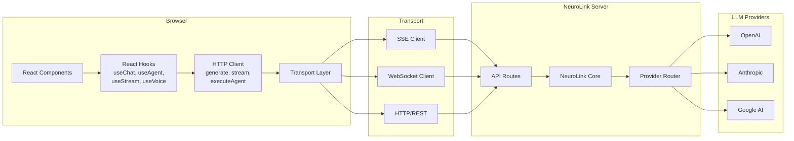
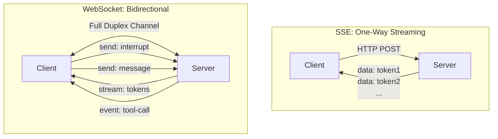
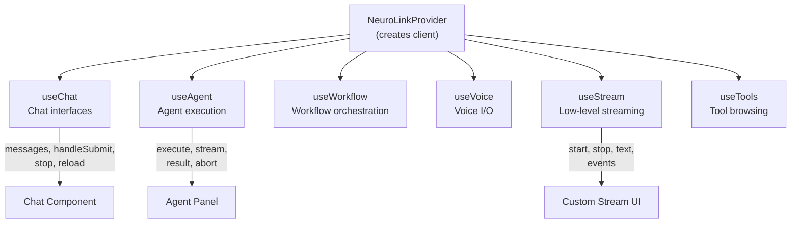
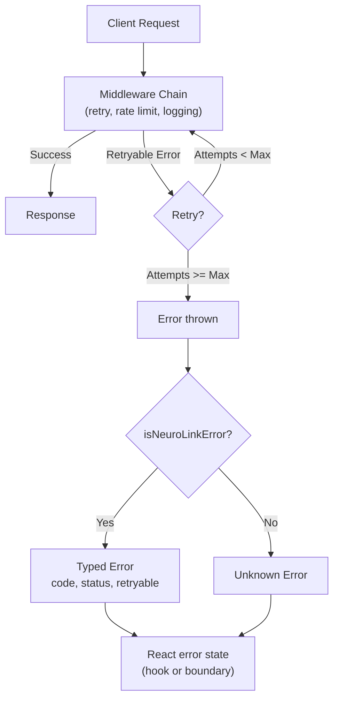

You have NeuroLink running on the server. Models respond, tokens stream, tools execute. But the gap between your backend and your users' browser is still filled with boilerplate -- manual fetch calls, hand-rolled SSE parsers, state management glue. NeuroLink v9.30 closes that gap with first-class client SDKs: a type-safe HTTP client, React hooks for streaming AI into component state, SSE and WebSocket transports, and a drop-in Vercel AI SDK adapter. All from one package: `@juspay/neurolink/client`.

This tutorial walks through every layer of the Client SDK. By the end, you will have a working chat UI that streams AI responses token by token, handles errors gracefully, and can swap between SSE and WebSocket transports without changing your React components.

---

## The Client-Server Gap

Server-side AI SDKs solve the hard problems -- provider abstraction, failover, tool calling. But they leave frontend developers to solve a different set of problems on their own.

Building a streaming AI UI from scratch means:

- Parsing SSE event streams manually with `EventSource` or `fetch` + `ReadableStream`
- Managing loading, error, and streaming states across React components
- Handling reconnection when connections drop
- Serializing and deserializing typed messages
- Wiring up abort controllers for cancellation
- Keeping chat history in sync with streaming updates

Every team rebuilds this glue code. The NeuroLink Client SDK provides it out of the box, tested and typed.

```typescript
// Before: manual SSE parsing in every component
const response = await fetch("/api/stream", { method: "POST", body: JSON.stringify({ prompt }) });
const reader = response.body?.getReader();
const decoder = new TextDecoder();
while (true) {
  const { done, value } = await reader!.read();
  if (done) break;
  const text = decoder.decode(value);
  // Parse SSE events manually, handle errors, update state...
}

// After: one hook
const { messages, handleSubmit, isLoading } = useChat({ agentId: "my-agent" });
```

---

## Architecture Overview

The Client SDK sits between your React components and the NeuroLink server. It handles transport selection, authentication, streaming, and state management.



Every layer is independently usable. You can use the HTTP client without React, the SSE client without the HTTP client, or the React hooks without thinking about transports at all.

---

## HTTP Client

The HTTP client is the foundation. It provides type-safe methods for every NeuroLink API endpoint, with built-in retry logic, middleware, and request cancellation.

### Creating a Client

```typescript
import { createClient } from "@juspay/neurolink/client";

const client = createClient({
  baseUrl: "https://api.neurolink.example.com",
  apiKey: process.env.NEUROLINK_API_KEY,
  timeout: 30000,
  retry: {
    maxAttempts: 3,
    initialDelayMs: 1000,
    backoffMultiplier: 2,
    retryableStatusCodes: [408, 429, 500, 502, 503, 504],
  },
});
```

The `ClientConfig` accepts these fields:

| Field     | Type                     | Default | Description                              |
|-----------|--------------------------|---------|------------------------------------------|
| `baseUrl` | `string`                 | --      | Base URL for the NeuroLink API           |
| `apiKey`  | `string`                 | --      | API key sent in `X-API-Key` header       |
| `token`   | `string`                 | --      | Bearer token for `Authorization` header  |
| `timeout` | `number`                 | 30000   | Default request timeout in ms            |
| `headers` | `Record<string, string>` | `{}`    | Default headers for every request        |
| `retry`   | `RetryConfig`            | --      | Retry configuration for failed requests  |
| `debug`   | `boolean`                | `false` | Enable debug logging                     |
| `fetch`   | `typeof fetch`           | --      | Custom fetch for non-browser environments|
| `wsUrl`   | `string`                 | --      | WebSocket URL override                   |

### Making Requests

The client exposes typed methods for each API surface:

```typescript
// Text generation (non-streaming)
const result = await client.generate({
  input: { text: "Explain TCP in two sentences" },
  provider: "openai",
  model: "gpt-4o",
  temperature: 0.7,
});
console.log(result.data.content);

// Agent execution
const agent = await client.executeAgent({
  agentId: "customer-support",
  input: "I need help with my order",
  sessionId: "user-123",
});

// List available tools, providers, and agents
const tools = await client.listTools({ category: "data" });
const providers = await client.listProviders();
const agents = await client.listAgents();
```

Every response is wrapped in `ApiResponse<T>`:

```typescript
interface ApiResponse<T> {
  data: T;            // Response payload
  status: number;     // HTTP status code
  headers: Record<string, string>;
  duration: number;   // Request duration in ms
  requestId: string;  // Unique ID for tracing
}
```

### Middleware

Add middleware with `client.use()`. Middleware functions receive the request and a `next()` callback, forming a chain:

```typescript
// Logging middleware
client.use(async (request, next) => {
  const start = Date.now();
  console.log(`[${request.method}] ${request.url}`);
  const response = await next();
  console.log(`[${response.status}] ${Date.now() - start}ms`);
  return response;
});

// Compose multiple middleware into a single unit
import {
  composeMiddleware,
  createLoggingInterceptor,
  createRetryInterceptor,
  createRateLimitInterceptor,
} from "@juspay/neurolink/client";

client.use(
  composeMiddleware(
    createLoggingInterceptor({ logRequest: true, logResponse: true }),
    createRetryInterceptor({
      maxAttempts: 3,
      initialDelayMs: 1000,
      backoffMultiplier: 2,
    }),
    createRateLimitInterceptor({
      maxRequests: 100,
      windowMs: 60000,
      strategy: "queue",
    }),
  ),
);
```

The SDK ships these built-in interceptors:

| Interceptor                          | Purpose                                 |
|--------------------------------------|-----------------------------------------|
| `createLoggingInterceptor`           | Request/response logging with redaction |
| `createRetryInterceptor`             | Exponential backoff retry               |
| `createRateLimitInterceptor`         | Token-bucket rate limiting              |
| `createCacheInterceptor`             | In-memory response caching              |
| `createTimeoutInterceptor`           | Per-request timeout enforcement         |
| `createErrorHandlerInterceptor`      | Centralized error handling/reporting    |
| `createRequestTransformInterceptor`  | Modify requests before sending          |
| `createResponseTransformInterceptor` | Modify responses before returning       |

---

## Callback-Based Streaming

The simplest streaming approach uses `client.stream()` with callbacks. No separate transport setup required:

```typescript
await client.stream(
  {
    input: { text: "Explain quantum computing" },
    provider: "openai",
    model: "gpt-4o",
  },
  {
    onText: (text) => process.stdout.write(text),
    onToolCall: (toolCall) => console.log("Tool:", toolCall.name),
    onToolResult: (result) => console.log("Result:", result),
    onError: (error) => console.error("Error:", error.message),
    onDone: (result) => console.log("\nTokens:", result.usage),
    onMetadata: (meta) => console.log("Provider:", meta.provider),
  },
);
```

Available callbacks: `onText`, `onToolCall`, `onToolResult`, `onError`, `onDone`, `onMetadata`, `onAudio`, `onThinking`. You only implement the ones you need.

---

## SSE Client

For long-lived streaming connections with automatic reconnection, use the dedicated SSE client. SSE is the right default for AI text streaming -- it uses standard HTTP, reconnects automatically, and works through most proxies.

```typescript
import { createSSEClient } from "@juspay/neurolink/client";

const sse = createSSEClient({
  baseUrl: "https://api.neurolink.example.com",
  apiKey: process.env.NEUROLINK_API_KEY,
  autoReconnect: true,
  maxReconnectAttempts: 5,
  reconnectDelay: 1000,
  maxReconnectDelay: 30000,
});

// Connect with typed event handlers
sse.connect("/api/agent/stream", {
  onOpen: () => console.log("SSE connected"),
  onEvent: (event) => {
    switch (event.type) {
      case "text":
        process.stdout.write(event.content ?? "");
        break;
      case "tool-call":
        console.log("Tool invoked:", event.toolCall);
        break;
      case "done":
        console.log("Stream complete:", event.result);
        break;
    }
  },
  onClose: () => console.log("SSE disconnected"),
  onReconnect: (attempt) => console.log(`Reconnecting (attempt ${attempt})`),
  onStateChange: (state) => console.log("State:", state),
});

// Disconnect when done
sse.disconnect();
```

The SSE client manages connection state (`connecting`, `connected`, `disconnected`, `error`) and handles reconnection with exponential backoff automatically.

### When to Use SSE

SSE is ideal when:

- The server generates content and the client displays it (one-way flow)
- You want automatic reconnection without writing reconnection logic
- You need to work through HTTP proxies and load balancers
- You are building a standard chat or completion UI

---

## WebSocket Client

When you need bidirectional communication -- interrupting a generation mid-stream, sending typing indicators, or implementing voice chat -- use the WebSocket client.

```typescript
import { createWebSocketClient } from "@juspay/neurolink/client";

const ws = createWebSocketClient({
  baseUrl: "wss://api.neurolink.example.com",
  apiKey: process.env.NEUROLINK_API_KEY,
  autoReconnect: true,
  heartbeatInterval: 30000,
  maxReconnectAttempts: 10,
  queueSize: 100,
});

ws.connect({
  onOpen: () => console.log("WebSocket connected"),
  onMessage: (event) => {
    if (event.type === "text") {
      process.stdout.write(event.content ?? "");
    }
    if (event.type === "tool-call") {
      console.log("Tool:", event.toolCall);
    }
  },
  onClose: (code, reason) => console.log(`Closed: ${code} ${reason}`),
  onError: (error) => console.error("WS error:", error),
  onReconnect: (attempt) => console.log(`Reconnecting: attempt ${attempt}`),
});

// Send messages while receiving a stream
ws.send({
  type: "message",
  channel: "chat",
  payload: { text: "Hello, can you help me?" },
});

// Interrupt a running generation
ws.send({ type: "cancel", channel: "chat" });

// Clean disconnect
ws.disconnect();
```

The WebSocket client provides message queuing (messages sent while disconnected are queued and sent on reconnection), heartbeat keep-alive, and automatic reconnection with exponential backoff.



### When to Use WebSocket

WebSocket is necessary when:

- The client sends messages while receiving a stream (interrupts, cancellation)
- You are building voice or real-time collaboration features
- You need lower latency than SSE can provide
- Your protocol requires server-initiated messages outside of a request cycle

---

## Streaming Client

The `createStreamingClient` factory picks the right transport based on your configuration. Use it when you want transport-agnostic code:

```typescript
import { createStreamingClient, collectStream } from "@juspay/neurolink/client";

// Factory picks SSE or WebSocket based on config
const streaming = createStreamingClient({
  baseUrl: "https://api.neurolink.example.com",
  apiKey: process.env.NEUROLINK_API_KEY,
  transport: "sse", // or "websocket"
});

// Convert callbacks to an AsyncIterable
import { createAsyncStream } from "@juspay/neurolink/client";

const iterable = createAsyncStream((callbacks) => {
  client.stream(
    { input: { text: "Tell me a story" }, provider: "anthropic", model: "claude-3-5-sonnet" },
    callbacks,
  );
});

for await (const chunk of iterable) {
  process.stdout.write(chunk.content ?? "");
}

// Or collect the entire stream into a single string
const fullText = await collectStream(
  { input: { text: "Write a haiku" }, provider: "openai", model: "gpt-4o" },
  client,
);
console.log(fullText);
```

---

## React Hooks

The React integration is the star of the Client SDK. Six hooks cover every AI interaction pattern, all backed by the same HTTP client and transport layer.

### NeuroLinkProvider

Wrap your application to make the client available to all hooks:

```tsx
import { NeuroLinkProvider } from "@juspay/neurolink/client";

function App() {
  return (
    <NeuroLinkProvider
      config={{
        baseUrl: "https://api.neurolink.example.com",
        tokenEndpoint: "/api/neuro-token",
      }}
    >
      <ChatPage />
    </NeuroLinkProvider>
  );
}
```

Place the provider at the highest needed point in your tree, but below your authentication boundary. Every hook beneath it shares the same client instance, middleware, and connection.

### useChat

Build chat interfaces with streaming, message history, and tool call support:

```tsx
import { useChat } from "@juspay/neurolink/client";

function ChatComponent() {
  const {
    messages,         // ChatMessage[] - full conversation history
    input,            // string - current input value
    handleInputChange,// (e: ChangeEvent) => void
    handleSubmit,     // (e: FormEvent) => void
    isLoading,        // boolean - true while streaming
    error,            // ApiError | null
    stop,             // () => void - abort current stream
    reload,           // () => void - regenerate last response
    setMessages,      // (msgs: ChatMessage[]) => void
    toolCalls,        // ToolCall[] - active tool calls
  } = useChat({
    agentId: "my-agent",
    sessionId: "user-session-1",
    systemPrompt: "You are a helpful assistant.",
    onFinish: (message) => console.log("Done:", message.content),
    onError: (err) => console.error("Stream error:", err),
    onToolCall: (toolCall) => console.log("Tool:", toolCall.name),
  });

  return (
    <div className="flex flex-col h-screen">
      <div className="flex-1 overflow-y-auto p-4 space-y-4">
        {messages.map((m) => (
          <div key={m.id} className={m.role === "user" ? "text-right" : "text-left"}>
            <span className="font-semibold">{m.role}:</span> {m.content}
          </div>
        ))}
      </div>
      {error && <div className="text-red-500 p-2">{error.message}</div>}
      <form onSubmit={handleSubmit} className="flex gap-2 p-4 border-t">
        <input
          value={input}
          onChange={handleInputChange}
          className="flex-1 border rounded px-3 py-2"
          disabled={isLoading}
        />
        <button type="submit" disabled={isLoading}>
          {isLoading ? "Streaming..." : "Send"}
        </button>
        {isLoading && <button onClick={stop} type="button">Stop</button>}
      </form>
    </div>
  );
}
```

The hook manages the complete chat lifecycle: it appends the user message, creates an empty assistant message, streams tokens into it, handles tool calls, and updates the message list atomically. Abort via `stop()` sends an `AbortSignal` to the underlying transport.

### useAgent

Execute agents with session continuity and streaming:

```tsx
import { useAgent } from "@juspay/neurolink/client";

function AgentPanel() {
  const {
    execute,     // (input: string) => Promise<void>
    stream,      // (input: string) => Promise<void>
    isLoading,   // boolean
    isStreaming,  // boolean
    result,      // AgentExecuteResult | null
    error,       // ApiError | null
    abort,       // () => void
  } = useAgent({
    agentId: "customer-support",
    onResponse: (result) => console.log("Agent:", result.content),
    onToolCall: (toolCall) => console.log("Tool:", toolCall.name),
  });

  return (
    <div>
      <button onClick={() => stream("Help me with my order")}>
        Ask Agent (Streaming)
      </button>
      <button onClick={() => execute("What are your hours?")}>
        Ask Agent (Non-Streaming)
      </button>
      {isStreaming && <button onClick={abort}>Cancel</button>}
      {isLoading && <span>Thinking...</span>}
      {result && <p>{result.content}</p>}
      {error && <p className="text-red-500">{error.message}</p>}
    </div>
  );
}
```

### Additional Hooks

The SDK ships four more hooks for specialized use cases:

| Hook          | Purpose                                    | Key Returns                                            |
|---------------|--------------------------------------------|--------------------------------------------------------|
| `useWorkflow` | Execute and monitor workflow runs           | `execute`, `resume`, `cancel`, `status`, `result`      |
| `useVoice`    | Voice input/output with speech recognition  | `startListening`, `speak`, `transcript`, `isListening` |
| `useStream`   | Low-level streaming control                 | `start`, `stop`, `text`, `events`, `isStreaming`       |
| `useTools`    | Browse and execute tools                    | `tools`, `execute`, `refresh`, `isLoading`             |



---

## AI SDK Adapter

If your frontend already uses the Vercel AI SDK (`ai` package), the NeuroLink adapter slots in as a drop-in provider. No need to rewrite your `useChat` or `useCompletion` calls from the AI SDK -- just swap the model.

### createNeuroLinkProvider

```typescript
import { createNeuroLinkProvider } from "@juspay/neurolink/client";
import { generateText, streamText } from "ai";

const neurolink = createNeuroLinkProvider({
  baseUrl: "https://api.neurolink.example.com",
  apiKey: process.env.NEUROLINK_API_KEY,
});

// Non-streaming generation
const result = await generateText({
  model: neurolink("gpt-4o"),
  prompt: "Explain recursion in one sentence",
});
console.log(result.text);

// Streaming generation
const stream = await streamText({
  model: neurolink("claude-3-5-sonnet"),
  prompt: "Write a short poem about TypeScript",
});

for await (const chunk of stream.textStream) {
  process.stdout.write(chunk);
}
```

The provider automatically infers the upstream AI provider from the model ID: `gpt-4o` maps to OpenAI, `claude-3-5-sonnet` to Anthropic, `gemini-2.5-flash` to Google AI. No explicit provider configuration needed.

### createNeuroLinkModel

For a single pre-configured model without creating a full provider:

```typescript
import { createNeuroLinkModel } from "@juspay/neurolink/client";
import { generateText } from "ai";

const model = createNeuroLinkModel({
  baseUrl: "https://api.neurolink.example.com",
  apiKey: process.env.NEUROLINK_API_KEY,
  modelId: "gpt-4o",
  provider: "openai",
});

const result = await generateText({ model, prompt: "Hello!" });
```

### Server-Side Streaming Response

Use `createStreamingResponse` in Next.js API routes to return an AI SDK-compatible SSE stream:

```typescript
// app/api/chat/route.ts
import { createStreamingResponse } from "@juspay/neurolink/client";

export async function POST(req: Request) {
  const { prompt } = await req.json();

  return createStreamingResponse({
    baseUrl: process.env.NEUROLINK_URL!,
    apiKey: process.env.NEUROLINK_API_KEY!,
    input: { text: prompt },
    provider: "openai",
    model: "gpt-4o",
  });
}
```

This returns a standard `Response` with the correct SSE headers. The Vercel AI SDK's `useChat` hook on the frontend consumes it directly.

---

## Authentication

The Client SDK supports multiple authentication strategies. Choose the one that matches your deployment.

### API Key

The simplest approach for server-side usage or trusted environments:

```typescript
const client = createClient({
  baseUrl: "https://api.neurolink.example.com",
  apiKey: process.env.NEUROLINK_API_KEY,
});
```

For more control over key handling, use the middleware:

```typescript
import { createClient, createApiKeyMiddleware } from "@juspay/neurolink/client";

const client = createClient({ baseUrl: "https://api.neurolink.example.com" });
client.use(createApiKeyMiddleware("your-api-key", "X-Custom-Key"));
```

### OAuth2 Client Credentials

For production environments with token rotation:

```typescript
import {
  createClient,
  OAuth2TokenManager,
  createTokenManagerMiddleware,
  createAuthWithRetryMiddleware,
} from "@juspay/neurolink/client";

const tokenManager = new OAuth2TokenManager({
  tokenUrl: "https://auth.example.com/oauth/token",
  clientId: "your-client-id",
  clientSecret: "your-client-secret",
  scope: "api:read api:write",
});

const client = createClient({ baseUrl: "https://api.neurolink.example.com" });

// Basic: attach token to every request
client.use(createTokenManagerMiddleware(tokenManager));

// Advanced: auto-retry on 401 with token refresh
client.use(createAuthWithRetryMiddleware(tokenManager));
```

The `OAuth2TokenManager` handles token acquisition, caching, and automatic refresh. Concurrent requests share the same token refresh call -- no thundering herd.

### JWT Token Management

For applications with custom JWT auth:

```typescript
import { JWTTokenManager, createTokenManagerMiddleware } from "@juspay/neurolink/client";

const tokenManager = new JWTTokenManager({
  token: initialJWT,
  expiresAt: Date.now() + 3600000,
  refreshFn: async () => {
    const res = await fetch("/api/auth/refresh", { method: "POST", credentials: "include" });
    const data = await res.json();
    return { accessToken: data.token, expiresIn: data.expiresIn, tokenType: "Bearer" };
  },
});

client.use(createTokenManagerMiddleware(tokenManager));
```

> **Note:** Never embed raw API keys in browser-side code. For browser applications, use a server-side proxy that adds authentication, or use `OAuth2TokenManager` with a token endpoint.
{: .prompt-warning }

---

## Building a Complete Chat UI

Here is a complete, copy-pasteable chat application that ties together everything from this tutorial: the provider, `useChat` hook, streaming, error handling, and cancellation.

```tsx
// app/layout.tsx (or your root layout)
import { NeuroLinkProvider } from "@juspay/neurolink/client";

export default function RootLayout({ children }: { children: React.ReactNode }) {
  return (
    <html lang="en">
      <body>
        <NeuroLinkProvider
          config={{
            baseUrl: process.env.NEXT_PUBLIC_NEUROLINK_URL!,
            tokenEndpoint: "/api/neuro-token",
          }}
        >
          {children}
        </NeuroLinkProvider>
      </body>
    </html>
  );
}
```

```tsx
// app/chat/page.tsx
"use client";

import { useChat } from "@juspay/neurolink/client";
import { useRef, useEffect } from "react";

export default function ChatPage() {
  const scrollRef = useRef<HTMLDivElement>(null);
  const {
    messages,
    input,
    handleInputChange,
    handleSubmit,
    isLoading,
    error,
    stop,
    reload,
  } = useChat({
    agentId: "general-assistant",
    systemPrompt: "You are a helpful AI assistant. Be concise and accurate.",
    onError: (err) => console.error("[Chat Error]", err.code, err.message),
  });

  // Auto-scroll to bottom on new messages
  useEffect(() => {
    scrollRef.current?.scrollIntoView({ behavior: "smooth" });
  }, [messages]);

  return (
    <div className="flex flex-col h-screen max-w-2xl mx-auto">
      <header className="p-4 border-b font-semibold">NeuroLink Chat</header>

      <div className="flex-1 overflow-y-auto p-4 space-y-3">
        {messages.length === 0 && (
          <p className="text-gray-400 text-center mt-20">
            Send a message to start the conversation.
          </p>
        )}
        {messages.map((m) => (
          <div
            key={m.id}
            className={`p-3 rounded-lg ${
              m.role === "user"
                ? "bg-blue-100 ml-auto max-w-[80%]"
                : "bg-gray-100 mr-auto max-w-[80%]"
            }`}
          >
            <div className="text-xs text-gray-500 mb-1">{m.role}</div>
            <div className="whitespace-pre-wrap">{m.content}</div>
          </div>
        ))}
        <div ref={scrollRef} />
      </div>

      {error && (
        <div className="mx-4 p-2 bg-red-50 text-red-700 rounded text-sm">
          {error.message}
          <button onClick={reload} className="ml-2 underline">Retry</button>
        </div>
      )}

      <form onSubmit={handleSubmit} className="flex gap-2 p-4 border-t">
        <input
          value={input}
          onChange={handleInputChange}
          className="flex-1 border rounded-lg px-4 py-2 focus:outline-none focus:ring-2"
          disabled={isLoading}
        />
        {isLoading ? (
          <button type="button" onClick={stop} className="px-4 py-2 bg-red-500 text-white rounded-lg">
            Stop
          </button>
        ) : (
          <button type="submit" className="px-4 py-2 bg-blue-600 text-white rounded-lg">
            Send
          </button>
        )}
      </form>
    </div>
  );
}
```

This gives you a fully functional streaming chat UI in under 80 lines of component code. The `useChat` hook manages the entire lifecycle: appending messages, streaming tokens, handling abort, and error recovery.

---

## Error Handling and Recovery

The Client SDK provides a structured error hierarchy. Every error carries a `code`, optional HTTP `status`, and a `retryable` flag.

```typescript
import { isRetryableError, isNeuroLinkError } from "@juspay/neurolink/client";

try {
  const result = await client.generate({
    input: { text: "Hello" },
    provider: "openai",
  });
  console.log(result.data.content);
} catch (error) {
  if (isNeuroLinkError(error)) {
    console.error(`[${error.code}] ${error.message} (retryable: ${error.retryable})`);

    if (isRetryableError(error)) {
      // Safe to retry -- the middleware can handle this automatically
    }
  }
}
```

The error classes form a hierarchy:

| Error Class           | Code                      | Typical Cause                     |
|-----------------------|---------------------------|-----------------------------------|
| `HttpError`           | mapped from status        | HTTP 4xx/5xx responses            |
| `RateLimitError`      | `RATE_LIMITED`            | 429 Too Many Requests             |
| `ValidationError`     | `VALIDATION_ERROR`        | 400 with validation details       |
| `AuthenticationError` | `UNAUTHORIZED`            | 401 invalid credentials           |
| `NetworkError`        | `NETWORK_ERROR`           | Connection failures               |
| `TimeoutError`        | `TIMEOUT`                 | Request exceeded timeout          |
| `StreamError`         | `STREAM_ERROR`            | Stream processing failure         |
| `ProviderError`       | `PROVIDER_ERROR`          | Upstream AI provider error        |
| `ContextLengthError`  | `CONTEXT_LENGTH_EXCEEDED` | Input exceeds model context       |
| `ContentFilterError`  | `CONTENT_FILTERED`        | Response blocked by safety filter |
| `AbortError`          | `ABORT_ERROR`             | Request cancelled via signal      |

### React Error Handling Pattern

In React components, errors surface through the hook's `error` state. Combine with an error boundary for uncaught exceptions:

```tsx
function ChatWithRecovery() {
  const { messages, handleSubmit, error, reload, isLoading } = useChat({
    agentId: "my-agent",
    onError: (err) => {
      // Log to your observability stack
      console.error(`[${err.code}] ${err.message}`);
    },
  });

  if (error?.code === "UNAUTHORIZED") {
    return <div>Session expired. Please <a href="/login">log in</a> again.</div>;
  }

  if (error?.code === "RATE_LIMITED") {
    return (
      <div>
        Rate limit reached. <button onClick={reload}>Retry in a moment</button>
      </div>
    );
  }

  return (
    <div>
      {/* Normal chat UI */}
      {error && (
        <div className="text-red-500">
          {error.message} <button onClick={reload}>Retry</button>
        </div>
      )}
    </div>
  );
}
```



---

## Best Practices

Follow these guidelines to get the most out of the Client SDK:

1. **Reuse client instances.** Create one `NeuroLinkClient` and share it. The client manages middleware state internally.

2. **Set reasonable timeouts.** The default is 30 seconds. Streaming and agent tasks may need higher values via `RequestOptions`.

3. **Compose middleware.** Use `composeMiddleware` instead of many individual `client.use()` calls for clarity.

4. **Use `createNeuroLinkProvider` for AI SDK projects.** It auto-infers providers from model IDs, so you write less configuration.

5. **Handle errors at the right level.** Use `createErrorHandlerInterceptor` for telemetry, `try/catch` for business logic, and hook `error` state for UI.

6. **Leverage `isRetryableError`.** Check before implementing custom retry logic -- the built-in retry interceptor handles most cases.

7. **Scope React providers.** Place `<NeuroLinkProvider>` at the highest needed point, but below your auth boundary.

8. **Use `AbortSignal` for cancellation.** Pass `AbortController.signal` via `RequestOptions` and clean up on component unmount.

9. **Cache read-heavy endpoints.** `createCacheInterceptor` works well for `listTools` and `listProviders` calls that rarely change.

10. **Protect secrets in the browser.** Never embed raw API keys client-side. Use a proxy or `OAuth2TokenManager`.

---

## What You Built

In this tutorial you learned the full NeuroLink Client SDK:

- **HTTP Client** -- type-safe requests with retry, middleware, and cancellation
- **SSE Client** -- one-way streaming with automatic reconnection
- **WebSocket Client** -- bidirectional real-time communication with message queuing
- **Streaming Client** -- transport-agnostic streaming abstraction
- **React Hooks** -- `useChat`, `useAgent`, `useWorkflow`, `useVoice`, `useStream`, `useTools`
- **AI SDK Adapter** -- drop-in Vercel AI SDK compatibility via `createNeuroLinkProvider`
- **Authentication** -- API key, OAuth2, and JWT token management
- **Error Handling** -- structured error hierarchy with typed recovery

The client SDK turns server-side AI capabilities into frontend-ready building blocks. Start with `useChat` for a quick win, then explore `useAgent` and `useWorkflow` as your application grows.

---

**Related posts:**

- [AI Streaming in React: Server-Sent Events and WebSockets](/posts/ai-streaming-react-sse-websockets/)
- [Building a Full-Stack AI Chatbot with Next.js and NeuroLink](/posts/full-stack-ai-chatbot-nextjs-neurolink/)
- [Advanced MCP: Tool Routing, Caching, and Batching Strategies](/posts/advanced-mcp-routing-caching-batching/)
