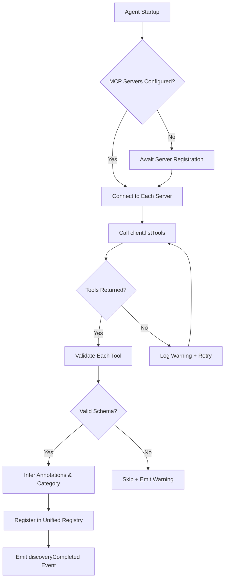
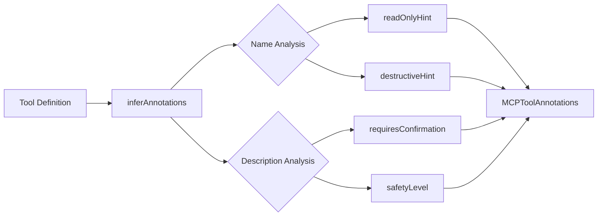
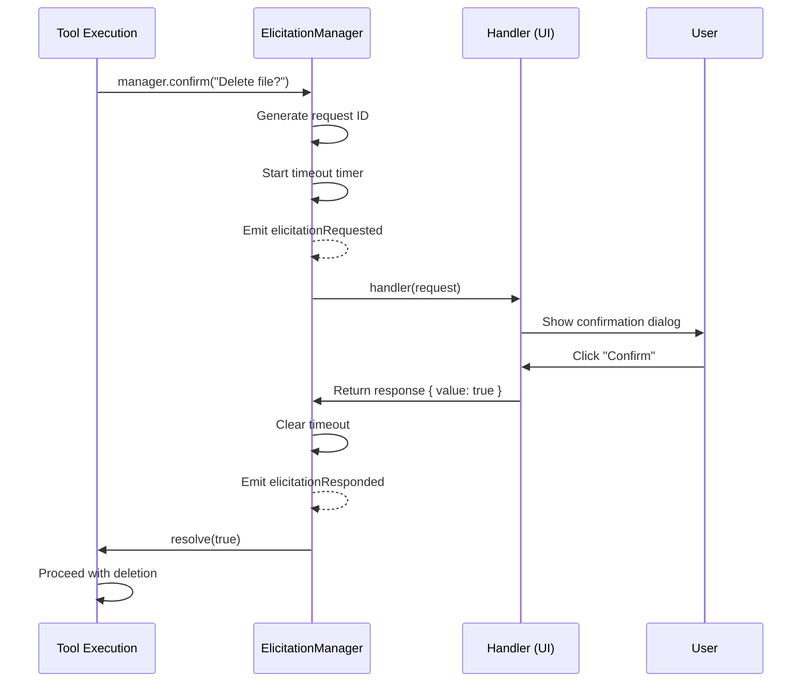
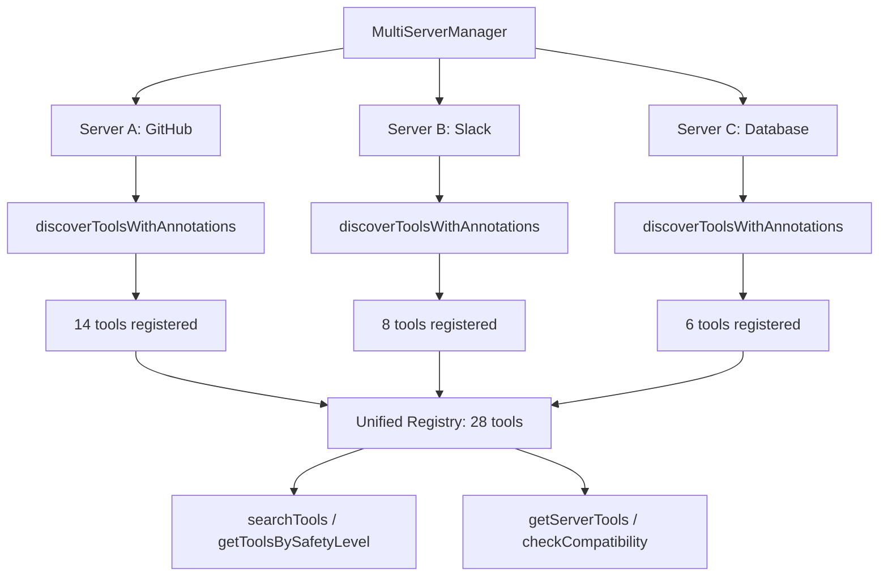

We designed MCP auto-discovery so you never manually register a tool again. Every time an MCP server connects to NeuroLink, the `ToolDiscoveryService` scans the server, validates each tool's schema, infers annotations and safety metadata, and registers the tool in a unified registry that any AI agent can query at runtime. When a tool is missing mid-conversation, the elicitation protocol lets the agent ask the user -- or another system -- to provide the missing capability on the spot.

This post walks through the full architecture: how tool discovery works under the hood, how enhanced discovery adds annotation inference and multi-server coordination, how the elicitation protocol bridges the gap between what tools exist and what tools the agent needs, and how to build your own discovery plugin.

## The Tool Discovery Problem

Static tool registration is the default pattern in most AI frameworks. You define your tools at build time, wire them into your agent configuration, and deploy. Every time you add a tool, you redeploy. Every time you remove one, you redeploy. Every time a tool's schema changes, you redeploy.

This pattern breaks down in three scenarios:

1. **Multi-server environments** where teams deploy independent MCP servers with their own tool sets. A central agent needs to discover tools from all of them without hardcoding server addresses or tool names.
2. **Dynamic tool sets** where tools come and go based on infrastructure state. A Kubernetes operator might expose different tools depending on which services are running.
3. **Cross-organization integrations** where third-party MCP servers expose tools that your agent has never seen before. You cannot predefine schemas for tools that do not exist yet.

Auto-discovery solves all three. The agent connects to a server, asks "what tools do you have?", validates the response, and registers the tools -- all at runtime, with no code changes required.



## ToolDiscoveryService Architecture

The `ToolDiscoveryService` is the core discovery engine. It extends `EventEmitter` and maintains three internal data structures: a tool registry mapping tool keys to metadata, a server-tools map tracking which tools belong to which server, and a discovery-in-progress set preventing concurrent discovery for the same server.

### Data Structures

```typescript
export class ToolDiscoveryService extends EventEmitter {
  // Maps "serverId::toolName" -> full tool metadata
  private toolRegistry = new Map<string, ExternalMCPToolInfo>();

  // Maps serverId -> Set of tool names for fast lookup
  private serverTools = new Map<string, Set<string>>();

  // Prevents duplicate concurrent discovery for the same server
  private discoveryInProgress = new Set<string>();

  // Stores raw tool definitions from each server
  private serverToolStorage = new Map<string, MCPServerInfo["tools"]>();
}
```

### Discovery Flow

When you call `discoverTools(serverId, client)`, the service runs through a multi-step pipeline:

1. **Concurrency guard** -- If discovery is already in progress for this server, the call returns immediately with a `success: false` result. This prevents duplicate scans when multiple agents connect simultaneously.

2. **Circuit breaker protection** -- The discovery call is wrapped in a circuit breaker with a failure threshold of 2. If the server fails twice in a row, the circuit opens and subsequent discovery attempts fail fast for 60 seconds. This prevents cascade failures in multi-server environments.

3. **Tool listing** -- The service calls `client.listTools()` on the MCP client, racing against a configurable timeout (default 60 seconds, overridable via the `MCP_TOOL_TIMEOUT` environment variable).

4. **Validation and registration** -- Each returned tool passes through `validateTool()`, which checks the tool name, description, server ID, and JSON schema validity. Invalid tools are skipped with a warning; valid tools are registered.

5. **Event emission** -- The service emits `toolRegistered` for each successfully registered tool and `discoveryCompleted` when the entire server scan finishes.

```typescript
// Discover tools from an external MCP server
const result = await discoveryService.discoverTools(
  "github-server",
  mcpClient,
  30000, // 30s timeout
);

console.log(`Discovered ${result.toolCount} tools in ${result.duration}ms`);
// => "Discovered 14 tools in 230ms"

// Listen for individual tool registrations
discoveryService.on("toolRegistered", ({ serverId, toolName, toolInfo }) => {
  console.log(`Registered: ${toolName} from ${serverId}`);
  console.log(`  Category: ${toolInfo.metadata.category}`);
  console.log(`  Complexity: ${toolInfo.metadata.complexity}`);
});
```

### Tool Validation

Every discovered tool passes through a validation pipeline before registration. The validator checks four properties:

| Check | Rule | Outcome |
|-------|------|---------|
| Tool name | Must match `validateToolName()` constraints (non-empty, valid characters) | Error -- tool skipped |
| Description | Must match `validateToolDescription()` constraints | Warning -- tool registered with flag |
| Server ID | Must be non-empty | Error -- tool skipped |
| Input schema | Must be valid JSON when serialized | Error -- tool skipped |

The validator also infers metadata: category (version-control, file-system, api, data, authentication, deployment, or general), complexity (simple/moderate/complex based on parameter count), and auth requirement (inferred from name and description keywords).

```typescript
// Internal validation result structure
type ToolValidationResult = {
  isValid: boolean;
  errors: string[];
  warnings: string[];
  metadata: {
    category: string;
    complexity: "simple" | "moderate" | "complex";
    requiresAuth: boolean;
    isDeprecated: boolean;
  };
};
```

## Enhanced Discovery: Annotation Inference and Advanced Search

The `EnhancedToolDiscovery` service extends the base discovery with four capabilities: annotation inference, multi-server coordination, advanced search, and compatibility checking.

### Annotation Inference

When a tool is discovered, `EnhancedToolDiscovery` runs the `inferAnnotations()` function against its name and description. This produces an `MCPToolAnnotations` object that classifies the tool's behavior without requiring the server to declare annotations explicitly.



The annotation engine uses keyword matching against the tool name and description. A tool named `readFile` with a description containing "read" gets `readOnlyHint: true`. A tool named `deleteRepository` with "permanently remove" in the description gets `destructiveHint: true` and a "dangerous" safety level.

```typescript
const discovery = new EnhancedToolDiscovery();

const result = await discovery.discoverToolsWithAnnotations(
  "github-server",
  mcpClient,
  10000,
);

// Each tool now has inferred annotations
for (const tool of result.tools) {
  const enhanced = tool as EnhancedToolInfo;
  console.log(`${tool.name}:`);
  console.log(`  readOnly: ${enhanced.annotations?.readOnlyHint}`);
  console.log(`  destructive: ${enhanced.annotations?.destructiveHint}`);
  console.log(`  safety: ${enhanced.annotations?.safetyLevel}`);
}
```

### Advanced Search

The `searchTools()` method supports filtering by name (partial match), description (keyword match), server IDs, category, annotation flags, and availability status. Results can be sorted by name, call count, success rate, or average execution time.

```typescript
// Find all read-only file system tools across all servers
const fileTools = discovery.searchTools({
  category: "file-system",
  annotations: { readOnlyHint: true },
  sortBy: "successRate",
  sortDirection: "desc",
  limit: 20,
});

// Get all tools that need user confirmation before execution
const confirmationTools = discovery.getToolsRequiringConfirmation();

// Group tools by safety level for UI rendering
const safeTools = discovery.getToolsBySafetyLevel("safe");
const moderateTools = discovery.getToolsBySafetyLevel("moderate");
const dangerousTools = discovery.getToolsBySafetyLevel("dangerous");
```

## The Elicitation Protocol

The elicitation system enables MCP tools to request interactive user input mid-execution. This is the bridge between static discovery ("here are the tools I found") and dynamic capability ("the agent needs something that does not exist yet -- ask the user").

### Why Elicitation Exists

Consider a deployment tool that needs to delete a production database before migrating to a new schema. The tool exists. The agent found it via discovery. But executing it without human confirmation would be reckless. The elicitation protocol lets the tool pause execution, send a confirmation request to the user, wait for a response, and then proceed or abort based on the answer.

Elicitation handles seven request types:

| Type | Use Case | Response |
|------|----------|----------|
| `confirmation` | Approve destructive operations | `boolean` |
| `text` | Request missing parameters | `string` |
| `select` | Choose from predefined options | `string` |
| `multiselect` | Select multiple options | `string[]` |
| `form` | Structured multi-field input | `Record<string, unknown>` |
| `file` | File selection or upload | File reference |
| `secret` | Passwords, API keys | `string` (masked) |

### ElicitationManager

The `ElicitationManager` is the runtime engine for the elicitation protocol. It queues requests, manages timeouts, dispatches to handlers, and emits lifecycle events.

```typescript
import { ElicitationManager } from "@juspay/neurolink";

const manager = new ElicitationManager({
  defaultTimeout: 60000,
  enabled: true,
  fallbackBehavior: "timeout",
  handler: async (request) => {
    switch (request.type) {
      case "confirmation": {
        const confirmed = await showConfirmDialog(request.message);
        return {
          requestId: request.id,
          responded: true,
          value: confirmed,
          timestamp: Date.now(),
        };
      }
      case "text": {
        const text = await showTextInput(request.message);
        return {
          requestId: request.id,
          responded: true,
          value: text,
          timestamp: Date.now(),
        };
      }
      case "select": {
        const choice = await showSelectMenu(request.message, request.options);
        return {
          requestId: request.id,
          responded: true,
          value: choice,
          timestamp: Date.now(),
        };
      }
      default:
        return {
          requestId: request.id,
          responded: false,
          timestamp: Date.now(),
        };
    }
  },
});
```

### Convenience Methods

The manager exposes typed convenience methods for each elicitation type so you do not have to construct raw request objects:

```typescript
// Confirmation dialog
const confirmed = await manager.confirm("Delete production database?", {
  toolName: "dropDatabase",
  confirmLabel: "Yes, delete",
  cancelLabel: "Cancel",
});

// Text input with validation
const projectName = await manager.getText("Enter project name:", {
  placeholder: "my-project",
  defaultValue: "untitled",
});

// Single selection
const env = await manager.select("Select target environment:", [
  { value: "dev", label: "Development" },
  { value: "staging", label: "Staging" },
  { value: "prod", label: "Production" },
]);

// Structured form
const config = await manager.form("Configure deployment:", [
  {
    name: "region",
    label: "Region",
    type: "select",
    required: true,
    options: [
      { value: "us-east-1", label: "US East" },
      { value: "eu-west-1", label: "EU West" },
    ],
  },
  {
    name: "replicas",
    label: "Replicas",
    type: "number",
    required: true,
    defaultValue: 3,
  },
]);
```

### Elicitation Lifecycle



The manager tracks pending requests internally. If a response does not arrive before the timeout, the manager resolves the promise based on the `fallbackBehavior` setting: `"timeout"` returns a timed-out response, `"default"` returns the request's default value, and `"error"` rejects the promise.

## Multi-Server Discovery

In production, NeuroLink agents typically connect to multiple MCP servers simultaneously: a GitHub server for repository operations, a Slack server for messaging, a database server for queries, and so on. The `MultiServerManager` coordinates discovery across all connected servers and provides a unified tool namespace.

### Unified Tool Registry

When tools from different servers share the same name (for example, both a GitHub server and a GitLab server expose a tool called `createPullRequest`), the registry uses a composite key: `serverId::toolName`. The `getUnifiedTools()` method returns a deduplicated list where server-specific tools are disambiguated by their server ID prefix.

```typescript
const discovery = new EnhancedToolDiscovery();

// Register multiple servers
discovery.registerServer({ id: "github", client: githubClient });
discovery.registerServer({ id: "gitlab", client: gitlabClient });
discovery.registerServer({ id: "slack", client: slackClient });

// Discover tools from all servers
for (const server of registeredServers) {
  await discovery.discoverToolsWithAnnotations(server.id, server.client);
}

// Get unified tools across all servers
const allTools = discovery.getUnifiedTools();
console.log(`Total tools across all servers: ${allTools.length}`);

// Search across all servers
const gitTools = discovery.searchTools({
  description: "git",
  sortBy: "name",
});
```

### Discovery Coordination



## Security: Capability Filtering and Access Control

Auto-discovery introduces a security surface: any MCP server can advertise any tool, and a malicious server could advertise a tool named `readSystemCredentials`. NeuroLink mitigates this at three layers.

### Layer 1: Schema Validation

Every discovered tool must pass schema validation before registration. Tools with empty names, missing server IDs, or malformed JSON schemas are rejected. This prevents injection of tools with invalid definitions.

```typescript
// Validation catches malformed tools before they enter the registry
const validation = discoveryService.validateTool(toolInfo);

if (!validation.isValid) {
  // Tool is rejected -- never registered
  console.log("Rejected:", validation.errors);
  // => ["Tool name must not be empty", "Input schema is not valid JSON"]
}
```

### Layer 2: Annotation-Based Filtering

The enhanced discovery service infers safety annotations for every tool. Agents can filter tools by safety level before presenting them to the LLM. A conservative agent might only expose `safe` and `moderate` tools, requiring explicit user approval for `dangerous` tools.

```typescript
// Only expose safe tools to the LLM by default
const safeTool = discovery.getToolsBySafetyLevel("safe");
const moderateTools = discovery.getToolsBySafetyLevel("moderate");

// Dangerous tools require elicitation before execution
const dangerousTools = discovery.getToolsBySafetyLevel("dangerous");
for (const tool of dangerousTools) {
  wrapToolWithElicitation(tool, {
    requireConfirmation: true,
    elicitationTimeout: 60000,
  });
}
```

### Layer 3: Circuit Breaker Isolation

Each tool execution is wrapped in its own circuit breaker with a failure threshold of 3 and a 30-second reset window. If a tool from a compromised server starts failing (timeouts, errors, unexpected responses), the circuit breaker opens and the tool becomes temporarily unavailable. This contains the blast radius to a single tool rather than affecting the entire registry.

## Caching Discovery Results

Discovering tools is an I/O-bound operation: it requires a network round-trip to each MCP server. In a multi-server environment with frequent agent restarts, this can add seconds of latency to agent initialization. NeuroLink caches discovery results at two levels.

### In-Memory Cache

The `serverToolStorage` map holds the raw tool definitions from each server. When an agent reconnects to a server it has already discovered, the service can compare the cached tool list with the fresh response and only process diffs (new tools, removed tools, changed schemas).

```typescript
// The service tracks tool storage per server
private serverToolStorage = new Map<string, MCPServerInfo["tools"]>();

// On re-discovery, compare with cached tools
const cachedTools = this.serverToolStorage.get(serverId);
const freshTools = await client.listTools();

// Diff: find new, removed, and changed tools
const newTools = freshTools.tools.filter(
  (t) => !cachedTools?.find((c) => c.name === t.name),
);
const removedTools = cachedTools?.filter(
  (c) => !freshTools.tools.find((t) => t.name === c.name),
) ?? [];

console.log(`New: ${newTools.length}, Removed: ${removedTools.length}`);
```

### TTL-Based Refresh

In production, you set a refresh interval that periodically re-discovers tools from all connected servers. This catches tools that have been added or removed since the last full discovery.

```typescript
// Configure periodic re-discovery (every 5 minutes)
const REFRESH_INTERVAL = 5 * 60 * 1000;

setInterval(async () => {
  for (const [serverId, client] of connectedServers) {
    const result = await discoveryService.discoverTools(serverId, client);
    if (result.success) {
      console.log(
        `Refreshed ${serverId}: ${result.toolCount} tools (${result.duration}ms)`,
      );
    }
  }
}, REFRESH_INTERVAL);
```

## Production Deployment

### Refresh Intervals

Set your discovery refresh interval based on how frequently tools change. For stable environments, 10-15 minutes is sufficient. For dynamic environments where tools are deployed via CI/CD, 1-2 minutes keeps the registry current.

```typescript
// Environment-based refresh configuration
const refreshIntervals: Record<string, number> = {
  development: 30_000,      // 30 seconds
  staging: 120_000,         // 2 minutes
  production: 600_000,      // 10 minutes
};

const interval = refreshIntervals[process.env.NODE_ENV ?? "development"];
```

### Monitoring

The discovery service emits events at every lifecycle stage. Wire these into your observability stack for visibility into discovery health.

```typescript
// OpenTelemetry instrumentation is built in
// The service creates spans via tracers.mcp
discoveryService.on("discoveryCompleted", ({ serverId, toolCount, duration }) => {
  metrics.gauge("mcp.discovery.tool_count", toolCount, { serverId });
  metrics.histogram("mcp.discovery.duration_ms", duration, { serverId });
});

discoveryService.on("discoveryFailed", ({ serverId, error }) => {
  metrics.counter("mcp.discovery.failures", 1, { serverId });
  alerting.notify(`Discovery failed for ${serverId}: ${error}`);
});

// Monitor elicitation health
elicitationManager.on("elicitationTimeout", ({ request }) => {
  metrics.counter("mcp.elicitation.timeouts", 1, {
    toolName: request.toolName,
    type: request.type,
  });
});

elicitationManager.on("elicitationError", ({ request, error }) => {
  metrics.counter("mcp.elicitation.errors", 1, {
    toolName: request.toolName,
  });
});
```

### Timeout Configuration

The default tool timeout is 60 seconds, controlled by the `MCP_TOOL_TIMEOUT` environment variable with a minimum floor of 5 seconds. For discovery specifically, the circuit breaker uses a failure threshold of 2 (vs 3 for execution) because discovery failures are more likely to indicate a server-level issue.

```typescript
// Default timeout: max(5000, MCP_TOOL_TIMEOUT || 60000)
const DEFAULT_TOOL_TIMEOUT = Math.max(
  5000,
  Number(process.env.MCP_TOOL_TIMEOUT) || 60000,
);

// Circuit breaker configuration for discovery
const discoveryBreaker = {
  failureThreshold: 2,    // Open after 2 consecutive failures
  resetTimeout: 60000,    // Try again after 60 seconds
  operationTimeout: timeout,
};

// Circuit breaker configuration for tool execution
const executionBreaker = {
  failureThreshold: 3,    // Open after 3 consecutive failures
  resetTimeout: 30000,    // Try again after 30 seconds
  operationTimeout: effectiveTimeout,
};
```

## Building a Custom Discovery Plugin

You can extend the discovery system with custom logic for your environment. A discovery plugin hooks into the lifecycle events and transforms or filters tools before they reach the agent.

### Plugin Structure

```typescript
import { ToolDiscoveryService } from "@juspay/neurolink";
import type { ExternalMCPToolInfo } from "@juspay/neurolink";

type DiscoveryPlugin = {
  name: string;
  version: string;

  // Called before discovery starts -- can modify server config
  beforeDiscovery?: (serverId: string) => Promise<void>;

  // Called for each tool before validation -- can transform or reject
  transformTool?: (
    tool: ExternalMCPToolInfo,
  ) => ExternalMCPToolInfo | null;

  // Called after all tools are registered
  afterDiscovery?: (
    serverId: string,
    tools: ExternalMCPToolInfo[],
  ) => Promise<void>;
};

// Example: Plugin that adds organization-specific metadata
const orgMetadataPlugin: DiscoveryPlugin = {
  name: "org-metadata",
  version: "1.0.0",

  transformTool: (tool) => {
    // Add cost center and team ownership
    const teamMapping: Record<string, string> = {
      "git": "platform-team",
      "deploy": "sre-team",
      "query": "data-team",
    };

    const team = Object.entries(teamMapping).find(([keyword]) =>
      tool.name.toLowerCase().includes(keyword),
    )?.[1] ?? "unassigned";

    return {
      ...tool,
      metadata: {
        ...tool.metadata,
        team,
        costCenter: team === "sre-team" ? "infrastructure" : "product",
      },
    };
  },
};
```

### Registering Plugins

```typescript
// Apply plugin to discovery service
const discoveryService = new ToolDiscoveryService();

discoveryService.on("toolRegistered", ({ toolInfo }) => {
  const transformed = orgMetadataPlugin.transformTool?.(toolInfo);
  if (transformed) {
    // Update tool metadata in registry
    console.log(`Plugin applied: ${transformed.name} -> team=${transformed.metadata.team}`);
  }
});

discoveryService.on("discoveryCompleted", async ({ serverId, toolCount }) => {
  await orgMetadataPlugin.afterDiscovery?.(serverId, []);
  console.log(`Plugin: post-discovery hook for ${serverId} (${toolCount} tools)`);
});
```

### Example: Access Control Plugin

A common plugin restricts which tools are exposed based on the calling user's role. This plugin filters tools during the transform phase, returning `null` for tools the user is not authorized to see.

```typescript
const accessControlPlugin: DiscoveryPlugin = {
  name: "access-control",
  version: "1.0.0",

  transformTool: (tool) => {
    const userRoles = getCurrentUserRoles();
    const requiredRole = inferRequiredRole(tool);

    if (!userRoles.includes(requiredRole)) {
      console.log(`Access denied: ${tool.name} requires ${requiredRole}`);
      return null; // Tool is filtered out
    }

    return tool;
  },
};

function inferRequiredRole(tool: ExternalMCPToolInfo): string {
  if (tool.metadata?.category === "deployment") return "admin";
  if (tool.metadata?.category === "authentication") return "admin";
  if (tool.name.includes("delete") || tool.name.includes("drop")) return "admin";
  return "user";
}
```

## Conclusion

MCP auto-discovery eliminates the manual tool registration cycle. The `ToolDiscoveryService` handles the core scan-validate-register pipeline with circuit breaker protection and event-driven lifecycle hooks. `EnhancedToolDiscovery` adds annotation inference, multi-server coordination, and advanced search. The elicitation protocol bridges the gap between discovered capabilities and runtime needs by letting tools request interactive user input mid-execution. Together, these systems let you build AI agents that adapt to their tool environment at runtime rather than at deploy time.

---

**Related posts:**

- [MCP Tools: Extending AI with External Capabilities](/posts/mcp-tools-integration/)
- [Advanced MCP: Tool Routing, Caching, and Batching Strategies](/posts/advanced-mcp-routing-caching-batching/)
- [MCP Server Tutorial: Build Your Own AI Tools in 30 Minutes](/posts/mcp-server-tutorial/)
