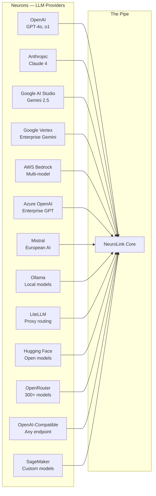
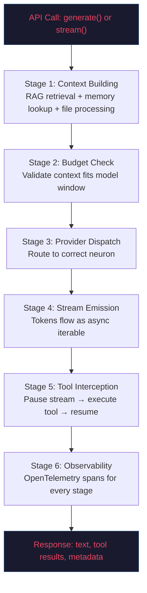
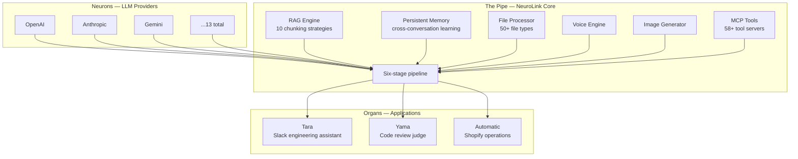
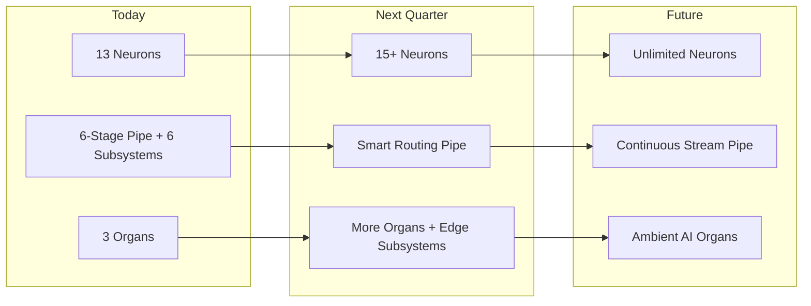

We believe the future of AI infrastructure looks like a nervous system, not a monolith. Not a single omniscient model sitting behind a REST endpoint, but a living network of specialized providers, routing layers, and functional organs -- each doing one thing well, all connected by a vascular system that carries intelligence from source to destination.

This is not a marketing metaphor. It is the structural model that governs every architectural decision in NeuroLink. When we debate whether a feature belongs in the provider layer or the middleware layer, we ask: "Is this a neuron concern or a pipe concern?" When we design a new application that consumes NeuroLink, we ask: "How does this organ connect to the pipe?" The biology gives us a vocabulary for decomposition that keeps the system coherent as it grows.

This post explains why we chose a biological model, how the three components -- neurons, the pipe, and organs -- map to real code, and what this architecture enables that a traditional request-response gateway cannot.

## Why Biology, Not Plumbing

Most AI abstraction layers describe themselves using plumbing metaphors. Routes, pipelines, adapters, connectors. These words are not wrong, but they carry an implicit assumption: that AI integration is a data plumbing problem. You have inputs on one side, outputs on the other, and the job of the middleware is to move bytes between them without leaking.

We started there. Early NeuroLink prototypes were exactly this -- an adapter layer that normalized provider APIs into a common format. It worked. But as we added capabilities beyond simple text generation -- streaming, tool use, memory, RAG, file processing, voice, image generation -- the plumbing metaphor broke down. Plumbing is passive. It does not make decisions. It does not adapt. It does not remember.

A nervous system does all of those things. It routes signals dynamically based on context. It has specialized structures for different functions. It maintains state across time. It can reroute around damage. And critically, it operates as a streaming system -- neurons fire continuously, not in request-response pairs.

When we adopted the nervous system model, three things happened:

1. **Architectural debates got easier.** Instead of arguing about where a feature belongs in a flat middleware stack, we could ask which biological component it maps to. Memory and RAG are pipe subsystems. Provider selection is neuron routing. Token budget management is a pipe concern. A new application like Tara or Yama is an organ.

2. **The system became more composable.** Organs connect to the pipe independently. You can build a Slack assistant without touching the code review system. You can add a new application without modifying the pipe. The biological separation of concerns enforced clean interfaces.

3. **The streaming-first design became obvious.** Nervous systems do not batch-process signals. They stream. Making `stream()` the primitive and `generate()` a convenience wrapper felt natural under this model, whereas it had felt like an optimization hack under the plumbing model.

## Neurons: LLM Providers as Signal Generators

In the nervous system model, neurons are where intelligence originates. Each LLM provider is a neuron -- a specialized signal generator with its own characteristics, costs, and capabilities.

NeuroLink currently supports 13 neurons:



Each neuron is different. OpenAI excels at function calling. Anthropic produces careful, nuanced reasoning. Gemini handles massive context windows. Ollama runs locally with zero latency and zero cost. Mistral serves the European market with data sovereignty. SageMaker hosts custom fine-tuned models on your own infrastructure.

The key insight is that these differences are features, not problems. A nervous system does not try to make all neurons identical -- it routes signals to the right neuron for the task. NeuroLink's `ProviderRegistry` does the same thing:

```typescript
// Each neuron registers itself with its capabilities
ProviderFactory.registerProvider(
  AIProviderName.ANTHROPIC,
  async (modelName?) => {
    const { AnthropicProvider } = await import("../providers/anthropic.js");
    return new AnthropicProvider(modelName);
  },
  AnthropicModels.CLAUDE_SONNET_4_5,
  ["claude", "sonnet", "haiku"],
);

// Switching neurons is one parameter change
const result = await neurolink.generate({
  input: { text: "Analyze this contract" },
  provider: "anthropic",  // or "openai", "google-ai", "ollama"...
  model: "claude-sonnet-4-5",
});
```

The consumer code does not know which neuron fired. It receives a normalized `EnhancedGenerateResult` regardless of whether the signal came from GPT-4o in Virginia or a Llama model running on your laptop. This is the provider abstraction in biological terms: the pipe does not care which neuron generated the signal, only that the signal conforms to the expected shape.

### Why 13 Neurons Matter

A single-provider SDK is a nervous system with one neuron. It works -- until that neuron fails, or becomes too expensive, or cannot handle a particular signal type. Thirteen neurons give you:

- **Redundancy.** If Anthropic has an outage, route to OpenAI. If cloud providers are too slow, route to Ollama locally.
- **Cost optimization.** Use expensive neurons (GPT-4o, Claude) for complex reasoning. Use cheap neurons (Mistral, Ollama) for simple tasks.
- **Capability matching.** Use Gemini for 1M-token context windows. Use Anthropic for careful analysis. Use SageMaker for domain-specific fine-tuned models.
- **Compliance.** Use Azure for enterprise governance. Use Ollama for air-gapped environments. Use Vertex for Google Cloud customers.

## The Pipe: Routing Intelligence

The pipe is NeuroLink itself -- the vascular layer that carries signals from neurons to organs. Every `generate()` and `stream()` call travels the same six-stage pipe, with built-in subsystems for RAG, memory, file processing, and tool execution.



This is not an oversimplification. The pipe really is six stages, executed in order, for every single call. Understanding the pipe is understanding NeuroLink.

### Stage 1: Context Building

Before any tokens are generated, the pipe assembles the full context. This is where the pipe's built-in subsystems contribute their outputs:

```typescript
// The pipe assembles context from multiple subsystems
// RAG retrieval adds relevant document chunks
// Memory lookup adds conversation history
// File processing converts attachments to provider format
// System prompt injection merges custom instructions

const context = await this.buildContext({
  rag: { files: ["./contracts/*.pdf"] },
  memory: conversationId,
  systemPrompt: "You are a legal analyst.",
  files: [uploadedImage],
});
```

RAG retrieval, memory lookup, and file processing all happen here. If you have configured RAG with `rag: { files: [...] }`, documents are chunked, embedded, and a `search_knowledge_base` tool is registered automatically. If you have an active conversation, memory fetches the history from Redis or the in-memory store. If you have attached files -- images, PDFs, CSVs, code -- the `ProcessorRegistry` converts them into provider-appropriate formats.

### Stage 2: Budget Check

The `BudgetChecker` validates that the assembled context fits within the model's context window. This happens before every LLM call -- no exceptions.

The threshold triggers at 80% of the context window. If the context exceeds the budget, the `ContextCompactor` runs a four-stage compaction pipeline:

1. **Tool output pruning** -- old tool results replaced with summaries
2. **File read deduplication** -- only the latest read of each file is kept
3. **LLM summarization** -- structured summary of oldest messages
4. **Sliding window truncation** -- non-destructive tagging of overflow messages

This is analogous to how biological nervous systems handle information overload. You do not remember every detail of every conversation -- your brain compacts older memories into summaries while keeping recent information vivid.

### Stage 3: Provider Dispatch

The `ProviderRegistry` resolves the provider name to a concrete neuron implementation. Dynamic imports prevent circular dependencies:

```typescript
// Dynamic import keeps the registry lightweight
// Only the requested provider is loaded into memory
const provider = await ProviderFactory.getProvider(
  AIProviderName.ANTHROPIC,
  "claude-sonnet-4-5"
);
```

Switching providers requires changing one string. The rest of the pipe -- context building, budget checking, tool interception, observability -- is completely unchanged.

### Stage 4: Stream Emission

Tokens arrive as an async iterable. This is the core design invariant: **`generate()` is `stream()` collected.** There is only `stream()`.

```typescript
// This is what generate() does internally
// There is no separate non-streaming code path
let text = "";
for await (const token of this.stream(options)) {
  text += token;
}
return { text };
```

The stream handles multiple event types: text deltas, tool calls, thinking blocks, and usage statistics. This streaming-first design means that real-time token delivery is not a feature bolted onto a batch system -- it is the system itself.

### Stage 5: Tool Interception

When the model emits a tool call, the stream pauses. The `MCPToolRegistry` dispatches to the correct tool -- whether it is a built-in tool or an external MCP server accessed via stdio, HTTP, SSE, or WebSocket. The tool result is injected back into the conversation, and the model resumes generating from the result. The stream continues.

This is how NeuroLink supports agentic workflows. The model can call tools mid-stream, receive results, and continue reasoning -- all without breaking the streaming contract.

### Stage 6: Observability

Every stage emits OpenTelemetry spans. The full trace covers context build duration, token counts (input and output), tool execution times, memory read/write latency, and provider-specific attributes like model name, temperature, and finish reason. Exporters include Langfuse, OTLP, Jaeger, Zipkin, Prometheus, Datadog, NewRelic, Honeycomb, and Console.

A nervous system you cannot observe is dangerous. This is why observability is not optional middleware in NeuroLink -- it is wired into the pipe itself.

## Organs: Applications That Consume the Pipe

Organs are the applications that consume the pipe. They connect to the vascular layer and open a gateway -- a specific way for people or systems to interact with AI. In biological terms, the heart, lungs, and muscles are distinct organs served by the same circulatory system. In NeuroLink, every application built on the pipe is an organ.



Production organs today:

- **Automatic** -- the Shopify operations hub that uses NeuroLink for address intelligence and RTO risk scoring. It consumes the pipe to analyze merchant data and automate e-commerce workflows.
- **Tara** -- the Slack engineering assistant that opens a conversational gateway to NeuroLink. Engineers interact with AI through Slack threads, and Tara routes their requests through the pipe with full MCP tool access.
- **Yama** -- the AI code review judge that connects to Bitbucket pull requests. It consumes the pipe to analyze diffs, check for patterns, and provide automated review governance.

The key architectural insight is that **neurons generate intelligence, the pipe routes and enriches it, and organs consume it.** The flow is always one direction: neuron to pipe to organ. There is no confusion about where logic lives.

### Why Organs Are Applications, Not Capabilities

It is tempting to call internal capabilities like RAG, memory, or file processing "organs." We initially made this mistake ourselves. But the source model is precise: organs are the endpoints that consume the pipe, not the subsystems within it.

RAG, persistent memory, file processing, voice, image generation, and MCP tool integration are all **pipe subsystems** -- they enrich the signal as it travels through the six-stage pipeline. They activate via configuration options on `generate()` or `stream()`, not as independent applications.

This distinction matters because it enforces a clean separation of concerns:

- **Pipe subsystems** are shared infrastructure. Every organ benefits from the same RAG engine, the same memory system, the same file processor. You configure them per-call, not per-application.
- **Organs** are independent applications. They have their own users, their own interfaces, their own deployment lifecycles. Changing Tara does not affect Yama. Adding a new organ does not touch the pipe.

### Pipe Subsystems: The Capabilities Within the Pipe

The pipe is not a dumb conduit. It contains specialized subsystems that enrich intelligence as it flows:

**Persistent Memory (Hippocampus).** Named after the brain structure responsible for forming long-term memories, this subsystem extracts facts, preferences, and patterns from interactions and stores them persistently. When a new conversation begins, relevant memories are retrieved and injected into the context -- giving the AI continuity across sessions. Memory is scoped per user, per conversation thread, with no cross-contamination.

**RAG Engine.** Handles document ingestion, chunking, embedding, and retrieval. It supports 10 chunking strategies -- from simple fixed-size chunks to semantic paragraph splitting -- and provides hybrid search (vector similarity combined with keyword matching) with reranking for relevance. When you configure `rag: { files: [...] }`, the pipe automatically registers a `search_knowledge_base` tool. The model decides when to search and how to incorporate the results.

**File Processor.** The `ProcessorRegistry` handles 50+ file types -- images, PDFs, spreadsheets, code files, audio, video metadata. Each file type is converted into a provider-appropriate format during the Context Building stage. Just as biological senses convert light and sound into neural signals, the file processor converts diverse document formats into token sequences that neurons can process.

**MCP Tools.** The Model Context Protocol integration gives the pipe access to 58+ tool servers across 4 transport protocols (stdio, HTTP, SSE, WebSocket). When the model decides it needs to search the web, query a database, or interact with an external service, it emits a tool call. The pipe intercepts the call, dispatches it to the appropriate tool server, and returns the result to the stream.

## Edge-First Streaming: Why Intelligence Flows

A nervous system does not batch-process signals. It streams them. Neurons fire continuously, signals propagate in real time, and the system adapts moment by moment.

NeuroLink adopts this same principle. The streaming model is not an optimization on top of a batch system -- it is the fundamental architecture. Here is why this matters:

```typescript
// Traditional batch model — wait for complete response
const response = await gateway.complete({
  prompt: "Analyze this 200-page contract",
});
// User waits 30 seconds, sees nothing, then gets a wall of text

// Streaming nervous system model — intelligence flows in real time
const stream = neurolink.stream({
  input: { text: "Analyze this 200-page contract" },
  provider: "anthropic",
});

for await (const chunk of stream) {
  process.stdout.write(chunk.content);
  // User sees analysis forming in real time
  // First tokens arrive in <500ms
  // Tool calls execute mid-stream
  // Memory updates happen in parallel
}
```

The streaming model changes the user experience fundamentally. Instead of waiting for a complete response, users see intelligence forming in real time. The first tokens arrive in under 500 milliseconds. Tool calls execute mid-stream without breaking the flow. Memory updates happen in parallel with token generation.

This is also why NeuroLink's vision document emphasizes continuous streams -- long-running connections where the AI maintains context indefinitely, connecting and disconnecting as needed, like a WebSocket for intelligence. The nervous system model makes this future feel inevitable rather than aspirational.

## How This Shapes the SDK API

The nervous system model is not just an internal organizational tool. It directly shapes the API that developers interact with.

**One entry point.** The pipe has one input: `generate()` or `stream()`. There is no separate API for "RAG generation" versus "tool-augmented generation" versus "memory-enhanced generation." You configure pipe subsystems via options, and the pipe assembles everything:

```typescript
// Everything flows through the same pipe
const result = await neurolink.generate({
  input: { text: "What did we discuss about the merger?" },
  provider: "anthropic",
  model: "claude-sonnet-4-5",
  // Pipe subsystems activate via configuration, not separate APIs
  rag: { files: ["./legal-docs/"] },
  memory: { conversationId: "merger-review-2026" },
  tools: ["search_web", "create_document"],
  systemPrompt: "You are a senior legal analyst.",
});
```

**Provider-agnostic by default.** Because neurons are interchangeable at the pipe level, the SDK does not expose provider-specific types in the response. You get `EnhancedGenerateResult` regardless of which neuron fired.

**Streaming as the primitive.** Because the pipe is streaming-native, the SDK makes streaming the natural choice. `generate()` exists for convenience, but `stream()` is what powers it underneath.

**Pipe subsystems compose independently.** You can enable RAG without memory, memory without tools, tools without RAG -- any combination. The pipe orchestrates them; they do not depend on each other. Organs consume the fully enriched output without needing to know which subsystems contributed to it.

## The Pipe Layer Vision: What Comes Next

The nervous system model scales in three directions, and each direction represents a phase of NeuroLink's roadmap.

**Add neurons.** New AI providers appear constantly. The ProviderRegistry's dynamic import pattern means adding a new neuron requires implementing five abstract methods and registering the class. No existing code changes. The nervous system grows more neurons without rewiring.

**Extend the pipe.** New pipeline stages and subsystems -- like regional routing, cost-based optimization, browser-based LLM execution via WebGPU, or automatic model selection based on task complexity -- can be inserted into the six-stage pipe without disrupting existing stages. The pipe gets smarter without getting bigger.

**Build organs.** New applications connect to the pipe independently. Any team can import NeuroLink, connect to the pipe, and open their own gateway. The pipe does not need to know about the organs it serves -- it just carries enriched intelligence to whoever consumes it.



The long-term vision is that NeuroLink becomes the nervous system for ambient AI -- intelligence that is always available, runs at the edge, costs nothing at the margin, and adapts to context in real time. The biological model makes this future architecturally coherent rather than a collection of unrelated features.

## Why This Matters for Developers

If you are building with AI today, the nervous system model gives you three practical advantages.

**First, it simplifies decision-making.** When you need to add a new AI capability, you do not have to redesign your architecture. You add a neuron (new provider), extend the pipe (new subsystem or middleware stage), or build an organ (new application). The model tells you where new code belongs.

**Second, it future-proofs your integration.** Because the pipe is provider-agnostic and organs are decoupled consumers, you can adopt new models, new capabilities, and new deployment patterns without rewriting your application logic. When browser-based LLMs become viable, they will be just another neuron. When continuous streaming lands, it will be a pipe enhancement. Your organs stay the same.

**Third, it makes AI observable.** A nervous system you cannot monitor is dangerous. NeuroLink's pipe emits telemetry at every stage, giving you visibility into what your AI is doing, why it made certain decisions, and where time and money are being spent. This observability is not optional -- it is structural.

We believe AI infrastructure should be designed the way nature designs information processing systems: with specialized components, clean separation of concerns, streaming as the default, and observability built in from the start. The nervous system model is not just an analogy -- it is the architecture.

The pipe is open. The neurons are firing. The organs are consuming.

Build something.

---

**Related posts:**

- [Why We Built NeuroLink: Our Origin Story](/posts/why-we-built-neurolink/)
- [How We Built NeuroLink's Provider Abstraction: 13 APIs, One Interface](/posts/provider-abstraction/)
- [NeuroLink Client SDKs: React Hooks, HTTP Client, and AI SDK Adapter](/posts/client-sdks-react-hooks-http/)
