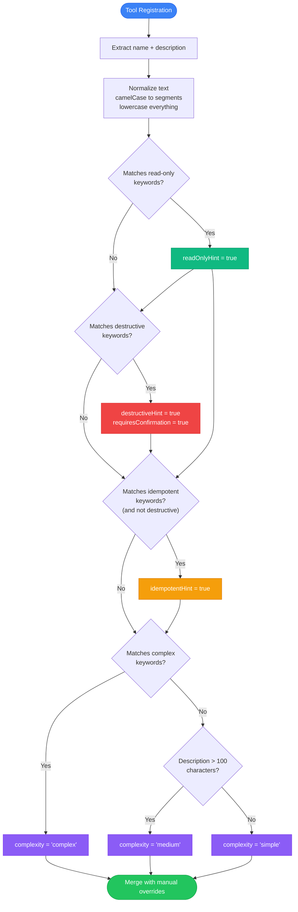
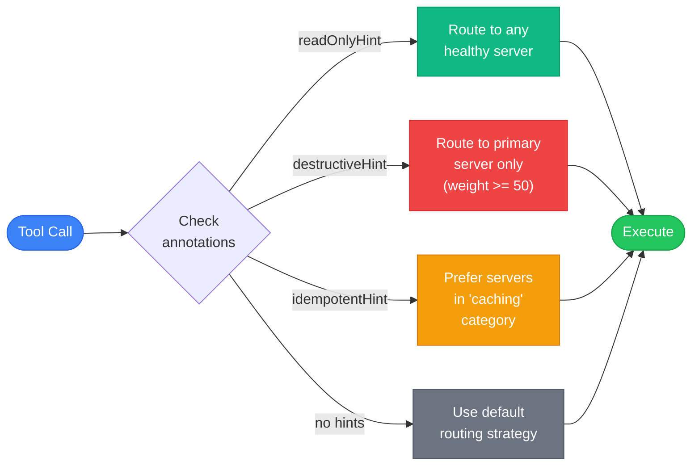
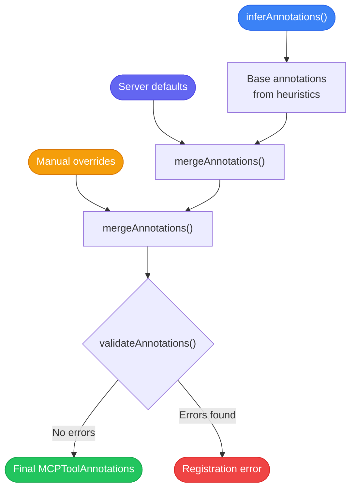

Every MCP tool your system connects to arrives with a name and a description. That is it. No metadata about whether the tool is safe to retry on failure, whether it modifies state, how long it typically takes, or whether a human should approve the call first. The MCP specification defines annotation fields for these hints, but most tool servers ship without them. That gap between what routing needs and what tools provide is the problem NeuroLink's auto-inference engine solves.

You will never manually annotate a tool again. NeuroLink inspects every tool definition at registration time, applies keyword heuristics and structural analysis to infer behavioral metadata, and attaches that metadata as annotations. Those annotations then drive routing decisions, caching policies, retry logic, and confirmation flows -- all without a single line of configuration from you.

This post walks through the full pipeline: the metadata gap, the inference algorithm, every annotation type, and how each downstream system consumes annotations in production.

## The metadata gap in MCP tooling

The MCP 2024-11-05 specification introduced tool annotations as optional hints. The specification defines fields like `readOnlyHint`, `destructiveHint`, `idempotentHint`, and `requiresConfirmation`. In practice, most MCP servers omit these fields entirely. A tool named `deleteUser` with the description "Delete a user account permanently" arrives with no `destructiveHint: true`, no `requiresConfirmation: true`, and no safety metadata at all.

This creates three problems downstream:

1. **Routing cannot prioritize**. Without knowing whether a tool is read-only or destructive, the router treats every tool call identically. A `listFiles` call gets the same routing weight as a `dropDatabase` call.
2. **Caching is blind**. Without idempotency hints, the cache layer cannot know which tool results are safe to reuse. It either caches everything (risking stale destructive results) or caches nothing (wasting compute on safe read operations).
3. **Error recovery is manual**. Without retry safety hints, the retry middleware cannot distinguish between a tool that is safe to call again and one that might duplicate a payment or delete additional records on retry.

```typescript
// What arrives from a typical MCP server
const rawTool = {
  name: "deleteUser",
  description: "Delete a user account permanently",
  inputSchema: {
    type: "object",
    properties: {
      userId: { type: "string" },
    },
    required: ["userId"],
  },
  // annotations: undefined  <-- the gap
};
```

NeuroLink closes this gap at registration time.

## The auto-inference algorithm

When a tool registers with NeuroLink -- whether from an MCP server discovery flow, a manual tool registry, or a tool converter -- the `inferAnnotations` function runs automatically. Here is how the algorithm works:



The algorithm processes tool names and descriptions through four sequential keyword matching phases. Each phase looks for specific patterns that indicate behavioral characteristics. The key design choice is that inference operates on both the tool name and the description, with word-boundary matching to avoid false positives.

### Word boundary matching

A naive substring check would match "get" inside "forget", "together", or "target". NeuroLink uses word-boundary-aware matching that handles three naming conventions:

```typescript
const matchesKeyword = (text: string, keyword: string): boolean => {
  // Standard word boundary match for space-separated descriptions
  if (new RegExp(`\\b${keyword}\\b`, "i").test(text)) {
    return true;
  }
  // Handle underscore, hyphen, and camelCase naming conventions
  // "deleteRecord" -> "delete_record" -> ["delete", "record"]
  const normalized = text
    .replace(/([a-z0-9])([A-Z])/g, "$1_$2")
    .toLowerCase();
  return normalized
    .split(/[_-]/)
    .some((segment) => segment === keyword.toLowerCase());
};
```

This means `deleteUser`, `delete_user`, `delete-user`, and "Delete a user account" all correctly match the "delete" keyword. The tool name `getTarget` matches "get" but not "target" as a destructive keyword, because the camelCase normalization splits it into `["get", "target"]` and matches against the read-only keyword list, not the destructive list.

## Annotation types: The complete taxonomy

NeuroLink infers and supports twelve annotation fields. Four come from the MCP specification. Eight are NeuroLink extensions that power advanced routing and observability.

### MCP specification annotations

The four core annotations from the MCP 2024-11-05 spec:

| Annotation | Type | Inferred From | Effect |
|-----------|------|---------------|--------|
| `readOnlyHint` | `boolean` | get, list, read, fetch, query, search, find, show, display, view, retrieve, check, inspect, look | Tool is freely callable for information gathering |
| `destructiveHint` | `boolean` | delete, remove, drop, destroy, clear, purge, erase, wipe, truncate, reset | Tool requires confirmation before execution |
| `idempotentHint` | `boolean` | set, update, put, upsert, replace (when not destructive) | Tool can be safely retried on failure |
| `requiresConfirmation` | `boolean` | Auto-set when `destructiveHint` is true | Triggers HITL confirmation flow |

### NeuroLink extension annotations

These eight additional fields extend the MCP model with operational metadata:

| Annotation | Type | Purpose |
|-----------|------|---------|
| `openWorldHint` | `boolean` | Tool operates on an unbounded set of resources |
| `tags` | `string[]` | Custom categorization labels for filtering |
| `estimatedDuration` | `number` (ms) | Expected execution time for timeout configuration |
| `rateLimitHint` | `number` (calls/min) | Rate limit guidance for throttling middleware |
| `costHint` | `number` | Relative cost units for budget-aware routing |
| `complexity` | `"simple" \| "medium" \| "complex"` | Inferred from keywords and description length |
| `auditRequired` | `boolean` | Whether execution must be logged for compliance |
| `securityLevel` | `"public" \| "internal" \| "restricted"` | Access control classification |

The `complexity` field is the only extension that gets auto-inferred. Keywords like "complex", "analyze", "process", "generate", "transform", "compute", and "calculate" trigger `complexity: "complex"`. Descriptions longer than 100 characters but without complex keywords get `complexity: "medium"`. Everything else gets `complexity: "simple"`. The remaining extension fields require manual specification or server-level defaults.

## How routing uses annotations

The tool router consults annotations when selecting which MCP server should handle a tool call. Annotation-based routing adds a safety-aware layer on top of the six standard routing strategies (round-robin, weighted, least-connections, category, capability, and affinity).



The routing rules are:

- **Read-only tools** route to any healthy server. Since these tools have no side effects, load balancing across all available servers maximizes throughput.
- **Destructive tools** route only to primary servers with a weight of 50 or higher. This prevents accidental execution on secondary or replica servers that might not have proper audit logging or rollback capabilities.
- **Idempotent tools** prefer servers in the "caching" category. Since the results are stable for the same input, routing to cache-enabled servers maximizes cache hit rates.

Here is how you query the router with annotation awareness:

```typescript
import { ToolRouter, createAnnotatedTool } from "@juspay/neurolink";

const router = new ToolRouter();

// Register servers with different weights and categories
router.registerServer({
  id: "primary-db",
  weight: 80,
  categories: ["database", "caching"],
});

router.registerServer({
  id: "replica-db",
  weight: 20,
  categories: ["database"],
});

// A destructive tool routes only to the primary server
const deleteResult = router.routeByAnnotation({
  name: "deleteUser",
  annotations: { destructiveHint: true },
});
// Returns: ["primary-db"] -- replica excluded (weight < 50)

// A read-only tool routes to any healthy server
const queryResult = router.routeByAnnotation({
  name: "queryUsers",
  annotations: { readOnlyHint: true },
});
// Returns: ["primary-db", "replica-db"] -- both eligible
```

## How caching uses annotations

The tool cache layer uses annotations to make three decisions: whether to cache a result, how long to keep it, and when to invalidate it.

Read-only tools with `readOnlyHint: true` are always eligible for caching. Their results depend only on the input parameters and do not change server state. The cache key is a hash of the tool name plus the serialized input parameters.

Idempotent tools with `idempotentHint: true` are cached with a shorter TTL. While the tool produces the same result for the same input, the underlying data may change between calls. A `updateUserPreferences` call is idempotent (calling it twice with the same preferences produces the same state), but the result of `getUserPreferences` may change after the update.

Destructive tools are never cached. A `deleteUser` result should never be served from cache -- the caller needs to know the current state, not a cached confirmation from a previous deletion.

```typescript
import { ToolCache, createAnnotatedTool } from "@juspay/neurolink";

const cache = new ToolCache({
  maxSize: 1000,
  strategy: "lru",
});

// Read-only tool: cached with full TTL (default 5 minutes)
const listTool = createAnnotatedTool({
  name: "listUsers",
  description: "List all users in the system",
  execute: async () => {
    return await db.query("SELECT * FROM users");
  },
});
// Inferred: { readOnlyHint: true, complexity: "simple" }
// Cache behavior: results cached for 5 minutes

// Destructive tool: never cached
const deleteTool = createAnnotatedTool({
  name: "deleteUser",
  description: "Delete a user account permanently",
  execute: async ({ userId }) => {
    return await db.query("DELETE FROM users WHERE id = $1", [userId]);
  },
});
// Inferred: { destructiveHint: true, requiresConfirmation: true }
// Cache behavior: results never cached
```

The cache layer also uses the `estimatedDuration` annotation to decide whether caching is worthwhile. A tool that takes 5 milliseconds to execute gets less benefit from caching than one that takes 5 seconds. When `estimatedDuration` exceeds a configurable threshold (default: 500ms), the cache layer prioritizes keeping that tool's results in the LRU eviction queue.

## How error recovery uses annotations

The retry middleware consults two annotation fields to decide whether a failed tool call should be retried automatically: `idempotentHint` and `readOnlyHint`.

```typescript
import { isSafeToRetry, createAnnotatedTool } from "@juspay/neurolink";

const queryTool = createAnnotatedTool({
  name: "searchDocuments",
  description: "Search documents by keyword",
  execute: async ({ query }) => {
    return await searchEngine.query(query);
  },
});
// Inferred: { readOnlyHint: true }
// isSafeToRetry(queryTool) => true

const paymentTool = createAnnotatedTool({
  name: "processPayment",
  description: "Process a payment transaction",
  execute: async ({ amount, recipient }) => {
    return await paymentGateway.charge(amount, recipient);
  },
});
// Inferred: { complexity: "complex" }  -- no read-only or idempotent hints
// isSafeToRetry(paymentTool) => false
```

The `isSafeToRetry` function returns `true` only when `idempotentHint` or `readOnlyHint` is set. A tool that matches neither -- like `processPayment` -- is never auto-retried. If the payment gateway returns a 500 error, the retry middleware surfaces the error to the caller rather than risking a duplicate charge.

For tools marked as safe to retry, the middleware uses exponential backoff with jitter. The `estimatedDuration` annotation, when present, sets the initial backoff interval. A tool that normally takes 3 seconds gets a longer initial backoff than one that normally takes 50 milliseconds.

The safety level classification provides a higher-level API for error recovery decisions:

```typescript
import { getToolSafetyLevel, createAnnotatedTool } from "@juspay/neurolink";

const tool = createAnnotatedTool({
  name: "truncateTable",
  description: "Truncate a database table, removing all rows",
  execute: async ({ table }) => {
    const ALLOWED_TABLES = ['cache', 'sessions', 'temp_data'];
    if (!ALLOWED_TABLES.includes(table)) {
      throw new Error(`Table '${table}' is not in the allowed list`);
    }
    return await db.query(`TRUNCATE TABLE ${table}`);
  },
});

const level = getToolSafetyLevel(tool);
// Returns: "dangerous"

// Safety level determines retry and confirmation behavior:
// "safe"      -> auto-retry on failure, no confirmation needed
// "moderate"  -> auto-retry with caution, optional confirmation
// "dangerous" -> never auto-retry, always require confirmation
```

## Manual overrides and annotation merging

Auto-inference is a starting point, not a final answer. You will encounter tools where heuristics produce incorrect annotations. A tool named `resetPagination` is not destructive -- it resets a cursor, not data. A tool named `getAndDelete` is destructive even though it starts with "get". Manual overrides let you correct these cases.

The `createAnnotatedTool` function merges manual annotations on top of inferred ones. Manual values always take precedence:

```typescript
import { createAnnotatedTool, mergeAnnotations } from "@juspay/neurolink";

// Override a false positive: "resetPagination" is not destructive
const paginationTool = createAnnotatedTool({
  name: "resetPagination",
  description: "Reset the pagination cursor to the beginning",
  annotations: {
    destructiveHint: false,       // Override: not actually destructive
    requiresConfirmation: false,  // Override: no confirmation needed
    readOnlyHint: true,           // Manual: this is effectively read-only
    idempotentHint: true,         // Manual: safe to retry
  },
  execute: async () => {
    cursor = 0;
    return { cursor: 0 };
  },
});

// The merge function handles tag arrays specially -- it merges instead of replaces
const merged = mergeAnnotations(
  { readOnlyHint: true, tags: ["data", "query"] },
  { idempotentHint: true, tags: ["safe", "cacheable"] },
);
// Result: { readOnlyHint: true, idempotentHint: true, tags: ["data", "query", "safe", "cacheable"] }
```

MCP server authors can also set server-level default annotations. When you extend the `MCPServerBase` class, the `defaultAnnotations` configuration applies to every tool registered on that server:

```typescript
import { MCPServerBase } from "@juspay/neurolink";

const server = new MCPServerBase({
  name: "analytics-server",
  description: "Read-only analytics and reporting tools",
  version: "1.0.0",
  category: "analytics",
  defaultAnnotations: {
    readOnlyHint: true,
    securityLevel: "internal",
    auditRequired: true,
  },
});

// Every tool on this server inherits the default annotations
server.registerTool({
  name: "queryMetrics",
  description: "Query application metrics",
  execute: async ({ query }) => {
    return await metricsDB.query(query);
  },
});
// Effective annotations: { readOnlyHint: true, securityLevel: "internal", auditRequired: true, complexity: "simple" }
```

The precedence order is: inferred annotations (lowest) -> server defaults -> tool-level manual annotations (highest).



## Annotation validation

NeuroLink validates annotations for logical consistency. Conflicting annotations produce validation errors that surface at registration time rather than at runtime.

```typescript
import { validateAnnotations } from "@juspay/neurolink";

// Detect conflicting annotations
const errors = validateAnnotations({
  readOnlyHint: true,
  destructiveHint: true,  // Conflict: cannot be both read-only and destructive
});
// Returns: ["Tool cannot be both readOnly and destructive - these are conflicting hints"]

// Detect invalid numeric values
const numericErrors = validateAnnotations({
  rateLimitHint: -5,          // Invalid: must be non-negative
  estimatedDuration: Infinity, // Invalid: must be finite
  costHint: NaN,              // Invalid: must be finite number
});
// Returns: [
//   "rateLimitHint must be a non-negative number",
//   "estimatedDuration must be a non-negative number",
//   "costHint must be a non-negative number"
// ]

// Detect invalid tags
const tagErrors = validateAnnotations({
  tags: ["valid-tag", "", "another-valid-tag"],  // Empty string is invalid
});
// Returns: ["All tags must be non-empty strings"]
```

Run validation as part of your test suite to catch annotation issues before deployment. The `createAnnotatedTool` function does not automatically validate -- call `validateAnnotations` explicitly for strict checking.

## Testing annotations

Annotation inference is deterministic. Given the same tool name and description, `inferAnnotations` always returns the same result. This makes testing straightforward.

```typescript
import { inferAnnotations, createAnnotatedTool, getToolSafetyLevel, isSafeToRetry } from "@juspay/neurolink";

// Unit test: verify inference for read-only tools
describe("inferAnnotations", () => {
  it("should infer readOnlyHint for query tools", () => {
    const annotations = inferAnnotations({
      name: "searchDocuments",
      description: "Search documents by keyword",
    });
    expect(annotations.readOnlyHint).toBe(true);
    expect(annotations.destructiveHint).toBeUndefined();
    expect(annotations.complexity).toBe("simple");
  });

  it("should infer destructiveHint for delete tools", () => {
    const annotations = inferAnnotations({
      name: "deleteUser",
      description: "Delete a user account permanently",
    });
    expect(annotations.destructiveHint).toBe(true);
    expect(annotations.requiresConfirmation).toBe(true);
  });

  it("should not match keywords inside other words", () => {
    const annotations = inferAnnotations({
      name: "forgetPassword",
      description: "Send a password reset link to the user",
    });
    // "forget" contains "get" but word boundary check prevents a match
    // "reset" in the description DOES match destructive keywords
    expect(annotations.destructiveHint).toBe(true);
  });

  it("should handle camelCase tool names correctly", () => {
    const annotations = inferAnnotations({
      name: "getUserProfile",
      description: "Returns the profile for a given user ID",
    });
    expect(annotations.readOnlyHint).toBe(true);
  });
});

// Integration test: verify end-to-end annotation flow
describe("createAnnotatedTool", () => {
  it("should merge inferred and manual annotations", () => {
    const tool = createAnnotatedTool({
      name: "resetCounter",
      description: "Reset a counter to zero",
      annotations: {
        destructiveHint: false,  // Override inference
        idempotentHint: true,    // Manual addition
      },
      execute: async () => ({ count: 0 }),
    });

    expect(tool.annotations?.destructiveHint).toBe(false);
    expect(tool.annotations?.idempotentHint).toBe(true);
    expect(getToolSafetyLevel(tool)).toBe("moderate");
    expect(isSafeToRetry(tool)).toBe(true);
  });
});
```

## Enhanced tool discovery with annotations

The `EnhancedToolDiscovery` class connects auto-inference to multi-server environments. When you discover tools from an MCP server, annotations are inferred automatically and attached to every tool in the discovery result.

```typescript
import { EnhancedToolDiscovery, filterToolsByAnnotations } from "@juspay/neurolink";

const discovery = new EnhancedToolDiscovery();

// Discover tools from a server -- annotations are auto-inferred
const result = await discovery.discoverToolsWithAnnotations(
  "github-server",
  mcpClient,
  10000, // timeout in ms
);

// Search tools with annotation-based filtering
const readOnlyTools = discovery.searchTools({
  annotations: { readOnlyHint: true },
  sortBy: "name",
  limit: 20,
});

// Get tools grouped by safety level
const safeTools = discovery.getToolsBySafetyLevel("safe");
const dangerousTools = discovery.getToolsBySafetyLevel("dangerous");

// Get all tools requiring human confirmation
const confirmationRequired = discovery.getToolsRequiringConfirmation();

// Filter with custom predicates
const auditableDestructive = filterToolsByAnnotations(
  discovery.getAllTools(),
  (annotations) =>
    annotations.destructiveHint === true &&
    annotations.auditRequired === true,
);

// Listen for annotation events
discovery.on("toolDiscovered", ({ serverId, toolName, annotations }) => {
  console.log(`Discovered ${toolName} on ${serverId}: ${JSON.stringify(annotations)}`);
});

discovery.on("annotationsUpdated", ({ serverId, toolName, annotations }) => {
  console.log(`Updated annotations for ${toolName}: ${JSON.stringify(annotations)}`);
});
```

The discovery class also exposes a `getStatistics` method that provides aggregate annotation data across all registered servers:

```typescript
const stats = discovery.getStatistics();
// {
//   totalTools: 47,
//   byServer: { "github-server": 12, "db-server": 8, ... },
//   byCategory: { "version-control": 12, "database": 8, ... },
//   bySafety: { safe: 22, moderate: 18, dangerous: 7 }
// }
```

## Production patterns

### Pattern 1: Annotation-driven HITL confirmation

Combine annotations with the HITL middleware to automatically trigger confirmation for dangerous tools without maintaining a separate allowlist:

```typescript
import { requiresConfirmation, createAnnotatedTool } from "@juspay/neurolink";

const neurolink = new NeuroLink({
  hitl: { enabled: true, timeout: 30000 },
});

// Before executing any tool, check if confirmation is needed
async function executeWithAnnotationCheck(tool, params) {
  if (requiresConfirmation(tool)) {
    const approved = await requestHumanApproval({
      toolName: tool.name,
      params,
      reason: `Tool has destructiveHint=${tool.annotations?.destructiveHint}`,
    });
    if (!approved) {
      return { error: "Execution rejected by human reviewer" };
    }
  }
  return await tool.execute(params);
}
```

### Pattern 2: Cost-aware routing with annotations

Use the `costHint` and `complexity` annotations to route expensive tool calls to dedicated infrastructure:

```typescript
function routeByAnnotationCost(tool, servers) {
  const cost = tool.annotations?.costHint ?? 0;
  const complexity = tool.annotations?.complexity ?? "simple";

  if (complexity === "complex" || cost > 100) {
    return servers.filter((s) => s.categories.includes("high-compute"));
  }
  return servers.filter((s) => s.healthy);
}
```

### Pattern 3: Audit logging with security levels

Use the `securityLevel` and `auditRequired` annotations to determine logging granularity:

```typescript
function logToolExecution(tool, params, result) {
  const level = tool.annotations?.securityLevel ?? "public";
  const audit = tool.annotations?.auditRequired ?? false;

  if (audit || level === "restricted") {
    // Full audit log: tool name, params, result, user, timestamp
    auditLogger.log({ tool: tool.name, params, result, level });
  } else if (level === "internal") {
    // Partial log: tool name, timestamp only
    logger.info(`Executed ${tool.name}`);
  }
  // Public tools: standard metrics only
}
```

## Annotation summary for observability

The `getAnnotationSummary` function produces human-readable strings for dashboards, logs, and debugging output:

```typescript
import { getAnnotationSummary } from "@juspay/neurolink";

const summary = getAnnotationSummary({
  title: "Delete User Account",
  destructiveHint: true,
  requiresConfirmation: true,
  complexity: "simple",
  estimatedDuration: 250,
  tags: ["user-management", "admin"],
});
// Output: "[Delete User Account | DESTRUCTIVE | requires confirmation | simple complexity | ~250ms | tags: user-management, admin]"

// For tools with no annotations
const emptySummary = getAnnotationSummary({});
// Output: "[no annotations]"
```

These summaries appear in NeuroLink's OpenTelemetry spans, making it straightforward to identify why a specific tool call was routed to a particular server or why retry was or was not attempted.

## Conclusion

NeuroLink's tool annotation auto-inference converts the sparse metadata that MCP tools provide into rich behavioral hints that drive routing, caching, retry, and confirmation decisions. The `inferAnnotations` function applies keyword heuristics with word-boundary awareness to avoid false positives. Manual overrides let you correct any inference mistakes through a clear precedence chain: inferred -> server defaults -> tool-level overrides. Validation catches logical conflicts before they reach production.

The key takeaway is that annotations are not documentation -- they are operational metadata that changes how your system behaves. A single `destructiveHint: true` annotation prevents a tool from being auto-retried, excludes it from caching, routes it to primary servers only, and triggers human confirmation. That is a significant amount of behavioral change from one boolean field, and NeuroLink infers it automatically from the word "delete" in a tool name.

For the routing strategies that consume annotations, see [Advanced MCP: Tool Routing, Caching, and Batching Strategies](/posts/advanced-mcp-routing-caching-batching/). For the discovery system that auto-infers annotations at registration time, see [MCP Auto-Discovery: Finding and Registering Tools at Runtime](/posts/mcp-auto-discovery-elicitation/). For the foundational MCP integration that this system builds on, see [MCP Tools: Extending AI with External Capabilities](/posts/mcp-tools-integration/).

---

**Related posts:**

- [Advanced MCP: Tool Routing, Caching, and Batching Strategies](/posts/advanced-mcp-routing-caching-batching/)
- [MCP Auto-Discovery: Finding and Registering Tools at Runtime](/posts/mcp-auto-discovery-elicitation/)
- [MCP Tools: Extending AI with External Capabilities](/posts/mcp-tools-integration/)
