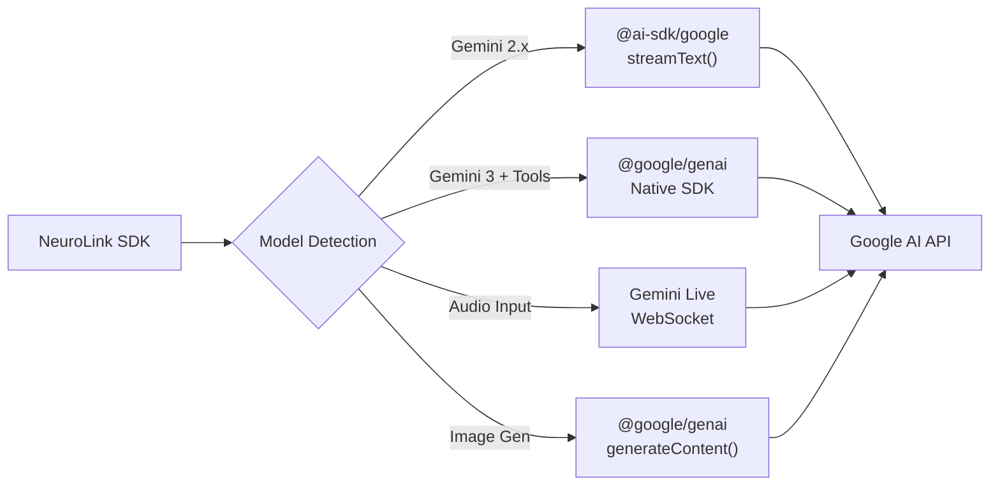
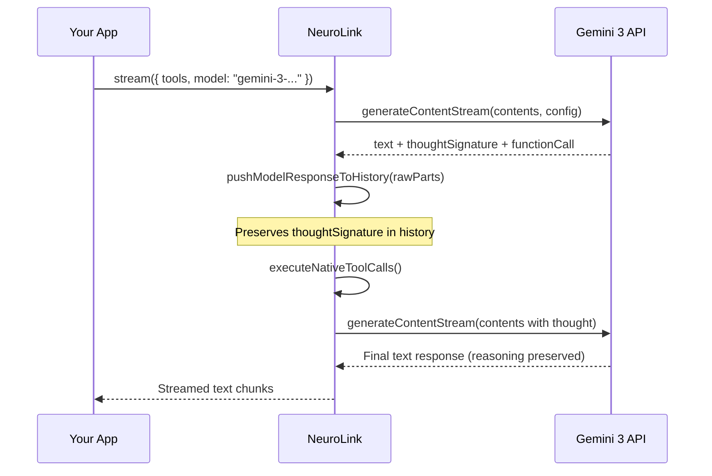
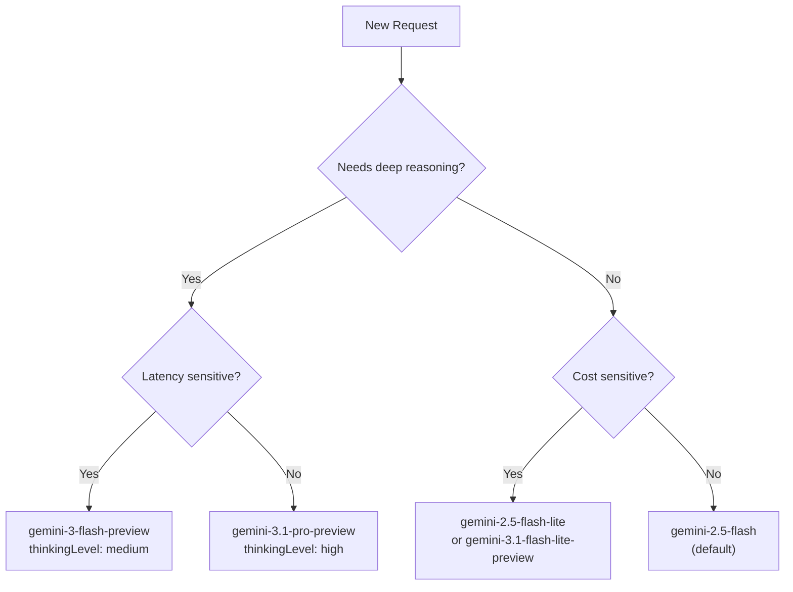

Google's Gemini 3 family introduces thought signatures, native streaming tool calls, and deeper multimodal understanding. NeuroLink integrates these capabilities natively -- bypassing OpenAI-compatible wrappers entirely -- through Google's `@google/genai` SDK for both AI Studio and Vertex AI.

By the end of this tutorial, you will have Gemini 3 running in your application with thought-signature-aware multi-turn conversations, streaming tool calls with retry tracking, and multimodal input spanning images, video, and documents.

---

## Why Native Instead of OpenAI-Compatible Wrappers

Most AI abstraction layers route Google model traffic through OpenAI-compatible endpoints. That works for basic text generation, but it strips away features that make Gemini 3 distinct:

- **Thought signatures** -- Gemini 3 returns a `thought_signature` in response parts that must be preserved across multi-turn tool-calling loops. OpenAI-compatible endpoints discard this.
- **Streaming tool calls** -- The native `@google/genai` SDK supports incremental streaming where text parts arrive as they are generated, even during agentic tool-calling loops.
- **Schema sanitization** -- Gemini's proto-based API does not support `anyOf`/`oneOf` unions or `additionalProperties`. NeuroLink sanitizes schemas automatically before sending them to the Google API.
- **Audio routing** -- Gemini Live provides bidirectional WebSocket audio streaming. There is no OpenAI-compatible equivalent.

NeuroLink uses a dual-SDK architecture to get the best of both worlds:



When you call `neurolink.stream()` with a Gemini 3 model and tools, NeuroLink automatically routes the request through the native SDK path. No configuration needed.

> **Note:** Model names and IDs in code examples reflect versions available at time of writing. Model availability, naming conventions, and pricing change frequently. Always verify current model IDs with your provider's documentation before deploying to production.
{: .prompt-info }

---

## Setup: Google AI Studio Path (API Key)

Google AI Studio is the fastest way to start. It requires one API key and no GCP project.

### Step 1: Get Your API Key

1. Visit [Google AI Studio](https://aistudio.google.com/)
2. Sign in with your Google account
3. Click **Get API Key** in the top navigation
4. Click **Create API Key**
5. Copy the generated key (it starts with `AIza`)

### Step 2: Configure NeuroLink

Add the key to your `.env` file:

```bash
GOOGLE_AI_API_KEY=AIza-your-api-key-here

# Optional: set default model to a Gemini 3 variant
GOOGLE_AI_MODEL=gemini-3-flash-preview
```

NeuroLink automatically maps `GOOGLE_AI_API_KEY` to the internal `GOOGLE_GENERATIVE_AI_API_KEY` variable, so either name works:

```typescript
import { NeuroLink } from '@juspay/neurolink';

const neurolink = new NeuroLink();

// Verify the connection
const result = await neurolink.generate({
  input: { text: 'Hello from Gemini 3!' },
  provider: 'google-ai',
  model: 'gemini-3-flash-preview',
});

console.log(result.content);
```

The provider name is `"google-ai"` (not `"google"` or `"google-ai-studio"`). The default model is `gemini-2.5-flash`, but you can override it globally with the `GOOGLE_AI_MODEL` environment variable or per-request with the `model` parameter.

> **Tip:** Google AI Studio offers one of the most generous free tiers: 15 requests per minute, 1M tokens per minute, and 1,500 requests per day. For development and prototyping, this is more than enough.
{: .prompt-tip }

---

## Setup: Vertex AI Path (Service Account)

For enterprise deployments that require SLA guarantees, VPC isolation, IAM policies, and data residency, use Vertex AI.

### Step 1: Create a GCP Service Account

```bash
# Create service account
gcloud iam service-accounts create neurolink-vertex \
  --display-name="NeuroLink Vertex AI"

# Grant Vertex AI User role
gcloud projects add-iam-policy-binding my-project \
  --member="serviceAccount:neurolink-vertex@my-project.iam.gserviceaccount.com" \
  --role="roles/aiplatform.user"

# Create key file
gcloud iam service-accounts keys create vertex-key.json \
  --iam-account=neurolink-vertex@my-project.iam.gserviceaccount.com
```

### Step 2: Configure NeuroLink

```bash
GOOGLE_VERTEX_PROJECT_ID=my-project
GOOGLE_VERTEX_LOCATION=us-central1
GOOGLE_APPLICATION_CREDENTIALS=/path/to/vertex-key.json
```

NeuroLink also supports inline credentials via `GOOGLE_SERVICE_ACCOUNT_KEY` or the pair `GOOGLE_AUTH_CLIENT_EMAIL` + `GOOGLE_AUTH_PRIVATE_KEY` for environments where file-based credentials are not practical (containerized deployments, serverless functions).

```typescript
import { NeuroLink } from '@juspay/neurolink';

const neurolink = new NeuroLink();
const result = await neurolink.generate({
  input: { text: 'Hello from Vertex AI!' },
  provider: 'vertex',
  model: 'gemini-3-flash-preview',
});

console.log(result.content);
```

The provider name for Vertex AI is `"vertex"` (not `"google-vertex"`). Both `google-ai` and `vertex` providers share the same native Gemini 3 code path through the shared `googleNativeGemini3.ts` module.

---

## Basic Generation with Gemini 3

The simplest use case is text generation. Here is a non-streaming call:

```typescript
import { NeuroLink } from '@juspay/neurolink';

const neurolink = new NeuroLink();

const result = await neurolink.generate({
  input: { text: 'Explain the difference between TCP and UDP in three sentences.' },
  provider: 'google-ai',
  model: 'gemini-3-flash-preview',
});

console.log(result.content);
// TCP guarantees ordered, reliable delivery through three-way handshake
// and retransmission. UDP sends datagrams without connection setup or
// delivery guarantees. Use TCP for correctness, UDP for speed.
```

For streaming responses (better UX for longer outputs):

```typescript
const stream = await neurolink.stream({
  input: { text: 'Write a technical overview of WebSocket protocols.' },
  provider: 'google-ai',
  model: 'gemini-3-flash-preview',
});

for await (const chunk of stream.stream) {
  if ('content' in chunk) {
    process.stdout.write(chunk.content);
  }
}
```

Both AI Studio and Vertex AI use the same streaming interface. The only difference is the `provider` string and the authentication method.

---

## Thought Signatures in Multi-Turn Conversations

Gemini 3 introduces **thought signatures** -- opaque tokens returned alongside model responses that represent the model's internal reasoning chain. When you preserve thought signatures across turns, the model maintains continuity of reasoning.

This matters most during multi-turn tool-calling loops. Without thought signatures, the model loses context about why it decided to call a specific tool, leading to redundant or incorrect tool calls.

### How NeuroLink Preserves Thought Signatures

NeuroLink's `pushModelResponseToHistory` function captures all raw response parts, including `thoughtSignature` parts, and appends them to the conversation history:



You do not need to manage thought signatures manually. NeuroLink handles this internally. But understanding the mechanism helps when debugging multi-turn conversations that produce unexpected tool call sequences.

### Configuring Thinking Levels

Gemini 3 models support configurable thinking depth through `thinkingConfig`:

```typescript
const result = await neurolink.stream({
  input: { text: 'Design a distributed rate limiter for a multi-region API gateway.' },
  provider: 'google-ai',
  model: 'gemini-3-flash-preview',
  thinkingConfig: {
    thinkingLevel: 'high', // minimal | low | medium | high
  },
});

for await (const chunk of result.stream) {
  if ('content' in chunk) process.stdout.write(chunk.content);
}
```

| Level | Token Budget | Best For |
|---|---|---|
| `minimal` | ~500 tokens | Simple queries, quick decisions |
| `low` | ~1K tokens | Light analysis, straightforward questions |
| `medium` | ~8K tokens | Code review, moderate complexity |
| `high` | ~24K tokens | Complex proofs, architecture design, multi-step reasoning |

> **Warning:** Higher thinking levels increase both latency and token consumption. Thinking tokens count toward your quota. Use `high` only when the task genuinely benefits from deep reasoning.
{: .prompt-warning }

For Gemini 2.5 models, the thinking configuration uses a token budget instead of levels:

```typescript
// Gemini 2.5 path -- thinkingBudget instead of thinkingLevel
const result = await neurolink.stream({
  input: { text: 'Analyze this legal document for compliance risks...' },
  provider: 'google-ai',
  model: 'gemini-2.5-pro',
  thinkingConfig: {
    thinkingBudget: 8000, // Token budget for thinking
  },
});
```

NeuroLink's `createNativeThinkingConfig` utility handles the conversion between these two formats based on the model version.

---

## Streaming Tool Calls

Gemini 3's native tool-calling path is where the integration really differentiates itself. NeuroLink converts Vercel AI SDK tool definitions to Google's `FunctionDeclaration[]` format and runs an agentic loop with retry tracking.

### The Agentic Loop

Here is the flow:

1. NeuroLink converts your tools from Zod schemas (or plain JSON Schema) to Gemini-compatible `FunctionDeclaration` objects via `buildNativeToolDeclarations`.
2. The first `generateContentStream` call sends the user prompt and tool declarations.
3. If the model returns `functionCall` parts, NeuroLink executes the matching tool via `executeNativeToolCalls`.
4. Tool results are appended to conversation history as `functionResponse` parts, along with the model's original response (including `thoughtSignature`).
5. The loop repeats until the model returns a text-only response (no tool calls) or the `maxSteps` limit is reached.

```typescript
import { z } from 'zod';
import { tool } from 'ai';
import { NeuroLink } from '@juspay/neurolink';

const neurolink = new NeuroLink();

const result = await neurolink.stream({
  input: { text: 'What is the current weather in Tokyo and what should I wear?' },
  provider: 'google-ai',
  model: 'gemini-3-flash-preview',
  tools: {
    getWeather: tool({
      description: 'Get current weather for a city',
      parameters: z.object({
        city: z.string().describe('City name'),
        units: z.enum(['celsius', 'fahrenheit']).default('celsius'),
      }),
      execute: async ({ city, units }) => {
        // Your weather API call here
        return { city, temperature: 22, condition: 'partly cloudy', units };
      },
    }),
  },
  maxSteps: 10,
});

for await (const chunk of result.stream) {
  if ('content' in chunk) process.stdout.write(chunk.content);
}
```

### Retry Tracking and Permanent Failures

NeuroLink tracks tool failures per tool name. After `DEFAULT_TOOL_MAX_RETRIES` failures (default: 3), the tool is marked as permanently failed. The model receives a structured error message telling it not to retry:

```json
{
  "error": "TOOL_PERMANENTLY_FAILED: The tool \"getWeather\" has failed 3 times...",
  "status": "permanently_failed",
  "do_not_retry": true
}
```

This prevents infinite loops where the model keeps calling a broken tool.

### Schema Sanitization

Gemini's proto-based API is stricter than OpenAI's JSON Schema support. NeuroLink's `sanitizeSchemaForGemini` function handles the differences automatically:

- `anyOf`/`oneOf` unions are collapsed to `string` type (the most permissive primitive)
- Nullable unions (`anyOf: [{type: "string"}, {type: "null"}]`) are converted to the non-null type with a `nullable: true` flag
- `$schema`, `additionalProperties`, and `default` keys are stripped
- Nested properties and array items are recursively sanitized

You do not need to modify your Zod schemas. NeuroLink converts them before sending to Google's API.

> **Note:** `$schema` fields are automatically removed from tool schemas before sending to Google's API for compatibility. NeuroLink handles this conversion internally.
{: .prompt-info }

---

## Multimodal Input: Images, Video, and Documents

Gemini 3 models accept text, images, video, audio, and PDF documents in the same request. NeuroLink's unified input format works across all providers:

### Image Analysis

```typescript
import { readFileSync } from 'fs';

const imageBuffer = readFileSync('./architecture-diagram.png');
const base64Image = imageBuffer.toString('base64');

const result = await neurolink.generate({
  input: {
    text: 'Describe the architecture shown in this diagram. Identify any potential bottlenecks.',
    images: [`data:image/png;base64,${base64Image}`],
  },
  provider: 'google-ai',
  model: 'gemini-3-flash-preview',
});

console.log(result.content);
```

### Video Analysis

```typescript
const result = await neurolink.generate({
  input: {
    text: 'Summarize the key events in this video and provide timestamps.',
    videos: ['data:video/mp4;base64,...'],
  },
  provider: 'google-ai',
  model: 'gemini-3-flash-preview',
});
```

### Document Processing

```typescript
const result = await neurolink.generate({
  input: {
    text: 'Extract the key terms and obligations from this contract.',
    documents: ['data:application/pdf;base64,...'],
  },
  provider: 'google-ai',
  model: 'gemini-3-flash-preview',
  thinkingConfig: { thinkingLevel: 'high' },
});
```

NeuroLink's `FileDetector` utility identifies file formats via magic byte signatures (PNG, JPEG, WebP, GIF, PDF, MP4) and routes them to the correct content type in the API request. You can pass raw base64 data URIs or file paths.

---

## Model Selection: Flash vs Pro vs Ultra

Gemini 3 comes in multiple variants. Choosing the right one depends on your latency, quality, and cost requirements.

| Model | Model ID | Strengths | Best For |
|---|---|---|---|
| **Gemini 3.1 Pro** | `gemini-3.1-pro-preview` | Deepest reasoning, highest quality | Complex analysis, proofs, architecture |
| **Gemini 3 Flash** | `gemini-3-flash-preview` | Fast with thinking, good balance | General tasks with reasoning |
| **Gemini 3.1 Flash Lite** | `gemini-3.1-flash-lite-preview` | Lowest cost, fastest | High-volume, cost-sensitive |
| **Gemini 2.5 Pro** | `gemini-2.5-pro` | Stable, 1M context | Production flagship |
| **Gemini 2.5 Flash** | `gemini-2.5-flash` | Default, fast | General purpose |

### Decision Flow



### Dynamic Model Selection

```typescript
function selectGeminiModel(task: {
  needsReasoning: boolean;
  latencySensitive: boolean;
  costSensitive: boolean;
}): string {
  if (task.needsReasoning) {
    return task.latencySensitive
      ? 'gemini-3-flash-preview'
      : 'gemini-3.1-pro-preview';
  }
  if (task.costSensitive) {
    return 'gemini-2.5-flash-lite';
  }
  return 'gemini-2.5-flash';
}

const model = selectGeminiModel({
  needsReasoning: true,
  latencySensitive: false,
  costSensitive: false,
});

const result = await neurolink.generate({
  input: { text: 'Prove that the halting problem is undecidable.' },
  provider: 'google-ai',
  model,
  thinkingConfig: { thinkingLevel: 'high' },
});
```

> **Tip:** For cost-sensitive production workloads, `gemini-2.5-flash-lite` offers the lowest per-token cost. For maximum quality with extended thinking, `gemini-3.1-pro-preview` is Google's most capable model. Start with `gemini-3-flash-preview` as a solid middle ground.
{: .prompt-tip }

---

## Switching Between Gemini and Other Providers

NeuroLink's provider abstraction means you can switch between Gemini, OpenAI, Anthropic, and any other supported provider by changing one string. Your tool definitions, input format, and streaming interface stay the same.

### Same Code, Different Provider

```typescript
import { z } from 'zod';
import { tool } from 'ai';
import { NeuroLink } from '@juspay/neurolink';

const neurolink = new NeuroLink();

const tools = {
  search: tool({
    description: 'Search the web',
    parameters: z.object({ query: z.string() }),
    execute: async ({ query }) => ({ results: [`Result for: ${query}`] }),
  }),
};

// Gemini 3 on AI Studio
const geminiResult = await neurolink.stream({
  input: { text: 'Search for the latest TypeScript release notes.' },
  provider: 'google-ai',
  model: 'gemini-3-flash-preview',
  tools,
});

// Same tools, same input, different provider
const claudeResult = await neurolink.stream({
  input: { text: 'Search for the latest TypeScript release notes.' },
  provider: 'anthropic',
  model: 'claude-sonnet-4-20250514',
  tools,
});
```

NeuroLink handles the schema conversion differences internally. Zod schemas are converted to Gemini's `FunctionDeclaration` format for Google providers and to Anthropic's tool format for Claude. You write tools once.

### Provider Failover

For production deployments, configure automatic failover between Gemini and another provider:

```typescript
const neurolink = new NeuroLink({
  providers: [
    {
      name: 'google-ai',
      priority: 1,
      config: { apiKey: process.env.GOOGLE_AI_API_KEY },
    },
    {
      name: 'anthropic',
      priority: 2,
      config: { apiKey: process.env.ANTHROPIC_API_KEY },
    },
  ],
  failoverConfig: { enabled: true },
});
```

If Gemini 3 returns a rate limit error or network failure, NeuroLink automatically retries with Claude. Your application code does not change.

---

## Putting It All Together

Here is a complete example that combines Gemini 3 native tool calling, thought signatures, and streaming in a single request:

```typescript
import { z } from 'zod';
import { tool } from 'ai';
import { NeuroLink } from '@juspay/neurolink';

const neurolink = new NeuroLink();

const result = await neurolink.stream({
  input: {
    text: 'Research the top 3 TypeScript ORMs, compare their performance benchmarks, and recommend one for a new project.',
  },
  provider: 'google-ai',
  model: 'gemini-3-flash-preview',
  thinkingConfig: { thinkingLevel: 'medium' },
  tools: {
    searchBenchmarks: tool({
      description: 'Search for performance benchmarks of a TypeScript ORM',
      parameters: z.object({
        orm: z.string().describe('ORM name (e.g., Prisma, Drizzle, TypeORM)'),
      }),
      execute: async ({ orm }) => {
        // Your benchmark data source
        return {
          orm,
          insertOpsPerSec: Math.floor(Math.random() * 10000),
          queryOpsPerSec: Math.floor(Math.random() * 50000),
          p99LatencyMs: Math.floor(Math.random() * 50),
        };
      },
    }),
    compareFeatures: tool({
      description: 'Compare features between ORMs',
      parameters: z.object({
        orms: z.array(z.string()).describe('List of ORM names to compare'),
      }),
      execute: async ({ orms }) => {
        return orms.map((orm) => ({
          name: orm,
          typeSafe: true,
          migrations: orm !== 'Drizzle' ? 'built-in' : 'kit-based',
          rawSQL: true,
        }));
      },
    }),
  },
  maxSteps: 15,
});

for await (const chunk of result.stream) {
  if ('content' in chunk) process.stdout.write(chunk.content);
}
```

The model will:

1. Think through which ORMs to research (thought signature generated)
2. Call `searchBenchmarks` for each ORM (streaming tool calls with retry tracking)
3. Call `compareFeatures` to get a feature matrix
4. Synthesize results into a recommendation (reasoning preserved via thought signatures)

All of this streams incrementally to your application through the `createTextChannel` mechanism -- text parts arrive as they are generated, not buffered until the full response completes.

---

## What's Next

You now have Gemini 3 running natively through NeuroLink with thought signatures, streaming tool calls, multimodal input, and automatic schema sanitization. Both AI Studio and Vertex AI paths share the same underlying native SDK integration.

Your next steps:

- **Explore multimodal pipelines:** Combine image analysis with tool calling for document processing workflows
- **Set up failover:** Configure Gemini 3 as your primary provider with Claude or GPT as fallback
- **Tune thinking levels:** Start with `medium` and adjust based on your quality-latency tradeoff
- **Move to Vertex AI:** When you outgrow AI Studio's free tier, switch to Vertex AI by changing one environment variable and adding a service account

---

**Related posts:**

- [Google AI Studio: Free-Tier Gemini Access with NeuroLink](/posts/google-ai-studio-gemini-integration/)
- [The Multi-Model Future: Why No Single AI Provider Will Win](/posts/multi-model-future/)
- [The AI Nervous System: How NeuroLink Routes Intelligence](/posts/ai-nervous-system-architecture/)
